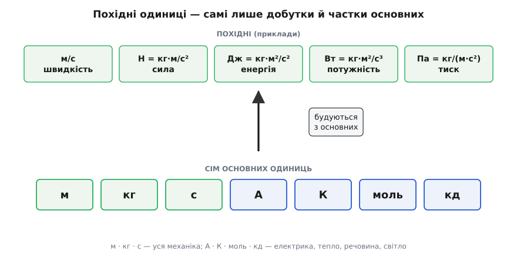
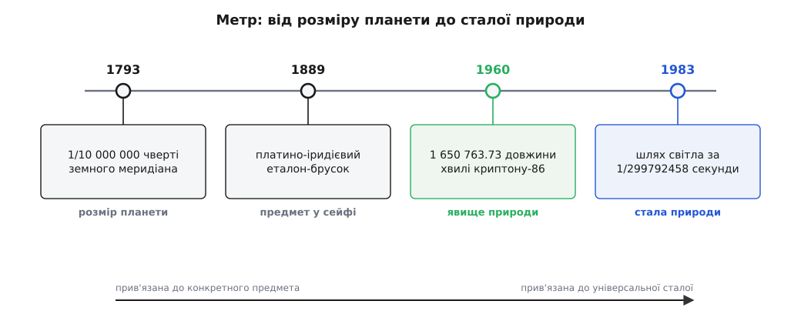
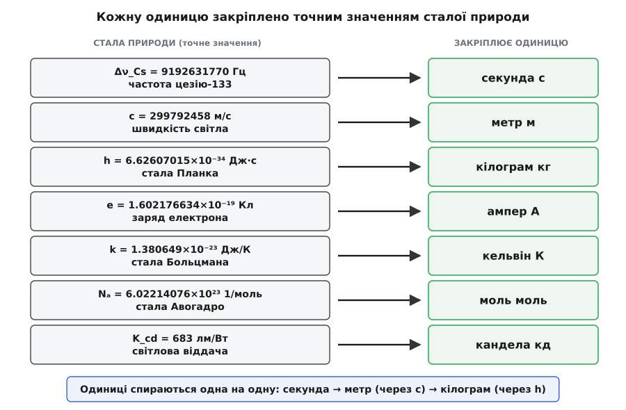

# Базові одиниці СІ: сім чисел, на яких тримається виміряний світ

<preknowlist>
- [Швидкість](topic:physics/velocity) — відношення пройденого шляху до часу; сучасний метр означено саме через шлях, який світло долає за відрізок часу.
- [Частота](topic:physics/amplitude-frequency) — скільки коливань стається за секунду; на лічбі коливань однієї-єдиної частоти стоїть означення секунди.
</preknowlist>

Скажіть комусь «стіл завдовжки три з половиною» — і вас одразу перепитають: три з половиною чого? Голе число нічого не міряє. Виміряти велич — це порівняти її з чимось, узятим за взірець, і сказати, **скільки разів** той взірець у ній укладається. Тому кожен результат вимірювання — завжди дві речі нерозлучно: число і **одиниця**. «3.5 метра» означає рівно одне: метр уклався тут три з половиною рази. Заберіть одиницю — залишиться безґрунтовне число, від якого нікому нема користі.

Одразу постає незручне питання: а чий метр? Ще кілька століть тому кожне місто мало свій лікоть, свій фут, свій фунт — і той самий «фунт» у сусідньому містечку важив інакше. Поки міряють на око для себе, це терпимо. Але щойно люди починають торгувати через кордон, будувати спільну машину чи звіряти науковий дослід, різнобій одиниць стає стіною. Потрібен **один** взірець на всіх — та ще й такий, щоб будь-хто, будь-де й будь-коли міг його **відтворити** точно, не мандруючи по еталон до чужої столиці. Із цієї подвійної вимоги — спільність і відтворність — і виросла Міжнародна система одиниць, скорочено **СІ** (фр. *Système international d'unités*).

### Небагато взірців, з яких будується все

Перша спокуса — завести окремий еталон під кожну величину: свій для довжини, свій для швидкості, свій для сили, свій для енергії. Але швидко видно, що це марнотратство. Швидкість — це не щось незалежне від довжини й часу: це просто **довжина, поділена на час**. Маючи еталон метра й еталон секунди, ми вже вміємо міряти будь-яку швидкість, не заводячи жодного нового взірця, — у метрах за секунду. Так само сила зводиться до маси, довжини й часу, енергія — до сили й відстані, і так далі, ланцюжком.

Звідси проста й потужна ідея: обрати **маленький набір** справді незалежних величин, дати кожній свою одиницю — і всі інші **вивести** комбінуванням. Незалежні одиниці звуть **основними** (базовими), а зібрані з них — **похідними**. Виявляється, щоб охопити всю фізику й техніку, достатньо всього **семи** основних одиниць. Решта — тисячі похідних — це самі лише добутки й частки цих семи.

Для механіки — руху, сил, енергії — вистачає навіть трьох: метра, кілограма й секунди. Швидкість — м/с, прискорення — м/с², сила — кг·м/с², енергія — кг·м²/с². Уся класична механіка вміщується у ці три взірці, а до них додають ще чотири — для електрики, тепла, кількості речовини й світла.


*Основні одиниці — фундамент; кожна похідна (швидкість, сила, енергія, тиск, потужність) — лише добуток або частка основних. Нічого нового не вводиться: ват розкладається до кг·м²/с³, самих метра, кілограма й секунди.*

> 🔧 **Навіщо це.** Похідні одиниці підібрано так, щоб вони складалися з основних **без жодних перевідних множників** — це називають узгодженістю (когерентністю) системи. Підставте в будь-яку формулу метри, кілограми й секунди — і відповідь вийде в правильних похідних одиницях сама, без коефіцієнтів. Порівняйте зі старим різнобоєм: кінські сили, калорії, фунти на квадратний дюйм, дюйми ртутного стовпа — там кожен перехід тягне свій множник, і саме на цих множниках народжуються помилки. СІ прибирає їх геть.

### Сім основних одиниць

Ось вони, сім опор усієї метрології, з тим, що кожна міряє, і звідки взялася назва:

- **метр** (м) — довжину (гр. *métron* — міра);
- **кілограм** (кг) — масу (гр. *chílioi* — тисяча, плюс «грам»: тисяча грамів);
- **секунда** (с) — час (лат. *pars minuta secunda* — «друга мала частка» години, після першої — хвилини);
- **ампер** (А) — силу електричного струму (на честь французького фізика Андре-Марі Ампера);
- **кельвін** (К) — термодинамічну температуру (на честь британського фізика Вільяма Томсона, лорда Кельвіна);
- **моль** (моль) — кількість речовини, тобто число часток (нім. *Mol*, від *Molekül* — молекула);
- **кандела** (кд) — силу світла в даному напрямі (лат. *candela* — свічка).

Перші три вросли в щоденне життя, наступні три — у науку й техніку, а кандела стоїть трохи осібно: вона міряє світло **так, як його бачить людське око**, тож несе в собі відгомін нашої фізіології. Але принцип для всіх семи один: маючи ці одиниці, можна зібрати будь-яку іншу величину у фізиці.

Головне питання не в тому, **скільки** взяти основних одиниць (сім — вибір радше історичний і зручний, ніж єдино можливий), а в тому, **як** їх закріпити — так, щоб еталон не поплив і був однаково доступний усім. Саме тут за два століття сталася тиха революція.

### Коли еталон — це річ

Найочевидніший спосіб задати одиницю — виготовити взірцевий предмет і оголосити: **ось це** й є одиниця. Так і почали. Наприкінці XVIII століття, у розпал Французької революції, метр означили як одну десятимільйонну частку чверті земного меридіана — від екватора до полюса. Ідея була велична: узяти за основу саму планету, спільну для всіх, «на всі часи й для всіх народів». Геодезисти шість років міряли дугу меридіана між Дюнкерком і Барселоною, а тоді за результатом відлили платиновий брусок — і відтоді метром стала **його** довжина. Як народжувалася метрична система, чому мірялися саме за форму Землі й чим це мало не скінчилося, — [окрема історія](topic:physics/si-base-units/hist-metric-system.md).

Так само вчинили з кілограмом: 1889 року виготовили циліндр зі сплаву 90 % платини й 10 % іридію, заввишки й завширшки близько 39 мм, поклали під три ковпаки в сейф Міжнародного бюро мір і ваг під Парижем — і **його** маса стала кілограмом. Цей циліндр прозвали «Le Grand K» — Великий К.

Але еталон-річ несе в собі глибоку ваду, і вона поволі проступила. Такий предмет **один** (ну, кілька офіційних копій), лежить в **одному** місці; щоб виміряти масу з найвищою точністю, треба врешті звірити її саме з ним. Річ можна подряпати, вона вбирає з повітря забруднення, з неї злітають атоми — і маса поволі змінюється. За сто років Великий К розійшовся зі своїми ж копіями приблизно на 50 мікрограмів. І тут пастка, від якої нікуди дітися: **звірити сам еталон нема з чим**, бо він і є визначенням кілограма. Якби він схуд, то, за буквою означення, схуднув би не він — «поважчав» би весь усесвіт, а ми б навіть не знали, відносно чого. Стандарт, який неможливо перевірити, — хисткий ґрунт для точної науки.


*Метр за два століття: від чверті земного меридіана (1793) через платиновий еталон-брусок (1889) і довжину хвилі криптону (1960) до шляху світла за частку секунди (1983). Кожен крок відв'язує одиницю від конкретного предмета й прив'язує до дедалі відтворнішого явища природи.*

### Переворот: за еталон беруть сталу природи

Вихід підказала сама фізика. У природі є числа, що не змінюються **ніде й ніколи**: швидкість світла в порожнечі, заряд електрона, деякі сталі квантової теорії. Що, як зробити взірцем **не річ, а таку сталу**? Стала природи однакова в лабораторії в Києві й у Токіо, вчора й за тисячу років; її не треба стерегти в сейфі, її не можна впустити чи подряпати, і будь-яка лабораторія з належним приладом відтворить її **з нуля**. Це ідеальний еталон — рівно тому, що він не предмет.

Механіка перекладу проста, хоч і несподівана. Замість казати «одиниця дорівнює ось цьому предметові», кажуть: «ось цій сталій природи присвоюємо **точне** числове значення — назавжди, без похибки, — а одиниця нехай буде такою, щоб це число справджувалося». Першим так учинили з метром ще 1983 року: домовилися, що швидкість [світла](topic:physics/em-wave) дорівнює **точно** 299792458 метрів за секунду, — і відтоді метр перестав бути бруском, а став тим шляхом, який світло долає за 1/299792458 секунди. Секунду, своєю чергою, ще з 1967-го задають не рухом Землі, а лічбою коливань: беруть [частоту](topic:physics/amplitude-frequency) випромінювання атома цезію-133 (точно 9192631770 коливань на секунду) і відлічують стільки коливань — ось секунда.

20 травня 2019 року цей підхід довели до кінця: **усі сім** основних одиниць переозначили через сім закріплених сталих природи. Дату обрали не випадково — це річниця Метричної конвенції, підписаної 20 травня 1875 року сімнадцятьма державами; відтоді 20 травня святкують як Всесвітній день метрології. Ось ці сім сталих із їхніми точними, назавжди зафіксованими значеннями:


*Кожній одиниці відповідає точно закріплена стала: секунді — частота цезію Δν, метру — швидкість світла c, кілограму — стала Планка h, амперу — заряд електрона e, кельвіну — стала Больцмана k, молю — стала Авогадро Nₐ, канделі — світлова віддача K_cd. Одиниці не осібні: секунда лягає в основу метра (через c), а секунда з метром — в основу кілограма (через h).*

```
секунда  ← Δν_Cs = 9192631770 Гц            (частота цезію-133)
метр     ← c     = 299792458 м/с             (швидкість світла)
кілограм ← h     = 6.62607015×10⁻³⁴ Дж·с     (стала Планка)
ампер    ← e     = 1.602176634×10⁻¹⁹ Кл      (заряд електрона)
кельвін  ← k     = 1.380649×10⁻²³ Дж/К       (стала Больцмана)
моль     ← Nₐ    = 6.02214076×10²³ 1/моль    (стала Авогадро)
кандела  ← K_cd  = 683 лм/Вт                 (світлова віддача)
```

Придивіться, як гарно закриває це давню проблему кілограма. Стала Планка вимірюється в джоуль-секундах, а джоуль-секунда — це кг·м²/с. Метр і секунда вже закріплені (через c і Δν), тож, зафіксувавши число h, ми тим самим **пришпилюємо кілограм** — він більше ні від чого не залежить, окрім незмінних сталих. Тепер лабораторія відтворює кілограм не звіркою з циліндром, а приладом — терезами Кіббла, — що врівноважують механічну силу тяжіння точно виміряною електромагнітною силою й через квантові електричні еталони виводять масу зі сталої Планка. Великий К після 130 років служби пішов на спочинок, а кілограм став таким самим невмирущим, як швидкість світла. Докладний розбір самого переозначення 2019 року й того, як терези Кіббла ловлять кілограм зі сталої Планка, — [окрема тема](topic:physics/si-2019-redefinition).

> 🔧 **Навіщо це.** Уся сила нового підходу — у відтворності. Раніше національний інститут мір мусив тримати офіційну копію кілограма й раз на десятиліття возити її до Парижа на звірку. Тепер будь-яка лабораторія світу, зібравши терези Кіббла чи атомний годинник, реалізує одиницю **сама**, з тих самих сталих, — і результати збіжаться до кількох знаків після коми без жодної фізичної посилки одне одному еталонів. Одиниця перестала бути предметом, який можна втратити, і стала знанням, яке не втратиш.

### Похідні одиниці — самі лише добутки основних

Повернімося до того, з чого почали: усі похідні одиниці — це комбінації семи основних. Найкраще це видно, коли **розкласти** знайому одиницю до основних. Візьмімо ват — одиницю потужності.

**Ват через основні одиниці.**
```
Потужність — це робота за одиницю часу:
1 Вт = 1 Дж / 1 с

Джоуль — це робота, тобто сила на пройдений шлях:
1 Дж = 1 Н · 1 м

Ньютон — з другого закону Ньютона, F = m·a:
1 Н = 1 кг · 1 м/с² = 1 кг·м/с²

Підставляємо знизу вгору:
1 Дж = (кг·м/с²) · м = кг·м²/с²
1 Вт = (кг·м²/с²) / с   = кг·м²/с³
```

Ват виявився не новою сутністю, а всього-на-всього кг·м²/с³ — самими метром, кілограмом і секундою. Ньютон, джоуль, ват, паскаль, вольт — усі вони отак розкладаються до основних одиниць; красиві короткі назви дають лише заради зручності, щоб не писати щоразу довгий добуток. Означення ньютона, до речі, приховане в [другому законі Ньютона](topic:physics/newtons-second-law): ньютон — це сила, яка масі в один кілограм надає прискорення один метр за секунду в квадраті.

Цей розклад — не забавка. Він дає безкоштовну перевірку будь-якої формули: **обидві частини рівняння мусять мати однакові одиниці**. Якщо ліворуч виходять кілограми, а праворуч — метри за секунду, формула точно хибна, і шукати помилку не треба далеко.

**Чи сходиться E = m·c² за одиницями.**
```
Права частина:  [кг] · [м/с]² = кг · м²/с² = кг·м²/с²
Ліва частина:   [Дж]          = кг·м²/с²     (щойно вивели вище)

Одиниці збігаються ✓ — рівняння принаймні розмірно можливе.
```

Звісно, збіг одиниць не доводить, що формула правильна (він не спіймає, скажімо, забутий множник ½), але **незбіг** одразу викриває хибу. Цей прийом — аналіз розмірностей — інколи дозволяє навіть **вгадати** вигляд формули, не розв'язуючи задачі: якщо величина може залежати лише від кількох інших, часто є єдиний спосіб скласти з них потрібну одиницю. Як міряти розмірності як окрему алгебру, перевіряти нею рівняння й угадувати залежності — [математична вставка](topic:physics/si-base-units/math-dimensional-analysis.md).

### Навіщо світові одна система

За сухими означеннями ховається дуже практична річ: коли всі рахують в одних одиницях, числа різних людей і машин **стуляються без зайвих слів**. Інженер передає силу в ньютонах, програміст множить її на шлях у метрах — і дістає енергію в джоулях, не питаючи, «а в яких це одиницях». Уся система злагоджена так, що переходи між величинами не тягнуть перевідних множників.

І навпаки — що буває, коли одиниці переплутати, — показує одна дорога помилка. 1999 року міжвідомчий апарат утратив марсіанську станцію Mars Climate Orbiter: одна група програмного забезпечення видавала імпульс двигунів у фунт-силах на секунду, а інша читала ці числа як ньютон-секунди, не підозрюючи про різницю. Станція йшла до Марса з тихо накопичуваною похибкою й згоріла в атмосфері. Втратили її не через складну фізику, а через те, на чому стоїть уся ця стаття: **число без правильної одиниці — небезпечне**.

> 🔧 **Навіщо це.** У коді величини з одиницями варто не тримати голими числами, а позначати одиницю в самому типі даних — тоді спроба додати метри до секунд або сплутати ньютон-секунди з фунт-секундами не пройде далі компіляції, а не полетить на Марс. Як закодувати одиниці в типах і зловити такі помилки ще до запуску — [розбір із робочим кодом](topic:physics/si-base-units/proj-unit-safety.md).

Отже, вся будова тримається на кількох простих думках, покладених одна на одну. Виміряти — це порівняти з еталоном, тож результат завжди є число разом з одиницею. Незалежних одиниць достатньо взяти сім: решту вивести добутками й частками, без нових еталонів. А самі сім взірців розумніше прив'язати не до предметів, які течуть і губляться, а до сталих природи, однакових для всіх і незнищенних. Відтоді весь виміряний світ — від довжини стола до маси зорі — стоїть, зрештою, на семи закріплених числах.
