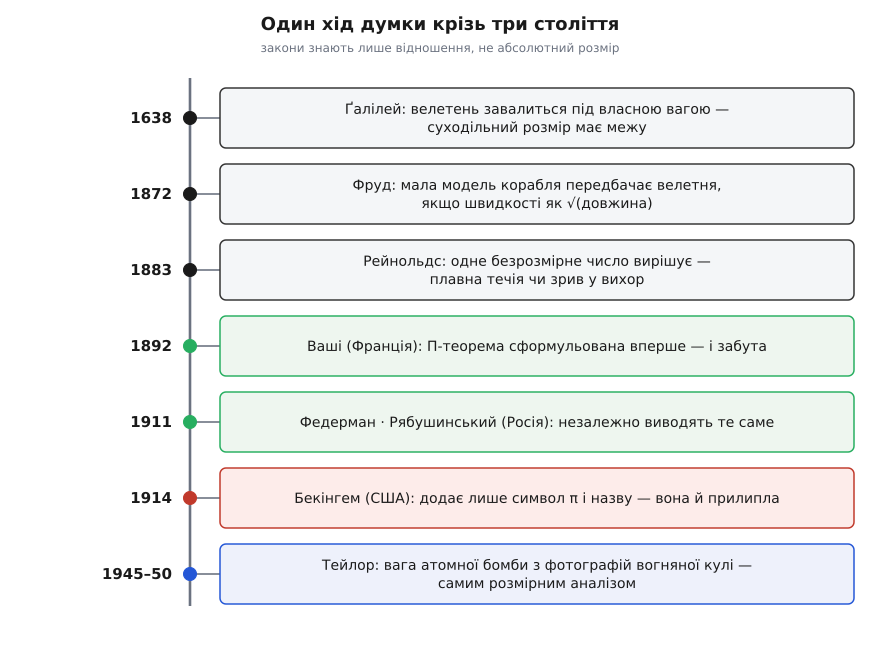
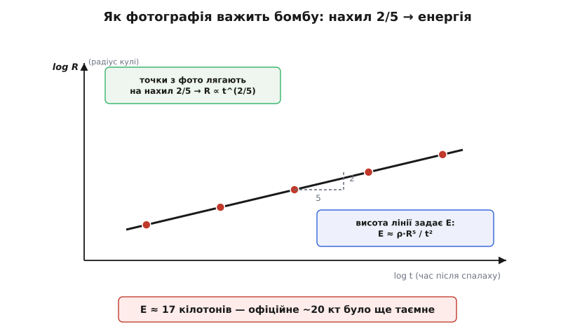

# 📜 Від кісток велетня до вогняної кулі

Є думки, які треба було винайти. Що Земля кругла, що кров тече по колу, що види змінюються — усе це колись довелося вперше подумати. Серед таких винайдених думок є одна тиха, майже непомітна, але з несподівано довгою рукою: **розмір сам собою — це фізичний факт**. Не «велике те саме, що мале, тільки більше», а щось інше — велике живе за іншими правилами, бо коли міняєш масштаб, різні сили розходяться в різні боки. Сьогодні це шкільна банальність. Триста років тому це був удар.

Ця стаття — про те, як народжувався окремий спосіб думати: **міркувати масштабом і подібністю**. Не про формули (їх достатньо в самій темі), а про людей, які по черзі помічали, що природа не має лінійки — у неї є лише пропорції, — і про те, як ця думка з філософської цікавинки виросла в інструмент, яким зрештою зважили атомну бомбу по фотографії. Дорога веде від кісток, намальованих ув'язненим стариганем, до вогняної кулі над пустелею Нью-Мексико. І, як не дивно, це одна й та сама дорога.

## Ґалілей і велетень, що завалиться під власною вагою

1638 рік. Ґалілео Ґалілей (Galileo Galilei) — старий, майже сліпий, під домашнім арештом в Арчетрі під Флоренцією: п'ять років тому інквізиція засудила його за Коперника. Друкуватися в Італії йому заборонено. Рукопис нишком переправляють на північ, і в протестантському Лейдені його видає дім Ельзевірів — «Бесіди й математичні докази щодо двох нових наук» (*Discorsi e dimostrazioni matematiche intorno a due nuove scienze*). Ця книга, а не гучні астрономічні суперечки, заклала фундамент механіки. І саме тут, на **Другому дні** бесід, коли мова заходить про міцність матеріалів, Ґалілей робить крок, якого до нього не робив ніхто: він застосовує геометрію до живого тіла.

Питання, яке його бентежить, звучить майже казково. Чому не буває велетнів? Чому природа не може взяти людину й просто збільшити її вдесятеро, зберігши всі пропорції? У казках велетні ходять; у природі — ні. Ґалілей відповідає холодно й точно. Якщо збільшити тварину, зберігши форму, її вага росте як куб розміру (бо вага йде за об'ємом), а міцність кісток — лише як квадрат (бо міцність тримається на площі поперечного перерізу). Вага обганяє опору. Настає розмір, за яким кістка ламається просто від власної ваги тіла.

```
вага (що тримати):     ∝ об'єм    ∝ L³
міцність (чим тримати): ∝ переріз ∝ L²
запас:                              ∝ 1 / L   — падає з розміром
```

Висновок Ґалілея, переказаний українською: щоб зберегти у велетня ті самі пропорції, що й у звичайної людини, довелося б або знайти для кісток твердший і міцніший матеріал, або змиритися, що велетень слабший, — бо якщо зростити його безмірно, він завалиться й розчавиться під власною вагою. А якщо все ж таки хотіти, щоб кістки витримали, їх доведеться так потовщити, що тварина стане потворою. Ось чому природа не може роздути тіло як завгодно: вона впирається в межу, яку диктує не біологія, а геометрія помножена на міцність.

Той самий хід одразу пояснює й зворотне — чому морські велетні бувають величезні. Кит важчий за будь-яку суходільну тварину, бо його вагу тримає не скелет, а вода. Ґалілей це помітив: витягни таку рибину на берег — і вона, каже він, розчавиться під власною масою, щойно втратить підпору води. Кістка, розрахована на плавучу вагу, на суходолі безпорадна.

Це виглядає як натурфілософське спостереження, та насправді тут сталося дещо більше. Ґалілей отримав **кількісне передбачення про живе** — чи не перше в історії біології: не «великі тварини кремезніші» (це бачив кожен мисливець), а *наскільки саме* й *чому неминуче*. Повсякденне обличчя його закону легко впізнати й досі. Порівняй масивну, майже колонну гомілку лося з тонкою, як олівець, ногою газелі: це не випадок породи, а точний наслідок квадратно-кубічного перекосу — велика тварина мусить платити за розмір непропорційно товстими кістками. Ґалілей побачив це в кабінеті, без жодного виміру, самою силою міркування про пропорції.

## Фруд: коли подібність стала передбаченням

Ґалілеїв здогад був **застереженням**: великого не можна безкарно роздути. Наступний крок перетворив те саме міркування на **подарунок** — і зробив це не філософ, а інженер, що бився над цілком приземленою задачею: як заздалегідь знати, скільки вугілля з'їсть корабель, якого ще не збудовано.

Вільям Фруд (William Froude, 1810–1879), англійський інженер і корабел, у 1860-х узявся за питання, від якого адміралтейство відмахувалося як від безнадійного: опір води рухові судна. Порахувати його з перших принципів не вдавалося нікому — течія навколо корпусу надто складна. Спробувати на справжньому кораблі — шалено дорого. Фруд зробив третє: вирішив тягнути в басейні **модель** і перерахувати результат на повний розмір. Але тут чигала пастка, об яку розбивалися попередники. Модель, зменшена копія, поводиться у воді *не так*, як оригінал: маленький корпус тягне за собою хвилі не тієї форми, і наївне множення «в стільки ж разів» дає нісенітницю.

Прозріння Фруда полягало в тому, що опір розпадається на дві різні речі — тертя об обшивку й **творення хвиль**, — і що хвильова частина підкоряється закону подібності. Дві геометрично подібні судини лишають однаковий за формою хвильовий слід тоді — і тільки тоді, — коли їхні швидкості відносяться як корінь із розмірів. Він назвав це **законом порівняння**:

```
однаковий візерунок хвиль  ⟺  v / √(g·L) — однакове
→ швидкість моделі ∝ √(довжина)
```

Ту безрозмірну величину v/√(gL) згодом назвуть **числом Фруда**, і рівність цих чисел стане умовою, за якої мала модель чесно показує велике судно. На початку 1870-х Фруд збудував у Торкі перший у світі буксирувальний басейн — довгий вузький канал із візком, що тягнув модель із рівномірною швидкістю, а опір зчитувався з розтягу пружини. У 1871-му він провів знамениті буксирування корвета «Ґрейгаунд» (*Greyhound*), звіривши модель зі справжнім кораблем, а 1874-го виклав метод перед британським Товариством корабельних інженерів. Скептики замовкли: басейн передбачав опір нового судна точніше, ніж будь-яка теорія.

Тут народилося те, чого не було в Ґалілея: **динамічна подібність як передбачувальний прилад**. Мала модель — це не іграшка й не ілюстрація, а чесна відповідь про велике, якщо зрівняти правильне безрозмірне число. Уся сучасна аеродинамічна труба й гідродинамічний басейн — прямі нащадки того каналу в Торкі.

> 🔧 **Навіщо це.** Фрудова ідея й досі — щоденний хліб інженера. Перш ніж різати метал на новий корпус, крило чи турбіну, його «продувають» або «тягнуть» у зменшеному вигляді, а тоді перераховують назад. Без закону подібності кожне таке випробування було б просто гарною картинкою, з якої не можна зробити жодного числа про справжню машину.

## Рейнольдс: одне число, що вирішує долю течії

Фруд знайшов *своє* число для хвиль на воді. Лишалося зрозуміти, що керує самою течією — тим, чи вона тече гладко, чи зривається в хаос. Це зробив Осборн Рейнольдс (Osborne Reynolds, 1842–1912), інженер і фізик, народжений 23 серпня 1842 року в Белфасті (тоді — у складі Британії), який усе життя пропрацював у Манчестері.

1883 року Рейнольдс поставив дослід, що став класикою простоти. Крізь довгу скляну трубу пускають воду, а в її серцевину — тонку цівку підфарбованої води. За малої швидкості барвник тягнеться рівною ниткою через усю трубу: течія **плавна** (ламінарна). Піднімаєш швидкість — і в певну мить нитка раптом розмивається, барвник вихорами розлітається по всьому перерізу: течія зірвалася в **турбулентність**. Рейнольдс показав, що момент зриву визначає не швидкість сама собою, не діаметр труби й не в'язкість окремо, а єдина безрозмірна їхня комбінація:

```
Re = ρ·v·L / μ     (інерція / вʼязке тертя)
```

Дві течії з однаковим Re — байдуже, вода це в тонкій трубці чи повітря навколо мосту — влаштовані **однаково**: той самий візерунок вихорів, той самий безрозмірний опір. Різні на око явища виявилися одним явищем у різному масштабі. Це поглиблювало Фрудову думку: подібність — не про рівність розмірів чи швидкостей, а про рівність **чистих чисел**, у яких сховано всю фізику.

> Щоб побачити, *чому* безрозмірне число взагалі може нести в собі фізику, варто знати, що будь-яке правильне рівняння мусить бути розмірно узгодженим — метри не дорівнюють секундам. Саме це обмеження й породжує безрозмірні комбінації як єдине, від чого залежить відповідь. Про сам метод — [розмірний аналіз](topic:math/dimensional-analysis).

Цікаво, що самого імені «число Рейнольдса» Рейнольдс не давав: він писав просто «R». Назву пустив у світ німець Арнольд Зоммерфельд (Arnold Sommerfeld) 1908 року, на Міжнародному конгресі математиків у Римі, — і відтоді вона прижилася всюди. Дрібниця, але показова: **число назвали не на честь того, хто вигадав назву, а на честь того, хто зробив діло**. З наступним героєм історії доля обійдеться рівно навпаки.

## Π-теорема та її справжні батьки

Досі кожне безрозмірне число знаходили руками, по одному, під конкретну задачу: Фруд — своє, Рейнольдс — своє. Напрошувалося загальне питання: **як знайти всі такі числа одразу?** Скільки їх для даної задачі й де гарантія, що поза ними шукати нема чого? Відповідь — те, що сьогодні звуть **теоремою Бекінгема (Π-теоремою)**: задача з n величин, збудованих із k незалежних розмірностей, зводиться рівно до n − k безрозмірних груп. Назва увічнила американця. Історія — ні. Бо батьків у цієї теореми було щонайменше троє, і жоден із них не Бекінгем.

Першим був **Еме Ваші** (Aimé Vaschy, 1857–1899), французький інженер-телеграфіст і викладач фізики. 1892 року у фаховому «Annales télégraphiques» він надрукував дві статті про закони подібності у фізиці та в електриці — і **сформулював та довів теорему повністю**, у загальному вигляді. А тоді сталося те, що частенько буває з ідеями, які випередили попит: наукова спільнота знизала плечима й забула. Майже двадцять років про розмірний аналіз ніхто помітно не згадував.

1911 року теорему перевідкрили — двоє незалежно один від одного, обидва в Росії. **Олександр Федерман** (Alexander Federman) виклав її в «Известиях Санкт-Петербурзького політехнічного інституту», у роботі про методи інтегрування рівнянь із частинними похідними. А **Дмитро Рябушинський** (Дмитро Рябушинський / Dimitri Riabouchinsky, 1882–1962) — прийшов до того самого з боку аеродинаміки. Рябушинський був постаттю яскравою: нащадок багатого московського купецького роду, він 1904 року на власні кошти й за допомогою Миколи Жуковського (Nikolai Zhukovsky) заснував під Москвою, у Кучиному, Аеродинамічний інститут — перший у Європі. Саме там, зважуючи, від чого залежить сила потоку, він самостійно вивів той самий загальний результат, що й Ваші за дев'ятнадцять років до нього. (Після революції Рябушинський, коротко відсидівши під арештом, виїхав до Франції, де й прожив решту життя, так і не взявши французького громадянства й до смерті лишившись із нансенівським паспортом. Але саму теорему він отримав ще в Росії, російським ученим.)

І лише **1914 року** до цього хору долучився американець **Едгар Бекінгем** (Edgar Buckingham, 1867–1940), фізик Національного бюро стандартів. У статті «Про фізично подібні системи» він зробив одну-єдину нову річ: увів для безрозмірних величин символ **πᵢ** і дав методу зручну назву. Не теорему — символ і назву. Про роботу Ваші він не знав зовсім; про роботу Рябушинського — знав. І що промовисто: у пізніших статтях **Бекінгем сам поступився пріоритетом Рябушинському**, чесно визнавши, що спирався на зроблене раніше. Це визнання нічого не змінило. Теорему й донині звуть його ім'ям.

Варто назвати речі точно, без прикрашання. Тут немає імперського привласнення в звичному сенсі — ніхто нічого не крав. Але є інша, тихіша несправедливість: **назва прилипла до останнього й найменш оригінального внеску**, а першовідкривачів — француза Ваші й росіян Федермана та Рябушинського — витіснила на поля підручника. Символ виявився видимішим за теорему. Тож коли пишуть «теорема Бекінгема», чесно тримати в пам'яті весь ланцюг: Ваші (1892) → Федерман і Рябушинський (1911) → і аж потім Бекінгем (1914), що дав їй ім'я.

> Формальний бік цієї машинерії — скільки саме груп виходить і як їх будувати — розібрано окремо: [теорема Бекінгема (Π-теорема)](topic:math/buckingham-pi-theorem). Тут важлива не техніка, а те, що з розсипу окремих «чисел» Фруда й Рейнольдса виріс загальний закон: безрозмірних комбінацій рівно стільки, скільки величин мінус незалежних розмірностей, і поза ними шукати марно.

## Тейлор зважує бомбу по фотографії

Тепер — кульмінація, заради якої варто було пройти весь цей шлях. Вона показує, наскільки далеко сягає скромне на вигляд міркування про розмірності, коли ним володіє майстер.

Джефрі Інґрам Тейлор (Geoffrey Ingram Taylor, 1886–1975), британський фізик, ще 1941 року в засекреченій роботі розв'язав задачу про **дуже сильний вибух** — про ударну хвилю, що розлітається від майже точкового джерела величезної енергії. Питання таке: як росте радіус R вогняної кулі з часом t, якщо вся справа тримається на трьох величинах — виділеній енергії E, часі t від спалаху й густині повітря ρ навколо? Тейлор не розв'язував страшну гідродинаміку в лоба. Він спитав розмірність: яка єдина комбінація E, t і ρ має розмірність довжини?

```
[E]  = кг·м²·с⁻²      (енергія)
[t²] = с²
[ρ]  = кг·м⁻³          (густина)

E·t²/ρ = (кг·м²·с⁻²)·(с²)·(м³·кг⁻¹) = м⁵
→ (E·t²/ρ)^(1/5) має розмірність метра ✓

звідси:  R ∝ (E·t²/ρ)^(1/5)
```

Комбінація одна, тож форма закону вимушена: радіус росте як корінь п'ятого степеня з E·t²/ρ. А тепер оберни цю рівність — і вона стає **вагами для енергії**. Виміряй радіус кулі R у якийсь відомий момент t, підстав відому густину повітря ρ — і енергія читається прямо:

```
E ≈ ρ · R⁵ / t²   × (безрозмірна стала ≈ 1)
```

1947 року армія США розсекретила зняту Джуліаном Маком (Julian Mack) серію фотографій вогняної кулі випробування «Трініті» — першого ядерного вибуху (16 липня 1945). Знімки пішли газетами й журналами світу (зокрема в *Life*), і — на щастя для Тейлора — на кожному стояла позначка часу й **шкала розміру**. Більшого йому й не треба було. Тейлор зчитав радіус кулі з кількох кадрів, наніс точки, перевірив, що вони справді лягають на закон R ∝ t^(2/5), і з нахилу та висоти лінії дістав енергію. Вийшло **близько 17 кілотонів** тротилу.

Офіційна потужність «Трініті» — близько 20 кілотонів — на той час іще була суворою державною таємницею. І тут з'явився англійський професор, який відкрито опублікував майже точне значення, вирахуване з газетних фотографій самою лише алгеброю розмірностей. У військових колах це викликало неабияке збентеження; Тейлора м'яко посварили за оприлюднення висновків. Секрет, який охороняли грифами й охороною, виказала звичайна лінійка на фотографії — в руках того, хто вмів думати масштабом.


*Один хід думки крізь три століття. Зелені ланки — справжні першовідкривачі Π-теореми (Ваші, потім незалежно Федерман і Рябушинський); червона — Бекінгем, що додав лише символ і назву, яка й прижилася. Синя вершина — Тейлор, який тим самим міркуванням зважив атомну бомбу.*

Тут потрібна чесність, якої вимагає сама тема. Той блискучий розв'язок про сильний вибух — не одноосібний. До нього незалежно й майже водночас дійшли троє: британець Тейлор (теорія — 1941, застосування до фото — близько 1950), американець угорського походження Джон фон Нейман (John von Neumann) у лос-аламоському звіті 1947-го й радянський математик Леонід Сєдов (Leonid Sedov), який опублікував самоподібний розв'язок 1946 року в «Доповідях АН СРСР». Тому в підручниках хвилю сильного вибуху й звуть потрійно — **Тейлора — фон Неймана — Сєдова**. Винахід ідеї майже ніколи не буває справою однієї людини чи однієї нації; історія масштабного мислення — не виняток.


*Радіус кулі проти часу в подвійно-логарифмічних осях. Точки з фотографій лягають на пряму нахилу 2/5 — це підтверджує закон R ∝ t^(2/5); а висота, на якій сидить пряма, задає енергію E. Так серія знімків зі шкалою перетворюється на число в кілотонах.*

## Що насправді відкрили всі ці люди

Пройдімо очима весь ланцюг. Ґалілей побачив, що велетень неможливий, — розмір має межу. Фруд перевернув це в передбачення — мала модель чесно показує велике. Рейнольдс знайшов число, що вирішує долю течії. Ваші, Федерман і Рябушинський дали загальний закон, скільки таких чисел буває взагалі. Тейлор — і поряд Сєдов та фон Нейман — довели цим методом енергію, яку не мали права знати. Люди різні, епохи різні, задачі несхожі — від оленячої кістки до ударної хвилі. А відкрили вони, по суті, одне й те саме, лише щоразу глибше:

**фізичні закони не знають абсолютного розміру — вони знають тільки відношення.**

У природи немає лінійки. Немає «великого» й «малого» самих собою — є лише пропорції сил, і коли ти зберігаєш потрібне безрозмірне число, крихітна модель і планетарний вибух виявляються тим самим явищем у різному масштабі. Навчитися це бачити — і означає навчитися думати масштабом. Дорога від Ґалілеєвих кісток до вогняної кулі — це історія одного погляду, який щоразу діставав усе далі, бо дивився не на розмір, а крізь нього.
