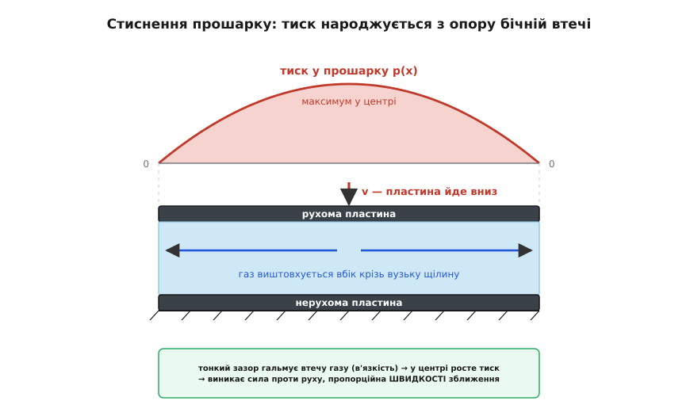
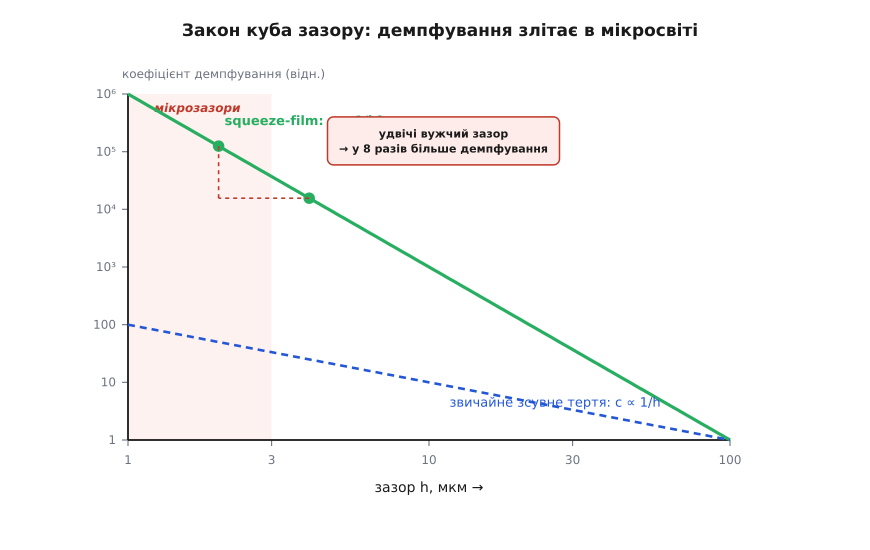
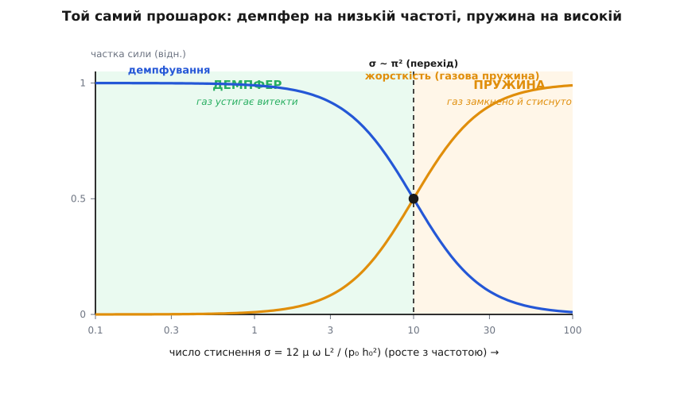
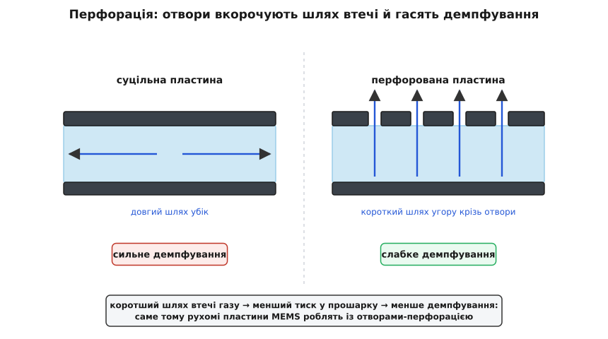

# Squeeze-film демпфування

<preknowlist>
- [В'язкість](book:physics/viscosity) — внутрішнє тертя рідини чи газу: опір, що виникає, коли сусідні шари ковзають один повз одного; коефіцієнт μ.
- [Загасний осцилятор](book:physics/damped-oscillator) — сила опору, пропорційна швидкості (−c·v), і що таке коефіцієнт демпфування c.
- [Рівняння стану ідеального газу](book:physics/ideal-gas-law) — зв'язок тиску, об'єму й температури; головне тут — що газ стисливий.
- [Добротність](book:physics/q-factor) — скільки енергії коливна система губить за цикл; чому втрати визначають «чистоту» резонансу.
</preknowlist>

Візьміть два гладеньких скляних квадратики, капніть між ними води й спробуйте швидко зсунути їх разом або рвучко відірвати. Опір несподівано впертий — так, ніби між шибками щось тримає. Нічого магічного там немає: рідині просто нема куди подітися вмить, і вона мусить протискатися геть крізь тонесеньку щілину, а це важко. Той самий опір — головна причина, чому втрачають енергію крихітні рухомі структури всередині вашого телефона: пружинка-маса в акселерометрі, вібрувальне кільце в гіроскопі, дзеркальце мікропроєктора, резонатор, що задає такт. Щойно дві поверхні опиняються за мікрометри одна від одної, а між ними газ, і починають зближатися чи розходитися — газ чинить опір. Це і є squeeze-film демпфування (англ. *squeeze* — вичавлювати, *film* — тонкий прошарок): демпфування, яке дає вичавлюваний тонкий прошарок середовища. Розберімо, ЧОМУ газ пручається — і чому він пручається так безглуздо сильно, коли зазор малий.

## Чому тонкий прошарок так опирається

Уявімо дві близькі поверхні, а між ними — тонкий шар газу. Опускаємо верхню на маленьку віддаль. Газ, що був у зазорі, не може ні зникнути, ні вмить стиснутися нанівець — йому лишається одне: **витекти вбік**, до відкритих країв. Але зазор тонкий, і протиснути газ крізь вузьку щілину важко: він треться об обидві стінки, а що щілина вужча, то більше стінки гальмують потік. Опір цьому бічному витіканню чинить [в'язкість](book:physics/viscosity) (лат. *viscosus* — липкий) — внутрішнє тертя газу. Там, де газ не встигає втекти, його **тиск росте** — найвищий у центрі (найдалі від будь-якого краю-виходу) і спадає до нуля на відкритих краях. Цей купол тиску штовхає верхню пластину вгору, проти її руху.

Ключове — від чого залежить сила. Що швидше ви тиснете, то більше газу мусить витекти за секунду, то крутіший потрібен перепад тиску, то вищий купол і то більша сила. Отже, **сила пропорційна швидкості зближення**, а не зміщенню. Це і є підпис демпфування: не пружина (та тягла б назад пропорційно зміщенню) і не сухе тертя (те дало б майже сталу силу незалежно від швидкості), а в'язкий опір, що росте зі швидкістю й **розсіює** енергію в тепло.



*Тиск народжується не з нічого, а з опору бічній втечі: центр прошарку — найдалі від виходу, тому там тисне найдужче.*

Аналогія з демпфером-амортизатором точна аж до кінця: як в [загасному осциляторі](book:physics/damped-oscillator), сила завжди спрямована **проти** руху. Розводьте пластини — і тиск у прошарку падає нижче атмосферного, газ «підсмоктує», опираючись розходженню так само, як опирався зближенню. Ламається аналогія лише в одному місці, і його варто тримати в голові: цей «демпфер» не завжди демпфер — на достатньо високій частоті той самий прошарок перетворюється на пружину, і чому саме, стане ясно з природи стисливого газу.

> 🔧 **Навіщо це.** У резонаторі MEMS демпфування — ворог: чим воно більше, тим гірша [добротність](book:physics/q-factor), тим глухіше «дзвенить» система й тим складніше зробити з неї точний годинник чи фільтр. А от в акселерометрі демпфування буває другом: воно гасить брязкіт пружинки-маси, щоб та не тремтіла після поштовху. У будь-якому разі squeeze-film — зазвичай найбільша складова втрат, і конструктор мусить уміти її передбачити, а не відкрити вже на готовому чипі.

## Куб зазору: чому це історія саме мікросвіту

Тепер найдраматичніше — НАСКІЛЬКИ сильно газ опирається. Сила залежить від зазору `h` приголомшливо круто: демпфування росте як **1/h³**. Чому саме куб?

Складаються дві причини, і обидві тягнуть в один бік, коли щілина тоншає. Перша: вужчий канал пропускає менше потоку за той самий поштовх. Витрата газу крізь плоску щілину заввишки `h` пропорційна `h³` — це результат течії в тонкому каналі, [течії Пуазейля](book:physics/poiseuille-flow). Один множник `h` — бо тонший канал має менший переріз; ще `h²` — бо стінки сильніше гальмують профіль швидкості (зсув на кожній стінці ~ швидкість/`h`). Разом `h · h² = h³`. Друга причина: щоб виштовхнути той самий об'єм крізь удвічі гірший канал, потрібен набагато крутіший перепад тиску — а це набагато вищий купол і набагато більша сила.

Помножте одне на друге — і вийде куб. Це не пологий схил, а урвище:

```
удвічі вужчий зазор  →  у 2³ = 8 разів більше демпфування
уп'ятеро вужчий      →  у 5³ = 125 разів
```



*Порівняйте нахили: коли пластини ковзають одна повз одну, тертя росте лише як 1/h; коли ж вони стискаються — як 1/h³. Мікросвіт живе на цьому урвищі.*

Саме цей куб робить squeeze-film демпфування явищем **мікросвіту**. При зазорі в міліметр воно мізерне; при зазорі в 2 мкм (у 500 разів менше) — сильніше в 500³ ≈ 10⁸ разів. Ось чому ніхто не переймається прошарком повітря між книжкою і столом, але кожен розробник MEMS переймається прошарком між рухомою масою й підкладкою за 2 мкм під нею.

> 🔧 **Навіщо це.** Зазор — найпотужніший важіль конструктора, бо куб множить будь-яку його зміну. Трохи ширший зазор — і демпфування обвалюється в рази. Тому перше, що роблять, коли треба підняти добротність, — відсувають рухому частину далі від сусідньої поверхні або взагалі прибирають підкладку з-під неї.

## Формула Стефана: конкретне число

Щоб побачити реальну величину, візьмімо класичну геометрію: два круглих диски радіуса `R`, зазор `h`, один наближається зі швидкістю `v = dh/dt`. Розв'язок течії в зазорі дає силу — саме цю формулу [вивів Йозеф Стефан ще 1874 року](book:physics/squeeze-film-damping/hist-squeeze-film.md), задовго до всякої мікроелектроніки:

```
F = (3π · μ · R⁴ / (2 · h³)) · v
```

**Умова.** Диски `R = 0.5 мм`, зазор `h = 2 мкм`, між ними повітря `μ = 1.8·10⁻⁵ Па·с`, зближення `v = 1 мм/с`.

```
R⁴ = (5·10⁻⁴)⁴ = 6.25·10⁻¹⁴ м⁴
h³ = (2·10⁻⁶)³  = 8·10⁻¹⁸ м³
3π/2 = 4.712

F = 4.712 · (1.8·10⁻⁵) · (6.25·10⁻¹⁴) / (8·10⁻¹⁸) · (1·10⁻³)
  = 5.30·10⁻²¹ / 8·10⁻¹⁸
  ≈ 6.6·10⁻⁴ Н  =  0.66 мН
```

**Висновок.** Півміліметровий диск, що повзе назустріч іншому геть неквапно — один міліметр за секунду, — зустрічає 0.66 мН опору. Це сила, здатна підняти близько 68 мг. Для такого крихітного й повільного руху в звичайнісінькому повітрі це величезно — і все воно береться з самого лише тонкого зазору. Зверніть увагу на `R⁴` поряд із `1/h³`: більша пласка площа й вужчий зазор роздмухують демпфування ще дужче, ніж підказує інтуїція. Звідки саме беруться ці степені — з [виведення через рівняння тонкої плівки](book:physics/squeeze-film-damping/math-reynolds-squeeze.md).

Та сама формула пояснює і зворотний бік: зробіть `v` від'ємною — відривайте диски — і сила стане опиратися розходженню, прошарок «присмоктує». Цей ефект (його звуть Стефановою адгезією) і є та сама впертість, з якою розходяться мокрі шибки. У мікросвіті він — в'язкий родич [залипання MEMS](book:electronics/stiction-mems): справжнє залипання тримають переважно капілярні й міжмолекулярні сили, але в'язкий squeeze-film додає до них хватку, що тим сильніша, чим швидше ви тягнете.

## Демпфер чи пружина?

Досі ми мовчки припускали, що газ просто витікає, — тобто поводиться як нестислива рідина. Але газ **стисливий** ([рівняння стану](book:physics/ideal-gas-law) нагадує, що тиск можна підняти, стиснувши об'єм). Що ж переможе — витікання чи стиснення? Це залежить від того, наскільки швидко ви тиснете **проти** того, наскільки швидко газ устигає втекти.

- **Повільне стиснення.** Газ має вдосталь часу вислизнути вбік. Він поводиться нестисливо, витікає, і вся робота йде у в'язкі втрати. Чистий **демпфер** — енергія розсіюється.
- **Швидке стиснення.** Газ не встигає втекти. Він **стискається на місці**, як повітря у шприці, коли ви затиснули носик пальцем. Стиснений газ штовхає назад у фазі зі зміщенням — тобто як **пружина**. А пружина енергію не палить, а накопичує й повертає. Тож на високій частоті прошарок перестає демпфувати й починає працювати пружною газовою подушкою.

Межу між цими двома світами тримає одне безрозмірне число — **число стиснення** (squeeze number) σ:

```
σ = 12 · μ · ω · L² / (p₀ · h₀²)
```

де ω — колова частота, `L` — розмір пластини, `p₀` — навколишній тиск, `h₀` — зазор. По суті σ порівнює час, потрібний газу на втечу, з періодом коливань:

```
σ ≪ 1   газ устигає витекти  →  ДЕМПФЕР
σ ≫ 1   газ замкнено          →  ПРУЖИНА
перехід — коли σ сягає порядку π² (≈ 10; точне число залежить від форми пластини)
```



*Один і той самий прошарок на низькій частоті гасить рух, а на високій — пружинить. Що вища частота, менший зазор чи нижчий тиск — то ближче до пружинного боку.*

**Умова.** Пластина MEMS `L = 200 мкм`, зазор `h₀ = 2 мкм`, повітря при атмосфері `p₀ = 101 325 Па`, `μ = 1.8·10⁻⁵ Па·с`, коливання на `f = 10 кГц` (ω = 2πf ≈ 6.28·10⁴ рад/с).

```
L²  = (2·10⁻⁴)² = 4·10⁻⁸ м²
h₀² = (2·10⁻⁶)² = 4·10⁻¹² м²

σ = 12 · (1.8·10⁻⁵) · (6.28·10⁴) · (4·10⁻⁸) / (101325 · 4·10⁻¹²)
  = 5.43·10⁻⁷ / 4.05·10⁻⁷
  ≈ 1.3
```

**Висновок.** σ ≈ 1.3 означає, що на 10 кГц ця плівка ще переважно демпфер, але стисливість уже почала домішувати пружність. Підніміть частоту (або опустіть тиск, або звузьте зазор) — і вона з'їде в бік пружини; нижче ж за кілька кілогерц це чистий демпфер. Одна й та сама конструкція, залежно від того, на якій частоті вона працює, дає то втрати, то додаткову жорсткість (а та ще й зсуває власну частоту резонатора) — тому σ рахують ще до того, як щось виготовляти.

## Чому це головний ворог MEMS — і як із ним боротися

Складімо докупи. Урвище `1/h³` плюс мікрометрові зазори означають одне: для майже будь-якої рухомої структури [MEMS](book:electronics/mems) із сусідньою поверхнею squeeze-film — зазвичай **найбільше** джерело втрат енергії. Воно ставить стелю добротності резонаторам, гасить пружинку-масу [акселерометра](book:electronics/accelerometer) й вібрувальну структуру [гіроскопа](book:electronics/gyroscope), визначає, чи швидко заспокоїться після повороту мікродзеркальце. З фізики прошарку прямо випливають і способи його приборкати.

**Перфорація.** Тиск високий тому, що газ мусить долати довгий шлях до далекого краю. Пробийте в пластині отвори — і газ вислизатиме **вгору крізь найближчу дірку**: шлях короткий, тиск малий, демпфування падає в рази. Ось чому рухомі пластини MEMS завжди помережані отворами (вони заразом допомагають і на етапі витравлювання, коли пластину звільняють від підкладки, — але виграш саме в демпфуванні величезний).



*Отвори не «випускають зайве повітря» — вони вкорочують шлях втечі, а отже, зрізають той самий купол тиску, що й породжує демпфування.*

**Ширший зазор** — прямий важіль куба: трохи відсунули поверхні, і `1/h³` обвалює опір.

**Нижчий тиск.** І σ, і сама в'язка сила спадають, коли газу менше. Резонатори у вакуумній упаковці сягають дуже високої добротності саме тому, що стискати майже нема чого. (На дуже низькому тиску, щоправда, вмикається інший механізм — розріджене молекулярне демпфування, — але він набагато слабший.)

**Розрідження на субмікронних зазорах.** Коли зазор наближається до [довжини вільного пробігу](book:physics/mean-free-path) молекул газу (у повітрі при атмосфері це ≈ 68 нм — середня відстань, яку молекула пролітає між зіткненнями), газ перестає бути гладким суцільним середовищем. Він «прослизає» вздовж стінок, його ефективна в'язкість падає, і реальне демпфування виходить помітно **слабшим**, ніж пророкує суцільна формула. Для зазорів у сотні нанометрів цю поправку конче треба враховувати, інакше передбачення промахнеться в рази.

Уся тема тримається на одній картинці — тонкий замкнений газ силкується забратися з дороги, а йому не дають. З неї випливає геть усе: тиск, що наростає (звідки сила), крутизна куба зазору (чому це мікросвіт), роздвоєння на демпфер і пружину (від чого залежить, який бік узяв гору) і способи боротьби (вкоротити шлях втечі, розширити зазор, прибрати газ). Коли з формул треба зробити робочий інструмент — прогнати зазор, тиск і частоту й одразу побачити коефіцієнт демпфування, жорсткість та стелю добротності, — усе це [зводиться в невеликий калькулятор](book:physics/squeeze-film-damping/proj-squeeze-calculator.md).
