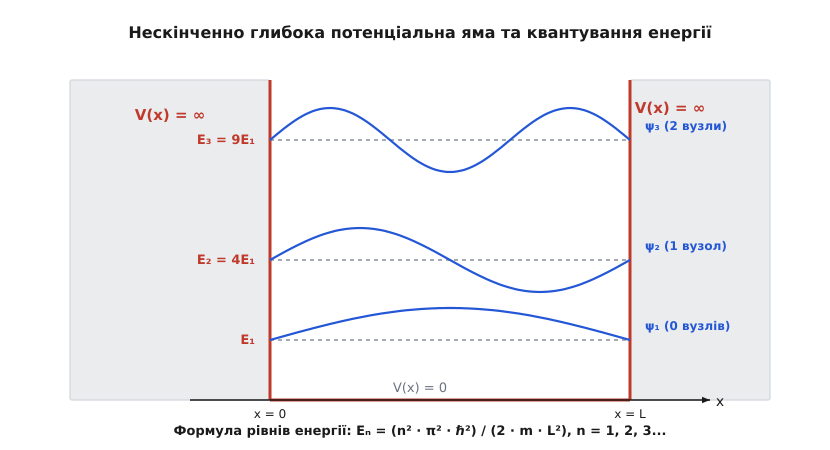
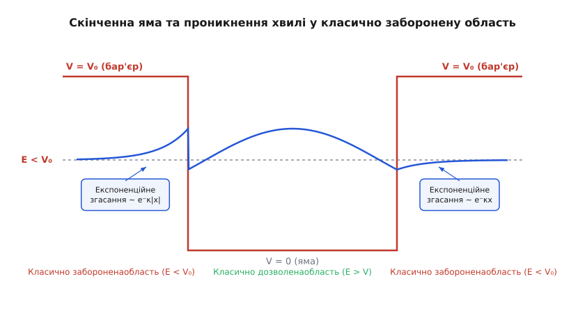
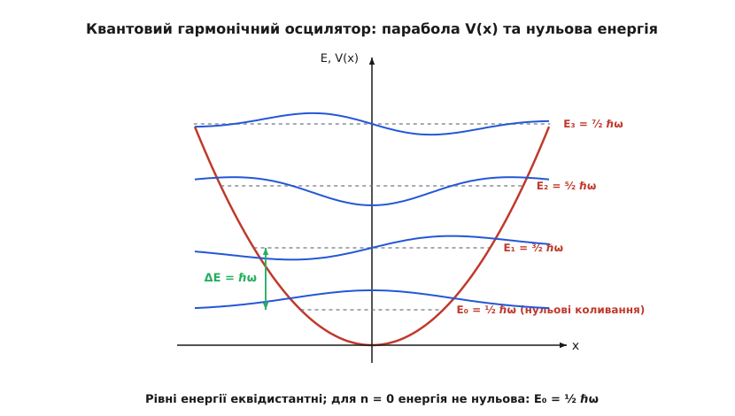
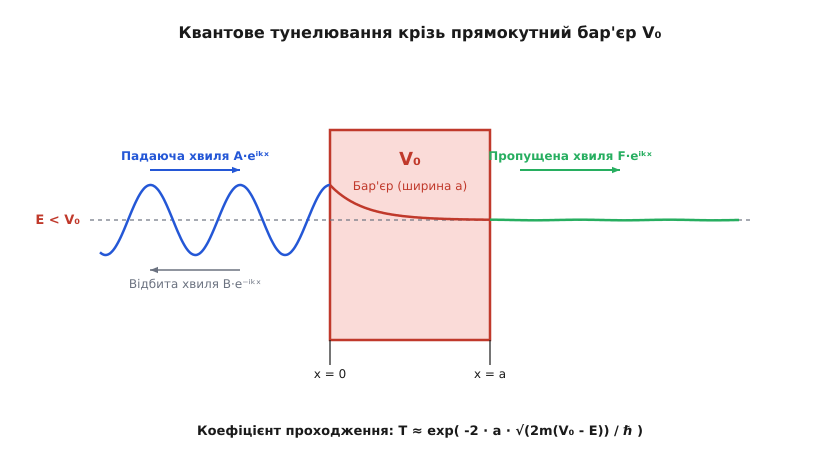

# Одновимірне стаціонарне рівняння Шредінгера

<preknowlist>
- [Другий закон Ньютона](book:physics/mechanics/newtons-second-law) — зв'язок сили та прискорення в класичній механіці.
- [Потенціальна енергія](book:physics/mechanics/potential-energy) — енергетичний рельєф і поле сил V(x).
- [Принцип найменшої дії](book:physics/mechanics/least-action-principle) — варіаційна основа механіки та класична траєкторія.
- [Закон збереження енергії](book:physics/mechanics/energy-conservation) — постійність повної механічної енергії в замкненій системі.
</preknowlist>

Коли мікроскопічна частинка, така як електрон чи протон, потрапляє у просторово обмежений потенціальний рельєф розміром у декілька нанометрів, класичні закони ньютонівської динаміки повністю втрачають свою передбачувану силу. Неперервні траєкторії руху остаточно зникають, а спроба виміряти координату й імпульс одночасно наражається на фундаментальні квантові обмеження. Замість суцільного спектра енергій частинка може посідати лише строго визначені дискретні енергетичні рівні. Фундаментальним математичним інструментом, що пояснює цей перехід від класичного руху по траєкторіях до дискретного квантування стоячих хвиль матерії, є одновимірне стаціонарне рівняння Шредінгера.

## Фізичні витоки та межа класичної механіки

У класичній механіці стан частинки масою `m` у будь-який момент часу повністю задається її координатою `x(t)` та імпульсом `p(t)`. Рівняння руху Ньютона `m · d²x/dt² = -dV/dx` однозначно визначає майбутню траєкторію за відомих початкових умов. Однак на початку ХХ століття низка фундаментальних експериментів — випромінювання абсолютно чорного тіла, фотоелектричний ефект, ефект Комптона та дифракція електронів на кристалах — переконливо довели, що мікрооб'єкти володіють корпускулярно-хвильовим дуалізмом.

Згідно з гіпотезою Луї де Бройля, кожній частинці з імпульсом `p` відповідає хвильовий процес з довжиною хвилі `λ = h / p`, де `h` — стала Планка. Для макроскопічного тіла довжина хвилі де Бройля є зневажливо малою, проте для електрона з кінетичною енергією в кілька електронвольт вона становить порядку `0.1–1.0` нанометра. Якщо характерний розмір потенціальної ями `L` стає порівняним із довжиною хвилі `λ`, частинку більше не можна вважати точковим об'єктом, і класичне поняття траєкторії втрачає сенс.

Фазова швидкість хвилі де Бройля дорівнює `v_phase = ω / k = E / p = p / (2m)`, що вдвічі менше за швидкість класичної частинки. Проте групова швидкість хвильового пакета, що описує переміщення максимуму амплітуди ймовірності у просторі, точно дорівнює класичній швидкості частинки:

```
v_group = dω/dk = dE/dp = d(p²/2m)/dp = p / m = v      [збіжність групової швидкості з класичною]
```

З часом вільний квантовий хвильовий пакет неминуче розпливається у просторі через дисперсію хвильових чисел. Щоб отримати стійкий у часі стан частинки у силовому полі, необхідно розглядати стаціонарні стани з фіксованою енергією.

Повний динамічний стан квантової системи описується часовим рівнянням Шредінгера для комплексної хвильової функції `Ψ(x, t)`:

```
i·ℏ · ∂Ψ(x, t)/∂t = - (ℏ² / (2·m)) · ∂²Ψ(x, t)/∂x² + V(x, t)·Ψ(x, t)      [часове рівняння Шредінгера]
```

де `i` — уявна одиниця, `ℏ = h / (2·π)` — приведена стала Планка, а `V(x, t)` — потенціальна енергія частинки у зовнішньому полі.

Якщо потенціальна енергія не залежить від часу `V(x, t) = V(x)` (статичне силове поле), симетрія системи відносно часових зсувів за теоремою Нетер призводить до збереження повної енергії `E`. Це дозволяє виконати відокремлення змінних (метод Фур'є), подавши повну хвильову функцію у вигляді добутку просторової амплітуди `ψ(x)` та часового множника `φ(t)`:

```
Ψ(x, t) = ψ(x) · φ(t)      [відокремлення просторових і часових змінних]
```

Підставивши цей анзац у часове рівняння та поділивши обидві частини на `ψ(x) · φ(t)`, отримуємо рівність двох виразів, один із яких залежить лише від `t`, а другий — лише від `x`:

```
i·ℏ · (1 / φ(t)) · dφ(t)/dt = (1 / ψ(x)) · [ - (ℏ² / (2·m)) · d²ψ(x)/dx² + V(x)·ψ(x) ] = E      [константа відокремлення E]
```

Оскільки ліва і права частини залежать від незалежних змінних, вони можуть бути рівними лише постійній величині `E`, яка має фізичний зміст повної енергії стаціонарного стану. Звідси випливають два незалежні диференціальні рівняння.

Часове рівняння легко інтегрується:

```
dφ(t)/dt = - (i·E / ℏ) · φ(t) ⇒ φ(t) = exp( -i · E · t / ℏ )      [гармонічний часовий фактор]
```

Просторова частина дає **одновимірне стаціонарне рівняння Шредінгера**:

```
- (ℏ² / (2·m)) · d²ψ(x)/dx² + V(x)·ψ(x) = E·ψ(x)      [стаціонарне рівняння Шредінгера в 1D]
```

Це рівняння є задачею на власні значення для лінійного диференціального оператора Гамільтона `Ĥ`:

```
Ĥ·ψ(x) = E·ψ(x)      [операторна форма рівняння]
```

де гамільтоніан `Ĥ = T̂ + V̂ = - (ℏ² / (2·m)) · d²/dx² + V(x)` є сумою операторів кінетичної та потенціальної енергії. Детальніше про історію відкриття цієї фундаментальної формули та наукові дебати 1920-х років можна прочитати у вставці [Історія стаціонарного рівняння Шредінгера](book:physics/mechanics/stationary-schrodinger-equation/hist-schrodinger-equation.md).

## Ймовірнісний зміст, збереження струму та граничні умови

Сама хвильова функція `ψ(x)` є комплекснозначною величиною і не вимірюється безпосередньо макроскопічним приладом. Фізичний зміст хвильової функції визначається статистичною інтерпретацією Макса Борна: квадрат модуля хвильової функції `|ψ(x)|² = ψ*(x) · ψ(x)` визначає густину ймовірності `P(x)` знайти частинку у точці `x`.

Імовірність знаходження частинки на нескінченно малому інтервалі `[x, x + dx]` дорівнює:

```
dP = |ψ(x)|² · dx      [імовірність Борна]
```

Оскільки частинка з імовірністю 100% перебуває десь у просторі, хвильова функція стаціонарного стану мусить задовольняти **умову нормування**:

```
∫₋∞⁺∞ |ψ(x)|² dx = 1      [умова нормування хвильової функції]
```

З умови квадратного інтегрування випливає, що на нескінченності хвильова функція мусить прямувати до нуля досить швидко: `lim_{x → ±∞} ψ(x) = 0`.

Густина струму ймовірності `J(x)`, що описує просторовий перенос квантової ймовірності, визначається виразом:

```
J(x) = (ℏ / (2·m·i)) · [ ψ*(x) · (dψ/dx) - ψ(x) · (dψ*/dx) ]      [густина струму ймовірності]
```

Густина ймовірності `P(x, t) = |Ψ(x, t)|²` та густина струму `J(x, t)` задовольняють квантове рівняння неперервності, яке виражає закон збереження кількості частинок:

```
∂P/∂t + ∂J/∂x = 0      [диференціальний закон збереження ймовірності]
```

Для будь-якого стаціонарного зв'язаного стану, де дійсні та уявні частини хвильової функції пропорційні (тобто `ψ(x)` можна обрати строго дійсною), густина струму ймовірності тотожно дорівнює нулю: `J(x) = 0`. Це означає відсутність макроскопічного переносу речовини у стоячій хвилі. Для біжучої плоскої хвилі `ψ(x) = A · exp(i·k·x)` струм є постійним `J = (ℏ·k / m) · |A|² = v · |A|²`, де `v` — швидкість частинки.

Щоб рівняння Шредінгера мало фізичний зміст, до хвильової функції `ψ(x)` висуваються три стандартні математичні вимоги гладкості:

1. **Однозначність та неперервність:** Хвильова функція `ψ(x)` має бути неперервною на всій осі `x`. Розрив `ψ(x)` означав би нескінченно велику кінетичну енергію в точці розриву.
2. **Неперервність першої похідної:** Похідна `dψ/dx` має бути неперервною скрізь, окрім точок, де потенціал `V(x)` має нескінченний стрибок (як на стінках нескінченно глибокої ями або дельта-потенціалу).
3. **Обмеженість:** Значення `|ψ(x)|` має залишатися скінченним у кожній точці простору.

Якщо у точці `x₀` потенціал має дельта-подібну особливість `V(x) = α · δ(x - x₀)`, то інтегрування рівняння Шредінгера по нескінченно малому інтервалу `[x₀ - ε, x₀ + ε]` дає умову стрибка першої похідної:

```
ψ'(x₀ + 0) - ψ'(x₀ - 0) = (2·m·α / ℏ²) · ψ(x₀)      [умова стрибка похідної на дельта-потенціалі]
```

Завдяки гармонічному часовому множнику `exp(-i·E·t/ℏ)`, густина ймовірності стаціонарного стану взагалі не змінюється з часом:

```
|Ψ(x, t)|² = |ψ(x) · e⁻ⁱᴱᵗ/ℏ|² = |ψ(x)|² · |e⁻ⁱᴱᵗ/ℏ|² = |ψ(x)|²      [стаціонарність густини ймовірності]
```

Саме тому такі стани називаються **стаціонарними**: усі спостережувані фізичні величини (густина заряду, середнє положення, середній імпульс) залишаються незмінними у часі.

## Симетрія потенціалу та парність хвильових функцій

Якщо потенціальна енергія є симетричною відносно початку координат `V(-x) = V(x)` (парний потенціал), то оператор Гамільтона `Ĥ` комутує з оператором просторової інверсії (парності) `P̂`, який діє за правилом `P̂ ψ(x) = ψ(-x)`:

```
[Ĥ, P̂] = Ĥ · P̂ - P̂ · Ĥ = 0      [комутація Гамільтоніана з оператором парності]
```

З алгебри операторів випливає, що якщо два оператори комутують, вони мають спільну систему власних функцій. Власні значення оператора парності дорівнюють `P = ±1`, оскільки `P̂² ψ(x) = ψ(x)`.

Це вимагає, щоб усі невироджені стани у симетричному потенціалі мали визначену парність:
1. **Парні стани (`P = +1`):** `ψ(-x) = +ψ(x)`. Гранична умова в центрі симетрії: `ψ'(0) = 0`.
2. **Непарні стани (`P = -1`):** `ψ(-x) = -ψ(x)`. Гранична умова в центрі симетрії: `ψ(0) = 0`.

Правило парності суттєво спрощує чисельний та аналітичний розрахунок рівнів енергії, дозволяючи розглядати лише позитивну піввісь `x ≥ 0`. Також парність визначає квантові правила відбору для оптичних переходів: матричний елемент дипольного переходу `xₘ♙ = ∫ ψₘ*(x) · x · ψ♙(x) dx` відмінний від нуля лише між станами протилежної парності (перехід парний ↔ непарний).

## Математичні властивості: оператор Штурма — Ліувілля та осциляційна теорема

З математичного погляду стаціонарне рівняння Шредінгера належить до класу диференціальних рівнянь Штурма — Ліувілля. Оператор Гамільтона `Ĥ` у просторі квадровально інтегровних функцій `L²(ℝ)` є самоспряженим (ермітовим) оператором. З цієї фундаментальної математичної властивості випливають три вирішальні фізичні наслідки:

1. **Дійсність спектра енергії:** Усі власні значення енергії `E`, які є розв'язками рівняння `Ĥψ = Eψ`, є строго дійсними числами (`E ∈ ℝ`). Виміряна енергія квантової системи не може бути комплексною.
2. **Ортогональність власних станів:** Власні функції `ψₘ(x)` та `ψₙ(x)`, які відповідають різним рівням енергії `Eₘ ≠ Eₙ`, є ортогональними між собою: `∫₋∞⁺∞ ψₘ*(x) · ψₙ(x) dx = 0`.
3. **Повнота базису:** Набір власних функцій `{ψₙ(x)}` утворює повний ортонормований базис. Довільний початковий стан квантової системи `Ψ(x, 0)` можна розкласти у ряд за власними станами: `Ψ(x, 0) = ∑ₙ cₙ · ψₙ(x)`.

Крім того, для одновимірних потенціальних ям діє **Осциляційна теорема Штурма**:
Якщо впорядкувати власні значення дискретного спектра за зростанням `E₀ < E₁ < E₂ < ... < Eₙ`, то хвильова функція основного стану `ψ₀(x)` не має жодного внутрішнього нуля (перетину осі `x`), а хвильова функція `n`-го збудженого стану `ψₙ(x)` має точно `n` простих нулів (вузлів).

Фізичний зміст цієї теореми полягає у тому, що кожна додаткова осциляція хвильової функції збільшує її просторову кривизну `d²ψ/dx²`. Оскільки оператор кінетичної енергії пропорційний другій похідній `T̂ = -(ℏ²/2m) d²/dx²`, більша кількість вузлів безпосередньо відповідає вищій кінетичній енергії частинки.

Детальні математичні доведення ермітовості, ортогональності, теореми про нулі та квазікласичного наближення ВКБ викладено у вставці [Математична теорія рівняння Шредінгера як задачі Штурма — Ліувілля](book:physics/mechanics/stationary-schrodinger-equation/math-sturm-liouville.md).

## Нескінченно глибока потенціальна яма (квант у коробці)

Найпростішою і водночас найнаочнішою модельною задачею квантової механіки є рух частинки у потенціальній ямі з нескінченно високими стінками шириною `L`.

Потенціальна енергія задається співвідношеннями:

```
V(x) = 0,    якщо 0 < x < L
V(x) = ∞,    якщо x ≤ 0 або x ≥ L
```


*Нескінченно глибока потенціальна яма: дискретні рівні енергії E♙ пропорційні квадрату квантового числа n², а відповідні хвильові функції ψ♙ утворюють стоячі хвилі з n - 1 внутрішніми вузлами.*

Оскільки поза ямою (`x ≤ 0` або `x ≥ L`) потенціал `V = ∞`, частинка не може там перебувати, і її хвильова функція дорівнює нулю: `ψ(x) = 0`. З вимоги неперервності випливають граничні умови Дирихле на межах:

```
ψ(0) = 0,    ψ(L) = 0      [крайові умови на стінках ями]
```

Всередині ями (`0 < x < L`) потенціал `V(x) = 0`, і рівняння Шредінгера набуває вигляду рівняння гармонічного осцилятора:

```
- (ℏ² / (2·m)) · d²ψ(x)/dx² = E·ψ(x) ⇒ d²ψ(x)/dx² + k²·ψ(x) = 0      [рівняння всередині ями]
```

де `k = √(2·m·E) / ℏ` — хвильове число. Загальний розв'язок цього диференціального рівняння має вигляд:

```
ψ(x) = A · sin(k·x) + B · cos(k·x)      [загальний тригонометричний розв'язок]
```

Застосуємо крайові умови:
1. З умови `ψ(0) = 0` маємо: `A · sin(0) + B · cos(0) = 0 ⇒ B = 0`.
2. З умови `ψ(L) = 0` маємо: `A · sin(k·L) = 0`.

Оскільки `A ≠ 0` (інакше хвильова функція тотожно дорівнювала б нулю скрізь), синус мусить перетворюватися на нуль. Це можливо лише тоді, коли аргумент `k·L` є кратним `π`:

```
k·L = n·π ⇒ kₙ = n·π / L,    n = 1, 2, 3...      [дискретизація хвильового числа]
```

Значення `n = 0` відкидається, оскільки дає `ψ(x) = 0` (відсутність частинки). Підставивши `kₙ = √(2·m·Eₙ) / ℏ`, отримуємо **квантовані рівні енергії**:

```
Eₙ = (n² · π² · ℏ²) / (2 · m · L²)      [енергетичний спектр нескінченної ями]
```

Визначимо амплітуду `A` з умови нормування `∫₀ᴸ |A|² · sin²(n·π·x / L) dx = 1`:

```
|A|² · (L / 2) = 1 ⇒ A = √(2 / L)      [амплітуда нормування]
```

Таким чином, власні хвильові функції мають вигляд стоячих хвиль:

```
ψₙ(x) = √(2 / L) · sin( n·π·x / L )      [власні хвильові функції]
```

Обчислимо середнє значення координати `⟨x⟩` та середній квадрат координати `⟨x²⟩` для `n`-го стану:

```
⟨x⟩ = ∫₀ᴸ x · |ψₙ(x)|² dx = (2 / L) ∫₀ᴸ x · sin²(n·π·x / L) dx = L / 2      [симетрія положення]
⟨x²⟩ = (2 / L) ∫₀ᴸ x² · sin²(n·π·x / L) dx = L² · ( 1/3 - 1/(2·n²·π²) )      [середній квадрат координати]
```

Аналогічно обчислимо середня значення імпульсу та його квадрата:

```
⟨p⟩ = ∫₀ᴸ ψₙ*(x) · (-i·ℏ · dψₙ/dx) dx = 0      [відсутність направленого руху]
⟨p²⟩ = 2m · Eₙ = (n² · π² · ℏ²) / L²            [середній квадрат імпульсу]
```

Обчислимо дисперсії координати `Δx = √(⟨x²⟩ - ⟨x⟩²)` та імпульсу `Δp = √(⟨p²⟩ - ⟨p⟩²)`:

```
Δx = L · √( 1/12 - 1/(2·n²·π²) )
Δp = (n · π · ℏ) / L
Δx · Δp = ℏ · √( (n²·π² / 12) - 1/2 )      [добуток невизначеностей]
```

Для основного стану `n = 1` отримуємо `Δx · Δp ≈ 0.568 · ℏ > ℏ / 2`, що повністю узгоджується зі співвідношенням невизначеностей Гейзенберга.

### Фізичні висновки з моделі нескінченної ями:
- **Квантування енергії:** Енергія частинки не може бути довільною; вона приймає лише дискретний набір значень `E₁, E₂, E₃...`, пропорційний квадрату квантового числа `n²`.
- **Існування нульової енергії (Zero-point energy):** Найнижчий можливий рівень енергії (основний стан `n = 1`) не дорівнює нулю: `E₁ = (π²·ℏ²) / (2·m·L²) > 0`. Частинка у квантовій механіці не може повністю зупинитися у потенціальній ямі. Це є безпосереднім наслідком співвідношення невизначеностей Гейзенберга `Δx · Δp ≥ ℏ / 2`: якщо локалізувати частинку в області розміром `Δx = L`, її неодмінний розкид за імпульсом становить `Δp ≈ ℏ / L`, що дає мінімальну кінетичну енергію `(Δp)² / (2m) ≈ ℏ² / (2m L²)`.

## Скінченна потенціальна яма та тунельне проникнення

У реальних фізичних системах (наприклад, квантових точках чи гетероструктурах напівпровідників) потенціальні бар'єри мають скінченну висоту `V₀`.

Розглянемо скінченну симетричну потенціальну яму:

```
V(x) = 0,      якщо |x| < a / 2  (область II)
V(x) = V₀,     якщо |x| ≥ a / 2  (області I та III)
```


*Скінченна потенціальна яма: для зв'язаного стану E < V₀ хвильова функція не обнуляється на межах, а експоненційно спадає вглиб класично забороненоі області V = V₀.*

Для зв'язаних станів (`0 < E < V₀`) розв'язок розділяється на три області:

1. **Всередині ями (`|x| < a/2`):** Енергія `E > V(x)`, тому розв'язок осцилює:
   ```
   d²ψ/dx² + k²·ψ = 0,    де k = √(2mE) / ℏ
   ψ_II(x) = A · cos(k·x)      [парні стани]
   ```
2. **Поза ямою (`|x| > a/2`):** Енергія `E < V₀`. У класичній механіці частинка взагалі не може заходити в цю область (від'ємна кінетична енергія). Однак у рівнянні Шредінгера вираз `d²ψ/dx² = κ²·ψ` дає дійсні експоненціальні розв'язки:
   ```
   d²ψ/dx² - κ²·ψ = 0,    де κ = √(2m(V₀ - E)) / ℏ
   ψ_I(x) = C · exp(κ·x),     х < -a/2
   ψ_III(x) = C · exp(-κ·x),   х > a/2
   ```

Зшиваючи хвильову функцію та її першу похідну у точках `x = ±a/2`, отримуємо трансцендентне рівняння для енергетичних рівнів `E`:

```
tan( k·a / 2 ) = κ / k = √( (V₀ - E) / E )      [трансцендентне рівняння для парних станів]
```

Ввівши безрозмірні параметри `ξ = k·a / 2` та `R² = (m·V₀·a²) / (2·ℏ²)`, це рівняння зводиться до геометричного перетину колової дуги та тригонометричного тангенса:

```
ξ · tan(ξ) = √( R² - ξ² )      [безрозмірне спектральне рівняння]
```

Оскільки при `ξ → 0` ліва частина прямує до 0, а права частина до `R > 0`, дуга кола та крива тангенса завжди перетинаються принаймні один раз для довільно малого значення `R > 0`. 

Це доводить важливу квантову теорему: **у будь-якій одновимірній симетричній потенціальній ямі завжди існує принаймні один зв'язаний стан**, якою б мілкою чи вузькою не була ця яма.

### Принципова квантова відмінність:
Хвильова функція не обривається на межах ями `x = ±a/2`, а проникне у класично заборонену область `|x| > a/2`, згасаючи за експоненційним законом `exp(-κ·|x|)`. Глибина проникнення хвиль під бар'єр визначається величиною `δ = 1 / κ = ℏ / √(2m(V₀ - E))`.

## Квантовий гармонічний осцилятор

Гармонічний осцилятор є однією з найважливіших моделей у фізиці, оскільки малі коливання будь-якої системи поблизу мінімуму гладкого потенціалу `V(x)` розкладаються у параболу:

```
V(x) = ½ · m · ω² · x²      [потенціал гармонічного осцилятора]
```


*Квантовий гармонічний осцилятор: параболічний потенційний рельєф, рівновіддалені рівні енергії ΔE = ℏω та хвильові функції, описані поліномами Ерміта.*

Рівняння Шредінгера для осцилятора має вигляд:

```
- (ℏ² / (2·m)) · d²ψ/dx² + ½ · m · ω² · x² · ψ(x) = E·ψ(x)      [рівняння квантового осцилятора]
```

Перейдемо до безрозмірної координати `ξ = x / x₀`, де природний масштаб довжини дорівнює `x₀ = √( ℏ / (m·ω) )`. Рівняння набуває вигляду:

```
d²ψ/dξ² + ( λ - ξ² ) · ψ(ξ) = 0      [безрозмірне рівняння]
```

де `λ = (2·E) / (ℏ·ω)`.

Шукаючи асимптотичний розв'язок при `ξ → ±∞`, виділяємо ґаусовий фактор `exp(-ξ² / 2)`:

```
ψ(ξ) = H(ξ) · exp( -ξ² / 2 )      [анзац з поліномами Ерміта]
```

Підстановка цього виразу перетворює рівняння Шредінгера на диференціальне рівняння Ерміта для функції `H(ξ)`:

```
H''(ξ) - 2·ξ·H'(ξ) + (λ - 1)·H(ξ) = 0      [диференціальне рівняння Ерміта]
```

Щоб розв'язок не зростав як `exp(+ξ² / 2)` на нескінченності (що порушило б умову нормування), степеневий ряд для `H(ξ)` мусить обриватися, перетворюючись на поліном Ерміта `Hₙ(ξ)` порядку `n`. Це вимагає виконання умови:

```
λ - 1 = 2·n ⇒ λ = 2·n + 1,    n = 0, 1, 2...      [умова обриву ряду]
```

Виражаючи енергію через `λ`, отримуємо знаменитий **спектр квантового гармонічного осцилятора**:

```
Eₙ = ℏ·ω · ( n + ½ )      [спектр квантового осцилятора]
```

Нормовані власні хвильові функції дорівнюють:

```
ψₙ(x) = ( 1 / √(2ⁿ · n! · x₀ · √π) ) · Hₙ(x / x₀) · exp( - x² / (2·x₀²) )      [хвильові функції осцилятора]
```

В алгебраїчному підході Поля Дірака для розв'язання осцилятора вводяться **оператори народження `a⁺` та знищення `a`**:

```
a = √(m·ω / (2·ℏ)) · ( x̂ + i · p̂ / (m·ω) )        [оператор знищення]
a⁺ = √(m·ω / (2·ℏ)) · ( x̂ - i · p̂ / (m·ω) )       [оператор народження]
```

Ці оператори задовольняють канонічне перестановне співвідношення `[a, a⁺] = a·a⁺ - a⁺·a = 1`. Через них Гамільтоніан виражається у надзвичайно компактній формі: `Ĥ = ℏ·ω · ( a⁺·a + ½ ) = ℏ·ω · ( N̂ + ½ )`, де `N̂ = a⁺·a` — оператор числа квантів. Діючи на власний стан `|n⟩`, оператор знищення зменшує квантове число `a|n⟩ = √n |n-1⟩`, а оператор народження збільшує його `a⁺|n⟩ = √(n+1) |n+1⟩`.

### Особливості квантового осцилятора:
1. **Еквідистантність рівнів:** Відстань між будь-якими сусідніми рівнями є постійною: `ΔE = Eₙ₊₁ - Eₙ = ℏ·ω`. Поглинання або випромінювання світла квантовим осцилятором завжди відбувається фотонами з частотою `ω`.
2. **Нульові коливання (Zero-point energy):** Енергія основного стану `n = 0` становить `E₀ = ½·ℏ·ω`. Вона не дорівнює нулю і пояснює, чому рідкий гелій-4 не замерзає при абсолютному нулю температур за нормального тиску.

## Порівняння закономірностей спектрів у фундаментальних потенціалах

Характер спектра енергії квантової системи принципово залежить від геометричної форми стінок потенціалу `V(x)`. Порівняємо три базові класи потенціалів:

1. **Нескінченно жорстка яма (вертикальні стінки):** `E♙ ~ n²`. Енергетичні рівні розсуваються все далі один від одного із зростанням quantum number `n`. Відстань між сусідніми рівнями зростає лінійно: `ΔE = E♙₊₁ - E♙ ~ (2n + 1)`.
2. **Гармонічний осцилятор (параболічні стінки):** `E♙ ~ (n + 1/2)`. Енергетичні рівні є строго еквідистантними. Відстань між будь-якими двома сусідніми рівнями є постійною величиною `ΔE = ℏω`.
3. **Кулонівський потенціал атома Гідрогену (`V = -e²/r`):** `E♙ ~ -1/n²`. Енергетичні рівні згущуються при наближенні до нуля (границі іонізації `E = 0`). Відстань між сусідніми рівнями зменшується як `1/n³`.

Цей порівняльний аналіз показує, що звуження потенціалу при зростанні енергії (як у параболі) уповільнює ріст `E♙` від `n²` до `n`, а необмежене розширення потенціального колодязя (як у Кулонівському полі) приводить до згущення рівнів у суцільний спектр.

## Квантове тунелювання крізь потенціальний бар'єр

Розглянемо прямокутний потенціальний бар'єр висотою `V₀` та шириною `a`:

```
V(x) = V₀,    якщо 0 < x < a
V(x) = 0,     якщо x < 0 або x > a
```


*Квантове тунелювання: частинка з енергією E < V₀ падає на бар'єр зліва, згасає під бар'єром за експоненційним законом і проходить праворуч зі зменшеною амплітудою.*

Нехай на бар'єр зліва падає потік частинок з енергією `E < V₀`.

У класичній механіці частинка з енергією `E < V₀` на 100% відіб'ється від бар'єра і повернеться назад. Проходження крізь бар'єр класично заборонено.

У квантовій механіці розв'язок Шредінгера шукається у трьох областях:

1. **Ліворуч від бар'єра (`x < 0`):** Падаюча і відбита плоскі хвилі:
   ```
   ψ_I(x) = A · eⁱᵏˣ + B · e⁻ⁱᵏˣ,    де k = √(2mE) / ℏ
   ```
2. **Всередині бар'єра (`0 < x < a`):** Сума спадної та зростаючої експонент:
   ```
   ψ_II(x) = C · e⁻κˣ + D · eᵏˣ,    де κ = √(2m(V₀ - E)) / ℏ
   ```
3. **Праворуч від бар'єра (`x > a`):** Лише пропущена хвиля, що біжить праворуч:
   ```
   ψ_III(x) = F · eⁱᵏˣ
   ```

Зшиваючи хвильові функції та їхні похідні на межах `x = 0` та `x = a`, обчислюємо **коефіцієнт проходження (прозорості бар'єра) `T`**:

```
T = |F / A|² = 1 / [ 1 + (V₀² / (4·E·(V₀ - E))) · sinh²(κ·a) ]      [точний коефіцієнт тунелювання]
```

Для широких або високих бар'єрів (`κ·a ≫ 1`), гіперболічний синус наближається до експоненти `sinh(κ·a) ≈ ½ · eᵏᵃ`, що дає **наближену формулу тунелювання**:

```
T ≈ T₀ · exp( - 2 · κ · a ) = T₀ · exp( - (2·a / ℏ) · √(2m(V₀ - E)) )      [експоненційна формула тунелювання]
```

де `T₀ = 16 · E · (V₀ - E) / V₀²`.

### Практичне значення тунельного ефекту:
- **Альфа-розпад атомних ядер:** Виліт alpha-частинок із важких ядер (теорія Гамова 1928 року).
- **Скануюча тунельна мікроскопія (STM):** Вимірювання тунельного струму між голкою мікроскопа й поверхнею з точністю до часток ангстрема.
- **Напівпровідникові прилади:** Робота тунельних діодів Есакі, флеш-пам'яті (тунелювання Фаулера — Нордгейма) та польових транзисторів із критично тонкими підзатворними діелектриками.

## Резонансне тунелювання у двобар'єрних структурах

Коли у напівпровіднику формують дві послідовні квантові перепони (двобар'єрну потенціальну яму), виникає явище **резонансного тунелювання**. 

Якщо енергія падаючого електрона `E` збігається із квазізв'язаним енергетичним рівнем `E_res` всередині потенціальної ями між бар'єрами, прозорість всієї двобар'єрної системи стрімко зростає до 100% (`T ≈ 1`), навіть якщо кожен із бар'єрів окремо є майже непрозорим. Це явище є квантовомеханічним аналогом багатопроменевої оптичної інтерференції у інтерферометрі Фабрі — Перо.

На основі резонансного тунелювання будують резонансно-тунельні діоди (RTD), які демонструють ділянку від'ємного диференціального опору на вольт-амперній характеристиці і здатні генерувати надвисокочастотні сигнали у терагерцовому діапазоні (до `1.5` ТГц).

## Чисельне розв'язання рівняння Шредінгера

Для довільних складних потенціалів `V(x)`, які не мають аналітичного розв'язку у функціях Ейрі чи Ерміта, застосовують чисельні методи дискретизації.

Найбільш поширеним алгоритмом високої точності є **метод Нумерова** (похибка `O(h⁴)`), який розв'язує рівняння виду `ψ'' + k²(x)·ψ = 0` за дискретною рекурентною формулою:

```
(1 + (h²/12)·k²♙₊₁) · ψ♙₊₁ = 2 · (1 - (5h²/12)·k²♙) · ψ♙ - (1 + (h²/12)·k²♙₋₁) · ψ♙₋₁      [схема Нумерова]
```

Детальні алгоритми чисельного інтегрування мовами C та C++ з використанням методу стрільби наведено у вставці [Чисельне розв'язання рівняння Шредінгера методом Нумерова](book:physics/mechanics/stationary-schrodinger-equation/proj-numerov-solver.md).

Специфікацію структури даних, типів крайових умов та функціонального контракту C/C++ бібліотеки розв'язувача описано у довіднику [Інтерфейс та довідник розв'язувача рівняння Шредінгера](book:physics/mechanics/stationary-schrodinger-equation/api-schrodinger-solver.md).

## Покроковий приклад розрахунку енергетичного рівня

**Задача:** Оцінити точне значення енергії основного стану `E₁` та першого збудженого стану `E₂` для електрона масою `m = 9.109 × 10⁻³¹ kg` у симетричній прямокутній квантовій ямі шириною `L = 1.0 nm` (`1.0 × 10⁻⁹ m`) з нескінченно високими стінками.

```
m = 9.109383 × 10⁻³¹ kg     [маса електрона]
ℏ = 1.054571 × 10⁻³⁴ J·s    [приведена стала Планка]
L = 1.000000 × 10⁻⁹ m       [ширина ями 1 нм]
1 eV = 1.602176 × 10⁻¹⁹ J   [коефіцієнт переводу у еВ]

E₁ = (1² · π² · ℏ²) / (2 · m · L²)      [формула основного стану n = 1]
= (3.1415926² · (1.054571 × 10⁻³⁴)²) / (2 · 9.109383 × 10⁻³¹ · (1.0 × 10⁻⁹)²)
= (9.869604 × 1.112120 × 10⁻⁶⁸) / (1.821877 × 10⁻⁴⁸)
= 1.097654 × 10⁻⁶⁷ / 1.821877 × 10⁻⁴⁸
= 6.02485 × 10⁻²⁰ J                      [енергія у джоулях]

E₁ (in eV) = 6.02485 × 10⁻²⁰ / 1.602176 × 10⁻¹⁹
= 0.37604 eV                             [енергія основного стану ~ 0.376 еВ]

E₂ = 2² · E₁ = 4 · 0.376041 eV
= 1.50416 eV                             [енергія першого збудженого стану ~ 1.504 еВ]

ΔE = E₂ - E₁ = 1.50416 - 0.37604 = 1.12812 eV      [енергія квантового переходу]
λ_photon = (h · c) / ΔE = (1.2398 × 10⁻⁶ eV·m) / 1.12812 eV = 1.099 μm     [довжина хвилі фотона в ІЧ-діапазоні]
```

**Висновок:** Електрон, локалізований у нанорозмірній потенціальній ямі шириною 1 нм, має енергію основного стану `E₁ ≈ 0.376 eV`. Перехід між основним та першим збудженим станом супроводжується випромінюванням або поглинанням фотона з енергією `1.128 eV` (довжина хвилі `1.099 мкм`, ближній інфрачервоний діапазон), що широко використовується у напівпровідникових гетеролазерах на квантових ямах для оптичного волоконного зв'язку.

> 🔧 **Навіщо це.**
> Одновимірне стаціонарне рівняння Шредінгера є не просто теоретичною абстракцією, а повсякденним робочим інструментом інженерів-фізиків та розробників напівпровідникових наноструктур. На основі розрахунків стаціонарних рівнів у квантових ямах створюють напівпровідникові лазери для волоконно-оптичних ліній зв'язку, резонансно-тунельні діоди надвисокої частоти (терагерцовий діапазон), квантові каскадні лазери інфрачервоного діапазону та кубіти на напівпровідникових квантових точках для квантових комп'ютерів. Без розв'язання рівняння Шредінгера неможливо спроектувати жоден сучасний транзистор із товщиною затвора менше 3 нанометрів, де тунельний струм витоку визначає енергоефективність процесора.
