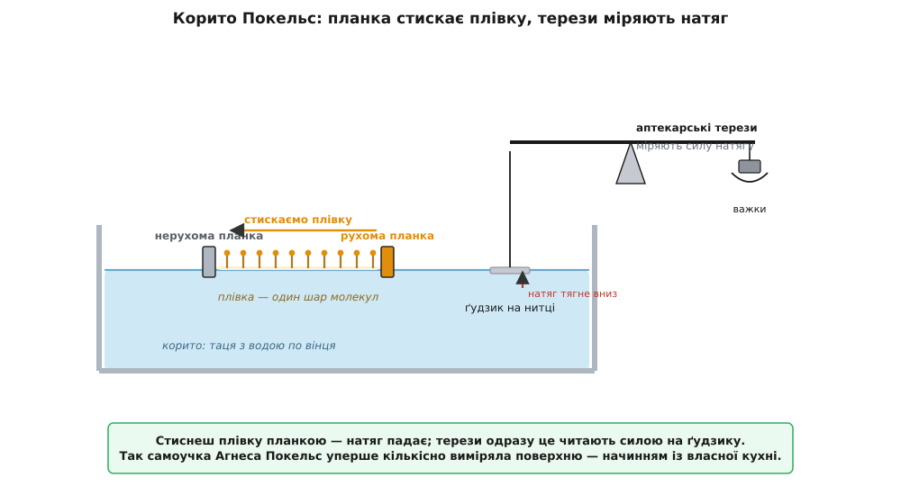
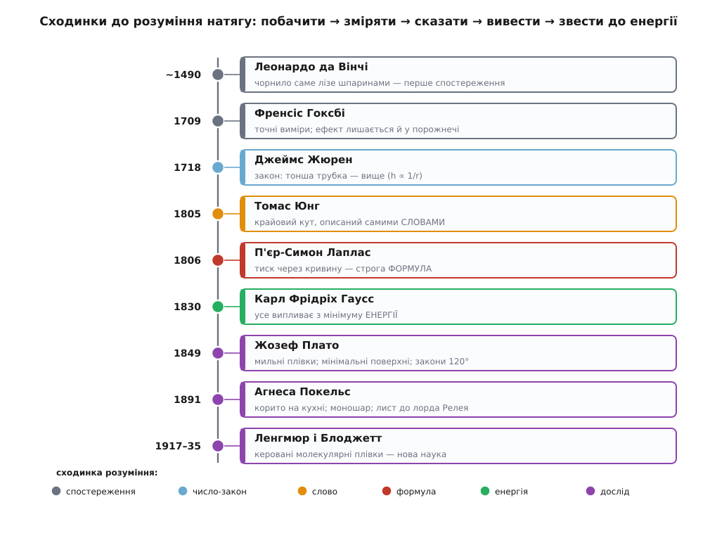

# 📜 Невидима шкірка: як натяг ставав числом

> Історична вставка. Тут не готова формула σ, а довга дорога до неї — понад п'ять століть, поки люди від здивування «чому вода лізе вгору сама?» дійшли до строгого рівняння. Це історія про Ньютонового демонстратора з повітряним насосом, про двобій слова й формули, про сліпого фізика, який «бачив» мильні плівки руками помічників, і про жінку, якій зачинили двері університету, а вона з кухонного начиння зробила науку. І про те, чому **здогадатися**, **описати словами** й **вивести строго** — три дуже різні речі.

Придивіться до чогось геть буденного: вмочіть ріжок серветки у воду. Вода без жодного насоса піде вгору, всупереч тяжінню, і намочить папір вище рівня. Устроміть у воду тонку скляну трубочку — рідина сама підскочить у ній на сантиметри. Століттями це здавалося майже чаклунством: що штовхає воду вгору, коли її мало б тягнути тільки вниз? Ані ока, ані приладу не вистачало, щоб побачити ту силу. Розберімо, як людство її вистежувало — крок за кроком, кожен зі своїм героєм і своєю впертою помилкою.

## Вода, що лізе вгору сама: перші спостерігачі

Найдавніший відомий запис про це явище лишив **Леонардо да Вінчі** (*Leonardo da Vinci*, 1452–1519). Одержимий водою — її вирами, хвилями, каналами, — він у своїх зошитах (Лестерський і Арундельський кодекси) занотував, як волога сама розповзається вузькими шпаринами й підіймається тонкими каналами, і приписав це «спорідненості» рідини з твердим тілом. Це чисте **спостереження**: Леонардо влучно побачив і назвав ефект, але не мав ані теорії, ані числа. Так починається майже кожне поняття у фізиці — з ока, що зауважило дивину.

Наступні двісті років явище дражнило найкращі голови, і жодна не могла його приборкати. Англо-ірландець **Роберт Бойл** (*Robert Boyle*, 1627–1691) — той самий, чиїм ім'ям назвуть закон газів — ставив досліди з трубками й дивувався, чому вода в них стоїть вище, ніж має право. Італієць **Джованні Альфонсо Бореллі** (*Giovanni Alfonso Borelli*, 1608–1679) 1670 року завважив головне кількісне зерно: що **вужча** трубка, то вище лізе рідина. Він фактично намацав закон, який згодом назвуть чужим ім'ям, — перша з несправедливостей у цій історії.

Та по-справжньому за діло взявся англієць **Френсіс Гоксбі** (*Francis Hauksbee*, бл. 1660–1713). Постать колоритна: він був **демонстратором** Лондонського королівського товариства — людиною, яку сам Ньютон, ставши президентом, найняв щотижня показувати наживо досліди перед зібранням учених. Між 1703 і 1713 роками Гоксбі зробив перші **точні** спостереження капілярного підйому — у трубках і навіть між двома майже стуленими скляними пластинами, де вода затягувалася в клин тим вище, чим тонша була щілина.

І тут — красивий хід справжнього експериментатора. Панувала думка, що воду в трубці підпихає повітря. Гоксбі спитав природу навпростець: а що, як повітря прибрати? Він повторив дослід **під дзвоном повітряного насоса**, у розрідженні — і вода лізла вгору так само. Отже, повітря ні до чого; сила ховається у самій воді та її стосунку зі склом. Ці досліди так вразили Ньютона, що той вплів їх у нові видання своїх «Оптики» та «Начал», міркуючи про короткосяжні сили притягання між частинками. Пояснення Гоксбі не дав — але **відсік хибний здогад**, а це в науці не менш цінно.

> 🔧 **Навіщо це.** Гоксбі показав прийом, на якому досі стоїть уся експериментальна наука: підозрюєш причину — **прибери її й дивись, чи ефект лишився**. Зникло разом із причиною — вгадав; лишилося — причина інша. Кожен контрольний дослід, кожна «сліпа» проба, кожне вимкнення однієї змінної в лабораторії — це Гоксбі під своїм скляним дзвоном.

## Закон Жюрена: що тонша трубка, то вище

Звести розрізнені спостереження в чіткий закон випало англійському лікареві-фізіологу **Джеймсові Жюрену** (*James Jurin*, 1684–1750). Року 1718 він старанно переміряв підйом рідини в трубках різного каналу й сформулював те, що донині звуть **законом Жюрена**: висота підйому **обернено пропорційна радіусу** трубки.

```
h ∝ 1 / r
```

Удвічі тонша трубка — удвічі вищий стовп. Устократ тонша — устократ вище. Ось звідки та сама волога піднімається на частку міліметра в широкій склянці й на цілі метри — у мікронних порах ґрунту, деревини чи цегли.

Тут варто бути чесним із першістю — надто ж бо часто закони носять не те ім'я. Кількісне ядро («тонша трубка — вище») намацав ще Бореллі за пів століття перед тим, а точні виміри вів Гоксбі. Заслуга Жюрена не в тому, що він «перший здогадався», а в тому, що він **надійно підтвердив і чітко проголосив** правило як закон, — і саме за цим формулюванням воно закріпилося. Це типова доля наукової першості: ім'я дістається не тому, хто перший майнув думкою, а тому, хто перший поставив її твердо на ноги.

Зверніть увагу, чого тут ще немає. Є **число** — залежність від радіуса. Але немає ані натяку на те, **чому** так, ані самого поняття «поверхневий натяг». Закон Жюрена — це виміряна закономірність без механізму, знята з природи мірка, якій ще належить дочекатися пояснення. А пояснення наближалося — і прийшло воно одразу з двох боків, двома зовсім різними мовами.

## Юнг проти Лапласа: слово чи формула

На початку XIX століття за капілярність узялися двоє несхожих геніїв, і в їхньому змаганні — уся сіль того, що означає «зрозуміти» явище.

Перший — англієць **Томас Юнг** (*Thomas Young*, 1773–1829), людина неймовірного розмаху. Це він дослідом із двома щілинами довів **хвильову природу світла**; він же одним із перших підступився до розшифрування єгипетських ієрогліфів на Розетському камені. Року 1805 Юнг видав працю «An Essay on the Cohesion of Fluids» («Нарис про зчеплення рідин»). У ній він ясно збагнув фізику межі й увів ключове поняття — **крайовий кут**, під яким рідина підходить до стінки, — та описав усе це **самими словами**, без жодної формули. Юнг міркував так: там, де сходяться рідина, повітря й тверде тіло, змагаються сили зчеплення; їхня рівновага й задає сталий кут та вигин поверхні. Думка була глибоко правильна — але викладена так стисло й темно, що сучасники ледве крізь неї продиралися. Юнг мав **інтуїцію** явища, дар побачити суть, — а мову математики до цієї суті прикласти не схотів чи не встиг.

Рік по тому, 1806-го, ту саму фізику взяв француз **П'єр-Симон Лаплас** (*Pierre-Simon Laplace*, 1749–1827) — і повівся геть інакше. У додатку «Sur l'action capillaire» до десятої книги свого монументального «Трактату про небесну механіку» він дав те, чого бракувало Юнгові: **строге математичне виведення**. Лаплас показав, що надлишок тиску під викривленою поверхнею визначається її **кривиною**, і вивів це з підсумовування короткосяжних сил притягання між частинками. Так народилося рівняння, яке сьогодні звемо **рівнянням Юнга–Лапласа** — тиск через кривину й натяг.

Задумаймося, чому обидва імені стоять поруч. Юнг **побачив** механізм і **сказав** його словами; Лаплас **вивів** його строго й дав **лічильну формулу**. Це різні глибини розуміння, і жодна не зайва. Словесна інтуїція без математики лишається туманом, який годі перевірити числом; сама ж формула без фізичної картини — це правильний рахунок, у якому не відчуваєш, що відбувається. Наука дозріває, коли ці два береги сходяться: хтось відчув суть, а хтось закував її в рівняння. Капілярність дозріла саме так — за один рік, у двох головах, двома мовами.

> 🔧 **Навіщо це.** Той самий поділ праці живий і в сучасній інженерії. Спершу хтось **словами** вловлює, чому пристрій поводиться так, а не інак («крапля тримається, бо стінка гідрофобна»), — і лише потім це вбирають у **модель і формулу**, яку можна порахувати й закласти в симуляцію. Цінуйте обидва вміння: голу формулу без картини легко застосувати не туди, а гарну картину без числа не покладеш у розрахунок.

## Гаусс: усе випливає з енергії

Здавалося б, після Лапласа тему закрито. Та лишалася шпарина: Лапласове виведення спиралося на дражливі припущення про невидимі міжчастинкові сили, і крайовий кут доводилося вводити мовби окремо, руками. Чи не можна дістати геть усе — і форму поверхні, і сталий кут при стінці — з однієї глибшої засади?

Можна, і зробив це найбільший математик доби — німець **Карл Фрідріх Гаусс** (*Carl Friedrich Gauss*, 1777–1855). Року 1830 в праці «Principia generalia theoriae figurae fluidorum in statu aequilibrii» він переписав усю капілярність мовою **енергії**. Замість того щоб вистежувати силу на кожну частинку, Гаусс склав одну величину — повну потенціальну енергію системи (тяжіння плюс зчеплення рідини із собою плюс її прилипання до стінки) — і зажадав, щоб у рівновазі ця енергія була **найменша**. З цієї єдиної вимоги, через числення варіацій, самі собою випали **і** рівняння поверхні, **і** правило сталого крайового кута. Нічого не треба вводити окремо: усе — наслідок одного принципу «природа скочується до найнижчої енергії».

Це був не лише тріумф фізики, а й віха математики: Гауссова робота стала першим розв'язком варіаційної задачі з подвійними інтегралами та рухомими межами. І це той самий погляд, яким тему пояснюють досі: поверхневий натяг — то ціна енергії за кожен клаптик поверхні, а рідина влаштовує все так, щоб заплатити якнайменше.

> 🔧 **Навіщо це.** Перехід «від сил до енергії» — один із найпотужніших у всій фізиці. Замість того щоб розписувати всі сили в заплутаній системі, часто простіше спитати: **яка конфігурація має найменшу енергію?** — і відповідь випадає сама. На цьому стоять і форма мильної плівки, і згин балки, і укладка білка, і робота оптимізаторів у машинному навчанні. Гаусс показав це на краплі води.

## Сліпий, що «бачив» плівки: Жозеф Плато

Найзворушливіша постать цієї історії — бельгійський фізик **Жозеф Плато** (*Joseph Plateau*, 1801–1883). Замолоду він, вивчаючи, як око сприймає світло, вчинив відчайдушний дослід: **дивився на сонце понад двадцять секунд**. Зір це підірвало; хвороба поволі його з'їдала, і близько 1843 року Плато **осліп цілком**. Здавалося б, для експериментатора це вирок. Та він працював ще сорок років — руками дружини, сина й учнів, які ставили досліди й до найдрібніших подробиць описували йому, що постає перед очима. Плато «бачив» свої знамениті мильні плівки чужими очима, тримаючи цілу картину в голові.

І яку ж картину він там збудував. Занурюючи дротяні каркаси в мильну воду, Плато діставав плівки, що самі напиналися **найощадливішою** формою — з найменшою можливою площею для даного каркаса (те, що математики звуть **мінімальними поверхнями**). А коли плівки й бульбашки збиралися докупи, вони, помітив він, стуляються завжди за кількома простими, залізними правилами. Ці правила нині звуть **законами Плато**:

```
• уздовж кожного ребра сходяться рівно ТРИ плівки — під кутом 120° одна до одної;
• у кожній вершині сходяться рівно ЧОТИРИ ребра — під кутом ≈ 109.47°.
```

Ніколи чотири плівки вздовж одного ребра, ніколи інші кути — сама лише ця жорстка геометрія, яку слухається будь-яка піна. Плато вивів ці закони **з дослідів**, суто спостереженням; строгий математичний доказ, що інакше й бути не може, дали аж 1976 року американки Джин Тейлор і Фредерік Алмгрен — понад століття по тому. Сліпий фізик побачив у мильній піні порядок, який математика змогла довести лише через сто років.

За цією геометрією стоїть та сама економія енергії, яку відкрив Гаусс: плівка стягується до найменшої площі, а 120° — єдиний кут, під яким три однаково натягнуті плівки врівноважують одна одну. Пустотлива мильна булька виявилася строгою задачею на мінімум — і Плато прочитав її наосліп.

> 🔧 **Навіщо це.** Мінімальні поверхні Плато — не забавка. За тими самими законами будують легкі напнуті дахи стадіонів і павільйонів (мембрана сама знаходить форму з найменшим натягом), моделюють піни й емульсії в харчовій та нафтовій техніці, а закони 120°/109° досі описують, як укладаються клітини в тканині й бульбашки в піні. Каркас, умочений у мильну воду, — це аналоговий «обчислювач» найощадливішої форми.

## Корито на кухні: Агнеса Покельс — і міф про неї

Останню дійову особу цієї історії наука мало не проґавила — бо це була **жінка без диплома**. Німкеня **Агнеса Покельс** (*Agnes Pockels*, 1862–1935; народилася у Венеції, тодішній частині Австрійської імперії) прагнула фізики, але університет для жінки був зачинений. Вона лишилася вдома, доглядати недужих батьків, — і саме там, при хатньому господарстві, зробила себе першокласним ученим-експериментатором самотужки.

Її дратувало, як по-різному поводиться вода, коли на ній є домішка жиру чи мила. І Покельс змайструвала прилад із того, що було під рукою: **бляшана таця з водою, налитою по вінця, металева планка впоперек, ґудзик на нитці й аптекарські терези**. Планкою вона змітала й стискала плівку на поверхні, а терезами міряла силу, з якою поверхня тримає занурений ґудзик, — тобто прямо міряла поверхневий натяг і те, як він падає, коли плівку забруднити чи стиснути. Понад десять років вона тихо, ретельно вимірювала — і намацала те, що нині звуть **точкою Покельс**: площу, до якої можна стиснути плівку, поки її молекули не стуляться в один-єдиний шар завтовшки в одну молекулу.



*Уся хитрість — у простоті: планкою стискаєш плівку, терезами читаєш, як від цього падає натяг.*

Тут треба спинитися й розвіяти негарну легенду. Історію Покельс люблять переказувати як анекдот: мовляв, домогосподарка випадково натрапила на науку, миючи посуд. Це **міф**, і міф упосліджувальний. Історики (зокрема Брігітта ван Тіггелен) слушно завважують: ніхто ж не розповідає, буцімто лорд Релей чи Ленгмюр надумали вивчати плівки, бо мили тарілки. Покельс була **свідомо освічена** й працювала **зумисне**, а не наосліп; удома вона сиділа не тому, що любила кухню, а тому, що інституції не пускали жінку далі порога (коли 1893 року їй нарешті запропонували лабораторію в Ґеттінгені, вона відмовилася — треба було глядіти хворих батьків). І ще одна поправка, яку варто зробити проти звичного переказу: її молодший брат Фрідріх Покельс став відомим фізиком — тож не він надихнув сестру, а радше вона, старша, ділилася з ним знанням. Не випадкова кухарка, а вчений, якому відмовили в дипломі й лабораторії, — ось точний портрет.

Знаючи, що поодинці їй до наукового світу не достукатися, 1890 року Покельс написала листа тому, хто вивчав те саме, — англійцеві **лордові Релею** (*Lord Rayleigh*, Джон Вільям Стретт, 1842–1919). Той прочитав — і був такий вражений, що власноруч переслав її лист до журналу **Nature**, де 1891 року вийшла її перша стаття «Surface Tension». У супровідній записці Релей чесно віддав належне: скромними, геть хатніми засобами вона дійшла до вагомих результатів. Аристократ-нобеліат не привласнив відкриття самоучки, а виніс його на світло — і цим теж заслужив шану.

А далі корито Покельс стало підмурком цілого напрямку. Її прилад удосконалив американець **Ірвінг Ленгмюр** (*Irving Langmuir*, 1881–1957): додавши рухомий бар'єр, він 1917 року навчився переносити молекулярні плівки на тверді пластинки й виміряв їх кількісно — за що 1932-го дістав Нобелівську премію з хімії. Його співробітниця **Кетрін Блоджетт** (*Katharine Blodgett*, 1898–1979) пішла ще далі: 1935 року вона навчилася **складати** такі одномолекулярні шари стосом, шар за шаром (звідси назва — **плівки Ленгмюра–Блоджетт**), і між іншим винайшла «невидиме», просвітлене скло. Пряма лінія тягнеться від бляшаної таці на німецькій кухні до сучасних сенсорів, оптичних покрить і молекулярної електроніки.

> 🔧 **Навіщо це.** Плівки завтовшки в одну молекулу, які вперше приборкала Покельс, — це вже не історія, а щоденна технологія: просвітлення оптики, надтонкі покриття, біосенсори, органічні світлодіоди, шари в мікроелектроніці. А сама її історія — тверде нагадування: талант не питає диплома й статі, і скільки відкриттів людство втратило, зачиняючи лабораторні двері перед «неправильними» людьми, — не полічити.

## Чим це відгукнулося

Озирнімося на весь шлях — і побачимо в ньому не купу імен, а сходинки того, що взагалі означає **зрозуміти** явище:

- **побачити** (Леонардо: чорнило лізе шпаринами) —
- **зміряти й вивести закон** (Бореллі, Гоксбі, Жюрен: тонша трубка — вище, `h ∝ 1/r`) —
- **описати механізм словами** (Юнг: крайовий кут, зчеплення) —
- **вивести строго формулою** (Лаплас: тиск через кривину) —
- **звести все до одного принципу** (Гаусс: найменша енергія) —
- **і знову дослід** (Плато й Покельс: мильні плівки й моношари, з яких виросла ціла наука про поверхні).



*часова стрічка розуміння натягу — від першого спостереження до молекулярних плівок*

Головний урок цієї стрічки — розрізняти самі ці сходинки. «Я здогадався», «я описав словами», «я вивів строго», «я звів до принципу», «я виміряв» — це п'ять дуже різних тверджень, і плутати їх не можна ані в історії науки, ані у власній роботі. Капілярність пройшла всі п'ять, і кожну сходинку здолала окрема людина зі своїм даром: гострим оком, точною рукою, ясним словом, строгою формулою, глибоким принципом. Одна невидима «шкірка» на воді — а щоб її зрозуміти по-справжньому, знадобилися всі ці таланти разом і півтисячоліття на додачу.
