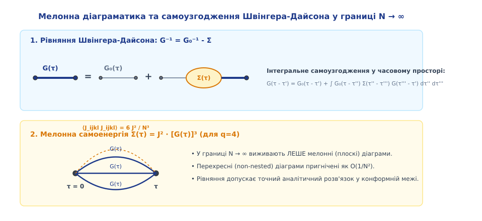
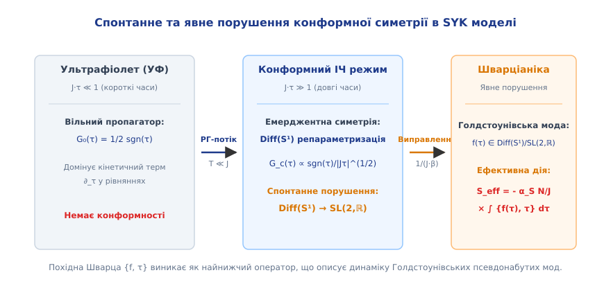
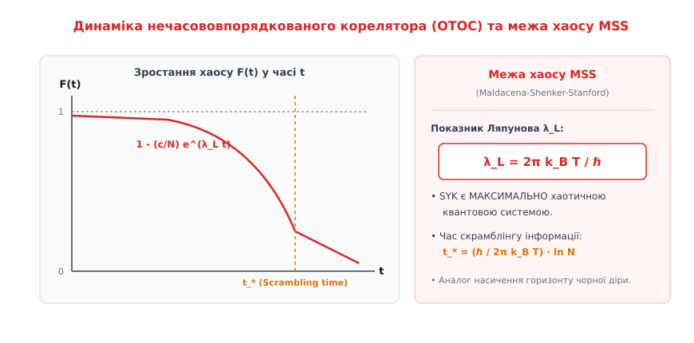
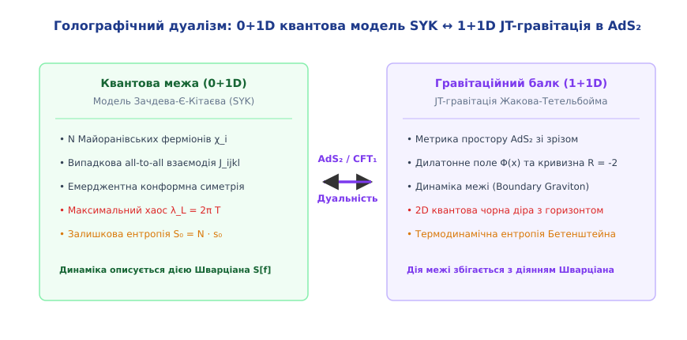

# Модель Зачдева-Є-Кітаєва (SYK model)

<preknowlist>
- [Стаціонарне рівняння Шредінгера](book:physics/mechanics/stationary-schrodinger-equation) — операторний формалізм квантової механіки, ферміонні оператори та квантові стани.
- [Показник Ляпунова](book:physics/mechanics/lyapunov-exponent) — квантовий хаос, розходження траєкторій у фазовому просторі та OTOC-корелятори.
- [Похідна Шварца](book:physics/mechanics/schwarzian-derivative) — конформна симетрія, перетворення Мьобіуса та ефективні дії м'яких мод.
</preknowlist>

Більшість класичних та квантових багаточастинкових систем, які описують фізику твердого тіла та фізику конденсованого стану, спираються на концепцію квазічастинок — елементарних збуджень, які поводяться як майже вільні частинки зі скінченним часом життя. У рамках стандартної теорії фермі-рідини Ландау міжатомна взаємодія лише ефективно одеває електрон, змінюючи його масу та затухання, але залишає незмінною топологію фазового простору та фундаментальні уявлення про одноелектронні стани. Завдяки цьому складні системи з трильйонами взаємодіючих електронів вдається спростити до моделі слабковзаємодіючого газу квазічастинок, де кожен стан характеризується вираженим імпульсом `k` та спіном.

Однак у системах із сильними квантовими кореляціями — таких як високотемпературні купратні надпровідники, дивні метали (strange metals), сполуки з важкими ферміонами та органічні провідники поблизу квантових критичних точок — картина квазічастинок повністю руйнується. Експериментально спостережуваний електричний опір дивних металів зростає строго лінійно з температурою `R ∝ T` від наднизьких температур аж до межі плавлення решітки. Це фундаментально суперечить стандартному квадратичному закону `R ∝ T²`, притаманному фермі-рідинам Ландау, і свідчить про те, що час розсіювання квантових носіїв досягає так званої Планківської межі `τ_P ≈ ℏ / (k_B T)`. У такому режимі енергія затухання збудження стає порівнянною із середньою тепловою енергією самого збудження, через що спектральна функція електрона втрачає вузький лоренцівський пік квазічастинки і перетворюється на широкий розмазаний континуум без чітко визначених одноелектронних полюсів.

Тривалий час у теоретичній фізиці існувала фундаментальна перешкода: як побудувати аналітично розв'язувану квантову модель багаточастинкової системи без квазічастинок, яка водночас не зводиться до інтегровних одновимірних моделей і зберігає сильну квантову плутанину на всіх масштабах? Відповіддю на цей запит стала модель Зачдева-Є-Кітаєва (Sachdev-Ye-Kitaev model, SYK). Описана Субіром Зачдевом та Цзіньву Є у 1993 році для спінових систем і кардинально переосмислена Олексієм Кітаєвим у 2015 році для Майоранівських ферміонів, ця модель стала містком між квантовою фізикою конденсованого стану, теорією квантового хаосу та голографічною гравітацією Чорних дір.

## 1. Сильнозв'язані квантові системи та парадокс квазічастинок

Щоб зрозуміти необхідність виходу за межі стандартної парадигми квазічастинок, розглянемо, як працює традиційна теорія Фермі-рідини Ландау. У системі з `N` ферміонів при низьких температурах носії заповнюють сферу Фермі у імпульсному просторі. Коли електрон збуджується над поверхнею Фермі на малу енергію `ε`, процес його розсіювання на інших електронах обмежений принципом заборони Паулі: і початкові, і кінцеві стани учасників розсіювання мають лежати у вузькому термодинамічному прошарку товщиною `k_B T`.

Завдяки цьому геометричному обмеженню у фазовому просторі імовірність двочастинкового розсіювання виявляється пропорційною квадрату енергії збудження та квадрату температури:

```
1 / τ(ε, T) = C₁ · ε² + C₂ · (k_B T)²
```

Коли температура прямує до абсолютного нуля `T → 0`, час життя збудження `τ` зростає як `1/T²` значно швидше, ніж періодичність квантової фази `ℏ / ε`. Оскільки вага квазічастинкового полюса `Z` залишається скінченною (`0 < Z ≤ 1`), квазічастинка встигає зробити незліченну кількість коливань і пролетіти великі відстані, перш ніж зазнає розсіювання. Тому хвильовий вектор `k` залишається хорошим квантовим числом, а сама система підпорядковується одноелектронній кінетиці Больцмана.

У сильнокорельованих речовинах цей механізм вимикається. Якщо кулонівська міжатомна взаємодія порівнянна або перевищує кінетичну енергію (ширину зони провідності), або якщо у системі панує сильний квантовий безпорядок, трансляційна симетрія кристалічної ґратки ламається, а концепція імпульсного простору `k` втрачає сенс. Квазічастинковий фактор `Z` обнуляється (`Z → 0`), а збудження перестають локалізуватися на окремих хвильових векторах і миттєво розподіляють квантову інформацію по всіх ступенях вільності системи.

Такий процес швидкого перерозподілу інформації та локальної квантової плутанини називається **скрамблінгом** (quantum scrambling). У системі без квазічастинок час розсіювання досягає абсолютного мінімуму, дозволеного принципами квантової механіки та теорії відносності — Планківського часу `τ_P`:

```
τ_P = ℏ / (k_B T)
```

Для створення теоретичного інструменту, здатного аналітично описати Планківський метал та квантовий скрамблінг без використання просторових координат, було запропоновано модель, у якій геть відсутні геометричні відстані. Усі `N` частинок системи знаходяться в одній просторовій точці (нульвимірний простір, 0+1D) і взаємодіють між собою за принципом «кожен з кожним» (all-to-all interaction) через випадкові константи зв'язку.

Початкова модель Зачдева-Є (1993) розглядала `N` комплексних спінів із симетрією `SU(M)`, де вивчалася границя великої кількості спінових компонент `M → ∞` та `N → ∞`. У 2015 році Олексій Кітаєв спростив цю модель, замінивши спіни на дійсні Майоранівські ферміони з 4-частинковою випадковою взаємодією. Це спрощення не лише зберегло усю багату не-Фермі-рідку фізику, а й відкрило прямий точний шлях до обчислення квантового хаосу та голографічної дуальності.

Детальний аналіз історичного шляху створення моделі SYK — від спінових систем `SU(M)` до квантового хаосу — наведено у вставці [📜 Історія виникнення та еволюція моделі SYK](book:physics/mechanics/syk-model/hist-syk.md).

## 2. Гамільтоніан, алгебра Майорана та статистика випадкових зв'язків

Класичне формулювання Кітаєва описує модель SYK за допомогою `N` дійсних (Майоранівських) ферміонних операторів `χ_i` (де `i = 1, 2, ..., N`). На відміну від звичайних комплексних ферміонів Дірака `c_k`, які описують електронні або діркові стани та задовольняють співвідношенням `{c_k, c_m^†} = δ_km`, Майоранівські ферміони є власними античастинками:

```
χ_i^† = χ_i
```

Вони задовольняють фундаментальним антикомутаційним співвідношенням алгебри Кліффорда:

```
{χ_i, χ_j} = χ_i · χ_j + χ_j · χ_i = 2 · δ_ij
```

Оскільки квадрат кожного Майоранівського оператора дорівнює одиниці `(χ_i)² = 1`, окремий Майоранівський ферміон не має власного оператора числа частинок. З двох дійсних Майоранівських операторів можна зібрати один комплексний ферміон Дірака:

```
c_k = (χ_{2k-1} + i · χ_{2k}) / 2
c_k^† = (χ_{2k-1} - i · χ_{2k}) / 2
```

Отже, система з `N` Майоранівських ферміонів відповідає `N/2` комплексним ферміонам і має розмірність гіперпростору станів (Гільбертового простору), яка дорівнює:

```
dim H = 2^(N/2)
```

Гамільтоніан канонічної `q`-частинкової моделі SYK описує одночасну взаємодію `q` Майоранівських ферміонів (найчастіше розглядають чотиричастинкову взаємодію `q = 4`):

```
H = (1 / 4!) · ∑_{i, j, k, l = 1}^{N} J_ijkl · χ_i · χ_j · χ_k · χ_l
```

У цій формулі сумування проводиться за всіма можливими індексами від `1` до `N`. Величина `J_ijkl` являє собою абсолютно антисиметричний тензор констант зв'язку: при перестановці будь-якої пари індексів знак `J_ijkl` змінюється на протилежний, а елементи з однаковими індексами дорівнюють нулю (завдяки тотожності `(χ_i)² = 1`).

Ключовою особливістю моделі є те, що константи зв'язку `J_ijkl` не є фіксованими числами, а вибираються як випадкові незалежні гаусові величини з нульовим середнім значенням:

```
⟨ J_ijkl ⟩ = 0
```

Дисперсія (квадратичне відхилення) констант зв'язку підпорядковується суворому масштабуванню за кількістю частинок `N`:

```
⟨ (J_ijkl)² ⟩ = (3! · J²) / N³ = ( (q - 1)! · J² ) / N^(q - 1)    [при q = 4]
```

Тут `J` має розмірність енергії й визначає фундаментальний масштаб взаємодії у системі. Множник `1 / N^(q-1)` вибрано не випадково: саме таке нормування забезпечує існування стійкої термодинамічної границі при `N → ∞`. Якщо `N` прямує до нескінченності, повна внутрішня енергія системи та її ентропія зростають строго лінійно з `N` (`E ∝ N`), а самоенергія ферміонів залишається скінченною.

Залежно від значення `N mod 8`, точний спектр гамільтоніана SYK підпорядковується різним ансамблям теорії випадкових матриць (Random Matrix Theory, RMT). Зокрема, при `N ≡ 0 (mod 8)` матриця гамільтоніана належить до ортогонального ансамблю (GOE), при `N ≡ 2, 6 (mod 8)` — до унітарного (GUE), а при `N ≡ 4 (mod 8)` — до симплектичного (GSE). Це свідчить про наявність квантового хаосу на рівні точної статистичної розподіленості енергетичних рівнів.

Безпорядок у `J_ijkl` є **загартованим** (quenched disorder). Це означає, що при розрахунку термодинамічних величин (таких як вільна енергія `F = -k_B T · ln Z`) необхідно спочатку обчислити логарифм статистичної суми `Z` для конкретної реалізації випадкових зв'язків `J_ijkl`, а вже потім виконати усереднення за статистичним ансамблем:

```
F = -k_B T · ⟨ ln Z ⟩_J
```

Безпосередній розрахунок `⟨ ln Z ⟩_J` є складною математичною задачею, яка вирішується методом реплік або шляхом переходу до колективних білокальних полів у граніці великого `N`.

## 3. Границя N → ∞, мелонні діаграми та рівняння Швінгера-Дайсона

У термодинамічній границі `N → ∞` модель SYK демонструє дивовижну властивість: попри сильний безпорядок та відсутність малості у константі взаємодії `J`, її квантова динаміка стає аналітично розв'язуваною. Це досягається завдяки фундаментальному спрощенню діаграмної техніки Фейнмана.

Розглянемо термодинамічний (температурний) пропагатор Майоранівського ферміона у часовому представленні Мацубари `τ ∈ [0, β]` (де `β = 1 / (k_B T)` — обернена температура):

```
G(τ) = (-1 / N) · ∑_{i=1}^{N} ⟨ T_τ χ_i(τ) χ_i(0) ⟩
```

Тут `T_τ` — оператор хронологічного впорядкування за уявним часом. Для вільного ферміона (при `J = 0`) вільний пропагатор має вигляд ступенчатої функції:

```
G₀(τ) = (1 / 2) · sgn(τ)
```

При включенні взаємодії `H` будь-який елемент розкладу у ряд теорії збурень містить добутки констант `J_ijkl`. Усереднення за гаусовим ансамблем `⟨ J_ijkl J_abcd ⟩_J` зводить кожну пару констант зв'язку до спарювання (пунктирної лінії у діаграмній техніці), що дає фактор `J² / N³`.

Кожна внутрішня ферміонна петля дає суму за індексами від `1` до `N`, тобто приносить фактор `N`. У результаті кожна фейнманівська діаграма масштабується як `N^(V - P)`, де `V` — кількість ферміонних петель, а `P` — кількість спарювань випадкових зв'язків.

Аналіз топології графів показує, що при `N → ∞` ненульовий внесок дають лише плоскі діаграми, які називаються **мелонними** (або кавунними, watermelon diagrams). Усі діаграми з перехресними спарюваннями (non-nested diagrams) мають топологічні перекручення і пригнічуються як мінімум як `O(1 / N²)`.


*Мелонна діаграматика та самоузгодження Швінгера-Дайсона у границі N → ∞.*

Завдяки тому, що виживають лише мелонні діаграми, точна ферміонна самоенергія `Σ(τ)` виражається замкненим чином через повний пропагатор `G(τ)` без будь-яких вершинних поправок. Для `q = 4` самоенергія являє собою добуток трьох пропагаторів, що відповідають трьом внутрішнім ферміонним лініям у мелонному графі:

```
Σ(τ) = J² · [G(τ)]³ = J² · [G(τ)]^(q - 1)
```

Разом із точним рівнянням Дайсона у часовому та частотному просторі Мацубари `ω_n = (2n + 1)·π / β`, це дає закриту систему замкнених інтегро-диференціальних рівнянь Швінгера-Дайсона:

```
G(ω_n)⁻¹ = G₀(ω_n)⁻¹ - Σ(ω_n) = i·ω_n - Σ(ω_n)
G(τ) = (1 / β) · ∑_{n=-∞}^{∞} e^(-i·ω_n·τ) · G(ω_n)
Σ(τ) = J² · [G(τ)]³
```

Ці рівняння описують точну електронну структуру моделі SYK при будь-яких температурах `T` та енергіях `J`.

У режимі низьких температур (`k_B T ≪ J` або `β J ≫ 1`), що відповідає довгим часовим інтервалам `J·τ ≫ 1`, член `i·ω_n` у першому рівнянні (який відповідає вільному кінетичному руху `∂_τ`) стає нехтовно малим порівняно з велетенською самоенергією `Σ(ω_n) ~ J`.

Незважаючи на те, що нехтування членом `i·ω_n` виглядає просто математичним наближенням, воно кардинально змінює симетрійні властивості системи. Рівняння Швінгера-Дайсона у цій низькоенергетичній (конформній) границі набуває інтегрального вигляду:

```
∫₀^β dτ' Σ(τ - τ') · G(τ' - τ'') = -δ(τ - τ'')
```

Математичні деталі виведення цих рівнянь через функціональний інтеграл та метод перевальної точки викладено у вставці [🧮 Математичне виведення рівнянь Швінгера-Дайсона та перевальна точка](book:physics/mechanics/syk-model/math-syk.md).

## 4. Конформна симетрія, спонтанне порушення та Шварціановий режим

Інтегральне рівняння низькоенергетичної границі має нескінченновимірну симетрію відносно довільної неперервної репараметризації уявного часу `τ ↦ f(τ)`. Якщо ми виконаємо заміну часу `τ = f(σ)`, функція Гріна та самоенергія перетворюються за конформним законом:

```
G(τ₁, τ₂) = [f'(σ₁) · f'(σ₂)]^Δ · G_new(σ₁, σ₂)
Σ(τ₁, τ₂) = [f'(σ₁) · f'(σ₂)]^(Δ·(q - 1)) · Σ_new(σ₁, σ₂)
```

де `Δ = 1 / q` являє собою конформну масштабувальну розмірність Майоранівського ферміона (для `q = 4` розмірність `Δ = 1/4`).

Підставляючи це перетворення в інтегральне рівняння, можна переконатися, що функціональна форма рівняння Швінгера-Дайсона повністю зберігається для довільної монотонної функції `f(σ)`. Це свідчить про виникнення **емерджентної репараметризаційної симетрії** `Diff(S¹)` у інфрачервоній границі.

При нульовій температурі (`β → ∞`) розв'язком конформного рівняння є степенна функція Гріна:

```
G_c(τ) = b · sgn(τ) / |J · τ|^(2/q) = b · sgn(τ) / |J · τ|^(1/2)    [при q = 4]
```

Коефіцієнт `b` визначається з умови самоузгодження: `J² · b^q · π = (1/2 - Δ) · tan(π·Δ)`. Для скінченної температури `β = 1 / (k_B T)` конформне перетворення `τ ↦ tan(π·τ / β)` дає точну теплову функцію Гріна:

```
G_c(τ) = b · sgn(τ) · [ π / (β · J · sin(π·τ / β)) ]^(1/2)
```

Однак вакуумний стан `G_c(τ)` не є інваріантним відносно усього класу нескінченних перетворень `Diff(S¹)`. Він зберігає інваріантність лише відносно трипараметричної підгрупи дробово-лінійних перетворень Мьобіуса `SL(2, ℝ)`:

```
f(τ) = (a · τ + b) / (c · τ + d),    де a·d - b·c = 1
```

Детальні властивості цих перетворень описані у статті [Похідна Шварца](book:physics/mechanics/schwarzian-derivative).

Таким чином, у системі відбувається **спонтанне порушення симетрії** від нескінченновимірної групи репараметризацій `Diff(S¹)` до скінченновимірної групи `SL(2, ℝ)`. Згідно з теоремою Ґолдстоуна, спонтанне порушення безперервної симетрії має приводити до виникнення безмасових колективних збуджень — Голдстоунівських мод. У нашому випадку цими модами є довільні часові репараметризації `f(τ) ∈ Diff(S¹) / SL(2, ℝ)`.


*Спонтанне та явне порушення конформної симетрії у інфрачервоній границі SYK моделі.*

Проте кінетичний терм `i·ω_n` (або `∂_τ`), яким ми знехтували у конформній межі, викликає **явне порушення** симетрії `Diff(S¹)`. На малих масштабах часу кінетичний терм руйнує точну конформність і знімає безмасовий характер Голдстоунівських мод.

У результаті репараметризації `f(τ)` стають **псевдоґолдстоунівськими модами** (soft modes). Вони отримують малу, але скінченну ефективну дію, яка повністю визначається величиною явного порушення симетрії.

Ефективна дія для м'яких мод `f(τ)` виражається через найнижчий диференціальний оператор, який є інваріантним відносно підгрупи `SL(2, ℝ)`. Цим єдиним унікальним оператором є **похідна Шварца** `{f(τ), τ}`:

```
{f(τ), τ} = f'''(τ) / f'(τ) - (3/2) · (f''(τ) / f'(τ))²
```

Інтегруючи цей оператор по колу евклідового часу `τ ∈ [0, β]`, отримуємо **ефективну дію Шварціана**:

```
S_eff[f] = - (N · α_S / J) · ∫₀^β dτ {f(τ), τ}
```

Безрозмірний коефіцієнт `α_S` обчислюється чисельно з рівнянь Швінгера-Дайсона (для `q = 4` значення `α_S ≈ 0.0071`).

Формула Шварціана описує усю низькотемпературну термодинаміку моделі SYK: флуктуації теплоємності, кореляції часових мод та квантовий хаос.

## 5. Квантовий хаос, OTOC-корелятори та межа Мальдасени-Шенкера-Стенфорда

Одним із найважливіших відкриттів у сучасній теоретичній фізиці стало усвідомлення того, що модель SYK є **максимально хаотичною квантовою системою**.

У класичній механіці хаос вимірюється швидкістю розходження двох близьких фазових траєкторій `dx(t) = dx(0) · exp(λ_L · t)`, де `λ_L` — показник Ляпунова. Більш детально цей механізм розглянуто у статті [Показник Ляпунова](book:physics/mechanics/lyapunov-exponent).

У квантовій механіці концепція траєкторій відсутня. Аналогом ляпуновського розходження є швидкість втрати комутативності між двома операторами `A` та `B`, виміряними у різні моменти часу. Якщо на початку `[A(t), B(0)] = 0`, то під дією хаотичного гамільтоніана оператор `A(t) = e^(iHt) A e^(-iHt)` ускладнюється, заплутуючись з усіма ступенями вільності системи (зростання розміру оператора у просторі Крилова).

Для кількісного опису цього процесу використовують **нечасововпорядкований корелятор** (Out-Of-Time-Ordered Correlator, OTOC):

```
F(t) = ⟨ A(t) · B(0) · A(t) · B(0) ⟩_T
```

Зверніть увагу на незвичайний порядок часів у добутку: оператори чергуються `t → 0 → t → 0`. Такий порядок неможливо виміряти у звичайному причинному експерименті без процедури повороту часу назад.

У хаотичній багаточастинковій системі при малій зміні початкових умов корелятор `F(t)` починає відхилятися від свого незбуреного значення `F₀` за експоненціальним законом:

```
F(t) = c₀ - (c₁ / N) · e^(λ_L · t) + O(1 / N²)
```

Коефіцієнт `λ_L` називається **квантовим показником Ляпунова**.


*Динаміка нечасововпорядкованого корелятора (OTOC) та насичення межі квантового хаосу MSS.*

У 2015 році Хуан Мальдасена, Дуглас Шенкер та Стенфорд (MSS) довели фундаментальну теорему: у будь-якій квантовій системі при скінченній температурі `T` квантовий показник Ляпунова строго обмежений зверху так званою **межею MSS**:

```
λ_L ≤ (2 · π · k_B · T) / ℏ = 2 · π / β
```

Більшість стандартних квантових систем (включно із фермі-рідинами та слабковзаємодіючими газами) мають показник Ляпунова, значно менший за цю межу: `λ_L ∝ T² ≪ T`.

Однак обчислення OTOC у моделі SYK (яке зводиться до аналізу обміну псевдоґолдстоунівськими модами Шварціана через чотириточкову функцію Гріна) дає дивовижний результат:

```
λ_L^(SYK) = (2 · π · k_B · T) / ℏ
```

Модель SYK **строго насичує межу хаосу MSS**. Вона скрамблує квантову інформацію з максимально можливою швидкістю, дозволеною законами природи.

Час, за який квантове збудження повністю розмазується по усім `N` ферміонам (називається часом скрамблінгу `t_*`), визначається з умови `(c₁ / N) · e^(λ_L · t_*) ≈ 1`:

```
t_* = (1 / λ_L) · ln N = (ℏ / (2·π·k_B·T)) · ln N
```

Логарифмічна залежність від кількості частинок `ln N` є характерною рисою так званих **швидких скрамблерів** (fast scramblers). Єдиними відомими об'єктами у Всесвіті, які демонструють такий самий вибуховий квантовий хаос і скрамблінг, є **астрофізичні та квантові Чорні діри**.

## 6. Голографічний дуалізм: зв'язок із 2D чорними дірами (AdS_2 / CFT_1)

Насичення межі квантового хаосу та поява дії Шварціана підштовхнули фізиків до виявлення глибинного голографічного зв'язку між моделлю SYK та квантовою гравітацією у рамках концепції AdS/CFT дуальності.

Згідно з дуальним принципом, квантова багаточастинкова система без гравітації у `D` вимірах еквівалентна класичній або квантовій теорії гравітації у просторі вищої розмірності `D + 1` з негативною космологічною сталою (простір Анти-де Сіттера, `AdS`).

Для 0+1-вимірної моделі SYK (яка живе строго у часі `τ`) голографічний подвійник має жити у 1+1-вимірному просторі-часі `AdS₂` (один просторовий вимір `r` та один часовий вимір `t`).


*Голографічна дуальність між 0+1D квантовою моделлю SYK та 1+1D гравітацією Жакова-Тетельбойма в просторі AdS₂.*

Найпростішою теорією гравітації у 1+1 вимірах є **теорія Жакова-Тетельбойма (JT gravity)**. Її дія описується тензором кривизни `R` та додатковим скалярним полем — дилатоном `Φ(x)`:

```
S_JT = (Φ₀ / (16·π·G_N)) · ∫ d²x √(-g) R + (1 / (16·π·G_N)) · ∫ d²x √(-g) Φ · (R + 2)
```

Рівняння руху цієї теорії вимагають, щоб простір-час мав строго постійну від'ємну кривизну `R = -2`, тобто утворював двовимірний простір Анти-де Сіттера `AdS₂`.

У двовимірній гравітації чорна діра являє собою геометрію з горизонтом подій у внутрішній області `AdS₂`. Динамічні ступені вільності такої чорної діри зосереджені на зовнішній фізичній межі (boundary graviton).

Коли математики обчислили ефективну дію для флуктуацій зовнішньої межі двовимірної чорної діри у теорії Жакова-Тетельбойма, виявилося, що вона **строго збігається з дією Шварціана**:

```
S_boundary^(JT) = - C_JT · ∫ dτ {f(τ), τ} = S_eff^(SYK)[f]
```

Це означає, що квантові флуктуації м'яких мод у моделі SYK є точним голографічним дзеркальним відображенням фізичних коливань горизонту подій двовимірної чорної діри!

Понад те, модель SYK володіє ще однією дивовижною властивістю — **залишковою ентропією при нульовій температурі** `S₀`. Зазвичай у термодинаміці згідно з третім законом (теоремою Нернста) ентропія системи при `T → 0` прямує до нуля `S(0) = 0`, оскільки основний стан є нееродромним (одиничним).

У моделі SYK границя `N → ∞` та `T → 0` не комутують. Якщо спочатку спрямувати `N → ∞`, а потім знижувати температуру, система зберігає величезний термодинамічний хаос у самому основному стані:

```
S(T → 0) = N · s₀
```

Для Майоранівських ферміонів при `q = 4` чисельне значення питомої залишкової ентропії становить:

```
s₀ = (G / π) + (1/2) · ln 2 ≈ 0.464848...
```

де `G ≈ 0.915965...` — стала Каталана.

У голографічній картині ця залишкова ентропія `N · s₀` строго дорівнює термодинамічній ентропії Бекенштейна-Гокінґа двовимірної чорної діри, пропорційній площі її горизонту подій: `S_BH = Area / (4 · G_N)`.

## 7. Комплексна модель SYK, спектральний формаційний фактор та складність у просторі Крилова

Поряд із канонічною Майоранівською моделлю важливе місце у фізиці конденсованого стану посідає **комплексна модель SYK (cSYK)**. Вона описується комплексними ферміонами Дірака `c_i` з випадковими взаємодіями вигляду `c_i^† c_j^† c_k c_l`.

На відміну від Майоранівської системи, комплексна модель зберігає додаткову глобальну калібрувальну симетрію `U(1)`, що відповідає збереженню електричного заряду або кількості ферміонів `Q = ∑_i c_i^† c_i`. Наявність заряду дозволяє ввести хімічний потенціал `μ` та описувати процеси стискання заряду, термоелектричний ефект (коефіцієнт Зеєбека) та фазові переходи метал-ізолятор у квантових крапках.

Другим потужним діагностичним інструментом квантового хаосу у моделі SYK є **Спектральний формаційний фактор (Spectral Form Factor, SFF)**. Величина `K(t)` визначається як аналітичне продовження термодинамічної статистичної суми на реальну часову вісь `t`:

```
K(t) = | Tr( e^(-(β/2 + i·t)·H) ) |² / | Tr( e^(-β·H) ) |²
```

Часова еволюція `K(t)` у моделі SYK демонструє універсальну криву хаосу, яка складається з чотирьох послідовних фаз:

1. **Спад (Slope):** На ранніх часах `K(t)` швидко спадає через рапідне загасання самоенергії ферміонів.
2. **Мінімум (Dip):** Досягається на так званому часі Тулеса (Thouless time), де індивідуальні рівні матриці починають відчувати міжрівневе відштовхування.
3. **Зростання (Ramp):** Спектральний формаційний фактор зростає строго лінійно за часом `K(t) ∝ t`. Це лінійне зростання є незаперечним доказом наявності міжрівневого відштовхування Віґнера-Дайсона (Wigner-Dyson level repulsion), характерного для теорії випадкових матриць та квантового хаосу.
4. **Плато (Plateau):** На квантових Гейзенберґівських часах `t_H ~ 2^(N/2)` лінійне зростання насичується, виходячи на скінченну константу.

З точки зору квантової інформатики та алгоритмів, динаміка у моделі SYK досліджується також за допомогою **складності у просторі Крилова (Krylov Complexity)**. Будь-який квантовий оператор `A(t)` розкладається за ортонормованим базисом Ланцоша `O_n`:

```
A(t) = ∑_{n=0}^{dim H} iⁿ · φ_n(t) · O_n
```

Коефіцієнти розкладу Ланцоша `b_n` у моделі SYK демонструють максимально можливе лінійне зростання за номером `n`:

```
b_n = α · n + γ + O(1/n)
```

де `α = (2 · π · k_B · T) / ℏ`. Лінійне зростання коефіцієнтів Ланцоша є математичним доказом експоненціального розростання розміру оператора у Гільбертовому просторі та граничної швидкості квантового скрамблінгу.

## 8. Перспективи експериментальних реалізацій та квантового моделювання

Головним практичним питанням фізики конденсованого стану залишається спосіб лаборатного втілення гамільтоніана SYK у реальних фізичних приладах. Оскільки модель вимагає випадкових all-to-all взаємодій без просторової залежності, її пряма реалізація у звичайних 3D кристалах є ускладненою через згасання кулонівських сил з відстанню `1/r`.

Проте запропоновано кілька елегантних мезоскопічних схем:

1. **Квантові крапки із загартованим безпорядком:** Границя квантової крапки на основі напівпровідникового гетеропереходу `GaAs/AlGaAs` або топологічного ізолятора під дією сильного випадкового потенціалу домішок демонструє квантовий хаос, який описується комплексною моделлю SYK.
2. **Майоранівські дроти у мезоскопічних структурах:** Використання масивів Майоранівських нульових мод, локалізованих на кінцях надпровідних дротів із сильним спін-орбітальним зв'язком, дозволяє сформувати гамільтоніан `χ_i χ_j χ_k χ_l` за рахунок ємнісної взаємодії квантового острова.
3. **Квантові процесори та холодні атоми:** Емуляція динаміки SYK на надпровідних кубітах (Google Sycamore, IBM Quantum) та холодних іонах у оптичних пастках дозволяє прямим чином спостерігати скрамблінг інформації та вимірювати OTOC-корелятори у реальному часі.

> 🔧 **Навіщо це.**
> 
> 1. **Теорія дивних металів:** Модель SYK дала перше аналітично точне пояснення Планківського опору `R ∝ T` та аномальної фотоемісійної спектроскопії у високотемпературних надпровідниках. Модифікації моделі із просторовою ґраткою реплік SYK-кластерів розв'язують проблему опису не-фермі-рідких фаз у фізиці конденсованого стану.
> 2. **Лабораторні квантові скрамблери:** Ідеї SYK втілюються в експериментах на квантових крапках із загартованим безпорядком, мезоскопічних Майоранівських дротах та холодних атомах у оптичних пастках для створення квантових пам'ятей, стійких до декогеренції.
> 3. **Квантова гравітація та парадокс інформації:** Завдяки дуальності `SYK ↔ JT`, модель дала змогу аналітично обчислити криву Пейджа для випромінювання Гокінґа та розв'язати парадокс втрати інформації при випаровуванні чорних дір у рамках функціонального інтегрування по кротових норах (replica wormholes).

Для практичного освоєння чисельного моделювання моделі SYK — розв'язання рівнянь Швінгера-Дайсона методом ітерацій та точної діагоналізації гамільтоніана — зверніться до вставок:
- 📜 [Історія виникнення та еволюція моделі SYK](book:physics/mechanics/syk-model/hist-syk.md)
- 🧮 [Математичне виведення рівнянь Швінгера-Дайсона та перевальна точка](book:physics/mechanics/syk-model/math-syk.md)
- ⚙️ [Чисельне моделювання: солуер Швінгера-Дайсона та точна діагоналізація](book:physics/mechanics/syk-model/proj-syk.md)
- 📋 [Архітектура та API солуера SYK](book:physics/mechanics/syk-model/api-syk.md)
