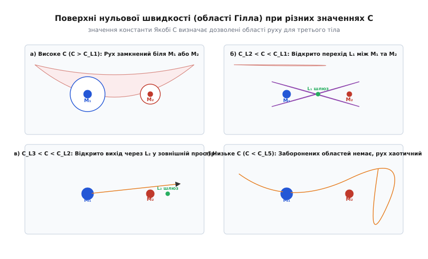
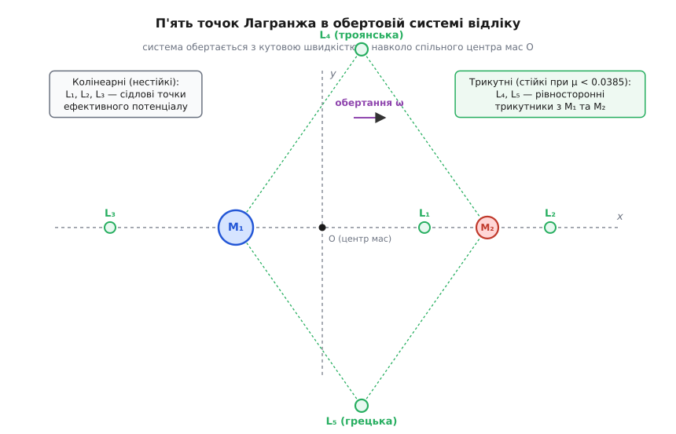
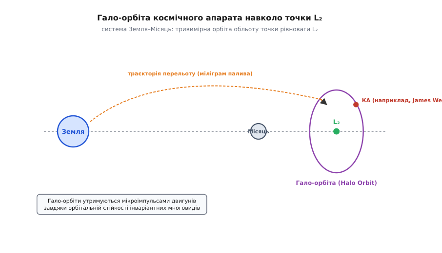
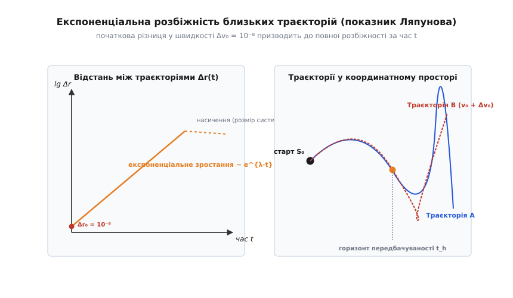
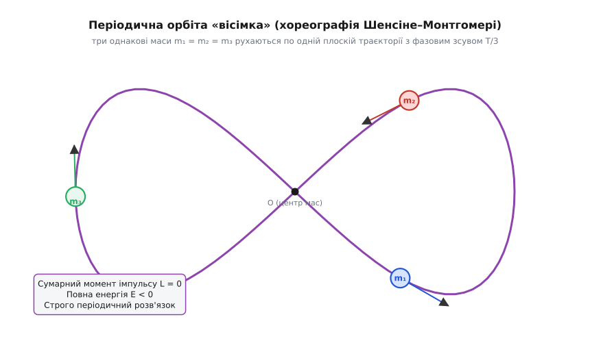

# Задача трьох тіл: межа аналітичної механіки та народження хаосу

<preknowlist>
- [Закон всесвітнього тяжіння](topic:physics/newton-gravitation) — векторна сила гравітаційного притягання `F = G·m₁·m₂ / r²`.
- [Закони Кеплера](topic:physics/keplers-laws) — точний розв'язок задачі двох тіл, орбіти у вигляді конічних перерізів.
- [Обертова система відліку](topic:physics/inertial-frame) — відцентрова сила та сила Коріоліса у системі, що обертається з кутовою швидкістю `ω`.
- [Детермінований хаос](topic:physics/deterministic-chaos) — чутливість динамічної системи до початкових умов та розбіжність траєкторій.
</preknowlist>

Коли космічний апарат розганяється для перельоту від Землі до Місяця або коли астрономи проектують орбіту телескопа James Webb біля точки відносного спокою, спроба застосувати класичні закони Кеплера зазнає краху. У системі з двох тіл — Сонця та планети або Землі та супутника — рух відбувається по строго ідеальному еліпсу, параболі чи гіперболі. Проте варто додати до двох гравітуючих мас хоча б одне третє тіло, як впорядкований небесний танок перетворюється на заплутаний математичний лабіринт.

Реальний Всесвіт заповнений потрійними та багатотіловими системами. Зорі у потрійних зоряних системах (наприклад, Альфа Центавра A, B та Проксима Центавра), супутники планет-гігантів під дією Сонця, штучні апарати у системі Земля–Місяць або потрійні системи чорних дир — усі вони підкоряються динаміці задачі трьох тіл. Навіть рух нашого власній Місяця не описується простим кеплерівським еліпсом: сонячне притягання безперервно збурює місячну орбіту, викликаючи прецесію вузлів, повертання лінії апсид та короткоперіодичні коливання швидкості.

Задача трьох тіл полягає у визначенні траєкторій трьох точкових мас, які взаємодіють між собою виключно за законом всесвітнього тяжіння Ньютона. Упродовж трьох століть ця задача залишалася головним викликом класичної механіки. Спроби знайти її загальний аналітичний розв'язок натрапили на фундаментальну межу передбачуваності фізичних систем і привела до народження сучасного детермінованого хаосу, інваріантних многовидів та комп'ютерної небесної механіки.

### Межа кеплерівського раю: чому третє тіло ламає точну механіку

Щоб зрозуміти, чому додавання третього тіла кардинально змінює фізику системи, порівняємо задачу двох тіл із задачею трьох тіл через призму законів збереження, симетрій та ступенів вільності.

У задачах класичної механіки стан системи задається координатами та імпульсами (швидкостями) усіх її матеріальних точок. Система з `N` тіл у тривимірному просторі має `3N` ступенів вільності, а її фазовий простір є `6N`-вимірним. Для задачі двох тіл (`N = 2`) система має `6` ступенів вільності (`12`-вимірний фазовий простір). Завдяки фундаментальним симетріям простору та часу за теоремою Нетер задача двох тіл має **10 незалежних перших інтегралів руху**:
1. Збереження координати та швидкості центра мас (6 інтегралів).
2. Збереження вектора повного імпульсу системи (завдяки однорідності простору).
3. Збереження вектора повного моменту імпульсу `L` (3 інтеграли, завдяки ізотропії простору).
4. Збереження повної механічної енергії `E` (1 інтеграл, завдяки однорідності часу).

Крім того, специфіка ньютонівського потенціалу `1/r` дає додатковий прихований векторний інтеграл Лапласа–Рунге–Ленца. У центрі мас задача двох тіл зводиться до системи з 3 ступенями вільності та 4 скалярними інтегралами (енергія плюс 3 компоненти моменту імпульсу). Оскільки кількість незалежних інтегралів перевищує кількість ступенів вільності, за теоремою Ліувілля–Арнольда задача двох тіл є повністю інтегровною у квадратурах: її диференціальні рівняння розв'язуються у скінченних комбінаціях елементарних функцій та інтегралів від них. Траєкторії руху двох тіл строго обмежені двовимірними інваріантними торами у фазовому просторі, забезпечуючи вікову стійкість кеплерівських орбіт.

```
Задача 2 тіл: 6 ступенів вільності − 10 інтегралів  =>  Точний аналітичний розв'язок (еліпси)
Задача 3 тіл: 9 ступенів вільності − 10 інтегралів  =>  Неінтегровна система (детермінований хаос)
```

Коли у систему додається третє тіло (`N = 3`), кількість ступенів вільності зростає з 6 до 9 (фазовий простір стає `18`-вимірним). Проте кількість фундаментальних законів збереження, пов'язаних із симетріями простору-часу, **залишається рівною 10**! 

Для інтегровності системи з 9 ступенями вільності потрібно мати 9 незалежних перших інтегралів у інволюції (тобто таких, дужки Пуассона яких дорівнюють нулю `{I_i, I_j} = 0`). Наявних законів збереження катастрофічно не вистачає.

У 1887 році німецький математик Ернст Брунс довів сувору теорему: для задачі трьох тіл не існує жодних нових незалежних алгебраїчних перших інтегралів руху від координат і швидкостей, окрім класичних десяти. Двома роками пізніше Анрі Пуанкаре узагальнив цей результат, довівши, що навіть якщо шукати інтеграли у вигляді однозначних аналітичних функцій від малого параметра збурення, нових глобальних інтегралів не існує. 

Фізична причина неінтегровності полягає у тому, що притягання третього тіла безперервно руйнує просторову симетрію потенціалу для двох інших тіл. Вектор моменту імпульсу кожної окремої пари мас перестає зберігатися, а розмін енергією між трьома тілами здійснюється нелінійним чином із можливістю резонансного розгону. Наявних десяти інтегралів збереження категорично недостатньо для зниження порядку 18-вимірної системи диференціальних рівнянь до квадратур. Система виявляється фундаментально **неінтегровною**.

### Математичне формулювання та зниження порядку системи

Запишемо векторні рівняння руху трьох матеріальних точок із масами `m₁`, `m₂`, `m₃` та радіус-векторами `r₁`, `r₂`, `r₃` в інерціальній декартовій системі координат:

```
m₁ · d²r₁/dt² = G·m₁·m₂ · (r₂ − r₁) / |r₂ − r₁|³ + G·m₁·m₃ · (r₃ − r₁) / |r₃ − r₁|³
m₂ · d²r₂/dt² = G·m₂·m₁ · (r₁ − r₂) / |r₁ − r₂|³ + G·m₂·m₃ · (r₃ − r₂) / |r₃ − r₂|³
m₃ · d²r₃/dt² = G·m₃·m₁ · (r₁ − r₃) / |r₁ − r₃|³ + G·m₃·m₂ · (r₂ − r₃) / |r₂ − r₃|³
```

Ця система складається з 3 векторних диференціальних рівнянь другого порядку, що еквівалентно 18 скалярним диференціальним рівнянням першого порядку відносно компонент позицій `(x_i, y_i, z_i)` та швидкостей `(v_xi, v_yi, v_zi)`.

Для спрощення аналізу зручно перейти до **координат Якобі**, які розділяють рух центра мас та відносні переміщення тіл:
- `r_rel = r₂ − r₁`: Вектор відносної позиції перших двох тіл `M₁` та `M₂`.
- `ρ = r₃ − (m₁·r₁ + m₂·r₂) / (m₁ + m₂)`: Вектор позиції третього тіла `M₃` відносно центра мас системи `(M₁ + M₂)`.
- `R_cm = (m₁·r₁ + m₂·r₂ + m₃·r₃) / (m₁ + m₂ + m₃)`: Координата спільного центра мас.

Використовуючи класичні інтеграли руху, можна послідовно понизити порядок системи:
1. **Інтеграл центра мас**: Переходимо в систему координат з початком у центрі мас: `R_cm = 0` та `d R_cm / dt = 0`. Це усуває 6 змінних і знижує порядок системи з 18 до 12.
2. **Інтеграл моменту імпульсу та виключення вузлів (метод Якобі)**: Оскільки вектор повного моменту імпульсу `L = ∑ m_i · (r_i × v_i)` зберігається за напрямком і величиною, можна спрямувати вісь `Z` уздовж вектора `L`. Це дозволяє усунути три кутові змінні (азимутальний кут та орієнтацію площини вузлів) і знижує порядок системи ще на 4 одиниці.
3. **Інтеграл енергії**: Повна енергія `E = K + U` зберігається у часі, що дозволяє виключити ще один параметр.

Після здійснення всіх можливих алгебраїчних редукцій Якобі початкова 18-вимірна система зводиться до незвідної системи **6-го порядку** (3 ступені вільності), для якої єдиним відомим інтегралом є закон збереження енергії.

```
Початковий фазовий простір: 18 вимірів
− Центр мас (позиція і імпульс): −6 вимірів
− Вектор моменту імпульсу L: −4 виміри
− Закон збереження енергії E: −1 вимір
=========================================
Незвідний редукований фазовий простір: 7 вимірів (або 6 вимірів на енергетичній поверхні)
```

Одного рівняння збереження енергії у 6-вимірному редукованому фазовому просторі недостатньо для фіксації одновимірного шляху траєкторії. Енергетична поверхня `E = const` є 5-вимірним многовидом. Траєкторії мають достатньо просторової «свободи», щоб блукати по цій поверхні нескінченно складним, нееліптичним чином. Повний математичний вибір канонічних змінних для спрощених конфігурацій детально виведено в [математичній вставці обмеженої задачі](topic:physics/three-body-problem/math-restricted-three-body.md).

### Обмежена кругова задача трьох тіл (CRTBP) та потенціал Якобі

Оскільки загальна задача трьох тіл надзвичайно складна, астродинаміки та фізики використовують її найважливішу фундаментальну модель — **обмежену кругову задачу трьох тіл** (Circular Restricted Three-Body Problem, CRTBP).

У цій моделі роблять два обґрунтованих припущення:
1. Маса третього тіла `m₃` настільки мала порівняно з масами двох основних тіл `m₁` та `m₂` (`m₃ << m₁`, `m₂`), що її впливом на рух `m₁` та `m₂` можна повністю знехтувати.
2. Основні маси `M₁` та `M₂` (так звані первинні тіла) рухаються навколо спільного центра мас по точних колових орбітах зі сталою кутовою швидкістю `ω`.

Ця модель ідеально описує рух штучних супутників, космічних апаратів та астероїдів у системах Сонце–Земля, Земля–Місяць або Сонце–Юпітер.

Для аналізу CRTBP зручно перейти в **синодичну (обертову) систему координат** `(x, y, z)`, яка обертається з кутовою швидкістю `ω` разом із тілами `M₁` та `M₂`. У цій системі тіла `M₁` та `M₂` нерухомо лежать на осі `x` у точках `x₁ = −μ` та `x₂ = 1 − μ`, де `μ = m₂ / (m₁ + m₂)` — масовий параметр системи.

Рівняння руху третього тіла в обертовій системі мають вигляд:

```
d²x/dt² − 2·(dy/dt) = ∂Ω/∂x
d²y/dt² + 2·(dx/dt) = ∂Ω/∂y
d²z/dt² = ∂Ω/∂z
```

де `Ω(x, y, z)` — **ефективний потенціал Якобі**, який поєднує гравітаційні потенціали обох тіл та потенціал відцентрової сили:

```
Ω(x, y, z) = (1/2)·(x² + y²) + (1 − μ)/r₁ + μ/r₂
```

Тут `r₁ = √[(x + μ)² + y² + z²]` та `r₂ = √[(x − 1 + μ)² + y² + z²]` — відстані від третього тіла до `M₁` та `M₂`.

Аналіз складових потенціалу `Ω(x, y, z)` розкриває фізичну суть сил, що діють у системі:
- Перший доданок `(1/2)·(x² + y²)` є потенціалом відцентрової сили, яка прагне виштовхнути тіло на периферію від осі обертання.
- Другий та третій доданки `(1 − μ)/r₁` та `μ/r₂` є притягальними гравітаційними потенціалами центральних мас `M₁` та `M₂`.

Члени `−2·(dy/dt)` та `+2·(dx/dt)` описують прискорення Коріоліса. Оскільки сила Коріоліса завжди спрямована перпендикулярно до вектора відносної швидкості `v`, вона **не виконує роботи**. Скалярне множення рівнянь руху на вектор швидкості та подальше інтегрування дає єдиний перший інтеграл руху обмеженої задачі — **інтеграл Якобі**:

```
C = 2·Ω(x, y, z) − v²
```

де `v² = (dx/dt)² + (dy/dt)² + (dz/dt)²` — квадрат відносної швидкості тіла в обертовій системі, а `C` — константа Якобі.

Фізичний зміст константи Якобі полягає у тому, що вона відіграє роль збережуваного псевдоенергетичного рівня у неінерціальній обертовій системі відліку.

#### Поверхні нульової швидкості та області Гілла
Оскільки квадрат швидкості фізично не може бути від'ємним (`v² ≥ 0`), з інтеграла Якобі випливає нерівність `2·Ω(x, y, z) ≥ C`. Геометричне рівняння `2·Ω(x, y, z) = C` визначає у просторі **поверхні нульової швидкості** (області Гілла). Вони розбивають простір на дозволені та заборонені зони для руху космічного апарата з даним енергетичним рівнем `C`.


*Області Гілла у площині обертання. При високих значеннях C (а) дозволені зони руху навколо M₁ та M₂ ізольовані суцільною забороненою водороздільною зоною. При зниженні C (б, в) послідовно відкриваються «шлюзи» через точки Лагранжа L₁ та L₂, дозволяючи апарату переходити між тілами або вилітати у відкритий космос.*

Зміна значення константи Якобі `C` керує топологією дозволеного руху:
- **Високі значення `C > C_L1`**: Дозволені області являють собою дві окремі замкнені «капсули» навколо `M₁` та `M₂`, а також велику зовнішню область. Апарат, запущений біля Землі (`M₁`), фізично не може дістатися Місяця (`M₂`), оскільки заборонена область перекриває міжпланетний простір.
- **Критичне значення `C = C_L1`**: Поверхні нульової швидкості торкаються у точці `L₁`, утворюючи вузький перешийок (шлюз). Космічний апарат отримує можливість перейти з орбіти `M₁` на орбіту `M₂`.
- **Значення `C_L2 < C < C_L1`**: Відкривається другий шлюз через точку `L₂`, відкриваючи шлях для вильоту апарата із системи двох тіл у зовнішній простір.
- **Значення `C_L3 < C < C_L2`**: Відкривається третій шлюз позаду масивного тіла `M₁` в точці `L₃`.
- **Низькі значення `C < C_L5`**: Заборонені зони повністю зникають, і третє тіло може вільно блукати по всьому простору між первинними тілами та зовнішнім космосом.

### Точки Лагранжа: п'ять острівців рівноваги

У 1767 році Леонард Ейлер та у 1772 році Жозеф-Луї Лагранж виявили, що в обертовій системі координат існують п'ять точок, у яких гравітаційні сили двох тіл та відцентрова сила повністю зрівноважують одна одну. У цих точках вектор градієнта ефективного потенціалу дорівнює нулю:

```
∇Ω(x, y, z) = 0
```

Ці точки називаються **точками Лагранжа** (або точками лібрації) і позначаються `L₁`, `L₂`, `L₃`, `L₄`, `L₅`.


*Геометрія точок Лагранжа. Три колінеарні точки L₁, L₂, L₃ лежать на осі зв'язку M₁–M₂. Дві трикутні точки L₄ та L₅ утворюють рівносторонні трикутники з первинними тілами.*

#### Фізика та механіка колінеарних точок (L₁, L₂, L₃)
Точки `L₁`, `L₂` та `L₃` лежать на одній прямій, яка з'єднує маси `M₁` та `M₂`:
- **`L₁`**: Розташована між тілами `M₁` та `M₂`. Тут притягання `M₁` спрямоване вліво, притягання `M₂` — вправо, а відцентрова сила компенсує залишок. У системі Сонце–Земля вона знаходиться на відстані близько 1.5 млн км від Землі у напрямку Сонця. Це ідеальне місце для сонячних обсерваторій (наприклад, апарат SOHO, DSCOVR), адже звідти відкривається безперервний вигляд на сонячний диск без затінення Землею.
- **`L₂`**: Розташована за меншим тілом `M₂` на тій самій лінії. Тут притягання `M₁` та `M₂` діють у ролі єдиної центральної сили, яка компенсує збільшену відцентрову силу від обертання на більшому радіусі. У системі Сонце–Земля `L₂` лежить на відстані 1.5 млн км за Землею. Саме тут працює найпотужніший космічний телескоп James Webb, захищений Землею та сонячним щитом від випромінювання Сонця та Землі.
- **`L₃`**: Розташована за більшим тілом `M₁` на протилежному боці орбіти. Вона лежить трохи далі за орбіту `M₁`, де гравітаційне притягання обох тіл компенсує відцентрову силу.

З точки зору стійкості всі три колінеарні точки є **нестійкими** (сідловими точками потенціалу). Обчислення других частинних похідних потенціалу `Ω` показує, що вздовж осі `x` потенціал має локальний максимум (пагорб), а вздовж осі `y` — локальний мінімум.

Аналіз лінеаризованої системи динамічних рівнянь у формі `d (ΔS) / dt = A · (ΔS)` дає характеристичний поліном 4-го ступеня відносно власних чисел `λ`:
```
λ⁴ + (4 − Ω_xx − Ω_yy)·λ² + (Ω_xx·Ω_yy − Ω_xy²) = 0
```
Для колінеарних точок вільний член є від'ємним, що дає пару дійсних власних чисел `λ₁ = +σ` та `λ₂ = −σ`, а також пару чисто уявних чисел `λ₃,₄ = ±i·ν`.

Будь-яке як завгодно мале відхилення апарата від `L₁`, `L₂` чи `L₃` починає експоненціально зростати вздовж неухильного напрямку:
```
Δr(t) ~ e^(σ·t)       [де σ > 0 — дійсне власне число]
```

Проте нестійкість колінеарних точок є м'якою: наявність уявних власних чисел `±i·ν` забезпечує осциляторну компоненту руху. Це дозволяє утримувати космічні апарати на квазіперіодичних **гало-орбітах** (Halo Orbits) та орбітах Ліссажу навколо `L₁` та `L₂` за допомогою крихітних корекційних імпульсів двигунів (station-keeping) із витратою палива лише кілька метрів на секунду на рік!


*Тривимірна гало-орбіта апарата навколо точки L₂. Завдяки руху по інваріантним многовидам апарат утримується у безпосередньому околі нестійкої точки рівноваги.*

> 🔧 **Навіщо це.**
> Точки Лагранжа та зв'язані з ними гало-орбіти є основою сучасної космонавтики. Замість витрати сотень кілограмів палива для виходу на орбіту навколо планети, космічні апарати виводяться на гало-орбіти навколо `L₁` або `L₂`. Це забезпечує постійний огляд Сонця або глибокого космосу без затінення Землею та дозволяє будувати низькоенергетичні траєкторії перельоту («міжпланетну автостраду», Interplanetary Superhighway) між гравитаційними колодязями планет.

#### Фізика та механіка трикутних точок (L₄ та L₅)
Точки `L₄` та `L₅` розміщені у вершинах двох рівносторонніх трикутників, основою яких є відрізок `M₁M₂`. Вони знаходяться на орбіті малого тіла `M₂`, випереджаючи його на 60° (`L₄`) та відстаючи на 60° (`L₅`).

На відміну від колінеарних точок, трикутні точки можуть бути **орбітально стійкими**! Коли тіло зсувається з точки `L₄`, воно починає скочуватися з потенціального пагорба, але сила Коріоліса `2·(ω × v)` діє подібно до магнітної сили Лоренца: вона закручує траєкторію тіла у напрямку, перпендикулярному до руху. Це не дає тілу віддалитися і перетворює падіння на замкнені еліптичні коливання навколо `L₄` (так звану лібрацію).

Французький математик Едмон Гашо та англійський вчений Едвард Раут довели, що точки `L₄` та `L₅` є стійкими тоді й тільки тоді, коли масовий параметр `μ` задовольняє **критерію Гашо–Раута**:

```
μ < μ_crit = [1 − √(23/27)] / 2 ≈ 0.0385209...   (приблизно 1 / 25.96)
```

Маса меншого тіла `m₂` не повинна перевищувати приблизно `3.85%` від сумарної маси системи. 
Для системи Сонце–Юпітер (`μ ≈ 0.00095`) та системи Сонце–Земля (`μ ≈ 0.000003`) ця умова виконується з величезним запасом. У цих точках накопичуються астероїди-троянці. У системі Земля–Місяць `μ ≈ 0.01215 < 0.0385`, тому місячні точки `L₄` та `L₅` також є стійкими (там спостерігаються пилові хмари Кордилевського). Строгий алгебраїчний вивід критерію стійкості наведено в [математичній вставці CRTBP](topic:physics/three-body-problem/math-restricted-three-body.md).

### Механізм детермінованого хаосу та гомоклінічна павутина

Відкриття, зроблене Анрі Пуанкаре у 1889 році при дослідженні задачі трьох тіл, поклало край ілюзії про те, що ньютонівська механіка є повністю передбачуваною.

Пуанкаре застосував новий геометричний метод — **перетин Пуанкаре** (Poincaré section). Замість безперервного відстеження 6D-траєкторії він фіксував точки перетину траєкторії з певною площиною у фазовому просторі через однакові проміжки часу.

У системі з двома ступенями вільності стійкі періодичні орбіти утворюють на перетині Пуанкаре замкнені гладкі криві (торі). Проте в околі нестійких колінеарних точок `L₁` та `L₂` існують два особливих типи інваріантних багатовидів:
- **Стійкий многовид `W^s`**: Множина всіх початкових точок, траєкторії з яких асимптотично наближаються до точки рівноваги при `t → +∞`.
- **Нестійкий многовид `W^u`**: Множина початкових точок, траєкторії з яких віддаляються від точки рівноваги при `t → +∞` (або наближаються при `t → −∞`).


*Детермінований хаос у задачі трьох тіл. Ліворуч: Логарифмічне зростання відстані між двома траєкторіями Δr(t) з початковою різницею 10⁻⁸; кут нахилу прямої задає максимальний показник Ляпунова λ. Праворуч: Спільний старт із точки S₀ та незворотне розходження траєкторій A та B після проходження горизонту передбачуваності t_h.*

Пуанкаре відкрив, що стійкий `W^s` та нестійкий `W^u` многовиди не просто плавно зливаються, а перетинаються під дробовими кутами у так званих **гомоклінічних точках**. Оскільки кожен многовид є інваріантним відносно диференціальних рівнянь руху, існування однієї такої точки перетину неминуче тягне за собою існування нескінченної кількості нових перетинів!

Ці многовиди починають нескінченно сильно згортатися, петляти й утворювати неймовірно складну фрактальну структуру — **гомоклінічну павутину** (homoclinic tangle). Усередині цієї павутини траєкторії здійснюють псевдовипадкові кидки між первинними тілами.

Головними ознаками детермінованого хаосу в задачі трьох тіл є:
1. **Експоненціальна чутливість до початкових умов**: Відстань між двома початково як завгодно близькими траєкторіями `Δr(0) = Δr₀` зростає за експоненціальним законом:
```
Δr(t) ≈ Δr₀ · e^(λ·t)
```
де `λ > 0` — **максимальний показник Ляпунова** системи.
2. **Існування горизонту передбачуваності `t_h`**: Навіть якщо початковий стан апарата виміряно з фантастичною точністю `Δr₀ = 10⁻¹⁵`, через час `t_h ≈ (1/λ) · ln(1 / Δr₀)` похибка зростає до розмірів усієї системи, і точний довгостроковий прогноз стає неможливим.
3. **Збереження острівців стійкості (Теорема КАМ)**: За теоремою Колмогорова–Арнольда–Мозера хаос не є суцільним: між хаотичними морями існують замкнені квазіперіодичні тори (острівці стійкості), які утримують деякі орбіти від швидкого розпаду. Детальний історичний шлях від конкурсу короля Оскара до теореми КАМ розкрито в [історичній вставці задачі трьох тіл](topic:physics/three-body-problem/hist-three-body-problem.md).

### Крайові випадки та грандіозні космічні явища: захоплення, викид і сфера Гілла

Динаміка трьох тіл породжує грандіозні астрофізичні ефекти, які неможливі у двотіловій механіці Кеплера. 

#### 1. Гравітаційні маневри та макроскопічний обмін енергією
У задачі двох тіл космічний апарат, що пролітає повз планету, виходить із її гравітаційного поля з тією самою за модулем відносною швидкістю `v_rel`, з якою він наближався. Проте у системі Сонце–планета–апарат (задача трьох тіл) апарат може обмінюватися моментом імпульсу та енергією з планетою. У сонячноцентричній системі відліку апарат може отримати значний приріст швидкості `ΔV`:
```
V_final = V_initial + ΔV_slingshot
```
Саме завдяки гравітаційним маневрам у тритілових полях апарати Voyager, Cassini та New Horizons змогли досягти околиць Сонячної системи без гігантських витрат палива.

#### 2. Захоплення супутників та динаміка сфери Гілла
Гравітаційна область панування малого тіла `M₂` у полі масивного тіла `M₁` називається **сферою Гілла**. Радіус сфери Гілла обчислюється як:
```
r_Hill = a · (m₂ / (3·m₁))^(1/3)
```
де `a` — велика піввісь орбіти `M₂`. Для Землі радіус сфери Гілла становить близько 1.5 млн км (що збігається з відстанню до точок `L₁` та `L₂`), а для Юпітера — близько 53 млн км.

Упродовж тривалого часу вважалося, що планета не може захопити пролітаючий астероїд без наявності атмосферного гальмування. Проте у задачі трьох тіл астероїд, що влітає у сферу Гілла через шлюз точки `L₁` або `L₂` з константою Якобі, близькою до критичної, може застрягти усередині хаотичної гомоклінічної павутини на сотні обертів. Якщо за цей час відбудеться мале збурення від четвертого тіла або дисипація, астероїд стає постійним або нерегулярним супутником планети (так було захоплено Тритон Нептуном та численні нерегулярні супутники Юпітера й Сатурна).

#### 3. Викид мас та гравітаційний розпад потрійних систем
Якщо в щільній зоряній системі три зорі опиняються у тісному хаотичному прольоті, конфігурація стає вкрай нестійкою. Системи з трьох тіл порівнянної маси у понад 90% випадків закінчують своє існування **гравітаційним розпадом**: найменша за масою зоря отримує потужний імпульс від двох інших і назавжди викидається у міжзоряний простір, залишаючи тісну подвійну систему. Саме цей механізм тритілового викиду пояснює існування міжзоряних планет-блукачів (rogue planets) та надшвидкісних зір, що покидають Галактику.

### Періодичні розв'язки, хореографії та чисельні інтегратори

Незважаючи на хаотичність загального руху, у задачі трьох тіл існують окремі сімейства строго періодичних розв'язків, у яких тіла рухаються по замкнених траєкторіях, не зіштовхуючись і не вилітаючи на нескінченність.

Крім класичних колових розв'язків Ейлера та Лагранжа, у 1993 році Крістофер Мур, а у 2000 році Ален Шенсіне та Річард Монтгомері відкрили дивовижну плоску орбіту — **хореографію «вісімку»** (Figure-Eight choreography).


*Орбітально-періодична «вісімка» Шенсіне–Монтгомері. Три однакові маси m₁ = m₂ = m₃ безперервно женуться одна за одною по єдиному замкненому контуру у формі вісімки з фазовим зсувом в одну третину періоду T/3.*

У цій орбіті три однакові маси `m₁ = m₂ = m₃` рухаються вздовж однієї траєкторії у формі вісімки. Сумарний момент імпульсу системи дорівнює нулю (`L = 0`), а орбіта є стійкою відносно малих збурень! У 2013–2017 роках за допомогою суперкомп'ютерних обчислень фізики Милован Шуваков та Велимир Дмитрашинович відкрили понад 5000 нових родин таких топологічних хореографій («яблука», «метелики», «окуляри»).

#### Чому точний аналітичний ряд Зундмана недоцільний
У 1912 році фінський математик Карл Зундман довів, що точний аналітичний розв'язок задачі трьох тіл існує у вигляді збіжного степеневого ряду. Для подолання точок потрійних зіткнень Зундман ввів регуляризуючу перемінну `dτ = dt / U(r)`. 

Проте для обчислення орбіти на практиці цей ряд абсолютно непридатний: через надзвичайно повільну збіжність для розрахунку траєкторії на короткий час (наприклад, астрономічний місяць) потрібно підсумувати понад `10^(8000000)` членів ряду. Це число перевищує кількість атомів у нашому Всесвіті.

#### Сучасні чисельні інтегратори
Єдиним реальним інструментом астродинаміки є чисельне інтегрування рівнянь руху на ЕОМ. Оскільки диференціальні рівняння описують Гамільтонову систему, ззвичайні класичні методи (такі як стандартний метод Ейлера чи навіть метод Рунге–Кутти RK4) при тривалому інтегруванні накопичують похибку по енергії, спричиняючи штучний дрейф орбіт.

Для довгострокового інтегрування небесної механіки застосовують **сімплектичні інтегратори** (наприклад, алгоритм Leapfrog або сімплектичний метод Йошиди 4-го порядку). Вони точно зберігають фазовий об'єм та пучок інваріантів Гамільтонової системи, гарантуючи відсутність системного дрейфу енергії на мільйонах кроків інтегрування.

Повний вихідний код чисельного солвера задачі трьох тіл на C та C++ з використанням алгоритму Йошиди 4-го порядку надано в [практичній розробницькій вставці](topic:physics/three-body-problem/proj-three-body-simulation.md), а специфікації векторів стану та форматів SPICE наведено у [довідникові орбітальних форматів](topic:physics/three-body-problem/api-celestial-mechanics-formats.md).
