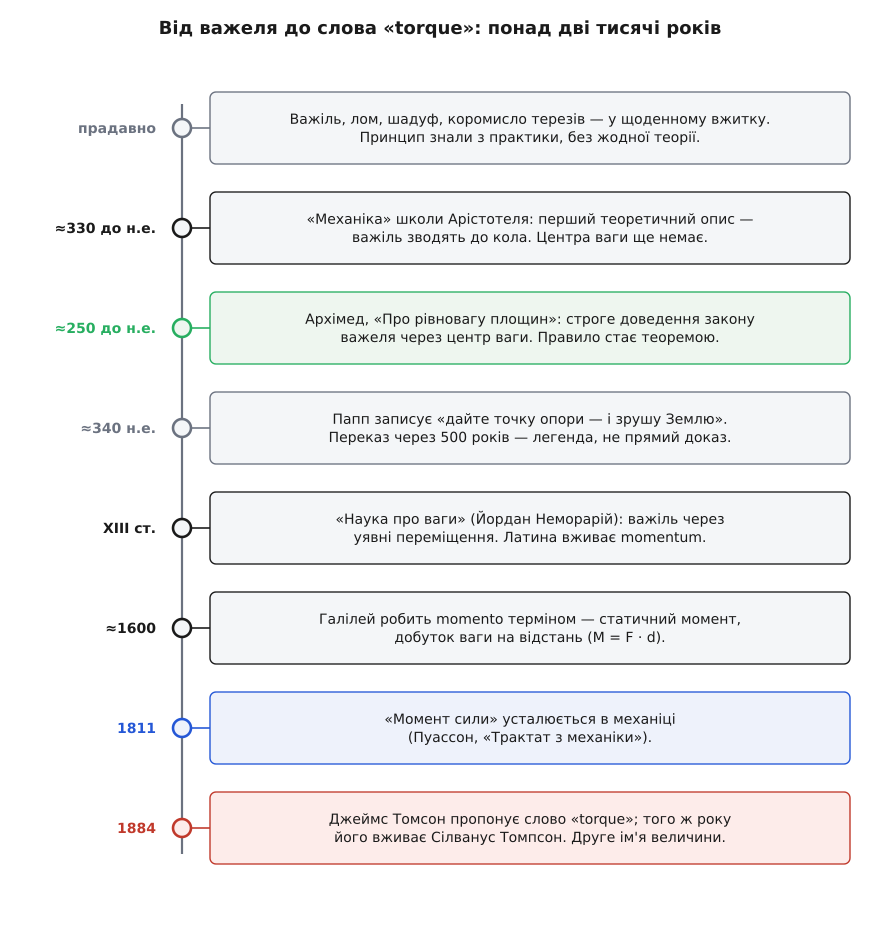

# 📜 Важіль, момент і «torque»: як народилися і закон, і його слова

Важелем користувалися тисячі років, перш ніж бодай хтось зумів пояснити, **чому** він працює. Ломом, веслом, коромислом терезів, журавлем-шадуфом над колодязем люди піднімали й зважували задовго до того, як з'явилося саме поняття «момент». І тут ховається річ, про яку легко забути: застосовувати знаряддя й довести, чому воно діє, — два різні вчинки, а між ними в історії пролягли століття. Закон важеля йшов до нас шарами: спершу голе вміння рук, потім записане емпіричне правило, потім строге доведення — і аж наприкінці, майже вчора за мірками цієї історії, слова, якими ми його називаємо.

*Шлях довжиною понад дві тисячі років: закон важеля складали шарами — вміння, емпіричне правило, доведення, назви, — і кожен шар додавали різні люди в різні епохи. Практика випередила теорію, теорія — назву.*

## Важіль працював, поки його ще ніхто не розумів

Що короткий важіль піднімає більше, ніж голі руки, знали ще будівники пірамід і кожен, хто носив воду шадуфом — довгою жердиною з противагою на короткому кінці. Це **усталений факт**: практика важеля старша за будь-який запис про нього на тисячоліття. Але практика мовчазна. Вона каже «роби так — і вийде», проте не каже, **скільки саме** сили заощадиш і **від чого** це залежить.

Перший відомий нам текст, що взявся пояснювати важіль, а не просто ним орудувати, — грецька «Механіка» (гр. *Μηχανικά*, лат. *Quaestiones Mechanicae*). Її довго приписували Арістотелеві (гр. Ἀριστοτέλης, Aristotle), та сьогодні фахівці майже одностайні: написав її не сам Арістотель, а хтось із його школи — перипатетиків, десь між смертю Арістотеля (322 р. до н.е.) і народженням Архімеда (бл. 287 р. до н.е.). Тому автора обережно звуть **псевдо-Арістотелем**: те, що трактат давніший за Архімеда, — усталено; конкретне авторство — **спірне**.

Найцікавіше — **як** саме «Механіка» пояснює важіль. Вона зводить його до кола. Уяви два кінці важеля, що повертається навколо опори: коли важіль хитнеться на той самий кут, дальній кінець пробіжить довшу дугу, ніж ближній, — бо він на більшому колі. Автор відчуває, що саме цей **більший пробіг** дальнього кінця й дає йому перевагу: та сама сила на довшому плечі «проходить більше», тож і діє потужніше. Це ще не формула, а радше влучна інтуїція — і, як з'ясується згодом, інтуїція глибока: у ній уже проглядає ідея, що працю можна рахувати через переміщення, яка через дві тисячі років ляже в основу механіки. Але це аргумент про рух і швидкість, а не про рівновагу, і центра ваги в ньому ще немає.

## Архімед доводить те, що всі й так робили

Наступний крок зробив Архімед Сиракузький (гр. Ἀρχιμήδης, Archimedes; бл. 287–212 рр. до н.е.). Варто одразу відкинути зайве: він **не винайшов** важіль і навіть не перший його описав. Його заслуга тонша — він **довів закон важеля** так, як доводять теорему в геометрії: з небагатьох очевидних припущень, без жодного «ми ж бачимо, що так виходить».

> 🔧 **Навіщо це.** Різниця між «правилом, що справджується» і «теоремою, виведеною з засад» — це різниця між рецептом і наукою. Поки закон важеля був емпіричним правилом, його можна було лише запам'ятати. Ставши теоремою, він поєднався з рештою механіки — і той самий спосіб міркування вже давав центри ваги фігур, стійкість тіл, згодом гідростатику. Архімед показав, як від опису переходять до доведення.

Зробив він це у трактаті «Про рівновагу площин» (гр. *Περὶ ἐπιπέδων ἰσορροπιῶν*). Починає з постулатів — засновків, які просить прийняти без доведення. Головний із них — постулат симетрії: рівні тягарі на рівних відстанях від опори врівноважуються. Твердження настільки очевидне, що сперечатися ніби нема з чим. А далі Архімед робить хід, у якому весь його геній: більший тягар він подумки розкладає на купку однакових малих тягарців і **розсуває** їх уздовж важеля так, щоб їхній спільний [центр ваги](book:physics/center-of-mass) лишався на місці. Симетрія кожної пари дає рівновагу, а склавши всі пари, він доходить висновку, який ми знаємо й досі: тіла врівноважуються на відстанях, **обернено пропорційних їхнім вагам**. Удвічі важче — удвічі ближче до опори. Це вже не спостереження, а наслідок.

Тут потрібна чесна засторога, бо історія науки її любить замовчувати. Ще з часів Ернста Маха (нім. Ernst Mach) точиться **суперечка**, чи справді це доведення бездоганне. Критики зауважують: постулат симетрії наче й невинний, але з нього випливає лінійна залежність від відстані (чому саме від відстані, а не, скажімо, від її квадрата?) — тобто частину висновку, можливо, тихцем закладено вже в засновок. Більшість істориків услід за Дейкстергейсом (нід. E. J. Dijksterhuis) захищають Архімеда: у межах його припущень доведення чесне. Отже статус такий: **усталено**, що Архімед дав перше аксіоматичне доведення закону важеля через центр ваги; **спірно** серед фахівців, наскільки воно вільне від прихованих припущень. Обидва боки цієї суперечки поважні — і саме тому її варто знати, а не ховати за словом «строго».

## «Дайте мені точку опори...»

З Архімедовим важелем нерозлучне крилате: «Дайте мені точку опори — і я переверну Землю». Фраза така влучна, що здається, ніби він сам її вигукнув. Ось тут якраз варто розрізнити, що доведено, а що переказано.

Прямого запису його слів немає. Найвідоміше джерело фрази — Папп Александрійський (гр. Πάππος, Pappus of Alexandria) у збірці «Математичне зібрання» (гр. *Συναγωγή*), книга VIII, десь близько 340 р. н.е. Це **пізніший переказ через понад п'ять століть** після Архімедової смерті — не свідок, а далеке відлуння. У Паппа фраза грецькою звучить приблизно як «дай мені, де стати, і зрушу Землю»; традиційну дорійську реконструкцію (Архімед говорив саме дорійським діалектом) звичайно наводять як *δῶς μοι πᾷ στῶ καὶ τὰν γᾶν κινάσω*, але й вона — пізніша стилізація, а не цитата з-під його руки. Є й давніша згадка мотиву в Діодора Сицилійського (гр. Διόδωρος, Diodorus Siculus). Отже статус фрази — **правдоподібно, але недоведено**: думка цілком Архімедова за духом, а от дослівне авторство — легенда, не документ.

Поряд живе ще яскравіша легенда — про корабель. Плутарх (гр. Πλούταρχος, Plutarch), теж через триста років, у життєписі Марцелла розповідає, як Архімед похвалився цареві Гієрону II (гр. Ἱέρων, Hiero II), що зрушить будь-яку вагу; цар підбив його на діло — і Архімед нібито сам-один, сидячи й ледь тягнучи за снасть, стягнув на воду навантажений корабель «Сиракузія», якого не могла зрушити ціла юрба. Гарно — але **неправдоподібно** в деталях, та й розповідачі суперечать одне одному: Плутарх пише про поліспаст (систему блоків), а Герон Александрійський (гр. Ἥρων, Hero of Alexandria) приписує той самий подвиг коловоротові-барулкосу. Фізика тут справжня: система блоків або важіль **дійсно** множать силу, і виграш обмежений лише довжиною плеча чи кількістю блоків. А от сама сцена — **легенда**, прикрашена переказом. Так у цій історії співіснують тверде ядро (механічний виграш реальний) і романтична оболонка (одна рука, один геній, один корабель), і чесно тримати їх окремо.

## Звідки взялося слово «момент»

Закон уже був доведений — а сучасного слова для величини ще не було. Воно прийшло довгим шляхом через латину.

«Момент» — від латинського *momentum*, а це стягнене *movimentum*, від дієслова *movēre* — «рухати» (той самий корінь дав нам і «рух», і англійське *movement*, і «мить» — *moment* як миттєвість). У класичній латині *momentum* — не просто рух, а **рушійна вага**: та вирішальна дещиця, від якої терези хитаються в один бік. Уяви шальки в рівновазі й найменшу піщинку, кинуту на одну з них: оцей крихітний «поштовх, що переважує», і був momentum. Слово вже носило в собі суть майбутнього поняття — здатність схилити рівновагу.

Латинська механіка Середньовіччя цю здатність відточила. У «науці про ваги» (лат. *scientia de ponderibus*) Йордан Неморарій (лат. Iordanus de Nemore; XIII ст.) доводив закон важеля через уявні переміщення — по суті, повертаючись до тієї самої давньогрецької інтуїції «більший пробіг дальнього кінця», але вже строгіше, і послуговувався поняттям вагомості тіла залежно від його положення. Далі слово підхопив Галілео Галілей (італ. Galileo Galilei): близько 1600 року в «Механіці» (італ. *Le Meccaniche*) він уживає *momento* вже як **технічний термін** — статичний момент, добуток ваги на відстань до опори. Саме те, що ми сьогодні пишемо як `M = F · d`. Це **усталено**: від Галілея «момент» перестає бути просто «переважливою дещицею» й стає вимірною величиною.

Лишалося назвати її повно й однозначно. Зворот «момент сили» (фр. *moment d'une force*) остаточно вкорінюється в механіці нового часу — його вживає, зокрема, Симеон-Дені Пуассон (фр. Siméon Denis Poisson) у «Трактаті з механіки» 1811 року, а теорему про суму моментів ще раніше сформулював П'єр Варіньйон (фр. Pierre Varignon). Відтоді «момент сили» — стала назва.

## І звідки — «torque»

Здавалося б, слова «момент» досить. Але наприкінці XIX століття інженерам знадобилося своє, коротке й соковите, — і народилося друге ім'я тієї самої величини.

«Torque» — від латинського *torquēre*, «крутити, скручувати». Той самий корінь дав *torsion* (кручення) і навіть *torc* — кручену металеву шийну гривну давніх кельтів. Слово в його механічному значенні запропонував **Джеймс Томсон** (англ. James Thomson; 1822–1892) — інженер і фізик, народжений у Белфасті, старший брат Вільяма Томсона, лорда Кельвіна (англ. William Thomson, Lord Kelvin). За наявними даними, друком воно з'явилося у квітні 1884 року. Того ж 1884 року його вжив **Сілванус Томпсон** (англ. Silvanus P. Thompson) у першому виданні «Динамо-електричних машин» (*Dynamo-Electric Machinery*). Тут легко заплутатися в іменах, тож варто розрізняти: Джеймс Томсон (Thomson, брат Кельвіна) — один, Сілванус Томпсон (Thompson, з «p», окрема людина) — інший, і жоден із них не Джозеф Джон Томсон, що згодом відкриє електрон. Три різні прізвища-близнюки, три різні люди.

Навіщо взагалі нове слово, коли був «момент»? Бо надходила доба електрики. Динамо-машини й двигуни крутили вали, і інженерам муляло називати цю круть довгим зворотом «момент сили» чи «пара сил»; Сілванус Томпсон прямо доводив, що зручніше мати **одне** слово для тієї круть-дії як для окремої цілісної величини, ніж щоразу описувати її парою чи моментом. Коротке *torque* лягло на язик і прижилося — надто в англомовній інженерії обертових машин.

Так у мові лишилося **два** імені для однієї величини — і це не безлад, а слід історії. «Момент» прийшов зі старої латинської статики й досі живе там, де йдеться про рівновагу й конструкції: балка несе **згинальний момент**, вузол ферми рахують за **моментами**. А «torque» відкололося пізніше, під обертові машини, і панує там, де щось крутиться: гайковий ключ дає **torque**, вал двигуна віддає **torque**. Дві дитини одного латинського кореня, що розійшлися по різних кімнатах техніки, — а фізична суть за обома одна.

## Що з цього видно

Історія закону важеля — це історія колективної, а не одноосібної думки. Ним орудували безіменні руки тисячі років; його вперше пояснила школа перипатетиків через рух по колу; його довів як теорему сиракузький грек Архімед через центр ваги; його величину назвала латина — спершу «рушійною вагою», потім, руками Галілея, «моментом»; і врешті белфастський інженер електричної доби дав їй друге, коротке ім'я «torque». Жодного одного винахідника, жодної однієї країни — шар за шаром, епоха за епохою.

І крилате «переверну Землю» тут доречне не як цитата (документа під нею немає), а як образ тієї самої простої правди, задля якої все й починалося: важить не лише сила, а й плече, на якому вона діє. Досить довгого важеля — і мала сила зрушить будь-що. Цю думку люди спершу відчули руками, тоді записали, тоді довели й нарешті назвали — і кожен із цих кроків був окремою перемогою розуму.
