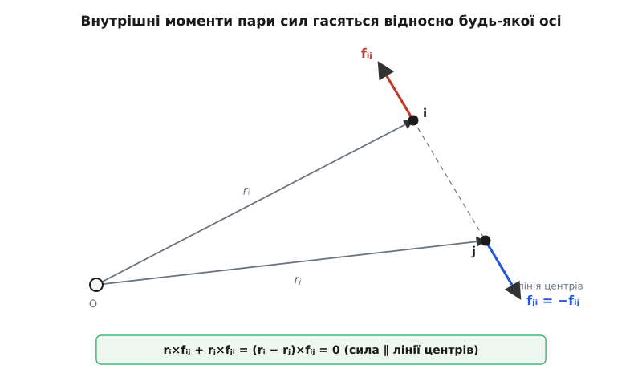
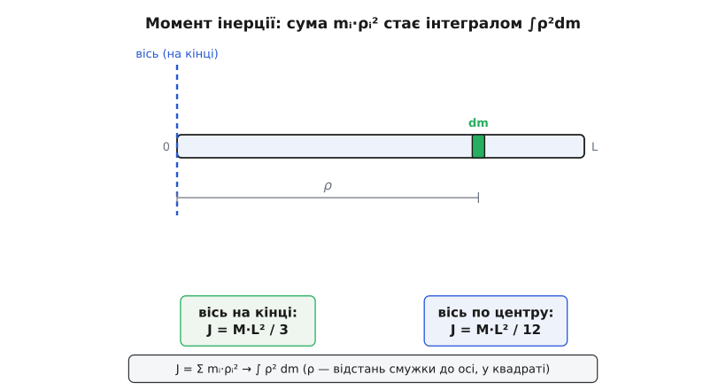

# 🧮 Від F = m·a до M = J·α: другий закон обертання з першопринципів

Формули `M = J·α` і `M = dL/dt` можна просто повідомити й піти далі — вони працюють. Але звідки вони беруться? Чи це справді окремі закони природи, які треба завчити поряд із ньютонівськими, чи, може, вони заховані в `F = m·a` і їх звідти можна дістати? Виявляється — дістати. Уся динаміка обертання, разом із моментом інерції `J`, моментом імпульсу `L` і навіть із тим дивом, що незліченні внутрішні сили в тілі нічого не важать, виростає з **одного** руху думки: узяти `F = m·a` для кожної частинки тіла, помножити векторно на важіль `r` — і просумувати по всіх частинках. Більш нічого не додаємо. Розгорнімо це до кінця.

Ідея тут та сама, що й із самим моментом сили: обертання — не новий закон, а старий, побачений з іншого боку. Момент сили — це сила, помножена векторно на важіль. Отже, спробуймо помножити на важіль **увесь** другий закон Ньютона й подивитися, що вийде.

## Зерно: одна-єдина частинка

Почнімо з найменшого — з однієї точкової маси `m`. Оберімо якийсь нерухомий початок відліку `O`; хай `r` — стрілка від `O` до частинки, `v = dr/dt` — її швидкість, а `p = m·v` — імпульс. Другий закон Ньютона в його найчеснішій формі каже, що сила дорівнює швидкості зміни імпульсу:

```
F = dp/dt
```

Тепер зробімо той самий крок, що перетворює силу на момент: помножмо обидві частини **векторно зліва** на важіль `r`. Ліворуч дістанемо момент сили `M = r × F` (той самий [векторний добуток](topic:math/cross-product) важеля на силу). Праворуч — `r × dp/dt`. Отже:

```
M = r × F = r × dp/dt
```

Права частина проситься, щоб її впізнали як похідну чогось цілого. Погляньмо на величину `L = r × p` — **момент імпульсу** частинки відносно `O` (важіль, помножений векторно на імпульс, — точний обертовий двійник самого імпульсу). Порахуймо, як вона змінюється з часом, за правилом добутку:

```
dL/dt = d(r × p)/dt = (dr/dt) × p + r × (dp/dt)
```

Перший доданок тихо зникає. Адже `dr/dt = v`, а `p = m·v`, тож `(dr/dt) × p = v × (m·v) = m·(v × v)`. А векторний добуток вектора самого на себе — нуль: паралельні множники не дають площі. Лишається тільки друге:

```
dL/dt = r × (dp/dt) = r × F = M
```

І ось перший, найчистіший результат, здобутий буквально в три рядки:

```
M = dL/dt        (для однієї частинки)
```

Це не новий закон. Це `F = dp/dt`, помножене векторно на `r`, — той самий Ньютон, повернутий боком до обертання. Сила є швидкістю зміни імпульсу; момент сили є швидкістю зміни моменту імпульсу. Одне речення народило друге простим множенням на важіль.

> 🔧 **Навіщо це.** Уся динаміка обертання далі — лише розгортання цього одного рядка на багато частинок. Якщо тримати в голові, що `M = dL/dt` — це `F = dp/dt`, побачене крізь `r ×`, то жодну обертову формулу вже не треба завчати окремо: вона — обертовий відбиток відповідної поступальної. `p ↔ L`, `F ↔ M`, `m ↔ J` — той самий закон, лише в дзеркалі важеля.

## Багато частинок: чому внутрішні сили безслідні

Тверде тіло — це велетенська громада частинок, зчеплених так, що відстані між ними не міняються. На кожну частинку `i` діють сили двох сортів: **зовнішні** `Fᵢᵉ` (тяжіння, ваша рука, тиск повітря) і **внутрішні** — сили `fᵢⱼ` від кожної іншої частинки `j` того самого тіла (це вони, електромагнітні за природою зчеплення, тримають тіло купи). Для кожної частинки окремо ми вже маємо готовий результат `dLᵢ/dt = rᵢ × (сумарна сила на i)`:

```
dLᵢ/dt = rᵢ × Fᵢᵉ  +  rᵢ × Σⱼ fᵢⱼ
```

Момент імпульсу всього тіла — це сума по всіх частинках, `L = Σ Lᵢ`. Просумуймо й праву частину по всіх `i`:

```
dL/dt = Σᵢ (rᵢ × Fᵢᵉ)  +  Σᵢ Σⱼ (rᵢ × fᵢⱼ)
```

Перша сума — сумарний момент **зовнішніх** сил, назвімо його `M`. А от друга, подвійна сума внутрішніх моментів, лякає: у тілі з `N` частинок таких доданків — порядку `N²`, і `N` тут астрономічне. Якби вони не зникали, писати рівняння руху тіла було б безнадійно. Але вони зникають — і в цьому вся краса.

Хитрість — розбити внутрішню суму на **пари**. Візьмімо дві частинки, `i` та `j`. Вони тягнуть одна одну: `fᵢⱼ` діє на `i` з боку `j`, а `fⱼᵢ` — на `j` з боку `i`. У повній сумі обидва ці доданки присутні, тож зберімо їх разом:

```
rᵢ × fᵢⱼ  +  rⱼ × fⱼᵢ
```

Тут у гру входить **третій закон Ньютона**. Його звична, «слабка» форма: дія дорівнює протидії за величиною й протилежна за напрямом, `fⱼᵢ = −fᵢⱼ`. Підставмо це в другий доданок і винесімо спільний множник:

```
rᵢ × fᵢⱼ − rⱼ × fᵢⱼ = (rᵢ − rⱼ) × fᵢⱼ
```

Ми звели момент пари до одного векторного добутку: різниця важелів `(rᵢ − rⱼ)` — це стрілка **від j до i**, тобто вектор уздовж лінії, що з'єднує дві частинки. Лишилося зробити останній крок — і тут потрібна вже не слабка, а **сильна форма третього закону**: внутрішні сили не просто протилежні, вони діють **точно вздовж прямої, що з'єднує частинки** (лат. *centralis* — «серединний»; такі сили звуть центральними). Тобто `fᵢⱼ` паралельна до `(rᵢ − rⱼ)`. А векторний добуток двох паралельних векторів — нуль:

```
(rᵢ − rⱼ) × fᵢⱼ = 0        (сила ∥ лінії центрів)
```

Кожна пара внутрішніх сил дає нульовий сумарний момент. Просумуйте по всіх парах — і вся подвійна сума, усі `N²` доданків, обертається на чистий нуль. Лишається саме те, чого ми хотіли:

```
dL/dt = M        (M — сумарний момент лише ЗОВНІШНІХ сил)
```


*Внутрішня пара сил `fᵢⱼ` і `fⱼᵢ = −fᵢⱼ` діє вздовж лінії центрів. Їхній сумарний момент відносно будь-якого початку O дорівнює `(rᵢ − rⱼ) × fᵢⱼ`, а `(rᵢ − rⱼ)` теж лежить уздовж цієї лінії — паралельні вектори, векторний добуток нуль. Тому всі внутрішні моменти гасяться попарно, і момент імпульсу тіла міняють лише зовнішні сили.*

Варто на мить спинитися на тому, наскільки це нетривіально. Слабка форма третього закону (сили рівні й протилежні) забезпечує, що зникають внутрішні **сили** — звідси закон збереження імпульсу. Але щоб зникли внутрішні **моменти**, самої протилежності мало: якби дві частинки штовхали одна одну навскіс, не вздовж прямої між ними, їхні моменти вже не погасилися б, і тіло саме себе розкручувало б із нічого. Природа цього не робить саме тому, що сили, які тримають матерію, — тяжіння, електростатика, зв'язки між атомами — центральні. Отже, `M = dL/dt` для тіла тримається на сильній формі третього закону, і збереження моменту імпульсу — її прямий наслідок, так само як збереження імпульсу — наслідок слабкої.

> 🔧 **Навіщо це.** Саме тому ми взагалі маємо право говорити про «момент, прикладений до тіла», і не згадувати про трильйони внутрішніх сил, що вирують усередині гайкового ключа, планети чи маховика. Вони всі, до останньої, дають у суму нуль моменту. Тіло відгукується лише на те, що штовхає його **ззовні** — і рівняння його обертання коротке, хоч частинок у ньому не злічити.

## Нерухома вісь: народження J·α

Ми маємо загальне `M = dL/dt`. Тепер притиснімо його до найпростішого й найпоширенішого випадку — тіло, що обертається навколо **нерухомої осі** (двері на завісах, колесо на валу, маховик). Нехай вісь — це напрям `z`. Тіло тверде, тож усі його частинки крутяться навколо осі як одне ціле: у них **спільна** [кутова швидкість](topic:physics/angular-velocity) `ω` і спільне кутове прискорення `α = dω/dt`. Кожна частинка `i` біжить по колу радіуса `ρᵢ` — це її **перпендикулярна відстань до осі** (не до початку O, а саме до осі; частинки біля осі мають малий `ρ`, скраю — великий).

Порахуймо складову моменту імпульсу вздовж осі, `L_z`. Для частинки, що кружляє навколо `z` зі швидкістю `ω`, її лінійна швидкість дорівнює `v = ω × r`, а осьова складова її моменту імпульсу `rᵢ × pᵢ` після розкладу зводиться до напрочуд простого виразу:

```
L_{z,i} = mᵢ · ρᵢ² · ω
```

Придивімося, звідки він. Швидкість частинки на колі — це `ω·ρᵢ` (що далі від осі, то швидший проїзд на ободі), напрямлена по дотичній. Її момент імпульсу відносно осі — маса на швидкість на плече: `mᵢ · (ω·ρᵢ) · ρᵢ = mᵢ·ρᵢ²·ω`. Плече входить **двічі** — раз як радіус кола, що задає швидкість, і вдруге як плече самої швидкості. Звідси й квадрат `ρᵢ²`, і це та деталь, що змінює все.

Складімо по всьому тілу. Кутова швидкість `ω` спільна для всіх частинок, тож її виносимо за суму:

```
L_z = Σ mᵢ·ρᵢ²·ω = (Σ mᵢ·ρᵢ²) · ω
```

Суму в дужках — саме її природа й пропонує назвати окремою величиною. Це **момент інерції** тіла відносно осі:

```
J = Σ mᵢ · ρᵢ²
```

І тоді осьовий момент імпульсу набуває вигляду, що дослівно повторює `p = m·v`, лише в обертовій мові:

```
L_z = J · ω        (двійник p = m·v)
```

Лишився один крок. Для твердого тіла на нерухомій осі відстані `ρᵢ` не міняються з часом — тіло тверде, вісь стоїть, — тож `J` стала. Продиференціюймо `L_z = J·ω`, і стала `J` спокійно виходить з-під похідної:

```
dL_z/dt = J · dω/dt = J · α
```

А `dL_z/dt`, за здобутим вище загальним законом, — це осьовий момент зовнішніх сил `M`. Отже:

```
M = J · α
```

Ось він, другий закон обертання, — не постульований, а **виведений**, як `F = m·a`, повернуте на важіль і просумоване по тілу. Паралель тепер повна й не випадкова: там, де в поступальному русі стояла маса `m`, тут стоїть момент інерції `J`; де було лінійне прискорення `a` — тут кутове `α`; де сила `F` — тут момент `M`. `J` — це «інертність до розкручування», обертовий двійник маси. Та з однією глибокою відмінністю: маса тіла — одне число раз і назавжди, а момент інерції залежить від того, **навколо якої осі** й **як далеко від неї** розкидано масу. Той самий шматок металу опирається розкручуванню то легше, то важче — залежно від того, за яку вісь його крутити.

Одне чесне застереження, щоб не збудувати хибної певності. Рівність `L_z = J·ω` — про **осьову складову**. У загальному випадку повний вектор `L` не паралельний до `ω`: тіло химерної форми, розкручуване за випадкову вісь, має момент імпульсу, що дивиться трохи вбік від осі обертання. `M = J·α` як рівність цілих векторів справджується, коли обертання йде навколо осі симетрії тіла (головної осі) — тоді `L` і `ω` дивляться в один бік. Для нерухомої осі, за яку тіло реально закріплене, важлива саме осьова складова, і `M = J·α` працює бездоганно — це той випадок, заради якого формулу й пишуть.

## Момент інерції на пальцях: від точки до стрижня

Формула `J = Σ mᵢ·ρᵢ²` — це рецепт, а не абстракція: щоб знайти момент інерції, розбий тіло на шматочки, кожен помнож на квадрат його відстані до осі й склади. Пройдімо цей рецепт від найпростішого.

**Точкова маса.** Одна маса `m` на відстані `r` від осі — сума з одного доданка:

```
J = m · r²
```

Це наріжний камінь, з якого складають усе інше. Вантаж на кінці невагомого стрижня, кулька на нитці — усе це моделюють точковою масою з `J = m·r²`.

**Стрижень.** Тепер тонкий однорідний стрижень маси `M` і довжини `L`, що обертається навколо перпендикулярної осі на **своєму кінці**. Частинок тут незліченно, тож сума `Σ mᵢ·ρᵢ²` перетворюється на **інтеграл**: нарізаємо стрижень на смужки завширшки `dx` на відстані `x` від осі, маса смужки `dm = λ·dx`, де `λ = M/L` — лінійна густина (маса на одиницю довжини). Кожна смужка вносить `x²·dm`, а всі разом:

```
J = ∫ x² dm = ∫₀ᴸ x² · (M/L) dx = (M/L) · [x³/3]₀ᴸ = (M/L) · L³/3
```

```
J = M·L² / 3        (вісь на кінці стрижня)
```

Якщо ж поставити вісь **посередині** стрижня, межі стають від `−L/2` до `+L/2`, і той самий інтеграл дає втричі менше:

```
J = ∫₋ᴸ/₂^{L/2} x²·(M/L) dx = (M/L)·L³/12 = M·L² / 12        (вісь по центру)
```


*Момент інерції рахують, розрізавши тіло на елементи `dm` і склавши `ρ²·dm` по всіх. Для стрижня сума стає інтегралом `∫ρ²dm`. Той самий стрижень має `J = M·L²/3` навколо осі на кінці й утричі менший `J = M·L²/12` навколо осі по центру — бо на кінцевій осі вся маса винесена далі, а `ρ` входить у квадраті.*

Різниця між `M·L²/3` і `M·L²/12` промовиста: пересунувши вісь із центра на кінець, ми потроїли момент інерції, хоч тіло те саме. Уся річ у квадраті `ρ`: коли вісь на кінці, половина маси опиняється далеко, аж біля `x = L`, і її внесок `x²` роздувається. Ось чому важко розгойдати довгу драбину, тримаючи її за край, і куди легше — тримаючи посередині.

Цю трійку між осями не треба щоразу інтегрувати наново — вона підкоряється **теоремі про паралельне перенесення осі** (теоремі Гюйгенса–Штейнера, на честь Христіана Гюйгенса й Якоба Штайнера): момент інерції навколо будь-якої осі дорівнює моменту навколо паралельної осі через центр мас плюс `M·d²`, де `d` — відстань між осями. Перевірмо на стрижні: `J_кінець = J_центр + M·(L/2)² = M·L²/12 + M·L²/4 = M·L²/3`. Сходиться точно — і це не випадковість, а той самий квадрат відстані, що виринає з `J = Σmᵢ·ρᵢ²`, тільки записаний для зсуву всього тіла.

Найпереконливіше, що інтеграл — це буквально та сама сума `Σ mᵢ·ρᵢ²`, доведена до границі нескінченно дрібних шматочків, видно, якщо порахувати її чисельно й порівняти з формулою:

```python
def moment_of_inertia(masses, distances):
    # J = Σ mᵢ · ρᵢ²  — рецепт напряму: сума по всіх частинках
    return sum(m * r * r for m, r in zip(masses, distances))

# точкова маса 0.5 кг на відстані 0.4 м від осі
print(moment_of_inertia([0.5], [0.4]))          # 0.5·0.4² = 0.08 кг·м²

# стрижень M = 2 кг, L = 1 м, вісь на кінці:
# ріжемо на N смужок і сумуємо mᵢ·ρᵢ² — має вийти M·L²/3
M, L, N = 2.0, 1.0, 200_000
dm = M / N                                        # маса однієї смужки
dx = L / N
masses    = [dm] * N
distances = [(i + 0.5) * dx for i in range(N)]    # центр кожної смужки
J = moment_of_inertia(masses, distances)
print(round(J, 6), "≈", round(M * L**2 / 3, 6))   # 0.666667 ≈ 0.666667
```

Дискретна сума `Σ mᵢ·ρᵢ²` по двохсот тисячах смужок збігається з `M·L²/3` до шостого знака — інтеграл не робить нічого, крім того, що доводить цю суму до ідеальної границі. А маючи `J`, обертове прискорення знаходимо тим самим `M = J·α`, що й лінійне через `F = m·a`: прикладіть до цього стрижня момент `0.5 Н·м` навколо кінця — і він набиратиме `α = M/J = 0.5 / 0.667 ≈ 0.75 рад/с²`.

## Чому M = dL/dt глибше за M = J·α

Дві формули, що ми вивели, — не рівноправні. `M = J·α` — окремий випадок, справедливий, поки `J` стала: тверде тіло, нерухома вісь. `M = dL/dt` — загальніша, бо вона не припускає нічого про сталість `J`. І різницю між ними видно там, де `J` **міняється** просто на очах.

Класичний приклад — фігуристка в піруеті. Розкрутившись із розкинутими руками, вона притискає їх до тіла. Зовнішніх моментів на неї практично немає (лід майже не тримає), тож `dL/dt ≈ 0` — момент імпульсу `L` зберігається. Але, притиснувши руки, вона зменшила свій момент інерції `J` (маса рук наблизилася до осі, `ρ` впало, а входить воно у квадраті). Щоб добуток `L = J·ω` лишився тим самим при меншому `J`, кутова швидкість `ω` мусить підскочити — і фігуристка закручується швидше, не доклавши жодного зусилля ззовні. Тут `M = J·α` вже не описати рух безпосередньо, бо `J` не стала; а `M = dL/dt` спрацьовує бездоганно й дає точну відповідь: `L` не змінилося, крапка.

Це та сама ієрархія, що і в поступальному русі. `F = m·a` — зручний окремий випадок сталої маси; `F = dp/dt` — загальний закон, що витримує й зміну маси (ракета, яка викидає паливо). Обертовий світ повторює це один в один: `M = J·α` для сталого `J`, `M = dL/dt` завжди. А коли зовнішнього моменту немає зовсім, загальний закон дає найкоштовніший наслідок:

```
M = 0   ⟹   dL/dt = 0   ⟹   L = стала
```

**Закон збереження моменту імпульсу.** Те, що крутиться без зовнішнього моменту, крутитиметься вічно з тим самим `L`. Саме тому маховик довго не спиняється, дзиґа стоїть, а Земля обертається мільярди років — збоку її ніщо помітно не підкручує. І цей закон — не окрема аксіома: він — прямий наслідок сильної форми третього закону Ньютона, тієї самої, що змусила внутрішні моменти погаснути попарно. Глибший його корінь — [симетрія простору щодо поворотів](topic:physics/noether-theorem): у Всесвіті немає виділеного напряму, і саме через це момент імпульсу зберігається.

## Чому момент — вектор уздовж осі

Наостанок — те, що весь час стояло за кадром. `M = r × F` і `L = r × p` народилися **векторними добутками**. Це не технічна дрібниця: саме звідси випливає, що і момент сили, і момент імпульсу — вектори особливого ґатунку, напрямлені вздовж осі обертання, а не в бік руху.

Причина — у тому, що обертання за самою природою живе не на прямій, а в **площині**. Важіль `r` і сила `F` задають площину; частинки тіла кружляють у площинах, перпендикулярних до осі. Щоб описати таке обертання одним вектором, треба відповісти на три питання: у якій площині воно йде, наскільки інтенсивне й у який бік закручене. І тут рятує геометрія тривимірного простору: **площину однозначно задає її нормаль** — єдиний перпендикулярний до неї напрям. Тому обертання й «пакують» у стрілку вздовж осі: вісь — це нормаль до площини кружляння, єдиний напрям, спільний для всіх частинок, які інакше рухаються кожна у свій бік. Довжина стрілки каже, наскільки сильне обертання, а знак уздовж осі (куди дивиться стрілка) — у який бік воно закручене, за домовленістю [правила правої руки](topic:physics/right-hand-rule).

Але за це пакування доводиться платити, і платня має ім'я: момент — **осьовий вектор** (псевдовектор), а не звичайний. Різниця виказує себе в дзеркалі. Візьміть диск, що крутиться проти годинникової стрілки, якщо дивитися згори; його момент імпульсу дивиться вгору. Тепер поставте дзеркало збоку, перпендикулярно до диска. Відображений диск крутиться **за** годинниковою — отже, його справжній момент імпульсу мусить дивитися **вниз**. А що робить із стрілкою саме дзеркало? Стрілка лежала в його площині, тож дзеркало відбиває її саму на себе — вона й далі дивиться **вгору**. Фізика вимагає одного напряму, наївне відображення стрілки дає протилежний: вони розходяться на знак. Оцей зайвий знак під відображенням — і є підпис псевдовектора. Звичайна (полярна) стрілка — швидкість, сила, положення — під дзеркалом поводиться інакше; момент же несе в собі приховану орієнтацію площини, і саме вона в дзеркалі перевертається.

Отже, момент дивиться вздовж осі не з примхи означення, а тому, що він від народження — згорнута в стрілку **орієнтована площина обертання**. Векторний добуток `r × F` — це і є те згортання: він бере площину важеля й сили та кладе замість неї нормаль потрібної довжини й знака. А псевдовекторність — чесна ціна за право користуватися однією зручною стрілкою там, де насправді крутиться ціла площина.

Ось і вся анатомія другого закону обертання. Один рух — помножити `F = m·a` векторно на важіль `r` — дав для однієї частинки `M = dL/dt`. Сума по частинках тіла й сильна форма третього закону Ньютона викинули з рівняння всі внутрішні сили, лишивши те саме `M = dL/dt` для цілого тіла. Нерухома вісь і твердість тіла згорнули момент імпульсу в `J·ω`, а його похідну — у `M = J·α`, з моментом інерції `J = Σmᵢ·ρᵢ²` у ролі маси. Те, що основна тема подала як готові формули, тут виявилося не набором законів, які треба вірити на слово, а неминучим відлунням єдиного Ньютонового рівняння, побаченого крізь важіль.
