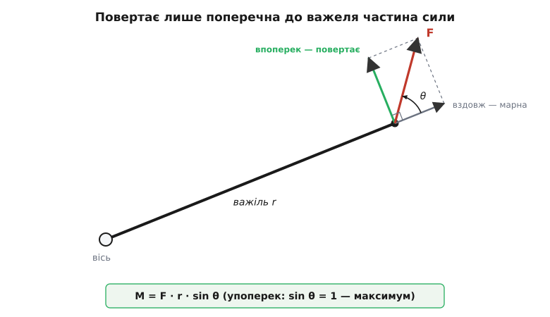
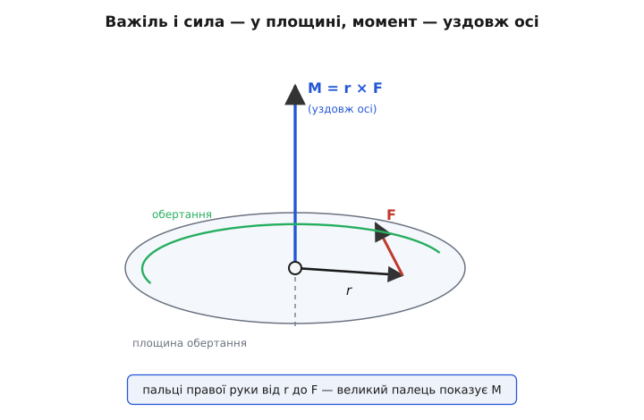
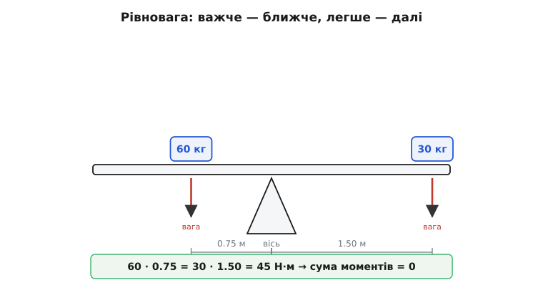
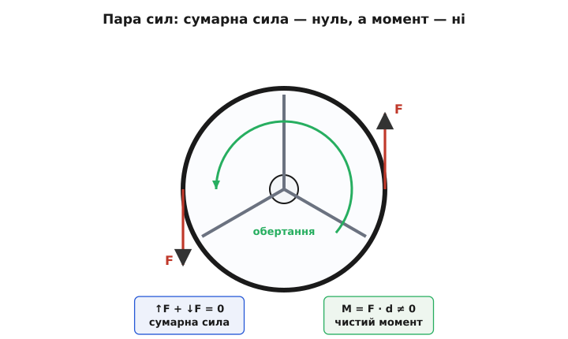

# Момент сили: чому важить не лише сила, а й де її прикласти

<preknowlist>
- [Сила](topic:physics/force) — векторна дія, що змінює рух тіла; має величину й напрям, вимірюється в ньютонах.
- [Векторний добуток](topic:math/cross-product) — операція над двома векторами, що дає третій, перпендикулярний до обох, а завдовжки — добуток їхніх довжин на синус кута між ними.
</preknowlist>

Штовхніть двері біля самісінької завіси — вони ледь ворухнуться, хоч би як ви налягали. Штовхніть із тією самою силою за ручку, на дальньому краю, — і вони легко розчахнуться. Сила та сама, двері ті самі, а вийшло геть по-різному. Отже, наскільки сильно щось повертається навколо осі, залежить не лише від сили, а ще й від того, **де** ту силу прикласти. Оцю «здатність повертати» й називають **моментом сили** (лат. *momentum* — «рушійна вага, поштовх»; в техніці та англійській — *torque*, від лат. *torquēre* — «крутити, скручувати»).

Момент — не якийсь новий, окремий від сили закон природи. Це та сама сила, тільки погляд на неї з боку обертання: одна й та сама сила може крутити слабо або потужно — усе вирішує, як далеко від осі й під яким кутом вона прикладена.

### Плече вирішує все

Чому далі від завіси — легше? Уявімо вісь, навколо якої тіло може обертатися, і силу, прикладену в якійсь його точці. Проведімо від осі до цієї точки відрізок — назвімо його важелем. Сила намагається повернути цей важіль навколо осі. І тут ховається головне: **повертає не вся сила, а лише та її частина, що напрямлена впоперек важеля**.

Розкладімо силу на дві частини. Одна тягне вздовж важеля — прямо до осі або від неї. Ця частина для обертання марна: тягнути двері в площині їхнього полотна намарне, ви лиш смикаєте завісу. Друга частина — впоперек важеля — і є та, що повертає. Що довший важіль і що більша ця поперечна сила, то потужніше обертання.


*Тільки поперечна до важеля складова сили дає обертання; складова вздовж важеля лише тисне на вісь. Тому момент росте і з довжиною важеля r, і з кутом: найбільший, коли сила строго впоперек.*

Звідси й проста міра моменту:

```
M = F · d
```

де F — сила, а d — **плече сили**: найкоротша відстань від осі до лінії, вздовж якої діє сила (перпендикуляр, опущений з осі на цю лінію). Плече — не просто «відстань до точки прикладання»; це відстань до самої лінії дії сили. Якщо штовхати не строго впоперек, а під кутом θ до важеля довжини r, плече коротшає:

```
d = r · sin θ        →        M = F · r · sin θ
```

При θ = 90° (сила строго впоперек) sin θ = 1, момент найбільший. При θ = 0° (сила вздовж важеля, прямо в вісь) sin θ = 0 — момент зникає, хоч сила є. Тому ручку до дверей ставлять якнайдалі від завіси, а тиснути привчаються перпендикулярно: обидва множники, r і sin θ, тоді найбільші.

> 🔧 **Навіщо це.** Уся техніка важелів тримається на цьому. Довгий гайковий ключ відкручує туго затягнутий болт, який коротким не зрушити: подовжили плече вдвічі — удвічі більший момент за ту саму силу руки. Так само коловорот, педалі, дверна ручка, важіль домкрата. Скрізь, де треба «більше повертати, не додаючи сили», подовжують плече.

**Задача.** Затягуємо болт ключем 30 см, тиснемо на кінець із силою 200 Н строго впоперек. Який момент? А якщо тиснути під кутом 60° до ключа?

```
r = 0.30 м,  F = 200 Н

Строго впоперек (θ = 90°):
M = F · r · sin 90° = 200 · 0.30 · 1     = 60 Н·м

Під кутом θ = 60°:
M = F · r · sin 60° = 200 · 0.30 · 0.866 ≈ 52 Н·м
```

Та сама рука, той самий ключ — а варто тиснути навскіс, і восьму частину моменту втрачено даремно. Ось чому інструментом працюють, тиснучи перпендикулярно до ручки.

Одиниця моменту — **ньютон-метр** (Н·м): сила в ньютонах на плече в метрах. Прикметно, що така сама розмірність у роботи (джоуль = Н·м), а проте момент — не енергія: у роботі сила множиться на переміщення **вздовж** себе, а в моменті — на відстань **упоперек**. Тому момент лишають у ньютон-метрах і джоулями не звуть.

### Момент має напрям — уздовж осі

Величину ми знайшли. Але момент — ще й вектор, тож має напрям. От тільки який? Сила лежить у площині, важіль лежить у площині — а куди дивиться сам момент?

Відповідь спершу дивує: **момент напрямлений уздовж осі обертання**, перпендикулярно і до сили, і до важеля. Логіка проста. Коли тіло повертається, кожна його точка рухається по-своєму — котрась угору, котра вниз, — і жоден із цих напрямів не описує обертання загалом. Незмінна лишається тільки **вісь**: вона єдина спільна для всього руху. Тому саме вздовж осі й «кладуть» вектор моменту, а куди він дивиться по осі — угору чи вниз — каже, у який бік іде обертання.

Правило, що зв'язує все докупи, — [векторний добуток](topic:math/cross-product): момент дорівнює векторному добутку важеля на силу.

```
M = r × F
```

Його довжина — це вже знайоме r · F · sin θ (звідси й синус), а напрям задає [правило правої руки](topic:physics/right-hand-rule): зігніть пальці правої руки від важеля до сили — відставлений великий палець покаже, куди дивиться момент. Практично для нас це означає одне: момент проти годинникової стрілки й момент за годинниковою — протилежні за знаком, тож, додаючи кілька моментів, ми складаємо їх зі знаками, а не просто за величиною.


*Важіль r і сила F задають площину обертання; момент M = r × F перпендикулярний до неї — стоїть уздовж осі. Напрям уздовж осі показує правило правої руки, а знак відрізняє обертання за годинниковою від проти.*

### Момент розганяє обертання

Сила змушує тіло рухатися швидше — це другий закон Ньютона, F = m·a. У обертанні історія точнісінько така сама, лише дійові особи інші: момент змушує тіло **обертатися** швидше.

```
M = J · α
```

Тут α — [кутове прискорення](topic:physics/angular-velocity) (як швидко наростає швидкість обертання), а J — [момент інерції](topic:physics/moment-of-inertia): міра того, наскільки важко тіло розкрутити. Момент інерції для обертання — те саме, що маса для прямого руху: що він більший, то менше кутове прискорення дає той самий момент. І залежить він не лише від маси, а й від того, як ту масу розкидано навколо осі: винесена далеко маса опирається розкручуванню значно дужче, ніж зібрана біля осі. Тому фігуристка, притиснувши руки до тіла, розкручується швидше — вона зменшила свій момент інерції, і той самий запас обертання дав більшу швидкість.

Є й глибше формулювання, від якого другий закон обертання — лише наслідок. Подібно до того, як сила є швидкістю зміни імпульсу, **момент сили є швидкістю зміни [моменту імпульсу](topic:physics/angular-momentum)** — «запасу обертання», що його несе тіло. Немає зовнішнього моменту — момент імпульсу зберігається (те, що крутиться, крутиться далі); є момент — він цей запас міняє. Саме тому маховик, розкрутившись, довго не спиняється, а Земля обертається мільярди років: збоку її ніщо помітно не підкручує й не гальмує. Як із F = m·a для окремих частинок виходить M = J·α для цілого тіла — [окреме виведення](topic:physics/torque/math-rotational-second-law.md).

### Коли моменти врівноважені — нічого не крутиться

Зворотний бік динаміки — рівновага. Якщо тіло не обертається й не починає, то всі моменти на ньому **в сумі дають нуль**: скільки крутить в один бік, стільки ж — у протилежний.

```
сума моментів = 0
```

Це основа всієї статики — мостів, кранів, полиць, терезів. Найпростіший приклад — гойдалка-балансир на осі посередині. Легша дитина врівноважує важчу, коли сідає далі від осі: мале плече одного боку надолужується довжиною важеля.

**Задача.** На гойдалці дитина 30 кг сидить за 1.5 м від осі. На якій відстані по інший бік має сісти дорослий 60 кг, щоб урівноважити?

```
Момент кожного = вага · відстань,  вага = маса · g.
g в обох боках однакове — скорочується, лишається маса · відстань.

Рівновага:  30 · 1.5 = 60 · d
            45       = 60 · d
            d        = 0.75 м
```

Дорослий, удвічі важчий, має сісти рівно вдвічі ближче до осі — і гойдалка завмре врівноважена. Ті самі шалькові терези важать саме так: відомий тягарець на своєму плечі проти невідомого вантажу на іншому.


*Момент кожного боку — вага на відстань до осі. Дитина 30 кг за 1.5 м дає той самий момент, що й дорослий 60 кг за 0.75 м: 45 Н·м проти 45 Н·м. Сума дорівнює нулю — гойдалка стоїть.*

Що плече вирішує все, зрозуміли давно. Ще Архімед у трактаті «Про рівновагу площин» строго довів закон важеля — тіла врівноважуються на відстанях, обернено пропорційних їхнім вагам, — і, за переказом, кинув знамените «дайте мені точку опори, і я переверну Землю». Як народилося поняття важеля й звідки взялося саме слово «момент» — [коротка історія](topic:physics/torque/hist-lever.md).

### Де проста картинка ламається

Зручно уявляти момент як «силу, прикладену збоку». Здебільшого це працює, але у двох місцях така картинка зраджує.

**Перше: сумарна сила може бути нульова, а момент — ні.** Прикладіть до тіла дві однакові сили, напрямлені в протилежні боки, але не вздовж однієї лінії, — скажімо, крутіть кермо двома руками: ліва тягне вниз, права вгору. Сумарна сила — нуль, з місця тіло не зрушить. А от моменти обох сил напрямлені **в один бік** (обидві крутять кермо однаково) і складаються. Тіло не їде, а обертається на місці. Таку двійку рівних протилежних сил на різних лініях звуть **парою сил**, і вона дає чистий момент без жодної результівної сили. Викрутка, кермо, водопровідний кран — усе це крутять парою сил.


*Пара сил: сили рівні й протилежні, тож сумарна сила — нуль, і тіло нікуди не їде. Але їхні моменти напрямлені в один бік і складаються — тіло обертається на місці. Так крутять кермо, викрутку, кран.*

**Друге: момент залежить від того, відносно якої осі його рахувати.** Одна й та сама сила дає різний момент навколо різних осей — бо для кожної осі своє плече. Питання «який момент цієї сили?» без указаної осі неповне: спершу оберіть вісь, тоді рахуйте плече від неї. Пара сил тут — виняток: її момент однаковий навколо будь-якої точки, бо плечі двох сил міняються злагоджено. Тому пару й зручно вважати «чистим моментом».

Ці два уточнення не псують простої картинки, а гострять її. Уся суть моменту тримається на одному: важить не лише сила, а й важіль, на якому вона діє. Помножте силу на плече — дістанете, наскільки потужно вона повертає; складіть усі такі добутки зі знаками — дізнаєтеся, чи закрутиться тіло і як швидко; прирівняйте суму до нуля — дістанете умову, за якої все стоїть непорушно. Одна проста ідея — а на ній тримаються і гайковий ключ, і терези, і кожен міст.
