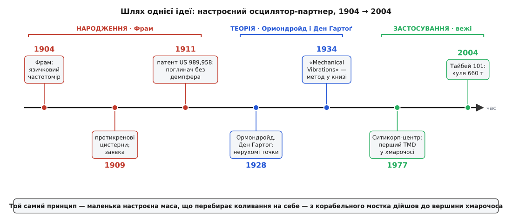

# 📜 Народження настроєного гасителя: від корабельної хитавиці до кулі хмарочоса

Дивна річ: пристрій, що сьогодні заспокоює хмарочоси заввишки з півкілометра, вигадала людина, яка все життя думала про кораблі. Німецький інженер **Герман Фрам** (нім. *Hermann Frahm*) прийшов до ідеї не з боку архітектури, а з боку моря — від хитавиці суден і від тремтіння металу в машинах. Щоб зрозуміти, чому маленька настроєна маса гасить велику конструкцію, варто пройти той самий шлях, яким пройшла сама думка: від язичка, що тремтить у частотомірі, до сталевої кулі на тросах.

## Герман Фрам: інженер, що вслухався в резонанс

Герман Фрам (1867–1939) працював у Гамбурзі, у світі верфей і корабельних машин; фах він здобув практикою — спершу точним механіком, потім інженером-механіком на славетній корабельні **Blohm & Voß**. Це усталені біографічні відомості. Його наскрізна тема — **вібрація й резонанс**: чому метал у машині тремтить, чому вал б'є, чому судно гойдається, і як це вгамувати.

Перший доказ, що Фрам думав саме резонансами, — його **язичковий частотомір** (нім. *Frahm-Zungenfrequenzmesser*), запатентований близько 1904 року. Пристрій до дивного простий: ряд сталевих язичків різної довжини, кожен зі своєю власною частотою, як зубці камертонів у гребінці. Піднесеш прилад до машини — і тремтить помітно лише **той** язичок, чия власна частота збіглася з частотою вібрації; сусіди майже нерухомі. Резонанс тут перетворено на стрілку: частоту читають з того, який язичок ожив.

У цьому приладі вже сховано зерно всієї подальшої історії. Настроєний осцилятор відгукується **вибірково** — бурхливо на своїй одній частоті й майже ніяк на решті. Фрам щодня тримав у руках доказ того, що маленьке тіло, точно настроєне, здатне сильно й винятково реагувати на одну-єдину частоту. Лишалося перевернути думку: якщо такий язичок так жадібно вбирає коливання своєї частоти — то він і **відбирає** їх у того, до чого причеплений.

## Хитавиця й протикренові цистерни

Перевернути думку Фрамові допомогла найпрактичніша морська біда — **бортова хитавиця**. Судно на хвилі гойдається з боку на бік, і має власний період крену — темп, у якому воно перевалюється саме. Хвиля, що надходить у лад із цим періодом, розгойдує корабель дедалі дужче; це [резонанс](book:physics/mechanical-resonance), тільки жертва — цілий пароплав, а пасажирам робиться зле.

Фрам запропонував лікувати хитавицю **протикреновими цистернами** (нім. *Frahm-Tanks*) — своїм рішенням, запатентованим 1909 року. У бортах корабля ставлять пару сполучених цистерн, частково налитих водою, з вузьким переходом між ними. Вода переливається з борту на борт, і систему підбирають так, щоб її переливання **відставало** від крену корабля й тиснуло **проти** нього: судно валиться праворуч — вода саме доходить ліворуч і своєю вагою тягне назад. Це вже цілком **настроєний гаситель**, лише роль рухомої маси грає вода, а вузький перехід підмішує потрібне загасання, гасячи енергію на тертя потоку.

Рішення виявилося не курйозом, а робочою технікою: до Другої світової протикренові цистерни Фрама стояли на понад мільйоні тонн німецького флоту, зокрема на трансатлантичних лайнерах **Bremen** і **Europa**; британський **Laconia** вважають першим британським і першим атлантичним лайнером, оснащеним цистернами Фрама. Це добре задокументовані факти. Отже, Фрам мав у руках уже не думку, а **діючий приклад** того, як настроєна рухома маса, підвішена в протифазі, вгамовує величезне тіло.

## Патент 1909/1911: поглинач для будь-якого тіла

Найважливіший крок — не сам винахід цистерн, а **узагальнення**. Фрам зрозумів, що вода в корабельних баках — лише окремий випадок, і що той самий прийом працює для чого завгодно, що тремтить. Він оформив це загально: до будь-якого тіла, яке докучливо вібрує, чіпляють **менше допоміжне тіло на пружності**, настроєне на ту саму частоту, і його резонансний відгук **гасить** коливання головного.

Заявку подано 30 жовтня 1909 року, а 18 квітня 1911-го видано патент США **№ 989,958** — «Device for damping vibrations of bodies» (укр. «Пристрій для гасіння коливань тіл»); винахідник — Герман Фрам, мешканець Гамбурга (Kloster Allee, 18). У самому тексті патенту сказано просто й точно: **резонансні коливання головного тіла знищуються вторинними резонансними коливаннями меншого допоміжного тіла**. І що прикметно — серед прикладів застосування Фрам перелічив не лише машини й судна, а й **будівлі**. Він передбачив хмарочоси за півстоліття до того, як їх почали так лікувати; це видно з першоджерела.

Пристрій Фрама був **недемпфованим** — чиста маса на пружині, без в'язкого елемента. В інженерії його й досі звуть «гасителем Фрама» (англ. *Frahm damper*). Така простота — не хиба, а точний вибір під його світ. Недемпфований поглинач знищує вібрацію **ідеально, але рівно на одній частоті**: настрой його на частоту докучання — і на ній головне тіло завмирає повністю. Це якраз те, що треба машині зі **сталими обертами**: корабельному валу, генераторові, пилці, помпі — усьому, що трясе основу на одній добре відомій незмінній частоті обертання. Фрам жив у світі саме таких машин, тож його «снайпер», убивчо точний на одній частоті, там був цілком на місці.

> 🔧 **Навіщо це.** Розрізняти недемпфований поглинач Фрама і пізніший демпфований гаситель — не буквоїдство, а вибір інструмента під задачу. Машина на сталих обертах трясе на одній фіксованій частоті — тут поглинач без демпфера збиває вібрацію майже до нуля й нічого кращого не треба. А вітер, землетрус чи натовп несуть **широку смугу** частот, та ще й власна частота будівлі відома лише приблизно — снайпер Фрама тут схибить і навіть нашкодить. Саме ця різниця між «однією відомою частотою» і «смугою» і відділяє винахід Фрама від того, що знадобилося хмарочосам.

## Ормондройд і Ден Гартоґ: як приборкали два піки

Слабину «снайпера» видно відразу, щойно причепиш до системи другу масу: один резонансний пік розщеплюється на **два** нові — обабіч частоти настроєння. На своїй точці поглинач бездоганний, та ледь збилася частота — і падаєш на один із двох нових піків, де гірше, ніж було. Для широкосмугового збудження чистий поглинач не годиться. Його треба було **приборкати демпфером** — і знайти, як саме його настроїти.

Класичну відповідь дали 1928 року **Джон Ормондройд** (англ. *John Ormondroyd*) і **Якоб Пітер ден Гартоґ** (нід. *Jacob Pieter den Hartog*) у праці «The Theory of the Dynamic Vibration Absorber», надрукованій у *Transactions of the ASME*. Це усталений факт, наріжна стаття всієї теорії гасіння.

Обидва вийшли з однієї школи. У дослідній лабораторії **Westinghouse** у Піттсбурзі механікою вібрацій керував **Степан Тимошенко** (англ. *Stephen Timoshenko*) — українець родом зі Шпотівки, «батько інженерної механіки», якого імперські довідники досі за звичкою кличуть «російським», хоча він сам походив з давнього українського роду й таким себе усвідомлював (це підтверджують і україністичні, і фахові джерела). Саме в цьому гуртку Тимошенка працювали і Ден Гартоґ, і Ормондройд. Ден Гартоґ (1901–1989) — голландсько-американець, народжений в Амбараві на Яві, вихованець Делфтського політеху, що емігрував до США 1924 року; згодом професор Гарварду, а потім **MIT**. Ормондройд служив у моторному відділі Вестингауза, а пізніше став професором інженерної механіки Мічиганського університету. Обидві дати й місця — задокументовані.

Їхній головний здобуток — **теорія нерухомих точок** (англ. *fixed points*, або інваріантні точки). Ормондройд і Ден Гартоґ помітили дивовижну річ: хоч би яке загасання мав гаситель, усі криві відгуку головної маси проходять через **дві незмінні точки** — там амплітуда взагалі не залежить від демпфера. Це і є ключ до оптимуму. Найкраще, що можна зробити, розкладається на два прості кроки: спершу **настроїти частоту** гасителя так, щоб ці дві нерухомі точки стали однакової висоти, а тоді підібрати **таке загасання**, щоб крива лягала на них полого, без гострих виступів. Обидва піки притискаються до однакового, найнижчого можливого рівня — це відомий «метод рівних піків» Ден Гартоґа.

Ось у чому перелом. Недемпфований поглинач Фрама був снайпером на одну частоту; демпфований гаситель Ормондройда й Ден Гартоґа накриває цілу **смугу** коло резонансу. Пристрій той самий — маленька настроєна маса, — але тепер його можна ставити туди, де частота гуляє: на мости, димарі, будівлі. Теорію остаточно ввів у загальний ужиток підручник Ден Гартоґа **«Mechanical Vibrations»** (перше видання 1934 року), що став настільною книгою інженерів і зробив формули настроєння класикою.

## Від корабельних валів до вершини вежі

Кілька десятиліть настроєний гаситель жив переважно в машинах — гасив крутильні коливання валів, тремтіння верстатів, вібрацію моторів. У будівлі він прийшов пізно, коли ті стали **високими й легкими** водночас і почали помітно гойдатися на вітрі.

Першим хмарочосом із таким гасителем став **Ситикорп-центр** у Нью-Йорку (1977). Його конструктор **Вільям Ле-Мессюр'є** (англ. *William LeMessurier*) зробив вежу незвично легкою, і вона надто хиталася; тоді нагорі поставили **400-тонний бетонний блок** на масляних підшипниках, що ковзав назустріч розгойдуванню й гасив його. Це усталено вважають першим настроєним гасителем у хмарочосі. (Той самий будинок згодом уславився й окремою драматичною історією з прихованою вадою конструкції — але то інша розповідь; для нас важливий сам гаситель.)

А найвидовищніше втілення ідеї — куля хмарочоса **Тайбей 101** (2004): золотиста сталева маса на **660 тонн**, підвішена на тросах між 87-м і 92-м поверхами, що гойдається, як велетенський маятник, і заспокоює вежу. Це та сама думка, що колись тремтіла язичком у Фрамовому частотомірі й переливалася водою в корабельних цистернах, — лише вирісши до розмірів двоповерхового будинку.

*Три доби однієї ідеї. **Народження** — Герман Фрам: язичковий частотомір, протикренові цистерни й патент на недемпфований поглинач для машин зі сталою частотою. **Теорія** — Ормондройд і Ден Гартоґ: нерухомі точки й демпфований оптимум, що розширив гаситель зі снайпера в накривач смуги. **Застосування** — легкі високі вежі: Ситикорп-центр і куля Тайбей 101.*

## Що варто винести з цієї історії

Історія настроєного гасителя — добрий приклад того, як винаходи **колективні** й **поступові**, а не спалахують готовими в одній голові. Розкладімо внески за їхньою справжньою вагою, не змішуючи їх.

**Герман Фрам** дав **пристрій і принцип**: сама ідея підвісити на тіло меншу настроєну масу, що в протифазі відбирає його коливання, і патент 1911 року на недемпфований поглинач. Це усталено. Його «снайпер» ідеально гасить одну відому частоту — і саме тому годиться машинам зі сталими обертами, а не мінливому вітрові.

**Джон Ормондройд і Якоб ден Гартоґ** дали **теорію настроєння**: нерухомі точки й правило рівних піків, що показали, як додати демпфер і як його підібрати, аби гаситель накривав цілу смугу, а не одну частоту. Це перетворило винахід Фрама на інструмент, придатний для мостів і будівель, — і завдяки підручнику Ден Гартоґа зробило його класикою.

І тільки **потім** інженери-будівельники — Ле-Мессюр'є та інші — звели цей інструмент до **системи** для конкретного хмарочоса: обрали масу, підвіс, демпфери, місце. Ідея → патент → теорія → система: чотири різні кроки, чотири різні заслуги. А наскрізна думка через усі — маленька настроєна маса-партнер, у яку велика конструкція переливає своє розгойдування, — пройшла шлях від корабельного мостка до вершини вежі майже незмінною.
