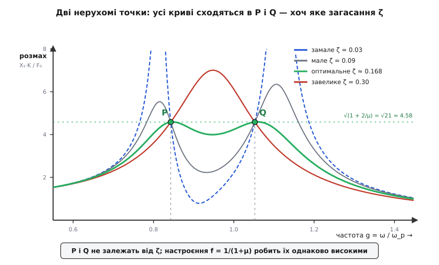

# 🧮 Настроєння Ден Гартоґа: дві нерухомі точки, з яких ростуть три формули

Рецепт настроєння гасителя тримається на трьох коротких рядках: частоту беруть **f = 1/(1+μ)**, загасання **ζ = √(3μ/(8·(1+μ)³))**, а залишковий резонанс осідає до **√(1+2/μ)**. Звідки ці числа? Їх не вгадали й не підібрали на око — вони випадають з одного чесного обчислення. Треба лише записати рівняння руху двох мас, знайти сталий розмах головної з них під зовнішньою силою, а тоді помітити разючий факт: **усі криві відгуку, хоч яке в гасителя загасання, проходять через дві спільні точки**. Провести ці дві точки куди треба — і є вся хитрість настроєння. Розберімо це від першого рядка.

### Означення: що саме ми рахуємо

Маємо систему з **двома ступенями вільності**. Головна маса M сидить на пружині K (це модель першої моди будівлі, вала чи мостка — усього, що резонує). До неї причеплено гаситель: маленьку масу m на власній пружині k і в'язкому демпфері c. Зовнішня гармонічна сила F₀·sin(ωt) розгойдує головну масу. Питання одне: **який усталений розмах X₁ головної маси** — і як він залежить від частоти збудження та від того, як ми настроїли гаситель.

Головну систему беремо **без власного загасання**. Це не лінь, а свідомий крок Ден Гартоґа: будівля чи вал самі гасять коливання кволо (тому й резонують небезпечно), а все корисне загасання ми навмисне зосереджуємо в гасителі. Прибравши демпфер із головної маси, ми отримаємо найчистіший, найгостріший — найгірший — резонанс, і саме проти нього налаштовуємо гаситель. Вийде добре тут — з реальним слабким загасанням основи вийде ще краще.

### Постановка: два тіла, дві пружини, одна сила

Позначмо x₁ — зсув головної маси від рівноваги, x₂ — зсув гасителя. На головну масу діють: її пружина (−K·x₁), пружина гасителя (тягне за різницю зсувів, −k(x₁−x₂)), демпфер (сила за різницею швидкостей, −c(ẋ₁−ẋ₂)) і зовнішня сила. На гаситель діють лише його пружина й демпфер — але з протилежним знаком, бо це та сама пара сил, прикладена до другого кінця. Другий закон Ньютона для кожного тіла дає:

```
головна маса M:   M·ẍ₁ + K·x₁ + k(x₁ − x₂) + c(ẋ₁ − ẋ₂) = F₀·sin(ωt)
гаситель m:       m·ẍ₂ + k(x₂ − x₁) + c(ẋ₂ − ẋ₁) = 0
```

Уся фізика вже тут. Зверніть увагу на симетрію: член k(x₁−x₂) стоїть у першому рівнянні з плюсом, а k(x₂−x₁) у другому — з тим самим модулем, але протилежним знаком. Це третій закон Ньютона в дії: з якою силою пружина гасителя тягне головну масу, з такою ж вона тягне гаситель назустріч. Те саме з демпфером. Обидва рівняння зчеплені через ці спільні члени — рух однієї маси входить у рівняння іншої. Саме через це зчеплення гаситель і може впливати на головну масу; розірвіть його (k = 0, c = 0) — і маси стануть незалежні.

### Стала відповідь: від синусів до комплексних амплітуд

Систему трясуть на одній частоті ω, тож у сталому режимі обидві маси гойдаються теж на ω — з якимись розмахами й, через демпфер, зі зсувами у [фазі](book:physics/phase). Тягати синуси й косинуси було б громіздко; натомість кожній коливній величині зіставимо **комплексну амплітуду** — обертовий вказівник, довжина якого дає розмах, а кут — фазу. Покладемо x₁ = Re[X₁·e^(iωt)], x₂ = Re[X₂·e^(iωt)], F = F₀·e^(iωt). Тоді диференціювання за часом стає множенням на iω, а друге диференціювання — на (iω)² = −ω². Рівняння з диференціальних робляться алгебраїчними:

```
(K + k − Mω² + iωc)·X₁ − (k + iωc)·X₂ = F₀
−(k + iωc)·X₁ + (k − mω² + iωc)·X₂ = 0
```

Це звичайна лінійна система 2×2 на два невідомі X₁, X₂. З другого рівняння видно ключове: гаситель рухається строго слідом за головною масою,

```
X₂ = (k + iωc) / (k − mω² + iωc) · X₁,
```

а розв'язавши систему на X₁ (правило Крамера — ділимо на визначник), дістаємо

```
X₁ = F₀ · (k − mω² + iωc) / D,

D = (K + k − Mω² + iωc)(k − mω² + iωc) − (k + iωc)².
```

Уся поведінка головної маси схована в цьому дробі. Далі — тільки прибрати з нього розмірні «одиниці» й прочитати, що він каже.

### Нормування: чотири безрозмірні числа

Голі M, K, k, c, ω нічого не підказують оку — важать не самі величини, а їхні відношення. Запровадимо чотири безрозмірні числа й статичний прогин, до якого зручно все віднести:

```
ω_p = √(K/M)          власна частота головної системи
ωₐ = √(k/m)           власна частота гасителя
g = ω / ω_p           частота збудження (нормована)
f = ωₐ / ω_p          настроєння: наскільки гаситель нижчий за головну систему
μ = m / M             масове відношення
ζ = c / (2·m·ω_p)     загасання гасителя, віднесене до частоти головної системи
X_st = F₀ / K         статичний прогин під тією ж силою
```

Останній рядок вартий погляду. Загасання ζ ми міряємо **критичним загасанням, узятим на частоті головної системи** ω_p, а не власній частоті гасителя, як звично для [самотнього осцилятора](book:physics/damped-oscillator). Це не примха: саме таке віднесення дасть згодом найчистіші формули, бо всі частоти в задачі порівнюються з однією-єдиною лінійкою — ω_p. Підставивши ці означення (Mω²/K = g², k/K = μf², iωc/K = 2iζgμ і так далі) у вираз для X₁ і поділивши на X_st, після скорочень дістанемо навдивовижу охайний результат:

```
              (f² − g²) + i·2ζg
X₁/X_st = ─────────────────────────────────────────────────
          [(f²−g²)(1−g²) − μf²g²] + i·2ζg·[1 − (1+μ)g²]
```

Сталося маленьке диво: **масове відношення μ, що множило весь визначник, скоротилося** з чисельником — від нього лишилися тільки два скромні входження в знаменнику. Це не випадковість, а знак того, що ми вибрали правильні змінні. Розмах головної маси — модуль цього комплексного дробу; піднісши до квадрата, дістаємо головну формулу всієї теорії:

```
            (f² − g²)² + (2ζg)²
|X₁/X_st|² = ──────────────────────────────────────────────────────
            [(f²−g²)(1−g²) − μf²g²]² + (2ζg)²·[1 − (1+μ)g²]²
```

Це і є **крива відгуку** гасителя, з якої видно все інше. Далі ми лише розглядатимемо її під різними кутами.

### Два читання формули без демпфера

Найперше вимкнемо демпфер (ζ = 0) — так найясніше видно кістяк. Квадрати зникають, лишається

```
X₁/X_st |_(ζ=0) = (f² − g²) / [(f²−g²)(1−g²) − μf²g²]
```

Тепер прочитаймо чисельник і знаменник окремо.

**Чисельник → нуль: антирезонанс.** Дріб дорівнює нулю, коли (f² − g²) = 0, тобто g = f — коли частота збудження точно збігається з власною частотою гасителя (ω = ωₐ). Розмах головної маси провалюється **в нуль**. Механізм захований у тому самому чисельнику: він прийшов із множника (k − mω²), тобто з гасителя. На своїй власній частоті гаситель розгойдується рівно так, щоб сила його пружини щомиті дорівнювала прикладеній і була напрямлена проти неї; дві сили гасять одна одну, і на головну масу не діє ніщо. Вона завмирає — а гойдається лише гаситель.

**Знаменник → нуль: дві нормальні моди.** Розмах злітає в нескінченність (резонанс) там, де знаменник обертається на нуль:

```
(f² − g²)(1 − g²) = μ f² g²
```

Це біквадратне рівняння відносно g²: воно має **два** додатні корені, а не один. Причепивши до системи другу масу, ми зробили з неї систему з двома ступенями вільності, а така має дві [нормальні моди](book:physics/coupled-oscillators) — дві частоти, на яких обидві маси гойдаються злагоджено. Єдиний резонансний пік голої конструкції розщепився на два, що обсідають антирезонансний провал з обох боків. Для наочного випадку f = 1 (гаситель настроєний точно на конструкцію) рівняння стає (1−g²)² = μg², звідки 1 − g² = ±√μ·g: дві моди розходяться від g = 1 приблизно на ±½√μ, і що важчий гаситель, то ширше вони розсуваються. Ось математичне джерело «двох нових піків», через які чистий гаситель без демпфера небезпечний поза своєю однією точкою.

А що на іншому кінці — коли загасання **дуже велике** (ζ → ∞)? Демпфер тоді намертво зчіплює гаситель із головною масою, вони рухаються як одне тіло M+m на пружині K, і з формули лишається один резонанс при g = 1/√(1+μ). Отже, обидві крайності — нульове й нескінченне загасання — дають гострі нескінченні піки; правда десь між ними.

### Нерухомі точки: те, що не залежить від загасання

Тепер — центральна ідея, яку 1928 року помітили Джон Ормондройд і Якоб ден Гартоґ. Погляньмо на головну формулу як на функцію лише загасання. І чисельник, і знаменник мають однакову будову «щось плюс (2ζg)²·щось»:

```
            α + ζ²·β                     α = (f²−g²)²,     β = 4g²
|X₁/X_st|² = ─────────  ,  де           γ = [(f²−g²)(1−g²) − μf²g²]²,
            γ + ζ²·δ                     δ = 4g²·[1 − (1+μ)g²]²
```

Дріб такого вигляду — (α + ζ²β)/(γ + ζ²δ) — узагалі кажучи, залежить від ζ. Але є винятковий випадок: якщо **α/γ = β/δ**, то дріб дорівнює цьому спільному відношенню **за будь-якого ζ**. Це просте алгебраїчне спостереження: коли чисельник і знаменник ростуть із загасанням у однаковій пропорції, їхнє відношення не ворухнеться. Отже, існують такі частоти g, де розмах головної маси **не залежить від загасання гасителя зовсім** — хоч поставте демпфер, хоч заваріть, хоч зніміть. Їх називають **нерухомими (інваріантними) точками**.



*Дві нерухомі точки P і Q. Хоч як міняй загасання гасителя — від замалого (сині гострі піки) через оптимальне (зелена полога крива) до завеликого (червоний горб, що лізе вгору між точками) — усі криві проходять рівно через P і Q. Їхня висота від ζ не залежить. Уся гра настроєння — довести ці дві точки до потрібного місця.*

Знайдімо ці точки. Умова β/δ = α/γ після скорочення 4g² зводиться до

```
(f²−g²)² · [1 − (1+μ)g²]² = [(f²−g²)(1−g²) − μf²g²]²
```

Це рівність квадратів; беручи корінь зі знаком «−» (знак «+» дає лише тривіальне g = 0), після розкриття дужок отримуємо біквадратне рівняння на положення точок:

```
g⁴ − 2·[1 + (1+μ)f²]/(2+μ) · g² + 2f²/(2+μ) = 0
```

Два його корені g_P² і g_Q² — і є нерухомі точки. А яка на них висота кривої? Підставимо β/δ:

```
|X₁/X_st| у нерухомій точці = 1 / |1 − (1+μ)g²|
```

Ось що вражає найбільше: **ця висота не залежить ні від ζ, ні навіть від настроєння f** — тільки від μ і від того, де сама точка стоїть. Настроєння f лише пересуває точки по частоті (через біквадратне рівняння), а їхню висоту диктує зовсім проста формула. Це й дає ключ до оптимізації у два ясні кроки.

### Оптимальне настроєння: зрівняти висоти P і Q

Крок перший — настроєння f. З двох нерухомих точок нижча за частотою (P) лежить під g = 1, вища (Q) — над нею. Поки точки різної висоти, найвищий пік кривої неминуче тягнеться до тієї з них, що вища: скільки не грай загасанням, гіршу точку не опустиш нижче за неї. Отже, найкраще, що можна зробити, — **зробити P і Q однаково високими**. Тоді жодна з них не «стирчить», і обидві можна притиснути разом.

Висота в точці — 1/|1 − (1+μ)g²|. У точці P вираз 1 − (1+μ)g_P² додатний, у точці Q — від'ємний. Рівність модулів означає, що вони протилежні за знаком і рівні:

```
1 − (1+μ)g_P² = −[1 − (1+μ)g_Q²]
→  2 = (1+μ)(g_P² + g_Q²)
→  g_P² + g_Q² = 2/(1+μ)
```

А суму коренів біквадратного рівняння ми вже знаємо — це його середній коефіцієнт: g_P² + g_Q² = 2·[1 + (1+μ)f²]/(2+μ). Прирівнюємо два вирази для суми:

```
2·[1 + (1+μ)f²]/(2+μ) = 2/(1+μ)
(1+μ)·[1 + (1+μ)f²] = 2+μ
(1+μ) + (1+μ)²f² = 2+μ
(1+μ)²f² = 1
```

звідки одразу

```
f = 1/(1+μ)          ← оптимальне настроєння
```

Це та перша магічна формула. Вона каже щось тонке: власну частоту гасителя беруть **нижчою** за частоту конструкції (бо f < 1), і то тим нижчою, чим важчий гаситель. Чиста математика зрівнювання двох висот — жодного припасування.

### Залишковий пік: чому саме √(1+2/μ)

Тепер, коли точки однакові, порахуймо їхню спільну висоту — це і буде найкраще, чого взагалі можна досягти. Із настроєнням f = 1/(1+μ) сума коренів дорівнює 2/(1+μ), а їхній добуток (вільний член біквадратного рівняння) — 2f²/(2+μ) = 2/[(1+μ)²(2+μ)]. Різницю коренів дістанемо через тотожність (різниця)² = (сума)² − 4·(добуток):

```
(g_Q² − g_P²)² = [2/(1+μ)]² − 4·2/[(1+μ)²(2+μ)]
              = 4/(1+μ)² · [1 − 2/(2+μ)]
              = 4/(1+μ)² · μ/(2+μ)
```

Висота точки — 1/|1 − (1+μ)g_P²|; позначмо цей знаменник D. Оскільки в точках 1 − (1+μ)g² протилежні за знаком, їхня різниця дає (1+μ)(g_Q² − g_P²) = 2D, тобто

```
D = (1+μ)/2 · (g_Q² − g_P²) = (1+μ)/2 · 2/(1+μ) · √(μ/(2+μ)) = √(μ/(2+μ))
```

а висота — обернена до D:

```
|X₁/X_st|_пік = 1/D = √((2+μ)/μ) = √(1 + 2/μ)          ← залишковий пік
```

Третя формула, і теж без жодного припасування — самі корені біквадратного рівняння. Тепер видно, звідки її повільна віддача: μ сидить у знаменнику **під коренем**, тож щоб удвічі зрізати залишковий пік, масу гасителя треба збільшити вчетверо. Перші відсотки μ дають головний виграш, далі крива виположується.

### Оптимальне загасання: горизонтальна дотична

Лишився крок третій — загасання. Зрівняні точки P і Q — це «цвяхи», крізь які проходить крива за будь-якого ζ. Замале загасання лишає обабіч них два гострі піки; завелике піднімає горб між ними вище за самі точки (див. червону криву на фігурі). Найкраще ζ — те, за якого крива йде через нерухому точку **горизонтально**, роблячи саму точку своєю вершиною: тоді ніщо не стирчить вище.

Тут криється чесна тонкість. Вимога горизонтальної дотичної (dP/dg = 0) окремо в точці P і окремо в точці Q дає **два різні** значення загасання — бо крива підходить до лівої й правої точок з різною крутістю:

```
ζ²(у точці P) = μ·[3 − √(μ/(2+μ))] / [8·(1+μ)³]
ζ²(у точці Q) = μ·[3 + √(μ/(2+μ))] / [8·(1+μ)³]
```

Одним загасанням обидві точки зробити точними вершинами не вийде — доводиться йти на компроміс. Практичний вибір Ден Гартоґа — **середнє** з двох значень; доданки ∓√(μ/(2+μ)) при усередненні скорочуються, і лишається напрочуд простий вираз:

```
ζ² = 3μ / (8·(1+μ)³)   →   ζ = √( 3μ / (8·(1+μ)³) )   ← оптимальне загасання
```

Саме цей закритий вигляд 1946 року акуратно вивів Дж. Брок (*J. E. Brock*), уточнивши усереднення Ден Гартоґа; відтоді він і стоїть у підручниках. За такого загасання обидві точки P і Q виходять майже точно вершинами кривої (з точністю до тієї малої несиметрії, що її ми усереднили), і розмах головної маси ніде не перевищує √(1+2/μ). Кращого одним пасивним гасителем не досягти — це теоретична межа.

### Числом: гаситель на 10 % маси

Проженімо весь рецепт для важкого гасителя, μ = 0.1 (маса гасителя — десята частка головної). Це саме той випадок, що на фігурі.

```
масове відношення:   μ = 0.1
настроєння:          f = 1/(1+0.1) = 1/1.1 ≈ 0.909
                     → власну частоту гасителя беремо на ~9 % нижчою за частоту конструкції

нерухомі точки (корені біквадратного рівняння при f = 0.909):
   сума   g_P² + g_Q² = 2/1.1 = 1.818
   добуток g_P²·g_Q² = 2/(1.1²·2.1) = 0.787
   → g_P² = 0.711,  g_Q² = 1.107   →   g_P ≈ 0.843,  g_Q ≈ 1.052

висота в точках:     1/|1 − 1.1·0.711| = 1/0.218 ≈ 4.58
залишковий пік:      √(1 + 2/0.1) = √21 ≈ 4.58        (збіг — контроль!)

оптимальне загасання: ζ = √( 3·0.1 / (8·1.1³) ) = √( 0.3/10.65 ) ≈ 0.168
```

Два незалежні шляхи — пряма підстановка в 1/|1 − (1+μ)g_P²| і формула √(1+2/μ) — дали ту саму висоту 4.58; це найкраща перевірка, що корені пораховано правильно. Голий резонанс такої слабко демпфованої конструкції сягав би кількох десятків; гаситель на 10 % маси, настроєний за цими трьома числами, зрізає його до **4.6** — і, головне, робить це на цілій смузі частот навколо резонансу, а не в одній точці, бо криву притиснуто до двох рознесених точок, а не до єдиного провалу.

### Де це працює в темі гасителя

Три формули настроєння — не окремі рецепти, а троє воріт одного будинку. Уся будова стоїть на **нерухомих точках**: щойно ми довели, що криві відгуку перетинаються у двох місцях, незалежних від загасання, оптимізація розпалася на два ясні кроки — спершу настроєнням f зрівняти висоти точок (звідси f = 1/(1+μ)), тоді загасанням ζ притиснути криву до них горизонтально (звідси ζ = √(3μ/(8(1+μ)³))), а їхня спільна висота √(1+2/μ) одразу каже, наскільки взагалі вдасться приборкати резонанс. Одне масове відношення μ задає всі три числа — тому вибір розміру гасителя і є головним інженерним рішенням, а решта визначається однозначно.

Варто тримати в голові й межі цієї картини. Головну систему ми взяли **без власного загасання** — рівно дві нерухомі точки існують саме за цієї ідеалізації; додайте реальне (нехай мале) загасання основи, і точки перестають бути точно інваріантними, а формули стають першим наближенням, яке добре працює, поки основа демпфована кволо (а вона майже завжди така). Силу ми прикладали до головної маси; для збудження через основу (сейсміка, вібрація опори) чисельник виходить інший, і оптимальні f та ζ трохи зсуваються. Але кістяк — дві нерухомі точки й оптимізація у два кроки — лишається, і саме тому метод Ормондройда й Ден Гартоґа з 1928 року й досі стоїть у центрі проєктування настроєних гасителів: від «гантельок» на дротах ЛЕП до 660-тонної кулі під дахом хмарочоса.
