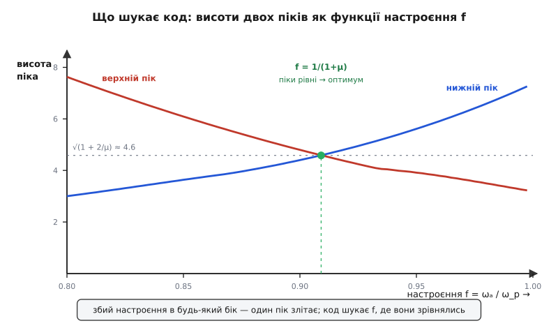
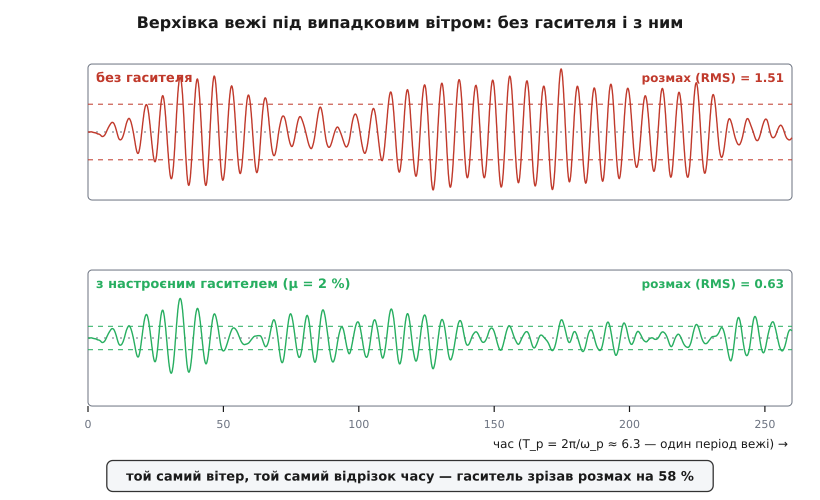

# ⚙️ Настроїти гаситель кодом: зрівняти два піки й угамувати вежу

Готові формули настроєння виглядають як магія з капелюха: власну частоту гасителя бери трохи нижчою за частоту вежі, `f = 1/(1 + μ)`, а загасання став `ζ = √(3μ / 8(1+μ)³)` — і резонанс присмирений. Звідки ці числа? І, головне, чи тримаються вони, коли вежа має власне [загасання](topic:physics/damped-oscillator), а вітер — не чиста синусоїда, а розхристаний шум із усіма частотами заразом? Формулу виводили для ідеальної, зовсім незагашеної конструкції під одну частоту; реальна будівля не така.

Тому не повірмо формулі, а **здобудьмо** її. Зберемо модель із двох мас із самих рівнянь руху, попросимо комп'ютер знайти найкраще настроєння самотужки — просто дивлячись, як два резонансні піки сходяться до однакової висоти, — і переконаємось, що він приходить рівно до Ден-Гартоґових чисел. А тоді підемо туди, куди формула не дістає: кинемо змодельовану вежу в бурю з випадковим вітром, з гасителем і без, і побачимо, як розмах провалюється. Усе це — кількадесят рядків на Python; чисельне моделювання коливань і оптимізація — його рідна стихія (numpy для лінійної алгебри й сіток, scipy для пошуку).

## Модель: зібрати матрицю 2×2 і розв'язати

Система — дві маси. Головна `M` на пружині `K` (це вежа), і причеплений до неї гаситель — маса `m` на пружині `k` з демпфером `c`. [Другий закон Ньютона](topic:physics/newtons-second-law) для кожної дає пару зв'язаних рівнянь: сила пружини `K` тягне вежу до нерухомої опори, а пружина `k` й демпфер `c` діють між вежею й гасителем, тож у їхні члени входить **різниця** зміщень і швидкостей:

```
M·ẍ₁ = −K·x₁ − c_s·ẋ₁ − k·(x₁−x₂) − c·(ẋ₁−ẋ₂) + F(t)
m·ẍ₂ =                 − k·(x₂−x₁) − c·(ẋ₂−ẋ₁)
```

Тут `x₁` — зміщення вежі, `x₂` — гасителя, `F(t)` — вітрова сила, а `c_s` — власне (структурне) загасання самої вежі, якого в підручниковій формулі немає, але в житті воно є.

Щоб побачити частотну характеристику, збудимо систему чистою гармонікою `F(t) = F₀·e^{iωt}` і пошукаємо усталений відгук тієї ж частоти: `x = X·e^{iωt}`. Кожна похідна за часом перетворюється на множення на `iω`, друга — на `−ω²`, і диференціальні рівняння стають **алгебраїчними** — звичайною системою двох лінійних рівнянь на дві комплексні амплітуди `X₁, X₂`:

```
(K + iωc_s − ω²M + k + iωc)·X₁ − (k + iωc)·X₂ = F₀
−(k + iωc)·X₁ + (k + iωc − ω²m)·X₂ = 0
```

Це матриця `2×2`, помножена на вектор `(X₁, X₂)`, дорівнює `(F₀, 0)`. Розв'язати її для кожної частоти — і `|X₁|` розкаже, наскільки сильно вежа гойдається на цій частоті. Заведімо безрозмірні величини, щоб числа були чисті: візьмемо `M = 1` і `ω_p = √(K/M) = 1` (тобто `K = 1`), а решту виразимо через них — масове відношення `μ = m/M`, настроєння `f = ωₐ/ω_p`, загасання гасителя `ζ = c/(2mω_p)`. Тоді `m = μ`, `k = μf²`, `c = 2ζμ`, а `F₀ = 1` дає статичний прогин `1`, тож `|X₁|` — це прямо коефіцієнт підсилення (у скільки разів розмах більший за статичний).

```py
import numpy as np

def response(g, mu, f, zeta, zeta_s=0.0):
    """Розмах головної маси |X₁| (у частках статичного прогину) на кожній частоті.
    g = ω/ω_p, f = ωₐ/ω_p, μ = m/M, zeta = c/(2mω_p), zeta_s — структурне загасання вежі."""
    w = np.atleast_1d(np.asarray(g, dtype=float))
    X1 = np.empty_like(w, dtype=complex)
    k, c, cs = mu*f*f, 2*zeta*mu, 2*zeta_s          # бо M=K=ω_p=1  ⇒  m=μ, k=μf²
    for n, om in enumerate(w):
        jom = 1j*om
        A = np.array([[1 + jom*cs - om*om + k + jom*c, -(k + jom*c)],
                      [-(k + jom*c),                    k + jom*c - om*om*mu]])
        X1[n] = np.linalg.solve(A, [1.0, 0.0])[0]   # розв'язати 2×2, узяти X₁
    return np.abs(X1)
```

Жодної формули відгуку ми не виписували — лише зібрали матрицю з коефіцієнтів рівнянь руху й довірили розв'язання `numpy`. Це головна чеснота підходу: він **узагальнюється**. Додайте третю масу, ще один демпфер, несиметрію — матриця побільшає, а рядок `np.linalg.solve` не зміниться. Аналітична формула такої розкоші не дає.

**Приклад: вежа з добротністю Q ≈ 50 дістає гаситель на 2 % маси.** Голе [резонансне](topic:physics/mechanical-resonance) підсилення такої вежі дорівнює її [добротності](topic:physics/q-factor) — а `Q = 1/(2ζ_s)`, тож `Q = 50` означає структурне загасання `ζ_s = 0.01`. Настроїмо гаситель за Ден-Гартоґовими формулами й порівняймо пік із гасителем і без:

```py
mu = 0.02
f_dh = 1/(1+mu)                          # = 0.9804
z_dh = np.sqrt(3*mu/(8*(1+mu)**3))       # = 0.0841
g = np.linspace(0.85, 1.15, 6001)
zeta_s = 0.01                            # Q = 1/(2ζ_s) = 50

bare  = 1/np.sqrt((1-g*g)**2 + (2*zeta_s*g)**2)   # гола вежа (1-DOF)
tuned = response(g, mu, f_dh, z_dh, zeta_s)        # вежа + настроєний гаситель
print(bare.max(), tuned.max())
```

```
пік без гасителя = 50.0        (це і є Q)
пік із гасителем = 8.71        (на g ≈ 0.936)
```

Гаситель вагою лише 2 % маси зрізав резонансне підсилення з **50 до 8.7** — приблизно вшестеро. Цікаво, що це навіть **краще**, ніж обіцяє підручникова оцінка залишкового піка `√(1 + 2/μ) = √101 ≈ 10.05`: та формула виведена для зовсім незагашеної вежі, а наша має власне `ζ_s = 0.01`, і це власне загасання додає свій, невеликий, внесок. Формула, отже, трохи **песимістична** — обережна оцінка згори, і це добра риса для інженерної формули.

## Хай комп'ютер знайде настроєння: два піки, один мінімакс

Тепер найцікавіше: забудьмо формулу `f = 1/(1+μ)` і попросимо код знайти оптимальне настроєння самотужки. Що взагалі означає «оптимальне»? Причепивши гаситель, ми розщепили один резонансний пік на два (дві власні частоти системи з двома масами). Обидва небезпечні, тож розумна ціль — **притиснути якнайнижче той, що вищий**: мінімізувати максимальний пік. Це задача типу **мінімакс**.

Ключ до неї помітив ще Ден Гартоґ: усі криві відгуку, хоч яке в гасителя загасання, проходять через дві незмінні **нерухомі точки** — їхня висота від `ζ` не залежить. Отже, нижче за ці точки піки не опустити жодним загасанням; найкраще, що можна, — настроїти частоту `f` так, щоб обидві нерухомі точки стали **однакової висоти**, а тоді дібрати `ζ`, щоб крива лягла на них рівно, зробивши їх власне піками. Коли два піки однакові — далі нема куди тиснути. Це і є критерій оптимуму, і його легко закодувати: шукаємо `f`, за якого висота лівого піка дорівнює висоті правого.

```py
from scipy.optimize import minimize_scalar, brentq

def peaks(mu, f, zeta):
    """Висоти лівого й правого піків відгуку (западина між ними — коло g ≈ f)."""
    g = np.linspace(0.5, 1.5, 4000)
    A = response(g, mu, f, zeta)
    i0 = int(np.argmin(np.abs(g - f)))          # індекс западини
    return A[:i0+1].max(), A[i0:].max()

def optimal_tuning(mu):
    def best_zeta(f):                            # для даного f — ζ, що мінімізує вищий пік
        z = minimize_scalar(lambda z: max(peaks(mu, f, z)),
                            bounds=(1e-3, 0.5), method='bounded').x
        lo, hi = peaks(mu, f, z)
        return z, lo, hi
    # зовнішній пошук: f, за якого два піки зрівнялись
    f_star = brentq(lambda f: best_zeta(f)[1] - best_zeta(f)[2], 0.80, 1.05)
    z_star, lo, hi = best_zeta(f_star)
    return f_star, z_star, max(lo, hi)

for mu in (0.02, 0.05, 0.10):
    fs, zs, pk = optimal_tuning(mu)
    print(f"μ={mu}: код f={fs:.4f} ζ={zs:.4f} пік={pk:.3f}")
```

Пошук двоярусний: внутрішній (`minimize_scalar`) для кожного настроєння `f` підбирає найкраще загасання `ζ`, а зовнішній (`brentq`) крутить `f`, доки різниця висот двох піків не впаде в нуль — тобто доки піки не зрівняються. Порівняймо, що знайшов код, із формулами Ден Гартоґа:

```
μ=0.02:  код f=0.9804  ζ=0.0845  пік=10.053   |  формули f=0.9804  ζ=0.0841  √(1+2/μ)=10.050
μ=0.05:  код f=0.9523  ζ=0.1288  пік= 6.409   |  формули f=0.9524  ζ=0.1273  √(1+2/μ)= 6.403
μ=0.10:  код f=0.9087  ζ=0.1724  пік= 4.592   |  формули f=0.9091  ζ=0.1679  √(1+2/μ)= 4.583
```

Настроєння `f` збігається до четвертого знака — сліпий чисельний пошук самостійно перевідкрив `f = 1/(1+μ)`. Це і є найкраще підтвердження формули: вона випала з мінімаксу, а не з голови.



*Що саме шукає зовнішній цикл. Для кожного настроєння `f` (при його найкращому загасанні) один із двох піків вищий за інший: замало настроїш — злітає верхній пік, забагато — нижній. Рівно при `f = 1/(1+μ)` обидва однакові й притиснуті до найнижчого можливого рівня `√(1+2/μ)`. Саме цю точку рівноваги й знаходить `brentq`.*

Тут ховається тонкість, варта чесного слова. Придивіться до чисел: знайдений пік `10.053` — на волосину **вищий** за `√(1+2/μ) = 10.050`. Це не похибка коду. Формула `√(1+2/μ)` дає висоту **в самих нерухомих точках**, а справжні вершини піків стоять трохи осторонь від них і на крихту вищі (на частку відсотка). Ба більше — критерій «рівні нерухомі точки» не є **точно** глобальним мінімаксом: строго оптимальні `f` і `ζ`, що мінімізують абсолютний максимум, лежать на мікроскопічний зсув від Ден-Гартоґових і були виведені в замкненому вигляді аж на рубежі 1999–2002 років (точні `H∞`-оптимуми Нісіхари й Асамі). Різниця — треті-четверті знаки, інженерно неважлива, тож класичні формули лишаються робочим стандартом; але знати, що вони — чудове наближення, а не остання істина, корисно. *(Статус: усталено; метод нерухомих точок — Ден Гартоґ 1928/1934, точний мінімакс — пізніша строга оптимізація.)*

## Вітер: вежа в часі

Частотна характеристика — це усталений відгук на одну чисту частоту. Але вітер такий не буває: він несе **широку смугу** частот заразом, налітає поривами, і вежа відповідає не гладкою синусоїдою, а неспокійним розгойдуванням із випадковою обгорткою. Щоб побачити гаситель у ділі, змоделюймо вежу **в часі** — проінтегруймо рівняння руху крок за кроком під випадковим вітром.

Спершу сам вітер. Груба, але чесна модель пориву — **відфільтрований білий шум**: беремо на кожному кроці незалежний випадковий поштовх (це [білий шум](topic:physics/white-noise-spectrum) — рівна потужність на всіх частотах) і пропускаємо крізь простий низькочастотний фільтр першого порядку, бо реальні пориви плавні, а не миттєві. Виходить сила з широким спектром, у якому є й та складова, що збігається з власною частотою вежі, — саме її вежа й вихоплює:

```py
def wind(n, dt, seed=1):
    rng = np.random.default_rng(seed)
    tau = 1/1.5                          # стала згладжування (частота зрізу ~1.5·ω_p)
    a = dt/(tau + dt)
    w = np.zeros(n+1)
    for i in range(1, n+1):
        w[i] = w[i-1] + a*(rng.standard_normal() - w[i-1])   # ІЧ-фільтр білого шуму
    return w
```

Тепер саме інтегрування. У нас чотири величини стану — `(x₁, v₁, x₂, v₂)` — і закон, що каже їхні похідні цієї миті. Проганяємо його [методом Рунге-Кутти 4-го порядку](topic:math/numerical-integration) (RK4): він рахує нахил у чотирьох точках усередині кроку й усереднює їх, тож похибка спадає як `Δt⁴` — для гладкої, не надто жорсткої системи це надійний робочий кінь. Один спритний хід: щоб дістати **голу** вежу без гасителя тим самим кодом, досить занулити пружину й демпфер гасителя (`k = c = 0`) — тоді гаситель відчіплюється й ніяк не діє на вежу, а `x₁` стає чистим 1-DOF-відгуком:

```py
def sway(mu, f, zeta, zeta_s, dt, n, w, tmd=True):
    k  = mu*f*f  if tmd else 0.0         # tmd=False → гаситель відчеплено (гола вежа)
    c  = 2*zeta*mu if tmd else 0.0
    cs = 2*zeta_s
    def deriv(s, F):
        x1, v1, x2, v2 = s
        return np.array([v1,
                         -x1 - cs*v1 - k*(x1-x2) - c*(v1-v2) + F,   # ẍ₁ (M=1)
                         v2,
                         (-k*(x2-x1) - c*(v2-v1)) / mu])            # ẍ₂ (m=μ)
    s, x = np.zeros(4), np.empty(n)
    for i in range(n):
        F0, F1, Fm = w[i], w[i+1], 0.5*(w[i]+w[i+1])   # сила на початку, кінці й середині кроку
        k1 = deriv(s,            F0)
        k2 = deriv(s + 0.5*dt*k1, Fm)
        k3 = deriv(s + 0.5*dt*k2, Fm)
        k4 = deriv(s + dt*k3,     F1)
        s = s + dt/6*(k1 + 2*k2 + 2*k3 + k4)           # усереднений крок RK4
        x[i] = s[0]
    return x
```

Проженімо ту саму вежу (`μ = 0.02`, `ζ_s = 0.01`) під **тим самим** вітром двічі — без гасителя й із ним — і порахуймо середньоквадратичний розмах (RMS), відкинувши початковий перехідний відрізок:

```py
mu, zeta_s = 0.02, 0.01
f_dh, z_dh = 1/(1+mu), np.sqrt(3*mu/(8*(1+mu)**3))
dt, T = 0.05, 3000.0
n = int(T/dt)
w  = wind(n, dt, seed=1)
xb = sway(mu, f_dh, z_dh, zeta_s, dt, n, w, tmd=False)
xt = sway(mu, f_dh, z_dh, zeta_s, dt, n, w, tmd=True)
cut = n//4                               # відкинути перехідний процес
rms = lambda a: a[cut:].std()
print(rms(xb), rms(xt), 1 - rms(xt)/rms(xb))
```

```
RMS без гасителя = 0.859
RMS з гасителем  = 0.438        →  спад на 49 %
пік |x| без      = 2.87   →   з гасителем = 1.52
```

Гаситель на 2 % маси зрізав середній розмах **майже вдвічі**, а найбільший кидок — з `2.87` до `1.52`. Ось той самий ефект на очах, у часі:



*Верхівка вежі в часі під одним і тим самим випадковим вітром. Угорі — гола вежа розгойдується широко й безладно; унизу — з гасителем те саме збудження дає помітно тісніший слід. Штрихові лінії — рівень RMS. На цьому короткому 40-періодному записі спад виходить близько 58 %; на довгому, добре усередненому прогоні він осідає біля 50 % — і в цій різниці ховається окрема пастка (нижче).*

## Складність і пастки

**Розстроєння — головна вразливість.** Уся сила гасителя в точності настроєння, і код це безжально показує. Зсуньмо `f` лише на 8 % вгору (наче ми переоцінили частоту вежі або вона поповзла з часом):

```py
xd = sway(mu, f_dh*1.08, z_dh, zeta_s, dt, n, w, tmd=True)
# RMS = 0.508  →  спад лише 41 % замість 49 %
```

Третину виграшу як не було. У частотній картині це видно ще різкіше: розстроєний гаситель зрушує рівновагу двох піків, і один із них лізе вгору — саме та ситуація з фігури настроєння, коли крива вже не в точці перетину. Тому відповідальні гасителі роблять регульованими, а перед пуском ще й уточнюють частоту вежі вимірюванням.

**Крок інтегрування має два різні пороги.** Перший — **стійкість**: явний RK4 на коливальній системі стійкий, лише поки `Δt·ω_max ≲ 2.83` (це `2√2`); переступиш — і замість коливання дістанеш експоненційний вибух, амплітуда полетить у нескінченність із нічого. Другий, набагато суворіший, — **точність**: щоб форма коливання не спотворювалась, на найшвидший період системи треба десятки кроків (орієнтир — 20–50). Найшвидший період тут задає **верхня** нормальна мода двомасової системи, а вона трохи вища за `ω_p` (для `μ = 0.02` — приблизно `1.06·ω_p`), тож крок міряй по ній, а не по вежі. Практично: далеко від межі вибуху, але густо для точності. Проста перевірка — уполовинити `Δt` і глянути, чи змінився результат; не змінився — крок досить дрібний.

**Загасання гасителя — теж пастка з обох боків.** Замалий `ζ` лишає два гострі піки майже недоторканими; завеликий — так міцно зчіплює гаситель із вежею, що вони рухаються як одне тіло, гаситель перестає гойдатися окремо, і повертається єдиний високий резонанс уже спільної маси. Оптимум — посередині; бери `ζ_opt` з формули, але після будь-якої зміни моделі перевіряй чисельно, бо формула виведена для ідеалізованого випадку.

**Формула — для незагашеної вежі.** Оптимальні `f` і `ζ` виведені в припущенні `ζ_s = 0`. Реальна вежа має власне загасання, і воно, як ми бачили, робить формулу трохи песимістичною — не біда. Але якщо структурне загасання велике (не одиниці, а десятки відсотків), ідеалізовані формули вже помітно проміняться, і настроєння варто **дооптимізувати чисельно** прямо на моделі з правдивим `ζ_s`, тим самим мінімаксним пошуком.

**Перехідний процес і статистична збіжність — два підступи часової симуляції.** Спершу система «розганяється» з нуля, тож початок запису забруднений перехідним дзвоном — його треба відкинути (ми відкидали чверть), інакше RMS завищиться. А далі підступ тонший: RMS, порахований із **короткого** запису, — сам по собі випадкова величина з розкидом. Саме тому короткий 40-періодний слід на фігурі дав 58 %, а довгий прогін — 49 %: то не суперечність, а недосемплювання. Надійне число дає або дуже довгий запис, або усереднення по багатьох випадкових реалізаціях (різні `seed`); одна коротка буря нічого статистично не доводить.

**Вузька смуга, а не універсальні ліки.** Насамкінець — межа самої ідеї, а не коду. Настроєний гаситель гарно накриває вузьку смугу коло **однієї** частоти; якщо вежу трясуть кілька мод, кожній потрібен свій гаситель, а широкосмугову трясанину загалом він не бере. Модель це чесно покаже: поставте збудження далеко від `ω_p` — і різниця з гасителем і без майже зникне.

## Що з цього лишається

Формула настроєння виявилась не заклинанням, а висновком. Ми не підставили `f = 1/(1+μ)` — ми зібрали матрицю `2×2` з рівнянь руху, попросили комп'ютер зрівняти два піки, і він сам вийшов рівно на це число. Так працює будь-яка добра формула: за нею стоїть механізм, який можна відтворити з першопринципів. А коли механізм у руках кодом, він веде далі за формулу — у той безлад, де вежа має власне загасання, а вітер налітає всіма частотами заразом, і де підручникова формула вже мовчить, а тих самих кількадесят рядків спокійно рахують, як стотонна куля вдвічі вгамовує розгойдану бурею вежу.
