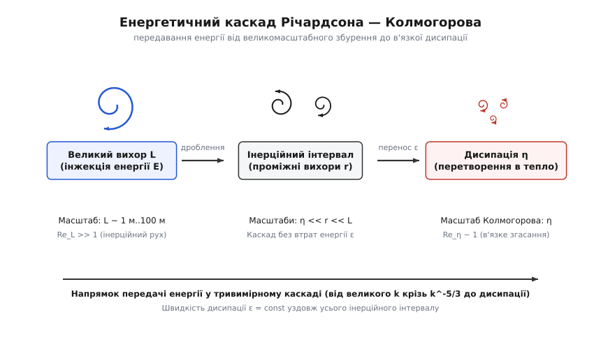
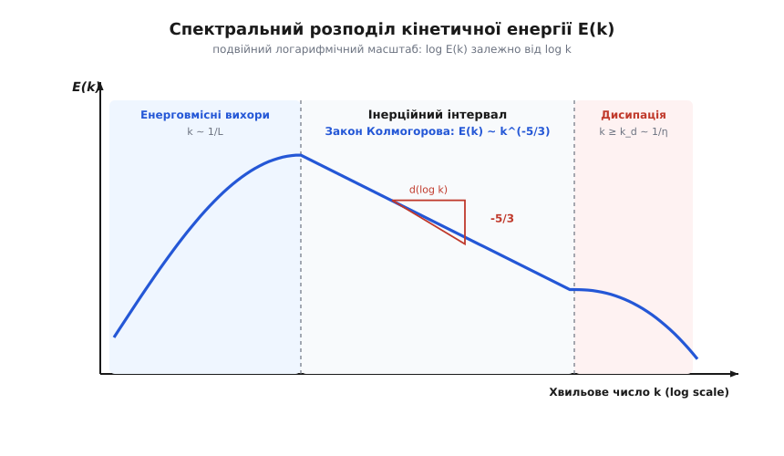
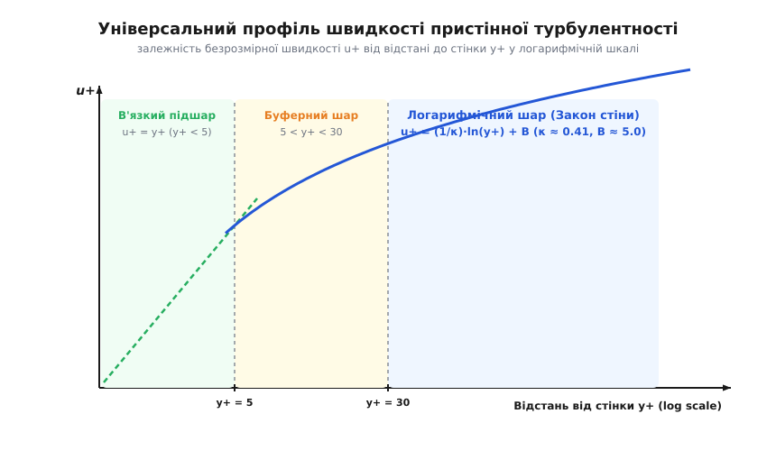
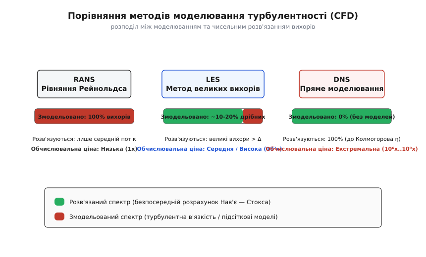

# Турбулентність

<preknowlist>
- [Число Рейнольдса](book:physics/reynolds-number) — відношення інерційних сил до сил в'язкості, головний критерій переходу потоку від ламінарного стану до вихрового хаосу.
- [Рівняння Нав'є — Стокса](book:physics/navier-stokes) — фундаментальні диференціальні рівняння руху нестисливої в'язкої рідини чи газу.
- [В'язкість](book:physics/viscosity) — внутрішнє тертя середовища, що розсіює кінетичну енергію руху у тепло.
- [Пограничний шар](book:physics/boundary-layer) — тонка область рідини поблизу твердої стінки, де швидкість змінюється від нуля до швидкості вільного потоку.
- [Зрив потоку](book:physics/flow-separation) — відрив примежового шару від поверхні тіла з утворенням зсувної зони та поворотних вихорів.
</preknowlist>

Якщо відкрити водопровідний кран на крихітну щілину, прозора струминна води падає донизу абсолютно рівним, дзеркальним циліндром. Вона здається застиглим скляним стрижнем. Але варто трохи повернути вентиль і збільшити швидкість, як рівна поверхня здригається, вкривається дрібними зморшками, розривається на клубки й перетворюється на бурхливий, білий від бульбашок і шумний потік. Усі властивості речовини лишилися незмінними: той самий діаметр виходу, та сама вода, та сама температура й кінематична в'язкість. Проте за частку секунди стан руху перестрибнув у докорінно інший режим — із ламінарного у турбулентний.

Турбулентність — це найбільш розповсюджений і водночас найскладніший стан руху речовини у Всесвіті. У турбулентному режимі течуть річки й океанські течії, рухаються повітряні маси атмосфери, обтікаються крила літаків, згорає паливо у циліндрах двигунів і вирує плазма у надрах зірок. При цьому турбулентність залишається однією з останніх нерозв'язаних проблем класичної фізики: ми маємо точні рівняння руху, але не можемо аналітично передбачити поведінку потоку без суперкомп'ютерного розрахунку чи експерименту.

## Загадка хаосу з детермінованого рівняння

Головний фізичний парадокс турбулентності полягає в тому, що хаотичний, непередбачуваний і тривимірний потік породжується строго детермінованими рівняннями суцільного середовища — рівняннями Нав'є — Стокса:

```
ρ · (∂u/∂t + (u · ∇)u) = -∇p + μ · ∇²u + f
∇ · u = 0
```

У цих рівняннях немає жодного випадкового додатка, жодного джерела зовнішнього шуму чи ймовірнісної невизначеності. Звідки ж упевнено виринає хаос?

Відповідь ховається у другому доданку лівої частини рівняння — **нелінійному адвективному члені `(u · ∇)u`**. Саме цей член описує переношення імпульсу самим потоком. Поки швидкість течії мала, а в'язкість `μ` велика (мале число Рейнольдса `Re = ρ·v·L / μ`), правосторонній дифузійний оператор `μ · ∇²u` домінує. В'язкість виступає потужним стабілізатором: вона гасить будь-які випадкові флуктуації швидкості, розгладжуючи профіль і змушуючи сусідні шари рідини ковзати паралельно один одному.

Але коли швидкість зростає й число Рейнольдса перевищує критичну межу `Re_crit`, нелінійний член `(u · ∇)u` починає переважати в'язке згасання. Будь-яке мікроскопічне збурення — шорсткість стінки, акустична хвиля чи незначне коливання тиску — більше не гаситься. Нелінійність підхоплює це збурення, підсилює його й перерозподіляє енергію між різними напрямками та масштабами.

Ця експоненційна чутливість до початкових умов робить турбулентний потік математичним втіленням детермінованого хаосу Лоренца (ефект метелика). Якщо два турбулентні потоки стартануть із початкових полів швидкості, що відрізняються лише на мільйонну частку відсотка, через декілька характерних вихрових періодів їхні фазові траєкторії повністю розійдуться. 

Математично цей процес описується лінійною теорією гідродінамічної нестійкості через **рівняння Орра — Зоммерфельда**. Коли мале збурення потрапляє у потік зі зсувом швидкості, в'язкість на малих `Re` створює фазовий зсув, що гасить хвилю. Але при перевищенні `Re_crit` сили інерції починають відкачувати енергію від середнього потоку безпосередньо у хвильове збурення.

Класичними прикладами таких первинних нестійкостей є:
- **Нестійкість Кельвіна — Гельмгольца:** виникає на межі двох шарів рідини чи газу, що рухаються з різними швидкостями. Зсув швидкості створює перепад тиску за законом Бернуллі, який вигинає межу розділу у завиті вихори (як хвилі на морі під дією вітру чи хмари характерної вихрової форми).
- **Нестійкість Релея — Тейлора:** стається, коли важка рідина лежить над легшою у полі тяжіння. Найменший прогин межі призводить до провалювання важких «пальців» донизу й спливання легких вихорів догори.

Після першої біфуркації потік втрачає ламінарну стійкість. Далі ланцюжок нових біфуркацій миттєво підхоплює нові моди коливань, і система незворотно звалюється у турбулентний хаос. Детальніше про те, як фізики століттями просувалися від перших здогадів до математичного аналізу цього переходу, можна прочитати у вставці [історія відкриття та дослідження турбулентності](book:physics/mechanics/turbulence/hist-turbulence.md).

З фізичної точки зору турбулентність має чотири обов'язкові ознаки, які відрізняють її від будь-яких інших вихрових чи хвильових рухів:

1. **Випадковість і нерегулярність:** поля швидкості, тиску й температури флуктують у просторі та часі настільки складно, що їхній точний детальний стан неможливо передбачити надовго наперед — доводиться переходити до статистичних методів і ймовірнісних розподілів.
2. **Дифузійність і люте перемішування:** турбулентні вихори переносять речовину, імпульс і тепло у тисячі й мільйони разів швидше, ніж молекулярна дифузія чи теплопровідність. Саме турбулентність відповідає за швидке розсіювання диму в атмосфері та змішування реагентів у хімічних реакторах.
3. **Тривимірність та завихреність:** турбулентність завжди насичена складними тривимірними вихровими структурами. Двовимірна турбулентність існує лише як математична модель або у дуже тонких шарах (наприклад, у великомасштабній атмосфері).
4. **Дисипативність:** турбулентність не може підтримувати саму себе без постійного припливу енергії ззовні. Якщо джерело енергії вимкнути, в'язке тертя швидко перетворить кінетичну енергію вихорів на тепло.

## Анатомія вихорів: тривимірність та розтягування вихрових ниток

Щоб зрозуміти внутрішній двигун турбулентності, треба подивитися на поняття **завихреності** (лат. *vorticitas*). Вектор завихреності `ω` визначається як ротор поля швидкостей:

```
ω = ∇ × u
```

Завихреність показує подвоєну кутову швидкість локального обертання елементарного об'єму рідини. Циркуляція швидкості по довільному замкненому контуру `Γ = ∮ u · dl` за теоремою Стокса дорівнює потоку вектора завихреності крізь поверхню, натягнуту на цей контур: `Γ = ∬ ω · n dS`.

За застосування оператора ротора `∇ ×` до рівняння Нав'є — Стокса нестисливої рідини отримуємо рівняння переносу завихреності:

```
∂ω/∂t + (u · ∇)ω = (ω · ∇)u + ν · ∇²ω
```

Подивімося уважно на перший доданок у правій частині — **член вихрового розтягування `(ω · ∇)u`** (vortex stretching). Цей доданок відповідає за зміну завихреності під дією градієнтів швидкості середнього потоку. І саме тут лежить фундаментальна відмінність тривимірного світу від двовимірного.

У двовимірному потоці (на площині `xy`) вектор завихреності завжди спрямований строго перпендикулярно до площини руху — уздовж осі `z`. Тому градієнт швидкості вздовж вектора завихреності дорівнює нулю: `(ω · ∇)u = ω_z · (∂u / ∂z) = 0`. У 2D-просторі вихрового розтягування **не існує взагалі**. У двовимірній рідині зберігається інтеграл від квадрата завихреності — **енстрофія** `Ω = (1/2) ∬ ω² dS`. Збереження енстрофії забороняє передачу енергії до дрібних масштабів, породжуючи обратний каскад — від дрібних вихорів до гігантських структур.

У тривимірному ж просторі вектор `ω` може орієнтуватися як завгодно. Якщо потік розтягує вихрову нитку вздовж її осі (тобто уздовж напрямку `ω`), то за теоремою Гельмгольца про збереження інтенсивності вихрової трубки та за законом збереження моменту імпульсу поперечний переріз нитки зменшується, а кутова швидкість обертання стрімко зростає.

```
розтягування вихрової нитки вздовж осі
⇒ зменшення радіуса r
⇒ зростання кутової швидкості ω  (за законом збереження моменту імпульсу)
⇒ концентрація завихреності й подрібнення масштабу
```

Вихрове розтягування працює як невтомний подрібнювач: воно витягує великі вихори у тонкі джгути та підковоподібні структури (hairpin vortices), безперервно зменшуючи їхній поперечний розмір і передаючи кінетичну енергію від великих масштабів до все дрібніших.

## Енергетичний каскад Річардсона — Колмогорова

Як саме енергія мандрує від великих вихорів до дрібних? 1922 року британський вчений Льюїс Фрай Річардсон запропонував якісну концепцію **енергетичного каскаду**, а 1941 року Андрій Колмогоров надав їй строгої математичної форми.

Уявімо турбулентний потік, у який зовнішня сила або геометрія (наприклад, вентилятор чи зсув потоку об обтікане тіло) безперервно накачує кінетичну енергію. Ця енергія надходить у потік на найбільшому характерному масштабі `L` (енерговмісний масштаб). Вихори розміру `L` мають велике число Рейнольдса `Re_L = V · L / ν >> 1`, тож в'язкість на них абсолютно не впливає.

Великі вихори є гідродінамічно нестійкими. Вони розпадаються під дією вихрового розтягування, породжуючи вихори трохи меншого розміру `r_1`. Ті, у свою чергу, розпадаються на ще дрібніші вихори `r_2`, і так далі. Виникає безперервний **інерційний каскад** передавання енергії за масштабами від великих до дрібних.


*Енергетичний каскад Річардсона — Колмогорова: енергія вводиться у потік на великомасштабному збуренні L, передається без втрат крізь інерційний інтервал і дисипує в тепло на мікроскопічному масштабі Колмогорова η.*

Найважливіша фізична риса інерційного інтервалу полягає в тому, що **перенос енергії відбувається без втрат**. Швидкість передавання енергії згори донизу по каскаду є сталою величиною і дорівнює питомій швидкості дисипації енергії `ε` (од. вимірювання: м²/с³ або Вт/кг). В'язкість у цьому інтервалі є «сліпою» — вона надто квола, щоб чинити опір великим і середнім вихорам.

Окрім інтегрального масштабу `L` та дисипативного масштабу `η`, у теорії турбулентності важливу роль відіграє **проміжний мікромасштаб Тейлора `λ`** (Taylor microscale):

```
λ = √(15 · ν · ⟨u'^2⟩ / ε)
```

Масштаб Тейлора не є ні масштабом інжекції енергії, ні масштабом дисипації — це характерний масштаб градієнтів флуктуацій швидкості. Саме на масштабі `λ` зазвичай оцінюють середню кривину просторових кореляційних функцій.

Каскад триває доти, доки розмір вихорів не зменшиться до мікроскопічного **масштабу Колмогорова `η`**:

```
η = (ν³ / ε)^(1/4)      [масштаб довжини Колмогорова]
τ_η = (ν / ε)^(1/2)     [масштаб часу Колмогорова]
v_η = (ν · ε)^(1/4)     [масштаб швидкості Колмогорова]
```

На масштабі Колмогорова локальне число Рейнольдса, побудоване за `η` та `v_η`, стає рівним одиниці: `Re_η = v_η · η / ν = 1`. Тут в'язке тертя нарешті порівнюється за силою з інерцією. Дисипативний інтервал зупиняє подальше дроблення вихорів, і в'язкість миттєво перетворює залишкову кінетичну енергію обертання на хаотичний тепловий рух молекул.

Повний строгий вивід цих масштабів за допомогою аналізу розмірностей наведено у вставці [виведення закону "п'яти третіх" та дисипативних масштабів](book:physics/mechanics/turbulence/math-kolmogorov-scaling.md).

## Спектр Колмогорова та закон «п'яти третіх»

Щоб математично описати розподіл кінетичної енергії між вихорами різних розмірів, переходять у спектральний простір хвильових чисел `k = 2π / r`. Великим вихорам відповідають малі хвильові числа `k ≈ 2π / L`, а дрібним вихорам Колмогорова — великі хвильові числа `k_d ≈ 2π / η`.

Спектральна щільність кінетичної енергії `E(k)` визначається так, що її інтеграл по всьому спектру дорівнює повній кінетичній енергії турбулентних пульсацій:

```
k_e = ∫₀^∞ E(k) dk      [питома кінетична енергія пульсацій, м²/с²]
```

1941 року Колмогоров та Обухов висунули гіпотезу: в інерційному інтервалі масштабів (`1/L << k << 1/η`) спектр `E(k)` не повинен залежати ні від розміру системи `L`, ні від в'язкості рідини `ν`. Єдиними визначальними величинами залишаються швидкість переносу енергії `ε` та хвильове число `k`.

За допомогою аналізу розмірностей єдиним можливим способом комбінації `ε` та `k` є знаменитий **спектральний закон «п'яти третіх» Колмогорова**:

```
E(k) = C · ε^(2/3) · k^(-5/3)   [закон «п'яти третіх» Колмогорова — Обухова]
```

Де `C ≈ 1.5` — універсальна безрозмірна константа Колмогорова.


*Спектральний розподіл кінетичної енергії турбулентності E(k) у подвійній логарифмічній шкалі: видно енерговмісний пік, пряму лінію інерційного інтервалу зі нахилом -5/3 та стрімке в'язке згасання в дисипативній зоні.*

За межами інерційного інтервалу спектр змінює свій характер:
- За хвильових чисел `k > k_d ≈ 1/η` у дисипативній зоні енергія згасає експоненційно за законом `E(k) ~ exp(-c · k · η)`.
- У реальних потоках спостерігається явище **інтермітності (переривчастості)**. Дисипація енергії `ε` не розподілена рівномірно у просторі, а концентрується у вузьких вихрових нитках та тонких зсувних шарах. Це призводить до невеликих відхилень від показника `-5/3` для моментів вищих порядків (що описується мультифрактальною моделлю Ше — Левека).

Нахил `-5/3` у подвійній логарифмічній шкалі `log E(k)` від `log k` є універсальним візитним картками тривимірної турбулентності. Він справджується для течії води у лабораторній трубі, для вітру в атмосфері Землі, для сонячного вітру та міжзоряних газових хмар.

> 🔧 **Навіщо це.** Спектральний закон Колмогорова дозволяє інженерам і метеорологам оцінювати навантаження на конструкції без вимірювання кожного вихору. Наприклад, проектуючи висотну вежу чи міст, інженер знає: якщо вітер створює великомасштабне поривчасте навантаження з частотою `f_0`, то пульсації високої частоти `f` матимуть амплітуду, що спадає строго за законом `f^(-5/3)`. Це дозволяє точнісінько розрахувати втомну міцність матеріалу й уникнути резонансу.

## Статистичний підхід: усереднення за Рейнольдсом та проблема замикання

Оскільки миттєве поле швидкості турбулентного потоку змінюється хаотично й хаотично флуктує, прямо застосовувати рівняння Нав'є — Стокса для повсякденних розрахунків неможливо. Осборн Рейнольдс запропонував розкладати будь-яку гідродінамічну величину (швидкість, тиск) на дві складові: **середню за часом (або за ансамблем)** значення `U_i` та **турбулентну пульсацію** `u'_i`:

```
u_i(x, t) = U_i(x) + u'_i(x, t)
p(x, t)   = P(x)   + p'(x, t)
```

За визначенням усереднення, середнє значення самих пульсацій дорівнює нулю: `⟨u'_i⟩ = 0`. Але математичне сподівання добутку двох пульсацій `⟨u'_i · u'_j⟩` **не дорівнює нулю**!

Підставимо розклад Рейнольдса в оссереднені рівняння Нав'є — Стокса. Після усереднення отримуємо рівняння RANS (Reynolds-Averaged Navier-Stokes):

```
ρ · (∂U_i/∂t + U_j · ∂U_i/∂x_j) = -∂P/∂x_i + ∂/∂x_j [ μ · ∂U_i/∂x_j - ρ · ⟨u'_i u'_j⟩ ]
```

У правій частині рівняння виник додатковий симетричний тензор другого рангу **`τ_ij = -ρ · ⟨u'_i u'_j⟩`** — **тензор турбулентних напружень Рейнольдса**.

Тензор напружень Рейнольдса складається з 6 незалежних компонент:
- **Нормальні напруження (`-ρ⟨u'^2⟩`, `-ρ⟨v'^2⟩`, `-ρ⟨w'^2⟩`):** описують додатковий турбулентний тиск у трьох вимірних напрямках. Сума нормальних напружень дає подвійну турбулентну кінетичну енергію: `k = (1/2) · (⟨u'^2⟩ + ⟨v'^2⟩ + ⟨w'^2⟩)`.
- **Дотичні напруження (`-ρ⟨u'v'⟩`, `-ρ⟨u'w'⟩`, `-ρ⟨v'w'⟩`):** описують перенос імпульсу вихорами між сусідніми шарами течії.

Тензор напружень Рейнольдса описує додатковий перенос імпульсу за рахунок хаотичного вихрового перемішування. З точки зору механіки пульсації працюють як ефективне додаткове тертя: вихори вискакують із повільних шарів у швидкі й гальмують їх, або навпаки.

У цьому місці виникає фундаментальна **проблема замикання (Closure Problem)**:
для 3 компонент середньої швидкості `U_i` та тиску `P` ми маємо 4 рівняння (3 рівняння імпульсу + 1 рівняння неперервності). Але внаслідок усереднення нелінійного члена у рівняннях з'явилося 6 нових невідомих величин — компоненти тензора Рейнольдса `⟨u'_1 u'_1⟩`, `⟨u'_1 u'_2⟩` тощо. Рівнянь менше, ніж невідомих! Якщо ми спробуємо вивести диференціальні рівняння для самих напружень Рейнольдса `⟨u'_i u'_j⟩`, у них неминуче виникнуть потрійні кореляції `⟨u'_i u'_j u'_k⟩`. Кількість невідомих завжди випереджає кількість рівнянь.

Якщо ж записати точні рівняння переносу напружень Рейнольдса, у них з'являється ключовий член — **тензор кореляції тиску й деформації `Π_ij = ⟨p' · (∂u'_i/∂x_j + ∂u'_j/∂x_i)⟩`**. Цей тензор відповідає за міжкомпонентне перерозподілення енергії: він відбирає енергію від поздовжніх пульсацій `⟨u'^2⟩` і передає її поперечним пульсаціям `⟨v'^2⟩` та `⟨w'^2⟩`, намагаючись відновити ізотропію потоку.

Щоб замкнути систему на практичному рівні, застосовують **гіпотезу турбулентної в'язкості Буссінеска** (1877): припускається, що турбулентні напруження пропорційні градієнту середньої швидкості, аналогічно до звичайного в'язкого тертя Ньютона:

```
-ρ · ⟨u'_i u'_j⟩ = μ_t · (∂U_i/∂x_j + ∂U_j/∂x_i) - (2/3) · ρ · k · δ_ij
```

Де `μ_t` — **турбулентна (динамічна) в'язкість** (або вихрова в'язкість), а `k = (1/2)·⟨u'_i u'_i⟩` — питома турбулентна кінетична енергія. На відміну від молекулярної в'язкості `μ`, яка є фізичною константою самої речовини, турбулентна в'язкість `μ_t` **не є властивістю рідини** — це властивість самого потоку, що змінюється від точки до точки й залежить від структури вихорів.

Варто пам'ятати про обмеження гіпотези Буссінеска: вона припускає, що турбулентне тертя є ізотропним. У потоках із сильною кривиною ліній течії, обертанням чи у сильно анізотропних пристінних зонях прості моделі турбулентної в'язкості можуть давати похибки, тож доводиться використовувати моделі переносу напружень Рейнольдса (RSM — Reynolds Stress Models).

## Пристінна турбулентність та Закон Стіни

Присутність твердої стінки докорінно змінює структуру турбулентності. Стінка гасить нормальні пульсації швидкості (умова непроникання `v' = 0`) та зупиняє поздовжній рух (умова прилипання `u = 0`). Поблизу стінки виникає великий зсув швидкості `du/dy`, що робить пристінний шар джерелом потужної генерації вихорів.

Усередині в'язкого підшару та буферної зони виникає специфічна когерентна структура — **поздовжні пристінні смуги (low-speed streaks)**. Це витягнуті вздовж потоку ділянки повільної рідини, які періодично розриваються у процесі так званих «викидів» (ejections) та «вторгнень» (sweeps). Під час викиду повільна рідина з віддалі від стінки виштовхується вгору, а під час вторгнення швидкий потік проривається донизу, створюючи сплеск дотичного напруження Рейнольдса.

Для опису пристінного шару вводять спеціальні масштаби: **динамічну швидкість (швидкість тертя)** `u_τ` та безрозмірну відстань від стінки `y⁺`:

```
u_τ = √(τ_w / ρ)          [динамічна швидкість, де τ_w — дотичне напруження на стінці]
y⁺ = (y · u_τ) / ν        [безрозмірна відстань від стінки]
u⁺ = U / u_τ              [безрозмірна середня швидкість]
```

Залежність безрозмірної швидкості `u⁺` від відстані `y⁺` описується універсальним **Законом Стіни**, який розбиває пристінний шар на три чіткі зони:


*Універсальний профіль швидкості пристінної турбулентності в напівлогарифмічних координатах u+(y+): видно лінійний в'язкий підшар (y+ < 5), буферну зону та логарифмічний шар (y+ > 30).*

1. **В'язкий підшар (Viscous sublayer, `y⁺ < 5`):** у безпосередній близькості до поверхні вихори повністю пригнічені стінкою. Молекулярна в'язкість повністю домінує над турбулентною `μ >> μ_t`. Профіль швидкості є суворо лінійним:
   ```
   u⁺ = y⁺              [для y⁺ < 5]
   ```
2. **Буферний шар (Buffer layer, `5 < y⁺ < 30`):** перехідна зона, де молекулярна й турбулентна в'язкість мають однаковий порядок величини. Тут відбувається пік генерації турбулентної енергії та утворення вихрових шнурів.
3. **Логарифмічний шар (Logarithmic layer, `30 < y⁺ < 300`):** область, де турбулентне тертя повністю переважує молекулярне `μ_t >> μ`. Середня швидкість зростає логарифмічно за законом Людвіга Прандтля та Теодора фон Кармана:
   ```
   u⁺ = (1 / κ) · ln(y⁺) + B     [Закон стіни, для y⁺ > 30]
   ```
   Де `κ ≈ 0.41` — константа Кармана, а `B ≈ 5.0` — емпірична константа для гладкої стінки.

За межами логарифмічного шару (`y⁺ > 300`) лежить **зовнішня зона (Wake region)**, де профіль швидкості залежить від градієнта тиску й описується законом слідку Коулса (Coles' wake law). Якщо стінка є шорсткою (з висотою виступів `k_s`), то в'язкий підшар руйнується виступами, і профіль швидкості зсувається донизу на величину `Δu⁺(k_s⁺)`, що суттєво збільшує коефіцієнт гідродінамічного опору.

Знання Закону Стіни є критично важливим для чисельного моделювання: воно дозволяє інженерам не будувати надгусті сітки біля самої стінки, а застосовувати математичні «пристінні функції» (wall functions) у вузлах `y⁺ > 30`.

## Комп'ютерне моделювання та обчислювальна гідродинаміка (CFD)

Оскільки аналітичного розв'язку рівнянь Нав'є — Стокса для турбулентних течій не існує, сучасна наука та інженерія покладаються на обчислювальну гідродинаміку (Computational Fluid Dynamics, CFD). Існує три основні рівні комп'ютерного моделювання турбулентності:


*Порівняння трьох основних підходів чисельного моделювання турбулентності (RANS, LES, DNS) за ступенем розв'язання вихрового спектра та обчислювальними витратами.*

1. **DNS (Direct Numerical Simulation — Пряме чисельне моделювання):**
   Рівняння Нав'є — Стокса розв'язуються чисельно без жодних спрощень чи моделей. Сітка повинна бути настільки дрібною, щоб розв'язувати найдрібніші вихори Колмогорова `η`, а крок за часом — гасити найшвидші пульсації `τ_η`.
   - *Переваги:* абсолютна точність, фізична повнота.
   - *Недоліки:* кількість вузлів сітки зростає як `N ~ Re^(9/4)`. Для реального літака чи автомобіля потрібні сітки з `10¹⁸` вузлів, що неможливо навіть для найпотужніших суперкомп'ютерів світу. DNS застосовують лише для фундаментальних досліджень при помірних `Re`.
   Детальний опис алгоритму та працюючий спектральний solver наведено у вставці [пряме чисельне моделювання та спектральний солвер](book:physics/mechanics/turbulence/proj-dns-simulation.md).

2. **LES (Large Eddy Simulation — Метод великих вихорів):**
   Великі енерговмісні вихори (розміру `r > Δ`, де `Δ` — розмір осередку сітки) розраховуються безпосередньо з рівнянь Нав'є — Стокса. Дрібні ж дисипативні вихори (`r < Δ`), які є універсальними й ізотропними за Колмогоровим, моделюються за допомогою підсіткових моделей (Sub-Grid Scale, SGS, наприклад модель Смагоринського).
   - *Застосування:* аероакустика, розрахунок відривних течій, горіння. Вимагає значних обчислювальних ресурсів (`10² .. 10⁴` разів дорожче за RANS).

3. **RANS (Reynolds-Averaged Navier-Stokes — Рівняння Нав'є — Стокса, усереднені за Рейнольдсом):**
   Розраховується лише середнє за часом поле швидкості й тиску. Усі 100% турбулентних вихорів і пульсацій моделюються через турбулентну в'язкість `μ_t` за допомогою двоінтегральних моделей турбулентності.
   - *Найпопулярніші моделі:*
     - `k-ε` (Standard / Realizable k-epsilon): чудово працює у вільному потоці та віддалених зсувних шарах.
     - `k-ω SST` (Shear Stress Transport): найкраща модель для пристінних течій із несприятливим градієнтом тиску й відривом потоку.
   - *Переваги:* висока обчислювальна швидкість (розрахунок займає хвилини чи години на звичайному ПК). RANS є «робочою конячкою» промислового інженерного аналізу.
   - *Гібридні підходи (DES / DDES):* поєднують RANS біля стінок (де розрахунок LES надто дорогий) та LES у зонах масивного відриву потоку (у слідку за тілом).
   Повні рівняння, таблиці констант, правила розрахунку вхідних умов та конфігураційні словники OpenFOAM зведено у вставці [довідник параметрів та інтерфейс моделей RANS](book:physics/mechanics/turbulence/api-rans-models.md).

## Турбулентність у природі та технологіях

Турбулентність — це не просто складний розділ фізики, це механізм, який формує вигляд нашої планети та працює в більшості сучасних технологій.

У **метеорології та океанології** пристінна турбулентність атмосферного примежового шару визначає теплообмін між сушею, океаном і повітрям. Без турбулентного перемішування волога з поверхонь океанів піднімалася б до хмар у тисячі разів повільніше, що докорінно змінило б клімат Землі. Турбулентність ясного неба (Clear-Air Turbulence, CAT) є головною небезпекою для сучасної авіації: струминні течії на висотах 10 км утворюють потужні вихрові зони без жодної хмари, спричиняючи раптову бовтанку пасажирських лайнерів.

У **енергетиці та транспорті** турбулентний опір вимагає витрат мільйонів тонн палива щороку. Понад 80% опору руху підводного човна чи нафтоналивного танкера становить саме турбулентне тертя об воду. Авіаконструктори та автовиробники витрачають мільйони годин у цифрових продувках CFD, щоб загладити поверхню, затягнути ламінарно-турбулентний перехід і запобігти зриву потоку. Для активного управління турбулентним опором застосовують мікроструктуровані поверхні — **риблети (riblets)**, винайдені за аналогією до луски акул. Вузькі поздовжні канавки на корпусі літака утримують вихрові події «вторгнення» на відстані від поверхні, зменшуючи тертя на 5%..8%. А додавання мікроскопічних полімерних молекул у рідину (ефект Томса) здатне зменшити турбулентний опір у трубах до 70%.

Водночас у **хімічній інженерії та двигунах внутрішнього згоряння** турбулентність є головним союзником. Ламінарне полум'я поширюється зі швидкістю лише лічені сантиметри за секунду. Тільки завдяки потужній турбулізації суміші у циліндрі паливо згорає за мілісекунди, забезпечуючи високу потужність двигуна. У хімічних реакторах турбулентні вихори миттєво перемішують реагенти, запобігаючи локальним перегрівам.

На **астрофізичних масштабах** турбулентність міжзоряного газу визначає швидкість народження нових зірок у галактиках. Процес акреції речовини на чорні діри та формування магнітного поля Сонця за рахунок механізму динамо повністю спираються на магнітогідродінамічну (MHD) турбулентність плазми. У високопровідній плазмі сонячного вітру та кори вихровий рух взаємодіє з альфвенівськими хвилями, створюючи спектр Ірошникова — Крайчнана з нахилом `E(k) ~ k^(-3/2)`, де взаємодія змінних Ельзассера `z^± = u ± b` описує сумісне перенесення кінетичної та магнітної енергії.

У **фізиці конденсованого стану** вивчають квантову турбулентність у надплинному гелії II при температурах близьких до абсолютного нуля. Там циркуляція вихорів квантується на постійну Планка, а вихрові нитки мають атомну товщину, утворюючи клубок квантованих вихорів.

Попри століття досліджень, турбулентність залишається глибоким науковим викликом. Вона поєднує строгість фундаментальної математики, красу вихрових візерунків та величезне практичне значення для всього технологічного світу.
