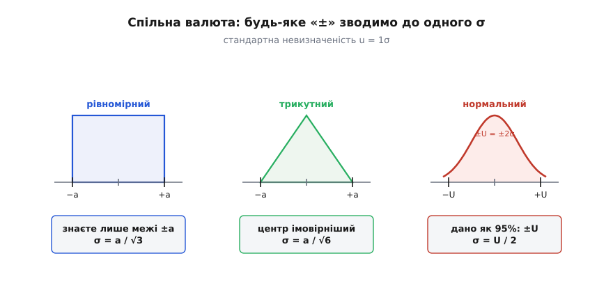
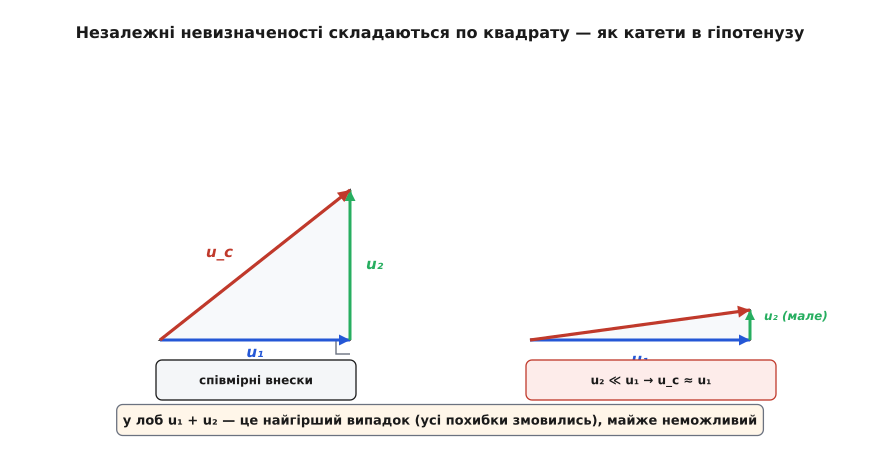

# Бюджет невизначеності: скільки насправді довіряти виміряному числу

<preknowlist>
- [Середнє й дисперсія](book:math/mean-variance) — стандартне відхилення σ як міра розкиду значень; саме в цій «валюті» вимірюють невизначеність.
- [Похідна](book:math/derivative) — швидкість зміни величини; коефіцієнт чутливості в бюджеті виявиться похідною моделі за входом.
- [Нормальний розподіл](book:math/normal-distribution) — дзвоноподібна крива; смуга ±2σ накриває близько 95% значень, звідси береться коефіцієнт охоплення.
</preknowlist>

Ви зміряли прискорення вільного падіння маятником і отримали g = 9.79 м/с². Гарний це результат чи ні? Відповісти неможливо — бракує половини числа. Якщо ваш вимір насправді 9.79 ± 0.50, то це майже нічого не сказало: справжнє g могло бути й 9.4, і 10.2. А якщо 9.79 ± 0.02, то ви щойно спіймали табличне 9.81 з чудовою точністю й маєте право цим пишатися. Ті самі три цифри — 9.79 — означають протилежні речі залежно від того, наскільки широка невидима смуга навколо них.

Отже, чесний результат вимірювання — це не точка, а **інтервал**: середина плюс-мінус піврозмаху. І вся ця тема — про те, звідки береться той піврозмах і як його чесно порахувати, коли на результат впливає не одне, а десяток різних джерел розкиду. Систематичний облік усіх цих джерел і зветься **бюджетом невизначеності** (від фр. *budget* — кошторис, розпис доходів і витрат): як у грошовому кошторисі, ви виписуєте кожну статтю окремо, зводите їх разом і одразу бачите, котра з'їдає найбільше.

### Невизначеність — це не похибка

Спершу розчистимо два поняття, які постійно плутають. **Похибка** (англ. *error*) — це різниця між вашим результатом і справжнім значенням. Штука в тому, що справжнього значення ви не знаєте (інакше навіщо було міряти), тож і похибку знати не можете. А якби знали — просто відняли б її, і по всьому. Похибка — конкретне, але приховане число.

**Невизначеність** (англ. *uncertainty*) — зовсім інша річ. Це ваша чесна, виражена числом оцінка того, наскільки широко може лежати справжнє значення. Не помилка, якої ви припустилися, а **ширина вашого незнання**. Ви не кажете «я схибив на стільки-то» — ви кажете «справжнє значення майже напевно десь у цій смузі завширшки стільки-то». Різницю між точністю й похибкою докладніше розбирає [окрема замітка](book:math/accuracy); нам зараз досить того, що бюджет рахує саме невизначеність — бо тільки її й можна чесно порахувати наперед, ще не знаючи істини.

### Розкид приходить струмочками, а не рікою

Звідки взагалі береться та смуга? Майже ніколи не з одного великого промаху — зазвичай з юрби дрібних. Міряючи період маятника секундоміром, ви трохи спізнюєтеся натиснути кнопку на старті й на фініші. Прикладаючи лінійку, не влучаєте точно в центр важка. Температура повільно повзе й трохи міняє довжину нитки. Кожне джерело саме по собі мале, але разом вони й розмивають результат.

Щоб дати раду цій юрбі, кожне джерело треба спершу **виміряти окремо** — приписати йому число. Метрологи розрізняють два способи це зробити, і назвали їх гранично буденно:

- **Тип A** — ви оцінюєте розкид **статистично**, за власними повторами. Зміряли період десять разів, побачили, як значення стрибають, порахували, наскільки. Розкид тут видно на очі.
- **Тип B** — повторів нема або вони не показали б цього джерела, тож ви міркуєте **з іншого знання**: у паспорті приладу написано ±0.1, поділки лінійки йдуть через міліметр, у сертифікаті калібрування стоїть така-то цифра.

Уся різниця між A і B — лише в тому, звідки ви взяли число: зі своїх повторів (A) чи звідусіль інде (B). На виході обидва дають однакову за змістом величину, і саме тому їх можна класти в одну таблицю.

### Спільна валюта — стандартна невизначеність

Секундомір міряє час, лінійка — довжину, паспорт дає відсотки. Складати їх напряму — однаково що додавати гривні до кілограмів. Тому кожне джерело зводять до **однієї спільної валюти** — стандартної невизначеності `u`, а це просто одне стандартне відхилення (1σ) того розкиду, який джерело вносить.

Для типу A все прямо: якщо `n` повторів дали розкид зі стандартним відхиленням `s`, то невизначеність їхнього середнього — це `u = s / √n`. Корінь із `n` тут не випадковий: усереднення притлумлює випадковий розкид саме в `√n` разів, і що більше повторів, то певніше середнє ([чому саме корінь](book:math/averaging)).

Для типу B треба перевести чуже «±» у своє σ, і тут усе залежить від того, що саме означає те «плюс-мінус»:

```
рівномірний розподіл (знаєте лише межі ±a):    u = a / √3
трикутний (межі ±a, найімовірніше в центрі):   u = a / √6
дано вже як 95%-й інтервал ±U:                  u = U / 2
```


*Стандартна невизначеність — це завжди одне σ. Коли паспорт дає лише межі ±a і жодного натяку, де всередині лежить істина, це рівномірний розподіл, і його σ = a/√3. Коли центр імовірніший — трикутний, σ = a/√6. Коли ж число вже подане як 95-відсотковий інтервал, його просто ділять на коефіцієнт охоплення.*

Найчастіший із цих переходів — рівномірний `a/√3`. Кожна паспортна допустима межа, кожен крок квантування АЦП, кожна «остання цифра» приладу — усе це рівномірні `a`, які діляться на корінь із трьох.

> 🔧 **Навіщо це.** Без переведення у спільну валюту бюджет просто не складеться: не можна порівняти, що більше шкодить результату — 1 мм лінійки чи 0.2 с секундоміра, поки обидва не стали одним стандартним відхиленням у метрах і секундах. `a/√3` — це той робочий рух, який метролог повторює десятки разів на день, зводячи паспортні допуски до σ.

### Складання: чому по квадрату, а не в лоб

Тепер найголовніше — і найменш очевидне. Маємо кілька стандартних невизначеностей `u₁, u₂, …`. Як із них дістати одну спільну `u_c`?

Спокуса — скласти в лоб: `u₁ + u₂ + …`. Але це буде **найгірший можливий випадок** — той, у якому всі джерела змовилися й схибили в один бік одночасно. Для незалежних джерел таке майже неможливе: коли секундомір цього разу спізнився, лінійка з тим самим успіхом могла влучити точно або й промахнутися в інший бік. Незалежні відхилення **частково гасять одне одного**, тож проста сума систематично перебільшує розкид.

Правильне складання — **корінь із суми квадратів**:

```
u_c = √(u₁² + u₂² + … )
```

Це та сама математика, що й теорема Піфагора: спільна невизначеність — це гіпотенуза, а окремі — катети. І та сама, що в випадковому блуканні, де відстань росте як `√N`, а не як `N`, бо кроки навмання почасти скорочують одне одного. Що більше незалежних доданків, то ближча їхня спільна дія до дзвоноподібного [нормального розподілу](book:math/central-limit) — і тим краще працює квадратне складання.


*Ліворуч — два співмірні внески: спільна невизначеність — гіпотенуза прямокутного трикутника. Праворуч — коли другий внесок набагато менший, гіпотенуза майже лягає на довгий катет. Тому дрібні джерела в квадратному складанні майже не рахуються: у сумі 4² + 1² одиниця додає лише 3% до кореня.*

Оця остання властивість — половина всієї користі бюджету. У квадратному складанні **дрібні внески майже зникають**. Якщо `u₁ = 4`, а `u₂ = 1`, то `u_c = √17 ≈ 4.12` — одиниця майже нічого не додала. Тож поки одне джерело переважає, поратися з дрібними — марно витрачений час.

### Через формулу: коефіцієнти чутливості

Досі ми мовчки припускали, що всі невизначеності вже виражені в одиницях кінцевого результату. Насправді ж бо ви рідко міряєте потрібну величину прямо — частіше **рахуєте її з інших** за якоюсь формулою. Прискорення `g` ви не міряєте безпосередньо: ви міряєте довжину `L` і період `T`, а тоді обчислюєте `g = 4π²L/T²`.

І тут дрож входу не переходить у дрож результату один-до-одного. Якщо `T` хитнеться на трохи, то `g` хитнеться на **стільки ж, помножене на те, наскільки круто `g` залежить від `T`** — тобто на похідну `∂g/∂T`. Ця похідна й зветься **коефіцієнтом чутливості** `c`: вона переводить дрож входу в дрож виходу. [Похідна](book:math/derivative) тут — саме той підсилювач, що каже, у скільки разів мале коливання входу відгукнеться на виході.

Отже, внесок кожного входу — це `c_i · u(x_i)`, і вже ці внески складаються по квадрату:

```
u_c(y) = √( (c₁·u₁)² + (c₂·u₂)² + … ),   де  c_i = ∂f/∂x_i
```

Для формул-добутків і степенів є зручний спрощений вид: там у квадрат складаються **відносні** невизначеності, зважені на показники степенів. Оскільки `g ∝ L·T⁻²`, показник при `L` дорівнює 1, а при `T` дорівнює −2, тож

```
u_c(g) / g = √( (u_L/L)² + (2·u_T/T)² )
```

Двійка при `T` — не описка: `g` залежить від `T` у квадраті, тому будь-яке відносне хитання періоду б'є по `g` удвічі сильніше. Звідки взагалі береться формула з похідними й що робити, коли входи не незалежні, а зв'язані, показує [повне виведення закону поширення невизначеності](book:physics/uncertainty-budget/math-propagation.md).

### Бюджет — це буквально таблиця

Тепер зберімо все докупи, і назва «бюджет» виправдає себе дослівно. Ви виписуєте таблицю, **рядок на кожне джерело**, і в ній стовпці: значення, як оцінювали (тип A чи B, який розподіл), стандартна невизначеність `u`, коефіцієнт чутливості `c`, внесок `|c·u|` і його квадрат. Знизу — сума квадратів і корінь із неї, спільна `u_c`.

Кошторис на те й кошторис: усе видно рядок за рядком. Одразу впадає в око, **котрий рядок переважає** — на нього йде левова частка спільної невизначеності, а решта, за логікою квадратного складання, майже не рахується. Це і є головна відповідь, по яку до бюджету звертаються інженери: не просто «наскільки точний результат», а «**що саме** його псує й куди варто вкласти зусилля».

### Розширена невизначеність і коефіцієнт охоплення

Спільна `u_c` — це одне σ, а одне σ накриває лише близько 68% імовірної смуги. Для заяви, на яку хтось спиратиметься, цього замало: хочеться сказати «майже напевно» — тобто десь 95%. Тому `u_c` домножують на **коефіцієнт охоплення** `k` і дістають **розширену невизначеність**:

```
U = k · u_c
```

Найпоширеніше `k = 2`, що для дзвоноподібного розподілу дає якраз ті ≈95%. І результат подають у повній, чесній формі: `y = (значення ± U)`, обов'язково зазначивши `k`. Чому `k = 2` працює, навіть коли окремі входи були зовсім не дзвоноподібні (рівномірні паспортні допуски, приміром)? Бо їхня спільна дія сама тягнеться до нормального розподілу — а в нього смуга ±2σ якраз і накриває 95%. Саме на цій логіці збудований міжнародний довідник, яким сьогодні користуються всі метрологічні лабораторії світу; [як спільнота дійшла до цієї спільної мови](book:physics/uncertainty-budget/hist-gum.md) — окрема повчальна історія.

### Порахуймо: g маятником, рядок за рядком

Абстракція оживає в числах. Зберемо справжній бюджет для нашого маятника й побачимо, як він одразу вкаже на винуватця.

**Задача.** Маятник завдовжки L = 0.9500 м, зміряний рулеткою з поділками через 1 мм. Час 50 повних коливань зміряли секундоміром кілька разів; середнє вийшло 97.77 с. Знайти g і його невизначеність.

Довжину оцінюємо за **типом B**: усе, що ми знаємо, — межі ±1 мм, отже рівномірний розподіл, `u(L) = 1 мм / √3 ≈ 0.6 мм`. Час — за **типом A**: розкид повторів дав стандартне відхилення середнього `u(t₅₀) = 0.25 с`. Один бюджет — і обидва типи в ньому.

```python
import math

# --- входи та їхні стандартні невизначеності (спільна валюта — σ) ---
L     = 0.9500      # довжина маятника, м
u_L   = 0.0006      # тип B: рулетка, ±1 мм рівномірно → 1мм/√3 ≈ 0.6 мм
t50   = 97.77       # час 50 коливань, с (середнє з повторів)
u_t50 = 0.25        # тип A: стандартне відхилення середнього, с

T   = t50 / 50            # період одного коливання
u_T = u_t50 / 50          # невизначеність періоду ділиться так само

g = 4 * math.pi**2 * L / T**2      # модель:  g = 4π²L / T²

# --- коефіцієнти чутливості: наскільки g реагує на кожен вхід ---
c_L = g / L               # ∂g/∂L = 4π²/T²  = g/L
c_T = -2 * g / T          # ∂g/∂T = −8π²L/T³ = −2g/T

# --- внесок кожного входу в невизначеність g (у м/с²) ---
contrib_L = abs(c_L) * u_L
contrib_T = abs(c_T) * u_T

# --- незалежні джерела складаємо по квадрату ---
u_g = math.hypot(contrib_L, contrib_T)      # √(внесок_L² + внесок_T²)

# --- розширена невизначеність, коефіцієнт охоплення k = 2 ---
U = 2 * u_g

print(f"g   = {g:.3f} м/с²")
print(f"внесок L = {contrib_L:.4f} м/с²  ({contrib_L**2/u_g**2:.1%} дисперсії)")
print(f"внесок T = {contrib_T:.4f} м/с²  ({contrib_T**2/u_g**2:.1%} дисперсії)")
print(f"u(g) = {u_g:.4f} м/с²  →  U = {U:.2f} м/с² (k = 2)")
```

Програма виписує весь кошторис:

```
g   = 9.809 м/с²
внесок L = 0.0062 м/с²  (1.5% дисперсії)
внесок T = 0.0502 м/с²  (98.5% дисперсії)
u(g) = 0.0505 м/с²  →  U = 0.10 м/с² (k = 2)
```

Остаточно: **g = (9.81 ± 0.10) м/с²** при `k = 2`, тобто з охопленням близько 95%. Табличне 9.81 сидить рівнісінько всередині смуги — вимір із ним не суперечить, апаратура справна.

Але найцінніше — не саме число, а розклад під ним. **98.5% усієї дисперсії — це час**, і лише 1.5% — довжина. Бюджет тицьнув пальцем: винен секундомір.

### Куди витрачати зусилля

Оцей вказівний палець — і є та причина, заради якої бюджет узагалі складають. Уявіть, що результат вас не влаштовує й треба вдвічі звузити смугу. Спокуса — купити дорогу лазерну рулетку й міряти довжину до сотих міліметра. Але бюджет каже: марно. Довжина вносить лише 1.5% дисперсії; навіть якби ви зробили її ідеальною, спільна невизначеність упала б із 0.0505 до 0.0502 — практично нікуди, бо квадратне складання давно поглинуло цей дрібний внесок.

А от помножити число коливань удвічі (зміряти час не за 50, а за 100 періодів) — і невизначеність періоду поділиться навпіл, разом із нею впаде головний внесок, і спільна `u_c` майже вдвічі зменшиться. Те саме зусилля, вкладене за підказкою бюджету, а не наосліп, дає результат — тоді як гроші за лазерну рулетку пропали б дарма.

> 🔧 **Навіщо це.** У серйозній розробці бюджет невизначеності — це, по суті, кошторис не лише розкиду, а й **грошей та праці**. Він не дає «золотити» те, що й так не рахується, і показує єдину статтю, з якої почнеться справжнє покращення. Той самий облік стоїть за паспортною точністю кожного вимірювального приладу, за допуском на деталь у кресленні й за рішенням, минув виріб контроль чи ні. Коли треба не разово порахувати, а автоматично проганяти складну нелінійну модель, лінійних коефіцієнтів чутливості вже замало — тоді невизначеність [оцінюють методом Монте-Карло](book:physics/uncertainty-budget/proj-monte-carlo.md), розкидаючи входи за їхніми розподілами й дивлячись на розкид виходу.

Отак три однакові цифри 9.79 з початку розмови перетворюються на чесне (9.81 ± 0.10): не точка, а інтервал; не голослівне «я зміряв», а «зміряв ось настільки певно, і ось що цю певність обмежує». Число без своєї невизначеності — це половина числа; бюджет дописує другу половину й заразом каже, як її звузити.
