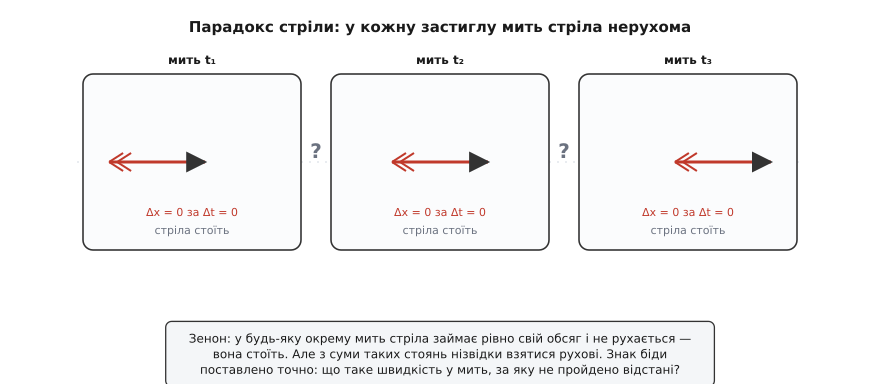
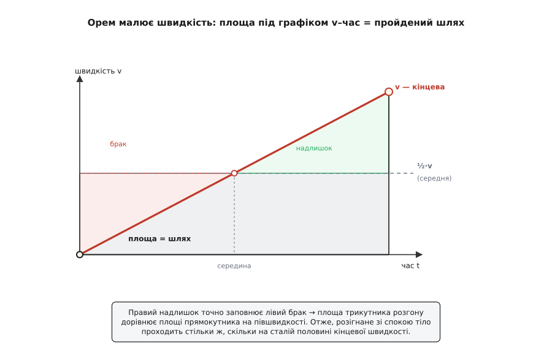

# 📜 Швидкість однієї миті: дві тисячі років, щоб спіймати «зараз»

Спитати, як швидко тіло рухалося **в середньому**, легко: подивися, наскільки воно перемістилося, і поділи на час. А спитай, як швидко воно рухається **саме цієї миті** — і під ногами роззявляється прірва. Бо швидкість — це відстань, поділена на час; а «мить» тривалості не має, за неї тіло не проходить жодної відстані. Виходить нуль, поділений на нуль, — вираз, що не означає нічого. Спідометр спокійно показує число, але спитай суворо, що́ це число таке, — і виявиться, що впродовж двох тисяч років ніхто не міг сказати до пуття. Це історія про те, як людство вчилося говорити про швидкість у застиглу мить — і як заразом намацало половину математичного аналізу.

## Зенон: стріла, що стоїть у кожну мить

Першим цю прірву показав пальцем грек Зенон Елейський (Ζήνων ὁ Ἐλεάτης, бл. 490 — бл. 430 до н.е.), родом з Елеї — грецької колонії на півдні Італії. Він не збирався засновувати кінематику; навпаки, він доводив, що руху **взагалі немає**, що це омана чуттів. Його вчитель Парменід (Παρμενίδης) навчав, що справжнє буття — єдине, незмінне й нерухоме, а всяка зміна нам просто ввижається. Зенон брався захистити цю дику на позір тезу, показавши, що варто повірити в рух — і потрапиш у безвихідь. Свої загадки він викував як зброю, а вийшли з них питання, від яких фізика не могла спекатися ще дві тисячі років.

Найгостріша — про **стрілу в польоті**. Візьми будь-яку окрему мить — застигни її, наче кадр. У цю мить летюча стріла займає рівно свій обсяг простору, ані на волосину більше, і нікуди не зсувається: вона нерухома, як на фотографії. Але ж мить — це те, з чого складається весь час; у кожну мить стріла стоїть; а з суми застиглих нерухомостей нізвідки взятися рухові. Отже, укладав Зенон, політ неможливий, і те, що ти нібито бачиш, — не рух, а низка стоянь. Друга загадка — про **Ахілла й черепаху**: прудконогий Ахілл (Ἀχιλλεύς) ніколи не наздожене повільну черепаху, якщо та стартувала попереду, бо доки він добіжить туди, де вона була, вона встигне відповзти трохи далі, і так без кінця — між ними завжди лишається проміжок. (Черепаха, до речі, — прикраса пізніших переказувачів: сам Аристотель, через якого ці парадокси до нас і дійшли, писав нейтральніше — про «найпрудкішого» й «найповільнішого».)


*Зенонова стріла у трьох застиглих митях. У кожному кадрі окремо стріла нерухома: за нульову мить вона проходить нульовий шлях. Звідки ж береться політ, якщо в кожній миті — стояння? Парадокс не заперечує руху насправді, а гостро питає: що таке швидкість у мить, за яку не пройдено відстані?*

Обидві загадки б'ють в одну точку — у нескінченну подільність. Рух, розсічений на скільки завгодно дрібні шматочки — миті чи відрізки, — розсипається в руках і зникає. І хоч висновок Зенона хибний (стріла таки летить, Ахілл таки наздоганяє), сам він поставив питання бездоганно: **що ж діється зі стрілою в одну-єдину мить, коли за цю мить вона не проходить жодної відстані?** Сказати «її швидкість — нуль» безглуздо, бо тоді нуль у кожну мить, а сума нулів дала б спокій, не політ. Правильної відповіді Зенон не знав і знати не міг — для неї бракувало самого поняття, до якого людство доростало ще дві тисячі років. Але знак біди він поставив точно там, де вона й ховалася.

## Оксфордські калькулятори: швидкість, яку можна порахувати

Наступний крок зробили аж у XIV столітті, і зробили його англійці. У Мертон-коледжі Оксфорда в 1320–1350-х роках зібрався гурток учених, яких згодом прозвали **калькуляторами** (лат. *calculatores* — «обчислювачі»): Томас Брадвардін (Thomas Bradwardine, бл. 1300–1349), Вільям Гейтсбері (William Heytesbury, бл. 1313 — бл. 1372), Річард Свайнсгед (Richard Swineshead, діяв бл. 1340–1354, якого так і звали — *Calculator*) і Джон Дамблтон (John Dumbleton, бл. 1310 — бл. 1349). Прізвисько влучне: їхня нова, зухвала думка полягала в тому, що якості й рухи — не просто «сильніші» чи «слабші» на око, а **величини, які можна виміряти й з якими можна рахувати**. Швидкість дістала кількість, «широту» (лат. *latitudo*), що її можна порівнювати, як довжину.

Розкладаючи рух на види, вони назвали три: **рівномірний** (рівні відрізки за рівний час), **рівномірно нерівномірний** (швидкість наростає рівними приростами за рівний час — це те, що ми звемо рівноприскореним рухом) і **нерівномірно нерівномірний** (усе інше). І тут Гейтсбері вперше глянув просто в очі Зеноновій прірві. Як означити швидкість у мить, коли за мить нічого не проходиться? Його розв'язок хитрий: міряти цю швидкість не тим (нульовим) шляхом, що тіло справді проходить за (нульову) мить, а тим шляхом, який воно **пройшло б**, якби від цієї миті рушило рівномірно й пронесло цей самий свій ступінь швидкості крізь цілу одиницю часу. Швидкість миті визначається через «а що було б, якби»: заморозь її й дай тілу так рухатися — оце й буде міра. Прірву 0/0 обходять, вимінявши нездоланну мить на уявний рівний рух (таке прочитання Гейтсбері усталене в історії науки — за Маршаллом Клеґеттом).

А ще вони довели **теорему про середню швидкість**, вона ж «Мертонське правило». Ось вона: тіло, що рівномірно розганяється зі спокою, за даний час проходить рівно стільки, скільки пройшло б за сталої швидкості, яка дорівнює **половині його кінцевої** — тобто тій швидкості, що є в нього посередині проміжку. Уперше ясно сформулював її Гейтсбері у праці «Regulae solvendi sophismata» (Правила розв'язування софізмів, 1335). Доведення калькуляторів були геть словесні й арифметичні — сторінки міркувань без жодного малюнка. Величезний поступ — рахувати те, що доти лише споглядали, — але саме поняття миттєвої швидкості лишалося прив'язане до окремих випадків та до Гейтсберієвого «якби».

## Орем малює швидкість

По той бік Ла-Маншу, у Парижі, ту саму теорему взяли зовсім інакше — не рахунком, а оком. Ніколь Орем (Nicole Oresme, бл. 1320–1382) — француз, народжений у Нормандії поблизу Кана, вихованець і викладач Паризького університету, згодом єпископ Лізьє й радник короля Карла V. У трактаті «De configurationibus qualitatum et motuum» (Про конфігурації якостей і рухів, близько середини XIV ст.) він зробив річ, на позір просту, а насправді переломну: він **намалював швидкість**.

Проведи горизонтальну лінію — це час. У кожній її точці постав вертикальний відрізок, заввишки рівно стільки, яка швидкість у цю мить. Для рівноприскореного руху зі спокою верхівки цих відрізків лягають на **пряму лінію**, що піднімається від нуля, — виходить прямокутний трикутник. І тут Орем робить стрибок, вартий усієї історії: **площа** цієї фігури дорівнює пройденому шляху. Чому площа? Бо тонка вертикальна смужка завширшки Δt і заввишки v — це v·Δt, крихітний відрізок шляху; а весь шлях — це сума всіх таких смужок, тобто площа під лінією. Сума нескінченної безлічі смужок під кривою і є **інтегрування** ([площа під кривою як міра накопиченого](book:math/integral) — саме цю ідею Орем тут і намацав) — за три століття до того, як Декарт із Ферма дали координати, і до того, як народився аналіз.

Тепер Мертонська теорема випадає з малюнка сама, без жодної алгебри. Трикутник під лінією швидкості має ту саму площу, що й прямокутник, чия висота — на середині (половина кінцевої швидкості): відітни верхній трикутничок праворуч — і він рівно затулить виїмку ліворуч. Рівні площі означають рівні шляхи: розігнане тіло долає ту саму відстань, що й тіло, яке весь час іде на півшвидкості. Незриме стало зримим; те, на що калькуляторам ішли сторінки слів, тепер видно з одного погляду на трикутник.


*Доведення Орема без жодної формули. Площа під лінією швидкості — це пройдений шлях (рання інтеграція). Трикутник розгону дорівнює за площею прямокутнику, чия висота — половина кінцевої швидкості: правий надлишок точно заповнює лівий брак. Звідси Мертонське правило — розігнане зі спокою тіло проходить стільки ж, скільки на сталій півшвидкості.*

Варто чесно розвести дві школи, бо їх часто плутають. Мертонські калькулятори — **англійці** з Оксфорда, які довели теорему рахунком; Орем — **француз** із Парижа, який дав їй геометричне доведення й заразом перший крок до інтегрування. Різні країни, різні університети, різні знаряддя — а тема одна.

## Ґалілей: коли теорема впала на землю

Ще майже три століття теорема лишалася вправою для схоластів — гарною, але про абстрактний «рівномірно нерівномірний рух», не про щось конкретне в природі. Приземлив її італієць Ґалілео Ґалілей (Galileo Galilei, 1564–1642), народжений у Пізі, тосканець. У «Discorsi e dimostrazioni matematiche intorno a due nuove scienze» (Бесіди й математичні доведення щодо двох нових наук, 1638, надрукованих у Лейдені, бо в Італії засудженому Церквою Ґалілеєві друкуватися вже не давали) теорема про середню швидкість стоїть найпершою серед тверджень про природно прискорений рух. Але Ґалілей зробив те, чого не зробили середньовічні: він указав **справжній фізичний рух**, який і є рівноприскореним, — [вільне падіння](book:physics/free-fall). Тіло, що падає, набирає рівні прирости швидкості за рівні проміжки часу (v зростає пропорційно t). Підстав це в Мертонське правило — і дістанеш славетний закон: шлях росте як **квадрат** часу (s пропорційне t²).

```
рівноприскорене падіння:   v = g·t              (швидкість пропорційна часу)
за теоремою середньої швидкості:
   середня швидкість = ½·(кінцева) = ½·g·t
   шлях = середня · час = ½·g·t · t = ½·g·t²     (шлях — як квадрат часу)
```

Абстракція обернулася на закон природи, який можна перевірити, — і Ґалілей перевірив: щоб уповільнити падіння настільки, аби встигати його виміряти, він пускав кульки котитися похилою площиною й міряв, які відстані вони долають за рівні проміжки часу. Виходило 1 : 4 : 9 : 16 — квадрати цілих чисел, рівно як велить s ~ t². Уперше кінематичну теорему приклали до дійсного, вимірного руху — і вона витримала.

А чи знав Ґалілей, що спирається на Мертон і Орема? Тут чесна відповідь — **спірно**. Французький фізик П'єр Дюем на початку XX ст. відстоював «тезу неперервності»: мовляв, від схоластів XIV ст. до Ґалілея тягнеться нерозірвана нитка, тим паче що праці калькуляторів друкували в Італії XVI ст. і думки ці носилися в повітрі. Інші історики заперечують: Ґалілей значною мірою перевідкрив кінематику самотужки, а його вирішальний внесок — саме прив'язка до реального, поміряного руху — то якраз те, чого середньовічним бракувало. Розсудити начисто важко. Що безсумнівно: **сама теорема про середню швидкість — середньовічна, англо-французька, старша за Ґалілея на добрих три століття**; а от успадкував він її чи здобув наново — питання відкрите. І безсумнівно інше: перетворив абстрактне правило на закон падіння тіл саме Ґалілей.

## Ньютон і Ляйбніц: мить нарешті дістає число

І все ж крізь усю цю дорогу «швидкість у мить» лишалася або прив'язана до окремих випадків (рівномірний, рівноприскорений рух), або підпертою Гейтсберієвим «якби». Загальну відповідь — точну миттєву швидкість для **будь-якого** руху, хоч найхимернішого, — дав математичний аналіз, і дали його незалежно двоє.

Ісаак Ньютон (Isaac Newton, 1642/43–1727), англієць із Вулсторпа, у свої «дивовижні роки» 1665–1666 розробив **метод флюксій**. Уяви величину як «флюенту» (лат. *fluens* — «те, що тече»), що плине з часом; тоді її миттєва швидкість зміни — це «флюксія». Флюксія положення і є миттєва швидкість — для будь-якого руху, не лише рівномірного. Зенонова застигла стріла нарешті дістала своє число: не безглузде 0/0, а ту границю, до якої тиснеться відношення Δx/Δt, коли проміжок Δt стягується до нуля.

Ґотфрід Вільгельм Ляйбніц (Gottfried Wilhelm Leibniz, 1646–1716), німець із Лейпцига, незалежно, близько 1675 року, побудував диференціальне числення з позначеннями, якими ми користуємося й досі: dx — нескінченно малий приріст положення, dt — часу, а миттєва швидкість — їхнє відношення dx/dt. Надрукував він своє першим, 1684 року (у лейпцизькому «Acta Eruditorum»); повніший виклад Ньютона чекав «Начал» (1687) і пізніших праць. Оця нестиковка — Ньютон перший відкрив, Ляйбніц перший надрукував — і роздмухала один із найпотворніших спорів про першість в історії науки: англійські математики проти континентальних, отрута на ціле століття. Нинішній присуд усталений: винайшли вони аналіз **незалежно** — Ньютон геометрично-кінематично (флюксії), Ляйбніц алгебраїчно-символьно (диференціали), — і слава належить обом.

Одне чесне застереження. Навіть Ньютон і Ляйбніц спиралися на «нескінченно малі», від яких у суворих математиків нило під серцем (єпископ Джордж Берклі глузливо назвав їх «привидами спочилих величин»). Цілком строге означення — миттєва швидкість як **границя** відношення Δx/Δt, де й саму границю визначено бездоганно, — прийшло аж у XIX ст., з Коші й Ваєрштрасом. [Похідна](book:math/derivative) в тому вигляді, як її вчать нині, — їхній дарунок; але думка, яку вона вловлює, — Ньютонова й Ляйбніцова.

## Хто ж зловив мить

Тепер видно всю дорогу — і те, що жодна пара рук не пройшла її сама.

```
Хто який шар поклав
  Зенон (V ст. до н.е.)        парадокс: що таке рух у застиглу мить?        грек
  Мертонські калькулятори      швидкість як обчислювана величина;            англійці
    (~1330-ті)                 «швидкість миті» через «якби»; теорема
                               про середню швидкість
  Орем (~сер. XIV ст.)         графік v–час; шлях = площа під лінією         француз
                               (перший крок інтегрування)
  Ґалілей (1638)               теорема стає законом падіння (s ~ t²)         італієць
  Ньютон (1665–66) /           миттєва швидкість = похідна dx/dt             англієць /
    Ляйбніц (~1675)            для будь-якого руху                           німець
```

Зенон-грек поставив знак біди — сформулював, що рух у застиглу мить незбагненний, хоч і зробив із цього хибний висновок про неможливість руху. Мертонські калькулятори-англійці перетворили швидкість на величину, з якою можна рахувати, і першими означили «швидкість миті» — хай через хитре «якби» — та довели правило середньої швидкості. Орем-француз намалював швидкість і, побачивши шлях як площу під графіком, ступив перший крок інтегрування. Ґалілей-італієць звів теорему з небес схоластики на землю, прив'язавши її до вимірного падіння тіл. А загальне, остаточне поняття — миттєва швидкість як похідна для будь-якого руху — дали англієць Ньютон і німець Ляйбніц, кожен своїм шляхом.

Естафета через дві тисячі років і півконтиненту — і найдовше дозрівала не формула, а розуміння, що «швидкість цієї миті» потребує **нового поняття** — границі, — а не спритнішого ділення. Те скромне число, що його спокійно показує стрілка спідометра, — тихий кінець дуже довгої суперечки.
