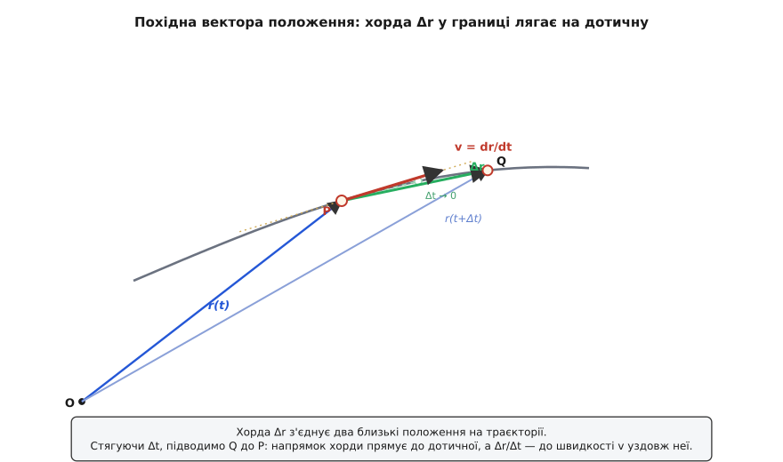
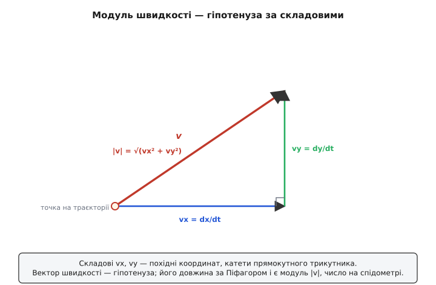
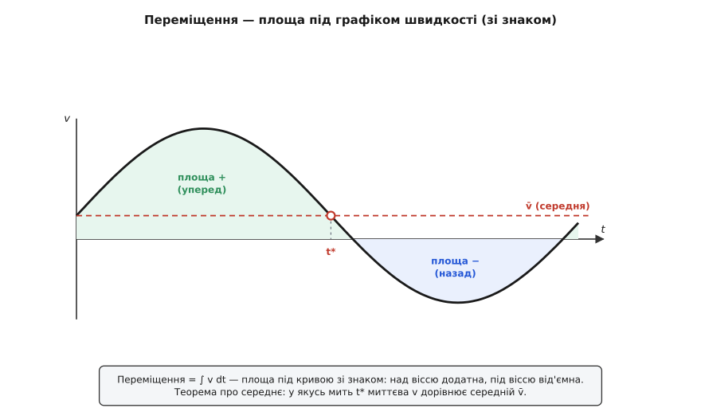

# 🧮 Швидкість як похідна вектора: складові, модуль, дотична

Швидкість — це темп, з яким змінюється положення. Для розмови цього досить, але щоб із нею **рахувати** — брати похідні, розкладати на осі, шукати зворотний шлях від швидкості до пройденого, — потрібне строге означення. І тримається воно на одному слові: **похідна**. Тільки похідна не звичайна, від числа до числа, а від **вектора**. Розберімо цей апарат до дна: що означає продиференціювати вектор положення, чому результат розпадається на прості похідні по осях, звідки береться число-модуль на спідометрі й чому стрілка швидкості завжди лягає по дотичній. А тоді пройдемо той самий шлях **назад** — від швидкості до переміщення — і побачимо, як інтеграл і теорема про середнє склеюють миттєве із середнім в одне ціле.

## Найпростіший випадок: одна вісь і знак

Почнімо з руху по прямій, бо там уся ідея вміщається в одне число. Нехай тіло рухається вздовж осі, і його положення — це координата x(t), одне число, що міняється з часом. Тоді швидкість — це [похідна](topic:math/derivative) координати за часом: границя відношення приросту координати до приросту часу, коли проміжок стягується до нуля.

```
v = dx/dt = границя (Δx / Δt),   коли Δt → 0
```

Одновимірний випадок уже несе в собі головне, що відрізняє швидкість від голого числа-темпу: **знак**. Похідна dx/dt буває додатна й від'ємна, і цей знак — не про «скільки», а про «куди». Додатна швидкість означає рух у бік зростання координати, від'ємна — у протилежний. Коли тіло на осі йде назад, воно рухається так само реально, як і вперед, — просто його dx/dt менша за нуль. Модуль |v| викидає знак і лишає саме число, «як швидко», — те, що показує спідометр. Отже, уже на прямій швидкість — це число зі знаком, а не просто число: крихітний, але справжній зародок вектора. Багатовимірний випадок лише розгортає цей знак у повноцінний напрямок.

## Вектор положення й похідна від нього

У площині чи в просторі положення однією координатою не задаси. Тут природний об'єкт — **вектор положення** r(t): стрілка від обраного початку відліку O до точки, де тіло зараз. Поки тіло рухається, вістря цієї стрілки повзе по траєкторії, малюючи її. У кожну мить r(t) — це «де я відносно O».

Тепер повторімо для вектора той самий хід, що й для координати. Візьмімо дві близькі миті — t і t + Δt — і два положення: P = r(t) та Q = r(t + Δt). Різниця цих двох стрілок — це вектор

```
Δr = r(t + Δt) − r(t)
```

маленька стрілка **переміщення** з P у Q. Вона тягнеться по хорді траєкторії, зрізаючи її дугу навпростець. Поділивши цю стрілку на проміжок часу Δt, дістаємо середню швидкість за проміжок — теж вектор, спрямований туди ж, куди й Δr (бо Δt — додатне число, воно міняє довжину стрілки, але не її напрямок). А стягуючи Δt до нуля, приходимо до миттєвої швидкості:

```
v(t) = границя (Δr / Δt) = dr/dt,   коли Δt → 0
```

Оце й є означення: швидкість — це похідна вектора положення за часом. Слово «похідна» тут те саме, що на прямій, лиш об'єкт під ним — вектор.


*Вектор положення r(t) тягнеться від початку відліку O до точки на траєкторії. За проміжок Δt вістря переходить з P у Q, а різниця стрілок Δr = r(t+Δt) − r(t) — це хорда, що зрізає дугу. Середня швидкість Δr/Δt дивиться вздовж хорди. Стягуючи Δt, підводимо Q до P: хорда повертається до дотичної, і в границі швидкість v = dr/dt лягає точно по дотичній, у бік руху.*

## Чому вектор розпадається на похідні по осях

Робити границю з цілим вектором незручно — хочеться звести все до звичних похідних від чисел. І це можливо, бо вектор можна розписати за [складовими](topic:math/vector-components) — його проєкціями на осі. У прямокутних координатах

```
r(t) = x(t)·x̂ + y(t)·ŷ + z(t)·ẑ
```

де x̂, ŷ, ẑ — одиничні стрілки уздовж осей, а x(t), y(t), z(t) — три числові функції часу. Ключова обставина: у нерухомій прямокутній системі **самі осі не рухаються** — стрілки x̂, ŷ, ẑ сталі, вони не залежать від часу. Тому в різниці Δr вони виносяться за дужки як звичайні множники-сталі, і кожна вісь живе своїм життям:

```
Δr/Δt = (Δx/Δt)·x̂ + (Δy/Δt)·ŷ + (Δz/Δt)·ẑ
```

Переходимо до границі — і кожне з трьох відношень стає своєю похідною:

```
v = (dx/dt)·x̂ + (dy/dt)·ŷ + (dz/dt)·ẑ

тобто    vx = dx/dt,    vy = dy/dt,    vz = dz/dt
```

Ось чому продиференціювати вектор — це продиференціювати кожну його складову окремо. Багатовимірний рух розпадається на кілька одновимірних, які нічого не знають один про одного: по кожній осі — своя незалежна швидкість зі своїм знаком. Саме на цій незалежності тримається весь розклад складних рухів — від польоту по параболі (горизонталь і вертикаль окремо) до навігації по компонентах.

> 🔧 **Навіщо це.** Розклад на осі — не математична забаганка, а те, як швидкість справді міряють і рахують машини. Інерційний блок дрона тримає три швидкості по трьох осях і диференціює кожну незалежно; GPS-приймач видає vx, vy, vz окремо; автопілот літака веде поздовжню й бічну складові різними контурами. Вектор швидкості майже ніколи не живе як єдине ціле — він живе трьома числами, кожне з яких похідна своєї координати.

Одне застереження, щоб не сприйняти правило ширше, ніж воно є. «Диференціюй кожну складову окремо» справджується **лише тому**, що осі сталі. Щойно перейдеш до системи, де самі напрямні стрілки крутяться, — до полярних координат чи до рами, що обертається, — базисні стрілки стають функціями часу, і за ними теж треба брати похідну. Тоді до простих dx/dt додаються нові доданки від обертання базису, і швидкість у полярних координатах уже не (ṙ, θ̇), а v = ṙ·r̂ + r·θ̇·θ̂, де другий доданок народжений саме тим, що напрямна r̂ повертається зі швидкістю [кутовою швидкістю](topic:physics/angular-velocity). Це не спростування правила, а межа його дії: похідну від базису теж доводиться враховувати, коли базис не стоїть на місці.

## Модуль швидкості: довжина стрілки як число на спідометрі

Вектор швидкості несе і напрямок, і величину. Величину — «як швидко» без «куди» — дає його довжина, [норма вектора](topic:math/vector-norm). А довжина стрілки за її складовими рахується за теоремою Піфагора, лиш у трьох вимірах:

```
|v| = √(vx² + vy² + vz²)
```

Це і є **швидкість-число** — те, що бачиш на спідометрі. Стрілка приладу байдужа до того, куди ти їдеш; вона показує лише довжину вектора швидкості. Той самий модуль зручно записати й через скалярний добуток вектора на себе, бо [скалярний добуток](topic:math/dot-product) вектора на себе — це квадрат його довжини:

```
|v| = √(v · v)
```

Чому саме довжина стрілки Δr, поділена на час, дає осмислене «як швидко»? Бо довжина хорди |Δr| між двома близькими точками траєкторії — це майже точно **довжина дуги** Δs, що тіло пройшло по кривій за той проміжок (хорда й дуга різняться лише на дрібницю вищого порядку, яка з наближенням точок зникає першою). Тому в границі

```
|v| = границя (|Δr| / Δt) = ds/dt
```

і це напрочуд глибокий факт: модуль швидкості — це похідна пройденого шляху за часом. Спідометр показує буквально ту саму величину, що й одометр, тільки одометр лічить накопичений шлях, а спідометр — швидкість, із якою той шлях намотується цієї миті. Одне — похідна другого.

**Пастка, у яку легко впасти.** Модуль швидкості |v| — це **не** те саме, що похідна від відстані до початку відліку, d|r|/dt. Перше — довжина похідної вектора, друге — похідна довжини вектора, і ці дві дії не переставляються. d|r|/dt каже лише, як швидко тіло **віддаляється від O** (радіальна швидкість); а |v| — уся швидкість, разом із рухом упоперек променя. Найяскравіше вони розходяться на колі: там відстань до центра стала, тож d|r|/dt = 0, а модуль швидкості аж ніяк не нуль — тіло мчить, просто не наближаючись і не віддаляючись від центра. Плутати «модуль похідної» з «похідною модуля» — класична й тиха помилка.


*Складові vx, vy — це похідні координат по осях, катети прямокутного трикутника. Сам вектор швидкості — гіпотенуза, і його довжина за Піфагором дорівнює √(vx²+vy²). Ця довжина й є модуль швидкості — «як швидко», те число, що на спідометрі; напрямок гіпотенузи — «куди».*

## Дотична — не домовленість, а наслідок означення

Тепер видно, чому вектор швидкості завжди спрямований **по дотичній** до траєкторії, і чому це не окреме правило, яке треба запам'ятати, а прямий висновок із означення. Різниця Δr — це хорда траєкторії між P і Q. Її напрямок — напрямок січної кривої. Підводимо Q до P (Δt → 0): січна повертається й у границі лягає на дотичну до кривої в точці P — це геометричний зміст похідної, той самий, що й нахил дотичної до графіка в одновимірному випадку, лише розгорнутий у площину. Ділення на додатний скаляр Δt тільки міняє довжину стрілки, ніколи не крутить її й не перевертає. Тому v = dr/dt показує рівно вздовж дотичної, у бік руху.

Довжина хорди |Δr| при цьому тане до нуля, але відношення |Δr|/Δt лишається скінченним — сходиться до модуля швидкості. Виходить тонка рівновага: і чисельник, і знаменник ідуть у нуль, а їхнє відношення — ні. Саме тому питання «яка швидкість цієї миті» має відповідь, хоч за одну застиглу мить тіло нікуди не зсувається: швидкість живе не в застиглому кадрі, а в тому, як положення міняється в його малому околі.

## Зворотний хід: переміщення як інтеграл швидкості

Якщо диференціювання положення дає швидкість, то накопичення швидкості мусить повертати положення. Це і є [інтеграл](topic:math/integral) — неперервне підсумовування. Розбий проміжок від t₁ до t₂ на безліч крихітних кроків Δt; за кожен крок тіло зсувається приблизно на v·Δt (швидкість за коротку мить майже стала). Склади всі ці зсуви — і в границі дрібних кроків сума стане інтегралом, а вийде повне переміщення:

```
Δr = r(t₂) − r(t₁) = ∫  v dt          (від t₁ до t₂)
```

Покомпонентно це три окремі накопичення, по одному на вісь — Δx = ∫vx dt і так далі. А геометрично інтеграл швидкості — це **площа під графіком** v(t). Похідна й інтеграл тут — дві половини одного зв'язку (основна теорема аналізу, теорема Ньютона–Ляйбніца): положення є первісною швидкості, тож означений інтеграл швидкості дорівнює приросту положення. Диференціювання розбирає положення на швидкість; інтегрування збирає його назад.

Тут вилазить та сама відмінність, що й між шляхом і переміщенням, лише тепер строго. У одновимірному русі площа під графіком **зі знаком**: ділянки, де v > 0, додають до переміщення, а де v < 0 — віднімають (тіло йде назад). Тому

```
переміщення (зі знаком) = ∫ v dt       — може вийти й нуль
пройдений шлях          = ∫ |v| dt      — завжди додатний, це показ одометра
```

На замкненому маршруті, де тіло вертається у старт, додатні й від'ємні площі гасяться, і перший інтеграл дає рівно нуль, тимчасом як другий — усю намотану довжину. Ось чому переміщення за коло — нуль, а шлях — ні: одне інтегрує швидкість зі знаком, друге — її модуль.


*Переміщення дорівнює площі під графіком швидкості, узятій зі знаком: над віссю площа додатна (рух уперед), під віссю — від'ємна (рух назад), і в переміщення входить їхня різниця. Горизонтальна лінія на рівні середньої швидкості v̄ окреслює прямокутник тієї самої площі, що й уся фігура під кривою. Теорема про середнє гарантує: знайдеться хоч одна мить t*, де миттєва швидкість дорівнює цій середній — там крива перетинає лінію v̄.*

## Середня й миттєва: теорема про середнє

Лишилося зв'язати два «середніх», що весь час плутають. Середня швидкість за проміжок — це переміщення, поділене на час. Але переміщення ми щойно виразили через інтеграл, тож

```
середня v = Δr / (t₂ − t₁) = ( 1 / (t₂ − t₁) ) · ∫ v dt
```

Праворуч стоїть не що інше, як **середнє значення** функції v на проміжку — інтеграл, поділений на довжину проміжку. Отже, два означення середньої швидкості — «переміщення за час» і «усереднене миттєве значення» — це одне й те саме твердження, а не два різні; вони збігаються рівно тому, що переміщення є інтеграл швидкості. Це й розплутує стару двозначність: середня швидкість чесно дорівнює усередненню всіх миттєвих швидкостей за поїздку.

А чи буває, що миттєва швидкість **точно дорівнює** середній хоч у якусь мить? Так — це гарантує **теорема про середнє**. Для гладкого руху вздовж осі знайдеться принаймні одна мить t* всередині проміжку, де

```
v(t*) = ( x(t₂) − x(t₁) ) / (t₂ − t₁) = середня швидкість
```

Геометрично: десь на графіку x(t) дотична (миттєвий нахил) стає паралельною до січної, що з'єднує кінці (середній нахил). Фізично це той самий побутовий факт: якщо за поїздку ти проїхав у середньому 60 км/год, то була мить, коли спідометр показував рівно 60 — не менше й не більше. Не могло бути так, щоб увесь час швидкість трималася осторонь від свого середнього. Цю теорему за звичаєм звуть теоремою Лаґранжа, хоч перше строге доведення в загальному вигляді дав Оґюстен Коші аж 1823 року — десятиліття по смерті Лаґранжа (усталений факт історії аналізу); окремий випадок для многочленів ще 1691-го довів Мішель Ролль.

Важлива обмовка про межу цієї теореми. Вона працює **покомпонентно**, для скалярної функції — для x(t) окремо, для y(t) окремо. А ось для вектора цілком «знайдеться мить, де вектор швидкості дорівнює середньому вектору» — **неправда**. Найпростіший контрприклад — повний оберт по колу зі сталим модулем: за оберт тіло вертається в старт, переміщення нуль, тож середній вектор швидкості нуль; а миттєва швидкість не дорівнює нулю **ніколи** — її модуль сталий і додатний. Отже, теорему про середнє прикладай до кожної координати нарізно, а не до вектора загалом.

Історично саме усереднення швидкості й було першим строгим фактом кінематики, задовго до похідних. Іще у XIV столітті оксфордські лічильники з Мертон-коледжу, а слідом французький єпископ Нікола Орем (з геометричним доведенням близько 1361 року), вивели **теорему про середню швидкість**: тіло з рівномірно змінною швидкістю проходить стільки ж, скільки пройшло б зі сталою швидкістю, рівною півсумі початкової й кінцевої, тобто своєму значенню посередині проміжку. Це — площа трапеції під прямою v(t), знайдена за три століття до Ґалілея й до інтегралів (усталений факт). Уся сучасна конструкція — лише строге узагальнення тієї середньовічної здогадки на будь-який, а не тільки рівномірний, розгін.

## Складемо все на одному прикладі: рух по колу

Один приклад збирає докупи майже весь апарат — складові, модуль, дотичну й підступну пастку з модулем. Хай тіло біжить по колу радіуса R так, що вектор положення обертається зі сталою кутовою швидкістю ω:

```
r(t) = ( R·cos ωt ,  R·sin ωt )
```

Продиференціюймо кожну складову окремо — саме як велить правило:

```
vx = dx/dt = −R·ω·sin ωt
vy = dy/dt =  R·ω·cos ωt
```

**Модуль** цієї швидкості:

```
|v| = √(vx² + vy²) = √( R²ω²·sin²ωt + R²ω²·cos²ωt )
    = √( R²ω²·(sin²ωt + cos²ωt) ) = √(R²ω²) = R·ω
```

бо sin² + cos² = 1. Модуль вийшов **сталий** — R·ω, не залежить від часу. Тіло біжить по колу з незмінним ходом: стрілка спідометра застигла.

**Напрямок.** Перевірмо, що швидкість перпендикулярна до вектора положення (а отже, дотична до кола), через скалярний добуток:

```
v · r = (−R·ω·sin ωt)·(R·cos ωt) + (R·ω·cos ωt)·(R·sin ωt)
      = −R²ω·sin ωt·cos ωt + R²ω·cos ωt·sin ωt = 0
```

Нуль — значить, v ⊥ r у кожну мить, тобто швидкість завжди дотична до кола. Усе, як має бути.

**А тепер пастка.** Відстань до центра тут |r| = √(R²cos² + R²sin²) = R — стала. Отже, d|r|/dt = 0: тіло не наближається до центра й не віддаляється. А модуль швидкості |v| = R·ω зовсім не нуль. Ось найчистіше свідчення, що «похідна модуля» (d|r|/dt = 0) і «модуль похідної» (|dr/dt| = R·ω) — різні речі: тіло мчить, ні на крихту не міняючи відстані до центра. Один приклад — і складові, і модуль, і дотична, і головна пастка всі перед очима.

## Проста перевірка зворотного ходу

Наостанок пройдімо коротко назад — від швидкості до переміщення — на випадку, де все видно оком. Хай тіло стартує з місця й розганяється рівномірно вздовж осі, тобто швидкість росте прямою від нуля: vx(t) = a·t (тут a — [прискорення](topic:physics/acceleration), стала швидкість зміни швидкості, dvx/dt). Переміщення за час T — це інтеграл швидкості, тобто площа під цією прямою:

```
Δx = ∫₀ᵀ a·t dt = a · T² / 2 = ½·a·T²
```

Площа під прямою від нуля до a·T — це трикутник з основою T і висотою a·T, тобто ½·T·(a·T) = ½·a·T². Та сама половина, що дає ½·g·t² у вільному падінні: вона не випадкова стала, а площа трикутника під лінійно зростаючою швидкістю. Диференціювання й інтегрування зімкнулися: продиференціюєш ½·a·T² за часом — повернеш a·T, назад до швидкості.

## Що тримати в голові

Швидкість — це похідна вектора положення за часом, v = dr/dt: границя відношення хорди переміщення Δr до проміжку Δt. У нерухомих прямокутних осях вона розпадається на прості похідні по координатах — vx = dx/dt, vy = dy/dt, vz = dz/dt, — бо самі осі сталі й виносяться за границю; кожна вісь незалежна. Довжина цього вектора, |v| = √(vx²+vy²+vz²), — це модуль швидкості, число на спідометрі, і воно дорівнює ds/dt, похідній пройденого шляху; не плутати його з d|r|/dt, похідною відстані до початку. Вектор швидкості завжди лягає по дотичній — не з домовленості, а тому, що хорда траєкторії в границі стає дотичною. Зворотний хід — інтеграл: переміщення дорівнює площі під графіком v(t), зі знаком (∫v dt), тимчасом як шлях — площа під модулем (∫|v| dt). І нарешті, середня швидкість — це усереднене миттєве значення, а теорема про середнє гарантує, що хоч раз миттєва швидкість точно дорівнює середній; тільки застосовувати цю теорему треба до кожної координати окремо, бо для вектора цілком вона хибна.
