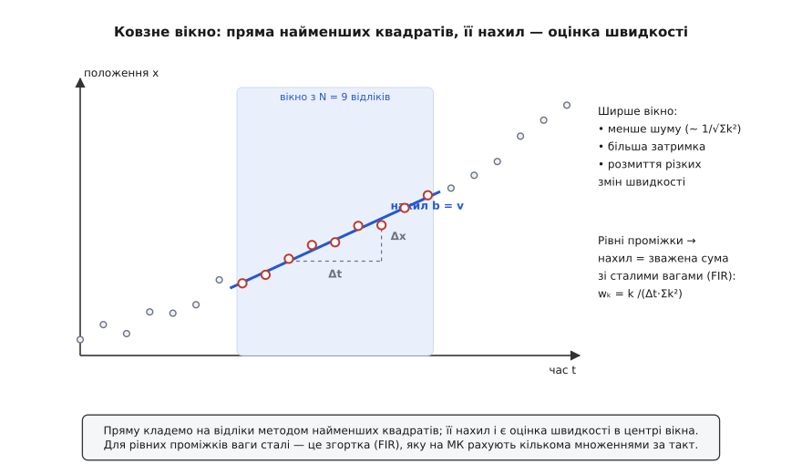
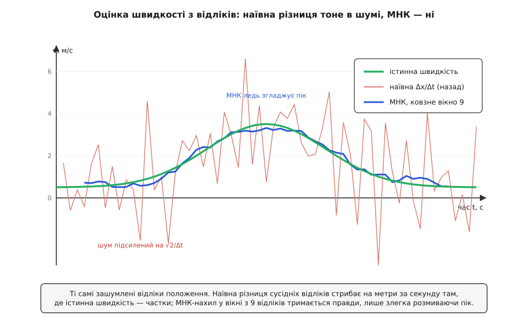

# ⚙️ Швидкість із дискретних відліків: різниці, вікна, викиди

Жоден датчик не віддає швидкість готовою. GPS присилає **положення** — широту й довготу — десять разів на секунду. Енкодер на валу лічить **імпульси** — скільки рисок минуло під оптичною щілиною. Трекер на відео дає **піксельні координати** цятки в кожному кадрі. Спільне в усіх трьох одне: маємо ряд відліків положення `x[0], x[1], x[2] …` у моменти часу `t[0], t[1], t[2] …`, а хочемо знати, **як швидко** воно змінюється — [похідну](book:math/derivative) положення за часом у цю мить.

Найперша думка напрошується сама: узяти два сусідні відліки, поділити приріст положення на приріст часу.

```
v̂ ≈ (x[n] − x[n−1]) / (t[n] − t[n−1])
```

Спокуса — зашити цей рядок у прошивку й забути. Але тут криється одна з найпідступніших пасток у всій обробці сигналів: **що частіше ти опитуєш датчик, то гіршою стає ця оцінка**. Наївна різниця не просто пропускає шум — вона його **підсилює**, і тим сильніше, чим дрібніший крок. Розберімо, чому так, і як добути з тих самих відліків чесну швидкість.

## Чому наївна різниця тоне в шумі

Кожен відлік положення несе на собі похибку. У GPS це метри блукання через перевідбиття й іоносферу; у трекері — тремтіння центра плями на піксель-два; в енкодері — квантування до цілого імпульсу. Запишімо це чесно: виміряний відлік — це істинне положення плюс [шум](book:algorithms/signal-noise), незалежний від відліку до відліку, зі стандартним відхиленням σ.

```
x[n] = x_істинне(t[n]) + шум,   шум незалежний, σ на кожен відлік
```

Тепер порахуймо, що станеться з різницею. Чисельник `x[n] − x[n−1]` — це різниця **двох** зашумлених чисел. Похибки їхні незалежні, тож дисперсії додаються, а не гасяться: дисперсія різниці — 2σ², стандартне відхилення — σ·√2. І це відхилення ми ділимо на Δt:

```
σ_v = σ·√2 / Δt        ← поділ на Δt ПІДСИЛЮЄ похибку
```

Ось де захована пастка. Здоровий глузд каже: опитуй частіше, матимеш «свіжішу» швидкість. Але дивись, що з відношенням сигналу до шуму. Істинний приріст за крок — це `v·Δt`, і він **зменшується** разом з Δt. А шумовий приріст — σ·√2 — від Δt не залежить зовсім: він однаковий, хоч міряй раз на секунду, хоч тисячу разів.

```
істинний приріст за крок:  Δx = v·Δt          (малий, спадає ∝ Δt)
шумовий приріст:           ≈ σ·√2             (від Δt не залежить!)
сигнал / шум:              v·Δt /(σ·√2)  → 0   коли Δt → 0
```

Стягуючи крок до нуля, ти женеш корисний сигнал у нуль, а шум лишаєш на місці. Тому наївна різниця близьких відліків — це майже чистий підсилений шум. Конкретно, для звичайного GPS:

```
GPS: σ ≈ 3 м на відлік, 10 Гц (Δt = 0.1 с), пішохід v ≈ 1.4 м/с

σ_v = 3·√2 / 0.1 = 42 м/с     ← оцінка стрибає на ±42 м/с
                                для ходи в 1.4 м/с
```

Сорок два метри за секунду розкиду навколо півтораметрової ходи — оцінка не просто погана, вона безглузда. Саме тому GPS-приймачі **не** рахують швидкість різницею координат: вони беруть її окремо, з доплерівського зсуву несучої частоти супутника, де фізика зовсім інша й шум на порядки менший. Різниця положень — крайній засіб, і поводитися з ним треба обережно.

Квантування б'є з того самого боку, тільки видно його ще наочніше. Енкодер лічить цілі імпульси — між двома близькими відліками лічильник або клацнув, або ні:

```
енкодер: 1000 імпульсів/оберт, вал крутиться 3 об/с → 3000 імп/с
опитування 1 кГц (Δt = 1 мс):  ідеально 3 імпульси за крок

але лічильник цілий → реально 2, 3 або 4 імпульси за крок
v̂ = Δімпульсів/Δt = (3 ± 1)/0.001 = 3000 ± 1000 імп/с   → похибка ±33 %
```

Швидкість, порахована так, — це «сходинки»: вона перескакує між дискретними рівнями `0, 1000, 2000, 3000 …` імп/с, бо чисельник може бути лише цілим. На малій швидкості біда ще гірша: якщо вал за крок дає 0 або 1 імпульс, оцінка стрибає між нулем і повним квантом. Ця квантувальна дрож — рідний брат вимірювального шуму: рівномірне квантування з кроком q додає похибку зі стандартним відхиленням q/√12, і вона так само ділиться на Δt.

Урок один: **сира різниця сусідніх відліків непридатна**. Треба або збирати приріст за довший проміжок (тоді сигнал `v·Δt` росте над шумом), або задіяти більше відліків розумніше. Перше — це просто рідше опитування, і воно тупо жертвує свіжістю. Друге веде до методу, який і є серцем задачі.

## Скінченні різниці: вперед, назад, центральна

Перш ніж згладжувати, варто чітко розкласти самі різниці — їх три, і вони не рівноцінні. Нехай відліки йдуть рівним кроком Δt.

```c
/* три способи наблизити v = dx/dt із рівномірних відліків x[] */
float v_fwd = (x[n+1] - x[n])   / dt;          /* вперед: дивиться в майбутнє   */
float v_bwd = (x[n]   - x[n-1]) / dt;          /* назад: причинна, для реального часу */
float v_ctr = (x[n+1] - x[n-1]) / (2.0f*dt);   /* центральна: точніша, +1 крок затримки */
```

**Вперед** і **назад** дивляться на один сусідній відлік. Вони відрізняються лише тим, з якого боку: різниця вперед потребує майбутнього відліку `x[n+1]`, тож у реальному часі непридатна — ти ще не маєш майбутнього. Різниця **назад** спирається лише на минуле, тому це єдина причинна форма для контуру керування, що біжить наживо.

**Центральна** різниця бере відліки по обидва боки й точніша за законом наближення: її похибка усічення спадає як O(Δt²), тоді як у однобічних — лише O(Δt). Інтуїція проста: центральна симетрично «ловить» кривину, і систематичний перекіс від неї гаситься. Ціна — вона потребує майбутнього відліку `x[n+1]`, тобто в реальному часі дає оцінку із запізненням на один крок.

Тільки не переплутай дві різні речі. **Похибка усічення** — це наскільки формула хибить на **чистих** даних через скінченність кроку; тут центральна виграє. **Шумове підсилення** — це наскільки формула роздуває **випадкову** похибку відліків; і ось тут центральна нічим принципово не краща: `(x[n+1] − x[n−1])/(2Δt)` має шум σ·√2/(2Δt) = σ/(√2·Δt) — усього в два рази менше за різницю назад, і так само розлітається при малому Δt. Кращий порядок наближення **не рятує** від шуму. Рятує — усереднення по багатьох відліках.

## Похідна методом найменших квадратів

Ось поворотна ідея. Замість ділити два відліки, візьмімо цілу жменю останніх — вікно з N штук — і впишімо в них пряму [методом найменших квадратів](book:math/least-squares). Нахил тієї прямої і є оцінка швидкості. Пряма не мусить проходити через жодну точку точно; вона шукає компроміс, що найкраще лягає на всі, — і саме тому незалежні похибки окремих відліків частково взаємно гасяться, а не складаються.


*Пряму кладемо на N останніх відліків так, щоб сума квадратів відхилень була найменшою; її нахил і є швидкість у центрі вікна. Ширше вікно давить шум сильніше, але додає затримку й розмиває різкі зміни ходу.*

Для **рівних** проміжків тут стається маленьке диво. Розв'язок найменших квадратів для нахилу прямої зводиться до сталого набору ваг — тобто до звичайної згортки (FIR-фільтра). Пронумеруймо відліки у вікні симетрично, від центру: `k = −M … M`, де вікно має N = 2M+1 точок. Тоді нахил (а з ним і швидкість) — це просто зважена сума:

```
ваги:   wₖ = k / (Δt · Σk²),     k = −M … M
        Σk² = M·(M+1)·(2M+1)/3
оцінка: v̂ = Σ wₖ · x[c+k]         (c — центр вікна)
```

Ваги ростуть лінійно від центру: найдальші відліки тягнуть найдужче (`k = ±M`), центральний не важить зовсім (`k = 0`). Це рівно те, що робить око, коли «на око» проводить лінію тренду крізь хмару точок. А тепер головне — шумове підсилення такого фільтра:

```
σ_v = σ / (Δt · √Σk²)          ← падає як √Σk² ~ M^1.5

N = 9 (M = 4):  Σk² = 60  →  σ_v = σ / (7.75·Δt)
                проти σ·√2/Δt у різниці назад — у ~11 разів менше шуму
```

Одинадцятикратне придушення шуму лише за те, що ми взяли дев'ять відліків замість двох. І що ширше вікно, то краще: похибка спадає як M^1.5. Ця конструкція — не самопал, а класика: аналітичні хіміки Абрагам Савицький і Марсел Ґолай опублікували її 1964 року в статті «Згладжування й диференціювання даних спрощеними процедурами найменших квадратів», і відтоді ці згорткові коефіцієнти звуть **фільтром Савицького–Ґолая**. Для прямої (полінома першого порядку) вони саме такі — пропорційні k. (Історична примітка: метод добре задокументований, першоджерело — та сама стаття 1964 р. у *Analytical Chemistry*.)

Дарма не буває. За придушення шуму платиш **двома** речами, і обидві видно на фігурі.


*Наївна різниця сусідніх відліків підсилює шум на √2/Δt і скаче на метри за секунду там, де істинна швидкість — частки. МНК-нахил у вікні тримається правди ціною легкого розмивання різкого піку й невеликої затримки.*

Перша плата — **затримка**. Нахил прямої, вписаної в останні N відліків, оцінює швидкість у **центрі** вікна, а не на його правому краї. Для причинного (наживо) фільтра, де вікно тягнеться в минуле, це означає запізнення на M·Δt: оцінка «зараз» насправді стосується моменту M кроків тому. Друга плата — **розмивання**. Пряма не вміє зобразити злам: коли швидкість різко змінюється, лінійна припасовка усереднює її по всьому вікну й згладжує гострі піки прискорення. Ширше вікно — тихіше, але тупіше й повільніше. У цьому й весь компроміс: **шум проти затримки й вірності різким змінам**. Керуючи дроном, ти хочеш і те, і те; знайти золоту середину — це підібрати N під динаміку свого об'єкта й рівень шуму давача.

## Код: рівномірні відліки (енкодер на МК)

Найчастіший рівномірний випадок — [енкодер](book:electronics/encoder), опитуваний з таймерного переривання на фіксованій частоті. Живе це на мікроконтролері, у гарячому циклі керування мотором, тож основна мова тут — C: цілочислова арифметика, кільцевий буфер, жодних алокацій. Поряд — той самий фільтр на Python для прототипу на наземній станції чи для швидкої перевірки логіки на записаних даних.

Ключ до дешевизни: ваги `k` — маленькі цілі, тож увесь чисельник рахується в цілих, і єдиний поділ на float лишається наостанок. Тримаємо N останніх відліків у кільці; на кожному новому відліку зважуємо їх готовими цілими вагами `−M … M`.

:::tabs
```cpp
#include <stdint.h>

#define NW 7                  /* довжина вікна (непарна)        */
#define MW ((NW - 1) / 2)     /* напівширина = 3                */

typedef struct {
    int32_t buf[NW];   /* кільце сирих відліків (напр. лічильник енкодера) */
    int     head;      /* куди ляже наступний відлік                       */
    int     filled;    /* скільки вже покладено (до NW)                    */
    float   inv_dt;    /* 1/Δt, Гц                                         */
} Slope;

void slope_init(Slope *s, float dt)
{
    s->head = 0;  s->filled = 0;  s->inv_dt = 1.0f / dt;
}

/* Покласти новий відлік x; повернути оцінку швидкості (одиниць/с).
   Оцінка стосується ЦЕНТРУ вікна — тобто відстає на MW·Δt. */
float slope_push(Slope *s, int32_t x)
{
    s->buf[s->head] = x;
    s->head = (s->head + 1) % NW;
    if (s->filled < NW) {            /* вікно ще не повне */
        s->filled++;
        return 0.0f;
    }
    /* найстаріший відлік — саме там, куди тепер вказує head */
    int64_t num = 0;                 /* int64: k·counts не перекине розрядність */
    int idx = s->head;
    for (int k = -MW; k <= MW; k++) {
        num += (int64_t)k * s->buf[idx];
        idx = (idx + 1) % NW;
    }
    const int32_t SUMK2 = MW * (MW + 1) * (2 * MW + 1) / 3;   /* =28 при NW=7 */
    return (float)num / (float)SUMK2 * s->inv_dt;
}
```
```python
from collections import deque


class Slope:
    def __init__(self, n, dt):
        assert n % 2 == 1, "вікно має бути непарним"
        self.m = (n - 1) // 2
        self.k = list(range(-self.m, self.m + 1))          # ваги −M … M
        self.sumk2 = self.m * (self.m + 1) * (2 * self.m + 1) // 3
        self.inv_dt = 1.0 / dt
        self.buf = deque(maxlen=n)                          # кільце сам-по-собі

    def push(self, x):
        self.buf.append(x)                                 # найновіший — праворуч
        if len(self.buf) < self.buf.maxlen:
            return 0.0                                      # вікно ще не повне
        # deque іде від найстарішого до найновішого — рівно як k = −M … M
        num = sum(ki * xi for ki, xi in zip(self.k, self.buf))
        return num / self.sumk2 * self.inv_dt              # оцінка в центрі вікна
```
:::

Тонкий, але приємний факт: оскільки Σk = 0, додавання сталої до всіх відліків **не змінює** чисельник (`Σk·c = c·Σk = 0`). Тому фільтр байдужий до абсолютного значення лічильника — його цікавить лише локальна зміна. Це і робить оцінку стійкою до повільного дрейфу нуля, і дозволяє лічильнику енкодера безпечно рости великим (аж поки не перекине розрядність самого типу — тому чисельник накопичуємо в `int64_t`).

Варто знати й спеціалізовані енкодерні прийоми, до яких цей фільтр — природне узагальнення. **M-метод** (лічба частоти) рахує імпульси за фіксоване вікно, `v = Δімпульсів/Δt` — це рівно різниця назад, і на малій швидкості чи високій частоті опитування вона квантувально-шумна, як ми бачили. **T-метод** (лічба періоду) міряє час між сусідніми імпульсами високочастотним лічильником і бере `v = 1/період` — навпаки, точний на малій швидкості, але грубне на високій. Промислові приводи комбінують їх (**M/T-метод**): період — на малих обертах, частоту — на великих. МНК-вікно ж дає гладкий компроміс поверх M-методу, коли крок опитування фіксований.

## Нерівномірні відліки й викиди

Фіксований крок — розкіш, якої GPS і відеотрекер часто не дають. Мітки часу GPS тремтять; кадри бувають пропущені; пакет спізнюється. Щойно проміжки перестають бути рівними, згортка зі сталими вагами **ламається** — вона мовчки припускає рівний Δt, якого нема. Тоді доводиться рахувати справжню регресію з реальними мітками часу. Це вже не гарячий цикл МК, а прототип чи наземна обробка, тож мова тут — Python: виразно, з ходу видно математику.

```python
def lsq_velocity(ts, xs):
    """Нахил прямої МНК для ДОВІЛЬНИХ проміжків часу — загальна регресія.
       ts, xs — списки міток часу й положень у вікні. Повертає швидкість."""
    n = len(ts)
    tbar = sum(ts) / n
    xbar = sum(xs) / n
    num = sum((t - tbar) * (x - xbar) for t, x in zip(ts, xs))
    den = sum((t - tbar) ** 2 for t in ts)
    return num / den                     # м/с, якщо x у м, а t у с
```

Це та сама формула нахилу, лише проміжки враховано чесно, кожен свій. Для рівних кроків вона тотожно зводиться до згортки зверху — переконайся підстановкою, це корисна вправа на розуміння.

Лишається найгидкіший ворог реальних даних — **викид**. GPS через перевідбиття від стіни раптом «стрибає» на десяток метрів; трекер на кадр перечепився на схожу пляму; в енкодера проскочив зайвий чи загубився один імпульс. Найменші квадрати до такого беззахисні: вони мінімізують суму **квадратів** відхилень, тож одна далека точка тягне квадратично й перекошує всю пряму. Дивись, як один викид на краю вікна руйнує оцінку:

```
5 відліків, t = 0,1,2,3,4 с; істинна v = 2 м/с;
останній — викид (GPS-стрибок +16 м):   x = [0, 2, 4, 6, 24]

МНК-нахил:  Σ(t−t̄)(x−x̄) / Σ(t−t̄)² = 52 / 10 = 5.2 м/с   ← зіпсовано (×2.6)
```

Замість двох метрів за секунду — п'ять із гаком, лише через одну збрехану точку. Рятунок — оцінка, що спирається на **медіану**, а не на середнє: медіану далека точка зрушити не може, бо вона голосує позицією, а не величиною. Класичний хід — **оцінка Тейла–Сена**: візьми нахили **всіх пар** точок і поверни їхню медіану. Вона витримує аж до ~29 % викидів у даних, перш ніж зламатися, — проти нуля у звичайних найменших квадратів.

```python
from statistics import median


def theil_sen_velocity(ts, xs):
    """Стійка оцінка: медіана нахилів усіх пар точок (Тейл–Сен).
       Витримує до ~29 % викидів. O(n²) пар — дешево для вікна в 5–15 відліків."""
    slopes = [(xs[j] - xs[i]) / (ts[j] - ts[i])
              for i in range(len(ts))
              for j in range(i + 1, len(ts))
              if ts[j] != ts[i]]
    return median(slopes)
```

На тих самих даних із викидом:

```
пари дають нахили {2, 2, 2, 2, 2, 2, 6, 7.3, 10, 18}
медіана = 2.0 м/с        ← викид переголосовано, оцінка точна
```

Шість «чесних» пар дали рівно 2, чотири «отруєні» викидом розповзлися вгору — і медіана спокійно сіла на правильну двійку. O(n²) пар лякає лише на позір: для робочого вікна в 5–15 відліків це десятки-сотні операцій, дрібниця навіть для скромного процесора. Дешевша альтернатива, коли й Тейл–Сен задорого, — прогнати положення крізь [медіанний фільтр](book:algorithms/median-filter) перед диференціюванням: він вибиває поодинокі сплески ще до того, як вони дійдуть до нахилу.

## Складність і пастки

- **Найчастіша помилка — сира різниця з високою частотою.** «Опитаю тисячу разів на секунду, матиму точнішу швидкість» — і навпаки: `σ_v = σ·√2/Δt` роздуває шум тим сильніше, чим менший крок. Або збирай приріст за довший проміжок, або усереднюй вікном; сира різниця близьких відліків майже завжди — підсилений шум.
- **Затримка вікна реальна й важить у контурі керування.** МНК-нахил у причинному вікні відстає на M·Δt. У повільному контурі це дрібниця, у швидкому (стабілізація дрона) — джерело автоколивань: регулятор реагує на **вчорашню** швидкість. Тримай N рівно таким, щоб придушити шум, і ні відліком ширше.
- **Кращий порядок наближення ≠ менше шуму.** Спокуса взяти центральну різницю «бо точніша» не рятує від шуму — виграш лише вдвічі. Проти шуму працює **кількість** відліків у вікні (√Σk²), а не порядок формули.
- **Нерівномірний крок ламає згортку мовчки.** Сталі ваги припускають рівний Δt. На тремтливих мітках GPS вони дадуть тихо викривлену швидкість без жодної помилки в лозі. Щойно проміжки нерівні — рахуй повну регресію з реальними `t`.
- **Один викид валить найменші квадрати.** L2 не має стійкості: одна далека точка перекошує пряму квадратично. У даних із можливими стрибками (GPS, трекер, зрив імпульсу) став медіанну оцінку (Тейл–Сен) або медіанний передфільтр.
- **Розрядність лічильника.** Монотонний лічильник енкодера з часом росте; чисельник `Σk·x` накопичуй у широкому типі (`int64_t`), інакше на великих значеннях перекине розряд — попри те, що результат через Σk = 0 від абсолютного рівня не залежить.
- **Коли методів мало — час на фільтр Калмана.** Усе вище оцінює швидкість з **самих** положень. Якщо є ще й модель руху (інерція, тяга) чи другий давач (акселерометр, доплер), їх варто злити: [фільтр Калмана](book:algorithms/kalman-filter) веде положення й швидкість спільним станом і на кожному кроці сам зважує довіру до моделі проти виміру за статистикою їхніх шумів. МНК-вікно — його чесний, дешевий і прозорий попередник; коли потрібні менша затримка при тому ж шумі й злиття кількох джерел, наступний крок — саме туди.
