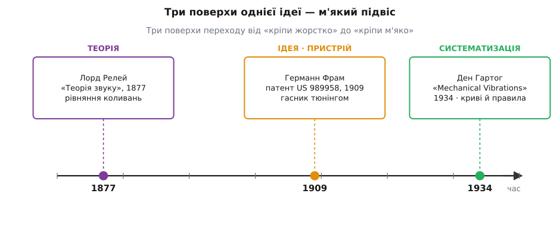

# 📜 Історія м'якого підвісу: як «кріпи жорсткіше» програло «кріпи м'якше»

> Здоровий глузд підказує: щоб машина не тряслася, прикрути її міцніше. Ціле XIX століття інженери так і робили — і раз по раз діставали не тишу, а розгойдування. Правильна відповідь виявилася прямо протилежною до інстинкту: між машиною й опорою треба ставити щось **м'яке**. Ця думка не впала з неба й не належить одній людині. Вона визріла в три різні поверхи: спершу з'явилася ідея-пристрій, окремо вже лежали готові рівняння, і аж потім підручник зв'язав усе докупи й віддав інженерові в руки.

Розрізнити ці три поверхи — не педантизм. Історія техніки любить згортатися в легенду про одного генія, що «винайшов». Тут же видно інше, чесніше: винахідник пристрою не мав під собою теорії, теоретик не думав про пристрої, а той, хто зробив усе практичним, не винайшов ні першого, ні другого. М'який підвіс — спільна праця трьох світів, що довго не зустрічалися.

---

## Інстинкт, що заводив просто в резонанс

Щоб зрозуміти, наскільки несподіваною була ідея м'якості, треба відчути, яким природним був протилежний хід. Настала доба пари й обертових машин: пароплави з велетенськими гребними валами, парові турбіни, поршневі двигуни, генератори. Усе це крутилося, гупало й трясло — палуби, фундаменти, цілі корпуси суден. Що робить інженер, коли щось дрижить? Закріплює міцніше. Додає маси у фундамент, товщає болти, ставить розкоси. Для **статичного** навантаження це і є правильна відповідь: чим жорсткіша конструкція, тим менше вона прогинається під сталою силою.

Пастка в тому, що вібрація — не стала сила. Жорсткість входить у власну частоту опори: ωₙ = √(k/m). Прикрутити міцніше означає підняти k, а отже, підняти й ωₙ. І якщо машина трясе на якійсь своїй частоті, то, піднімаючи власну частоту опори, ми не тікаємо від біди, а часто **насуваємося** на неї — заганяємо систему в [резонанс](book:physics/mechanical-resonance), де кожен наступний поштовх додається в такт до попереднього й розмах наростає лавиною. Замість тиші — гуркіт, що дедалі гучнішає.

І це були не абстрактні страхи. Гребні вали пароплавів тріскали від крутних коливань; корпуси суден дрижали так, що розхитувалися заклепки; ротори турбін розносило на розгоні. Метал, який без упину гнеться туди-сюди, набирає [втоми](book:physics/material-fatigue) й лускає там, де статично витримав би стократ більше. Ціла інженерна доба воювала з вібрацією єдиною відомою зброєю — жорсткістю — і надто часто ця зброя стріляла у власника. Потрібен був хтось, хто засумнівається в самому інстинкті.

---

## Германн Фрам і думка навпаки

Таким сумнівом став **Германн Фрам** (нім. *Hermann Frahm*, 1867–1939) — німецький інженер із Гамбурга, що майже все життя віддав корабельній справі на верфі «Блом і Фосс» (*Blohm & Voß*), де з 1904 року був технічним директором. Його світ був саме тим світом тремтливих корпусів і валів. Фрам навіть побудував прилад, щоб цю тряску **бачити** — оптичний торсіограф, що вловлював крутні коливання гребних валів і виводив їх лінією на світлочутливий папір. Він роками вимірював вібрацію — і тому, мабуть, першим по-справжньому відчув, що з нею не можна боротися в лоб.

Його думка була навпаки до інстинкту. Замість того щоб глушити коливання жорсткістю, Фрам запропонував **підвісити поряд маленьку пружну масу**, точно налаштовану на частоту тряски. Така допоміжна маса гойдається у протифазі — зі зсувом на чверть періоду — і своєю віддачею гасить силу, що збурює головне тіло. Це **динамічний гасник коливань** (він же настроюваний гаситель маси). 30 жовтня 1909 року Фрам подав патент, і 18 квітня 1911-го дістав його — US 989958, «Device for damping vibrations of bodies». У самому тексті патенту сказано просто: допоміжне тіло, пружно підвішене до головного, вимушено коливається так, щоб «звести нанівець або погасити дію збурювальних сил». Це документований факт, а не легенда: патент лежить у відкритому доступі й досі цитується сотні разів.

Тут важлива чесна засторога. Гасник Фрама — не буквально той м'який підвіс, про який мова в ізоляції вібрації: він додає систему з власною протичастотою, тоді як м'яке кріплення просто опускає власну частоту опори під частоту тряски. Це двоюрідні брати, різні техніки. Але **інтелектуальний хід** у них один і той самий, і саме він був революційним: боротися з вібрацією не грубою жорсткістю, а **податливістю й точним налаштуванням**. Фрам першим утілив цей хід у залізо.

І втілив тріумфально. Найгучніший його винахід — U-подібні протикренові цистерни (згодом їх звали просто «танки Фрама»): вода, що переливається з борту на борт трубою під корпусом, налаштована на період хитавиці, гасить крен так само, як допоміжна маса гасить вібрацію. Як подають джерела, до Другої світової цими цистернами оснастили понад мільйон тонн німецького флоту, зокрема лайнери «Бремен» і «Європа». Фрам працював на рівні **ідеї та пристрою**: він побудував протиінтуїтивну річ раніше, ніж з'явилася струнка теорія, яка сказала б, коли саме вона допомагає, а коли шкодить.

---

## Рівняння вже чекали — «Теорія звуку» Релея

А тепер несподіванка: теорія, якої Фрамові бракувало, вже існувала. Тільки жила вона в іншому цеху науки й іншими словами.

Математика вимушених коливань загасної системи — розмах відгуку, зсув фаз, вибух на резонансі — складалася впродовж усього XIX століття. Жан-Марі Дюамель (фр. *Jean-Marie Duhamel*, 1797–1872) дав загальний спосіб рахувати відгук на довільну силу ще 1830 року. Аугуст Зеебек (нім. *August Seebeck*, 1805–1849) вивів повний розв'язок для вимушеного коливання — але його праця лишилася майже непоміченою. Герман фон Гельмгольц (нім. *Hermann von Helmholtz*, 1821–1894) 1863 року пояснив механічний і акустичний резонанс уже з повною математикою. А канонічну, узагальнену форму, яку інженери зрештою й успадкували, цим рівнянням надав **лорд Релей** — Джон Вільям Стретт (англ. *John William Strutt, 3rd Baron Rayleigh*, 1842–1919) — у своїй «Теорії звуку» (*The Theory of Sound*, том перший — 1877, другий — 1878). Той самий Релей, англійський аристократ і фізик, що згодом дістане Нобелівську премію 1904 року за відкриття аргону.

Тут теж треба говорити точно, без міфу про одного героя. Релей **не винайшов** теорію вимушених коливань — він зібрав, узагальнив і виклав її так ясно й повно, що саме його книга стала настільною. У ній уже сиділа вся правда про підвіс, тільки написана мовою акустики: нижче за резонанс опора передає майже все; на резонансі підсилює тим дужче, чим менше загасання (той самий пік ≈ 1/2ζ); і лише коли частота тряски перевищує власну в √2 раза, підвіс нарешті ізолює.

Уся крива передавання, по суті, вивідна з рівнянь Релея. Знання лежало на папері за десятиліття до Фрамового патенту. Але лежало воно як **теорія звуку**, а не як рецепт кріплення машин. Ніхто ще не зробив останнього кроку — не сказав уголос: отже, опору треба робити м'якою. Теоретики мали рівняння й не думали про фундаменти; Фрам мав пристрої й не мав рівнянь. Два поверхи стояли поряд, не з'єднані сходами.

---

## Ден Гартог: від рівнянь до правил у руках інженера

Сходами став **Якоб Пітер Ден Гартог** (нід.-амер. *Jacob Pieter Den Hartog*, 1901–1989) — інженер, що поєднав у собі обидва світи. Народжений в Амбараві на Яві, тодішній Нідерландській Ост-Індії, він закінчив електротехніку в Делфті (1924) й поїхав до Америки, у дослідну лабораторію «Вестінгауз» у Пітсбурзі. Саме там, навчаючи заводських конструкторів, він і зробив свою головну справу.

З 1926 по 1932 рік Ден Гартог читав інженерам «Вестінгауза» курс про коливання — не для математиків, а для людей, яким завтра проєктувати реальні машини. Ці лекції переросли в регулярний курс Гарвардської інженерної школи з 1932 року, а 1934-го видавництво McGraw-Hill випустило з них книгу «Mechanical Vibrations». У передмові Ден Гартог прямо пише, що книга виросла з тих вестінгаузівських лекцій і живиться цілком його промисловим досвідом. Це й був третій поверх — **систематизація**.

Ден Гартог зробив те, чого не зробили ні Фрам, ні Релей: перетворив теорію на **правила в руках інженера**. У його книзі вібрація зі складної математики стала набором наочних кривих і чисел, якими можна користуватися, нічого не виводячи наново. Сімейство кривих передавання T(r) для різних загасань; коротке правило, що власну частоту опори видно просто зі статичного прогину (fₙ ≈ 15.8/√δ, де прогин у міліметрах); таблиці для добору опор. Саме звідси «коефіцієнт передавання» став буденним числом, яке інженер прикидає між ділом. І саме звідси в інженерну культуру ввійшло правило, що ще недавно звучало як єресь: **щоб ізолювати, роби м'яко**.

Є тут і красива сполучна ланка з першим поверхом. Ще 1928 року, до самої книги, Ден Гартог разом із Джоном Ормондройдом (*John Ormondroyd*) розв'язав задачу **оптимального** налаштування Фрамового гасника — знайшов, як підібрати його пружність і загасання, щоб приборкати вібрацію найкраще. Це знаменитий «метод рівних піків». Тобто Ден Гартог буквально взяв пристрій Фрама й дав йому теорію проєктування, а тоді загорнув усе поле разом — і ізоляцію, і гасіння — у підручник, за яким училися покоління. Пізніше він перейшов до Массачусетського технологічного інституту (MIT, 1945–1967), але діло вже було зроблене: м'який підвіс став не осяянням одинака, а рядовим інструментом.

---

## Три поверхи однієї ідеї

Тепер видно всю будову — і чому жоден із трьох сам не «винайшов м'який підвіс».

*Три різні поверхи переходу від «кріпи жорстко» до «кріпи м'яко»: канонічна теорія вимушених коливань (Релей), протиінтуїтивний пристрій-гасник (Фрам) і підручник із кривими та правилами, що віддав усе інженерові (Ден Гартог).*

**Ідея й пристрій — Фрам (1909).** Він першим утілив хід «податливість і налаштування замість жорсткості» в робоче залізо: динамічний гасник коливань і протикренові цистерни. Доказовість найтвердіша — патент і кораблі, що плавали. Але теорії, яка сказала б наперед межу застосування, у нього не було.

**Теорія — Релей (1877), а до нього Дюамель, Зеебек, Гельмгольц.** Рівняння вимушених коливань, з яких вивідна вся крива передавання, склалися в акустиці й механіці XIX століття; Релей надав їм канонічної форми. Доказовість — сама математика, перевірена вже півтора століття. Але це була теорія звуку, не рецепт кріплення.

**Систематизація — Ден Гартог (1934), із коренем у 1928-му.** Він зв'язав теорію Релея й пристрої Фрама в єдиний інженерний метод: криві, правило прогину, оптимальне налаштування гасника, підручник. Доказовість — практика поколінь, що за цією книгою проєктували підвіси.

Варто відзначити й те, чого тут **немає**. Ця історія — чисто західноєвропейська й американська: німець Фрам, англієць Релей із французьким і німецьким корінням теорії, нідерландсько-американець Ден Гартог. Жодних пізніших приписувань «першості», жодного витягування одного імені понад решту. Реальна картина складніша й чесніша за будь-яку легенду про генія-одинака.

Через усі три поверхи проходить одна нитка думки. Інстинкт «зроби жорсткіше» правильний для сталого навантаження й хибний для вібрації — але щоб його перевернути, замало було здогаду. Знадобився пристрій, який показав, що м'якість працює (Фрам); рівняння, які пояснили, **чому** й **коли** вона працює (Релей і його попередники); і підручник, що переклав це на мову чисел і правил, доступних кожному конструкторові (Ден Гартог). Аж тоді «кріпи м'яко» перестало бути єрессю й стало ремеслом. Наступного разу, дивлячись, як важкий прилад ледь помітно погойдується на своїх податливих опорах, згадайте: ця легка «неміцність» — підсумок столітньої дороги від жорсткості до тонкого розрахунку.
