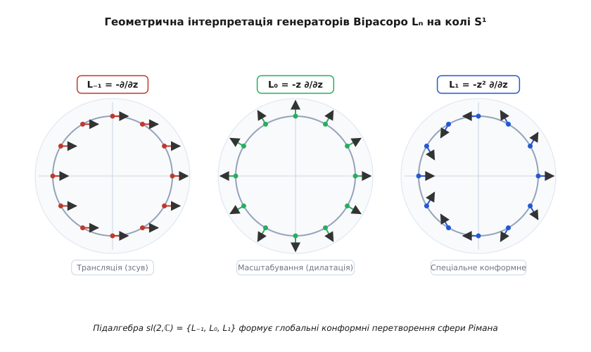
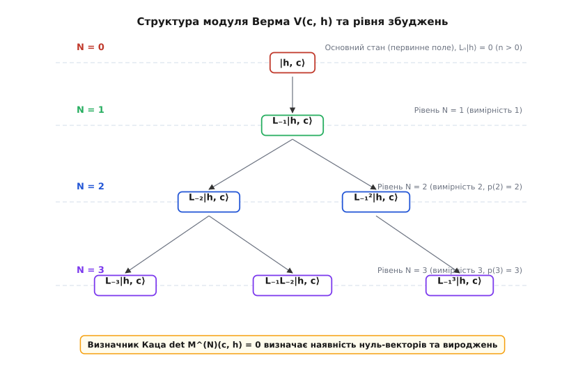
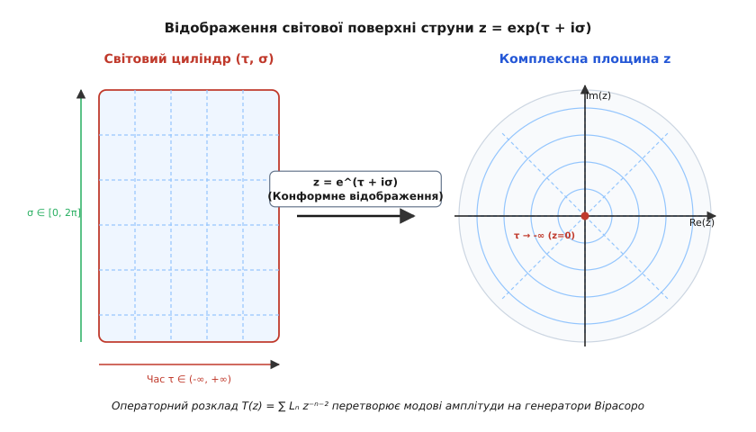
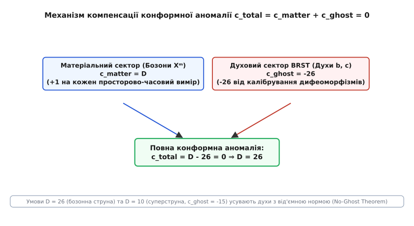

# Алгебра Вірасоро та конформна аномалія

<preknowlist>
- [Принцип найменшої дії](topic:physics/least-action-principle) — фундаментальний варіаційний принцип, з якого виводяться рівняння руху фізичних систем.
- [Теорема Нетер](topic:physics/noether-theorem) — тотожний зв'язок між неперервними симетріями дії та збережуваними фізичними величинами.
- [Ступені вільності](topic:physics/degrees-of-freedom) — кількість незалежних змінних, необхідних для повного опису стану механічної системи.
- [Теорія груп](topic:math/group-theory) — алгебраїчний апарат опису симетрій, груп Лі та їхніх генераторів.
</preknowlist>

Уявімо фізичну систему, яка не має внутрішнього масштабу довжини. Це може бути двовимірний магнетик у критичній точці фазового переходу другого роду, де кореляційний радіус збурень прямує до нескінченності, або релятивістська струна, що здійснює коливання у просторі-часі. На класичному рівні така система володіє масштабною та конформною симетрією (від грецького *con-* — разом, та *forma* — форма): вона залишається незмінною не лише при рівномірному розтягуванні чи стисканні, але й при будь-яких локальних викривленнях координат, які зберігають кути між перетинаючимися кривими. 

У класичній механіці суцільних середовищ та теорії поля згідно з [теоремою Нетер](topic:physics/noether-theorem) інваріантність відносно конформних перетворень приводить до наявності нескінченного набору збережуваних струмів, а слід класичного тензора енергії-імпульсу тотожно дорівнює нулю (`Tᵐₘ = 0`). Здавалося б, при переході до квантового опису ця багата геометрична симетрія має зберегтися і надати нам нескінченний набір точних квантових законів збереження.

Однак квантова реальність підношує фундаментальний сюрприз. Коли ми квантуємо систему — тобто замінюємо класичні фазові змінні на оператори в гіперпросторі станів і регуляризуємо квантові флуктуації вакууму — масштабна інваріантність неминуче ламається. Потреба усунення нескінченностей (регуляризація ультрафіолетових розбіжностей) вимагає введення штучного масштабу маси або довжини. У результаті класична конформна симетрія зазнає руйнування — виникає так звана **квантова конформна аномалія** (від грецького *anomalia* — відхилення від норми, нерегулярність).

На мові алгебр Лі це квантове порушення виражається не як повна втрата симетрії, а як витончена деформація її структурних співвідношень. Класична нескінченновимірна алгебра конформних векторних полів (алгебра Вітта) дістає квантову поправку — **центральне розширення** (Central Extension). Утворена нескінченновимірна алгебра Лі називається **алгеброю Вірасоро**, а величина квантової аномалії характеризується єдиним числовим параметром — **центральним зарядом** `c`.

> 🔧 **Навіщо це.**
> Алгебра Вірасоро є фундаментальним математичним каркасом для всієї двовимірної конформної теорії поля (CFT), теорії релятивістських струн, квантової теорії гравітації та фізики конденсованого стану. Вона дозволяє тотожно обчислювати критичні індекси фазових переходів у статистичних моделях (модель Ізинга, модель Поттса, квантовий ефект Холла), обчислювати спектри мас струнних збуджень і строго визначати критичну вимірність простору-часу (`D = 26` для бозонної струни та `D = 10` для суперструни), при якій квантові духи з від'ємною ймовірністю повністю анігілюють.

---

### 1. Алгебра Вітта: конформні відображення та векторні поля на колі

Щоб збагнути походження алгебри Вірасоро, розпочнемо з чисто геометричного опису неперервних конформних перетворень на двох вимірах. Розглянемо комплексну площину `z = x + i·y`. У комплексній аналітичній геометрії будь-яка голоморфна (комплексно-диференційована) функція `f(z)` здійснює конформне відображення у кожній точці, де її похідна не перетворюється на нуль (`f'(z) ≠ 0`). Це означає, що група двовимірних локальних конформних перетворень є нескінченновимірною — на відміну від вищих вимірів (`d ≥ 3`), де група конформних перетворень є скінченновимірною групою Лі `SO(d+1, 1)`.

У багатьох фізичних задачах — зокрема при аналізі закритих струн або періодичних гратчастих систем — зручно перейти від комплексної площини до одиничного кола `S¹` (абсциса кута `θ ∈ [0, 2π]`) або до циліндра, зробивши заміну змінних `z = exp(i·θ)`. 

Розглянемо нескінченновимірну групу дифеоморфізмів (гладких взаємно-однозначних відображень) кола `S¹`, позначувану `Diff(S¹)`. Генераторами цієї групи є інфінітозимальні векторні поля на колі, що визначають локальні зсуви координат `z ↦ z + ε(z)`. Розкладаючи комплексну функцію `ε(z)` у ряд Лорана-Фур'є `ε(z) = ∑ₙ εₙ zⁿ⁺¹`, введемо базисний набір диференціальних операторів першого порядку:

```
Lₙ = -zⁿ⁺¹ · (∂ / ∂z),    n ∈ ℤ
```

Ці оператори діють на скалярні та тензорні поля, задані на колі або у комплексній площині. У конформній теорії поля фундаментальну роль відіграють так звані **первинні поля** (Primary Fields) `Φ_h(z)`, які під час локальної зміни координат `z ↦ f(z)` трансформуються як тензорні диференціальні форми ваги `h`:

```
Φ'_h(z') = (df / dz)⁻ʰ · Φ_h(z)
```

Обчислимо скобу Лі (комутатор) двох таких векторних полів, застосувавши їх до довільної гладкої тестової функції `Ψ(z)`:

```
[Lₙ, L☿] Ψ = Lₙ (L☿ Ψ) - L☿ (Lₙ Ψ)
           = (-zⁿ⁺¹ ∂/∂z) (-zᵐ⁺¹ ∂Ψ/∂z) - (-zᵐ⁺¹ ∂/∂z) (-zⁿ⁺¹ ∂Ψ/∂z)
           = (m + 1) zⁿ⁺ᵐ⁺¹ (∂Ψ/∂z) + zⁿ⁺ᵐ⁺² (∂²Ψ/∂z²) - (n + 1) zⁿ⁺ᵐ⁺¹ (∂Ψ/∂z) - zⁿ⁺ᵐ⁺² (∂²Ψ/∂z²)
           = (m - n) zⁿ⁺ᵐ⁺¹ (∂Ψ/∂z)
           = (n - m) Lₙ₊ᵐ Ψ
```

Отже, комутатор генераторів задовольняє замкненому алгебраїчному співвідношенню:

```
[Lₙ, L☿] = (n - m) Lₙ₊ᵐ      [Класична алгебра Вітта]
```

Ця нескінченновимірна алгебра Лі називається **алгеброю Вітта** (на честь німецького математика Ернста Вітта). Вона описує алгебраїчну структуру інфінітозимальних конформних перетворень у двох вимірах на класичному рівні.


*Геометрична інтерпретація генераторів Вірасоро Lₙ на колі S¹: генератори L₋₁, L₀, L₁ утворюють скінченновимірну підалгебру sl(2,ℂ) глобальних конформних перетворень (трансляції, дилатації та спеціальні конформні трансформації сфери Рімана).*

Серед нескінченного набору генераторів `Lₙ` виділяється особлива трійка операторів `{L₋₁, L₀, L₁}`. Запишемо їхні коммутаційні співвідношення:

```
[L₀, L₋₁] = L₋₁,     [L₀, L₁] = -L₁,     [L₁, L₋₁] = 2 L₀
```

Як видно з фігури 1, ця трійка утворює замкнену тривимірну підалгебру Лі, яка є ізоморфною алгебрі `sl(2, ℂ)` (або `su(1,1)` на дійсному колі). На геометричній мові оператор `L₋₁ = -∂/∂z` генерує комплексна трансляції (зсуви площини), `L₀ = -z ∂/∂z` генерує масштабування (дилатації) та повороти, а `L₁ = -z² ∂/∂z` генерує спеціальні конформні перетворення. Разом вони формують групу дробово-лінійних перетворень Мебіуса (Mobius transformations) сфери Рімана:

```
z ↦ (a·z + b) / (c·z + d),    a·d - b·c = 1
```

Ці три перетворення є **глобально регулярними** на всій сфері Рімана (включаючи точку нескінченності `z = ∞`). Натомість генератори `Lₙ` для `|n| ≥ 2` мають полюси у точках `z = 0` або `z = ∞` і описують **локальні** конформні деформації.

---

### 2. Квантування та народження центрального розширення

Що відбувається з алгеброю Вітта при квантуванні фізичної системи? У квантовій механіці та квантовій теорії поля класичні фізичні величини перетворюються на оператори, діючі в гіперпросторі станів Гільберта, а скоба Пуассона замінюється на квантовий коммутатор `i · {A, B} ↦ [Â, B̂]`.

Розглянемо канонічний приклад: квантове безмасове бозонне поле `X(τ, σ)` у 1+1-вимірному просторі-часі (модель скалярного поля на циліндрі). Розкладаючи поле `X(τ, σ)` у модові оператори Осциляторного типу `αₙ` (де `n ∈ ℤ`), маємо стандартні канонічні коммутаційні співвідношення для осциляторів:

```
[αₙ, α☿] = n · δₙ₊ᵐ,₀ · I
```

У класичній механіці Гамільтонові модові амплітуди конформного енергетичного потоку виражаються як квадратичні комбінації `Lₙ = (1/2) ∑ₖ αₙ₋ₖ α☖`. Однак у квантовій теорії добуток двох операторів у одній точці принципово невизначений через ультрафіолетові квантові флуктуації вакууму. Щоб отримати скінченні оператори з скінченними вакуумними середніми значеннями, ми зобов'язані застосувати процедуру **нормального впорядкування** (Normal Ordering), позначувану двокрапками `: A B :`. При нормальному впорядкуванні всі оператори знищення (`αₙ` з `n > 0`) переставляються праворуч від операторів народження (`αₙ` з `n < 0`):

```
Lₙ = (1/2) · ∑☖ : αₙ₋☖ α☖ :
```

При конформному відображенні з нескінченного циліндра на комплексну площину `z = exp(τ + i·σ)` нульова мода Гамільтоніана зазнає зсуву вакуумної енергії Ефекту Казимира. Нульовий оператор `L₀` на циліндрі пов'язаний з оператором на площині співвідношенням:

```
L₀⁽ᶜʸˡ⁾ = L₀⁽ᵖˡᵃⁿᵉ⁾ - (c / 24) · I
```

Для більшості режимів `n ≠ 0` перестановка операторів не створює нових проблем. Проте обчислимо коммутатор двох квантових операторів `Lₙ` та `L₋ₙ` безпосередньо за допомогою теореми Віка чи канонічних комутаторів осциляторів. Розглянемо вакуумне середнє значення коммутатора `<0| [Lₙ, L₋ₙ] |0>`:

```
[Lₙ, L₋ₙ] = (2n) L₀ + (1/4) ∑☖,ₗ [ :αₙ₋☖ α☖:, :α₋ₙ₋ₗ αₗ: ]
```

При згортанні осциляторних операторів парами виникає додаткова квантова сума (нульова енергія вакуумних флуктуацій або ефект Казимира), яка дорівнює:

```
∑☖₌₁ⁿ k · (n - k) = (1/6) · (n³ - n)
```

Отже, квантовий коммутатор набуває додаткового числового доданку, пропорційного одиничному оператору `I`! Повний квантовий коммутатор для довільних `n, m ∈ ℤ` записується як:

```
[Lₙ, L☿] = (n - m) Lₙ₊ᵐ + (c / 12) · (n³ - n) · δₙ₊ᵐ,₀ · I      [Алгебра Вірасоро]
```

Цє співвідношення і є **алгеброю Вірасоро**. Константа `c` називається **центральним зарядом** (Central Charge) або конформним аномальним числом. Сам додатковий член називається **центральним розширенням** алгебри Лі Вітта.

Коли ми змінюємо фізичну систему (наприклад, додаємо нові бозонні або ферміонні поля), значення центрального заряду `c` змінюється, проте сама алгебраїчна структура `(n³ - n) δₙ₊ᵐ,₀` залишається незмінною.

Математичне виведення єдиності цього центрального розширення через формалізм 2-когомологій та рівняння Якобі детально розібрано у [математичному екскурсі про виведення центрального розширення](topic:physics/virasoro-algebra/math-central-extension.md).

Звернемо увагу на найважливіший математичний факт: для трійки генераторів `{L₋₁, L₀, L₁}` центральний добавок тотожно перетворюється на нуль!

```
n = -1  ⇒  (-1)³ - (-1) = 0
n = 0   ⇒  0³ - 0 = 0
n = 1   ⇒  1³ - 1 = 0
```

Це означає, що глобальна підалгебра `sl(2, ℂ)` не зазнає квантового центрального розширення. Глобальна конформна симетрія сфери Рімана залишається строго точної у квантовій теорії. Аномалія вражає виключно локальні моди `|n| ≥ 2`.

---

### 3. Квантово-польова природа конформної аномалії та тензор енергії-імпульсу

Щоб глибше осягнути фізичну природу центрального заряду `c`, звернемося до локальної квантової теорії поля. У двовимірній квантовій теорії поля генератори Вірасоро `Lₙ` виникають як коефіцієнти розкладу Фур'є-Лорана для компоненти тензора енергії-імпульсу `T(z) = T₂₂(z)`.

За принципом Нетер, зберігання енергії та імпульсу гарантує соленоїдальність (бездивергентність) тензора енергії-імпульсу: `∂ᵃ Tₐᵦ = 0`. У комплексних координатах `z = x + i·y` та `z̄ = x - i·y` ця умова розпадається на дві незалежні частини:

```
∂̄ T(z) = 0,    ∂ T̄(z̄) = 0
```

Це означає, що комплексна компонента `T(z)` залежить виключно від `z` (голоморфне поле), а `T̄(z̄)` залежить лише від `z̄` (антиголоморфне поле). У результаті нескінченна конформна симетрія розпадається на два незалежних класи, що коммутують між собою: голоморфну алгебру Вірасоро із зарядом `c` та антиголоморфну алгебру Вірасоро із зарядом `c̄`.

Розкладемо квантове поле тензора енергії-імпульсу `T(z)` у ряд Лорана:

```
T(z) = ∑ₙ₌₋∞⁺∞ Lₙ · z⁻ⁿ⁻²
```

Обернене перетворення Лорана дає вираз для генераторів Вірасоро через контурний інтеграл навколо нуля у комплексній площині:

```
Lₙ = (1 / 2πi) ∮ dz · zⁿ⁺¹ · T(z)
```

У квантовій теорії поля добуток двох операторів у близьких точках `z` та `w` описується **операторним розкладом** (Operator Product Expansion, OPE). Застосовуючи теорему Віка до квантового тензора `T(z)`, знайдемо OPE двох тензорів енергії-імпульсу при `z → w`:

```
T(z) T(w) = (c / 2) / (z - w)⁴ + (2 T(w)) / (z - w)² + (∂T(w)) / (z - w) + regular terms
```

Подивіться на цей вираз! Перший член із полюсом четвертого порядку `(z - w)⁻⁴` містить у чисельнику саме центральний заряд `c`. Якби центральний заряд дорівнював нулю (`c = 0`), тензор `T(z)` перетворювався б при конформних трансформаціях як чистий тензорний оператор ваги 2. Поява члена з `c` означає, що при конформних перетвореннях `z ↦ f(z)` квантовий тензор енергії-імпульсу трансформується аномально — із добавленням **похідної Шварца** (Schwarzian Derivative) `{f, z}`:

```
T'(z') = (df/dz)⁻² · [ T(z) - (c / 12) · {f, z} ]
```

де похідна Шварца визначається як:

```
{f, z} = (f''' / f') - (3/2) · (f'' / f')²
```

Похідна Шварца має виняткову алгебраїчну властивість: вона тотожно дорівнює нулю (`{f, z} = 0`) тоді й лише тоді, коли `f(z)` є дробово-лінійним перетворенням Мебіуса `f(z) = (az+b)/(cz+d)`. Це ще один незалежний доказ того, що глобальна підалгебра `sl(2, ℂ)` не відчуває конформної аномалії!

Історичні деталі відкриття цієї аномальної квантової трансформації Мігелем Вірасоро та її фундаментальну роль у дуальних резонансних моделях описано у [історичному екскурсі про виникнення алгебри Вірасоро](topic:physics/virasoro-algebra/hist-virasoro.md).

У чому ж полягає безпосередній фізичний сенс конформної аномалії? На викривленому двовимірному поверховому фоні з метрикою `gₐᵦ` квантові вакуумні флуктуації приводят до того, що слід тензора енергії-імпульсу перестає дорівнювати нулю і стає пропорційним скалярній кривизні Річчі `R`:

```
⟨ Tᵐₘ ⟩ = - (c / 12) · R
```

Це рівняння називається **траєвою (Вейлівською) аномалією**. Воно показує, що квантова система виявляється чутливою до локального масштабування метрики: зміна масштабу метрики `gₐᵦ ↦ e²Ⳡ gₐᵦ` змінює вакуумну енергію системи пропорційно центральному заряду `c`.

---

### 4. Представлення алгебри Вірасоро та модулі Верма

Оскільки алгебра Вірасоро є нескінченновимірною алгеброю Лі, опис її фізичних станів зводиться до теорії її лінійних представлень. У квантовій механіці нам потрібні унітарні представлення у просторі Гільберта з додатновизначеною нормою станів (`⟨Ψ|Ψ⟩ ≥ 0`).

Для побудови представлення застосовується метод **найвищої ваги** (Highest Weight Representation), аналогічний побудові станів квантового гармонічного осцилятора чи алгебри кутового моменту.

Визначимо **первинний стан** (Primary State) або стан найвищої ваги `|h, c⟩`. Це такий квантовий стан, який анігілюється всіма додатними модами Вірасоро `L♄` (операторами знищення), а відносно оператора `L₀` (який грає роль конформного Гамільтоніана або оператора енергії) є власним станом із власним значенням `h`:

```
Lₙ |h, c⟩ = 0,    для всіх n > 0
L₀ |h, c⟩ = h |h, c⟩
```

Число `h` називається **конформною вагою** або конформною вимірністю первинного стану.

Усі інші збуджені стани утвориться послідовним застосуванням від'ємних генераторів `L₋ₙ` (`n > 0`), які виконують роль операторів народження. Такі збуджені стани називаються **вторинними станами** (Secondary States або Descendants). Лінійна оболонка первинного стану та всіх його вторинних станів утворює незвідний векторний підпростір, який називається **модулем Верма** `V(c, h)` (на честь французького математика Дійдони Верма).


*Структура модуля Верма V(c, h) та рівня збуджень: на кожному рівні N стани утворюються дією від'ємних генераторів L₋ₙ. Унітарність та відсутність духів контролюються визначником Каца.*

Модуль Верма має чітку градуйовану структуру за рівнями `N`. Рівень `N` визначається як власне значення оператора `L₀` відносно основного рівня `h`:

```
L₀ (L₋ₖ₁ L₋ₖ₂ ... L₋ₖᵣ |h, c⟩) = (h + N) · (L₋ₖ₁ L₋ₖ₂ ... L₋ₖᵣ |h, c⟩)
```

де `N = k₁ + k₂ + ... + kᵣ`.

Кількість незалежних станів на рівні `N` дорівнює кількості цілочисельних розбиттів числа `N` (функція розбиття Ейлера `p(N)`):
- **Рівень N = 0** (вимірність 1): `|h, c⟩`
- **Рівень N = 1** (вимірність 1): `L₋₁ |h, c⟩`
- **Рівень N = 2** (вимірність 2): `L₋₂ |h, c⟩`, `L₋₁² |h, c⟩`
- **Рівень N = 3** (вимірність 3): `L₋₃ |h, c⟩`, `L₋₁ L₋₂ |h, c⟩`, `L₋₁³ |h, c⟩`

Щоб перевірити квантовомеханічну коректність теорії (унітарність), обчислимо Скалярний добуток між станами модуля Верма. Унітарне спряження для генераторів Вірасоро задається умовою `(Lₙ)⁺ = L₋ₙ`.

На кожному рівні `N` можна побудувати матрицю Скалярних добутків — **матрицю Грама** `Mᴺ(c, h)`. Для прикладу, обчислимо матрицю Грама на рівні `N = 2` у базисі `{ |1⟩ = L₋₂|h⟩, |2⟩ = L₋₁²|h⟩ }`:

```
M₁₁ = ⟨h| L₂ L₋₂ |h⟩ = ⟨h| [L₂, L₋₂] + L₋₂ L₂ |h⟩ = ⟨h| 4 L₀ + (c/12)(8-2) I |h⟩ = 4h + c/2
M₁₂ = ⟨h| L₂ L₋₁² |h⟩ = ⟨h| [L₂, L₋₁] L₋₁ |h⟩ = 3 ⟨h| L₁ L₋₁ |h⟩ = 6h
M₂₁ = 6h
M₂₂ = ⟨h| L₁² L₋₁² |h⟩ = 4h (2h + 1)
```

Визначник цієї матриці Грама називається **визначником Каца** (Kac Determinant) на рівні `N = 2`:

```
det M⁽²⁾(c, h) = M₁₁ M₂₂ - M₁₂ M₂₁ = 2 · h · (16 h² + 2 c h - 10 h + c)
```

У 1979 році Віктор Кац вивів загальну формулу для визначника Грама на довільному рівні `N`:

```
det M⁽ᴺ⁾(c, h) = Kᴺ · ∏₁le;r·s≤N (h - hᵣ,ₛ(c))ᵖ⁽ᴺ⁻ʳ·ˢ⁾
```

Значення `hᵣ,ₛ(c)` називаються нулями Каца. Вони визначають криві у просторі параметрів `(c, h)`, на яких визначник Каца перетворюється на нуль.

Чому це так важливо для фізики?
1. Якщо `det M⁽ᴺ⁾(c, h) < 0`, це означає, що матриця Грама має від'ємне власне значення. У теорії з'являються стани з від'ємною нормою (`⟨Ψ|Ψ⟩ < 0`) — так звані **квантові духи**. Така теорія порушує збереження ймовірності і є квантово неузгодженою.
2. Якщо `det M⁽ᴺ⁾(c, h) = 0`, у модулі Верма виникає **нуль-вектор** (Null Vector) — стан, який одночасно є ортогональним до всіх станів і сам анігілюється додатними модами Вірасоро. Наявність нуль-векторів дозволяє викреслити нефізичні підпростори і отримати точні диференціальні рівняння для кореляційних функцій (рівняння Бєлавіна-Полякова-Замолодчикова або BPZ-рівняння).

Наприклад, для нуль-вектора на рівні `N = 2` у моделі Ізинга (`c = 1/2`, `h = 1/16`) виникає вироджений стан `|χ⟩ = (L₋₂ - (3/4) L₋₁²) |h⟩ = 0`. Вимога анігіляції цього нуль-вектора дає диференціальне рівняння другого порядку для чотириточкової кореляційної функції спінів `⟨σ(z₁) σ(z₂) σ(z₃) σ(z₄)⟩`, що дозволяє тотожно обчислити критичний індекс намагніченості `β = 1/8` без проведення чисельних інтегрувань!

Аналіз формули Каца приводять до фундаментального результату (теорема Фрідана-Кіана-Шенкера):
- При `c ≥ 1` та `h ≥ 0` всі представлення алгебри Вірасоро є строго унітарними (немає духів) для будь-яких дійсних `h`.
- При `c < 1` унітарні представлення можливі **лише для дискретного набору виражених цінностей `c`**, заданих формулою **мінімальних моделей**:

```
c = 1 - 6 / [ p · (p + 1) ],    p = 3, 4, 5, ...
```

Для `p = 3` маємо `c = 1/2` — це точний опис критичної двохвимірної **моделі Ізинга**! Для `p = 4` маємо `c = 7/10` — трикритична модель Ізинга. Для `p = 5` маємо `c = 4/5` — 3-станова модель Поттса. Таким чином, чисто алгебраїчний аналіз представлень Вірасоро повністю класифікує універсальні класи конформних фазових переходів двовимірного матеріального світу!

---

### 5. Механіка струни, конформне відображення циліндра та критична вимірність

Застосуємо здобутий математичний апарат до фізичної системи, з якої історично виникла алгебра Вірасоро — релятивістської бозонної струни.

Коли релятивістська струна здійснює рух у `D`-вимірному просторі-часі Мінковського, вона заметає двовимірну поверхню — **світову поверхню струни** (Worldsheet). Світова поверхня параметризується просторовою координатою `σ ∈ [0, 2π]` (уздовж струни) та часоподібною координатою `τ ∈ (-∞, +∞)` (еволюція у часі). Дія Полякова описується функціоналом:

```
S_Polyakov = - (1 / 4π α') ∫ dτ dσ √-g gᵃᵇ ∂ₐ Xᵐ ∂ᵦ X_m
```

де `α'` — натяг струни, `gᵃᵇ` — двовимірна метрика світової поверхні, а `Xᵐ` — координати у `D`-вимірному просторі-часі.

Дія Полякова володіє двовимірною дифеоморфною та конформною інваріантністю. За допомогою конформного перетворення ми можемо відобразити нескінченний циліндр `(τ, σ)` на комплексну площину `z` за допомогою конформного відображення:

```
z = exp(τ + i·σ)
```


*Відображення світової поверхні струни z = exp(τ + iσ): нескінченний циліндр світової поверхні конформно відображається у комплексну площину z, перетворюючи асимптотичне минуле τ → -∞ на точку z = 0.*

Як демонструє фігура 3, нескінченне минуле струни `τ → -∞` стискається у єдину точку `z = 0` комплексної площини (де діють оператори створення струнних станів), а нескінченне майбутнє `τ → +∞` прямує до нескінченності `z → ∞`.

У коваріантному формулюванні квантування струни Полякова ми повинні врахувати дві складові частини фізичної системи:
1. **Матеріальний сектор**: `D` скалярних поля `Xᵐ(τ, σ)` (`m = 0, 1, ..., D-1`), що описують координати струни у `D`-вимірному просторі-часі. Кожне вільне скалярне бозонне поле дає внесок у центральний заряд, який дорівнює `c = 1`. Отже, повний центральний заряд матеріального сектора дорівнює:

```
c_matter = D
```

2. **Духовий сектор калібрування (BRST-духи)**: Для фіксації конформного калібрування метрики світової поверхні методом Фадеєва-Попова необхідно ввести антикомутуючі духи Грассмана `b(z)` (ваги 2) та `c(z)` (ваги -1). Точний квантовий розрахунок OPE для духового тензора енергії-імпульсу `T_ghost(z) = : (∂c) b : + 2 : c (∂b) :` показує, що духовий сектор дає **від'ємний центральний заряд**:

```
c_ghost = -26
```


*Механізм компенсації конформної аномалії c_total = c_matter + c_ghost = 0: квантова узгодженість теорії струн досягається строго при компенсації матеріального та духового секторів.*

Загальний квантовий оператор BRST-заряду визначається як:

```
Q_BRST = ∑ₙ Lₙᶜᵐ c₋ₙ - (1/2) ∑ₙ,☿ (n - m) : c₋ₙ c₋ᵐ bₙ₊ᵐ :
```

Оператор `Q_BRST` є нільпотентним (`Q_BRST² = 0`), що гарантує відсутність нефізичних духів з від'ємною нормою у квантовому гіперпросторі фізичних станів тоді й лише тоді, коли **повна конформна аномалія тотожно дорівнює нулю**:

```
c_total = c_matter + c_ghost = D - 26 = 0  ⇒  D = 26
```

Це докорінний результат теорії струн! Вимога узгодженості та відсутності квантової аномалії алгебри Вірасоро у коваріантному квантуванні строго фіксує вимірність простору-часу: **бозонна струна може існувати лише у D = 26 вимірах**.

Для суперструни (де додаються ферміонні поля `Ψᵐ` та відповідні супердухи `β, γ`), матеріальний сектор дає `c_matter = (3/2) D`, а духовий сектор дає `c_ghost = -15`. Умова компенсації аномалії `(3/2) D - 15 = 0` визначає критичну вимірність суперструн: **D = 10**.

Практичну чисельну та символьну реальність перевірки співвідношень алгебри Вірасоро наводять алгоритми з [проєктної вставки з чисельної перевірки генераторів Вірасоро](topic:physics/virasoro-algebra/proj-virasoro-generators.md), а специфікацію API обчислювальної бібліотеки подано у [довіднику інтерфейсу бібліотеки Вірасоро](topic:physics/virasoro-algebra/api-virasoro-calc.md).

---

### 6. Фізичний синтез та універсальне значення у сучасній фізиці

Алгебра Вірасоро проходит червоною ниткою крізь усю сучасну теоретичну фізику. Вона є яскравим прикладом того, як чисто математична концепція — центральне розширення алгебри векторних полів — стає фундаментальним законом природи на квантовому рівні.

Об'єднаємо ключові фізичні прояви алгебри Вірасоро у підсумковій системі:

1. **Квантова теорія поля та критичні явища**: Алгебра Вірасоро забезпечує повну розв'язуваність (інтегровність) двовимірних конформних теорій поля. Вона дає змогу обчислити всі температурні та просторові кореляційні функції фазових переходів без розв'язування складних диференціальних рівнянь у просторі позицій.
2. **Теорія струн та квантова гравітація**: Умова зникнення центральної аномалії Вірасоро `c_total = 0` виступає як квантове рівняння руху для просторово-часового фону (рівняння Ейнштейна для струн).
3. **Голографічний принцип (AdS/CFT відповідність)**: У 1986 році Джеймс Браун та Марк Енно (Brown-Henneaux) зробили дивовижне відкриття: асимптотична група ізометрій тривимірного простору Анти-де Сіттера (`AdS₃`) на його двовимірній межі описується саме двома копіями алгебри Вірасоро з центральним зарядом:

```
c = (3 · R_AdS) / (2 · G₃)
```

де `R_AdS` — радіус кривизни простору AdS, а `G₃` — тривимірна гравітаційна константа Ньютона. Це фундаментальне відкриття заклало математичний фундамент голографічного принципу та AdS/CFT-відповідності Малдасени.
4. **Ентропія чорних дир (формула Карді)**: Завдяки алгебрі Вірасоро асимптотична щільність станів у будь-якій двовимірній конформній теорії поля підпорядковується універсальній формулі Карді (Cardy formula):

```
S = 2π · √[ (c · L₀) / 6 ]
```

Ця формула дозволяє точно розрахувати мікроскопічну ентропію трьохвимірних та п'ятивимірних чорних дир через кількість мікроскопічних станів Гільберта.
5. **Дробовий квантовий ефект Холла**: Крайові збудження двовимірного електронного газу у сильному магнітному полі описуються кіральною бозонною теорією поля (хвильові функції Лафліна), алгеброю симетрій якої є алгебра Вірасоро та Каца-Муді з центральним зарядом `c = 1` або дробовими значеннями для неабелевих аніонів.

Алгебра Вірасоро демонструє величний принцип фізики: фундаментальні квантові аномалії є не випадковими помилками розрахунків, а найглибшими геометричними інваріантами, що керують будовою нашого Всесвіту.
