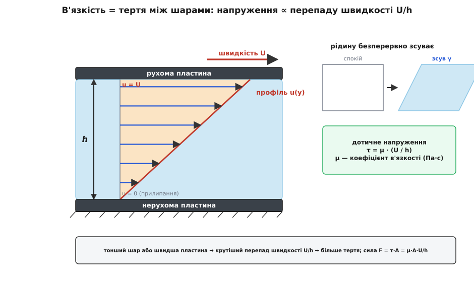
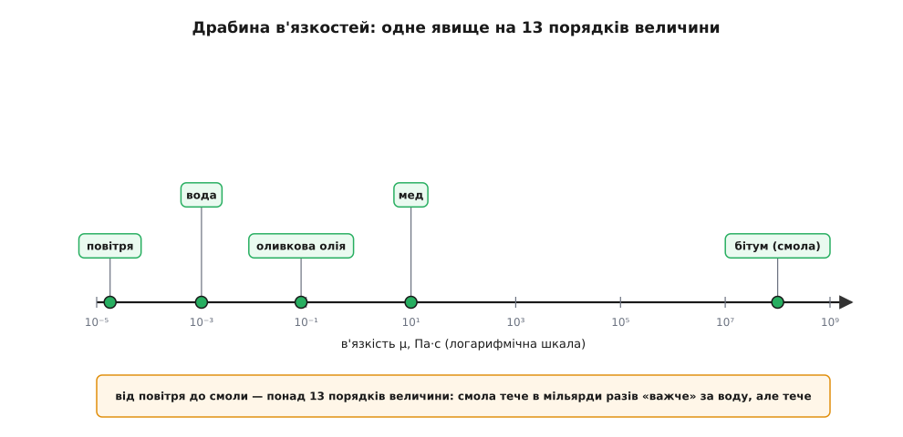
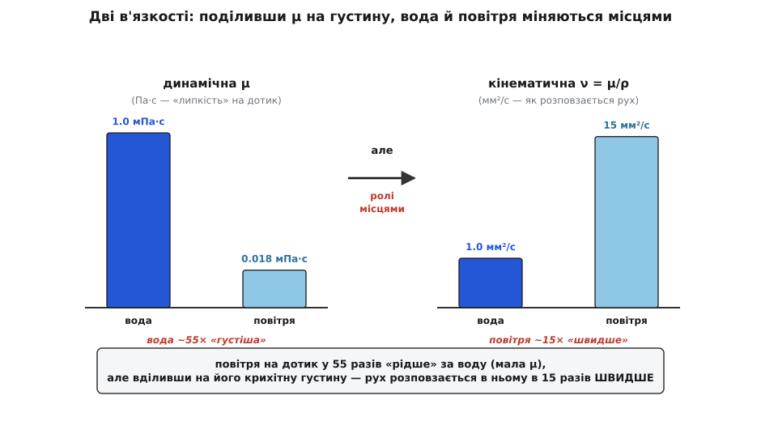
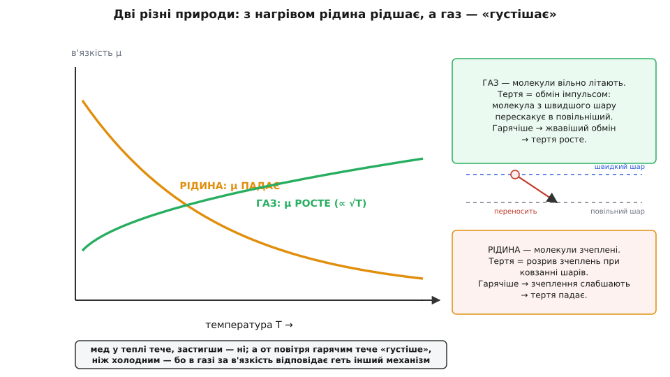

# В'язкість

<preknowlist>
- [Швидкість](topic:physics/velocity) — як швидко змінюється положення; тут головне, що в різних шарах рідини вона буває різна.
- [Сила](topic:physics/force) — міра штовхання чи тягнення; в'язкість породжує саме силу — тертя між шарами.
- [Тиск](topic:physics/pressure) — сила, поділена на площу (нормальна до поверхні); дотичне напруження в'язкості — той самий «сила на площу», тільки вздовж поверхні, а не впоперек.
- [Густина](topic:physics/density) — маса в одиниці об'єму; знадобиться, щоб відрізнити динамічну в'язкість від кінематичної.
</preknowlist>

Мед ллється з ложки млявою цівкою, а вода зривається миттю. Обидва течуть, але мед «важчий» на плин — опирається течінню дужче. Оце побутове «важчий на плин» фізика зве в'язкістю (лат. *viscum* — омела; з її клейких ягід варили пташиний клей-липучку, звідси *viscosus* — липкий). Ідеться не про густину як масу в об'ємі: за нею мед і вода майже однакові. Ідеться про **внутрішнє тертя** — опір, що виникає, коли одна частина рідини мусить ковзати повз іншу. Розберімо, звідки це тертя береться, чому в меду його в тисячі разів більше, ніж у воді, — і, найдивовижніше, чому в газах воно поводиться геть навпаки, ніж підказує чуття.

## Тертя між шарами

Щоб побачити в'язкість у чистому вигляді, візьмімо найпростіший дослід. Налиймо тонкий шар рідини між дві рівні пластини й потягнімо верхню вбік із незмінною швидкістю, а нижню лишімо нерухомою. Ключове спостереження: рідина рухається **не як цілий брусок**. Шар, що торкається кожної пластини, ніби приклеюється до неї — нижній стоїть на місці разом із нижньою пластиною, верхній біжить разом із верхньою. Це називають умовою прилипання: на самій стінці рідина має ту саму швидкість, що й стінка. А між пластинами швидкість плавно наростає від нуля внизу до повної вгорі.

Отже, кожен шар рідини ковзає трохи швидше за сусіда під ним і трохи повільніше за сусіда над ним. Швидший шар підганяє повільніший, повільніший гальмує швидшого — сусідні шари труть один одного. Оце тертя між шарами, що ковзають, і є в'язкість. Щоб верхня пластина рухалася рівномірно, доводиться весь час прикладати силу — саме проти цього внутрішнього тертя.

Скільки саме сили? Ньютон припустив найпростіше, що можна собі уявити, і природа рідин виявилася до нього прихильна: тертя пропорційне тому, **наскільки круто швидкість міняється впоперек потоку**. Уведімо для цього дотичне напруження τ — силу тертя, що припадає на одиницю площі ковзання (як тиск, тільки вздовж поверхні, а не впоперек неї). Тоді

```
τ = μ · (Δu / Δy)
```

де `Δu/Δy` — перепад швидкості на одиницю висоти (його звуть швидкістю зсуву), а μ — коефіцієнт в'язкості. Оцей μ і є числова міра «густоти на плин»: у меду він великий, у води малий. Рідини, що слухаються цього простого лінійного закону, звуть **ньютонівськими** (вода, повітря, рідкі олії), а сам закон — законом Ньютона для в'язкості.



*В'язкість живе в перепаді швидкості між шарами: що тонший прошарок або швидша пластина, то крутіший цей перепад і то більше тертя.*

Одиниця μ в СІ — паскаль-секунда (Па·с). Трапляється й старіша одиниця пуаз (за ім'ям [Жана Пуазейля](topic:physics/viscosity/hist-viscosity.md), 1 Па·с = 10 пуаз): у ній в'язкість води виходить рівно близько 1 сантипуаза, тобто 1 мПа·с, — зручний природний еталон, з яким подумки й порівнюють усе решта.

**Умова.** Пласку кришку площею `A = 0.10 м²` тягнуть по олійному прошарку завтовшки `h = 0.5 мм` зі швидкістю `U = 0.30 м/с`; олія має `μ = 0.10 Па·с`.

```
Δu/Δy = U/h = 0.30 / (5·10⁻⁴)  = 600 с⁻¹      (швидкість зсуву)
τ     = μ · U/h = 0.10 · 600    = 60 Па        (дотичне напруження)
F     = τ · A   = 60 · 0.10     = 6 Н          (сила, щоб тягти рівномірно)
```

**Висновок.** Щоб рівно вести кришку по півміліметровому шару олії, треба тримати 6 ньютонів — і ця сила береться суто з внутрішнього тертя рідини, жодного сухого дотику металу об метал тут немає. Зверніть увагу на `h` у знаменнику: удвічі тонший прошарок — удвічі крутіший перепад швидкості — удвічі більша сила. Тому мастило працює найкраще, коли його шар не надто тонкий: зовсім тонка плівка тре сильно.

> 🔧 **Навіщо це.** На цьому тримається все змащування. У підшипнику ковзання вал не торкається втулки — його несе тонка плівка олії, і саме її в'язке тертя і передає навантаження, і гріє вузол. Замало в'язкості — плівка продавлюється, метал зачіпає метал, задирки; забагато — вузол марно з'їдає потужність на перемішування олії. Уся інженерія мастил — це підбір μ так, щоб плівка і трималася, і не гальмувала.

А наскільки взагалі різняться рідини за в'язкістю? Розмах приголомшливий: між найтекучішими газами й майже твердими смолами — понад тринадцять порядків величини.



*Одне й те саме явище розтягнуте на тринадцять порядків: бітумна смола тече в мільярди разів «важче» за воду — але все ж тече, просто крапля за десятиліття.*

## Дві в'язкості: динамічна й кінематична

Коефіцієнт μ, про який ішлося, зветься повніше **динамічною** в'язкістю: він каже, яка сила потрібна, щоб зсувати рідину. Але часто важить не сила сама по собі, а те, **як швидко рух розповзається** крізь рідину — як хутко загальмований край потягне за собою сусідні шари, як швидко збурення розсотається вглиб. А це залежить уже не тільки від тертя, а й від інерції рідини, тобто від її [густини](topic:physics/density). Одна й та сама в'язка сила легку рідину розганяє й гальмує вмить, а важку — ліниво.

Тому вводять другу величину — **кінематичну** в'язкість, поділивши динамічну на густину:

```
ν = μ / ρ
```

Одиниця виходить несподівана — квадратний метр на секунду (м²/с), геть без ньютонів і кілограмів. І це не випадковість: у таких одиницях міряють **дифузію** — розповзання чогось у просторі. Кінематична в'язкість — це, по суті, коефіцієнт того, як [швидко імпульс дифундує крізь рідину](topic:physics/viscosity/math-momentum-diffusion.md), точнісінько як тепло розповзається від гарячого до холодного.

Найкраще двоїстість μ та ν видно на прикладі, що спантеличує: **повітря чи вода «в'язкіше»?** Відповідь залежить від того, яку в'язкість ми маємо на увазі.

**Умова.** Вода: `μ = 1.0·10⁻³ Па·с`, `ρ = 1000 кг/м³`. Повітря: `μ = 1.8·10⁻⁵ Па·с`, `ρ = 1.2 кг/м³`.

```
ν_води    = μ/ρ = 1.0·10⁻³ / 1000 = 1.0·10⁻⁶ м²/с = 1.0 мм²/с
ν_повітря = μ/ρ = 1.8·10⁻⁵ / 1.2  = 1.5·10⁻⁵ м²/с = 15  мм²/с

динамічна:    μ_води / μ_повітря = 1.0·10⁻³ / 1.8·10⁻⁵ ≈ 55   (вода «липкіша»)
кінематична:  ν_повітря / ν_води = 15 / 1.0            = 15   (навпаки!)
```

**Висновок.** На дотик вода в'язкіша за повітря приблизно у п'ятдесят п'ять разів — розмішати ложкою воду відчутно важче, ніж повітря. Але густина повітря майже в тисячу разів менша, і, поділивши на неї, дістаємо переворот: **у перерахунку на інерцію імпульс розповзається в повітрі разів у п'ятнадцять швидше, ніж у воді**. Ось чому по кінематичній мірці повітря «в'язкіше»: воно таке легке, що навіть кволе тертя вмить розганяє його шари.



*Поділивши в'язкість на густину, вода й повітря міняються місцями: важить не лише тертя, а й інерція, яку це тертя мусить долати.*

> 🔧 **Навіщо це.** Саме кінематична ν, а не μ, вирішує, буде течія плавною чи вихровою: вона входить у [число Рейнольдса](topic:physics/reynolds-number) — безрозмірне відношення інерції потоку до в'язкого тертя. Мале число (в'язкість панує) — течія рівна, шар за шаром; велике (інерція панує) — вона зривається в турбулентність. Тому конструктор, що прикидає, як обтікатиме повітря крило чи вода корпус, рахує саме ν.

## Звідки береться в'язкість — і чому в газах усе навпаки

Тепер до найцікавішого — до причини. У рідині молекули тісно натовплені й притягуються одна до одної. Коли шари ковзають, ці притягання доводиться раз у раз розривати й зав'язувати наново, і саме опір цьому й дає тертя. Звідси проста передбачувана річ: **нагрійте рідину — і в'язкість упаде**. Гарячіші молекули дужче теплово трясуться, зчеплення між ними легше розхитати, шарам легше проковзнути. Тому теплий мед тече, а застиглий — ні; тому олія в холодному двигуні густа, а в прогрітому рідка. Тут інтуїція не зраджує: гаряче — рідше.

А тепер газ. Молекули в ньому розкидані далеко й майже не притягуються — зчеплень, які треба рвати, практично немає. Здавалося б, і в'язкості бути не має. Але вона є, і береться зовсім з іншого. Молекули газу шалено літають на всі боки, і безперестанку перескакують із шару в шар. Молекула зі швидшого шару, залетівши в повільніший, приносить туди свій зайвий поступальний імпульс і трохи підганяє його; молекула з повільнішого, залетівши у швидший, підгальмовує його. Цей невпинний **обмін імпульсом** між шарами через хаотичні перельоти й діє достеменно як тертя — він вирівнює швидкості шарів. Кожна молекула переносить свій імпульс приблизно на [довжину вільного пробігу](topic:physics/mean-free-path) — відстань, яку вона пролітає між зіткненнями.

І ось наслідок, що суперечить чуттю: **нагрійте газ — і в'язкість зросте**. Гарячіше означає прудкіші молекули, а прудкіші молекули частіше перескакують між шарами й переносять більше імпульсу за секунду — тертя дужчає. Гаряче повітря тече «густіше» за холодне. Мало того, груба оцінка показує, що в'язкість газу майже **не залежить від тиску**: розрідіть газ удвічі — переносників стане вдвічі менше, зате кожен пролітатиме без зіткнень удвічі далі, і два ефекти гасять один одного.



*Дві протилежні природи одного явища: у рідині за в'язкість відповідає зчеплення молекул, у газі — обмін імпульсом через їхні перельоти, і з температурою вони поводяться в різні боки.*

Це передбачення — що в'язкість газу росте з температурою й байдужа до тиску — свого часу приголомшило самого автора. [Джеймс Клерк Максвелл вивів його з кінетичної теорії й назвав «геть несподіваним»](topic:physics/viscosity/hist-viscosity.md), а тоді разом із дружиною Кетрін власноруч виміряв в'язкість повітря вдома, підтримуючи температуру каміном, — і теорія справдилася.

> 🔧 **Навіщо це.** Через це масла для двигунів маркують хитро (як-от 10W-40): холодну й гарячу в'язкість доводиться задавати окремо, бо з нагрівом рідина сама по собі рідшає, а мотор мусить бути змащений і на морозному пуску, і на робочій сотні градусів. А протилежна поведінка газів — головний біль точних приладів: розхідомір чи мікрофон, відкалібрований на в'язкість повітря за однієї температури, за іншої вже трохи бреше.

## Коли μ не стала: неньютонівські рідини

Закон Ньютона припускає, що μ — стала рідини: удвічі дужче зсуваєш — удвічі більший опір. Для води, повітря й рідких олій так і є. Але безліч звичних рідин цьому не кориться, і в них єдиного числа μ просто немає — опір залежить від того, **як сильно** їх зсувають.

Одні **рідшають від зсуву**: кетчуп у нерухомій пляшці майже твердий, а струсони — і ллється; фарба густа на пензлі в спокої, але легко розтягується мазком, а тоді знов застигає й не тече по стіні. Так само поводиться кров. Інші, навпаки, **густішають від зсуву**: суміш крохмалю з водою під різким ударом на мить кам'яніє (по такій «калюжі» можна перебігти, а стоятимеш — потонеш). Ще інші взагалі не течуть, доки напруження не перевищить поріг: зубна паста, майонез чи гірчиця тримають форму й рушають лише тоді, коли їх добряче притиснути. Усе це — багатий світ поза простим законом Ньютона; спільне в них одне — в'язкість перестає бути єдиним числом і сама залежить від течії.

## Де в'язкість керує світом

Складімо все докупи. Один-єдиний факт — сусідні шари рідини не можуть ковзати вільно, а труть один одного — розгортається в цілий сніп наслідків.

Він задає **течію в трубах**: що вужча труба, то дужче в'язке тертя гальмує потік, і витрата падає різко — як четвертий степінь радіуса ([течія Пуазейля](topic:physics/poiseuille-flow)). Через це вужчі кровоносні судини й тонші трубопроводи коштують непомірно дорожче за прокачування. Він вирішує, буде течія плавною чи вихровою — через [число Рейнольдса](topic:physics/reynolds-number), що зважує в'язкість проти інерції. Він дає частину **опору повітря** ([аеродинамічного опору](topic:physics/aerodynamic-drag)): біля самої поверхні тіла через прилипання виникає загальмований пристінковий шар, і тертя в ньому — це прямий податок в'язкості. Він змушує працювати **гасителі коливань**: у [загасному осциляторі](topic:physics/damped-oscillator) поршень, що жене в'язку рідину крізь вузьку щілину, дає силу опору, пропорційну швидкості, — так влаштовані амортизатори й демпфери. Він же породжує чіпкий опір, коли дві близькі поверхні зближуються крізь тонкий прошарок ([squeeze-film демпфування](topic:physics/squeeze-film-damping)).

І він же дозволяє в'язкість **виміряти**. Кинута в рідину кулька падає не вільно: в'язке тертя тримає її, і що більше μ, то повільніше вона тоне, аж поки опір не зрівноважить вагу і кулька не піде рівномірно. Засікши цю усталену швидкість, можна відрахувати μ назад — на цьому стоїть [найпростіший кульковий в'язкозиметр](topic:physics/viscosity/proj-falling-ball-viscometer.md), а заразом і те, чому дрібний пил і мул так довго осідають у спокійній воді.

Уся тема тримається на одній картинці: рідина не рухається як цілий брусок — її шари ковзають із різною швидкістю й труть один одного. З цього тертя випливає геть усе — і сила, щоб місити рідину, і поділ на динамічну й кінематичну в'язкість, і протилежна вдача рідин та газів на нагрів, і плавні чи вихрові течії, і опір крила, і робота амортизатора. Одне тихе тертя між шарами — а тримає на собі половину гідродинаміки.
