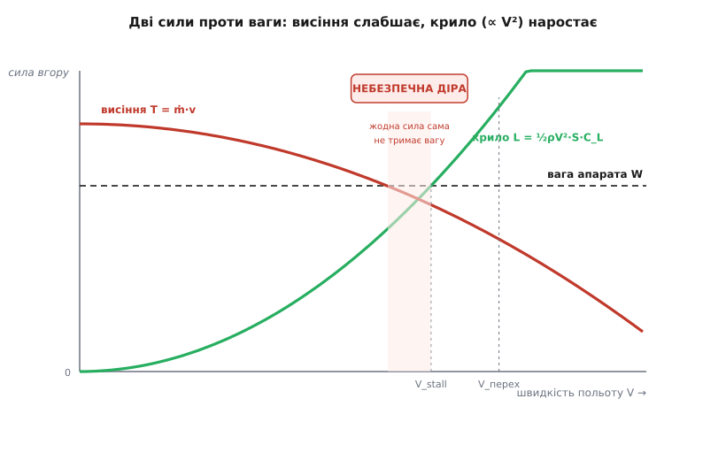
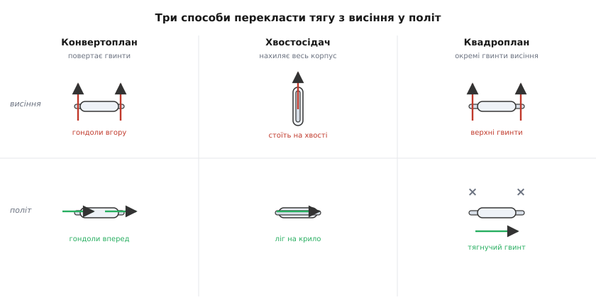

# VTOL-гібриди: дві фізики польоту в одному апараті

Є два цілком різні способи не впасти. Гелікоптер і мультикоптер тримаються в повітрі **прямою тягою вгору**: гвинти щосекунди відкидають донизу стільки повітря, що віддача врівноважує вагу. Літак же **не штовхає себе вгору взагалі** — його несе крило, яке коштує тяги лише на подолання опору, а не на утримання ваги. Це два різні контракти з природою, і кожен вигідний у своєму режимі. VTOL-апарат (англ. *Vertical Take-Off and Landing* — вертикальні зліт і посадка) — це спроба підписати **обидва контракти в одному літальному апараті**: злетіти вертикально, як коптер, а летіти далеко й економно, як літак. Уся складність — і вся фізика — сидить у мить, коли апарат мусить **перемкнутися з одного способу триматися в повітрі на інший**, не впавши посередині.

Розберемо, чому ці два способи такі різні за ціною, чому «посередині» — найнебезпечніше місце, і що саме має статися під час переходу, щоб апарат вижив.

## Чому висіти дорого, а летіти дешево

Порівняймо два способи утримання ваги на прикладі. Хай апарат важить m = 5 кг, тобто його вага — це сила

```
W = m·g = 5 · 9.81 ≈ 49 Н
```

**Спосіб перший — висіння.** Щоб зависнути, гвинти мусять щомиті відкидати вниз потік повітря з таким імпульсом, аби віддача давала 49 Н угору. Тут працює [третій закон Ньютона в реактивній формі](book:physics/thrust-vs-weight): тяга дорівнює масовій витраті повітря на швидкість, з якою його відкидають, T = ṁ·v. Важливо, **скільки** повітря і **як швидко** ви його женете. Прогнати багато повітря повільно — енергетично дешево; прогнати мало повітря дуже швидко — дорого, бо кінетична енергія росте з **квадратом** швидкості струменя, а тяга — лише лінійно. Саме тому в гелікоптера великий повільний ротор, а не маленька реактивна дірка: великий диск захоплює багато повітря й дає ту саму тягу меншою швидкістю струменя, отже меншою потужністю. Але навіть за найкращого великого диска висіння **безперервно палить енергію просто щоб не падати** — жодного метра вперед за цю потужність ви не проходите.

**Спосіб другий — політ на крилі.** Крило, рухаючись крізь повітря, відхиляє набіжний потік донизу й за тим самим третім законом отримує **піднімальну силу** (англ. *lift*) угору. Скільки саме — задає формула піднімальної сили:

```
L = ½ · ρ · V² · S · C_L
```

де ρ — густина повітря (біля землі ≈ 1.225 кг/м³), V — швидкість апарата відносно повітря, S — площа крила, а C_L — [коефіцієнт піднімальної сили](book:physics/fixed-wing-lift), безрозмірне число, що залежить від профілю крила й кута, під яким крило зустрічає потік. Уся суть — у **V²**: піднімальна сила росте з **квадратом швидкості**. Стоїш на місці — крило не несе нічого; розігнався вдвічі — несе вчетверо більше. Ключова величина під усім цим — [динамічний тиск](book:physics/dynamic-pressure) q = ½·ρ·V², напір набіжного потоку; піднімальна сила є просто цей напір, помножений на площу крила й на C_L.

І ось у чому виграш крила: щоб нести ту саму вагу 49 Н, воно **не витрачає тягу на утримання** — потік однаково тече повз, апарат однаково рухається вперед у своїй справі, а піднімальна сила виникає «задарма» як побічний наслідок руху. Тяга двигуна йде лише на подолання [аеродинамічного опору](book:physics/dynamic-pressure) — а він у доброго планера в 10–20 разів менший за вагу. Тобто там, де коптер безперервно витрачає силу ~49 Н тяги, щоб висіти, літак тієї самої ваги долає опір силою ~3–5 Н — і при цьому **летить уперед**, а не стоїть.

> 🔧 **Навіщо це.** Ось звідки береться вся мотивація VTOL-гібридів у реальній техніці: коптер може сісти на п'ятачок і зависнути над точкою, але його дальність — десятки хвилин, бо він палить енергію лише щоб не впасти; літак пролетить сотні кілометрів на тому самому запасі, але йому потрібна смуга для зльоту й він не вміє зупинитися в повітрі. Гібрид бере вертикальний зліт від коптера й далеку економну крейсерську фазу від літака. Ціна за це — важча конструкція (тягне на собі і гвинти висіння, і крило) і небезпечний перехід між режимами, який мусить надійно відпрацьовувати автопілот.

## Пастка посередині: діра, де ще не несе крило, але вже вимкнено висіння

Тепер видно найголовніше. Висіння коштує повної тяги на вагу, зате працює на **нульовій швидкості**. Крило коштує майже нічого, зате працює лише на **достатньо великій швидкості** — бо його піднімальна сила ∝ V². Отже, між нулем і крейсерською швидкістю є смуга, де апарат **надто швидкий, щоб зручно висіти, але надто повільний, щоб крило його несло**. Це і є фізична суть проблеми переходу.

Уведімо ключову величину — **швидкість звалювання** (англ. *stall speed*): найменшу швидкість, за якої крило ще здатне нести всю вагу. Прирівняймо піднімальну силу до ваги на максимально можливому C_L (більший кут атаки крило вже не тримає — потік зривається, крило «звалюється»):

```
½ · ρ · V_stall² · S · C_L_max = W
   →   V_stall = √( 2·W / (ρ · S · C_L_max) )
```

Нижче V_stall крило принципово не може втримати апарат — хоч як задирай кут, піднімальна сила менша за вагу, апарат провалюється. Тому перехід — це **гонка**: розігнати апарат крізь діапазон від нуля до понад-V_stall **раніше**, ніж висіння перестане його тримати. Поки швидкість мала, вагу тримають гвинти висіння; коли швидкість переходить V_stall із запасом, вагу перебирає крило, і висіння можна прибирати. А в самій діру, посередині, вагу тримають **обидва разом** — і саме тут будь-яка помилка означає провал висоти.


*Скільки ваги здатен нести кожен спосіб залежно від швидкості. Тяга висіння (спадна крива) повна на нулі й слабшає, коли апарат розганяється — гвинти висіння перестають ефективно гнати повітря вниз, бо самі рухаються вперед. Піднімальна сила крила (висхідна крива, ∝ V²) на нулі — нуль, і доростає до ваги лише на швидкості звалювання V_stall. Горизонтальна лінія — вага апарата. Небезпечна діра — зона, де жоден спосіб сам не дотягує до ваги; перехід мусить провести апарат крізь неї так, щоб сума двох сил ніколи не впала нижче ваги.*

Ось чому перехід роблять саме **розгоном уперед**, а не просто вимиканням гвинтів на висоті: треба встигнути «наростити» V², щоб крило підхопило вагу, перш ніж її відпустить висіння. Виконують це двома різними конструктивними школами — і фізика в них однакова, а от небезпека розкладена по-різному.

## Три способи перекластися: нахилити гвинт, нахилити весь апарат, поставити окремі мотори

Питання переходу зводиться до одного: **як перенаправити тягу** з «угору для висіння» на «вперед для розгону», не втративши підтримки ваги в проміжку. Природа задачі допускає рівно кілька відповідей, і кожна давно втілена в металі.

**Нахилити гвинти — конвертоплан (tiltrotor).** Гвинти сидять на поворотних гондолах на кінцях крила: угору — вони як ротори гелікоптера й тримають вагу тягою; повертаються вперед — стають тягнучими гвинтами літака, а вагу тим часом перебирає нерухоме крило, що вже набрало швидкість. Класичний доведений приклад — [конвертоплан V-22 Osprey](book:physics/vtol-transition/hist-tiltrotor.md), перший серійний апарат такого типу. Перевага: крило весь час горизонтальне, апарат летить «нормально». Складність: у проміжних кутах гондоли гвинт працює в химерному косому потоці, а вся маса двигунів гуляє на кінцях крила.

**Нахилити весь апарат — «хвостосідач» (tailsitter).** Апарат стоїть на хвості носом угору, злітає прямо як ракета на тязі власних гвинтів, а тоді **весь корпус нахиляється вперед**, аж поки крило не опиниться під потоком і не почне нести. Історично саме так літав перший у світі апарат, що виконав повний перехід уперед і назад, — [Convair XFY-1 Pogo (1954)](book:physics/vtol-transition/hist-tiltrotor.md). Механічно найпростіше — нема жодних поворотних вузлів, нахиляється все тіло; зате пілотові (чи автопілоту) важко: під час висіння апарат дивиться в небо, а орієнтири — збоку.

**Поставити окремі мотори — квадроплан (quadplane).** Найпоширеніша схема в сучасних безпілотниках: на планер літака навішують **окремий набір гвинтів висіння** (наприклад чотири, спрямовані вгору) **плюс окремий тягнучий гвинт** для крейсерського польоту. Висіння — вмикаються верхні гвинти; розгін — вмикається тягнучий гвинт, апарат набирає швидкість на крилі, після чого верхні гвинти просто **зупиняються**. Нічого не повертається — перекладання чисто «електричне», логікою газу. Платня — гвинти висіння в крейсері мертвим вантажем висять у потоці й дають опір, але зате схема проста й надійна, тому її й люблять.


*Три конструктивні відповіді на одне питання — куди діти тягу висіння. Конвертоплан повертає гондоли з гвинтами; хвостосідач нахиляє весь корпус; квадроплан тримає окремі гвинти для висіння й окремий тягнучий, вимикаючи перші після розгону. Фізика переходу спільна: у всіх трьох апарат мусить набрати швидкість понад звалювання, перш ніж зняти підтримку висіння.*

## Що робить автопілот у мить переходу

Для прошивки безпілотника перехід — це не одна дія, а **послідовність зі зворотним зв'язком за швидкістю**. Логіка (на прикладі квадроплана, найнаочнішого) така: апарат висить на верхніх гвинтах; вмикаємо тягнучий гвинт і починаємо розгін; **весь час стежимо за швидкістю**; поки вона нижча за безпечний поріг, верхні гвинти доти тримають висоту; щойно швидкість надійно перевищила звалювання — плавно (за кілька секунд, не ривком) прибираємо газ висіння, і апарат лишається на крилі. Назад — дзеркально, тільки обережніше: перш ніж зупинити апарат, треба ввімкнути висіння **завчасно**, поки крило ще несе, бо якщо вимкнути крило (сповільнитися нижче звалювання) раніше, ніж підхопить висіння, апарат провалиться.

Реальні автопілоти (ArduPilot, PX4) роблять саме це — блендять два способи польоту за поточною повітряною швидкістю. Ось скелет прямого переходу «висіння → крило» у стилі прошивки:

**Приклад (логіка прямого переходу квадроплана).** Апарат висить; треба перекластися на крило. Пороги: швидкість звалювання V_stall ≈ 12 м/с, безпечний поріг переходу беремо з запасом — V_trans = 15 м/с; газ висіння знімаємо плавно за 5 секунд, а не миттєво.

:::tabs
```c
// стан переходу: викликається щотакту керування (напр. 400 Гц)
// airspeed_mps — повітряна швидкість із давача (не land speed!)
#define V_TRANS   15.0f    // поріг, за яким крило надійно несе, м/с
#define SPINDOWN_MS  5000  // за скільки прибрати газ висіння

void transition_fwd_update(float airspeed_mps, uint32_t now_ms) {
    fwd_throttle = 1.0f;                 // тягнучий гвинт — на розгін

    if (airspeed_mps < V_TRANS) {
        // ще в «дірі»: крило не несе всю вагу — тримаємо висіння повністю,
        // висотний контур сам додає газу вгору, скільки треба
        hover_throttle = hover_alt_hold(); // повне утримання висоти
        t_reached = 0;                     // таймер спуску ще не пущено
    } else {
        // швидкість надійно понад звалювання — крило перебрало вагу.
        // прибираємо газ висіння ПЛАВНО, не ривком, за SPINDOWN_MS
        if (t_reached == 0) t_reached = now_ms;
        float k = (now_ms - t_reached) / (float)SPINDOWN_MS; // 0 → 1
        if (k > 1.0f) k = 1.0f;
        hover_throttle = hover_alt_hold() * (1.0f - k);       // згасання
        if (k >= 1.0f) mode = MODE_FIXED_WING;                // перехід завершено
    }
}
```
```python
# стан переходу: викликається щотакту керування (напр. 400 Гц)
# airspeed_mps — повітряна швидкість із давача (не land speed!)
V_TRANS     = 15.0    # поріг, за яким крило надійно несе, м/с
SPINDOWN_MS = 5000    # за скільки прибрати газ висіння

def transition_fwd_update(self, airspeed_mps, now_ms):
    self.fwd_throttle = 1.0               # тягнучий гвинт — на розгін

    if airspeed_mps < V_TRANS:
        # ще в «дірі»: крило не несе всю вагу — тримаємо висіння повністю,
        # висотний контур сам додає газу вгору, скільки треба
        self.hover_throttle = self.hover_alt_hold()  # повне утримання висоти
        self.t_reached = 0                           # таймер спуску ще не пущено
    else:
        # швидкість надійно понад звалювання — крило перебрало вагу.
        # прибираємо газ висіння ПЛАВНО, не ривком, за SPINDOWN_MS
        if self.t_reached == 0:
            self.t_reached = now_ms
        k = (now_ms - self.t_reached) / SPINDOWN_MS  # 0 → 1
        if k > 1.0:
            k = 1.0
        self.hover_throttle = self.hover_alt_hold() * (1.0 - k)  # згасання
        if k >= 1.0:
            self.mode = MODE_FIXED_WING              # перехід завершено
```
:::

Тут видно фізику в кожному рядку: газ висіння тримають **повним**, доки швидкість не перевищить порогу з запасом над звалюванням, і лише тоді **згладжено** його прибирають — щоб сумарна вертикальна сила (згасне висіння + наростає крило) ніколи не впала нижче ваги. Ривкове вимикання (замість плавного за секунди) означало б коротку, але фатальну провалину сили — апарат просів би тим більше, чим ближче швидкість до звалювання.

> 🔧 **Навіщо це.** Найтиповіша аварія гібрида стається саме в переході й саме через швидкість: давач повітряної швидкості (трубка Піто) забився чи бреше — автопілот «думає», що крило вже несе, знімає висіння, а насправді швидкості немає, і апарат падає з переходу. Тому в реальній прошивці поріг переходу беруть з відчутним запасом над розрахунковим звалюванням, стежать за справністю давача швидкості, а зворотний перехід (у висіння) починають завчасно. Розуміння, що піднімальна сила йде з V², а не з газу двигуна, — це і є розуміння, чому саме швидкість тут головна й чому за нею треба стежити суворіше, ніж за будь-чим іншим.

## Спільна нитка

Дві фізики польоту — це два різні способи взяти в повітря силу проти ваги. Висіння бере її **прямою тягою вгору** (T = ṁ·v): працює на нульовій швидкості, зате безперервно палить повну потужність лише щоб не падати. Крило бере її **з руху крізь повітря** (L = ½·ρ·V²·S·C_L): майже дармове, зате з'являється лише на швидкості й пропадає нижче звалювання V_stall = √(2W/(ρ·S·C_L_max)). VTOL-гібрид поєднує обидва, а вся небезпека сидить у **дірі посередині** — де апарат уже надто швидкий для зручного висіння, але ще надто повільний, щоб крило його несло. Перехід — це керована гонка крізь цю діру: розігнати V², щоб крило підхопило вагу, **раніше**, ніж її відпустить висіння, і тримати обидві сили в сумі не нижче ваги весь час переходу. Конструктивно тягу перенаправляють по-різному — повертаючи гвинти (конвертоплан), нахиляючи весь корпус (хвостосідач) чи вимикаючи окремі гвинти висіння (квадроплан), — але фізика в усіх одна: спершу швидкість, тоді знімай висіння, ніколи не навпаки.
