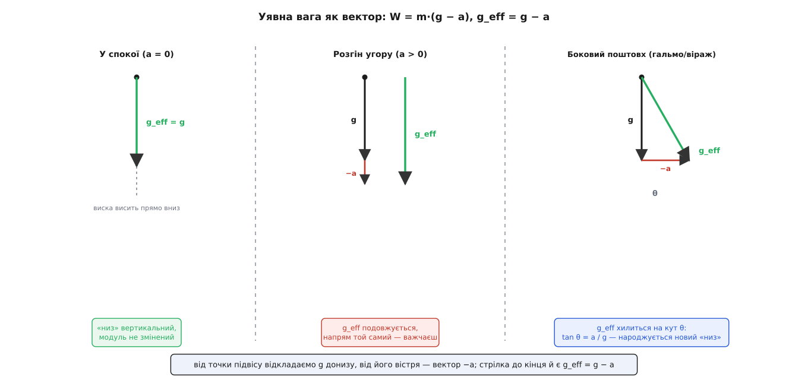
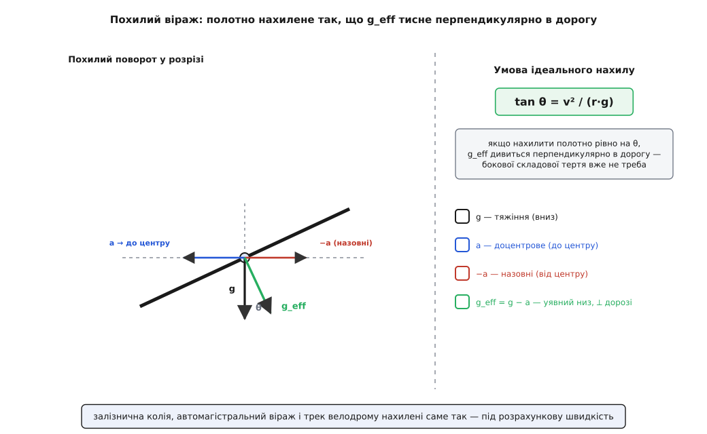

# 🧮 Уявна вага як вектор: чому «низ» — це g − a

Терези показують не тяжіння, а силу, з якою опора не пускає тіло падати. Поки опора нерухома, ця сила збігається з m·g числом, і різницю легко проґавити. Та щойно опора починає прискорюватися — рушає ліфт, гальмує вагон, закладає віраж автомобіль, обертається разом із тобою ціла планета — сила опори відходить від m·g. І відходить не лише величиною, а й **напрямом**: з'являється новий «низ», не той, що дивиться в центр Землі. Уся ця розмаїта поведінка — важчання в ліфті, кидок уперед при гальмуванні, крен виска у віражі, легшання на екваторі — вкладається в один-єдиний векторний рядок. Виведімо його від першопричини й подивімось, як він розгортається в кожну зі сцен.

## Розігрів: коли «низ» ще вертикальний

Почнімо з найпростішого — з вертикалі, де все скалярне. Людина стоїть на вагах у ліфті. Донизу її тягне тяжіння m·g; угору штовхає підлога з силою N — рівно тією, яку показують терези. Рівнодійна цих двох сил розганяє людину разом із кабіною. За [другим законом Ньютона](topic:physics/newtons-second-law), узявши «вгору» за додатний напрям, дістаємо:

```
N − m·g = m·a        ⇒        N = m·(g + a)
```

де a — прискорення кабіни (додатне, коли напрямлене вгору). Стоїть кабіна чи їде рівно (a = 0) — терези показують m·g. Розганяється вгору (a > 0) — важчаєш. Розганяється вниз (a < 0) — легшаєш. Обірвався трос і кабіна у вільному падінні (a = −g) — N = m·(g − g) = 0, вага зникла.

Формула проста, але вона тримається на мовчазному припущенні: усе відбувається вздовж однієї прямої. Тяжіння вниз, опора вгору, прискорення вгору-вниз — три стрілки на одній вертикалі, тож усе звелося до плюсів і мінусів. А що, коли підлога під тобою розганяється не вгору й не вниз, а **вбік**? Гальмівний вагон штовхає тебе вперед, віраж — назовні, і жоден із цих поштовхів не лежить на вертикалі. Скалярна арифметика тут безсила, бо саме поняття «вгору-вниз» починає пливти. Треба піднятися на щабель — від чисел до векторів.

## Повна векторна форма

Перепишімо той самий баланс сил, але вже нічого не припускаючи про напрями. На тіло, що їде на якійсь опорі — підлозі, кріслі, шальці терезів, — діють рівно дві реальні сили. Перша — тяжіння m·**g**, де **g** — вектор [поля тяжіння](topic:physics/newton-gravitation) (те прискорення, що його тіло дістало б від самого лише тяжіння), напрямлений приблизно до центра планети. Друга — сила з боку опори **S** (від латинського способу мислити реакцію), хоч куди б вона дивилася. Другий закон Ньютона у векторному вигляді, без жодних припущень про осі:

```
m·g + S = m·a
```

Тут **a** — справжнє прискорення тіла в [інерціальній системі відліку](topic:physics/inertial-frame); оскільки тіло їде разом з опорою, це і є прискорення самої опори. Виражаємо силу опори:

```
S = m·(a − g)
```

Це те, чим опора штовхає тіло. Але «вага» — це протилежне: сила, з якою **тіло тисне на опору**, той натиск на шальку, той упор у крісло, який ти й відчуваєш. За [третім законом Ньютона](topic:physics/newtons-third-law) тіло тисне на опору силою −**S**. Оце й є уявна вага — те, що показують терези й переживає тіло:

```
W = −S = m·(g − a)
```

Ось він, той обіцяний рядок. Уся уявна вага — вектор m·(**g** − **a**). Зручно виокремити з нього прискорення на одиницю маси й дати йому власне ім'я — **ефективне тяжіння**:

```
g_eff = g − a        ⇒        W = m · g_eff
```

І тепер прочитаймо, що ця формула насправді каже, бо каже вона багато. Усередині системи, що прискорюється з **a**, усе відбувається так, **наче замість справжнього тяжіння g діє інше поле g_eff**. Виска висне вздовж нього. Поверхня води в склянці стає перпендикулярною до нього. Твоє внутрішнє вухо називає його напрям «низом». Терези читають його модуль, помножений на масу. Це не математичний трюк, а глибокий факт: прискорена опора невідмінна від додаткового тяжіння — те саме твердження, що лежить в основі [принципу еквівалентності](topic:physics/equivalence-principle). Тіло, замкнене в кабіні без вікон, у принципі не може сказати, чи його вага виросла тому, що кабіна рвонула вгору, чи тому, що під нею раптом стала важча планета.

Перевірмо, що новий рядок не втратив старого. Вертикальний ліфт: беремо «вгору» за +, тоді **g** = (0, −g), а розгін угору дає **a** = (0, +a). Тоді:

```
g_eff = g − a = (0, −g) − (0, +a) = (0, −g − a)
```

Модуль — m·(g + a), напрям — донизу. Рівно колишнє N = m·(g + a). Вільне падіння, **a** = (0, −g): g_eff = (0, 0), нуль — невагомість. Скалярна формула була окремим випадком векторної, поставленим на вертикаль. А тепер знімімо тіло з вертикалі й пустімо опору вбік.


*Уявна вага як побудова вектора. З точки підвісу відкладаємо тяжіння g (донизу), від його вістря — вектор −a; стрілка від підвісу до кінця й є g_eff = g − a, уздовж неї висне виска. У спокої (a = 0) «низ» вертикальний. При розгоні вгору −a теж дивиться вниз, g_eff подовжується — важчаєш, але напрям той самий. При боковому прискоренні (гальмо, віраж) −a горизонтальний, і g_eff хилиться на кут θ, де tan θ = a/g: народжується новий «низ».*

## Уявний низ: модуль і нахил

Щойно **a** здобуває горизонтальну складову, вектор g_eff = **g** − **a** перестає дивитися вертикально — він **хилиться**. Розкладімо це на дві прості речі, які тіло справді відчуває: наскільки «низ» відхилився і наскільки він подужчав.

Візьмімо чистий випадок: тіло стоїть у полі тяжіння модуля g (вертикально вниз), а опора розганяється горизонтально з прискоренням модуля a. Тоді **g** і −**a** взаємно перпендикулярні, і g_eff — гіпотенуза прямокутного трикутника з катетами g та a:

```
модуль:  |g_eff| = √(g² + a²)
нахил:   tan θ = a / g      (θ — кут від справжньої вертикалі)
```

Обидві формули варто відчути на дотик. Модуль **завжди більший** за g: боковий поштовх не полегшує тіло, а робить його трохи важчим, бо додає до тяжіння перпендикулярну складову (√(g²+a²) > g при будь-якому a ≠ 0). А нахил каже, куди з'їхав «низ»: у бік, **протилежний** до прискорення опори. Опора рвонула вперед — «низ» відхилився назад; опора смикнула вліво — «низ» поїхав вправо. Це прямо випливає зі знаку −**a** у формулі: у g_eff входить не саме прискорення, а взяте навпаки.

> 🔧 **Навіщо це.** «Уявний низ» — не абстракція, а те, за чим калібрують прилади й будують дороги. Гіроскопічний горизонт літака, давач нахилу, бульбашковий рівень — усі вони показують не напрям на центр Землі, а напрям g_eff, тобто рівнодійну тяжіння й прискорення носія. Тому в літаку, що розганяється по злітній смузі, «штучний горизонт», зроблений із простого виска, брехав би — показував би задертий ніс, хоч літак ще котиться рівно: боковий g_eff нахилив би його. Справжні авіагоризонти саме тому будують на гіроскопі, який тримається за напрям у просторі й не ведеться на прискорення. А там, де «низ» навмисне зсувають — на віражах доріг і треків — цей самий нахил роблять союзником, а не завадою.

## Гальмівний вагон: чому кидає вперед

Тепер конкретно. Вагон їде рівно, і раптом машиніст б'є по гальмах. Прискорення вагона **a** дивиться **назад** (проти руху) — це й означає гальмувати. У формулі g_eff = **g** − **a** віднімання оберненого напряму дає додавання прямого: −**a** дивиться **вперед**. Отже, ефективне тяжіння набуває горизонтальної складової вперед, і «низ» хилиться туди ж — уперед по ходу.

Саме тому виска у вагоні, петля з ременя, склянка чаю на столику хитаються **вперед** при гальмуванні, і туди ж тебе тягне з крісла. Не якась загадкова сила штовхає тіло вперед — просто «низ» на мить переїхав уперед, і тіло, як завжди, посунулося «донизу», тільки цей «низ» тепер похилий.

**Гальмівний вагон.** Тверде службове гальмо дає близько a = 3.0 м/с². Куди й наскільки з'їде «низ» і як зміниться вага?

```
дано:    a = 3.0 м/с² (уперед у g_eff),   g = 9.8 м/с²
нахил:   tan θ = a / g = 3.0 / 9.8 = 0.306   →   θ ≈ 17°
модуль:  |g_eff| = √(g² + a²) = √(9.8² + 3.0²) = √105.0 = 10.25 м/с²
вага:    |g_eff| / g = 10.25 / 9.8 = 1.046   →   на 4.6% важчий
```

«Низ» з'їхав на 17° уперед, а тіло водночас поважчало на 4.6%. Обидва ефекти живуть в одному векторі: похилий і трохи довший g_eff. Пасажир прочитує це як поштовх уперед і легкий притиск — але фізично його просто на мить нахилили разом із «низом» і придавили дужче.

## Віраж і чому дорогу нахиляють

Замість гальмувати, звернімо. Автомобіль на швидкості v проходить поворот радіуса r. Щоб рухатися по колу, йому потрібне [центрострімке прискорення](topic:physics/centripetal-acceleration), напрямлене до центра повороту, модуля a = v²/r. Отже, **a** дивиться всередину віражу — а −**a** назовні, і «низ» хилиться назовні від повороту. Тому у віражі тебе тисне до зовнішніх дверей, і виска, і рідина в баку відхиляються назовні.

**Віраж.** Автомобіль на v = 20 м/с (72 км/год) проходить поворот r = 100 м.

```
дано:      v = 20 м/с,   r = 100 м,   g = 9.8 м/с²
доцентр.:  a = v² / r = 400 / 100 = 4.0 м/с²   (до центра повороту)
нахил:     tan θ = a / g = 4.0 / 9.8 = 0.408   →   θ ≈ 22°
модуль:    |g_eff| = √(9.8² + 4.0²) = √112.0 = 10.58 м/с²   (на 8% важчий)
```

І тут криється інженерне рішення, яке видно просто з геометрії g_eff. На **пласкій** дорозі похилий «низ» означає, що частину роботи мусить робити тертя шин убік — бо g_eff тисне не прямо в дорогу, а навскіс, і без бокового тертя машину знесло б назовні. А що, коли **нахилити саму дорогу** рівно на той кут θ, на який похилився «низ»? Тоді g_eff дивитиметься точно перпендикулярно до полотна — прямо «в сидіння», — і жодної бокової складової не залишиться. Машина триматиметься віражу навіть на слизькому, а пасажир відчує лише твердший притиск донизу, без заносу вбік. Умова ідеального віражу — коли нахил полотна дорівнює нахилу уявного низу:

```
tan θ_нахилу = v² / (r · g)
```

Саме тому нахиляють залізничну колію в кривій, зовнішній край автомагістральних поворотів і — найкрутіше — трек велодрому: усі вони підставляють полотно перпендикулярно до g_eff на розрахунковій швидкості. Один вектор m·(**g** − **a**) пояснює і кидок у вагоні, і крен у повороті, і форму дорожнього віражу.


*Чому криві доріг нахиляють. У повороті доцентрове прискорення a дивиться до центра, тож −a — назовні; уявний низ g_eff = g − a хилиться назовні на кут θ, де tan θ = v²/(r·g). Якщо полотно нахилити рівно на цей θ, g_eff тисне строго перпендикулярно в дорогу — бокової складової нема, машину не зносить, а пасажир чує лише твердший «низ». Так роблять залізничну колію, автомагістральні віражі й трек велодрому.*

## Земля, що обертається: найбільший віраж

А тепер найкрасивіше. Людина «спокійно стоїть» на екваторі. Спокійно — та невже? Насправді вона мчить велетенським колом навколо земної осі, роблячи повний оберт за добу, зі швидкістю близько 460 м/с. Її прискорення в інерціальній системі — не нуль: це доцентрове прискорення до осі обертання. Отже, «стояти на Землі» — це і є їхати на найбільшому у світі віражі, і наша формула зобов'язана це врахувати.

Прискорення **a** тут — доцентрове, напрямлене до **осі** обертання (не до центра планети!), модуля ω²·ρ, де ω — [кутова швидкість](topic:physics/angular-velocity) Землі, а ρ — відстань від осі. На широті φ ця відстань ρ = R·cos φ, тож a = ω²·R·cos φ. Підставляємо в ефективне тяжіння, беручи за **g** справжнє тяжіння до центра:

```
g_eff = g_справж − a_доцентр
```

Оскільки a_доцентр дивиться **до** осі, віднімання −**a** додає складову **від** осі, назовні — те саме «відцентрове» полегшення, знайоме з обертових систем. (Ту саму g_eff можна дістати й іншим шляхом — сівши в обертову з Землею [неінерціальну систему](topic:physics/inertial-frame) й увівши відцентрову силу як фіктивну; результат тотожний, бо обидва описи говорять про той самий рух.) Порахуймо масштаб цього полегшення на екваторі, де ρ = R:

```
ω = 2π / 86164 с = 7.292·10⁻⁵ рад/с           (доба зоряна, не сонячна)
R (екваторіальний) = 6.378·10⁶ м
a = ω²·R = (7.292·10⁻⁵)² · 6.378·10⁶ = 0.0339 м/с²
             що є 0.0339 / 9.78 ≈ 0.35% від g
```

Лише третина відсотка — мізер проти самого тяжіння. Але ця третина відсотка цілком вимірна, і вона розгортається у два виразні наслідки: різницю ваги між екватором і полюсом та відхилення виска від напряму на центр планети.

**Наскільки легшаєш на екваторі.** Терези чують лише вертикальну складову g_eff. На екваторі доцентрове прискорення строго вертикальне (вісь лежить у площині горизонту), тож віднімається все ω²R; на полюсі ρ = 0 і доцентрового члена нема зовсім. Різниця ваги між полюсом і екватором:

```
лише обертання:      Δg = ω²·R = 0.0339 м/с²  =  0.35%
виміряна (з формою): Δg = 9.8322 − 9.7803 = 0.0519 м/с²  =  0.53%
людина 70 кг:  полюс − екватор = 70 · 0.0519 / 9.81 ≈ 0.37 кгс
```

Само обертання дає 0.35%, а виміряна різниця — цілих 0.53%, бо до відцентрового полегшення додається другий чинник: Земля сплюснута, екватор далі від центра, а на більшій відстані [власне тяжіння](topic:physics/newton-gravitation) слабше. Обидва внески тягнуть в один бік. Людина в 70 кг на екваторі показує на терезах приблизно на 0.37 кгс менше, ніж на полюсі, — не набравши й не втративши жодного грама маси.

**Чому виска не показує в центр Землі.** Поза екватором і полюсами доцентрове прискорення до осі **не** лежить на місцевій вертикалі — воно похиле. Тому g_eff = g_справж − a хилиться від напряму на центр, і виска висне «не в центр». Розкладемо a на вертикальну й горизонтальну частини (проєкція — через [скалярний добуток](topic:math/dot-product) на місцеві орти): горизонтальна складова, що хилить нитку, дорівнює ω²R·cos φ·sin φ = ½·ω²R·sin 2φ. Кут відхилення виска від радіуса на центр:

```
tan δ ≈ (½·ω²·R·sin 2φ) / g      →      максимум на φ = 45°
δ(45°) ≈ ω²·R / (2g) = 0.0339 / (2·9.8) = 0.00173 рад ≈ 6′ (кутових хвилин)
```

На екваторі й на полюсі відхилення нульове — там a лежить на одній прямій із тяжінням, і сумі нема куди хилитися. А на середній широті виска дивиться приблизно на шість кутових хвилин ближче до полюса, ніж на центр планети. Для ока — дрібниця, десята частка градуса; для геодезії — принципова поправка, бо «низ» будівельника й напрям на центр Землі — це, строго кажучи, різні напрями скрізь, крім екватора й полюсів. (На реальній сплюснутій Землі повне відхилення виска — різниця геодезичної й геоцентричної широт — сягає ще більшого, близько 11.5′, бо до обертання додається нахил самого еліпсоїда, який те ж обертання й виліпило.)

Це похилення виска — не курйоз, а насінина, з якої виростає форма планети: рідка поверхня заспокоюється лише там, де вона всюди перпендикулярна до g_eff, і Земля роздувається на екваторі саме доти, доки перекошений «низ» знову не стане прямовисним до поверхні. Повний ланцюг — від відцентрового вектора через відхилення виска до сплюснутого геоїда й теореми Клеро — розгорнуто в окремій викладці про [ефективне тяжіння](topic:physics/centrifugal-force/math-effective-gravity.md); тут важило показати, що вся ця планетарна історія починається з того самого рядка m·(**g** − **a**), лишень із **a**, спрямованим до осі.

## Один рядок — чотири обличчя

Варто спинитися й побачити ціле. Уся уявна вага — це один вектор:

```
W = m·(g − a) = m·g_eff,       g_eff = g − a
```

і різні на позір явища — то просто різні напрями та величини прискорення опори, підставлені в нього:

```
ліфт:   a — вертикальне       →  g_eff вздовж вертикалі, довший або коротший (важчаєш / легшаєш / невагомість при a = −g)
вагон:  a — назад (гальмо)     →  g_eff хилиться вперед, tan θ = a/g (кидає вперед)
віраж:  a — до центра, v²/r    →  g_eff хилиться назовні; нахили полотно на θ — і зникне занос
Земля:  a — до осі, ω²R·cosφ   →  g_eff легший і похилий: вага екватор−полюс і виска не в центр
```

«Низ», якому ти довіряєш — виска, бульбашка рівня, тягар у животі при розгоні, — це завжди напрям g_eff, а не чистого **g**. Вони збігаються лише тоді, коли **a** = 0, тобто коли опора під тобою нічого не робить. Але на планеті, що обертається, повного спокою немає ніде, крім осі; тож, строго кажучи, «прямо вниз» майже завжди трішки не туди, куди здається. Терези недарма міряють не тяжіння, а натиск на опору: вони чесно показують модуль того самого вектора m·(**g** − **a**), хай куди б він показував.
