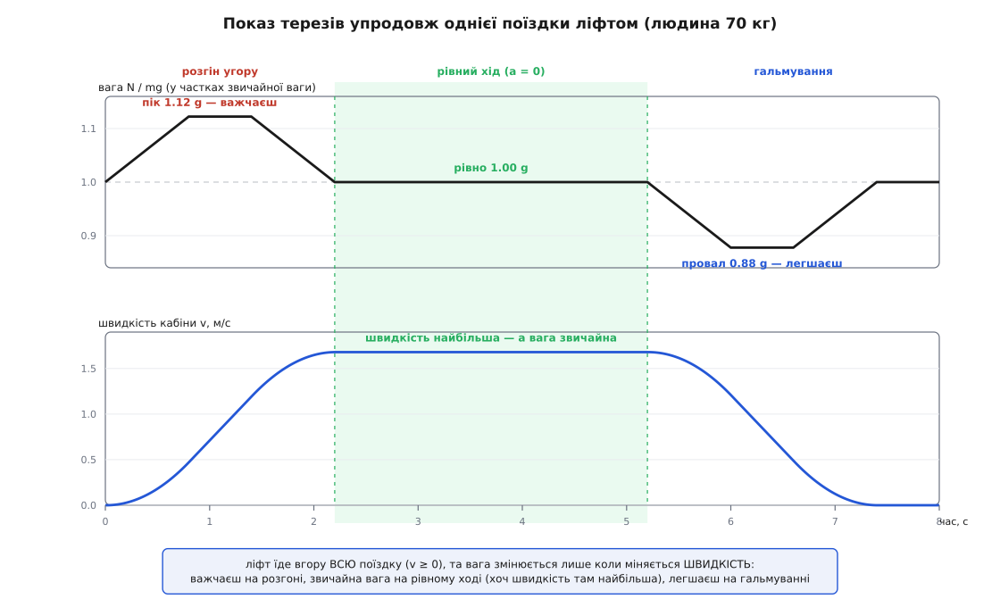
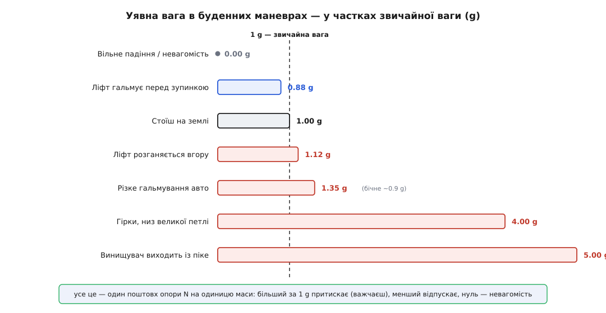

# ⚙️ Поїздка ліфтом у коді: як пливе показ терезів

Окремі знімки — спокій, розгін, зупинка — ловлять крайні стани, але ховають найживіше: як число на шкалі **перетікає** з одного в інше протягом однієї-єдиної поїздки. Терези під ногами не мовчать між поверхами — вони весь час щось показують, і показ той дихає. Напишімо код, що жене людину крізь реалістичну поїздку й друкує уявну вагу щомиті. Тоді горб на старті, рівне число посеред дороги й провал перед зупинкою постануть не як три окремі задачки, а як одна плавна крива.

Уся фізика вміщається в одному рядку: сила, з якою підлога підпирає тіло, дорівнює

```
N = m · (g + a)
```

де a — прискорення кабіни (додатне вгору). Це прямий висновок [другого закону Ньютона](book:physics/newtons-second-law) для тіла, яке підлога розганяє разом із собою: рівнодійна N − m·g надає масі m прискорення a. Терези показують саме N. Отже, щоб намалювати всю поїздку, досить задати a(t) — як міняється прискорення кабіни в часі — і прогнати його через цю формулу.

## Ідея: прискорення не вмикається рубильником

Найпростіше було б узяти a стрибком: нуль → +1.2 м/с² на розгоні → знову нуль. Але такий профіль **брехливий** — і тіло, і математика це відчувають. Миттєвий стрибок прискорення означає нескінченний [ривок](book:physics/jerk) — швидкість зміни самого прискорення, третю похідну координати за часом. У кабіні це відчувається як різкий удар знизу, наче хтось буцнув підлогу. Жоден пристойний ліфт так не їздить.

Тому справжні ліфти прискорення **нарощують** — плавно розганяють і плавно відпускають, тримаючи ривок у комфортних межах. Пасажири переносять вертикальний ривок близько 2 м/с³ як прийнятний, а вже 6 м/с³ — як нестерпний; для лікарняних ліфтів беруть ще делікатніші 0.7 м/с³, а типова стеля пасажирського — приблизно 1.5–2.5 м/с³. Крива швидкості від цього виходить у формі витягнутої літери S: спершу прискорення плавно росте від нуля, тримається на межі, плавно спадає назад до нуля — і аж тоді швидкість стала.

Складімо з таких ділянок весь маршрут. Прискорення проходить сім відрізків: наростання вгору → тримання на a_max → спад до нуля (розгін завершено) → рівний хід із a = 0 → і дзеркально те саме зі знаком мінус на гальмуванні. Візьмімо реалістичні числа: межа прискорення a_max = 1.2 м/с², час наростання й спаду t = 0.8 с. Тоді ривок виходить

```
ривок = a_max / t = 1.2 / 0.8 = 1.5 м/с³
```

— рівно на нижньому краю комфортної стелі. Це не іграшкові числа: така кабіна за поїздку підніметься майже на дев'ять метрів, десь на два-три поверхи.

## Код: женемо профіль і друкуємо N(t)

Профіль руху зручно задати однією функцією `accel(t)`, а швидкість і висоту здобути **покроковим інтегруванням** — маленькими кроками dt накопичуючи спершу швидкість зі прискорення, потім координату зі швидкості. Python тут ідеальний: числовий часовий ряд читається як формула.

```python
m = 70.0          # маса пасажира, кг
g = 9.8           # прискорення вільного падіння, м/с²

# Профіль реалістичного пасажирського ліфта
a_max    = 1.2    # межа прискорення, м/с²
t_ramp   = 0.8    # час наростання й спаду прискорення, с  → ривок = 1.5 м/с³
t_hold   = 0.6    # тривалість сталого прискорення, с
t_cruise = 3.0    # рівний хід, с

# Межі семи фаз у часі: наростання → тримання → спад,
# рівний хід, і дзеркально те саме на гальмуванні
t1 = t_ramp                 # 0.8  кінець наростання a вгору
t2 = t1 + t_hold            # 1.4  кінець сталого +a_max
t3 = t2 + t_ramp            # 2.2  a повернулось до 0 — розгін завершено
t4 = t3 + t_cruise          # 5.2  кінець рівного ходу
t5 = t4 + t_ramp            # 6.0  кінець наростання гальмування
t6 = t5 + t_hold            # 6.6  кінець сталого −a_max
t7 = t6 + t_ramp            # 7.4  повна зупинка
t_end = t7 + 0.6            # 8.0  трохи постояли на поверсі

def accel(t):
    """Прискорення кабіни в момент t (додатне — вгору)."""
    if t < t1:  return  a_max * (t / t_ramp)             # ривок:  0 → +a_max
    if t < t2:  return  a_max                             # тримаємо +a_max
    if t < t3:  return  a_max * (1 - (t - t2) / t_ramp)   # ривок: +a_max → 0
    if t < t4:  return  0.0                               # рівний хід — прискорення нуль
    if t < t5:  return -a_max * ((t - t4) / t_ramp)       # ривок:  0 → −a_max
    if t < t6:  return -a_max                             # тримаємо −a_max
    if t < t7:  return -a_max * (1 - (t - t6) / t_ramp)   # ривок: −a_max → 0
    return 0.0                                            # стоїмо на поверсі

dt = 0.001                                    # крок інтегрування, с
samples = [0.0, 0.8, 1.4, 2.2, 3.7, 5.0, 6.0, 6.6, 7.4, 8.0]

print(" t,с   a,м/с²   v,м/с    N,Н   N/mg   терези,кг")
v = x = 0.0
si = 0
for i in range(int(round(t_end / dt)) + 1):
    t = i * dt
    a = accel(t)
    N = m * (g + a)                           # уявна вага цієї миті
    if si < len(samples) and t >= samples[si] - 1e-9:
        print("%5.1f  %+6.2f  %6.2f  %5.0f  %5.3f    %5.1f"
              % (t, a, v, N, N / (m * g), N / g))
        si += 1
    v += a * dt                               # спершу швидкість зі прискорення
    x += v * dt                               # потім координату зі швидкості

print("\nпіднялись на %.2f м, кінцева швидкість %.4f м/с" % (x, v))
```

Прогін друкує уявну вагу в кількох показових точках — у ньютонах, у частках звичайної ваги (N/mg) і одразу перекладену в «кілограми» на шкалі (N/g):

```
 t,с   a,м/с²   v,м/с    N,Н   N/mg   терези,кг
  0.0   +0.00    0.00    686  1.000     70.0
  0.8   +1.20    0.48    770  1.122     78.6
  1.4   +1.20    1.20    770  1.122     78.6
  2.2   +0.00    1.68    686  1.000     70.0
  3.7   +0.00    1.68    686  1.000     70.0
  5.0   +0.00    1.68    686  1.000     70.0
  6.0   -1.20    1.20    602  0.878     61.4
  6.6   -1.20    0.48    602  0.878     61.4
  7.4   +0.00    0.00    686  1.000     70.0
  8.0   +0.00    0.00    686  1.000     70.0

піднялись на 8.74 м, кінцева швидкість 0.0000 м/с
```

## Що каже стрічка

Прочитаймо її як історію. Перші секунди (0.0 → 2.2) — розгін: прискорення наростає до +1.2, вага стрибає з 686 до **770 Н** — ти на п'яту частину важчий, терези пишуть майже 79 кг, і живіт ловить оте знайоме притиснення. Далі (2.2 → 5.2) — рівний хід: прискорення падає до нуля, і вага **точно повертається до 686 Н**, до звичних 70 кг. А тепер найголовніше в усій таблиці: о 3.7 с і о 5.0 с кабіна летить угору **найшвидше за всю поїздку** — 1.68 м/с, — а вага звичайнісінька. Перед зупинкою (6.0 → 7.4) прискорення стає −1.2, вага провалюється до **602 Н**, до 61 кг: тебе відпускає, і в животі знову ворухнеться. О 7.4 с кабіна стала — вага знову 686.


*Уявна вага впродовж однієї поїздки. Верхня крива — N/mg: горб до 1.12 g на розгоні, рівно 1.00 g на рівному ході, провал до 0.88 g на гальмуванні. Нижня — швидкість кабіни: вона додатна всю поїздку (ліфт увесь час іде вгору) і найбільша якраз посеред зеленої смуги, де вага звичайна. Вага стежить не за швидкістю, а за її зміною.*

Оце «рівно 686 на середині, хоч швидкість там найбільша» — і є та несподіванка, заради якої писався код. Розгорнутий часовий ряд показує те, чого не видно на статичних знімках: рух угору сам собою нічого не важить.

## Пастка: швидкість — не прискорення

Найпоширеніша хиба звучить так: «ліфт іде вгору — отже, я весь час важчий». Стрічка розбиває її вщент. Погляньмо на стовпчик швидкості: v додатна **всю дорогу** від 0.8 до 7.4 с — кабіна ані на мить не рухається вниз, вона тільки й робить, що піднімається. А вага за той самий час встигла побути і більшою за норму, і рівно нормальною, і меншою. Якби вагу диктувала швидкість, вона трималася б високо всю поїздку. Натомість вага стежить за **прискоренням** — за тим, як швидкість *міняється*, а не яка вона. На рівному ході швидкість велика, але стала, a = 0, і N = m·g до останнього ньютона.

Звідси й правило знака, на якому теж спотикаються. У формулу входить не «напрямок їзди», а `a` зі своїм знаком: додатне (прискорення вгору) додається до g і робить важчим; від'ємне (прискорення вниз) віднімається й робить легшим. І тут криється підступ: на **гальмуванні перед верхнім поверхом** кабіна ще їде вгору (v > 0), але вже сповільнюється, тобто прискорення напрямлене **вниз** — a < 0, — і вага провалюється. Рух і прискорення дивляться в різні боки. У коді це видно прямо: гілка, що вмикається при t між t4 і t7, повертає `-a_max` — мінус, дарма що кабіна ще піднімається. Плутати напрямок руху зі знаком прискорення — найшвидший спосіб отримати неправильну вагу.

## Ті самі формули — для будь-якого маневру

Ліфт — лише наймирніший представник цілого племені. Варто виразити вагу в частках g, як стане видно: розгін авто, гальмування, віраж, петля гірок, вихід літака з піке — усе це той самий поштовх опори, узятий у різних дозах. Розширмо код на кілька маневрів. Тільки тепер треба розрізняти напрямок прискорення відносно тяжіння.

Коли опора штовхає **вздовж** тяжіння (вертикально), уявна вага додається просто, як у ліфті: n = (g + a)/g. А коли **впоперек** — як під час гальмування авто, що жбурляє тебе вперед на ремінь, — до звичного 1 g вниз додається горизонтальний штовхан убік, і повна вага виходить **векторною сумою**: n = √(1 + (a/g)²), нахилена вперед.

```python
import math

g = 9.8

# Кожен маневр: величина прискорення (м/с²) і його напрямок відносно тяжіння
maneuvers = [
    ("Вільне падіння / невагомість",  -9.8,      "верт"),
    ("Ліфт гальмує перед зупинкою",   -1.2,      "верт"),
    ("Стоїш на землі",                 0.0,      "верт"),
    ("Ліфт розганяється вгору",        1.2,      "верт"),
    ("Різке гальмування авто",         0.9 * g,  "гориз"),   # ≈ 0.9 g назад
    ("Гірки: низ великої петлі",      29.4,      "верт"),    # v²/r угору
    ("Винищувач виходить із піке",    39.2,      "верт"),    # v²/r угору
]

print(" маневр                          n = вага/mg   відчуття")
for name, a, direction in maneuvers:
    if direction == "верт":
        n = (g + a) / g                       # вздовж тяжіння — додається
    else:
        n = math.sqrt(1 + (a / g) ** 2)       # впоперек — векторна сума
    feel = ("невагомість" if n < 0.05 else
            "легшаєш"     if n < 0.98 else
            "звичайно"    if n < 1.03 else
            "притискає")
    print("  %-30s   %4.2f g      %s" % (name, n, feel))
```

```
 маневр                          n = вага/mg   відчуття
  Вільне падіння / невагомість     0.00 g      невагомість
  Ліфт гальмує перед зупинкою      0.88 g      легшаєш
  Стоїш на землі                   1.00 g      звичайно
  Ліфт розганяється вгору          1.12 g      притискає
  Різке гальмування авто           1.35 g      притискає
  Гірки: низ великої петлі         4.00 g      притискає
  Винищувач виходить із піке       5.00 g      притискає
```

Два останні рядки — це вже **перевантаження**, і числа в них не з повітря. На дні петлі чи в нижній точці виходу з піке апарат мчить по дузі, і крісло мусить не лише тримати вагу тіла, а й закручувати його по колу — надавати [центрострімкого прискорення](book:physics/centripetal-acceleration) v²/r, напрямленого вгору, до центра дуги. Тому опора тисне з силою m·g + m·v²/r, і

```
n = 1 + (v²/r) / g
```

Гірки, що проходять низ петлі радіусом 15 м на швидкості 21 м/с (76 км/год), дають v²/r = 441/15 ≈ 29.4 м/с² — рівно 3 g понад звичну вагу, разом 4 g. Винищувач, що виходить із піке по дузі радіусом 500 м на 140 м/с (504 км/год), додає 39.2 м/с² — 4 g понад норму, разом 5 g: кров відпливає від голови, і без протиперевантажувального костюма пілот сірітиме в очах. Бойові розвороти сягають і 9 g — межі, яку витренуване тіло тримає лічені секунди. У другий бік та сама шкала веде до нуля: вільне падіння дає рівно 0 g — невагомість, той самий обірваний ліфт, тільки без дна.


*Ті самі маневри стовпчиками — уявна вага в частках звичайної ваги. Пунктир на 1 g — звичне тіло на землі. Усе, що ліворуч від нього, відпускає (аж до невагомості), усе, що праворуч, притискає (аж до перевантаження). Різні явища — а величина одна: поштовх опори на одиницю маси.*

## Складність і пастки

Обчислювально задача копійчана: один прохід O(N) по N кроках, жодної важкої математики — самі додавання. Уся її тонкість не в швидкодії, а в чесності моделі й у знаках.

**Крок інтегрування.** Ми брали найпростіший явний метод (Ейлера): v += a·dt, x += v·dt. Він накопичує похибку, тим більшу, чим грубіший dt. Для нашого гладкого профілю це не біда — з dt = 0.001 с кінцева швидкість виходить 0.0000 м/с, тобто розгін і гальмування зійшлися ідеально, бо S-крива симетрична. Але сама по собі вага N = m·(g + a) **не інтегрується** — вона рахується прямо з a(t) цієї миті, тож на її точність dt взагалі не впливає. Інтегрування потрібне лише для швидкості й висоти — щоб було чим спростувати хибу «швидкість = вага».

**Знак прискорення** — головна пастка, і варто ще раз її прибити. `a` у формулі — це проєкція прискорення на вертикаль із урахуванням напрямку, а не «швидкість» і не «напрямок руху». Гальмування спусклого ліфта (їде вниз, сповільнюється) дає a > 0 — вага росте; гальмування підйомного (їде вгору, сповільнюється) дає a < 0 — вага падає. Той самий рух «вниз» дає протилежні ваги залежно від того, розганяється кабіна чи спиняється. Одна переплутана буква — і вся стрічка бреше.

**Вертикаль проти горизонталі.** Додавати n = (g + a)/g можна лише вздовж тяжіння. Для бічних прискорень (гальмування, віраж) вага — векторна сума, n = √(1 + (a/g)²), і вона завжди більша за одиницю: убік штовхнути можна, а от зменшити вагу горизонтальний ривок не годен — він лише нахиляє й подовжує вектор. Зліпити горизонтальний штовхан просто в число (g + a) — типова помилка, що завищує ефект.

**Дискретні відліки.** Ми друкували вагу лише в кількох точках — цього досить, щоб побачити три режими, але провал і горб між відліками можуть бути трохи гострішими. Хочеш повну криву без розривів — зменшуй dt і відліки, і профіль проступить суцільною лінією, точнісінько як на верхньому графіку. Головне не сплутати рідкість друку з рідкістю самої моделі: кабіна прискорюється гладко, навіть коли ми зазираємо на неї раз на пів секунди.
