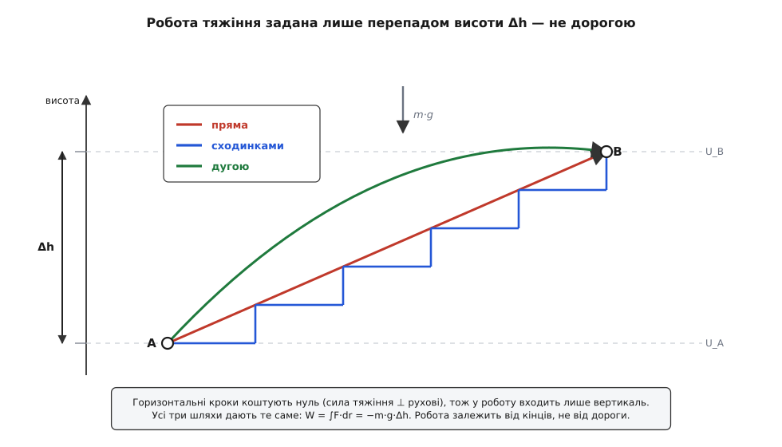
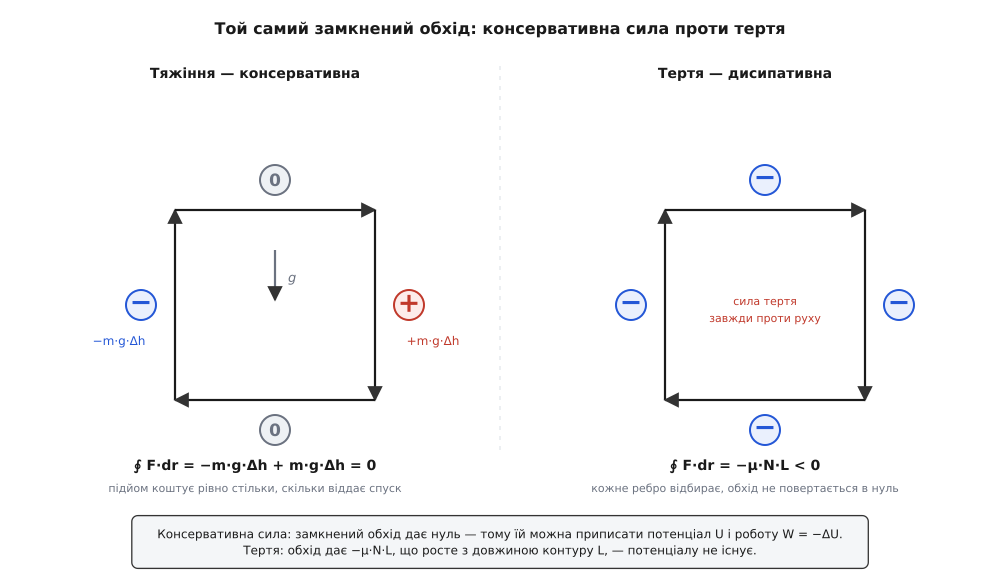

# 🧮 Криволінійний інтеграл роботи й консервативні сили

Проста формула W = F·d·cosθ мовчки припускає, що і сила, і дорога — прямі та незмінні: тіло їде по прямій, сила тримається сталою, кут між ними один на весь шлях. Природа рідко така поблажлива. Планета обходить Сонце еліпсом, і тяжіння повертається разом із нею; заряд в'ється між пластинами, і поле щомиті дивиться інакше; візок котиться пагорбами, і схил під ним то крутіший, то пологіший. Щоб дістати з такого руху чесне число роботи, доводиться йти за тілом **крок за кроком**, і на кожному крихітному кроці питати одне: наскільки сила підштовхнула тіло саме вздовж цього кроку. Сума цих дрібних внесків і є справжня, загальна робота — а записана строго, вона зветься **криволінійний інтеграл** сили вздовж шляху.

І щойно ми навчимося його рахувати, вигулькне річ несподівана й глибока. Для одних сил виткий шлях не важить анітрохи: хоч як тіло петляло від початку до кінця, робота виходить та сама, задана лише двома точками — звідки й куди. Для інших — важить кожен метр дороги. Цей розкол ділить усі сили світу на дві родини й дає механіці її найпотужніший інструмент — потенціальну енергію. Розберімо і сам інтеграл, і цей розкол, від першопричини.

## Сума F·dr уздовж шляху

Візьмімо тіло, що суне довільною кривою з точки A в точку B. Посічемо його шлях на такі короткі плечі, що на кожному і сила майже стала, і сам шлях майже прямий. Одне таке плече — це маленький вектор переміщення dr: він показує, куди й наскільки тіло зрушило на цьому кроці. Робота сили на цьому плечі — [скалярний добуток](topic:math/dot-product) сили на переміщення:

```
dW = F·dr = |F|·|dr|·cosθ
```

де θ — кут між силою і напрямом кроку. Скалярний добуток тут не примха запису, а сама суть справи. Розклади силу на дві частини: F∥ уздовж кроку dr і F⊥ упоперек нього. Поперечна частина штовхає тіло вбік від його ж напряму — і за нескінченно короткий крок нічого вздовж дороги не творить: F⊥·dr = 0, бо ці вектори перпендикулярні. Лишається тільки поздовжня частина, і саме її вилущує cosθ. Скалярний добуток — це машинка, що з двох векторів бере рівно ту проєкцію одного на одного, яка й робить роботу, а решту чесно відкидає.

Тепер склади всі плеча вздовж шляху й згусти крок до нуля — дрібні суми зіллються в інтеграл:

```
W = ∫  F·dr        (уздовж шляху від A до B)
```

Це й є повне означення роботи. Щоб його порахувати, шлях **параметризують** — задають рух як функцію одного біжучого числа t (часу чи пройденої довжини): r(t) креслить криву, а похідна dr/dt каже, куди й як швидко тіло йде цю мить. Тоді криволінійний інтеграл зводиться до звичайного:

```
W = ∫ F(r(t)) · (dr/dt) dt
```

Уся хитрість криволінійного інтеграла — саме в цьому: він живе не на осі, а на **кривій**, і на кожній її точці бере локальний скалярний добуток сили на дотичний напрям руху. Повна теорія такого інтегрування — як параметризувати, чому відповідь не залежить від того, як саме ти пробіг криву, як рахувати вздовж кусково-гладких шляхів — розгорнута в темі [криволінійний інтеграл](topic:math/line-integral); нам звідти потрібне головне: робота — це інтеграл F·dr уздовж дороги, і поки що вона, здавалося б, від цієї дороги залежить.

## Коли дорога не важить

Візьмімо тяжіння біля Землі й піднімімо тіло з A до B двома різними шляхами. Уздовж будь-якого горизонтального кроку сила тяжіння (вона дивиться прямовисно вниз) перпендикулярна до руху — такий крок коштує нуль. Уздовж вертикального кроку в роботу входить уся сила. Тож хоч би як хитро не вилася дорога, у підсумок збереться лише її **вертикальна** пайка — сумарний перепад висоти. Дві різні дороги з тими самими кінцями мають той самий перепад висоти, отже, дають ту саму роботу.


*Робота тяжіння задана лише перепадом висоти Δh, а не дорогою. Горизонтальні кроки нічого не коштують (сила ⊥ рухові), тож пряма, сходинки й дуга з тими самими кінцями дають те саме W = −m·g·Δh. Це і є незалежність роботи від шляху.*

Силу, для якої робота залежить лише від початкової й кінцевої точок, а не від дороги між ними, звуть **консервативною** (лат. conservare — зберігати). У цьому означенні криється рівносильне, часто зручніше формулювання. Уяви, що тіло вийшло з A, дійшло до B однією дорогою, а вернулося назад іншою — вийшов **замкнений обхід**. Робота за весь обхід — це робота туди мінус робота назад тією другою дорогою (мінус, бо на звороті кожне dr перевертається). Позначмо інтеграл по замкненому контуру кружальцем на знаку інтеграла:

```
∮ F·dr = ∫(A→B, дорога 1) − ∫(A→B, дорога 2)
```

Якщо сила консервативна, обидва інтеграли рівні — і їхня різниця обертається на нуль. І навпаки: якщо **кожен** замкнений обхід дає нуль, то будь-які дві дороги з A в B неодмінно дають те саме (інакше склей їх у контур із ненульовим обходом). Тож дві умови — одне й те саме:

```
робота не залежить від шляху   ⟺   ∮ F·dr = 0  для будь-якого замкненого контуру
```

Ця рівносильність — робочий критерій. Не треба перебирати нескінченно багато доріг, щоб перевірити силу на консервативність: досить спитати, чи вертається вона в нуль по замкненому колу. Обійшов петлю й повернувся туди, звідки вийшов, — консервативна сила не взяла з тебе нічого й нічого не дала.

## Потенціал: коли роботу можна скласти в число положення

Ось де незалежність від шляху обертається на скарб. Якщо робота між двома точками не залежить від дороги, то інтеграл від якоїсь разписаної наперед опорної точки r₀ до поточної точки r — це вже не властивість **шляху**, а чиста властивість **точки** r. Дорога випала з рахунку; лишилося саме положення. А отже, кожній точці простору можна приписати одне число:

```
U(r) = − ∫ F·dr        (від опорної точки r₀ до r, будь-якою дорогою)
```

Це число зветься **потенціальна енергія** (див. [потенціальну енергію](topic:physics/potential-energy)), а знак «мінус» ми зараз випробуємо на смак. Бо тепер робота будь-де рахується не інтегралом, а простим відніманням двох таких чисел. Підстав означення:

```
U_B − U_A = − ∫(r₀→B) F·dr + ∫(r₀→A) F·dr = − ∫(A→B) F·dr = − W
```

звідки

```
W(A→B) = − (U_B − U_A) = − ΔU
```

Задумайся, що тут сталося. Криволінійний інтеграл — річ важка: щоб його взяти, треба знати всю дорогу до останнього закруту. А права частина — це відніманнячко двох табличних чисел, приписаних лише кінцям. Уся звивиста історія руху стиснулася в різницю двох значень. Це і є **найглибша вигода консервативності**: складну суму вздовж шляху заступає різниця скалярної функції на його кінцях.

Чому це взагалі можливе — видно, якщо повернутися до дрібних кроків. Кожен крок додає в роботу dW = F·dr, а в потенціал — зміну dU = −F·dr, тобто dW = −dU. Просумуй кроки від A до B:

```
∑ dU = (U₁ − U₀) + (U₂ − U₁) + (U₃ − U₂) + … + (U_B − U_{N−1})
```

Приглянься: кожне проміжне значення входить двічі — раз зі знаком «плюс», раз зі знаком «мінус» — і **самознищується**. Уціліють лише два крайні: U_B − U_A. Ланцюжок дрібних різниць складається, як телескоп: усе всередині стуляється, лишаються самі кінці. Ось точна причина, чому робота консервативної сили сліпа до шляху: під інтегралом стоїть зміна однієї-єдиної функції положення, а сума її змін завжди дорівнює просто різниці кінцевого й початкового значень. Це той самий закон, за яким ∫ від похідної дає f(b) − f(a), тільки піднятий з прямої на криву в просторі.

## Сила як мінус градієнт: F = −∇U

Ми дістали потенціал із сили інтегруванням. Пройдімо цей місток у зворотний бік: якщо потенціал уже відомий, як добути з нього силу? Диференціюванням — і тут з'являється **градієнт**.

Потенціал U(r) — це висота ландшафту над кожною точкою: десь глибока яма, десь пологий схил, десь гострий шпиль. Градієнт U, який пишуть ∇U (набла), — це вектор, складений із того, як швидко U росте вздовж кожної осі окремо (з частинних похідних):

```
∇U = ( ∂U/∂x , ∂U/∂y , ∂U/∂z )
```

Цей вектор дивиться в бік **найшвидшого зростання** U — прямо вгору по найкрутішому схилу ландшафту, а його довжина — то стрімкість цього схилу. Повну будову градієнта — чому саме частинні похідні, чому він указує найкрутіший підйом, як пов'язаний із похідною за довільним напрямом — розгорнуто окремо: [градієнт](topic:math/gradient). Нам потрібен його ключовий зв'язок із роботою. Зроби малесенький крок dr — потенціал зміниться на

```
dU = ∇U·dr
```

(це повний диференціал: приріст функції — скалярний добуток її градієнта на крок). Але ми вже знаємо з телескопа, що на кожному кроці dW = F·dr = −dU. Прирівняй два вирази для dU:

```
F·dr = − dU = − ∇U·dr
```

Це має справджуватися для **будь-якого** напряму кроку dr. А коли скалярний добуток двох сталих векторів на всякий dr однаковий, то й самі вектори однакові. Отже:

```
F = − ∇U
```

Сила є мінус градієнт потенціалу. Тепер знак «мінус» промовляє чітко: градієнт указує вгору по схилу потенціалу, а сила штовхає **вниз** — від гори до долини, туди, де потенціальна енергія менша. М'яч котиться в яму, вода тече в низину, розтягнута пружина смикає до спокою — усе це одне правило: тіла зсуваються туди, куди спадає U, бо сила скрізь напрямлена проти зростання потенціалу. І мінус у самому означенні U(r) поставлено якраз на те, щоб потенціальна енергія була **справжнім запасом**: коли сила виконує додатну роботу (штовхає тіло за течією), запас U спадає рівно на стільки — енергія витікає зі сховку в рух.

> 🔧 **Навіщо це.** Пара «потенціал ↔ сила» заміняє векторне поле єдиною скалярною функцією. Замість того щоб у кожній точці простору тримати вектор сили (три числа й напрям), досить однієї карти висот U — а силу будь-де дістанеш, узявши її нахил, F = −∇U. Уся небесна механіка, електростатика, теорія пружності стоять на цьому: рахувати одну скалярну функцію легше, ніж поле стрілок, а всі сили з неї виводяться диференціюванням. І мінімуми цієї функції — то положення рівноваги, куди систему тягне само собою.

Звідси й **локальний тест** на консервативність, який не вимагає гнати інтеграл по контуру. Якщо F = −∇U, то мішані частинні похідні потенціалу однакові байдуже до порядку (∂²U/∂x∂y = ∂²U/∂y∂x) — а це негайно дає умову на саму силу; для плоскої сили F = (Fx, Fy):

```
∂Fx/∂y = ∂Fy/∂x
```

Виконується скрізь на однозв'язній області — сила консервативна, потенціал існує. Не виконується бодай десь — жодного потенціалу нема. У просторі та сама умова каже, що **ротор** сили дорівнює нулю, ∇×F = 0. Як цей локальний тест ротора зшивається з глобальним критерієм замкненого обходу ∮F·dr = 0 через теорему про циркуляцію — розгорнуто в темі [потенціальне поле й циркуляція](topic:physics/conservative-field).

## Чому тертя випадає з цієї схеми

Тепер зрозуміло, чому [тертя](topic:physics/friction) не вкладається в жоден потенціал — і причина куди глибша за «воно гальмує». Сила тертя ковзання завжди дивиться **проти напряму руху**: не туди, де тіло стоїть, а туди, куди воно цю мить іде. Запиши її через орт швидкості v̂ (одиничний вектор уздовж руху):

```
F_тертя = − μ·N · v̂
```

Уже сам цей запис — вирок. Градієнтна сила −∇U є чиста функція **положення**: де тіло, така на нього й сила, і байдуже, куди воно прямує. А тертя залежить від напряму руху v̂ — у тій самій точці простору воно смикає в один бік, коли тіло їде праворуч, і в протилежний, коли ліворуч. Сила, що не є функцією самого лише положення, не може бути градієнтом ніякої функції положення. Крапка.

Порахуймо роботу тертя на кроці. Оскільки v̂ дивиться вздовж dr, скалярний добуток дає просто довжину кроку зі знаком мінус:

```
F_тертя·dr = − μ·N · (v̂·dr) = − μ·N · |dr| = − μ·N · ds
```

де ds — довжина крихітного плеча, завжди додатна. Тертя віднімає енергію на **кожному** кроці, хоч куди б тіло йшло. Просумуй уздовж дороги:

```
∫ F_тертя·dr = − μ·N · ∫ ds = − μ·N · L
```

де L — **повна довжина шляху**. Ось де корінь відмінності: робота тертя пропорційна не перепадові координат між кінцями, а всій пройденій дорозі. Довша, крутіша, звивистіша дорога — більший рахунок; та сама пара кінців, з'єднана довшим шляхом, коштує дорожче. А замкнений обхід, де тіло вертається туди, звідки вийшло, має перепад координат нуль, зате довжину контуру L > 0:

```
∮ F_тертя·dr = − μ·N · L  <  0
```

Обхід не вертається в нуль — він завжди в збитку, і збиток тим більший, чим довша петля. За критерієм ∮ = 0 це остаточно виганяє тертя з родини консервативних сил. Приписати йому потенціал неможливо: не існує числа U(положення), різниця якого давала б роботу, бо робота повернутися в ту саму точку не нульова, а U кінцевої точки дорівнював би U початкової. Ту енергію, що тертя злизує, воно не ховає в запас — воно [розсіює](topic:physics/energy-conservation) її в тепло, безладний рух молекул, звідки її вже не зібрати назад упорядкованим поштовхом.


*Замкнений обхід розрізняє дві родини сил. Консервативне тяжіння: що відібрав підйом, те повертає спуск, обхід дає рівно нуль — тому є потенціал U і W = −ΔU. Тертя: кожне ребро контуру відбирає, обхід дає −μ·N·L, що росте з довжиною L, — потенціалу не існує.*

> 🔧 **Навіщо це.** Цей поділ — не бухгалтерська тонкість, а вісь, на якій тримається механіка. Для консервативних сил можна відкласти векторний інтеграл убік і рахувати самою лише енергією: різниця потенціалів на кінцях дає роботу без огляду на дорогу — так рахують і швидкість тіла, що скотилося з гірки будь-якого профілю, і другу космічну швидкість. Для дисипативних цей коротший шлях закритий: доводиться інтегрувати вздовж усієї реальної траєкторії, бо результат від неї залежить. Розпізнати наперед, консервативна сила чи ні, — значить знати, можна тобі користатися потенціалом чи ні.

## Два взірці

**Тяжіння біля Землі.** Візьми вісь z угору; сила стала й дивиться вниз:

```
F = (0, 0, −m·g)
```

Робота по шляху з A в B — інтеграл, у якому виживає лише вертикальна складова, бо в F тільки вона й ненульова:

```
W = ∫ F·dr = ∫ (−m·g) dz = − m·g·(z_B − z_A) = − m·g·Δh
```

Кінцеві висоти — і більше нічого; дорога між ними випала сама. Потенціал, що дає таку роботу через W = −ΔU, це

```
U = m·g·h        (плюс довільна стала — рівень відліку)
```

Перевіримо міст назад, F = −∇U. Потенціал залежить лише від h = z, тож обидві горизонтальні частинні похідні нульові, а вертикальна дає −m·g:

```
F = −∇U = −( ∂U/∂x, ∂U/∂y, ∂U/∂z ) = −(0, 0, m·g) = (0, 0, −m·g) ✓
```

Сила знову дивиться вниз — усе замкнулося. І порахуймо для певності замкнений обхід прямокутником, як на фігурі: підйом на Δh коштує −m·g·Δh, обидві горизонталі нуль, спуск на ту саму Δh дає +m·g·Δh. Разом:

```
∮ F·dr = − m·g·Δh + 0 + m·g·Δh + 0 = 0 ✓
```

Тяжіння — консервативне до крихти.

**Пружина.** Ідеальна пружина за [законом Гука](topic:physics/elastic-deformation) тягне назад силою, пропорційною видовженню x, і завжди до положення спокою:

```
F = − k·x
```

Робота, яку пружина виконує над тим, хто розтягує її від 0 до x, — інтеграл змінної сили:

```
W = ∫₀ˣ (−k·x′) dx′ = − ½·k·x²
```

Мінус промовляє правду: розтягуючи пружину, ти йдеш **проти** її сили, тож сама пружина виконує над рукою від'ємну роботу — забирає в руки ½kx² джоулів і ховає їх. Потенціал, різниця якого дає цю роботу:

```
U = ½·k·x²        F = − dU/dx = − k·x ✓
```

Ті самі ½kx² пружина поверне сповна, щойно її відпустити: вона консервативна, її замкнений цикл «розтягнув — відпустив» дає нуль, і запас у долині параболи U = ½kx² завжди виплачується назад рухом.

## Що з цього маємо

Робота в загальному — це криволінійний інтеграл сили вздовж шляху, W = ∫F·dr, де скалярний добуток на кожному кроці вилущує лише складову сили вздовж руху, а поперечну відкидає. Для одних сил цей інтеграл залежить від усієї дороги; для інших — тільки від її кінців. Останні, консервативні, розпізнають чотири рівносильні прикмети, і кожна з них — той самий факт з іншого боку:

```
незалежність від шляху  ⟺  ∮ F·dr = 0  ⟺  існує U із F = −∇U  ⟺  ∇×F = 0 (на однозв'язній області)
```

Щойно сила пройшла цей іспит, її роботу можна не інтегрувати, а віднімати: W = −ΔU, різниця потенціальної енергії на кінцях, — і виткий шлях тане до двох чисел. Тяжіння з U = mgh і пружина з U = ½kx² — найчистіші її взірці. Тертя ж провалює іспит на кожному кроці: воно залежить не від того, де тіло, а від того, куди воно йде (від v̂), його робота −μ·N·L росте з довжиною дороги, а замкнений обхід дає строго від'ємне число замість нуля. Тому потенціалу тертя не має й мати не може — і саме в цьому, а не в самому лише гальмуванні, лежить прірва між силою, що складає енергію в запас, і силою, що розсіює її безповоротно.
