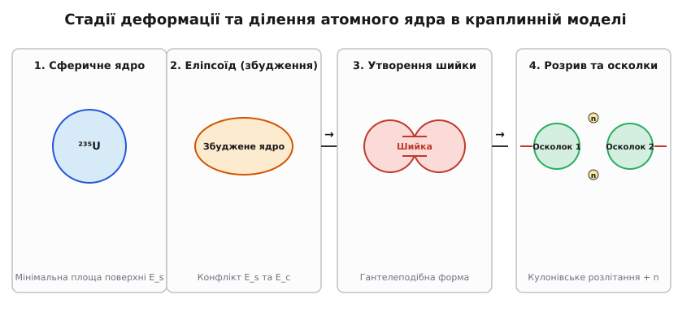
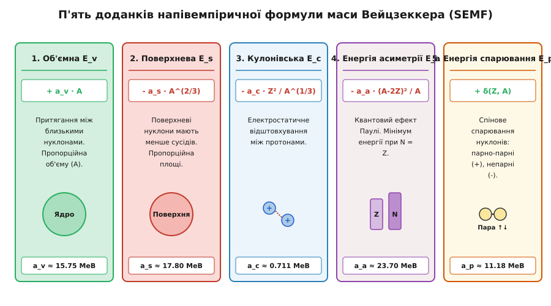
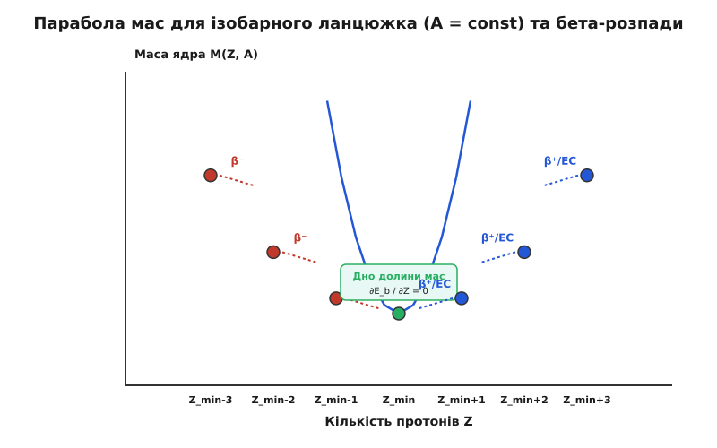

# Енергія зв'язку ядра та краплинна модель Вейцзеккера

<preknowlist>
- [Закон збереження енергії та імпульсу](book:physics/mechanics/energy-conservation) — фундаментальний зв'язок між масою, енергією та станами фізичних систем.
- [Спеціальна теорія відносності](book:physics/relativity/special-relativity) — еквівалентність маси та енергії за формулою E = m · c².
- [Закон Кулона](book:physics/electromagnetism/gauss-law) — електростатична взаємодія між однойменно зарядженими частинками.
- [Принцип заборони Паулі](book:physics/quantum-mechanics/pauli-principle) — фундаментальне обмеження на заповнення квантових станів тотожними ферміонами.
</preknowlist>

Якщо виміряти на надточних мас-спектрометрах масу ізольованого атомного ядра гелію-4 (`⁴He`), прилад покаже `4.0015` атомної одиниці маси (а.о.м.). Проте якщо окремо зважити складові частини цього ядра — два вільних протони (`2 × 1.00728 а.о.м.`) та два вільних нейтрони (`2 × 1.00866 а.о.м.`), їхня сумарна маса становитиме `4.0319 а.о.м.`. Різниця у `0.0304 а.о.м.` (що відповідає енергії коло `28.3 МеВ`) безслідно зникає у мить утворення ядра. Якби цей дефект маси не виникав, жодне атомне ядро у Всесвіті не змогло б утримуватися вкупі, вся речовина розпалася б на хаотичний газ із вільних нуклонів, а зорі не мали б джерела енергії для термоядерного сяйва.

Втрачена маса перетворюється на **енергію зв'язку ядра** — фундаментальну величину, яка визначає межі стабільності речовини, виділення енергії в ядерних реакторах, вибухи наднових та синтез хімічних елементів у космосі.

---

### 1. Дефект маси та фундаментальна природа енергії зв'язку ядра

Атомне ядро є складною квантовою системою, яка містить `Z` позитивно заряджених протонів та `N` нейтральних нейтронів (сумарне масове число нуклонів `A = Z + N`). Вільні протони й нейтрони, перебуваючи на великій відстані один від одного, володіють сумарною масою спокою:

```
M_free = Z · m_p + N · m_n
```

Коли ядерні сили притягання зближують ці нуклони на відстані порядка `10⁻¹⁵ м` (1 фм), система переходить у зв'язаний стан із суттєво нижчим потенціальним рівнем енергії. Залишок енергії випромінюється у навколишній простір у вигляді високоенергетичних гамма-квантів або кінетичної енергії віддачі.

Внаслідок сформульованого Альбертом Ейнштейном закону еквівалентності маси та енергії `E = m · c²`, зменшення потенціальної енергії зв'язаної системи призводить до супутнього зменшення її маси спокою. Маса сформованого ядра `M(Z, A)` завжди виявляється строго меншою за суму мас складових нуклонів у вільному стані. Ця різниця називається **дефектом маси** (`Δm`):

```
Δm = [ Z · m_p + (A - Z) · m_n ] - M(Z, A)
```

Відповідно, **енергія зв'язку ядра** (`E_b`) — це мінімальна робота, яку необхідно виконати проти сил ядерного притягання, щоб повністю розщепити ядро на окремі вільні нуклони і рознести їх на нескінченно велику відстань без надання їм кінетичної енергії:

```
E_b = Δm · c² = [ Z · m_p + (A - Z) · m_n - M(Z, A) ] · c²
```

В ядерній фізиці масу часто вимірюють у спеціальних атомних одиницях маси (а.о.м.), де `1 а.о.м. = 1/12` маси нейтрального атома вуглецю-12 (`¹²C`). Енергетичний еквівалент однієї атомної одиниці маси становить:

```
1 а.о.м. · c² ≈ 931.494 МеВ
```

#### Властивості ядерних сил та потенціал Юкави
Природа ядерних сил (сильної взаємодії) докорінно відрізняється від класичних гравітаційних та електромагнітних сил:

1. **Зарядова незалежність (ізотопічна інваріантність):** Сильна взаємодія між двома протонами (`p-p`), двома нейтронами (`n-n`) або протоном і нейтроном (`p-n`) у тотожних спінових і просторових станах є абсолютно однаковою. Для формалізації цієї симетрії Вернер Гейзенберг ввів поняття **ізотопічного спіну (ізоспіну)** `T = 1/2`, де протон та нейтрон розглядаються як два різні зарядові стани однієї частинки — нуклона.
2. **Короткодійний характер та феноменологія Юкави:** У 1935 році японський фізик Хідекі Юкава довів, що ядерне притягання опосередковане обміном віртуальними мезонами (пі-мезонами або піонами `π⁰, π⁺, π⁻` з масою спокою `~140 МеВ/c²`). Потенціал Юкави має вигляд:
   ```
   V(r) = -g² / r · e^(-μ r)
   ```
   де `1/μ = ħ / (m_π · c) ≈ 1.4 фм` визначає радіус дії ядерних сил.
3. **Жорстка відштовхувальна серцевина (repulsive core):** При зближенні частинок на відстань `r < 0.4 фм` притягання скачкоподібно змінюється на гігантське відштовхування (потенціальний бар'єр висотою понад `1 ГеВ`). Це запобігає колапсу ядра і забезпечує його фіксовану нестисливу густину.
4. **Спінова залежність та тензорні сили:** Сила притягання залежить від взаємної орієнтації спінів нуклонів. Наприклад, дейтерій (`²H`) існує лише у триплетному стані з паралельними спінами нуклонів (`S = 1`), тоді як синглетний стан із антипаралельними спінами (`S = 0`) є нестабільним і незав'язаним. Крім того, тензорні сили роблять ядро дейтерію не строго сферичним, а злегка витягнутим квадруполем.

#### Питома енергія зв'язку та крива стабільності
Для порівняння міцності зв'язку ядер різного розміру використовують **питому енергію зв'язку** `e_spec = E_b / A` — середню енергію зв'язку, яка припадає на один нуклон ядра.


*Залежність питомої енергії зв'язку E_b/A від масового числа A: крутий підйом для легких елементів з піком на гелії-4, максимум у заліза-56 та нікелю-62 (близько 8.8 МеВ/нуклон) та повільне спадання для важких ядер.*

Залежність `E_b / A` від масового числа `A` виявляє ключові риси ядерної структури:

1. **Крутий підйом для найлегших ядер (`A < 12`):** Питома енергія зростає від `1.11 МеВ/нуклон` у дейтерію `²H` та `2.83 МеВ/нуклон` у тритію `³H` до `7.07 МеВ/нуклон` у гелію-4 `⁴He`. На цій ділянці спостерігаються характерні локальні піки для а-кластерних ядер-двійників (`⁴He`, `¹²C`, `¹⁶O`), що свідчить про виражене квантове спарювання нуклонів. Натомість ядро берилію-8 (`⁸Be`) є нестійким і самочинно розпадається на дві альфа-частинки за `10⁻¹⁶ с`.
2. **Широкий максимум поблизу `A = 56...62`:** Найбільш міцно зв'язаними ядрами у Всесвіті є **залізо-56 (`⁵⁶Fe`)** та **нікель-62 (`⁶²Ni`)**, питома енергія зв'язку яких сягає `8.79...8.80 МеВ/нуклон`. Ці ядра утворюють так званий «залізний пік» елементарної поширеності речовини у Всесвіті.
3. **Повільне монотонне спадання для важких ядер (`A > 60`):** Для важких елементів питома енергія поступово знижується, досягаючи `7.86 МеВ/нуклон` у свинцю-208 (`²⁰⁸Pb`) та `7.57 МеВ/нуклон` у урану-238 (`²³⁸U`).

Ця асиметрична форма кривої пояснює два головні джерела ядерної енергії у Всесвіті:
- **Керований термоядерний синтез (*Fusion*):** Об'єднання найлегших ядер (наприклад, дейтерію й тритію) у важче ядро гелію супроводжується стрибком питомої енергії вгору і виділенням колосальної енергії (`17.6 МеВ` на одну реакцію або `3.5 МеВ` на один нуклон).
- **Ядерний поділ (*Fission*):** Розщеплення важкого ядра урану чи плутонію під дією нейтронів на два осколки середньої маси переміщує продукти в область вищої питомої енергії зв'язку (поблизу заліза), що вивільняє близько `200 МеВ` на кожен акт розпаду.

---

### 2. Фізична феноменологія краплинної моделі та ядерна рідина

Щоб описувати маси та енергії зв'язку сотень різних ядер, необхідна фізична модель. Наприкінці 1920-х років Георгій Ґамов, Нільс Бор та Карл Фрідріх фон Вейцзеккер запропонували **краплинну модель ядра** (*Liquid Drop Model*).

В основі моделі лежить глибока фізична аналогія між атомним ядром та мікроскопічною краплею класичної нестисливої зарядженої рідини. 

```
Аналогія: Ядерна речовина  <--->  Макроскопічна рідина
-----------------------------------------------------------------
• Загальний об'єм V ∝ A   <--->  Об'єм краплі V ∝ N_молекул
• Густина ρ_0 ≈ const     <--->  Нестисливість рідини
• Короткодія ядерних сил  <--->  Міжмолекулярні сили Ван-дер-Ваальса
• Поверхневий натяг E_s   <--->  Поверхневий натяг краплі
• Модуль стискання K_inf  <--->  Пружність рідини
• Гігантські резонанси    <--->  Акустичні коливання краплі
```

Ця аналогія тримається на трьох фундаментальних фізичних властивостях сильної взаємодії:

#### 1. Постійність ядерної густини та нестисливість
Експерименти з розсіювання високоенергетичних електронів (проведені Робертом Гофштадтером) показали, що електрична густина всередині більшості ядер є практично однаковою і становить:

```
ρ_0 ≈ 0.17 нуклонів / фм³ ≈ 2.3 × 10¹⁷ кг / м³
```

Радіус ядра `R` підпорядковується простим геометричним співвідношенням для кулі об'ємом `V ∝ A`:

```
R = r_0 · A^(1/3)     [де r_0 ≈ 1.2 фм]
```

Це означає, що нуклони в ядрі упаковані з граничною щільністю і утворюють **нестисливу ядерну матерію**. Модуль стискання ядерної речовини сягає `K_inf ≈ 240 МеВ`, що свідчить про гігантський опір ядра до будь-якого зовнішнього об'ємного стиснення. Швидкість звуку в ядерній матерії досягає `v_s ≈ 0.2...0.25 c` (чверть швидкості світла).

Доказом гідродинамічних властивостей ядерної рідини є існування **гігантських резонансів** — колективних високочастотних коливань ядра:
- **Гігантський монопольний резонанс (GMR):** Дихальна мода коливань, під час якої ядро монотонно стискається й розширюється, зберігаючи сферичну симетрію.
- **Гігантський дипольний резонанс (GDR):** Коливання, при яких протонна та нейтронна рідини зміщуються одна відносно одної у протифазі під дією зовнішнього гамма-кванта.

#### 2. Насичуваність ядерних сил
Якби кожен із `A` нуклонів ядра притягував усі інші `(A - 1)` нуклонів, середня потенціальна енергія системи була б пропорційною кількості пар `A · (A - 1) ≈ A²`, а питома енергія `E_b / A` зростала б лінійно з ростом `A`.

Проте експериментальна крива демонструє плато `E_b / A ≈ 8 МеВ/нуклон`. Це свідчить про **насиченість ядерних сил**: сильна взаємодія має надзвичайно малий радіус дії (близько `1...1.5 фм`). Кожен нуклон взаємодіє лише з вузьким колом своїх безпосередніх сусідів (типово 4–6 нуклонів), не реагуючи на віддалені частинки на протилежному боці ядра.

#### 3. Поверхневий натяг
Нуклон, що перебуває в глибині ядерного об'єму, оточений сусідами з усіх боків і має максимальну кількість зв'язків. Проте нуклон на поверхні ядра межує з порожнечею — він має менше сусідів і утримується слабше.

Обчислимо співвідношення кількості поверхневих нуклонів `N_surf` до об'ємних `N_vol`:

```
N_surf / N_vol ∝ S / V ∝ R² / R³ ∝ 1 / R ∝ A^(-1/3)
```

Для легкого ядра вуглецю-12 (`¹²C`) частка поверхневих нуклонів перевищує `60%`, а для важкого урану-238 (`²³⁸U`) спадає до `25%`. Прагнення системи мінімізувати кількість поверхневих нуклонів матеріалізується як макроскопічний **поверхневий натяг** з коефіцієнтом `γ ≈ 1.0...1.2 МеВ/фм²`, що надає незбудженому ядру строго сферичної форми.

Детальніше про історію розробки краплинної моделі Ґамовим, Бором та Вейцзеккером читай у вставці [Історія відкриття краплинної моделі та формули Вейцзеккера](book:physics/nuclear-physics/binding-energy-liquid-drop/hist-weizsacker-liquid-drop.md).

---

### 3. Аналіз п'яти доданків напівемпіричної формули Вейцзеккера (SEMF)

У 1935 році Карл Фрідріх фон Вейцзеккер об'єднав краплинну феноменологію з термодинамічними та квантовими поправками, сформулювавши **напівемпіричну формулу маси** (*Semi-Empirical Mass Formula, SEMF*).

Формула описує повну енергію зв'язку ядра `E_b(Z, A)` як суму п'яти фізичних доданків:

```
E_b(Z, A) = E_v + E_s + E_c + E_a + E_p
```


*Структура п'яти доданків напівемпіричної формули Вейцзеккера: об'ємне притягання, поверхневе ослаблення, кулонівське відштовхування, квантова асиметрія та спінове спарювання нуклонів.*

Розглянемо фізичний зміст та механізм кожного з п'яти доданків:

#### 1. Об'ємний член (`E_v = +a_v · A`)
Описує головний вклад сильної взаємодії — притягання між близькими сусідами всередині ядерного об'єму. Оскільки кожен нуклон взаємодіє з однаковою кількістю сусідів, загальна енергія притягання пропорційна об'єму ядра, а отже, і повній кількості нуклонів `A`:

```
a_v ≈ 15.75 МеВ
```

Об'ємний доданок дає позитивний вклад в енергію зв'язку і забезпечує базовий рівень міцності ядра (`15.75 МеВ` на кожен нуклон).

#### 2. Поверхневий член (`E_s = -a_s · A^(2/3)`)
Враховує поправку на поверхню: нуклони на зовнішній межі ядра мають менше сусідів і зв'язані слабше. Кількість поверхневих нуклонів пропорційна площі поверхні сферичного ядра `S = 4π R² ∝ A^(2/3)`:

```
a_s ≈ 17.80 МеВ
```

Поверхневий доданок зменшує енергію зв'язку. Його роль найпомітніша у легких ядер, де частка поверхневих нуклонів є найбільшою.

#### 3. Кулонівський член (`E_c = -a_c · Z · (Z - 1) / A^(1/3)`)
Враховує електростатичне відштовхування між `Z` позитивно зарядженими протонами. На відміну від короткодійних ядерних сил, кулонівські сили мають нескінченний радіус дії — кожен протон відштовхує **усі інші `(Z - 1)` протони** в ядрі.

Для рівномірно зарядженої кулі радіуса `R = r_0 · A^(1/3)` кулонівська енергія обчислюється як:

```
E_c = (3/5) · (1 / (4π ε_0)) · (Z · (Z - 1) · e² / R) = -a_c · (Z · (Z - 1) / A^(1/3))
```

```
a_c ≈ 0.711 МеВ
```

Кулонівське відштовхування дестабілізує ядро. Для великих `Z` ця енергія зростає пропорційно `Z²`, що робить надважкі ядра нестійкими.

#### 4. Асиметричний член (`E_a = -a_a · (A - 2Z)² / A`)
Має чисто квантово-механічне походження і випливає з принципу заборони Паулі. Протони та нейтрони є різними ферміонами і заповнюють власні незалежні квантові потенціальні ями (рівні Фермі).

```
  Симетричний стан (N = Z):         Асиметричний стан (N > Z):
    Протони     Нейтрони             Протони     Нейтрони
    |--- |       |--- |               |    |       |--- |  <-- вищий рівень Фермі
    |--- |       |--- |               |--- |       |--- |
    |--- |       |--- |               |--- |       |--- |
   (Енергія мінімальна)             (Надлишкові нейтрони змушені
                                     займати вищі енергетичні рівні)
```

При перенесенні частинки з протонного рівня на нейтронний загальна кінетична енергія Фермі-газу зростає. Мінімальна енергія системи досягається при строгому рівнораспределении `N = Z` (`A - 2Z = 0`). Будь-яка асиметрія `N ≠ Z` зменшує енергію зв'язку:

```
a_a ≈ 23.70 МеВ
```

#### 5. Спарювальний (парувальний) член (`E_p = δ(Z, A)`)
Враховує спінову взаємодію однакових нуклонів. Два однакові нуклони (два протони або два нейтрони) з протилежно орієнтованими спінами (`↑` та `↓`), перебуваючи на одній орбіталі, утворюють зв'язану пару з підвищеною енергією зв'язку (так зване куперівське спарювання в ядерній матерії).

Величина поправки `δ(Z, A)` залежить від четності `Z` та `N`:

```
         ┌ +a_p / A^(1/2)   для парно-парних ядер (Z парне, N парне)
δ(Z, A) = ├  0              для непарно-парних / парно-непарних ядер
         └ -a_p / A^(1/2)   для непарно-непарних ядер (Z непарне, N непарне)
```

```
a_p ≈ 11.18 МеВ
```

Звідси випливає поширеність елементів у природі: з усіх відомих стабільних нуклідів понад `60%` є парно-парними, і лише 4 ядра у Всесвіті є непарно-непарними (`²H`, `⁶Li`, `¹⁰B`, `¹⁴N`).

Повний математичний вивід кулонівського та асиметричного доданків з перших принципів дивіться у вставці [Математичний вивід кулонівського та асиметричного членів Вейцзеккера](book:physics/nuclear-physics/binding-energy-liquid-drop/math-weizsacker-derivation.md).

Порівняльні таблиці коефіцієнтів та експериментальних мас ядер зібрано у вставці [Специфікація нуклідних констант та параметрів формули Вейцзеккера](book:physics/nuclear-physics/binding-energy-liquid-drop/api-nuclide-mass-data.md).

---

### 4. Долина мас, лінія бета-стабільності та ланцюжки розпадів

Для фіксованого масового числа `A` (набір **ізобарів** — ядер із однаковою сумарною кількістю нуклонів) формула Вейцзеккера дає квадратичну залежність маси `M(Z)` від заряду `Z`.

Ця квадратична залежність описує **параболу мас** у тривимірному просторі `(Z, N, M)`, утворюючи так звану **долину бета-стабільності** (*Valley of Beta-Stability*).


*Парабола мас ізобарного ланцюжка: ядра з надлишком нейтронів зазнають β⁻-розпаду, ядра з надлишком протонів — β⁺-розпаду або електронного захоплення (EC), рухаючись до дна долини мас Z_min.*

#### Вивід оптимального заряду `Z_min`
Щоб знайти протонне число `Z_min`, яке забезпечує мінімум маси (і максимум енергії зв'язку) для заданого `A`, продиференціюємо формулу Вейцзеккера по `Z` і прирівняємо похідну до нуля:

```
∂E_b / ∂Z = -2 · a_c · (Z / A^(1/3)) + 4 · a_a · ((A - 2Z) / A) = 0
```

Розв'язуючи це рівняння відносно `Z`, отримуємо аналітичну формулу **лінії бета-стабільності**:

```
Z_min = A / (2 + (a_c / (2 a_a)) · A^(2/3)) ≈ A / (2 + 0.015 · A^(2/3))
```

Ця формула пояснює фундаментальний зсув складі ядер:
- Для легких ядер (`A < 40`): `A^(2/3)` мала, тому `Z_min ≈ A / 2` (кількість протонів дорівнює кількості нейтронів).
- Для важких ядер (`A = 238`): кулонівський доданок зсуває дно параболи, і `Z_min ≈ 92`, що вимагає `N = 146` нейтронів.

#### Динаміка бета-розпадів уздовж параболи
Ядра, розташовані на схилах долини мас, є радіоактивними і прагнуть самочинно скотитися до дна параболи через бета-процеси:

1. **Нейтрононадлишкові ядра (`Z < Z_min`):** Перебувають на лівому схилі. У них відбувається **бета-мінус розпад (`β⁻`)**, під час якого один нейтрон перетворюється на протон:
   ```
   n  -->  p + e⁻ + ν̄_e      (Z зростає на +1, A = const)
   ```
2. **Протононадлишкові ядра (`Z > Z_min`):** Перебувають на правому схилі. У них відбувається **бета-плюс розпад (`β⁺`)** або **електронне захоплення (`EC`)**, під час якого протон перетворюється на нейтрон:
   ```
   p  -->  n + e⁺ + ν_e      (Z зменшується на -1, A = const)
   ```

#### Подвійна парабола для парних `A` та подвійний бета-розпад
Для парних масових чисел `A` через наявність спарювального члена `δ(Z, A)` виникають **дві паралельні параболи мас**:
- Верхня парабола відповідає непарно-непарним ядрам (менш стійким).
- Нижня парабола відповідає парно-парним ядрам (більш стійким).

У результаті непарно-непарне ядро може зазнавати послідовних розпадів і переходити на нижню параболу, через що для одного значення `A` можуть існувати два або навіть три стабільні парно-парні ізобари (наприклад, `⁵⁶Fe` та `⁵⁶Ni`, або `¹⁰⁰Mo` та `¹⁰⁰Ru`). При цьому для таких ядер виникає можливість рідкісного **подвійного бета-розпаду (`2β⁻`)**, прямий пошук якого у безнейтринній формі (`0ν2β`) є одним із головних завдань сучасної фізики нейтрино для визначення маси нейтрино та перевірки теорії Майорани.

---

### 5. Механізм ядерного поділу та деформаційна динаміка краплі

Найважливішим практичним застосуванням краплинної моделі став опис **ядерного поділу** (*Nuclear Fission*), розроблений Нільсом Бором та Джоном Вілером у 1939 році.

Коли важке ядро (наприклад, уран-235) захоплює повільний нейтрон, отримана енергія збудження (понад `6 МеВ`) перетворює ядро на коливальну рідку краплю.


*Послідовні стадії деформації ядра при діленні: від початкового сферичного стану через збуджений еліпсоїд та утворення шийки до розриву на два кулонівські осколки з випромінюванням нейтронів.*

#### Битва між поверхневим натягом та кулонівським відштовхуванням
При витягуванні сферичного ядра в еліпсоїд об'єм ядра залишається сталим, але змінюються дві енергетичні складові:
1. **Площа поверхні зростає:** Поверхнева енергія `E_s` збільшується по модулю, прагнучи повернути краплю у вигідну сферичну форму (відновна сила).
2. **Протони віддаляються один від одного:** Кулонівське відштовхування `E_c` зменшується по модулю, що є енергетично вигідним і прагне деформувати ядро ще сильніше.

Математичний аналіз деформації кулі в еліпсоїд з параметром мультипольної деформації `ε` дає таку зміну енергії:

```
ΔE = E_деформоване - E_сферичне = (1/5) · ε² · [ 2 · E_s(0) - E_c(0) ]
```

Ядро стає **абсолютно нестійким проти самочинного ділення**, якщо кулонівський доданок переважає подвійний поверхневий доданок:

```
E_c(0) > 2 · E_s(0)
```

Підставляючи вирази `E_c ∝ Z² / A^(1/3)` та `E_s ∝ A^(2/3)`, отримуємо знаменитий **критерій ділення Бора — Вілера**:

```
Критерій ділення: (Z² / A)_crit ≈ (2 a_s) / a_c ≈ (2 × 17.80) / 0.711 ≈ 50
```

Для реальних важких ядер:
- Для урану-238 (`²³⁸U`): `Z² / A = 92² / 238 = 35.6`. Ядро має поріг ділення близько `5.7 МеВ`, тому спонтанне ділення є рідкісним, але примусове ділення нейтронами відбувається легко.
- Для фермію-254 (`²⁵⁴Fm`): `Z² / A = 100² / 254 = 39.4`. Бар'єр ділення низький, спонтанний поділ переважає.
- Для гіпотетичних ядер із `Z > 114` та `Z² / A > 45`: бар'єр ділення зникає зовсім, і ядро розривається за ядерний час `10⁻²¹ с`.

#### Динаміка утворення шийки та випромінювання нейтронів
Коли деформація ядра перевищує критичну «сідлову точку» (*saddle point*), відновна сила поверхневого натягу вже не здатна зупинити розтягування. У центрі краплі формується тонка шийка, яка розривається за `10⁻²⁰ с`.

У момент розриву виникають два високозаряджені осколки поділу (наприклад, барій та криптон), які з величезним прискоренням розлітаються у протилежні боки під дією кулонівського відштовхування. Сумарна кінетична енергія розлітання осколків становить близько `165 МеВ`.

Залишок енергії збудження осколків (`~35 МеВ`) скидається шляхом «випаровування» 2–3 миттєвих нейтронів поділу та емісії гамма-квантів. Саме ці миттєві нейтрони уможливлюють здійснення самопідтримуваної ланцюгової ядерної реакції. Крім того, невелика частка продуктів поділу зазнає бета-розпадів з емісією **запізнілих нейтронів** (з часом затримки від 0.2 до 55 секунд). Саме запізнілі нейтрони роблять ядерні реактори керованими, збільшуючи ефективний час життя покоління нейтронів у мільйони разів.

---

### 6. Межі застосовності краплинної моделі та синтез із оболонковою моделлю

Попри феноменальний успіх у поясненні загального ходу енергії зв'язку та ділення, краплинна модель є **макроскопічним наближенням** і має чіткі межі застосовності:

#### Чого не здатна пояснити краплинна модель:
1. **Магічні числа (`Z, N = 2, 8, 20, 28, 50, 82, 126`):** Експериментальні маси ядер із магічною кількістю нуклонів виявляються на `2...5 МеВ` міцнішими за передбачення формули Вейцзеккера.
2. **Аномальна стійкість легких ядер (`⁴He`, `¹²C`, `¹⁶O`):** Краплинна модель передбачає монотонне зростання енергії зв'язку і не пояснює гігантський пік гелію-4.
3. **Квантові спіни та магнітні моменти:** Класична крапля рідини не має квантового спіну основного стану та магнітного дипольного моменту.

#### Сучасний синтез: метод оболонкових поправок Струтинського
У сучасній ядерній фізиці класична краплинна модель та квантова оболонкова модель не заперечують, а доповнюють одна одну. За методом радянського фізика Вадима Струтинського (1967), повна енергія ядра подається як сума макроскопічної енергії краплі Вейцзеккера та мікроскопічної оболонкової поправки `δE_shell`:

```
E_b(Z, A) = E_SEMF(Z, A) + δE_shell(Z, N)
```

Цей синтез дозволив із високою точністю передбачити «острів стабільності» трансуранових елементів поблизу `Z = 114, N = 184`.

---

### 7. Практичні інженерні застосування та астрофізика

Знання енергії зв'язку та краплинної динаміки є основою сучасної ядерної інженерії та астрофізики:

1. **Ядерна енергетика:** Обчислення масового дефекту дозволяє з точністю до кіловата розраховувати теплову потужність атомних електростанцій на теплових та швидких нейтронах. Крім того, існування запізнілих нейтронів поділу (частка `β_eff ≈ 0.65%` для урану-235) робить ланцюгову реакцію в реакторах керованою за часовими масштабами десятків секунд.
2. **Керований термоядерний синтез:** Розрахунок реакцій `²H + ³H → ⁴He + n + 17.6 МеВ` є базою для проєктування термоядерних реакторів типу токамак (ITER, DEMO) та стелараторів, де досягаються температури понад `100 мільйонів Кельвінів`.
3. **Виробництво медичних ізотопів:** Обчислення порогів реакцій дозволяє синтезувати радіофармпрепарати (наприклад, технецій-99m, йод-131, лютецій-177) для позитрон-емісійної томографії та променевої терапії онкологічних захворювань.
4. **Ядерна астрофізика та космохімія:** Формула Вейцзеккера використовується в моделюванні **r-процесу** (швидкого захоплення нейтронів) та **s-процесу** (повільного захоплення) нуклеосинтезу під час вибухів наднових та злиття нейтронних зір (подія гравітаційних хвиль GW170817), де утворюються всі важкі елементи Всесвіту — від срібла та золота до урану й торію.

Програмну реалізацію калькулятора мас та стабільності дивіться у вставці [Проєкт калькулятора енергії зв'язку та бета-стабільності ядер](book:physics/nuclear-physics/binding-energy-liquid-drop/proj-weizsacker-calculator.md).
