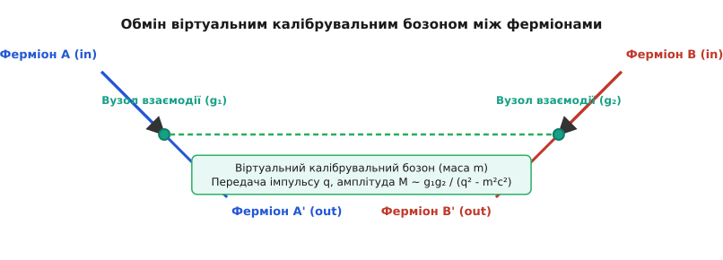
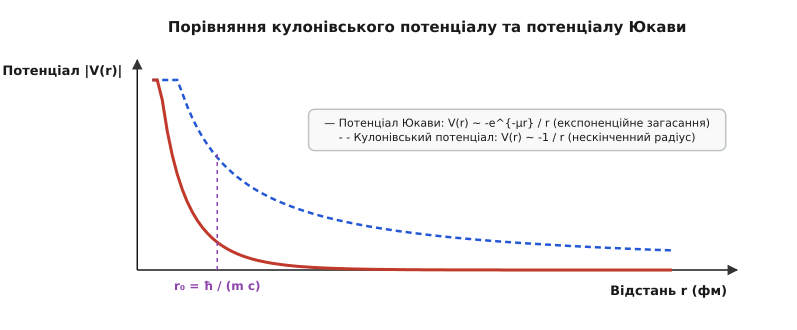
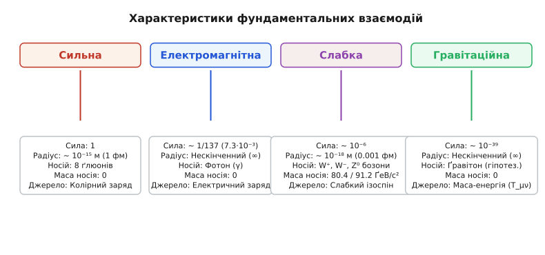
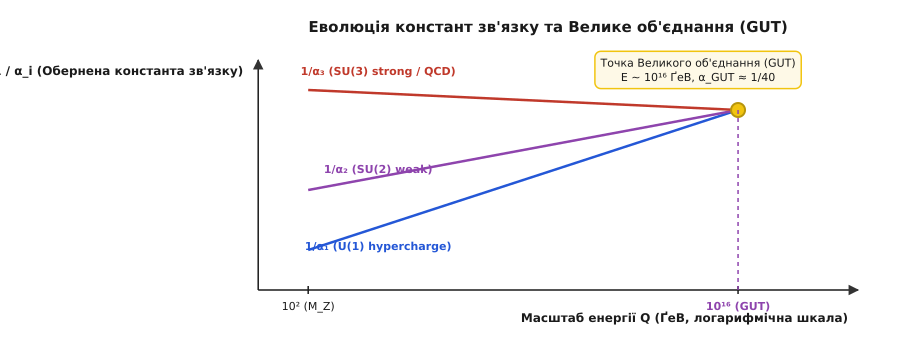

# Фундаментальні взаємодії

<preknowlist>
- [Закон всесвітнього тяжіння](topic:physics/newton-gravitation) — гравітаційне притягання мас і квадратична залежність від відстані.
- [Закон Кулона](topic:physics/coulomb-law) — взаємодія електричних зарядів та носії електромагнітного поля.
- [Енергія зв'язку ядра](topic:physics/binding-energy-liquid-drop) — сильна взаємодія між нуклонами та масовий дефект.
- [Закон радіоактивного розпаду](topic:physics/radioactive-decay-law) — слабка взаємодія у бета-розпадах та зміни ароматів кварків.
</preknowlist>

Коли альфа-частинка з енергією п'ять мегаелектронвольт наближається до золотого ядра на відстань менше тридцяти фемтометрів, класичний кулонівський закон відштовхування точно описує її траєкторію, але варто цій частинці підійти на відстань п'яти фемтометрів, як електромагнітне відштовхування раптово поступається місцем притяганню, сила якого в сотні разів перевищує кулонівську. Якщо ж усередині самого нуклона нижній кварк розпадається на верхній кварк із випромінюванням електрона й нейтрино, процес відбувається за масштабу часом у трильйонні частки секунди, а сила цього перетворення виявляється в мільйон разів слабшою за електромагнітну. При цьому на обертання далеких галактик чи падіння супутників на орбіті жодна з цих ядерних сил не чинить помітного впливу, поступаючись абсолютно неуникній гравітації. Усі спостережувані у Всесвіті явища — від падіння яблука на Землю до горіння зір, стійкості атомних ядер, хімічних зв'язків та термоядерного синтезу — зводяться до дій чотирьох фундаментальних взаємодій: гравітаційної, електромагнітної, сильної та слабкої.

## 1. Механізм взаємодії: від дальнодії до обміну калібрувальними бозонами

У класичній фізиці Ісаака Ньютона сила між двома масивними тілами уявлялася як дальнодія — миттєве передавання імпульсу через абсолютно порожній простір без будь-якого матеріального посередника. Розвиток класичної електродинаміки Джеймсом Клерком Максвеллом у середині XIX століття замінив миттєве віддалене притягання концепцією безперервного силового поля, яке поширюється у просторі зі скінченною швидкістю світла. Однак квантова теорія поля зробила наступний вирішальний крок: вона довела, що саме силове поле складається з дискретних квантів, а будь-яка взаємодія між частинками речовини (ферміонами зі напівцілим спіном) є результатом обміну віртуальними носіями взаємодії — калібрувальними бозонами зі цілим спіном.

У квантово-польовій картині дві частинки взаємодіють не через абстрактне силове притягання чи відштовхування, а випромінюючи та поглинаючи віртуальні бозони. За методом діаграм Фейнмана, коли частинка A випромінює квант поля з чотириімпульсом `q = (ΔE/c, Δp)`, вона отримує імпульс віддачі, а коли частинка B поглинає цей квант, вона отримує переданий імпульс.


*Квантово-польовий механізм взаємодії через обмін віртуальним калібрувальним бозоном між ферміонами.*

Віртуальні частинки перебувають поза масовою поверхнею (масова оболонка `E² - p² c² ≠ m² c⁴`), тому вони не можуть бути безпосередньо зареєстровані детекторами. Згідно з часовим співвідношенням невизначеностей Вернера Гейзенберґа `ΔE · Δt ≥ ħ / 2`, віртуальна частинка з масою спокою `m` та енергетичним відхиленням `ΔE ≈ m · c²` може існувати протягом виключно обмеженого проміжку часу:

```
Δt ≈ ħ / (m · c²)
```

За цей короткий час віртуальний носій може подолати максимальну відстань `r₀`, яка визначає характерний радіус дії взаємодії і не може перевищувати межі, дозволеної швидкістю світла `c`:

```
r₀ ≈ c · Δt ≈ ħ / (m · c)
```

Ця фундаментальна формула пов'язує масу носія взаємодії з радіусом її дії у просторі. Якщо носій взаємодії є суворо безмасовим (`m = 0`), як-от фотон у квантовій електродинаміці чи ґравітон у квантовій гравітації, радіус дії взаємодії є нескінченним (`r₀ = ∞`), а скалярний потенціал поля спадає повільно за законом обернених квадратів `1/r`. Якщо ж носій взаємодії володіє великою масою, як-от заряджені `W⁺`, `W⁻` та нейтральні `Z⁰` бозони слабкої взаємодії з масою порядку 80–91 ҐеВ/c², радіус дії взаємодії стискається до екстремально малого значення `~ 10⁻¹⁸` м.

Математичним фундаментом сучасної фізики елементарних частинок є принцип локальної калібрувальної інваріантності. Якщо вимагати, щоб хвильова функція матерії `ψ(x)` залишалася інваріантною щодо локальних фазових перетворень `ψ(x) → exp(i · q · α(x)) · ψ(x)`, де фаза `α(x)` довільно змінюється від точки до точки простору-часу, звичайні частинні похідні `∂_μ` втрачають коваріантність. Для збереження калібрувальної інваріантності рівняння Руху необхідно ввести нове векторне поле `A_μ(x)` — калібрувальне поле, яке компенсує просторові зміни фази за допомогою коваріантної похідної:

```
D_μ = ∂_μ + i · q · A_μ(x)
```

Калібрувальне поле `A_μ(x)` при цьому перетворюється за законом `A_μ(x) → A_μ(x) - ∂_μ α(x)`. Отже, сам факт існування фундаментальних сил і частинок-носіїв у природі є неминучим математичним наслідком вимоги локальної калібрувальної симетрії фізичних законів.

## 2. Чотири фундаментальні сили: порівняльний аналіз механізмів

Усі відомі явища Всесвіту керуються чотирма фундаментальними взаємодіями, кожна з яких володіє унікальним квантовим носієм, власною групою калібрувальної симетрії, радіусом дії та специфічним типом фундаментального заряду.

### Гравітаційна взаємодія
Гравітація — найслабша з усіх фундаментальних сил, але саме вона визначає великомасштабну структуру Всесвіту, формування галактик, зір, планет та рух небесних тіл. На відміну від інших взаємодій, у класичній межі гравітація не є силою у звичайному розумінні, а проявляється як викривлення геометрії чотиривимірного простору-часу масою та енергією згідно з загальною теорією відносності Альберта Ейнштейна. Рівняння Ейнштейна пов'язують тензор викривлення Ейнштейна `G_μν` із тензором енергії-імпульсу матерії `T_μν`:

```
G_μν = (8π · G_N / c⁴) · T_μν
```

Джерелом гравітаційного поля є тензор енергії-імпульсу `T_μν`, який включає густину маси, енергії, тиску та внутрішніх натягів. У квантовій межі гіпотетичним носієм гравітаційного поля є ґравітон — безмасовий бозон зі спіном 2. Оскільки маса ґравітона дорівнює нулю, радіус гравітаційної взаємодії є нескінченним. Відносна інтенсивність гравітації між двома протонами на ядерних відстанях надзвичайно мала й становить близько `10⁻³⁹` відносно сильної взаємодії. Гравітація домінує в макросвіті завдяки тому, що гравітаційний заряд (маса-енергія) має лише один знак (притягання) і не піддається екрануванню, на відміну від протилежних електричних зарядів.

У низькоенергетичному гранічному випадку релятивістська гравітація Ейнштейна переходить у класичний закон всесвітнього тяжіння Ньютона для двох точкових мас `m₁` та `m₂`:

```
F_g = G_N · m₁ · m₂ / r²
```

На квантовому рівні ефективна теорія гравітаційного розсіяння передбачає, що обмін ґравітонами між ферміонами дає кулонівський потенціал притягання з квантовими поправками порядку `(G_N ħ / (c³ r²))`. Проте спроби квантування гравітації за стандартними правилами квантової теорії поля приводять до неренормованих інфінітів при високих енергіях (ультрафіолетова дивергенція), оскільки гравітаційна констант зв'язку `G_N` має обернену квадратну розмірність маси.

### Електромагнітна взаємодія
Електромагнітна взаємодія зв'язує негативно заряджені електрони з позитивно зарядженими ядрами в атоми, об'єднує атоми в молекули та кристалічні ґратки, визначає всі хімічні реакції, оптичні явища, закони електрики й магнетизму, а також макроскопічні механічні сили тертя, пружності, реакції опор та поверхневого натягу.

Калібрувальною групою електромагнетизму є абелева група `U(1)_EM`, джерелом взаємодії є електричний заряд `q`, а квантовим носієм — безмасовий фотон `γ` зі спіном 1. Безрозмірна константа тонкої структури визначає інтенсивність електромагнітних процесів:

```
α = e² / (4π · ε₀ · ħ · c) ≈ 1 / 137.036
```

Оскільки фотон безмасовий, електромагнітна взаємодія має нескінченний радіус дії, а її потенціал описується кулонівським законом `V(r) ~ 1/r`. На відміну від гравітації, електромагнетизм містить позитивні й негативні заряди, що спричиняє екранування полів у макроскопічних масштабах. Квантова електродинаміка (QED) є найточнішою фізичною теорією в історії науки: теоретично розрахований аномальний магнітний момент електрона збігається з експериментальними вимірюваннями до дванадцятого знака після коми.

### Сильна (колірна) взаємодія
Сильна взаємодія утримує кварки всередині адронів (протонів, нейтронів, мезонів), а на більш далеких відстанях проявляється як залишкове ядерне притягання, що зв'язує нуклони в атомні ядра, долаючи кулонівське відштовхування протонів.

Теорією сильної взаємодії є квантова хромодинаміка (QCD), заснована на неабелевій калібрувальній групі `SU(3)_C`. Джерелом сильної взаємодії є колірний заряд (три кольори: червоний, зелений, синій). Переносниками сил є 8 безмасових ґлюонних полів зі спіном 1. На відміну від фотонів, які є електрично нейтральними, ґлюони самі несуть колірний заряд (поєднуючи колір та антиколір). Ця властивість спричиняє самодію ґлюонів і визначає дві фундаментальні властивості сильної взаємодії:
1. **Асимптотична свобода:** На малих відстанях (`r < 0.1` фм, високі енергії) константа сильноі взаємодії `α_s` спадає, і кварки поводяться як квазівільні частинки.
2. **Конфайнмент (утримання):** Зі збільшенням відстані між кварками ґлюонне поле стискається в силову трубку з постійним натягом, а потенціал зростає лінійно `V(r) ≈ K · r`. При спробі вирвати кварк енергія трубки стає достатньою для народження нової кварк-антикваркової пари, що унеможливлює існування вільних кольорових частинок.

На макроскопічному ядерному рівні (відстані `r > 0.8` фм) сильна взаємодія між нуклонами описується як обмін віртуальними пі-мезонами за моделлю Юкави з потенціалом експоненційного загасання. Детальний математичний вивід потенціалу Юкави зі стаціонарного рівняння Гельмгольца викладено у вставці [Математичний вивід потенціалу Юкави та радіуса взаємодії](topic:physics/nuclear-physics/fundamental-interactions/math-yukawa-potential.md).


*Порівняльні криві кулонівського потенціалу нескінченного радіуса дії та екранованого потенціалу Юкави.*

### Слабка взаємодія
Слабка взаємодія відповідає за радіоактивний бета-розпад ядер, розпади нестійких елементарних частинок (мюонів, піонів, каонів), нейтринні осциляції та ініціювання першої стадії протон-протонного термоядерного циклу в надрах Сонця (`p + p → d + e⁺ + ν_e`), без якого зорі не змогли б стабільно світити мільярди років.

Калібрувальною групою слабкої взаємодії є `SU(2)_L`. Джерелом є слабкий ізотопічний спін, а носіями — три масивні векторні бозони зі спіном 1: заряджені `W⁺` та `W⁻` (маса ≈ 80.4 ҐеВ/c²) і нейтральний `Z⁰` (маса ≈ 91.2 ҐеВ/c²). Через величезну масу носіїв радіус слабкої взаємодії обмежений значенням `~ 10⁻¹⁸` м, а її інтенсивність за низьких енергій у мільйон разів менша за електромагнітну.

Слабка взаємодія володіє унікальними властивостями:
- Вона є єдиною взаємодією, здатною змінювати аромат кварків і лептонів (наприклад, перетворювати `d`-кварк у `u`-кварк при бета-розпаді нейтрона). Ефективність таких переходів описується елементами унітарної матриці Кабіббо — Кобаяші — Маскава (CKM).
- Вона порушує просторову парність (P-парність), взаємодіючи виключно з лівокіральними ферміонами та правокіральними антиферміонами (експеримент Ву 1956 року).
- Вона порушує комбіновану CP-симетрію, що розрізняє поведінку матерії та антиматерії і є однією з умов Сахарова для пояснення баріонної асиметрії Всесвіту.

Повні числові параметри бозонів, значення констант зв'язку, матричні елементи CKM та параметри нейтринних осциляцій PMNS зібрано в довіднику [Довідник фундаментальних квантових носіїв та констант взаємодії](topic:physics/nuclear-physics/fundamental-interactions/api-particle-properties-ref.md).

## 3. Зведена таблиця характеристик фундаментальних взаємодій

Для порівняння фізичних властивостей чотирьох фундаментальних сил наведено зведену шкалу та параметри носіїв полів.


*Порівняльні характеристики та відносна інтенсивність чотирьох фундаментальних взаємодій природи.*

| Характеристика | Сильна взаємодія | Електромагнітна | Слабка взаємодія | Гравітаційна |
| :--- | :--- | :--- | :--- | :--- |
| **Відносна сила (scale)** | `1` | `10⁻²` (≈ 1/137) | `10⁻⁶` | `10⁻³⁹` |
| **Квантовий носій** | 8 ґлюонів (`g`) | Фотон (`γ`) | `W⁺`, `W⁻`, `Z⁰` бозони | Ґравітон (`G`, гіпот.) |
| **Спін носія (`ħ`)** | `1` | `1` | `1` | `2` |
| **Маса носія** | `0` | `0` | `80.4 / 91.2 ҐеВ/c²` | `0` |
| **Радіус дії `r₀`** | `~ 10⁻¹⁵ м` (1 фм) | Нескінченний (`∞`) | `~ 10⁻¹⁸ м` (0.001 фм) | Нескінченний (`∞`) |
| **Джерело (заряд)** | Колірний заряд | Електричний заряд `q` | Слабкий ізоспін `T₃` | Маса-енергія `T_μν` |
| **Типові об'єкти** | Кварки, нуклони, ядра | Атоми, молекули, тіла | Нейтрино, бета-розпад | Зорі, планети, Всесвіт |

## 4. Шлях до об'єднання: від Максвелла до Стандартної моделі та Великого об'єднання

Історія фізики є послідовним процесом відкриття того, що різноманітні поверхневі сили насправді є різними проявами єдиних фундаментальних симетрій природа. Першим видатним об'єднанням стало створення класичної електродинаміки Джеймсом Клерком Максвеллом у 1860-х роках, який довів, що електрика, магнетизм та світло є проявами єдиного електромагнітного поля.

У 1960-х роках Шелдон Ґлешоу, Стівен Вайнберґ та Абдус Салам створили теорію Електрослабкої взаємодії, об'єднавши електромагнетизм та слабку взаємодію у єдине калібрувальне поле з групою симетрії `SU(2)_L * U(1)_Y`. За високих енергій (`E > 100` ҐеВ) електромагнітна та слабка сили стають порівнянними за інтенсивністю. Зниження енергії приводить до спонтанного порушення симетрії за допомогою механізму Брута — Енґлера — Хіґґса, внаслідок чого бозони `W` та `Z` набувають великої маси, а фотон залишається безмасовим. Докладніше про історію відкриття нейтральних струмів та бозонів `W` і `Z` розказано у вставці [Історія електрослабкого об'єднання та відкриття бозонів W і Z](topic:physics/nuclear-physics/fundamental-interactions/hist-electroweak-unification.md).

Об'єднання електрослабкої теорії та квантової хромодинаміки утворило **Стандартну модель елементарних частинок** із загальною калібрувальною групою:

```
G_SM = SU(3)_C * SU(2)_L * U(1)_Y
```

Стандартна модель вражаючо передбачила існування `W`- і `Z`-бозонів, `t`-кварка, `ν_τ`-нейтрино та скалярного бозона Хіґґса, який був експериментально відкритий у CERN у 2012 році з масою 125.1 ҐеВ/c².


*Еволюція обернених констант взаємодії зі зростанням енергії та точка Великого об'єднання (GUT).*

При подальшому зростанні енергії ефективні константи зв'язку трьох взаємодій змінюються завдяки поляризації вакууму (Running Couplings). Як видно з графіка еволюції констант, при енергіях порядку `10¹⁵–10¹⁶` ҐеВ (масштаб Великого об'єднання, GUT) обернені константи `1/α₁`, `1/α₂` та `1/α₃` наближаються до спільної точки перетину. Теорії Великого об'єднання (GUT), засновані на простих калібрувальних групах, таких як `SU(5)` або `SO(10)`, передбачають, що сильна, слабка та електромагнітна взаємодії є компонентами єдиного калібрувального поля, яке розщеплюється на низьких енергіях внаслідок послідовних фазових переходів у ранньому Всесвіті.

Алгоритми обчислення еволюції констант зв'язку та диференціальних перерізів розсіяння реалізовано у програмному проєкті [Обчислення перерізу розсіяння та залежності констант зв'язку від енергії](topic:physics/nuclear-physics/fundamental-interactions/proj-interaction-cross-section.md).

Найбільшим викликом сучасної теоретичної фізики залишається об'єднання квантової Стандартної моделі з загальною теорією відносності у єдину **Теорію всього** (Theory of Everything). Головною перешкодою є фундаментальна проблема ієрархії: чому гравітаційна взаємодія є нехтовно слабкою порівняно з електрослабким масштабом (`G_F / G_N ~ 10³²`), і чому маса бозона Хіґґса не отримує величезних квантових поправок аж до планківського масштабу (`10¹⁹` ҐеВ). Кандидатами на роль квантової теорії гравітації є теорія суперструн, M-теорія та петльова квантова гравітація, вивчення яких становить передній край сучасної науки.

## 5. Космологічна роль та послідовність виморожування взаємодій

У концепції гарячого Великого вибуху еволюція Всесвіту є послідовним ланцюгом фазових переходів зі зниженням температури та енергії, під час якого фундаментальні взаємодії послідовно відокремлювалися одна від одної:

1. **Планківська епоха (`t < 10⁻⁴³` с, `E > 10¹⁹` ҐеВ):** Гравітація перебувала у квантовому стані й була об'єднана з трьома іншими взаємодіями у єдину первинну силу Теорії всього.
2. **Епоха Великого об'єднання (`10⁻⁴³ s < t < 10⁻³⁶` с, `E ~ 10¹⁶` ҐеВ):** Гравітація відокремилася. Сильна, слабка та електромагнітна взаємодії залишалися об'єднаними в симетрії GUT. Завершення цієї епохи супроводжувалося фазовим переходом та інфляційним розширенням Всесвіту.
3. **Електрослабка епоха (`10⁻³⁶ s < t < 10⁻¹¹` с, `E ~ 100` ҐеВ):** Сильна взаємодія відокремилася. Світ складався з кварк-ґлюонної плазми, а електромагнітна та слабка сили утворювали непорушену електрослабку взаємодію з безмасовими `W`- і `Z`-бозонами.
4. **Епоха спонтанного порушення симетрії (`t ≈ 10⁻¹¹` с, `E ≈ 100` ҐеВ):** Поле Хіґґса набуло ненульового вакуумного значення. `W`- та `Z`-бозони отримали велику масу, а слабка взаємодія відокремилася від електромагнетизму та стала короткосяжною.
5. **Кварково-адронний фазовий перехід (`t ≈ 10⁻⁵` с, `T ≈ 150` МеВ):** Температура впала нижче критичної межі конфайнменту QCD. Всі вільні кварки та ґлюони назавжди зв'язалися у стабільні протони, нейтрони та гіперони.
6. **Первинний нуклеосинтез (`100 s < t < 300` с):** Баланс між слабкою взаємодією (нейтронно-протонний конверсійний ратіо `n/p ≈ 1/7`) та сильною ядерною взаємодією дозволив утворитися першим легким ядрам — гелію-4, дейтерію та літію-7.

> 🔧 **Навіщо це.**
> Розуміння фундаментальних взаємодій визначає межі інженерних і технологічних можливостей людства:
> 
> 1. **Напівпровідники та електроніка:** Уся сучасна мікроелектроніка та квантові обчислення ґрунтуються на законах електромагнітної взаємодії та квантовомеханічному тунелюванні електронів.
> 2. **Ядерна енергетика та медицина:** Баланс між сильною взаємодією (енергія зв'язку ядра) та кулонівським відштовхом визначає можливість ланцюгової реакції поділу уран-235 і термоядерного синтезу в токамаках. Слабкі розпади лежать в основі радіоізотопної діагностики та позитрон-емісійної томографії (ПЕТ).
> 3. **Супутникова навігація (GPS/Galileo):** Без урахування гравітаційного спотворення часу ЗТВ Ейнштейна бортовий годинник супутників накопичував би похибку понад 10 кілометрів на добу.
