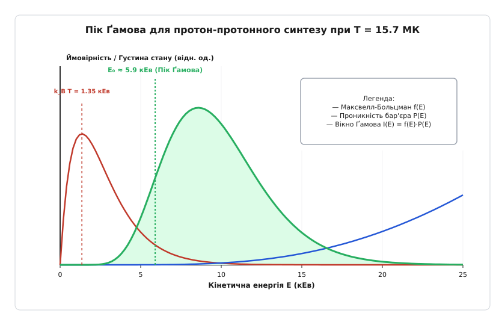
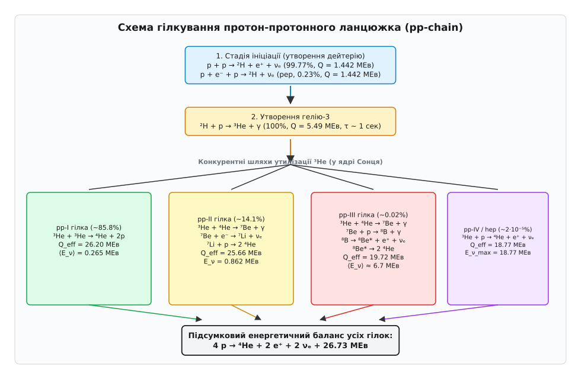
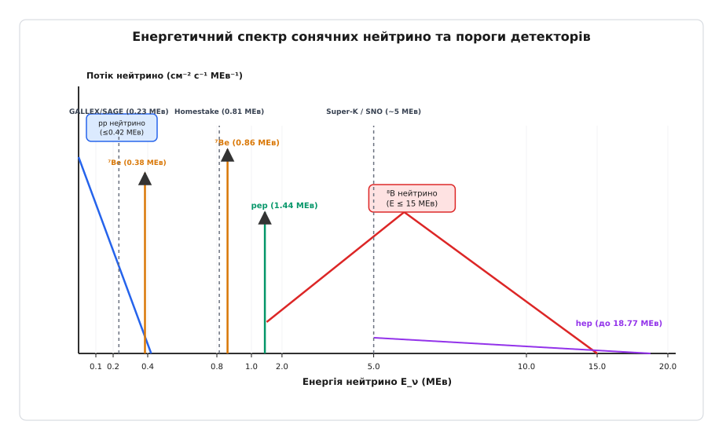

# Протон-протонний ланцюжок

<preknowlist>
- [Кулонівський бар'єр та тунелювання](topic:physics/coulomb-barrier) — квантове тунелювання крізь електростатичний бар'єр та формування піку Ґамова.
- [Енергія зв'язку ядра та краплинна модель Вейцзеккера](topic:physics/binding-energy-liquid-drop) — дефект маси, питома енергія зв'язку нуклонів у легких ядрах.
- [Закон радіоактивного розпаду та період напіврозпаду](topic:physics/radioactive-decay-law) — період напіврозпаду, бета-розпад та електронне захоплення.
</preknowlist>

Центральне ядро Сонця радіусом близько `175 000 кілометрів` випромінює в навколишній космос `3.846 · 10²⁶ Вт` світності у вигляді світла, тепла й корпускулярних потоків частинок. Для підтримки такого стабільного сяйва впродовж `4.6 мільярда років` у центрі Сонця щосекунди `620 мільйонів тонн` водню мають вигоряти й перетворюватися на `616 мільйонів тонн` гелію-4. Решта `4.26 мільйона тонн` маси щосекунди безповоротно трансформуються у чисте випромінювання та кінетичну енергію продуктів реакції. Проте на шляху цього перетворення лежить глибокий парадокс класичної фізики: щоб злити два позитивно заряджені протони, їх необхідно наблизити на відстань порядку `1.4 · 10⁻¹⁵ м` (1.4 фемтометра), де починають ефективно діяти короткодійні привабливі ядерні сили. На таких мікроскопічних відстанях кулонівське відштовхування двох позитивних зарядів створює потенціальний бар'єр висотою понад `1.2 МЕв`. Водночас середня кінетична енергія теплового руху протонів у центрі Сонця за температури `15.7 мільйона кельвінів` становить лише близько `1.35 кЕв` — у тисячу разів менше, ніж потрібно для класичного подолання цього бар'єра.

Розв'язанням цього фундаментального парадоксу є протон-протонний ланцюжок (`pp-chain`, від англійського *proton-proton chain*) — послідовність квантово-механічних та ядерних реакцій, у якій чотири окремі протони послідовно зливаються в одне стабільне ядро гелію-4. На відміну від масивних зір, у яких домінує каталітичний CNO-цикл, у зорях із масою менше `1.3 маси Сонця` саме протон-протонний ланцюжок забезпечує понад `99%` усього енерговиділення.

## Електромагнітна перешкода та квантовий слабкий розпад

Пряме одночасне зіткнення чотирьох протонів в одному мікроскопічному об'ємі є фізично неможливим: ймовірність такого чотиричастинкового зіткнення в зоряній плазмі не перевищує `10⁻³⁵`. Злиття розбивається на послідовність бінарних (двочастинкових) зіткнень. Першим кроком є наближення двох протонів на відстань близько `1.4 фемтометра`, де привабливі ядерні сили перевищують кулонівське відштовхування.

Коли два протони наближаються на таку відстань, утворюється дипротонне складене ядро `²He` (гелій-2). У ядерній фізиці відомо, що ядро `²He` не має жодного зв'язаного стану. Фізична причина цього полягає в спіновій залежності ядерних сил між нуклонами. За принципом Паулі два однакові ферміони (два протони) із нульовим орбітальним моментом `L = 0` можуть перебувати лише у синглетному спіновому стані `¹S₀` із протилежно спрямованими спінами (`J = 0`). Оскільки синглетні ядерні сили є на `35%` слабшими за триплетні `³S₁` (у яких спіни нуклонів паралельні), потенціальна яма синглетного стану не має жодного зв'язаного рівня. Дипротон є незав'язаним за енергією приблизно на `0.09 МЕв` і розпадається назад на два вільні протони за характерний ядерний час `10⁻²¹ секунди`.

Для порівняння, ядро дейтерію `²H` (протон і нейтрон) не підпадає під обмеження принципу Паулі для однакових частинок, тому може перебувати у триплетному стані `³S₁` (`J^π = 1⁺`), де ядерне притягання є достатньо сильним для створення стабільного зв'язаного стану з енергією зв'язку `2.224 МЕв`.

Для того щоб злиття двох протонів відбулося, необхідно, щоб безпосередньо під час цього ультракороткого зіткнення тривалістю `10⁻²¹ секунди` один із протонів зазнав позитронного бета-розпаду — перетворився на нейтрон із випромінюванням позитрона та електронного нейтрино.

Схема початкової реакції ініціації ланцюжка:

```
p + p → ²H + e⁺ + νₑ + 0.420 МЕв
```

Оскільки бета-перетворення протона на нейтрон регулюється слабкою взаємодією, ймовірність реакції під час зіткнення становить лише `~10⁻¹⁸`. У поєднанні з низькою ймовірністю тунелювання крізь кулонівський бар'єр ефективний переріз реакції `p + p` при енергіях сонячного ядра становить `1.77 · 10⁻⁵² см²`. Це найменший переріз серед усіх відомих ядерних реакцій у Всесвіті.

Через надзвичайно малий переріз один конкретний протон у центрі Сонця чекає свого першого успішного злиття в середньому `8.6 мільярда років`. Саме ця повільність є благанням для Всесвіту: вона робить Сонце не вибуховим термоядерним снарядом, а стабільним реактором із повільним регульованим горінням на 10 мільярдів років.

Альтернативним, рідкішим каналом первинного утворення дейтерію є тричастинкове зіткнення за участю електрона плазми — так звана pep-реакція (протон-електрон-протон):

```
p + e⁻ + p → ²H + νₑ + 1.442 МЕв
```

Частка pep-реакції в ядрі Сонця становить всього `0.23%` від загальної кількості утворення дейтерію. На відміну від безперервного спектра pp-нейтрино, pep-нейтрино випромінюються моноенергетичною лінією із чіткою енергією `1.442 МЕв`.

Про те, як протягом 20 століття теоретична фізика йшла від перших гіпотез Еддінґтона до створення точної теорії зоряного нуклеосинтезу та розв'язання проблеми сонячних нейтрино, докладно розказано у вставці [Історія відкриття протон-протонного ланцюжка](topic:physics/nuclear-physics/pp-chain/hist-discovery.md).

## Квантове тунелювання, плазмове екранування та вікно Ґамова

Імовірність подолання кулонівського бар'єра визначається проникністю `P(E)`, яка за ВКБ-наближенням розраховується через параметр Зоммерфельда `η(E)`:

```
P(E) = exp(-2·π·η) = exp(-b / √E)
```

Для системи двох протонів чисельна константа `b = 31.28 кЕв¹/²`. За кінетичної енергії `E = 1 кЕв` ймовірність тунелювання становить `exp(-31.28) ≈ 2.6 · 10⁻¹⁴`. Зі зростанням енергії ймовірність тунелювання експоненційно зростає.

У реальній зоряній плазмі позитивно заряджені протони оточені хмарою вільних електронів, які частково екранують позитивний кулонівський заряд ядра. Цей ефект описується теорією Дебая — Гюккеля. Електронне екранування знижує ефективну висоту кулонівського бар'єра на величину дебаївського потенціалу `U_D = (e² / (4·π·ε₀)) · (1 / r_D)`, де `r_D` — дебаївський радіус екранування плазми. Для центральних умов Сонця за формулою Едвіна Салпітера фактор посилення реакції через електронне екранування становить `f_salpeter ≈ 1.05–1.07`. Це означає, що екранування збільшує швидкість протон-протонних реакцій приблизно на `5–7%`.

З іншого боку, кількість протонів із високою кінетичною енергією в максвеллівському тепловому розподілі експоненційно спадає `f(E) ∝ exp(-E / (k_B · T))`. Перетин двох протилежно спрямованих експонент формує вузький енергетичний інтервал — пік Ґамова.


*Пік Ґамова: перетин максвеллівського розподілу енергій частинок та квантового тунелювання кулонівського бар'єра при температурі T = 15.7 МК.*

Центр піку Ґамова `E₀` для протон-протонної реакції при центральній температурі Сонця `T = 15.7 МК` обчислюється аналітично:

```
E₀ = ((b · k_B · T) / 2)²/³ = ((31.28 · 1.353) / 2)²/³ ≈ 5.92 кЕв
```

Ефективна ширина енергетичного вікна становить `ΔE ≈ 6.54 кЕв`. Вузьке вікно Ґамова у діапазоні від `2.6` до `9.2 кЕв` є єдиною енергетичною зоною, де протони мають достатню кінетичну енергію для тунелювання і водночас присутні у зоряній плазмі в достатній кількості.

Математичне виведення параметра Зоммерфельда, формул піку Ґамова та квантово-механічного S-фактора слабої взаємодії наведено у вставці [Квантово-механічний розрахунок фактора Ґамова та перерізу pp-реакції](topic:physics/nuclear-physics/pp-chain/math-gamow-pp.md).

## Стадія утворення гелію-3 та рівновага ізотопів

Утворене в первинній реакції ядро дейтерію `²H` негайно потрапляє в середовище з високою концентрацією протонів. Захоплення протона дейтерієм здійснюється за рахунок електромагнітної взаємодії з випромінюванням гамма-кванта:

```
²H + p → ³He + γ + 5.494 МЕв
```

Оскільки ця реакція регулюється не слабкою, а електромагнітною взаємодією, її переріз у мільярди разів більший. Середній час життя ядра дейтерію в ядрі Сонця становить всього `1.4 секунди`. Це означає, що дейтерій не накопичується в Сонці, а негайно вигоряє у легкий ізотоп гелію-3.

Ядро `³He` є квантово-стабільним ізотопом. На відміну від дейтерію, захоплення протона ядром `³He` з утворенням `⁴Li` є неможливим, оскільки літій-4 є розпадально-нестабільним нуклідом, який миттєво скидає протон назад. Єдиними шляхами утилізації `³He` є його взаємодія з іншим ядром `³He`, з ядром `⁴He` або з протоном через слабкий розпад. Через це накопичення `³He` у зоряному ядрі триває близько `10⁵ років`, доки його концентрація не досягне стаціонарного рівноважного рівня `n_³He / n_p ≈ 10⁻⁵`, при якому швидкість утворення `³He` зрівнюється зі швидкістю його знищення в наступних реакціях.

## Чотири гілки синтезу гелію-4

Після накопичення гелію-3 відкриваються чотири альтернативні шляхи (гілки) завершення синтезу гелію-4. Вибір конкретної гілки залежить від локальної температури, густини та хімічного складу зоряного ядра.


*Схема гілкування протон-протонного ланцюжка (pp-I, pp-II, pp-III, pp-IV) та підсумковий енергетичний вихід.*

### 1. Гілка pp-I (Основний шлях, ~85.8%)

За помірних температур (`T < 18 МК`) основним способом утилізації `³He` є зіткнення двох ядер гелію-3 між собою:

```
³He + ³He → ⁴He + 2 p + 12.860 МЕв
```

Два ядра `³He` зливаються у високозбуджений стан `⁶Be*`, який негайно скидає два протони, утворюючи стабільне, надзвичайно міцно зв'язане ядро гелію-4 (альфа-частинку). Колосальна енергія зв'язку альфа-частинки (`28.3 МЕв`) пояснює величезний енергетичний вихід цієї стадії (`12.86 МЕв`). Для завершення одного акту pp-I потрібні два первинні дейтерієві акти, отже загалом витрачаються чотири протони, а два повертаються назад у плазму.

Енергетичний баланс гілки pp-I:
- Повний вихід: `Q_total = 26.732 МЕв`
- Нейтринні втрати: `Q_ν = 2 · 0.265 МЕв = 0.530 МЕв`
- Корисне теплове енерговиділення: `Q_eff = 26.202 МЕв` (відносний ккд `98.0%`).

### 2. Гілка pp-II (Канал берилію-7, ~14.1%)

Якщо у зоряному середовищі вже накопичилася достатня кількість ядер гелію-4, ядро `³He` може злитися з ядром `⁴He`, утворюючи радіоактивний ізотоп берилію-7:

```
³He + ⁴He → ⁷Be + γ + 1.586 МЕв
```

Далі ядро `⁷Be` захоплює вільний електрон плазми (орбітальне або вільне електронне захоплення):

```
⁷Be + e⁻ → ⁷Li + νₑ + 0.862 МЕв  (T₁/₂ = 53.22 доби)
```

У виснаженому електронному фоні плазми розпад берилію-7 випромінює дві моноенергетичні лінії нейтрино: основну лінію з енергією `0.862 МЕв` (`89.7%` випадків) та лінію `0.384 МЕв` (`10.3%` випадків, коли ядро літію-7 залишається у збудженому стані). Утворене ядро літію-7 негайно захоплює протон і розпадається на дві альфа-частинки:

```
⁷Li + p → 2 ⁴He + 17.347 МЕв
```

Енергетичний баланс гілки pp-II:
- Нейтринні втрати: `Q_ν = 0.265 МЕв (від pp) + 0.862 МЕв (від ⁷Be) = 1.127 МЕв`
- Корисне теплове енерговиділення: `Q_eff = 25.605 МЕв`.

### 3. Гілка pp-III (Канал бору-8, ~0.02%)

При вищих температурах (`T > 18 МК`) ядро берилію-7 замість захоплення електрона може захопити протон, утворюючи позитронно-активний ізотоп бору-8:

```
⁷Be + p → ⁸B + γ + 0.137 МЕв
```

Ядро бору-8 зазнає позитронного бета-розпаду з півперіодом `0.77 секунди`:

```
⁸B → ⁸Be* + e⁺ + νₑ + 17.980 МЕв
```

Утворений збуджений стан берилію-8 `⁸Be*` протягом `10⁻¹⁶ секунди` розпадається на дві альфа-частинки:

```
⁸Be* → 2 ⁴He + 0.092 МЕв
```

Незважаючи на те що частка гілки pp-III у Сонці становить всього `0.02%`, саме вона випромінює високоенергетичні нейтрино з енергією до `15 МЕв`, які відіграли вирішальну роль у виявленні нейтринних осциляцій.

### 4. Гілка pp-IV або hep-канал (~2·10⁻⁵%)

Вкрай рідкісним є пряме злиття ядра `³He` з протоном із одночасним слабким розпадом:

```
³He + p → ⁴He + e⁺ + νₑ + 19.795 МЕв
```

Реакція випромінює найбільш енергійні сонячні нейтрино з граничною енергією `18.77 МЕв`.

Повний систематичний довідник ядерних параметрів, перерізів та реакційних табло наведено у вставці [Довідник ядерних реакцій та нейтринних параметрів pp-ланцюжка](topic:physics/nuclear-physics/pp-chain/api-pp-reactions-ref.md).

## Сонячні нейтрино як індикатор ядра та осциляційний розв'язок

Нейтрино, що виникають у реакціях pp-ланцюжка, мають принципово різні енергетичні спектри.


*Енергетичний спектр нейтрино різних гілок pp-ланцюжка та пороги детектування експериментальних обсерваторій.*

Історичний хлорний детектор Девіса (Homestake) з порогом `0.814 МЕв` бачив лише борні нейтрино pp-III, тоді як галієві детектори GALLEX та SAGE з порогом `0.233 МЕв` виміряли потік первинних pp-нейтрино. 

Фізичний механізм резонансної конверсії сонячних нейтрино у товщі Сонця описується ефектом Міхеєва — Смірнова — Вольфенштейна (МСВ). Коли електронне нейтрино `νₑ`, утворене в самому центрі Сонця, рухається назовні крізь спадний профіль електронної густини `n_e(r)`, когерентне розсіювання на електронах плазми створює додатковий ефективний потенціал `V_e = √2 · G_F · n_e`. При певній резонансній густині `n_e,res` ефективні масові розщеплення нейтринних станів у речовині зближуються, що призводит до майже `100%` адіабатичного переходу електронних нейтрино у муонні `ν_μ` та тау-нейтрино `ν_τ`. 

Розбіжність між експериментальними даними та Стандартною сонячною моделлю Джо Бакалла довіралася впродовж 30 років, доки канадська підземна обсерваторія SNO у 2001 році за допомогою важкої води не виміряла повний потік нейтрино через нейтральні струми. З'ясувалося, що сумарний потік нейтрино всіх трьох типів точно відповідає розрахованій потужності pp-ланцюжка.

## Астрофізична еволюція, металічність та стійкість зір

Роль pp-ланцюжка у космологічному нуклеосинтезі змінювалася протягом еволюції Всесвіту. Перші зорі Всесвіту (Населення III / Population III), створені після Великого вибуху із чистого водню та гелію, повністю не мали важчих елементів (`Z_met = 0`). Оскільки у їхньому складі були відсутні ядра вуглецю, азоту й кисню, проведення каталітичного CNO-циклу в них було неможливим. Єдиним джерелом енергії для підтримки стійкості перших зір Всесвіту слугував саме протон-протонний ланцюжок. Лише після того як масивні зорі Населення III синтезували вуглець у потроєній альфа-реакції та вибухнули як наднові, CNO-цикл зміг увімкнутися в наступних поколіннях зір.

Співвідношення швидкостей вигоряння водню у pp-ланцюжку та CNO-циклі визначає внутрішню структуру зір різної маси на головній послідовності:

1. **Маломасивні червоні карлики (`0.08 M_⊙ < M < 0.4 M_⊙`)**:
   Центральна температура ядра не перевищує `8–10 МК`. Водень палає виключно через гілку pp-I. Оскільки такі зорі є повністю конвективними (конвекція охоплює весь об'єм від ядра до поверхні), весь водень зорі поступово подається у ядро. Червоні карлики стабільно світять на pp-ланцюжку впродовж сотень мільярдів і навіть трильйонів років.

2. **Зорі сонячної маси (`0.8 M_⊙ < M < 1.2 M_⊙`)**:
   Ядро є променистим (теплоперенос здійснюється випромінюванням), а зовнішня оболонка — конвективною. Центральна температура `15.7 МК` забезпечує домінування гілок pp-I та pp-II. Вміщувана кількість водню у ядрі вигоряє за `10 мільярдів років`. По мірі накопичення гелієвого «попелу» ядро стискається й нагрівається, збільшуючи світьність Сонця на `10%` кожні 1.1 мільярда років.

3. **Масивні зорі (`M > 1.3 M_⊙`)**:
   Центральна температура перевищує `18 МК`. За таких температур кінетика CNO-циклу з чутливістю `ε_CNO ∝ T¹⁶` переганяє pp-ланцюжок (`ε_pp ∝ T⁴.⁶`). Внутрішня структура змінюється на протилежну: ядро стає бурхливо конвективним, а зовнішня оболонка — променистою.

Кінетика вигоряння водню у pp-ланцюжку має унікальну функціональну залежність від температури. У діапазоні температур сонячного ядра швидкість енерговиділення описується степеневим законом:

```
ε_pp ∝ ρ · X² · T⁴.⁶
```

Показник степеня `4.6` є відносно низьким. Низький температурний показник `4.6` забезпечує винятковий негативний зворотний зв'язок і гідродинамічну стійкість Сонця. Якщо температура в центрі Сонця випадково зросте на `1%`:
1. Енерговиділення зросте на `~4.6%`.
2. Додаткова енергія збільшить тепловий тиск плазми `P = ρ · k_B · T / (μ · m_u)`.
3. Завищений тиск змусить ядро розширитися проти сил гравітації.
4. При адіабатичному розширенні плазма охолоне, і температура повернеться до вихідного рівноважного значення.

Цей природний термостат спирається на теорему віріалу `2 · K + U = 0` і забезпечує стабільну роботу протон-протонного ланцюжка протягом `10 мільярдів років`.

Для чисельного аналізу кінетики pp-ланцюжка та розрахунку термодинамічного балансу створено спеціалізований алгоритмічний код, який описується у вставці [Чисельне моделювання гілкування та енерговиділення pp-ланцюжка](topic:physics/nuclear-physics/pp-chain/proj-pp-chain-sim.md).

> 🔧 **Навіщо це.** Знання кінетики pp-ланцюжка та перерізів реакцій є фундаментальною основою сучасного розрахунку еволюції зір, моделювання термоядерних керованих реакторів (де використовуються подібні квантові перерізи D-T та D-D злиття) та інтерпретації даних нейтринних обсерваторій нового покоління (Borexino, Hyper-Kamiokande, JUNO), які вимірюють параметри Всесвіту за потоками сонячних і геонейтрино.
