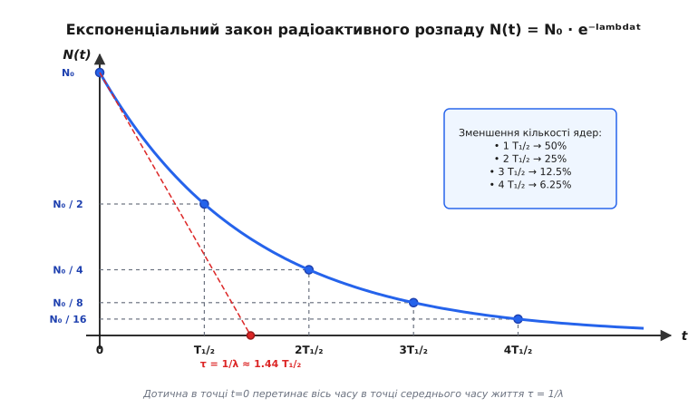
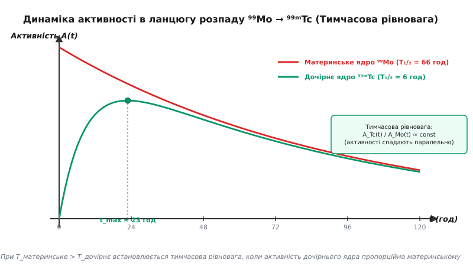
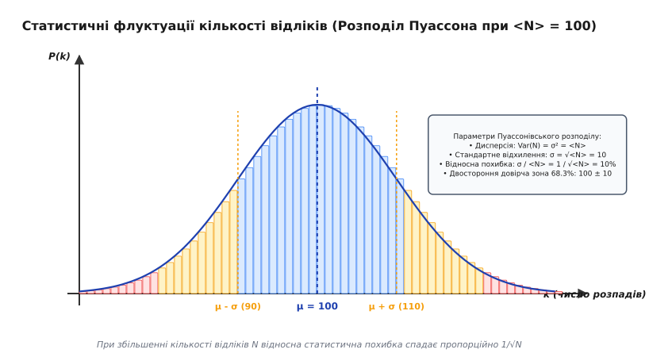

# Закон радіоактивного розпаду та період напіврозпаду

<preknowlist>
- [Ізотопи](book:physics/isotopes) — ядра одного хімічного елемента з однаковою кількістю протонів Z, але різною кількістю нейтронів N.
- [Диференціальне рівняння](book:math/differential-equations) — рівняння, що пов'язує функцію зі швидкістю її зміни.
- [Показникова функція та експонента](book:math/exponential-function) — властивості функції e^x та натурального логарифма ln(x).
</preknowlist>

Якщо взяти зразок урану-238 масою в один грам, у ньому міститься приблизно `2.53 · 10²¹` атомних ядер. Кожної секунди близько `12 400` з цих ядер самочинно вибухають, випромінюючи альфа-частинки та перетворюючись на ядра торію-234. Проте неможливо вказати, яке саме з мільярдів ядер розпадеться наступної миті: окреме ядро живе за законами квантової імовірності й не має жодного «віку» чи ознак зношення. Незважаючи на абсолютну випадковість одиничного розпаду, величезний ансамбль ядер демонструє строгий, суворо детермінований математичний порядок, що описується експоненціальним законом радіоактивного розпаду.

Термін **радіоактивність** (від лат. *radius* — «промінь» та *activus* — «дієвий») описує самочинне перетворення нестабільних атомних ядер у більш стійкі ядра із випромінюванням частинок або високоенергетичного електромагнітного кванту. Детальний шлях від випадкового спостереження засвічування фотопластинок Анрі Беккерелем у 1896 році до формулювання революційної теорії трансутації описано в історичному екскурсі [Історія відкриття закону радіоактивного розпаду](book:physics/nuclear-physics/radioactive-decay-law/hist-discovery.md).

## Фізична природа сталі розпаду та ймовірнісний характер

Квантово-механічна система атомного ядра перебуває в метастабільному енергетичному стані, відокремленому від енергетично вигіднішого стану потенціальним бар'єром. Розпад ядра відбувається шляхом квантового тунелювання частинки (або групи нуклонів) крізь цей бар'єр. Оскільки висота та ширина потенціального бар'єра визначаються внутрішньою структурою ядра і не змінюються з часом, ймовірність тунелювання за будь-який малий інтервал часу `dt` лишається строго константою.

Введемо фундаментальну величину — **сталу розпаду** `λ` (вимірюється в с⁻¹). Вона характеризує ймовірність розпаду одного конкретного ядра за одиницю часу. Для даного **ізотопу** (від грец. *ἴσος* — «рівний, однаковий» та *τόπος* — «місце») величина `λ` є строго фіксованою інваріантною константою.

Завдяки принциповій незалежності ядер одне від одного, кількість розпадів `dN`, що відбуваються в макроскопічному зразку за малий інтервал часу `dt`, прямо пропорційна загальній кількості нестабільних ядер `N(t)`, що збереглися на той момент:

```
dN = -λ · N(t) · dt
```

Знак «мінус» відображає зменшення кількості нестабільних ядер із перебігом часу. 

Швидкість зміни кількості ядер `dN / dt` прямо залежить від поточного чисельного складу ансамблю. Базове диференціальне рівняння показує: чим менше нестабільних ядер залишається в речовині, тим повільніше відбувається абсолютне число розпадів за секунду.

## Квантово-механічний механізм розпаду та фактор Ґамова

Чому стала розпаду `λ` набуває саме такого значення для конкретного ядра і може коливатися від часток секунди до мільярдів років? Фізична відповідь криється у потенціальному бар'єрі ядра.

У 1928 році Георгій Ґамов, а також незалежно Рональд Ґерні та Едвард Кондон, розробили квантову теорію альфа-розпаду. Альфа-частинка (ядро гелію-4 `⁴He²⁺`) утворюється всередині ядра і здійснює коливальний рух між стінками потенціальної ями з частотою спроб `ν ≈ 10²¹` с⁻¹.

Атомне ядро оточене Кулонівським потенціальним бар'єром, висота якого суттєво перевищує кінетичну енергію альфа-частинки. Класична фізика категорично забороняє частинці залишити ядро. Проте в квантовій механіці хвильова функція частинки проникає під кулонівський бар'єр, виникає скінченна ймовірність тунелювання `P_tunnel`.

Стала розпаду `λ` виражається добутком частоти спроб `ν` на ймовірність тунельного проходження `P_tunnel`:

```
λ = ν · P_tunnel = ν · e^(-2S)
```

де `S` — коефіцієнт експоненти Ґамова, що залежить від висоти та ширини Кулонівського бар'єра. Навіть найменші зміни енергії частинки або заряду ядра викликають експоненціальну зміну значення `λ` на 20-30 порядків, що пояснює існування як надзвичайно короткоживучих ізотопів (наприклад, Полоній-212 з `T₁/₂ = 0.3` мікросекунди), так и фундаментально довгоживучих (Уран-238 з `T₁/₂ = 4.47` мільярди років).

## Диференціальна природа та експоненціальний закон

Для знаходження часової залежності кількості ядер `N(t)` розділимо змінні в диференціальному рівнянні та інтегруємо його від початкового моменту `t = 0` (коли кількість ядер дорівнювала `N₀`) до довільного моменту часу `t`:

```
dN / N = -λ · dt
```

Проінтегрувавши ліву частину по `N` від `N₀` до `N(t)`, а праву — по `t` від `0` до `t`, маємо:

```
ln(N(t) / N₀) = -λ · t
```

Потенціювання цього виразу за основою натурального логарифма `e` дає головний **експоненціальний закон радіоактивного розпаду Резерфорда — Содді**:

```
N(t) = N₀ · e^(-λ · t)
```

де **експонента** (від лат. *exponens* — «той, що виставляє напоказ») `e ≈ 2.71828` є основою натуральних логарифмів.


*Залежність кількості залишкових ядер N(t) від часу t у одиницях періоду напіврозпаду T₁/₂. З кожним інтервалом T₁/₂ кількість ядер зменшується вдвічі (N₀ → N₀/2 → N₀/4 → N₀/8).*

Кількість розпадених ядер `N_d(t)` до моменту часу `t` визначається різницею між початковою кількістю та залишком:

```
N_d(t) = N₀ - N(t) = N₀ · (1 - e^(-λ · t))
```

Повний математичний вивід із перевіркою початкових умов та інтегральними перетвореннями наведено у вставці [Математичний вивід та статистика розпаду](book:physics/nuclear-physics/radioactive-decay-law/math-derivation.md).

## Період напіврозпаду T₁/₂ та середній час життя τ

Хоча стала розпаду `λ` є фундаментальною математичною константою, на практиці набагато зручніше оперувати часовими інтервалами, за які кількість речовини зменшується в задану кількість разів.

### Період напіврозпаду

**Період напіврозпаду** `T₁/₂` (від грец. *περίοδος* — «обхід, коловий шлях») — це інтервал часу, протягом якого розпадається рівно половина початкової кількості нестабільних ядер.

Підставивши умову `N(T₁/₂) = N₀ / 2` у закон розпаду, отримуємо:

```
N₀ / 2 = N₀ · e^(-λ · T₁/₂)
e^(λ · T₁/₂) = 2
λ · T₁/₂ = ln(2)
```

Звідси випливає фундаментальне співвідношення між періодом напіврозпаду та сталою розпаду:

```
T₁/₂ = ln(2) / λ ≈ 0.693147 / λ
```

Знаючи період напіврозпаду `T₁/₂`, закон радіоактивного розпаду можна подати у дуже наочній двійковій формі:

```
N(t) = N₀ · 2^(-t / T₁/₂)
```

З цієї формули очевидно, що:
- За `t = 1 · T₁/₂` залишається `N₀ / 2` (50% початкової кількості);
- За `t = 2 · T₁/₂` залишається `N₀ / 4` (25%);
- За `t = 3 · T₁/₂` залишається `N₀ / 8` (12.5%);
- За `t = 10 · T₁/₂` залишається `N₀ / 2¹⁰ = N₀ / 1024` (менше `0.1%`).

### Середній час життя

**Середній час життя** `τ` нестабільних ядер — це середня тривалість існування одного ядра до моменту його розпаду. Математично `τ` дорівнює оберненій величині сталої розпаду:

```
τ = 1 / λ
```

Зв'язок між періодом напіврозпаду `T₁/₂` та середнім часом життя `τ` виражається формулою:

```
T₁/₂ = τ · ln(2) ≈ 0.693 · τ
τ = T₁/₂ / ln(2) ≈ 1.443 · T₁/₂
```

За час `t = τ` кількість нестабільних ядер зменшується в `e ≈ 2.718` разів, тобто залишається приблизно `36.8%` від початкового значення `N₀`. На графіку експоненціальної кривої дотична, проведена до кривої в точці `t = 0`, перетинає вісь часу саме в точці `t = τ`.

### Властивість «відсутності пам'яті» (Memoryless property)

Фундаментальною особливістю радіоактивного розпаду є відсутність накопичення деформацій чи «старіння» ядер. Якщо ядро урану-238 існувало протягом `4.5` мільярдів років і не розпалося, ймовірність його розпаду протягом наступної секунди залишається точно такою ж, як і для ядра урану, що утворилося внаслідок вибуху наднової лише секунду тому:

```
P(тривалість життя > t + s | тривалість життя > t) = P(тривалість життя > s)
```

Експоненціальний закон є єдиним неперервним розподілом ймовірностей, що володіє цією властивістю.

## Активність радіоактивного джерела та одиниці вимірювання

У фізичному експерименті та радіологічному захисті частіше вимірюють не абсолютну кількість ядер `N(t)`, а швидкість їхнього розпаду в даний момент часу.

### Визначення активності

**Активність** `A(t)` (від лат. *activitas* — «діяльність, рух») радіоактивного джерела — це кількість ядерних розпадів, що відбуваються в зразку за одиницю часу:

```
A(t) = |dN / dt| = λ · N(t)
```

Підставляючи вираз для `N(t)`, отримуємо часову залежність активності:

```
A(t) = A₀ · e^(-λ · t) = A₀ · 2^(-t / T₁/₂)
```

де `A₀ = λ · N₀` — початкова активність джерела при `t = 0`. Активність джерела спадає за таким самим експоненціальним законом, як і кількість нестабільних ядер.

### Одиниці вимірювання активності

В Міжнародній системі одиниць (СІ) одиницею вимірювання активності є **Беккерель** (позначення: **Бк**, англ. **Bq**):

> 1 Беккерель відповідає одному ядерному розпаду за секунду (`1 Bq = 1 с⁻¹`).

Оскільки 1 Бк є дуже малою величиною, на практиці використовують кратні префікси: кілобеккерелі (`1 кБк = 10³` Бк), мегабеккерелі (`1 МБк = 10⁶` Бк), гігабеккерелі (`1 ГБк = 10⁹` Бк) та терабеккерелі (`1 ТБк = 10¹²` Бк).

Позасистемною, але широко вживаною одиницею є **Кюрі** (позначення: **Кі**, англ. **Ci**). Історично 1 Кюрі визначався як активність 1 грама чистого радію-226:

```
1 Ci = 3.700 · 10¹⁰ Bq = 37 ГБк
```

### Питома активність

**Питома активність** `A_spec` визначається як активність, припадаюча на одиницю маси зразка (Бк/кг або Бк/г):

```
A_spec = A / m = (λ · N_A) / M = (ln(2) · N_A) / (T₁/₂ · M)
```

де `N_A = 6.022 · 10²³` моль⁻¹ — число Авогадро, а `M` — молярна маса радіонукліда (г/моль).

Формула показує важливу закономірність: **чим коротшим є період напіврозпаду `T₁/₂`, тим більшою є питома активність речовини**. 

Наприклад, 1 грам короткоживучого йоду-131 (`T₁/₂ = 8.02` діб) має питому активність `4.6 · 10¹⁵` Бк/г, тоді як 1 грам довгоживучого урану-238 (`T₁/₂ = 4.47` млрд років) має питому активність лише `1.24 · 10⁴` Бк/г (у `370` мільярдів разів менше). 

Детальні таблиці констант розпаду та питомої активності для понад 10 ключових радіонуклідів зведені у довіднику [Характеристики ключових радіонуклідів та їхніх розпадів](book:physics/nuclear-physics/radioactive-decay-law/api-nuclide-decay-data.md).

## Ланцюги розпадів та рівняння Бейтмана

У багатьох випадках продукт розпаду радіоактивного ядра сам виявляється нестабільним і розпадається далі, утворюючи **ланцюг радіоактивних перетворень**.

У природі існує чотири основних радіоактивних ряди важких елементів:
1. **Ряд Урану-238 (ряд 4n+2)**: починається з `²³⁸U` і закінчується стабільним `²⁰⁶Pb`.
2. **Ряд Тора-232 (ряд 4n)**: починається з `²³²Th` і закінчується стабільним `²⁰⁸Pb`.
3. **Ряд Актинію (ряд 4n+3)**: починається з `²³⁵U` і закінчується стабільним `²⁰⁷Pb`.
4. **Ряд Нептунію (ряд 4n+1)**: починається з штучного `²³⁷Np` і через короткі періоди закінчується `²⁰⁹Bi`.

Розглянемо послідовний розпад 3-ланкового ланцюга:

```
Материнське ядро A --(λ_A)--> Дочірнє ядро B --(λ_B)--> Стабільне ядро C
```

Зміна кількостей ядер кожного типу описується системою диференціальних рівнянь Гаррі Бейтмана:

```
dN_A / dt = -λ_A · N_A
dN_B / dt = λ_A · N_A - λ_B · N_B
dN_C / dt = λ_B · N_B
```

Перший член у рівнянні для `N_B` описує швидкість утворення дочірнього ядра за рахунок розпаду материнського `A`, а другий член — швидкість власного розпаду ядра `B`.

Аналітичний розв'язок для кількості дочірніх ядер `N_B(t)` при початкових умовах `N_A(0) = N_A0`, `N_B(0) = 0` має вигляд:

```
N_B(t) = N_A0 · [ λ_A / (λ_B - λ_A) ] · (e^(-λ_A · t) - e^(-λ_B · t))
```


*Зміна активності материнського радіонукліда Mo-99 (T₁/₂ = 66 год) та дочірнього Tc-99m (T₁/₂ = 6 год). Настання тимчасової рівноваги, коли активності спадають паралельно.*

Залежно від співвідношення між періодами напіврозпаду материнського та дочірнього ядер можливі три режими:

1. **Вікова рівновага (Secular Equilibrium)**: `T₁/₂ (A) >> T₁/₂ (B)` (материнське ядро живе набагато довше за дочірнє, наприклад `²³⁸U → ²²⁶Ra`). Через час `t >> T₁/₂ (B)` встановлюється стан, коли активності материнського та дочірнього ядер стають рівними: `A_B(t) ≈ A_A(t)`.
2. **Тимчасова рівновага (Transient Equilibrium)**: `T₁/₂ (A) > T₁/₂ (B)` (материнське ядро живе довше, але порівнянно з дочірнім, наприклад `⁹⁹Mo → ⁹⁹ᵐTc`). Активність дочірнього ядра спочатку зростає, досягає максимуму в точці `t_max = ln(λ_B / λ_A) / (λ_B - λ_A)`, а потім спадає паралельно з активністю материнського ядра.
3. **Відсутність рівноваги**: `T₁/₂ (A) < T₁/₂ (B)` (материнське ядро розпадається швидше за дочірнє). Материнська фракція швидко зникає, а накопичене дочірнє ядро розпадається зі своїм власним періодом напіврозпаду.

## Статистичні флуктуації та похибки вимірювань

Оскільки радіоактивний розпад є стохастичним квантовим процесом, кількість розпадів `k`, зареєстрованих радіаційним детектором (лічильником Гейгера, сцинтиляційним або напівпровідниковим детектором) за однакові інтервали часу `Δt`, не є строго постійною, а коливається навколо середнього значення `<N>`.

Розподіл кількості відліків описується **розподілом Пуассона**:

```
P(k) = (<N>^k / k!) · e^(-<N>)
```

Важливішою властивістю пуассонівського розподілу є те, що його дисперсія `σ²` дорівнює математичному сподіванню:

```
σ² = <N>  ⇒  σ = √<N>
```

де `σ` — стандартне відхилення (середньоквадратичне відхилення) кількості відліків.


*Розподіл Пуассона для відліків розпаду навколо середнього значення <N> = 100 зі стандартним відхиленням σ = √100 = 10 (відносна статистична похибка 10%).*

Відносна статистична похибка `δ` вимірювання активності виражається фундаментальною формулою:

```
δ = σ / <N> = √<N> / <N> = 1 / √<N>
```

Ця формула показує:
- Якщо детектор зареєстрував `100` відліків, відносна похибка вимірювання становить `1 / √100 = 0.10` (10%).
- Щоб зменшити похибку до `1%` (0.01), необхідно накопичити `10 000` відліків.
- Щоб отримати похибку `0.1%` (0.001), потрібно накопичити `1 000 000` відліків.

Саме тому вимірювання слабоактивних зразків вимагає тривалого часу накопичення сигналів для зниження статистичної похибки до прийнятного рівня. Комп'ютерний алгоритм для симуляції розпадів методом Монте-Карло та аналізу статистичних флуктуацій подано у вставці [Моделювання радіоактивного розпаду методом Монте-Карло](book:physics/nuclear-physics/radioactive-decay-law/proj-decay-sim.md).

## Практичні застосування закону розпаду

Закон радіоактивного розпаду є основою багатьох сучасних технологій у геології, медицині, археології та енергетиці:

1. **Радіоізотопне датування (Геохронологія та археологія)**:
   - **Радіовуглецевий метод (`¹⁴C`)**: Вуглець-14 утворюється у верхніх шарах атмосфери під дією космічних променів і поглинається живими організмами. Після загибелі організму обмін вуглецем припиняється, і вміст `¹⁴C` спадає з періодом напіврозпаду `T₁/₂ = 5730` років. Вимірювання залишкової питомої активності дозволяє точно датувати органічні артефакти віком від 300 до 50 000 років.
   - **Уран-свинцевий метод (`²³⁸U → ²⁰⁶Pb`)**: Завдяки великому періоду напіврозпаду урану-238 (`4.47` млрд років) вимірювання співвідношення ізотопів урану та свинцю у кристалах циркону дозволяє визначати абсолютний вік найдавніших гірських порід Землі та метеоритів (аж до `4.57` мільярдів років).

2. **Ядерна медицина**:
   - **Діагностика (ОФЕТ та ПЕТ)**: Використання короткоживучих радіонуклідів, таких як технецій-99m (`T₁/₂ = 6.0` годин) або фтор-18 (`T₁/₂ = 110` хвилин). Короткий період напіврозпаду забезпечує високу інтенсивність сигналу для сканування органів, але мінімізує сумарну дозу опромінення пацієнта, оскільки радіоактивність швидко зникає.
   - **Променева терапія**: Введення ізотопів з цільовою доставкою до пухлин (наприклад, йод-131 з `T₁/₂ = 8.02` діб для лікування раку щитоподібної залози).

3. **Радіоізотопні термоелектричні генератори (РІТЕГи)**:
   - Використання тепла, що виділяється при розпаді високоактивних нуклідів (наприклад, плутонію-238 з `T₁/₂ = 87.7` років), для автономного живлення космічних апаратів далекого космосу (Voyager 1/2, Curiosity, Perseverance).

> 🔧 **Навіщо це.**
> Знання закону розпаду необхідне для безпечного поводження з радіоактивними відходами та розрахунку захисту. Наприклад, виснажене ядерне паливо містить як короткоживучі високоактивні продуктові фрагменти поділу (цезій-137, стронцій-90 з `T₁/₂ ≈ 30` років), так і довгоживучі актиноїди (плутоній-239 з `T₁/₂ = 24 100` років). Точний розрахунок за законом Резерфорда — Содді дозволяє спроектувати графік витримки відпрацьованих ТВЕЛів у басейнах охолодження та визначити необхідну товщину бетону й свинцю на десятиліття наперед.

## Межі застосовності та квантові ефекти

Хоча закон `N(t) = N₀ · e^(-λt)` виконується з високою точністю для макроскопічних зразків, він має фундаментальні фізичні межі застосовності:

1. **Межа малих чисел (`N ~ 1`)**: Закон описує статистичне середовище. Коли кількість ядер в зразку зменшується до кількох одиниць, неможливо передбачити точний момент розпаду останніх ядер. Можна говорити лише про ймовірність розпаду.
2. **Надкороткі проміжки часу (Квантовий ефект Зенона)**: На дуже малих інтервалах часу `t << 1/λ` (порядку фемтосекунд) квантово-механічна ймовірність розпаду спадає не лінійно (`~ t`), а квадратично (`~ t²`). Якщо вимірювати стан квантової системи неперервно з високою частотою, можна заблокувати її розпад — явище, відоме як квантовий ефект Зенона.
3. **Надвеликі проміжки часу (Асимптотика)**: При `t >> τ` хвильова функція нестабільного стану відхиляється від чисто експоненціальної форми й набуває степеневої асимптотики (`~ t⁻ᵇ`), хоча виявити цей ефект експериментально вкрай важко через наднизьку інтенсивність розпадів.
