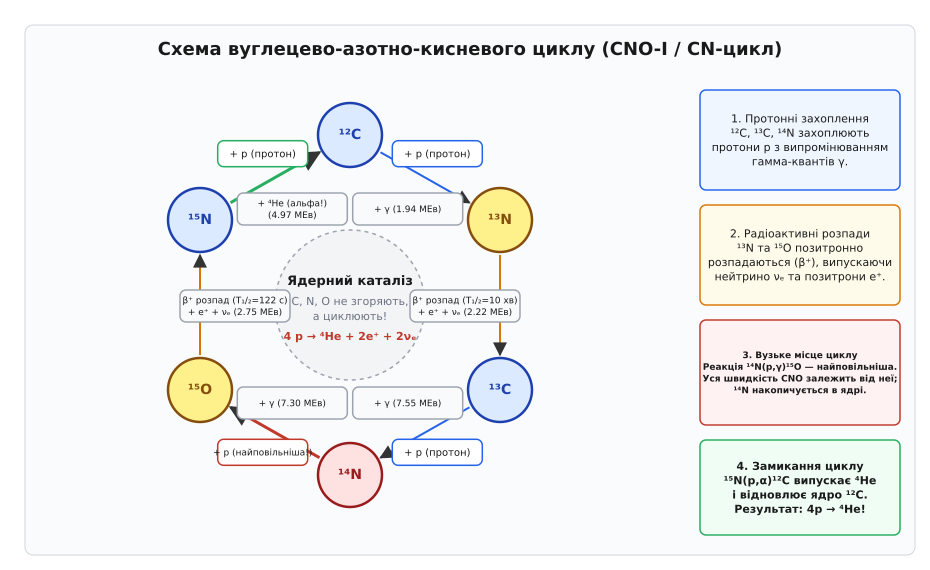
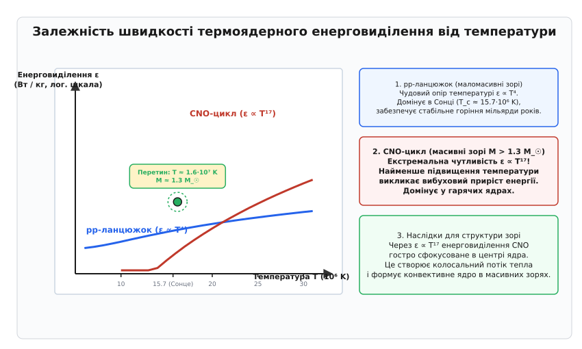

# Термоядерний синтез та цикл Бете (CNO)

<preknowlist>
- [Протон-протонний ланцюжок](topic:physics/pp-chain) — базовий канал синтезу гелію в зорях малої маси та порівняльний енергетичний масштаб.
- [Кулонівський бар'єр](topic:physics/coulomb-barrier) — тунелювання через потенціальний бар'єр електростатичного відштовхування та фактор Ґамова.
</preknowlist>

Кожної секунди Сонце випромінює в навколишній космос `3.86 · 10²⁶ Вт` енергії у вигляді світла, тепла й корпускулярних потоків. Щоб підтримувати таке колосальне й стабільне сяйво протягом мільярдів років, у його надгарячому центральному ядрі щосекунди близько `600 мільйонів тонн` водню мають вигоряти й перетворюватися на `596 мільйонів тонн` гелію. Решта `4 мільйони тонн` маси щосекунди безповоротно трансформуються у чисте випромінювання. Проте фізична реалізація цього процесу зіштовхується з глибоким парадоксом класичної фізики: щоб злити два одноіменно позитивно заряджені ядра водню (протони), їх необхідно наблизити на відстань порядку `10⁻¹⁵ м` (1 фемтометр), де починають ефективно діяти короткодійні приваблювальні ядерні сили. На таких мікроскопічних відстанях електростатичне (кулонівське) відштовхування двох позитивних зарядів створює потенціальний бар'єр висотою понад `1 МЕв`. Водночас середня кінетична енергія теплового руху протонів у центрі Сонця за температури `15.7 мільйона кельвінів` становить лише близько `1 кЕв` — у тисячу разів менше, ніж потрібно для класичного подолання цього бар'єра.

Розв'язання цього фундаментального парадоксу дає квантова механіка. Завдяки корпораскулярно-хвильовому дуалізму матерії протони мають ненульову ймовірність протунелювати крізь кулонівський потенціальний бар'єр, навіть коли їхня кінетична енергія значно нижча за його вершину. Ймовірність квантового тунелювання експоненційно зростає зі збільшенням кінетичної енергії частинок, тоді як кількість таких високоенергетичних частинок у тепловому максвеллівському розподілі за швидкостями експоненційно спадає. Перетин цих двох протилежно спрямованих експонент формує вузький енергетичний інтервал — пік Ґамова, у якому й відбуваються практично всі термоядерні реакції у Всесвіті. Без квантового тунелювання жодна зоря у Всесвіті не змогла б спалахнути, а Всесвіт залишався б темним, холодним і позбавленим хімічних елементів, важчих за водень і гелій.

У зоряній астрофізиці існують два фундаментальні канали послідовного злиття чотирьох протонів у одне стабільне ядро гелію-4: безпосередній протон-протонний ланцюжок (`pp-chain`) та каталітичний вуглецево-азотно-кисневий цикл (`CNO-цикл`, або цикл Бете — Вайцзеккера). Докладно про те, як у 1930-х роках теоретична фізика здолала шлях від перших здогадів про масовий дефект Еддінґтона до створення повноцінної квантової теорії зоряного нуклеосинтезу, розказано у вставці [Історія відкриття CNO-циклу](topic:physics/nuclear-physics/thermonuclear-fusion/hist-bethe-cno.md).

## Енергетичний баланс, питома зв'язаність та дефект маси

Фундаментальною причиною вивільнення колосальної енергії під час термоядерного синтезу є крива питомої енергії зв'язку атомних ядер на один нуклон. Найлегші ядра (водень, дейтерій, тритій) мають низьку питому енергію зв'язку (`~1.1 МЕв` на нуклон для дейтерію). Коли чотири окремі протони об'єднуються у надзвичайно міцно зв'язане ядро гелію-4 (альфа-частинку), питома енергія зв'язку стрибкоподібно зростає до `7.07 МЕв` на нуклон. Ця різниця в енергіях зв'язку проявляється як дефект маси — зменшення сумарної маси спокою кінцевих продуктів реакції порівняно з вихідними частинками.

Під час синтезу одного ядра гелію-4 з чотирьох протонів зміна маси системи обчислюється як:

```
Δm = 4 · m(¹H) - m(⁴He)
```

Застосовуючи високоточні значення атомних мас (що враховують маси чотирьох зв'язаних електронів для збереження електричної нейтральності атомів):

```
4 · m(¹H) = 4 · 1.007825 u = 4.031300 u
m(⁴He)    = 4.002603 u
Δm        = 4.031300 u - 4.002603 u = 0.028697 u
```

Використовуючи фундаментальну формулу Альберта Ейнштейна `E = Δm · c²`, де одна атомна одиниця маси відповідає енергії `931.494 МЕв`, отримуємо повний енергетичний вихід синтезу одного ядра гелію:

```
Q = 0.028697 u · 931.494 МЕв/u ≈ 26.73 МЕв
```

Частина цієї енергії обов'язково уноситься нейтрино, які випромінюються під час бета-плюс розпадів проміжних радіоактивних ядер. Оскільки нейтрино практично не взаємодіють із зоряною речовиною і вільно покидають ядро зі швидкістю світла, ця частина енергії безповоротно втрачається для теплового балансу зорі. З урахуванням середньої енергії двох нейтрино в CNO-циклі (`~1.7 МЕв`), корисна локальна енергія `Q_eff`, яка виділяється у вигляді кінетичної енергії частинок та гамма-квантів і підтримує високий тиск та температуру зоряної плазми, становить:

```
Q_eff = Q - Q_ν ≈ 26.73 МЕв - 1.70 МЕв ≈ 25.03 МЕв
```

Відносне перетворення маси спокою у випромінювання становить `Δm / m ≈ 0.71%`. Це означає, що термоядерний синтез водню є найефективнішим природним джерелом енергії у Всесвіті серед усіх процесів, які не залучають повну анігіляцію матерії й антиматерії. Для порівняння, реакція поділу ядра урану-235 у ядерному реакторі перетворює на енергію лише близько `0.08%` маси, а найпотужніші хімічні реакції горіння — менше `10⁻⁷%`.

## Квантово-ядерний Shell-ефект та енергетичні рівні CNO-ізотопів

З погляду оболонкової моделі ядра (Shell Model), перебіг CNO-циклу регулюється спіново-парними характеристиками квантових станів ядер. Усі ядра каталізаторів належать до 1p-оболонки.

Розглянемо спіни та парності основних станів беручих участь ізотопів:
- **`¹²C`**: парно-парне ядро з повністю закритою 1p₃/₂ підоболонкою, що має спін та парність `J^π = 0⁺`. Це надає вуглецю-12 виняткову квантову стабільність.
- **`¹³N`**: непарно-протонне ядро із `J^π = 1/2⁻`. Захоплення протона на `¹²C` проходить через s-хвильовий канал із нульовим орбітальним моментом (`l = 0`), що робить переріз реакції відносно високим.
- **`¹³C`**: непарно-нейтронне ядро із `J^π = 1/2⁻`.
- **`¹⁴N`**: непарно-непарне ядро із `J^π = 1⁺`. Оскільки протон захоплюється ядром із ненульовим спіном `1⁺`, утворення ізотопу кисню-15 проходить через нерезонансний електромагнітний E1-перехід, який має вкрай низьку ймовірність. Це є другою важливою квантово-механічною причиною того, чому реакція `¹⁴N(p,γ)¹⁵O` є найповільнішою ланкою всього CNO-циклу.
- **`¹⁵O`**: непарно-нейтронне ядро із `J^π = 1/2⁻`.
- **`¹⁵N`**: непарно-протонне ядро із `J^π = 1/2⁻`. При захопленні протона `¹⁵N + p` утворюється збуджений стан `¹⁶O*` із спіном `1⁻` на енергії `12.44 МЕв`. Цей стан лежить значно вище порога розпаду по альфа-каналу (`7.16 МЕв`), тому складене ядро з високою ймовірністю розпадається на `¹²C + ⁴He` (`99.96%`), що й забезпечує замикання циклу CNO-I.

## Двоканальна природа зоряного паління водню

Пряме одночасне зіткнення чотирьох протонів у єдиному акті взаємодії з утворенням гелію-4 є фізично неможливим: імовірність такого багаточастинкового зіткнення у зоряній плазмі є знехтовно малою (`< 10⁻³⁵`). Тому природний нуклеосинтез розбиває цей процес на послідовність двочастинкових (бінарних) реакцій.

Принципово відмінними є два механізми реалізації цієї послідовності:

1. **Прямий протон-протонний ланцюжок (`pp-chain`)**. Реакція починається з найпростішого зіткнення двох протонів: `p + p → ²H + e⁺ + νₑ`. Оскільки дипротонне ядро `²He` (гелій-2) є зв'язано-нестабільним і розпадається назад на два протони за `~10⁻²¹ секунди`, утворення стабільного дейтерію `²H` вимагає, щоб саме під час ультракороткого зіткнення один із протонів зазнав слабкого бета-плюс розпаду (перетворився на нейтрон, випустивши позитрон та електронне нейтрино). Ймовірність такої слабкої взаємодії під час зіткнення становить всього `~10⁻¹⁸`. Через це конкретний протон у ядрі Сонця чекає свого першого успішного злиття в середньому `9 мільярдів років`. Ця надзвичайно низька ймовірність є благанням для Всесвіту: вона робить Сонце повільним і надзвичайно стабільним «пальником», що забезпечує рівномірне сяйво протягом 10 мільярдів років.

2. **Каталітичний вуглецево-азотно-кисневий цикл (`CNO-цикл`)**. Якщо у зоряній плазмі від самого початку присутні важкі елементи — вуглець, азот та кисень, синтезовані попередніми поколіннями зір у процесах первинного та вторинного нуклеосинтезу (так звана металічність зоряної речовини `Z_met`), злиття протонів може відбуватися за участю цих ядер як каталізаторів. Протони послідовно приєднуються до ядер вуглецю й азоту. На кожному кроці заряд ядра змінюється, викликаючи швидкі позитронні розпади надлишкових протонів у нейтрони. На фінальній шостій стадії приєднання четвертого протона викликає виліт альфа-частинки (ядра гелію-4), повністю відновлюючи початкове ядро вуглецю-12.

У CNO-циклі ядра вуглецю, азоту й кисню **не витрачаються і не руйнуються** у підсумковому речовинному балансі. Вони діють як справжні ядерні каталізатори: прискорюють перетворення водню на гелій у мільйони разів порівняно з pp-ланцюжком, якщо температура ядра зорі достатньо висока.

## Механізм CNO-I циклу (CN-цикл)

Основне кільце CNO-циклу, яке забезпечує понад `99.9%` його енерговиділення за помірних зоряних температур, називається CNO-I циклом або CN-циклом. Воно складається із замкненого ланцюжка з шести послідовних ядерних реакцій.


*Схема реакцій CNO-I циклу: чотири протони перетворюються на один атом гелію-4, а ядра вуглецю, азоту й кисню виступають рециклічними ядерними каталізаторами.*

Розглянемо детальний фізичний механізм кожної з шести реакцій CNO-I циклу:

### Крок 1: Радіаційне захоплення протона вуглецем-12 (`¹²C(p,γ)¹³N`)
Реакційна послідовність стартує із приєднання протона до стабільного ядра вуглецю-12:

```
¹²C + p → ¹³N + γ + 1.944 МЕв
```

Заряд ядра зростає з `Z = 6` (вуглець) до `Z = 7` (азот). Реакція супроводжується випромінюванням гамма-кванта, який відносить енергію зв'язку приєднаного протона. Утворюється нестабільний радіоактивний ізотоп азоту-13.

### Крок 2: Позитронний бета-розпад азоту-13 (`¹³N(e⁺νₑ)¹³C`)
Ядро азоту-13 має надлишок протонів відносно кількості нейтронів (7 протонів і 6 нейтронів). Вночі воно зазнає спонтанного позитронного бета-плюс розпаду з півперіодом `T₁/₂ ≈ 9.97 хвилин`:

```
¹³N → ¹³C + e⁺ + νₑ + 2.221 МЕв
```

Один із протонів усередині ядра перетворюється на нейтрон, випускаючи позитрон `e⁺` та електронне нейтрино `νₑ`. Випущений позитрон негайно анігілює із вільним електроном плазми, додаючи два анігіляційні гамма-кванти по `0.511 МЕв`. Утворюється стабільний ізотоп вуглецю-13.

### Крок 3: Захоплення протона вуглецем-13 (`¹³C(p,γ)¹⁴N`)
Ядро вуглецю-13 захоплює другий протон із зоряної плазми:

```
¹³C + p → ¹⁴N + γ + 7.551 МЕв
```

Заряд ядра знову повертається до `Z = 7`, і формується найпоширеніший та найстабільніший ізотоп азоту — азот-14. Реакція характеризується високим енергетичним виходом `7.55 МЕв`.

### Крок 4: Захоплення протона азотом-14 (`¹⁴N(p,γ)¹⁵O`) — Вузьке місце циклу
Азот-14 захоплює третій протон, утворюючи радіоактивний ізотоп кисню-15:

```
¹⁴N + p → ¹⁵O + γ + 7.297 МЕв
```

Ця реакція є **найповільнішою ланкою всього CNO-циклу** (так зване *bottleneck* — пляшкове горло). Через вищий заряд ядра азоту (`Z = 7`) кулонівський бар'єр у цій реакції суттєво вищий, ніж при захопленні протона вуглецем (`Z = 6`), а астрофізичний ядерний S-фактор при нерезонансних зоряних енергіях є малим (`S(0) ≈ 1.66 кеВ · барн`). Саме швидкість цієї реакції задає підсумковий темп перебігу всього CNO-циклу й обмежує його загальне енерговиділення.

### Крок 5: Позитронний бета-розпад кисню-15 (`¹⁵O(e⁺νₑ)¹⁵N`)
Радіоактивне ядро кисню-15 (8 протонів і 7 нейтронів) є бета-нестабільним і розпадається з півперіодом `T₁/₂ ≈ 122.2 секунди`:

```
¹⁵O → ¹⁵N + e⁺ + νₑ + 2.754 МЕв
```

Розпад супроводжується випромінюванням второго сонячного нейтрино CNO-циклу з максимальною енергією `1.73 МЕв` та утворенням рідкісного стабільного ізотопу азоту-15.

### Крок 6: Розщеплення азоту-15 протоном (`¹⁵N(p,α)¹²C`) — Замикання циклу
Азот-15 захоплює четвертий протон. Утворене високозбуджене складене ядро кисню-16 мгновенно розпадається по каналу вильоту альфа-частинки (ядра гелію-4):

```
¹⁵N + p → ¹²C + ⁴He + 4.965 МЕв
```

У результаті цієї реакції утворюється нове стабільне ядро гелію-4, а вихідне ядро вуглецю-12 **повністю регенерується** у своєму початковому стані. Повний цикл замикається і відновлює вихідний каталізатор для наступного оберту.

Складаючи разом усі шість реакцій CNO-I циклу, ми бачимо, що проміжні ядра `¹³N`, `¹³C`, `¹⁴N`, `¹⁵O` та `¹⁵N` повністю скорочуються, даючи точний сумарний речовинний баланс:

```
4 p → ⁴He + 2 e⁺ + 2 νₑ + 2 γ + 26.73 МЕв
```

Два позитрони `e⁺` анігілюють із двома електронами навколишнього середовища: `2 e⁺ + 2 e⁻ → 4 γ + 2.04 МЕв`, додаючи анігіляційну енергію до загального теплового балансу зорі.

## Друге кільце: CNO-II цикл (NO-цикл)

Приблизно у `0.04%` випадків (одне з 2500 зіткнень) на шостому кроці взаємодія протона з ядром азоту-15 відбувається не через виліт альфа-частинки `(p,α)`, а через радіаційне захоплення з випромінюванням гамма-кванта `(p,γ)`:

```
¹⁵N + p → ¹⁶O + γ + 12.13 МЕв
```

Ця альтернативна гілка відгалуження запускає друге кільце CNO-циклу — CNO-II (або NO-цикл):

1. `¹⁶O + p → ¹⁷F + γ` (радіаційне захоплення протона киснем-16 з утворенням фтору-17)
2. `¹⁷F → ¹⁷O + e⁺ + νₑ` (позитронний розпад фтору-17, `T₁/₂ ≈ 64.5 секунди`)
3. `¹⁷O + p → ¹⁴N + ⁴He` (розщеплення кисню-17 протоном із вильотом `⁴He` та відновленням азоту-14)

CNO-II цикл повністю повертає ядерний матеріал назад у початкове кільце CNO-I через азот-14. При надвисоких температурах виникають ще рідкіші розширення CNO-III та CNO-IV, які задіюються у вибухових процесах у нових та наднових зорях.

## Фізична кінетика та азотне збагачення Всесвіту

Оскільки реакція `¹⁴N(p,γ)¹⁵O` є найповільнішою ланкою CNO-циклу, її низька швидкість викликає фундаментальний ефект перерозподілу ізотопних концентрацій важких елементів у ядрі зорі.

Коли зоря з масою понад `1.3 M_☉` формується з міжзоряної хмари і виходить на головну послідовність, початкові відносні вмісти вуглецю, азоту та кисню відповідають початковій металічності середовища (типове співвідношення `C : N : O ≈ 3 : 1 : 6`). Проте як тільки в ядрі вмикається CNO-цикл, вуглець-12 та кисень-16 швидко залучаються у реакції захоплення протонів і перетворюються на азот-14. Оскільки вихід із азоту-14 через повільну реакцію `¹⁴N(p,γ)¹⁵O` є ускладненим, майже увесь початковий запас вуглецю й кисню **накопичується у формі азоту-14**.

Строгий чисельний розрахунок цієї жорсткої системи кінетичних диференціальних рівнянь методом Рунґе — Кутти наведено у вставці [Чисельна симуляція кінетики CNO-циклу](topic:physics/nuclear-physics/thermonuclear-fusion/proj-cno-solver.md).

У результаті встановлення динамічної стаціонарної рівноваги CNO-циклу:
- Понад `95%` усього початкового вуглецю й кисню у зоряному ядрі перетворюються на азот-14.
- Ізотопне співвідношення вуглецю `¹²C / ¹³C` змінюється від початкового космічного значення `89` до рівноважного зоряного `3.5 – 4.0`.
- Азот-14 стає найпоширенішим важким елементом у вигорілому зоряному ядрі.

Цей перерозподіл має фундаментальне значення для космохімії та еволюції Галактики. Коли червоні гіганти та надгіганти скидають свої зовнішні оболонки у вигляді зоряного вітру або під час пульсацій, матеріали згорілого CNO-ядра (збагачені азотом-14) виносяться у міжзоряне середовище. Саме CNO-цикл у зорях є головним космічним фабрикантом азоту, з якого згодом формуються азотовмісні сполуки, атмосфери планет і азотисті основи ДНК та РНК живих організмів.

## Температурна залежність та конвективна структура зір

Найважливішою астрофізичною рисою CNO-циклу є його екстремально висока чутливість до температури середовища.


*Порівняння температурної чутливості швидкості енерговиділення: pp-ланцюжок тримає помірний ухил ε ∝ T⁴, тоді як CNO-цикл проявляє стрімке зростання ε ∝ T¹⁷ із точкою перетину біля 16 мільйонів кельвінів.*

Поблизу температур `T ≈ 1.5 · 10⁷ K` питома швидкість енерговиділення (Вт/кг) для двох каналів описується степеневими законами:

Для протон-протонного ланцюжка:
```
ε_pp ∝ ρ · X² · T⁴
```

Для CNO-циклу:
```
ε_CNO ∝ ρ · X · X_CNO · T¹⁷
```

де `X` — масова частка водню, `X_CNO` — сумарна масова частка елементів CNO. Повний квантово-механічний вивід показника `17` із параметрів тунелювання Ґамова наведено у вставці [Математична модель тунелювання та піку Ґамова](topic:physics/nuclear-physics/thermonuclear-fusion/math-gamow-cno.md).

При зростанні температури від `15 мільйонів` до `20 мільйонів кельвінів` (підвищення лише на `33%`) енерговиділення pp-ланцюжка зростає у `(1.33)⁴ ≈ 3.1 раза`, тоді як енерговиділення CNO-циклу вибухає у `(1.33)¹⁷ ≈ 130 разів`!

Ця екстремальна чутливість `ε_CNO ∝ T¹⁷` кардинально змінює внутрішню будову зір залежно від їхньої маси відповідно до **критерію конвективної нестійкості Шварцшильда**:

```
∇_rad = (3 / (16 · π · a · c · G)) · ((κ · P · F_rad) / (m · T⁴)) > ∇_ad = 2/5
```

де `∇_rad` — променистий градієнт температури, а `∇_ad` — адіабатичний градієнт.

- **Маломасивні зорі (`M < 1.3 M_☉`, як Сонце)**. Центральна температура ядра становить `T_c ≈ 15.7 мільйона K`. За цієї температури на CNO-цикл припадає лише **близько 1%** від загальної світимості Сонця, а `99%` забезпечує pp-ланцюжок. Помірне зростання `ε_pp ∝ T⁴` створює розмиту зону енерговиділення. Потік тепла є помірним, тож у центральному ядрі енергія транспортується променистим переносом (перевипромінюванням фотонів), а конвективна зона розташована лише на зовнішній периферії зорі.

- **Масивні зорі (`M > 1.3 M_☉`, зорі спектральних класів A, B, O)**. Центральна температура ядра перевищує `18–20 мільйонів K`. CNO-цикл стає **абсолютно домінуючим** джерелом енергії. Через закон `ε_CNO ∝ T¹⁷` уся енергія зорі виділяється у крихітному точковому об'ємі в самому центрі ядра. Виникає колосальний потік тепла, який перевищує критичний градієнт Шварцшильда для променистого переносу (`∇_rad > ∇_ad`). У результаті ядро масивних зір стає **бурхливо конвективним**: гаряча плазма з центру інтенсивно перемішується, забезпечуючи постійне підведення свіжого водневого палива з периферії ядра прямо в зону реакції.

## Роль металічності та зоряні популяції (Population I, II, III)

Вплив CNO-циклу на еволюцію зір прямо залежить від вмісту важких елементів (металічності `Z_met`) у зоряній плазмі:

1. **Зорі популяції I (Population I, висока металічність `Z_met ≈ 0.01 – 0.04`)**. Це молоді зорі типу Сонця та масивних зір галактичного диска. Вони містять достатню кількість вуглецю, азоту й кисню для повноцінної роботи CNO-циклу, що забезпечує нормальне вигоряння водню у масивних світилах.
2. **Зорі популяції II (Population II, низька металічність `Z_met < 0.001`)**. Старі зорі гало Галактики та кулястих скупчень. Через низький вміст CNO-каталізаторів для включення CNO-циклу потрібні вищі центральні температури, тому поріг переходу від pp-ланцюжка до CNO-циклу зміщується в бік вищих мас.
3. **Первинні зорі популяції III (Population III, нульова металічність `Z_met = 0`)**. Перші зорі Всесвіту, які сформувалися з первинного біг-бенгівського нуклеосинтезу (лише водень і гелій). У них CNO-цикл повністю відсутній (`X_CNO = 0`). Без CNO-каталізаторів первинні масивні зорі не мали ефективного джерела енергії при помірних температурах. Вони змушені були гравітаційно стискатися до тих пір, поки температура у їхніх центрах не сягала `10⁸ K`, запускаючи потрійну альфа-реакцію `3 α → ¹²C`. Лише після утворення перших порцій вуглецю в ядрі вмикався спалахоподібний CNO-цикл, що зупиняв подальше стискання зорі.

## Експериментальна нейтринна спектроскопія (Borexino)

Оскільки фотони, народжені в термоядерних реакціях у центрі Сонця, зазнають мільйонів актів розсіяння і пробиваються до поверхні понад 100 тисяч років, вони повністю втрачають пам'ять про конкретний первинний ядерний процес. Єдиними частинками, здатними донести пряму інформацію з самого серця Сонця, є нейтрино (`νₑ`).

Під час CNO-циклу випромінюються дві групи моноенергетичних та спектральних нейтрино:
1. `¹³N → ¹³C + e⁺ + νₑ` (максимальна енергія нейтрино `E_max = 1.199 МЕв`)
2. `¹⁵O → ¹⁵N + e⁺ + νₑ` (максимальна енергія нейтрино `E_max = 1.732 МЕв`)

У листопаді 2020 року підземний нейтринний детектор **Borexino**, розташований під 1400 метрами гірської породи в Національній лабораторії Ґран-Сассо в Італії, вперше в історії фізики зареєстрував потік CNO-нейтрино від Сонця. Детектор вимірювавпружне розсіяння нейтрино на електронах у 300 тоннах надчистого рідкого сцинтилятора.

Виміряний потік CNO-нейтрино на Землі склав `7.0 (+3.0 / -2.0) · 10⁸ см⁻²·с⁻¹`. Це вимірювання довело, що CNO-цикл відповідає за `1.0 (+0.4 / -0.3)%` сонячної світимості. Експериментальне підтвердження CNO-циклу стало фундаментальним триумфом сонячної фізики, який остаточно закрив вісімдесятилітній шлях перевірки теорії Ганса Бете.

## Порівняння з керованим термоядерним синтезом на Землі

Існує фундаментальна різниця між зоряним термоядерним синтезом та спробами створити керований термоядерний реактор на Землі (токамаки, стеларатори, лазерний інерціальний синтез):

- **Зоряний синтез (CNO та pp-ланцюжок)** спирається на колосальне гравітаційне утримання речовини (`G · M² / R`). Оскільки зоря має велетенські розміри й масу, швидкість реакції на один кубічний метр у центрі Сонця є надзвичайно малою — об'ємне енерговиділення становить всього `~276 Вт/м³` (що менше за питоме тепловиділення людського тіла чи компостної купи!). Проте завдяки колосальному об'єму сонячного ядра підсумкова потужність сягає `3.86 · 10²⁶ Вт`.
- **Земний термоядерний синтез** не має гравітаційного утримання і змушений працювати у мікроскопічних об'ємах плазми. Для отримання практично корисної потужності об'ємне енерговиділення має становити десятки мегават на кубічний метр (`~10⁷ Вт/м³`). Тому CNO-цикл та pp-ланцюжок є абсолютно непридатними для земної енергетики через їхні надто малі перерізи за вимірюваних температур.
- На Землі використовується найшвидша реакція між важкими ізотопами водню — дейтерієм та тритієм (`D + T → ⁴He + n + 17.6 МЕв`). Для цієї реакції кулонівський бар'єр є найнижчим (`Z₁ = 1`, `Z₂ = 1`), а ядерний переріз має потужний резонанс при енергії `107 кЕв`, що дає переріз `S(0) ≈ 11700 кеВ · барн` — у 7000 разів більше, ніж для найшвидших CNO-реакцій!

> 🔧 **Навіщо це.**
> Розуміння CNO-циклу та його температурної чутливості є основним інструментом сучасного астрофізика. Воно дозволяє розраховувати тривалість життя та еволюційні треки масивних зір, визначати вік кулястих зоряних скупчень за точкою повороту з головної послідовності, інтерпретувати спектри вивержень нових зір та моделювати хімічне збагачення галактик азотом. У ядерній фізиці параметри CNO-реакцій слугують калібрувальним стандартом для вимірювання надмалих перерізів тунелювання на підземних прискорювачах важких іонів.

## Гарячий CNO-цикл (Hot CNO) у вибухових астрофізичних процесах

У стаціонарних зорях температура ядра не перевищує `40 мільйонів кельвінів`, і характерний час захоплення протонів ядрами `¹³N` та `¹⁵O` є значно більшим за півперіоди їхнього радіоактивного бета-розпаду (`10 хвилин` та `2 хвилини`).

Однак у катаклізмічних вибухових середовищах — таких як акреційні диски білих карликів у подвійних системах (нові зорі) або поверхні нейтронних зір (рентгенівські спалахувачі), температура плазми зростає до `T > 10⁸ K` (понад `100 мільйонів кельвінів`).

За таких екстремальних умов характерний час протонного захоплення `¹³N(p,γ)¹⁴O` стає **коротшим** за час бета-розпаду азоту-13 (`10 хвилин`). Цикл перемикається у так званий **гарячий CNO-цикл (Hot CNO)**:

```
¹²C(p,γ)¹³N(p,γ)¹⁴O(e⁺νₑ)¹⁴N(p,γ)¹⁵O(e⁺νₑ)¹⁵N(p,α)¹²C
```

У гарячому CNO-циклі темп енерговиділення більше не залежить від температури, а повністю обмежується півперіодами бета-розпаду радіоактивних ядер `¹⁴O` (`T₁/₂ = 71 с`) та `¹⁵O` (`T₁/₂ = 122 с`). Це викликає термоядерну нестійкість і призводить до потужних вибухів нових зір із викидом у міжзоряний простір рідкісних ізотопів вуглецю й азоту.

Термоядерний синтез за CNO-циклом є первинним двигуном масивних зір Всесвіту: саме він живить найяскравіші світила, визначає їхню внутрішню конвективну структуру і створює той азот, з якого складається атмосфера нашої планети.
