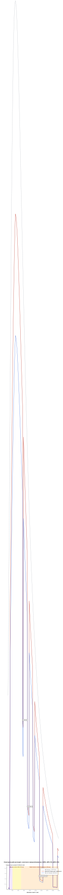
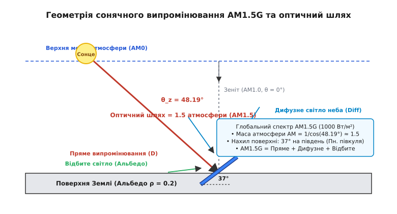
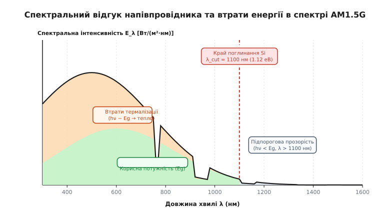
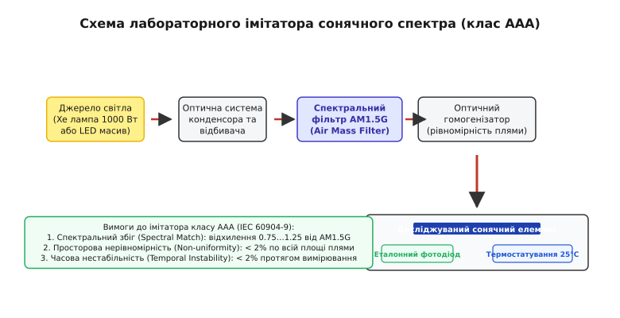

# Стандартний сонячний спектр AM1.5G

<preknowlist>
- [Випромінювання чорного тіла](book:physics/blackbody-radiation) — спектральний розподіл випромінювання нагрітого тіла за законом Планка.
- [Модель сонячної інсоляції](book:physics/optics/solar-irradiance-model) — поняття маси атмосфери (Air Mass), зенітний кут Сонця та геометрія освітлення.
- [Релеєвське розсіяння світла](book:physics/optics/rayleigh-scattering) — розсіяння на молекулах газів повітря та його залежність від довжини хвилі.
</preknowlist>

Коли інженер вимірює ефективність кремнієвого фотоелемента під монохроматичним лазерним променем із довжиною хвилі `λ = 808 нм`, пристрій показує ККД майже 40%, оскільки кожен поглинутий фотон має енергію, що лише незначно перевищує ширину забороненої зони кремнію `E_g = 1.12 еВ`. Проте той самий фотоелемент під яскравим полудневим сонцем перетворює на електрику лише близько 20% енергії світла. Причина полягає у тому, що природне сонячне випромінювання — це не впорядкований промінь однієї частоти, а складний спектральний ансамбль мільярдів фотонів із довжинами хвиль від жорсткого ультрафіолету до далекого інфрачервоного діапазону. 

Щоби лабораторні вимірювання фотоелектричних модулів, світлофільтрів та оптичних покриттів у Токіо, Мюнхені чи Голдені (штат Колорадо) давали абсолютно однакові результати, світова наукова й інженерна спільнота зафіксувала єдиний еталонний розподіл спектральної густоти випромінювання біля поверхні Землі — **стандартний сонячний спектр AM1.5G** (*Standard Solar Spectrum AM1.5 Global*, від англійського *Air Mass* — «маса атмосфери» та латинського *spectrum* — «видимий образ, привид»). Цей спектр визначає точну густину потужності світла на кожній довжині хвилі й нормований на інтегральну густину потужності **1000 Вт/м²**.

---

### 1. Сонячне випромінювання за межами атмосфери (AM0)

Джерелом сонячного світла є фотосфера Сонця — тонкий зовнішній шар плазми товщиною близько 300–500 км із середньою температурою `T ≈ 5778 K`. Згідно з фізикою квантового випромінювання, така розпечена плазма випромінює електромагнітні хвилі у безповітряний космічний простір. Спектральний розподіл цього випромінювання на першому рівні наближення описується законом Планка для абсолютно чорного тіла. Законом Стефана — Больцмана задається повна випромінювальна здатність поверхні Сонця, яка досягає колосальної величини `63.1 МВт/м²`.

На середній відстані Землі від Сонця (одна астрономічна одиниця, `1 АО ≈ 149.6×10⁶ км`) розбіжний світловий потік послаблюється пропорційно квадрату відстані. У результаті кожна квадратна метрова площадка, орієнтована перпендикулярно до сонячних променів поза межами земної атмосфери, отримує близько **1361 Вт/м²** енергії. Цю фундаментальну фізичну величину називають **сонячною константою** `G_sc`. Сучасні супутникові радіометри (місії *SORCE/TIM*, *SOHO/VIRGO*) визначають це значення з точністю до `±0.5 Вт/м²`.

Через еліптичність орбіти Землі (ексцентриситет `e ≈ 0.0167`) відстань від нашої планети до Сонця безперервно змінюється протягом року — від перигелію (близько 3 січня, `147.1 млн км`) до афелію (близько 4 липня, `152.1 млн км`). Через це реальна позаатмосферна інсоляція зазнає сезонних коливань амплітудою близько `±3.3%`:

```
E_ext(d) = G_sc · [1 + 0.033 · cos(360° · d / 365)]
```

У перигелії реальний позаатмосферний потік досягає **1412 Вт/м²**, а в афелії падає до **1321 Вт/м²**. Спектральний стандарт AM0 зафіксовано для середньої орбітальної відстані у 1 АО.

Позаатмосферний спектральний розподіл сонячної інсоляції називають **спектром AM0** (*Air Mass Zero*, або маса атмосфери нуль).


*Порівняння спектральної густоти випромінювання Сонця поза атмосферою (AM0) та біля поверхні Землі (AM1.5G і AM1.5D) із зазначенням атмосферних смуг поглинання.*

Хоча крива AM0 згладжено нагадує планківську криву випромінюваного чорного тіла за температури 5778 K, вона порізана тисячами вузьких темних ліній поглинання — **фраунгоферовими лініями** (*Fraunhofer lines*). Вони виникають тоді, коли неперервний тепловий потік із глибин фотосфери проходить крізь холодніші зовнішні шари сонячної атмосфери, де атоми водню (лінії серії Бальмера), гелію, заліза, кальцію (інтенсивні лінії H та K у фіолетовій області) та натрію (дублет D1/D2) резонансно поглинають світло на своїх власних квантових переходах.

Спектр AM0 є незамінним еталоном для проектування космічних апаратів та сонячних батарей супутників. Проте для наземних застосувань він категорично не підходить: перш ніж досягти поверхні планети, сонячний промінь долає товщу газової оболонки Землі, яка радикально змінює його спектральний склад.

---

### 2. Геометрія атмосферного шляху та поняття маси атмосфери AM1.5

Коли сонячний промінь входить у земну атмосферу, він взаємодіє з молекулами газів, водяною парою, озоном та підвішеними мікроскопічними аерозолями. Ступінь ослаблення світла прямо залежить від довжини шляху, який промінь долає у газовому шарі.

Для опису цієї довжини вводять безрозмірний параметр — **масу атмосфери** `AM` (*Air Mass*). За одиницю `AM = 1.0` приймають товщину атмосфери, яку проходить світло від Сонця, що перебуває строго в зеніті (вертикально над головою спостерігача, кут зеніту `θ_z = 0°`) на рівні моря при стандартному барометричному тиску `101.325 кПа`.

У плоскопаралельному наближенні оптичний шлях зв'язаний із зенітним кутом Сонця `θ_z` простою тригонометричною залежністю:

```
AM = 1 / cos(θ_z)
```

Зафіксуємо значення маси атмосфери `AM = 1.5`. Знайдемо відповідний зенітний кут Сонця `θ_z`:

```
cos(θ_z) = 1 / 1.5 = 2/3 ≈ 0.66667
θ_z = arccos(0.66667) ≈ 48.19°
```

Зенітний кут `θ_z ≈ 48.19°` (що відповідає висоті Сонця над горизонтом `h_sun = 90° - 48.19° = 41.81°`) обрано не випадково. Це середнє річне положення Сонця в середніх широтах Північної Америки, Європи й Азії (між 35° та 45° північної широти) протягом робочих годин доби.


*Геометричне виведення маси атмосфери AM1.5 для зенітного кута 48.19° та орієнтації приймальної поверхні під кутом 37° до горизонту.*

Зенітний кут Сонця `θ_z` змінюється протягом доби і року. Для його обчислення застосовують формулу сферичної астрономії:

```
cos(θ_z) = sin(φ) · sin(δ) + cos(φ) · cos(δ) · cos(ω)
```

де `φ` — географічна широта спостерігача, `δ` — склонення Сонця (кут між променями Сонця й площиною екватора, що коливається від -23.45° у грудні до +23.45° у червні), `ω` — сонячний годинний кут (кут обертання Землі відносно сонячного меридіана, де `15°` відповідають одній годині часу).

Детальне математичне виведення корекцій маси атмосфери з урахуванням кривизни Землі (формула Кастена — Янга) та чисельне інтегрування потоків міститься у вставці [математика спектрального інтегрування та фотонного потоку](book:physics/optics/am15-solar-spectrum/math-spectral-integration.md).

---

### 3. Оптичні механізми ослаблення світла в атмосфері

Проходячи крізь атмосферний шлях товщиною `AM = 1.5`, первинне позаатмосферне випромінювання втрачає понад 26% своєї інтегральної потужності. Поглинання й розсіяння відбуваються за чотирма основними фізичними механізмами.

#### 1. Молекулярне розсіяння (Релеєвське розсіяння)
Молекули азоту `N₂` та кисню `O₂`, розмір яких значно менший за довжину хвилі світла (`d ≪ λ`), пружно розсіюють падаючі електромагнітні хвилі. Згідно з теорією Лорда Релея, переріз розсіяння назад і вбік обернено пропорційний четвертому степеню довжини хвилі:

```
σ_R(λ) ∝ 1 / λ⁴
```

Через цю залежність короткохвильова фіолетова й синя частини спектра (`300–450 нм`) розсіюються в атмосфері у 6–8 разів ефективніше, ніж довгохвильова червона частина (`700 нм`). Саме релеєвське розсіяння вилучає значну частку синіх фотонів із прямого сонячного променя й забарвлює денне небо у блакитний колір. Кутовий розподіл релеєвського розсіяння є симетричним відносно падаючого променя та описується індикатрисою `I(θ) ∝ 1 + cos²(θ)`.

#### 2. Аерозольне розсіяння (розсіяння Мі)
Мікроскопічні краплі води, пил, сажа та морська сіль, розмір яких порівнянний із довжиною хвилі світла (`d ≈ λ`), викликають розсіяння Мі (*Mie scattering*). На відміну від релеєвського, розсіяння Мі має слабшу залежність від довжини хвилі (пропорційно `1 / λ^α`, де `α ≈ 1.3`) і спрямоване переважно вперед уздовж руху сонячного променя, утворюючи світлий ореол довкола сонячного диска. Вплив аерозолів описують аерозольною оптичною товщею `AOD` (*Aerosol Optical Depth*). У стандарті AM1.5G зафіксовано значення `AOD₅₀₀ = 0.084`, що відповідає дуже чистому сільському повітрю.

#### 3. Селективне озонове поглинання
Молекули озону `O₃`, зосереджені у стратосфері (на висотах 15–35 км), виступають абсолютним оптичним щитом для жорсткого ультрафіолету. Вони повністю поглинають фотони в смугах Гартлі й Хаггінса (`λ < 290 нм`), завдяки чому сонячний спектр біля поверхні Землі має різкий короткохвильовий зріз на позначці `280–290 нм`. Менш інтенсивне поглинання озоном спостерігається у видимому діапазоні (смуги Шаппюї, `500–700 нм`).

#### 4. Молекулярне поглинання водяною парою, киснем та CO₂
В інфрачервоній області суцільна планківська крива розривається глибокими «провалами» — смугами ротаційно-коливального поглинання молекул:
- **Молекулярний кисень `O₂`**: вузька й глибока смуга Фраунгофера A при `λ = 760 нм` та смуга B при `λ = 688 нм`.
- **Водяна пара `H₂O`**: гігантські смуги поглинання з центрами при `λ = 940 нм`, `1130 нм`, `1380 нм` та `1870 нм`. На дні цих смуг атмосфера стає майже абсолютно непрозорою.
- **Вуглекислий газ `CO₂`**: інтенсивні смуги поглинання при `λ = 1570 нм`, `2000 нм` та `2700 нм`.
- **Малі атмосферні гази (`CH₄`, `N₂O`)**: вузькі смуги поглинання у середньому інфрачервоному діапазоні.

Результуючий спектр біля поверхні Землі набуває характерного «пилкоподібного» профілю зі стрімкими провалами і піками прозорості (оптичними вікнами атмосфери).

---

### 4. Розрізнення спектрів AM1.5G (Global) та AM1.5D (Direct)

Сонячне світло, яке досягає приймача на поверхні Землі, складається з трьох геометричних компонентів:
1. **Пряме випромінювання** (*Direct Normal Irradiance*, D): промені, які пройшли крізь атмосферу без зміни напрямку й надходять безпосередньо з видимого сонячного диска (кутовий розмір диска `~0.53°`).
2. **Дифузне випромінювання** (*Diffuse Sky Irradiance*, Diff): світло, яке було розсіяне молекулами газів та аерозолями в атмосфері й падає на поверхню з усіх точок небесного купола.
3. **Відбите випромінювання** (*Ground Albedo*, Refl): сонячне світло, відбите від земної поверхні та навколишніх об'єктів на приймальну площину.

Залежно від конфігурації оптичного приймача у світовій практиці закріплено два окремі стандарти AM1.5:

```
Спектр AM1.5D (Direct Normal):
  • Враховує ЛИШЕ прямі промені від сонячного диска
  • Інтегральна густина потужності ≈ 900.1 Вт/м²
  • Застосування: лінзові та дзеркальні сонячні концентри (CPV), трекерні системи

Спектр AM1.5G (Global Tilt):
  • AM1.5G = Пряме + Дифузне + Відбите від ґрунту (Альбедо ρ_g = 0.2)
  • Площина приймача нахилена під кутом 37° до горизонту на південь
  • Інтегральна густина потужності = 1000.4 Вт/м² (нормується на 1000 Вт/м²)
  • Застосування: плоскі сонячні панелі, загальна оптика, матеріалознавство
```

Нормативне значення інтегральної густоти потужності AM1.5G становить **1000 Вт/м²** (або `1 кВт/м²`). У випробувальних лабораторіях цю величину прийнято називати **«одним сонцем»** (*1 sun*).

Повний перелік стандартизованих атмосферних констант, концентрацій газів та допусків міститься у вставці [довідник параметрів стандарту ASTM G173-03](book:physics/optics/am15-solar-spectrum/api-astm-g173.md).

---

### 5. Спектральні діапазони та енергетичний баланс AM1.5G

Загальний потік енергії стандарту AM1.5G (`1000 Вт/м²`) розподіляється по трьох головних спектральних діапазонах:

```
+-------------------------------------------------------------------------+
| УФ (280–400 нм)  | Видиме світло (400–700 нм) | Інфрачервоне (>700 нм)  |
| 46.3 Вт/м² (4.6%)| 427.0 Вт/м² (42.7%)       | 526.7 Вт/м² (52.7%)     |
+-------------------------------------------------------------------------+
```

#### 1. Ультрафіолетовий діапазон (`280–400 нм`)
Несе лише **4.6%** загальної енергії (`46.3 Вт/м²`). Хоча частка потужності мала, кожен УФ-фотон має високу квантову енергію (`E_photon = 3.1–4.4 еВ`). Цього достатньо для розриву хімічних зв'язків у полімерах, тому УФ-компонент викликає фотодеградацію захисних герметиків і оптичних покриттів. Усередині цього діапазону жорсткий УФ-B (`280–315 нм`) становить лише `1.1 Вт/м²` завдяки поглинанню стратосферним озоном, а м'який УФ-A (`315–400 нм`) акумулює решту `45.2 Вт/м²`.

#### 2. Видимий діапазон (`400–700 нм`)
Містить **42.7%** загальної енергії (`427.0 Вт/м²`). У цьому вікні розташований абсолютний максимум спектральної густоти потужності AM1.5G — близько **1.57 Вт/(м²·нм)** на довжині хвилі `λ ≈ 500 нм` (зелено-блакитне світло). Видиме світло є найважливішим для людського зору, фотосинтезу (фотосинтетично активна радіація PAR, `400–700 нм`) та більшості ширкозонних фотоелементів. Колірна температура спектра AM1.5G у видимому діапазоні становить близько `4870 K`.

#### 3. Інфрачервоний діапазон (`700–4000 нм`)
Акумулює понад половину всієї сонячної енергії — **52.7%** (`526.7 Вт/м²`). Діапазон поділяють на:
- **Ближній ІЧ (NIR, `700–1100 нм`)**: `344.2 Вт/м²` (34.42%). Зона найвища ефективності для кремнієвих фотоелементів, де квантова енергія фотонів близька до ширини забороненої зони кремнію `E_g = 1.12 еВ`.
- **Короткохвильовий ІЧ (SWIR, `1100–2000 нм`)**: `154.1 Вт/м²` (15.41%). Лежить за межею поглинання кремнію (`λ_cut = 1100 нм`). Тут розташовані глибокі атмосферні смуги поглинання водяної пари та вуглекислого газу.
- **Середній та далекий ІЧ (`>2000 нм`)**: `28.8 Вт/м²` (2.88%). Не бере участі у генерації носіїв більшості напівпровідників і повністю витрачається на тепловий нагрів пристрою.

---

### 6. Взаємодія спектра AM1.5G із напівпровідниками та межі ККД

Для оптоелектроніки та фотовольтаїки вирішальне значення має не лише потужність випромінювання у ватах, а й **фотонна щільність** — кількість фотонів `Φ_λ`, що падають на квадратний метр за одну секунду. Зв'язок між спектральною густиною потужності `E_λ` та фотонним потоком `Φ_λ` задається формулою:

```
Φ_λ(λ) = E_λ(λ) · λ / (h · c)
```

Загальний фотонний потік спектра AM1.5G у діапазоні від 280 до 4000 нм становить колосальне число — близько **`4.31×10²¹ фотонів/(м²·с)`**.

Коли сонячне світло потрапляє на напівпровідник із шириною забороненої зони `E_g`, фотони взаємодіють із кристалічною ґраткою за суворими квантовими правилами.


*Розподіл енергії AM1.5G при поглинанні кремнієм: зона корисної електричної потужності, втрати на термалізацію надпорогових фотонів та підпорогова прозорість.*

У процесі поглинання спектра AM1.5G одноперехідним напівпровідником виникають дві фундаментальні енергетичні втрати:

#### 1. Підпорогова прозорість (Sub-bandgap transparency loss)
Фотони з довжиною хвилі `λ > λ_cut = h·c / E_g` мають енергію, меншу за ширину забороненої зони (`hν < E_g`). Напівпровідник для них прозорий: вони проходять крізь кристал, не народжуючи електронно-діркових пар. Для кремнію (`E_g = 1.12 еВ`, `λ_cut = 1100 нм`) ці втрати відбирають близько 20% всієї енергії спектра AM1.5G.

#### 2. Термалізація гарячих носіїв (Thermalization loss)
Фотони з довжиною хвилі `λ < λ_cut` мають надлишкову енергію `hν > E_g`. Вони народжують електронно-діркову пару, але надлишок енергії `hν - E_g` за пікосекунди віддається кристалічній ґратці у вигляді тепла (випромінювання фононів), оскільки електрон і дірка релаксують до країв дозволених зон. Для високоенергетичних УФ- та синіх фотонів втрати термалізації перевищують 50% їхньої початкової енергії.

Через комбінацію термалізації та підпорогової прозорості теоретичний ККД одного p-n переходу під спектром AM1.5G обмежений **межею Шоклі — Квайссера** (*Shockley-Queisser limit*). Для кремнію (`E_g = 1.12 еВ`) ця межа становить **33.1%**, а абсолютний максимум для одноперехідного елемента досягається при `E_g = 1.34 еВ` і дорівнює **33.7%**.

Подолати цю межу дозволяють **багатокаскадні (тандемні) сонячні елементи**, у яких кілька напівпровідників із різними забороненими зонами (наприклад, перовськіт із `E_g = 1.68 еВ` поверх кремнію з `E_g = 1.12 еВ` або трикаскадні GaInP/GaAs/Ge) розміщують один за одним. Верхній елемент поглинає УФ та синє світло з мінімальною термалізацією, а нижні елементи збирають довгохвильове інфрачервоне світло, що піднімає теоретичну межу ККД понад 45%.

Історію формування еталонних сонячних спектрів від болометричних вимірювань Еббота до створення сучасних комп'ютерних атмосферних моделей викладено у вставці [історія сонячних спектральних стандартів від болометра Еббота до норми ASTM G173](book:physics/optics/am15-solar-spectrum/hist-smarts-standard.md).

---

### 7. Спектральний аналіз різних матеріалів фотовольтаїки

Різні родини напівпровідників мають специфічну квантову чутливість до окремих ділянок спектра AM1.5G:

- **Монокристалічний кремній (c-Si)**: `E_g = 1.12 еВ`, поглинає світло аж до `1100 нм`. Оскільки кремній є непрямозонним напівпровідником, його коефіцієнт поглинання поблизу краю `1000–1100 нм` є відносно низьким, що вимагає товщини пластини понад 100–150 мкм для повного поглинання світла.
- **Арсенід галію (GaAs)**: `E_g = 1.42 еВ` (`λ_cut = 873 нм`). Прямозонний напівпровідник із надзвичайно стрімким краєм поглинання: плівка товщиною всього 2–3 мкм поглинає понад 99% падаючих фотонів із `λ < 873 нм`. Показує найвищий ККД серед одноперехідних елементів (до 29.1% в лабораторії).
- **Перовськітні фотоелементи (MAPbI₃)**: органо-неорганічні перовськіти мають регульовану заборонену зону `E_g = 1.55–1.60 еВ`. Вони демонструють високий коефіцієнт поглинання у видимому діапазоні (`400–750 нм`), що робить їх ідеальним верхнім каскадом для перовськіт-кремнієвих тандемів.
- **Телурид кадмію (CdTe)**: `E_g = 1.50 еВ` (`λ_cut = 826 нм`). Прямозонний тонкоплівковий напівпровідник, який ідеально узгоджений із максимумом інтенсивності AM1.5G та застосовується у промислових сонячних електростанціях.

---

### 8. Лабораторне відтворення спектра AM1.5G: сонячні імітатори

Оскільки природне сонячне світло змінює свій спектральний склад протягом дня залежно від хмарності, висоти Сонця та вологості повітря, провести сертифіковані метрологічні вимірювання на відкритому повітрі вкрай важко. Для випробувань фотоелементів у лабораторних умовах застосовують спеціальні оптичні пристрої — **імітатори сонячного випромінювання** (*Solar Simulators*).


*Структурна схема оптичного тракту лабораторного імітатора сонячного спектра стандарту IEC 60904-9 (Клас AAA).*

Стандарт **IEC 60904-9** висуває суворі метрологічні вимоги до імітаторів сонячного спектра. Для отримання вищого **Класу AAA** прилад повинен забезпечувати:
1. **Спектральний збіг (Class A Spectral Match)**: відхилення інтенсивності випромінювання імітатора від еталонного спектра AM1.5G у кожному з 6 спектральних контрольних інтервалів (від 400 до 1100 нм) не повинно перевищувати діапазон `0.75…1.25` (відхилення у межах ±25%).
2. **Просторова нерівномірність (Class A Spatial Non-uniformity)**: нерівномірність освітленості по всій площі робочого стола не повинна перевищувати `2%`.
3. **Часова нестабільність (Class A Temporal Instability)**: коливання світлового потоку під час зняття вольт-амперної характеристики не повинні перевищувати `2%`.

Основними джерелами світла в класичних імітаторах виступають **ксенонові дугові лампи високого тиску** (*Xenon arc lamps*) у комбінації з інтерференційними оптичними фільтрами AM1.5G. У сучасних метрологічних комплексах дедалі частіше застосовують **багатоканальні світлодіодні (LED) масиви**, де кілька десятків типів світлодіодів із різними довжинами хвиль первинного випромінювання незалежно регулюються мікроконтролером, даючи змогу прецизійно синтезувати спектр AM1.5G із мінімальною похибкою.

Практичний програмний комплекс для аналізу спектральних даних ASTM G173, розрахунку фотонного потоку та обчислення струму короткого замикання наведено у вставці [обчислювальний аналіз спектра AM1.5G та спектрального відгуку](book:physics/optics/am15-solar-spectrum/proj-am15-analyzer.md).

---

### 9. Підсумковий синтез

Стандартний сонячний спектр AM1.5G — це не просто теоретична розрахункова модель земної атмосфери, а фундаментальний метрологічний еталон сучасної фотовольтаїки, оптоелектроніки та оптичного матеріалознавства. Завдяки нормуванню спектральної густоти потужності на рівні **1000 Вт/м²** за маси атмосфери **AM1.5** та зенітного кута **48.19°**, науковці й інженери в усьому світі отримали єдину координаційну систему. Спектр AM1.5G дає змогу об'єктивно порівнювати ККД сонячних елементів, розраховувати теоретичні межі ефективності напівпровідникових матеріалів та створювати високоточне лабораторне обладнання.
