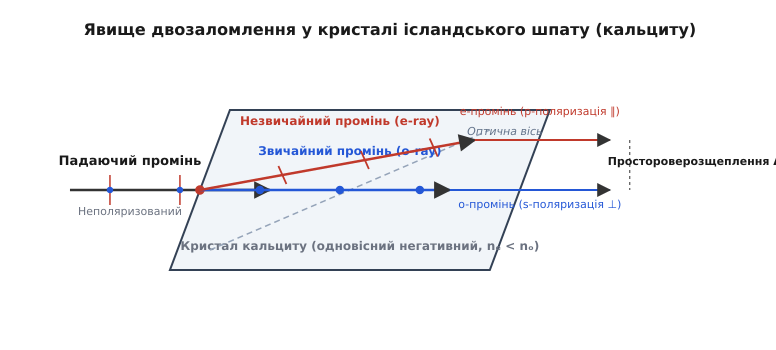
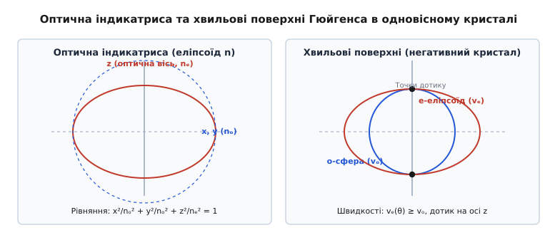
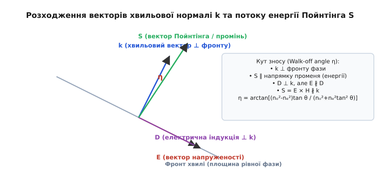
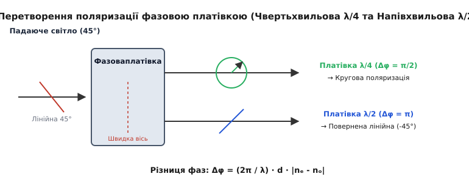

# Двозаломлення в анізотропних середовищах

<preknowlist>
- [Поляризація світла](topic:physics/light-polarization) — векторний характер електромагнітної хвилі, лінійна, кругова та еліптична поляризація.
- [Показник заломлення](topic:physics/refractive-index) — фазова швидкість світла в середовищі та діелектрична проникність.
- [Принцип Гюйгенса](topic:physics/huygens-principle) — огинаюча вторинних хвильових фронтів та геометрія хвильової поверхні.
- [Закон Снелла](topic:physics/snells-law) — геометрія заломлення світлового променя на межі середовищ.
</preknowlist>

Якщо покласти прозорий кристал ісландського шпату (різновид кальциту `CaCO₃`) на надруковану сторінку тексту, читач побачить подвійне зображення кожної літери. При обертанні кристала навколо вертикальної осі одне зображення залишається нерухомим, а друге починає описувати коло навколо першого. Якщо ж спрямувати на грань кристала вузький пучок світла під прямим кутом, він розщеплюється на два паралельні промені, один із яких проходить прямо без відхилення, а другий заломлюється під кутом, незважаючи на строго перпендикулярне падіння на поверхню.

Цей експеримент демонструє явний парадокс для класичної оптичної теорії ізотропних середовищ, де процес заломлення регулюється єдиним скалярним показником заломлення `n`. У прозорому анізотропному кристалі світлова хвиля розпадається на два незалежні збурення, які поширюються з різними фазовими швидкостями та поляризовані у взаємно перпендикулярних площинах. Це явище отримало назву **двозаломлення** або **подвійне променезаломлення** (birefringence).


*Кристал кальциту розщеплює неполяризований світловий промінь на два ортогонально поляризовані промені — звичайний (o) та незвичайний (e).*

---

## 1. Кристалохімічні та електродинамічні основи анізотропії

В ізотропному середовищі (такому як оптичне скло, вода або гази) аморфна структура або висока кубічна симетрія розташування атомів забезпечує однакову поляризованість електронних оболонок у всіх напрямках. Зсув електронних хмар атомів під дією електричного поля світлової хвилі не залежить від орієнтації вектора напруженості `E`. Вектор електричного зміщення `D` завжди паралельний вектору `E` (`D = ε_0 · ε · E`), а відносна діелектрична проникність `ε` та показник заломлення `n = √ε` є скалярними константами.

У кристалах із некубічною симетрією (тригональною, тетрагональною, гексагональною, ромбічною, моноклінною або триклінною) міжатомні відстані, густина електронних хмар та характер хімічних зв'язків суттєво відрізняються вздовж різних кристалографічних осей. 

### Кристалохімічний механізм на прикладі кальциту, кварцю та рутилу

1. **Кальцит (`CaCO₃`):** Його кристалічна ґратка містить плоскі трикутні карбонатні іони `CO₃³⁻`, розташовані у паралельних площинах, перпендикулярних до трикратної осі симетрії (осі `z`). Внутрішньомолекулярні ковалентні зв'язки в площині іона `CO₃³⁻` є міцними, і електронні хмари легко зміщуються під дією змінного електричного поля світлової хвилі, яка поляризована в цій площині. Проте у напрямку, перпендикулярному до площини іона, поляризованість електронних оболонок є значно меншою. Внаслідок цього показник заломлення для світла, поляризованого перпендикулярно оптичній осі, є високим (`n_o = 1.6580`), а для світла, поляризованого уздовж осі — низьким (`n_e = 1.4864`). Це робить кальцит **сильно негативним одновісним кристалом** (`Δn = n_e - n_o = -0.1716`).
2. **Кварц (`SiO₂`):** Кристалічна структура кварцю утворена спіралеподібними ланцюжками з кремній-кисневих тетраедрів `SiO₄`, витягнутими вздовж головної осі симетрії. Поляризованість уздовж ланцюжків є більшою, ніж між ними. Тому показник заломлення вздовж осі є вищим (`n_e = 1.5517`), ніж перпендикулярно до неї (`n_o = 1.5426`). Кварц є **позитивним одновісним кристалом** (`Δn = +0.0091`).
3. **Рутил (`TiO₂`):** Тетрагональна ґратка рутилу складається із витягнутих октаедрів `TiO₆`, що утворюють ланцюжки вздовж вісі `c`. Електронна поляризованість іонів титану та кисню вздовж цієї осі досягає екстремальних значень, забезпечуючи гігантське позитивне двозаломлення (`n_o = 2.5837`, `n_e = 2.8725`, `Δn = +0.2888`).

### Тензорний опис діелектричного відгуку

Внаслідок мікроскопічної асиметрії відгук середовища на зовнішнє світлове поле стає тензорним. Вектор електричного зміщення `D` перестає бути паралельним вектору напруженості електричного поля `E` і задається матеріальним співвідношенням:

```
D_i = ε_0 · ∑_j (ε_ij · E_j)
```

де `ε_ij` — тензор відносної діелектричної проникності (симетричний тензор другого рангу, у якому `ε_ij = ε_ji`).

У спеціально обраній системі декартових координат `(x, y, z)`, які називаються **головними оптичними осями кристала**, тензор діелектричної проникності зводиться до діагональної форми із трьома головними значеннями `ε_x`, `ε_y`, `ε_z`. Відповідно, середовище характеризується трьома **головними показниками заломлення**:

```
n_x = √ε_x,   n_y = √ε_y,   n_z = √ε_z
```

Залежно від кількості різних значення серед трійки `(n_x, n_y, n_z)` усі прозорі кристалічні середовища класифікуються на три класи:

1. **Ізотропні кристали:** `n_x = n_y = n_z = n` (кубічна симетрія — алмаз, кубічний оксид цирконію, кухонна сіль `NaCl`). Оптичні властивості однакові в усіх напрямках.
2. **Одновісні кристали (Uniaxial crystals):** Кристали тригональної, тетрагональної та гексагональної симетрій мають одну особливу вісь симетрії вищого порядку (вісь `z`), вздовж якої оптичні властивості є симетричними. Для них виконується співвідношення `n_x = n_y = n_o` (звичайний показник заломлення), а `n_z = n_e` (головний незвичайний показник заломлення).
   - **Позитивні одновісні кристали (`n_e > n_o`):** Незвичайний промінь поширюється повільніше за звичайний (кварц `SiO₂`, рутил `TiO₂`, фторид магнію `MgF₂`).
   - **Негативні одновісні кристали (`n_e < n_o`):** Незвичайний промінь поширюється швидше за звичайний (ісландський шпат `CaCO₃`, ніобат літію `LiNbO₃`, нітрат sodium `NaNO₃`).
3. **Двовісні кристали (Biaxial crystals):** Кристали нижчих симетрій (ромбічної, моноклінної, триклінної) мають три різні головні показники заломлення (`n_x ≠ n_y ≠ n_z`). У таких середовищах існують два незалежні напрямки, вздовж яких фазові швидкості обох компонент хвилі є однаковими (прикладами є слюда мусковіт, гіпс, топаз, борат барію `BBO`, титаніл-фосфат калію `KTP`).

Детальну хронологію вивчення анізотропії від експериментів Бартоліна 1669 року до тріумфу хвильової теорії Френеля наведено у вставці [📜 Історія відкриття двозаломлення](topic:physics/birefringence/hist-birefringence-discovery.md).

---

## 2. Оптична індикатриса та геометрія хвильових поверхонь Гюйгенса

Для математичного опису фазових швидкостей та напрямків поляризації світлових хвиль в анізотропному середовищі використовують тривимірний геометричний образ — **оптичну індикатрису** (еліпсоїд показників заломлення або еліпсоїд Френеля).

Оптична індикатриса являє собою еліпсоїд у просторі нормованих компонент вектора електричної індукції `D`:

```
x² / n_x² + y² / n_y² + z² / n_z² = 1
```

Для одновісного кристала (`n_x = n_y = n_o`, `n_z = n_e`) оптична індикатриса перетворюється на еліпсоїд обертання навколо оптичної осі `z`:

```
x² / n_o² + y² / n_o² + z² / n_e² = 1
```


*Оптична індикатриса та відповідні вторинні хвильові поверхні для звичайного (сфера) і незвичайного (еліпсоїд) променів.*

### Застосування оптичної індикатриси
Щоб визначити фазові показники заломлення для плоскій хвилі, яка поширюється у напрямку хвильової нормалі `s = (s_x, s_y, s_z)`:
1. Через центр індикатриси проводять площину, строго перпендикулярну до напрямку хвильової нормалі `s`: `s_x · x + s_y · y + s_z · z = 0`.
2. Перетин цієї площини з індикатрисою утворює **еліпс перерізу**.
3. Довжини піввісей цього еліпса дорівнюють фазовим показникам заломлення `n₁` та `n₂` двох дозволених монохроматичних хвиль.
4. Напрямки великої та малої піввісей еліпса вказують строго дозволені напрямки коливань вектора електричного зміщення `D₁` та `D₂`.

Згідно з хвильовим принципом Гюйгенса, кожна точка середовища, якої досягає світлове збурення, стає джерелом вторинних хвиль. В одновісному анізотропному середовищі кожна точка випромінює дві системи вторинних хвильових фронтів:

- **Звичайна хвиля (Ordinary wave або o-wave):** Вектор електричного зміщення `D` коливається перпендикулярно до головного перерізу (площини, що проходить через оптичну вісь та хвильовий вектор). Для цього напрямку коливань фазова швидкість `v_o = c / n_o` є однаковою в усіх напрямках. Вторинний хвильовий фронт звичайного променя є **ідеальною сферою** радіуса `r_o = v_o · t`.
- **Незвичайна хвиля (Extraordinary wave або e-wave):** Вектор електричного зміщення `D` коливається в площині головного перерізу. Фазова швидкість `v_e(θ)` змінюється залежно від кута `θ` між хвильовим вектором та оптичною віссю. Вторинний хвильовий фронт незвичайного променя є **еліпсоїдом обертання** з піввісями `r_o = (c / n_o) · t` та `r_e = (c / n_e) · t`.

Сферичний хвильовий фронт звичайної хвилі та еліпсоїдальний хвильовий фронт незвичайної хвилі доторкаються один до одного у двох точках на оптичній осі `z`. Це означає, що вздовж оптичної осі фазові швидкості обох хвиль є однаковими (`v_o = v_e`), і подвійне заломлення повністю відсутнє.

Для довільного кута `θ` між хвильовим вектором `k` та оптичною віссю `z` ефективний фазовий показник заломлення незвичайного променя обчислюється за формулою:

```
n_e(θ) = (n_o · n_e) / √(n_e² · cos²(θ) + n_o² · sin²(θ))
```

---

## 3. Кут зносу (Walk-off angle): розходження хвильової нормалі k та вектора Пойнтінга S

В ізотропній оптиці напрямок поширення фазового фронту хвилі (хвильовий вектор `k`, перпендикулярний до площини постійної фази) завжди збігається з напрямком переносу світлової енергії (вектор Пойнтінга `S = E × H`). В анізотропних середовищах це фундаментальне правило порушується для незвичайного променя.

Оскільки діелектрична проникність є тензором, вектор електричної індукції `D = ε_0 · ε · E` в загальному випадку не колінеарний вектору напруженості електричного поля `E`. Хвильовий вектор `k` за рівняннями Максвелла перпендикулярний до векторів `D` та `H`, тоді як вектор Пойнтінга `S` перпендикулярний до векторів `E` та `H`. Внаслідок цього вектор Пойнтінга `S` відхиляється від хвильового вектора `k` на **кут зносу** (walk-off angle) `η`.


*Геометрія кута зносу η між хвильовим вектором k та вектором Пойнтінга S.*

Для незвичайного променя в одновісному кристалі кут зносу `η` аналітично виражається через головні показники заломлення `n_o`, `n_e` та кут `θ` до оптичної осі:

```
tan(η) = ((n_o² - n_e²) · tan(θ)) / (n_o² + n_e² · tan²(θ))
```

### Фізичні наслідки кута зносу:
1. **Заломлення при нормальному падінні:** Коли плоский світловий пучок падає на грань кристала під прямим кутом (`θ_падіння = 0°`), хвильовий вектор `k` заходить у кристал без заломлення (під кутом `90°` до поверхні). Проте вектор Пойнтінга `S` незвичайного променя відхиляється всередині кристала на кут `η`. На виході з пластини товщиною `d` незвичайний промінь виходить паралельно звичайному, але просторово зсунутим на відстань:
   ```
   Δ = d · tan(|η|)
   ```
2. **Обмеження апертури у нелінійній оптиці:** У нелінійних кристалах (наприклад, `BBO`, `KDP`, `LiNbO₃`), які використовуються для генерації другої гармоніки (SHG), кут зносу `η` призводить до просторового розходження пучків основної хвилі та накачки, що суттєво обмежує ефективну довжину нелінійної взаємодії.

Суворий математичний вивід тензора діелектричної проникності, оптичної індикатриси та рівняння хвильових нормалей Френеля деталізовано у вставці [🧮 Математичний апарат оптичної анізотропії](topic:physics/birefringence/math-fresnel-ellipsoid.md).

---

## 4. Трансформація стану поляризації та фазові платівки

При проходженні світла крізь анізотропну пластину товщиною `d`, вирізану паралельно до оптичної осі, звичайний та незвичайний промені поширюються з різними фазовими швидкостями `v_o = c / n_o` та `v_e = c / n_e`. На виході з пластини між ними виникає оптична різниця ходу `ΔL = d · |n_e - n_o|` та відповідне **фазове запізнення**:

```
Δφ = (2π / λ) · d · |n_e - n_o|
```

Якщо на таку пластину падає лінійно поляризоване світло під кутом `45°` до її оптичної осі, амплітуди звичайного та незвичайного променів є однаковими (`E_o = E_e`). Зміна фазового зсуву `Δφ` при варіюванні товщини пластини або довжини хвилі `λ` повністю змінює стан поляризації вихідного світла.


*Перетворення лінійної поляризації у кругову (платівка λ/4) або поворот площини поляризації (платівка λ/2).*

На цьому явищі засновано дію ключових поляризаційно-оптичних компонентів:

1. **Чвертьхвильова платівка (`λ/4` Waveplate):** Товщина пластини добирається так, щоб фазовий зсув становив `Δφ = π / 2` (`90°`). Лінійно поляризоване світло, орієнтоване під кутом `45°` до швидкої осі платівки, перетворюється у світло з **ідеальною круговою поляризацією**. Напаки, кругово поляризоване світло після проходження платівки `λ/4` стає лінійно поляризованим.
2. **Напівхвильова платівка (`λ/2` Waveplate):** Товщина пластини відповідає фазовому зсуву `Δφ = π` (`180°`). Вона змінює знак однієї з компонент поляризаційного вектора, що призводить до повороту площини лінійної поляризації на кут `2θ`, де `θ` — кут між вхідним вектором `E` та швидкою віссю платівки.

### Коноскопія та інтерференційні картини у збіжному поляризованому світлі

Якщо анізотропну пластину, вирізану перпендикулярно оптичній осі, помістити між двома скрещеними поляризаторами у збіжному або розбіжному пучку світла (коноскопічна схема), на екрані виникають інтерференційні картинки — **коноскопічні фігури**.

Коноскопічна картина одновісного кристала складається з:
- **Ізогір (Isogyres):** Темного темного хреста, плечі якого збігаються з головними площинами поляризатора та аналізатора. Вздовж цих напрямків світло не змінює стан поляризації і повністю гаситься аналізатором.
- **Ізохром (Isochromes):** Концентричних райдужних або темних і світлих кілець, що відповідають геометрії однакового фазового запізнення `Δφ = 2π · m` для похилих променів, що проходять під однаковими кутами `θ` до оптичної осі.

Коноскопічний метод є основним діагностичним інструментом у кристалографії та мінералогії для точного визначення точкової симетрії кристала, його оптичного знака (позитивний чи негативний) та вимірювання кута між оптичними осями двовісних кристалів.

Повний довідник конструктивних типів призм (Ґлан-Томпсон, Ґлан-Тейлор, Волластон) та фазових платівок зібрано у довідниковій вставці [📋 Довідник оптичних компонентів на основі двозаломлення](topic:physics/birefringence/api-polarizing-optics.md).

---

## 5. Вимушене та динамічне двозаломлення

Оптична анізотропія може бути не лише природною постійною властивістю кристалічної ґратки, а й штучно викликатися в початково ізотропних середовищах під дією зовнішніх фізичних полів:

1. **Фотопружність (Photoelasticity / Механооптичний ефект):** При прикладенні механічних напружень (стиску, розтягу або зсуву) до прозорого ізотропного тіла (скла, прозорого акрилу, полімерів) механічна деформація викликає анізотропію електронної поляризованості. Величина двозаломлення `Δn = n ∥ - n ⊥` прямо пропорційна величині механічного напруження `σ`: `Δn = C · σ`, де `C` — фотопружна константа матеріалу (закон Брюстера). Фотопружність дозволяє візуалізувати розродження напружень у складних деформаційних вузлах машин і споруд за допомогою поляризованого світла.
2. **Електрооптичний ефект Поккельса (Pockels effect):** Виникає в кристалах без центра інверсії (наприклад, `LiNbO₃`, `KDP`, `BBO`) при прикладенні зовнішнього електричного поля `E_0`. Прирост діелектричного тензора є лінійним відносно електричного поля: `Δ(1/n²) = r · E_0`, де `r` — електрооптичний коефіцієнт Поккельса. Ефект використовується у надшвидких електрооптичних модуляторах та затворах для Q-перемикання лазерних резонаторів із часом спрацьовування під 100 пікосекунд.
3. **Електрооптичний ефект Керра (Kerr effect):** Квадратичний електрооптичний ефект, що спостерігається в ізотропних рідинах (наприклад, нітробензолі) та газах під дією сильного електричного поля: `Δn = K · λ · E_0²` (де `K` — стала Керра).
4. **Магнітооптичний ефект Коттона — Мутона (Cotton-Mouton effect):** Виклик двозаломлення в ізотропному середовищі під дією зовнішнього магнітного поля, перпендикулярного до напрямку поширення світла (`Δn ∝ B²`).

---

## 6. Обчислювальне моделювання та простеження променів

При чисельному простеженні траєкторій світла в анізотропних середовищах обчислюють ефективні показники заломлення `n_e(θ)`, кути зносу Пойнтінга `η`, фазові запізнення `Δφ` та просторове розщеплення `Δ`.

### Приклад детального розрахунку для кристала кальциту

Розглянемо проходження світла гелій-неонового лазера (`λ = 632.8 нм`) крізь пластину ісландського шпату товщиною `d = 10.0 мм` (`n_o = 1.6580`, `n_e = 1.4864`) при орієнтації оптичної осі під кутом `θ = 45°` до хвильової нормалі.

**Крок 1. Обчислення ефективного показника заломлення `n_e(45°)`:**
```
n_e(45°)
= (n_o · n_e) / √(n_e² · cos²(45°) + n_o² · sin²(45°))
= (1.6580 · 1.4864) / √((1.4864)² · 0.5 + (1.6580)² · 0.5)
= 2.46445 / √(1.10469 + 1.37448)
= 2.46445 / √2.47917
= 2.46445 / 1.57454
= 1.5652                      [ефективний фазовий показник]
```

**Крок 2. Обчислення кута зносу вектора Пойнтінга `η`:**
```
tan(η)
= ((n_o² - n_e²) · tan(45°)) / (n_o² + n_e² · tan²(45°))
= ((1.6580)² - (1.4864)²) / ((1.6580)² + (1.4864)²)
= (2.74896 - 2.20938) / (2.74896 + 2.20938)
= 0.53958 / 4.95834
= 0.10882

η = arctan(0.10882) ≈ 6.211°  [кут зносу Пойнтінга]
```

**Крок 3. Розрахунок просторового розщеплення пучків `Δ`:**
```
Δ = d · tan(6.211°)
= 10.0 мм · 0.10882
= 1.088 мм = 1088.2 мкм       [просторовий зсув e-променя]
```

**Крок 4. Розрахунок фазового запізнення `Δφ`:**
```
Δn = |n_e(45°) - n_o| = |1.5652 - 1.6580| = 0.0928

Δφ = (2π / λ) · d · Δn
= (2π / (632.8 · 10⁻⁶ мм)) · 10.0 мм · 0.0928
= (6.28318 / 0.0006328) · 0.928
= 9929.17 · 0.928
= 9214.27 рад                [повне фазове запізнення]
```

Завершений програмний комплекс для чисельного розрахунку траєкторій променів та поляризаційних параметрів мовами C та C++ подано у практичній вставці [⚙️ Чисельне моделювання двозаломлення](topic:physics/birefringence/proj-birefringence-raytracer.md).

---

## 7. Практичне застосування у сучасній техніці

> 🔧 **Навіщо це.**
> Явище двозаломлення є базовим інженерним фундаментом для сучасної лазерної оптики, оптичного зв'язку та вимірювальних систем:
>
> 1. **Оптичні ізолятори (Optical Isolators):** Для захисту напівпровідникових та волоконних лазерів від шкідливого зворотного відбитого випромінювання використовують комбінацію магнітооптичного ротатора Фарадея та двозаломлюючих клинів (просторових розщеплювачів променя з кальциту або ванадату ітрію). Зворотний промінь відхиляється кутом зносу `η` убік і не потрапляє в активне середовище лазера.
> 2. **Рідкокристалічні дисплеї (LCD) та модулятори:** Дисплейні матриці смартфонів, телевізорів та проєкторів керують інтенсивністю проходження світла крізь пікселі за рахунок регульованого електрооптичного двозаломлення у шарі рідких кристалів товщиною в кілька мікрометрів.
> 3. **Поляризаційна мікроскопія та мінералогія:** Визначення структури біологічних тканин (колагенових волокон, м'язових ниток) та ідентифікація мінералів у геології здійснюється за характером двозаломлення у поляризованому світлі.
> 4. **Квантова оптика та генерація переплетених фотонів:** При спонтанному параметричному зниженні частоти (SPDC) у двозаломлюючих нелінійних кристалах (наприклад, `BBO`) кут зносу та умови фазового синхронізму `k_pump = k_signal + k_idler` забезпечують випромінювання парах квантово переплетених фотонів із протилежними поляризаціями.
