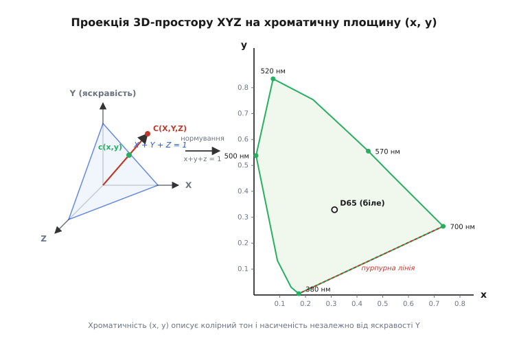
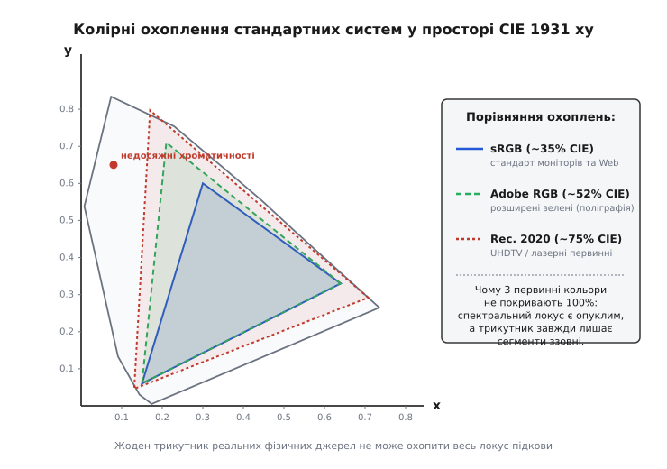
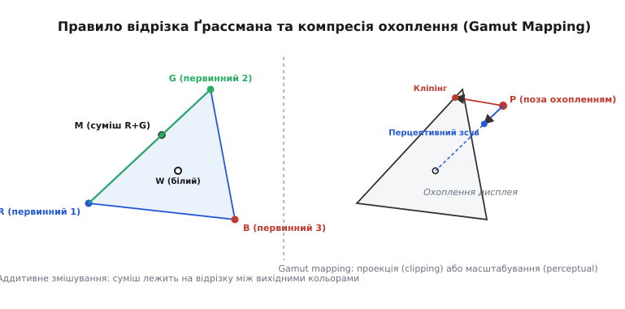

# Колірне охоплення і хроматичність

<preknowlist>
- [Випромінювання чорного тіла](book:physics/blackbody-radiation) — планківський спектр нагрітих тіл та лінія колірних температур.
- [Електромагнітний спектр](book:physics/em-spectrum) — розподіл довжин хвиль випромінювання та спектральна густина потужності.
- [Кольорометрія: CIE, колірна температура і CRI](book:physics/colorimetry-basics) — трихроматична теорія зору та спектральні функції чутливості ока.
</preknowlist>

Коли ми дивимося на сонячний захід, неонову вивіску чи екран смартфона, на сітківку ока потрапляє електромагнітна хвиля зі складним, безперервним спектральним розподілом потужності. Проте людський мозок бачить не безліч окремих довжин хвиль, а суцільний, цілісний колір. Фізична причина такого спрощення полягає в тому, що сітківка працює як біологічний аналоговий фільтр із трьома типами світлочутливих рецепторів-колбочок.

Головне завдання оптичної фізики та колориметрії — перетворити суб'єктивне зорове враження на суворий математичний вектор, що описує фізичні властивості випромінювання. Для цього потрібно розділити енергетичну інтенсивність (яскравість) та якісну кольорову складову. Характеристика, яка описує чистий колірний тон і його насиченість незалежно від того, наскільки яскраво світить джерело, називається **хроматичністю** (від грецького *χρῶμα* — колір, барва).

А діапазон усіх хроматичностей, які здатна відтворити конкретна оптична система, пристрій чи людське око, називається **колірним охопленням** або **гамутом** (від середньовічного латинського *gamma ut* — повна шкала або діапазон).

## Фізичний механізм трихроматичного розщеплення та метамеризм

У сітківці людського ока розміщено три типи колбочок, кожен із яких містить свій різновид світлочутливого білка опсину:
- `L`-колбочки (Long-wavelength): максимальна чутливість у червоно-жовтій зоні спектра (пік біля `λ ≈ 564 нм`).
- `M`-колбочки (Medium-wavelength): максимальна чутливість у зеленій зоні спектра (пік біля `λ ≈ 534 нм`).
- `S`-колбочки (Short-wavelength): максимальна чутливість у синьо-фіолетовій зоні спектра (пік біля `λ ≈ 420 нм`).

Окрім колбочок, у сітківці працюють палички (Scotopic Vision), відповідальні за сутінковий зір із піком чутливості біля 507 нм, проте у формуванні кольорового зору при денній освітленості (Photopic Vision) палички участі практично не беруть.

Спектральні криві чутливості `L` та `M` колбочок сильно перекриваються у зелено-жовтій зоні. Це біологічне перекриття забезпечує надзвичайно високу дифференційну чутливість ока до найменших зміщень довжини хвилі в районі 570–590 нм (жовто-зелена межа), але водночас створює оптичне явище **метамеризму**.

Метамеризмом називається здатність двох фізично абсолютно різних спектрів випромінювання `S₁(λ)` та `S₂(λ)` викликати в сітківці ока абсолютно однакові нервові імпульси `L`, `M`, `S`, і відповідно — створювати ідентичне зорове відчуття кольору. Наприклад, монохроматичний лазерний промінь жовтого кольору з довжиною хвилі 570 нм та суміш двох окремих лазерів — червоного (630 нм) та зеленого (532 нм) — з точки зору фізики мають кардинально різні спектри. Проте при правильно підібраній інтенсивності вони сприймаються оком як абсолютно однаковий жовтий колір.

Саме явище метамеризму робить можливим існування кольорового кінематографа, моніторів, фотографії та кольорового друку. Замість того щоб відтворювати складний безперервний спектр реального об'єкта, пристрою достатньо сформувати метамерну суміш із трьох первинних випромінювачів (`Red`, `Green`, `Blue`).

## Від 3D-вектора XYZ до 2D-площини хроматичностей

Міжнародна комісія з освітлення (CIE) у 1931 році стандартизувала три спектральні функції чутливості `x̄(λ)`, `ȳ(λ)` та `z̄(λ)`. Інтегрування спектра по всьому видимому діапазону дає тристимульні значення `X`, `Y` та `Z`:

```
X = k · ∫ S(λ) · x̄(λ) dλ    [380 нм .. 780 нм]
Y = k · ∫ S(λ) · ȳ(λ) dλ    [380 нм .. 780 нм]
Z = k · ∫ S(λ) · z̄(λ) dλ    [380 нм .. 780 нм]
```

Коефіцієнт `k` нормує світловий потік, а функція `ȳ(λ)` обрана так, що значення `Y` строго відповідає фотометричній яскравості випромінювання (у канделах на квадратний метр, кд/м²).

Тристимульні значення `(X, Y, Z)` визначають вектор у тривимірному просторі. Якщо ми збільшимо потужність джерела світла вдвічі, не змінюючи його спектрального складу, значення `X`, `Y` та `Z` зростуть точно вдвічі. Вектор подовжиться, але його напрямок у просторі залишиться незмінним. Саме напрямок цього вектора описує колірні якості випромінювання — його тон і насиченість.

Щоб відокремити якість кольору від його кількісної інтенсивності, виконують нормувальну проекцію вектора на площину `X + Y + Z = 1`. Відносні частки кожної з трьох координат називаються **координатами хроматичності** `x`, `y` та `z`:

```
x = X / (X + Y + Z)
y = Y / (X + Y + Z)
z = Z / (X + Y + Z)
```

Оскільки сума трьох координат за визначенням завжди дорівнює одиниці (`x + y + z = 1`), третя координата `z` є лінійно залежною (`z = 1 - x - y`). Це дає змогу повністю описати хроматичність точки лише двома координатами `(x, y)` на двовимірній площині.


*Хроматична діаграма CIE 1931: нормування тристимульних координат (X, Y, Z) на площину x + y + z = 1 відокремлює якісні характеристики кольору (тон і насиченість) від фотометричної яскравості Y.*

Якщо ми знаємо 2D-координати хроматичності `(x, y)` та фотометричну яскравість `Y`, ми завжди можемо однозначно відновити вихідний тривимірний вектор `(X, Y, Z)`:

```
X = (x / y) · Y
Z = ((1 - x - y) / y) · Y
```

Процес створення системи CIE 1931 та історія психофізичних експериментів Райта й Ґілда, які виявили необхідність від'ємних коефіцієнтів для реальних спектральних джерел, детально розібрані в історичній вставці [📜 Історія створення простору CIE 1931 та поняття хроматичності](book:physics/optics/color-gamut/hist-cie1931-gamut.md).

> 🔧 **Навіщо це.**
> Розділення яскравості `Y` та хроматичності `(x, y)` є основою стискання відеоданих та цифрової обробки зображень. Людське око набагато чутливіше до дрібних змін яскравості, ніж до хроматичних деталей. Перетворення відеосигналу у простори з розділеною яскравістю та хроматичністю (такі як YCbCr чи YUV) дає змогу передавати колірні канали з удвічі меншою роздільною здатністю (колірна субдискретизація 4:2:0) без помітної для ока втрати якості.

## Анатомія діаграми CIE 1931: спектральний локус і пурпурна лінія

На площині хроматичностей `(x, y)` множина всіх кольорів, які здатне сприймати людське око, утворює замкнену фігуру, схожу на кінську підкову.

Верхня опукла межа цієї фігури називається **спектральним локусом** (Spectral Locus). Вона утворена точками чистого монохроматичного випромінювання (лазери або вузькі спектральні лінії) для кожної довжини хвилі від 380 нм (фіолетовий край) через 520 нм (зелена вершина) до 780 нм (темно-червоний край). Точки на спектральному локусі відповідають максимально можливій 100% колірній насиченості (чистоті кольору), яка існує у природі.

Нижня плоска межа підкови, яка з'єднує крайню фіолетову точку (380 нм) із крайньою червоною точкою (700 нм), називається **пурпурною лінією** (Line of Purples). На відміну від спектрального локусу, пурпурні та малінові відтінки на цій лінії **відсутні у фізичному спектрі веселки**. Вони не відповідають жодній монохроматичній довжині хвилі — це суто психофізичний результат одночасного змішування найкоротших (синіх) та найдовших (червоних) хвиль світла.

Усередині підкови розташована **точка білого кольору** (White Point). Для рівноенергетичного спектра (де потужність однакова на всіх довжинах хвиль) координати білого дорівнюють `E = (1/3, 1/3)`. Для стандартного денного сонячного світла розраховано джерело `D65` з координатами `x = 0.3127, y = 0.3290`.

Також на хроматичній діаграмі зображують **лінію колірних температур** або **планківський локус** (Planckian Locus). Це дуга, яку описують координати випромінювання ідеального абсолютно чорного тіла при нагріванні від низьких температур (1000 K — темно-червоне світіння) через 2856 K (лампи розжарювання), 5000 K (денне світло D50) та 6504 K (стандартне денне світло D65) до високих температур 10000–20000 K (блакитне розсіяне світло північного неба).

Якщо спектр джерела світла відхиляється від планківського локусу по нормалі, говорять про зміщення хроматичності в бік зеленого (відхилення `D[uv] > 0`) або пурпурового (`D[uv] < 0`). Саме параметр `D[uv]` у поєднанні з колірною температурою визначає якість білого освітлення у сучасних світлодіодних системах.

Чистота чи насиченість кольору `P` будь-якої точки `C(x, y)` визначається відношенням її географічної відстані від точки білого `W` до загальної відстані від `W` через `C` до перетину зі спектральним локусом `L`:

```
P = |W - C| / |W - L|
```

Точка білого має нульову насиченість (`P = 0`), а точки на спектральному локусі — максимальну насиченість (`P = 1`).

Детальний математичний апарат інтегрування спектрів, матричні формули перетворення та виведення барицентричних координат подано у математичній вставці [🧮 Математичний апарат хроматичності та розрахунок колірного охоплення](book:physics/optics/color-gamut/math-chromaticity-transform.md).

## Закони Ґрассмана та аддитивне змішування світла

Геометрія хроматичної діаграми базується на фундаментальних законах аддитивного змішування кольорів, сформульованих Германом Ґрассманом у 1853 році.

Аддитивне змішування відбувається тоді, коли на сітківку ока одночасно потрапляє світло від кількох незалежних випромінювачів (наприклад, червоного, зеленого та синього субпікселів дисплея). Оскільки фотокеровані пігменти колбочок сумують падаючі фотони, оптичне додавання відповідає векторному додаванню тристимулів:

```
C[sum] = C₁ + C₂ = (X₁ + X₂,  Y₁ + Y₂,  Z₁ + Z₂)
```

Це лінійне правило дає змогу вивести два ключові геометричні принципи на площині хроматичностей `(x, y)`:

1. **Правило відрізка**: Хроматичність суміші двох світлових джерел `A(x₁, y₁)` та `B(x₂, y₂)` завжди лежить строго на прямому відрізку `AB`, який з'єднує точки цих джерел на хроматичній діаграмі.
2. **Правило барицентричного центру (важеля)**: Точка суміші `M(x, y)` ділить відрізок `AB` у зворотному відношенні тристимульних модулів джерел `m₁ = Y₁ / y₁` та `m₂ = Y₂ / y₂`:

```
x[sum] = (m₁ · x₁ + m₂ · x₂) / (m₁ + m₂)
y[sum] = (m₁ · y₁ + m₂ · y₂) / (m₁ + m₂)
```

Якщо пристрій відтворення кольору (дисплей чи проектор) використовує три первинні випромінювачі `Red`, `Green` та `Blue`, то будь-які можливі суміші їхніх випромінювань лежать усередині трикутника з вершинами у хроматичних точках `R`, `G` та `B`. Цей трикутник і є геометричним вираженням колірного охоплення дисплея.

> 🔧 **Навіщо це.**
> Правило відрізка Ґрассмана є інженерною основою для проектування світлодіодних світильників із регульованою колірною температурою (Tunable White). Змішуючи світло від двох світлодіодів — теплого білого (2700 K) та холодного білого (6500 K) — інженер гарантовано отримує будь-яку проміжну колірну температуру, оскільки лінія змішування проходить строго вздовж планківського локусу на хроматичній діаграмі.

## Фізична природа колірного охоплення та проблема опуклості

Тепер ми можемо дати суворе фізичне визначення: **колірне охоплення** (Color Gamut) — це повна множина хроматичностей у координатах `(x, y)` (або 3D-об'єм у просторі `XYZ`), яку здатна сформувати дана оптична система за допомогою аддитивного чи субрактивного змішування своїх первинних елементів.

Тут постає фундаментальне оптичне питання: **чому жоден трьохколірний дисплей із реаленими фізичними джерелами світла не здатний відтворити 100% кольорів, які бачить людське око?**

Відповідь крокує з математичної геометрії спектрального локусу. Спектральний локус підкови є **строго опуклою дугою** на всьому діапазоні від 380 до 780 нм (особливо у зелено-блакитній зоні між 500 та 540 нм). 

Згідно з теоремами геометрії, будь-який многокутник (трикутник), вершини якого лежать усередині або навіть на межі опуклої кривої, не може повністю накрити цю криву. Трикутник обов'язково залишає ззовні дугові сегменти між своїми вершинами.

Щоб трикутник повністю накрив усю підкову CIE 1931, його вершини `X`, `Y`, `Z` мусять виходити за межі спектрального локусу. Але точки поза локусом відповідають від'ємним або надфронтальним спектрам, які неможливо створити жодним реальним джерелом світла у нашому фізичному світі. Вони є **уявними (віртуальними) первинними кольорами**.

Тому будь-який реальний фізичний пристрій із трьома первинними випромінювачами принципово обмежений трикутником, вписаним усередину підкови.

## Фізичні технології формування первинних випромінювачів у дисплеях

Розмір і площа трикутника колірного охоплення повністю визначаються оптичним спектром первинних джерел `R`, `G`, `B`. Еволюція дисплейних технологій за останні 50 років полягала у переході від широкосмугових джерел випромінювання до вузькосмугових:

1. **Електронно-променеві трубки (CRT)**: Використовували неорганічні люмінофори (сульфід цинку ZnS:Ag для синього, ZnCdS:Cu для зеленого та ітрієвий оксисульфід Y₂O₂S:Eu для червоного). Їхні спектри мали досить широкі піки півшириною 40–80 нм, що обмежувало охоплення рамками sRGB.
2. **Рідкокристалічні екрани з W-LED (White LED LCD)**: Застосовують синій світлодіод із широким жовтим люмінофором YAG:Ce. Кольорові світлофільтри матриці вирізають із широкого жовтого спектра зелену й червону компоненти. Через високий рівень взаємного перекриття каналів (Crosstalk) охоплення рідко перевищує 70–75% sRGB.
3. **Люмінофори розширеного спектра (KSF / PFS Phosphor)**: Замість YAG застосовують вузькосмуговий комплексний фторосилікат калію K₂SiF₆:Mn⁴⁺ (KSF), який дає п'ять гострих спектральних ліній у червоній зоні (біля 631 нм). Це дозволило рідкокристалічним панелям досягати охоплення 95–98% DCI-P3.
4. **Квантові точки (Quantum Dots / QDEF / QD-OLED)**: Напівпровідникові нанокристали (селенід кадмію CdSe або фосфід індію InP) розміром від 2 до 6 нанометрів. Завдяки квантово-розмірному ефекту (Quantum Confinement Effect) довжина хвилі люмінесценції квантової точки строго залежить від її діаметра. Спектральні піки квантових точок мають надзвичайно малу напівширину (FWHM ≈ 25–30 нм), що забезпечує чистоту первинних кольорів і розширює охоплення до 90–95% стандарту Rec. 2020.
5. **Лазерні дисплеї (RGB Laser Projection)**: Пряме використання трьох напівпровідникових лазерів. Вони дають монохроматичні спектральні лінії із шириною менше 1 нм, розташовані на самому спектральному локусі. Це єдина технологія, яка забезпечує **100% покриття стандарту Rec. 2020**.

Окрім спектрального складу випромінювачів, на хроматичну точність суттєво впливає просторова структура субпікселів (Subpixel Layout). У класичних матрицях застосовують вертикальні смуги RGB Stripe, де три субпікселі утворюють один квадратний піксель. У мобільних OLED-екранах із метою подовження терміну служби синього оганічного діода застосовують схеми PenTile (байєровська сітка з різним розміром субпікселів) або Diamond Pixel Layout. При субпіксельному рендерингу (Subpixel Rendering) інженерні алгоритми коригують хроматичність сусідніх пікселів для усунення кольорових ореолів на гострих контрастних межах тексту.

## Стандарти колірних охоплень у сучасній техніці

Залежно від фізичних характеристик випромінювачів та сфери застосування, у міжнародній технічній практиці прийнято кілька основних стандартів колірного охоплення.


*Колірні охоплення стандартних систем sRGB, Adobe RGB та Rec. 2020: жоден трикутник реальних фізичних джерел світла не може охопити 100% спектрального локусу через його математичну опуклість.*

### 1. sRGB / Rec. 709
Стандарт розроблено у 1996 році для комп'ютерних ЕПТ-моніторів. Спирається на звичайне світлодіодне підсвічування W-LED (синій кристалл + жовтий люмінофор YAG). Площа трикутника sRGB становить близько **33.4%** від загальної площі діаграми CIE 1931. Через вузькість охоплення sRGB не здатен відтворити насичені зелені, бірюзові та помаранчеві відтінки.

### 2. Adobe RGB (1998)
Розроблений компанією Adobe для професійної фотографії та кольороподілу під офсетний друк (CMYK). Завдяки зсуву зеленого випромінювача в бік насиченого короткохвильового спектра (`y = 0.7100`), охоплення становить **52.1%** площі CIE 1931. Для його фізичного відтворення застосовують спеціальні світлодіоди з вузькосмуговим флуоресцентним люмінофором KSF/PFS.

### 3. DCI-P3 / Display P3
Стандарт цифрового кінематографа. Розширює охоплення у червоній та зеленій областях. Площа становить **45.5%** від CIE 1931 (і понад **53.6%** у рівноконтрастному просторі CIE 1976 `u'v'`). Широко застосовується в сучасних OLED-матрицях та смартфонах.

### 4. Rec. 2020 (ITU-R BT.2020)
Стандарт для телебачення надвисокої чіткості 4K та 8K Ultra HD. Вершинами трикутника є **чисті монохроматичні лазерні випромінювання** (червоний 630 нм, зелений 532 нм, синій 467 нм). Охоплює **75.8%** площі діаграми CIE 1931 і понад **99.9%** усіх природних поверхневих пігментів. Для його реалізації потрібні лазерні проектори або підсвічування на квантових точках (Quantum Dots / QD-OLED).

### 5. Pointer's Gamut (Масив Поінтера)
Охоплення, виміряне Майклом Поінтером у 1980 році на 4083 зразках реальних нелюмінесцентних поверхонь (рослини, фарби, шкіра, тканини). Воно показує межу кольорів, які існують у відбитому світлі навколишнього світу.

Повні числові специфікації хроматичностей, точні координати білих точок D65/D50 та матриці перетворення зібрано в довіднику [📋 Довідник стандартів колірного охоплення та хроматичних параметрів](book:physics/optics/color-gamut/api-gamut-standards.md).

## Рівноконтрастні простори: від CIE 1931 до CIE 1976 UCS та L*a*b*

Важливим недоліком класичної хроматичної діаграми CIE 1931 `(x, y)` є її висока геометрична нерівномірність (неконтрастність). 

У 1942 році Девід МакАдам (David MacAdam) провів серію вимірювань порогу розрізнення кольорів оком (Just Noticeable Difference, JND). Виявилося, що зони одинакової сприйнятної похибки кольору утворюють на площині `(x, y)` сильно витягнуті **еліпси МакАдама**. В зеленій зоні діаграми еліпс розрізнення у 20 разів більший за площею, ніж у синій! Це означає, що однакова геометрична відстань між двома точками в зеленій зоні взагалі не сприймається оком як зміна кольору, а в синій зоні являє собою величезну різницю тонів.

Щоб усунути цю геометричну анізотропію, у 1976 році CIE затвердила **рівноконтрастний простір CIE 1976 UCS** із координатами `(u', v')`:

```
u' = 4 · x / ( -2·x + 12·y + 3 )
v' = 9 · y / ( -2·x + 12·y + 3 )
```

У просторі `(u', v')` еліпси МакАдама перетворюються майже на ідеальні кола одинакового радіуса. Тому оцінку відсоткового покриття нових стандартів дисплеїв (Rec. 2020 та DCI-P3) у сучасній оптиці виконують саме у координатах CIE 1976 `u'v'`.

Для тривимірної оцінки з урахуванням розширеного динамічного діапазону яскравості (HDR) використовують простір **CIE 1976 L*a*b*** та поняття **колірного об'єму** (Color Volume). У просторі L*a*b* колірне охоплення являє собою не 2D-трикутник, а 3D-конус чи поліедр. На низьких рівнях яскравості (`L* → 0`) та на максимальних білих піках (`L* → 100`) досяжна площа хроматичностей звужується в точку, а максимальний гамут спостерігається при середній яскравості `L* ≈ 50`.

## Кольори поза охопленням та алгоритми Gamut Mapping

Коли фотокамера знімає сцену з високонасиченими кольорами (наприклад, соковиту квітку чи лазерне шоу), або коли відеоматеріал у форматі Rec. 2020 потрібно вивести на стандартний sRGB-монітор, виникає ситуація, коли розраховані значення лінійних компонентів `(R, G, B)` виходять за межі допустимого діапазону `[0.0, 1.0]` (становиться від'ємним або перевищує одиницю).

Такі кольори називаються **кольорами поза охопленням** (Out-of-Gamut Colors).


*Аддитивне змішування джерел світла та компресія охоплення: колірна суміш лежить на відрізку між вихідними кольорами, а кольори поза охопленням проектуються (clipping) або зміщуються (perceptual mapping).*

Для усунення спотворень застосовують спеціальні алгоритми **колірного картування (Gamut Mapping)**:

1. **Жорсткий кліпінг (Hard Clipping / Absolute Colorimetric)**: Значення компонентів затискають у межі `[0, 1]`. Усі кольори поза охопленням проектуються на найближчу грань трикутника. Метод швидкий, але призводить до втрати текстури й градієнтів у насичених областях (Clipping Artifacts).
2. **Перцептивна компресія (Perceptual Mapping)**: Весь колірний простір пропорційно стискається в напрямку до точки білого `D65`. При цьому кольори поза охопленням потрапляють усередину трикутника, зберегаючи внутрішні градієнти, але загальна насиченість усієї картинки трохи знижується.
3. **Відносний колориметричний перерахунок (Relative Colorimetric)**: Точні тональні відтінки всередині гамуту залишаються незмінними, а зрізаються лише ті точки, які виходять за межу.
4. **Насичений рендеринг (Saturation Intent)**: Забезпечує максимальну яскравість і насиченість за рахунок можливого зсуву колірного тону. Використовується в діловій графіці та діаграмах.

> 🔧 **Навіщо це.**
> Алгоритми Gamut Mapping критично важливі в графічних рушіях при роботі з розширеним динамічним діапазоном (HDR). При перетворенні HDR-сцени зі світловою яскравістю до 10 000 кд/м² у стандартний SDR-сигнал дисплея (100 кд/м²) некоректне обрізання призведе до того, що весь яскравий вогонь перетвориться на суцільну пласку жовту пляму. Застосування перцептивних кривих Tone Mapping та Gamut Mapping зберігає деталізацію полум'я.

Програмну реалізацію алгоритму перевірки належності точки трикутнику та методу перцептивної компресії мовами Python, C та C++ подано у практичній вставці [⚙️ Алгоритм перевірки та компресії колірного охоплення (Gamut Checker)](book:physics/optics/color-gamut/proj-gamut-checker.md).

Розуміння фізики хроматичності та геометричних меж колірного охоплення дає змогу проектувати сучасні світлодіодні й лазерні дисплейні системи, розробляти точні алгоритми обробки зображень та будувати надійні системи колірного відтворення у фотографії, кінематографі й поліграфії.
