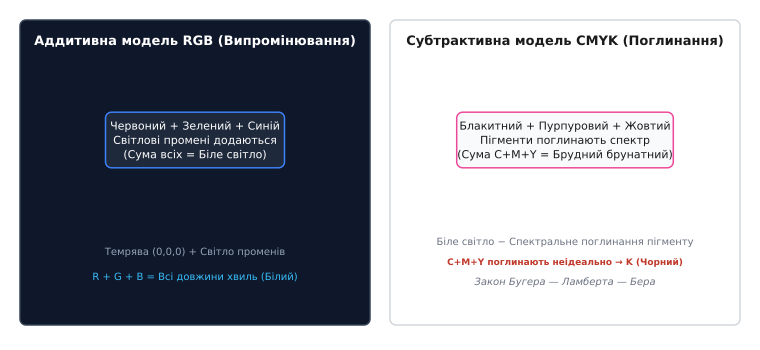
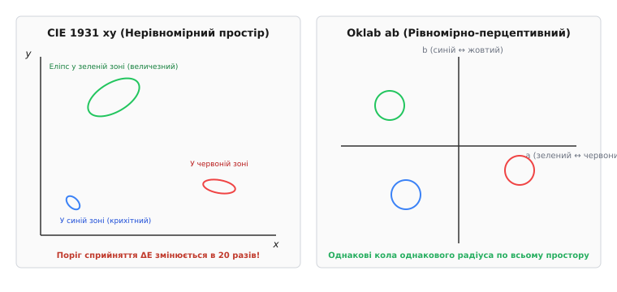
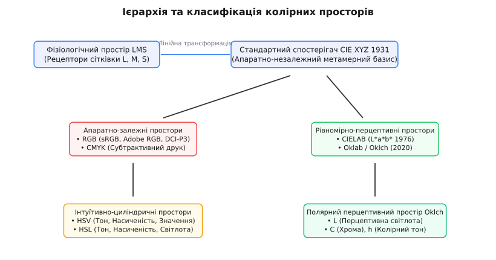
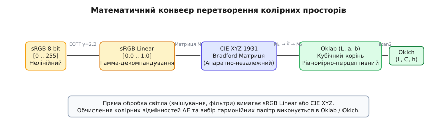

# Колірні простори

<preknowlist>
- [Колірне охоплення і хроматичність](book:physics/optics/color-gamut) — тристимульний простір CIE XYZ, хроматичні діаграми та математика аддитивного змішування.
- [Яскравість і колірність](book:physics/optics/luminance-chrominance) — функція спектральної чутливості ока V(λ) та колірна субдискретизація.
- [Електромагнітний спектр](book:physics/em-spectrum) — розподіл довжин хвиль випромінювання у видимому діапазоні світла.
</preknowlist>

Коли цифрова камера знімає пейзаж, її матриця вимірює інтенсивність світла у трьох спектральних діапазонах і записує три цілих числа на піксель: `R = 180, G = 40, B = 200`. Якщо ці самі три числа передати безпосередньо на дисплей смартфона, офісний LCD-монітор і кольоровий типографський принтер, людина побачить три абсолютно різні відтінки фіолетового. Причина полягає в тому, що самі по собі числа `(180, 40, 200)` не є фізичною мірою світлової хвилі — це лише інструкція для конкретного апаратного приводу чи керуючої напруги субпікселів. На різних екранах люмінофори, світлодіоди чи світлофільтри мають різний хімічний склад і випромінюють абсолютно різні фізичні спектри. 

Щоб один і той самий колір відтворювався однаково на будь-якому фізичному носії, потрібна математична система координат, яка пов'язує абстрактні числа в пам'яті комп'ютера з реальним спектральним розподілом потужності електромагнітної хвилі та анатомічною будовою людського зору. Така математична система координат називається **колірним простором** (Color Space).

Колірний простір однозначно визначається трьома фундаментальними складовими:
1. **Базисними координатами** (первинними кольорами чи компонентними осями), які задають орієнтацію та вимірність тривимірного векторного простору.
2. **Опорною білою точкою** (White Point), яка визначає колірну температуру, абсолютну фотометричну яскравість та спектральний склад нейтрального білого світла при максимальній інтенсивності.
3. **Передавальною функцією** (Transfer Function / EOTF — Electro-Optical Transfer Function), яка описує нелінійний зв'язок між цифровим кодовим значенням і реальною фізичною інтенсивністю випромінювання.

Без суворо визначеного колірного простору кожне цифрове зображення є лише набором беззмістовних байтів, позбавлених об'єктивного колірного значення.

## Фізіологічний фундамент: рецепторний простір LMS та колориметричний базис CIE XYZ

Фізичною основою будь-якого колірного простору є будова сітківки людського ока. Світловий потік зі спектральним розподілом потужності `S(λ)` потрапляє на три типи світлочутливих фоторецепторів-колбочок: `L` (Long-wavelength — довгохвильові, пік чутливості 564 нм), `M` (Medium-wavelength — середньохвильові, пік 534 нм) та `S` (Short-wavelength — короткохвильові, пік 420 нм). 

Кожен тип колбочок описується власною нормованою функцією спектральної чутливості `l̄(λ)`, `m̄(λ)`, `s̄(λ)`. Реакція сітківки являє собою математичне інтегрування добутку спектра джерела на чутливість відповідного зорового білка-опсину по всьому видимому діапазону (від 380 нм до 780 нм):

```
L_cone = ∫ S(λ) · l̄(λ) dλ    [380 нм .. 780 нм]
M_cone = ∫ S(λ) · m̄(λ) dλ    [380 нм .. 780 нм]
S_cone = ∫ S(λ) · s̄(λ) dλ    [380 нм .. 780 нм]
```

Трійка значень `(L_cone, M_cone, S_cone)` утворює **фізіологічний колірний простір LMS** (Stockman & Sharpe cone fundamentals). З точки зору біофізики, вектор `(L, M, S)` є найчистішим описом того, яку саме інформацію сітківка надсилає у зоровий нерв. Оскільки різні спектри `S₁(λ)` та `S₂(λ)` можуть давати абсолютно однакові інтегральні значення `(L, M, S)` (явище метамеризму), простір LMS описує фундаментальну межу зорового розрізнення людини.

Проте безпосереднє використання простору LMS у техніці є незручним з кількох причин. По-перше, спектральні криві чутливості `L-` та `M-колбочок` сильно перекриваються у зелено-жовтій області, через що координати `L` та `M` є сильно корельованими між собою. По-друге, безпосереднє вимірювання абсолютних рецепторних сигналів in vivo є складним експериментальним завданням.

У 1931 році Міжнародна комісія з освітлення (CIE) ухвалила як базовий апаратно-незалежний стандарт простір **CIE XYZ 1931**. У цьому просторі тристимульні координати `(X, Y, Z)` отримані з простору LMS за допомогою лінійного афінного перетворення. 

Головна фізико-технічна особливість CIE XYZ полягає у спеціальному виборі координати `Y`: функція чутливості `ȳ(λ)` була математично побудована так, щоб вона строго збігалася зі стандартною фотометричною функцією світлової ефективності ока `V(λ)`. Завдяки цьому координата `Y` вимірює абсолютну фотометричну яскравість (у канделах на квадратний метр, кд/м²), тоді як координати `X` та `Z` відповідають за колірний тон та хроматичність.

Для відокремлення якісного кольору від його інтенсивності вектор `(X, Y, Z)` проектують на нормовану площину `X + Y + Z = 1`, отримуючи 2D-координати хроматичності `(x, y)`:

```
x = X / (X + Y + Z)
y = Y / (X + Y + Z)
z = 1 - x - y
```

Оскільки простір CIE XYZ охоплює абсолютно всі кольори, які здатне сприймати людське око (весь спектральний локус), він слугує універсальним **простором зв'язку профілів** (Profile Connection Space — PCS). Будь-які перетворення між камерами, моніторами та принтерами виконуються через проміжний перехід у простір CIE XYZ або його лінійні похідні.

## Апаратно-залежні простори: аддитивна модель RGB та її стандарти

Апаратно-залежними називаються колірні простори, координати яких безпосередньо керують фізичними випромінювачами або поглиначами світла конкретного пристрою.

Пристрої відображення (LCD-монітори, OLED-дисплеї, проектори) працюють за принципом **аддитивного змішування світла** (від латинського *additio* — додавання). Субпікселі екрана випромінюють три первинні промені: Червоний (`Red`), Зелений (`Green`) та Синій (`Blue`). Якщо екран вимкнений, людина бачить темряву (координати `0, 0, 0`). При додаванні світлових потоків трьох субпікселів інтенсивності підсумовуються, утворюючи у максимальній точці білий колір.


*Фізичний механізм аддитивного випромінювання (RGB) та субтрактивного спектрального поглинання пігментів (CMYK).*

Кожен конкретний простір сімейства RGB визначається трьома хроматичними точками своїх первинних випромінювачів у просторі CIE 1931 `(x_R, y_R)`, `(x_G, y_G)`, `(x_B, y_B)`, координатою опорного білого та передавальною гамма-функцією. 

Три хроматичні точки випромінювачів утворюють на діаграмі CIE 1931 трикутник. Усі кольори, що лежать усередині цього трикутника, складають **колірне охоплення (гамут)** даного дисплея. Кольори, розташовані поза трикутником, пристрій фізично не здатний відтворити.

### Найважливіші стандарти просторів RGB:

1. **sRGB (Standard RGB):**
   - **Розробники:** Hewlett-Packard та Microsoft (1996).
   - **Опорний білий:** `D65` (`x = 0.3127, y = 0.3290`, колірна температура `6504 K`).
   - **Первинні координати:** Червоний `(0.6400, 0.3300)`, Зелений `(0.3000, 0.6000)`, Синій `(0.1500, 0.0600)`.
   - **Застосування:** Стандарт за замовчуванням для веб-сторінок, операційних систем, побутових моніторів та цифрових фотокамер. Охоплює приблизно 35% від усіх кольорів, сприйманих оком.

2. **Adobe RGB (1998):**
   - **Розробник:** Adobe Systems (1998).
   - **Первинні координати зеленого:** `(0.2100, 0.7100)`.
   - **Фізична мета:** Розширення колірного охоплення у зелено-блакитній зоні спектра для того, щоб охопити всі цинові та зелені фарби поліграфічного стандарту ISO Coated CMYK. Охоплює близько 52% сприйманих кольорів.

3. **DCI-P3:**
   - **Розробник:** Digital Cinema Initiatives.
   - **Первинні координати:** зміщені в бік насиченого червоного та зеленого спектра.
   - **Застосування:** Цифрові кінотеатри, сучасні дисплеї Apple, преміальні OLED-телевізори та смартфони. Охоплює на 25% більше колірної палітри, ніж sRGB.

4. **Rec.2020 (ITU-R BT.2020):**
   - **Стандарт:** Телебачення надвисокої чіткості (4K / 8K UHDTV).
   - **Первинні випромінювачі:** Монохроматичні лазерні промені з довжинами хвиль `630` нм (червоний), `532` нм (зелений) та `467` нм (синій).
   - **Колірне охоплення:** Охоплює 75.8% усього зорового простору людини, являючи собою практичну фізичну межу для аддитивних світлодіодних та лазерних систем.

5. **Стандарти розширеного динамічного діапазону HDR (Rec.2100 / PQ / HLG):**
   - **Передавальні функції:** Перцептивний квантувальник PQ (Perceptual Quantizer / ST 2084) та сумісний гібридний логарифм HLG (Hybrid Log-Gamma).
   - **Фізична яскравість:** Якщо стандартний SDR (sRGB) розрахований на максимальну яскравість `100 кд/м²`, то стандарти HDR Rec.2100 оперують яскравістю до `10 000 кд/м²`, вимагаючи 10-бітного та 12-бітного кодування на канал для запобігання бандингу (колірним смугам).

Фізико-математичний зв'язок між апаратними координатами RGB та простором CIE XYZ регулюється профілями ICC та модулями CMM, що детально описано у вставці [📋 Інтерфейс профілів ICC та специфікація модулів керування кольором (CMM)](book:physics/optics/color-spaces/api-color-profiles.md).

## Субтрактивна модель CMYK та фізика спектрального поглинання

На відміну від моніторів, які випромінюють власне світло, поліграфічний папір, текстиль та пофарбовані поверхні самі світла не генерують. Вони освітлюються зовнішнім джерелом білого світла (сонцем чи лампою) і працюють за принципом **субтрактивного змішування** (від латинського *subtractio* — віднімання).

Коли біле світло впадає на шар прозорої типографської фарби, нанесеної на білий папір, молекули пігменту вибірково поглинають (віднімають) певні довжини хвиль електромагнітного спектра відповідно до **закону Бугера — Ламберта — Бера**:

```
I(λ) = I_0(λ) · e^(-α(λ) · c · d)
```

де `I_0(λ)` — спектральна інтенсивність падаючого білого світла, `α(λ)` — спектральний коефіцієнт поглинання пігменту, `c` — концентрація фарби, `d` — товщина шару. Світло, яке не поглинулося пігментом, проходить крізь шар фарби, відбивається від білої підкладки паперу і потрапляє в око спостерігача.

Первинними фарбами субтрактивного синтезу є кольори, додаткові до первинних аддитивних RGB:
- **Блакитний (Cyan — C):** Поглинає червону частину спектра (`600–700` нм) і відбиває зелену та синю.
- **Пурпуровий (Magenta — M):** Поглинає зелену частину спектра (`500–600` нм) і відбиває червону та синю.
- **Жовтий (Yellow — Y):** Поглинає синю частину спектра (`400–500` нм) і відбиває червону та зелену.

Теоретично суміш трьох ідеальних субтрактивних фарб у рівній пропорції `C + M + Y` має повністю поглинути всі довжини хвиль видимому діапазону й утворити ідеально чорний колір. Проте у реальному світі фізико-хімічні властивості органічних та неорганічних пігментів далекі від ідеалу. Блакитна та пурпурова фарби мають паразитного спектрального поглинання у суміжних областях. У результаті змішування максимальних концентрацій `100% C + 100% M + 100% Y` замість глибокого чорного кольору дає брудний темно-коричневий або сіро-брунатний відтінок.

Щоб вирішити цю фізичну проблему, до субтрактивної триади додають четвертий компонент — **контурну чорну фарбу** (Key / Black — **K**), виготовлену на основі чистого вуглецю (сажі). Вуглецевий пігмент має рівномірне високе поглинання по всьому видимому спектру.

Використання чорного каналу `K` виконує три важливі технологічні задачі:
1. **Глибина чорного та контраст:** Забезпечує оптичну щільність відбиття `D > 2.0` у глибоких тінях.
2. **Економія фарби та висихання:** Технології віднімання кольорових компонентів (UCR — Undercolor Removal та GCR — Gray Component Replacement) замінюють суміш `C+M+Y` у нейтральних сірих тінях на відповідну кількість дешевої чорної фарби `K`. Це зменшує сумарну товщину нанесення фарби на папір (Total Ink Limit) з 300% до 220–240%, запобігаючи відмазуванню та зминанню паперу при високошвидкісному друці.
3. **Чіткість тексту:** Дрібний чорний текст друкується в один прогін однією друкарською секцією `K` без ризику несміщення друкарських форм (суміщення кольорів).

## Нерівномірність CIE XYZ та поява рівномірно-перцептивних просторів (CIELAB та Oklab)

Попри математичну фундаментальність простору CIE XYZ 1931, він володіє принциповим дефектом з точки зору психофізики: простір XYZ є **непостійним за зоровим сприйняттям** (Perceptually Non-uniform).

У 1942 році американський фізик Девід Мак-Адам (David MacAdam) провів досліди із визначення порогів зорової чутливості людського ока. Спостерігачам пропонувалося відрізнити колір тестової точки від опорного кольору при зміні хроматичності. Коли Мак-Адам наніс отримані пороги нерозрізненності (Just Noticeable Differences — JND) на хроматичну діаграму CIE 1931 `(x, y)`, виявилося, що геометрично ці області є не колами однакового радіуса, а сильно витягнутими **еліпсами Мак-Адама**.

При цьому розміри еліпсів у різних областях діаграми відрізнялися у 20 разів! У зеленій зоні еліпс був величезним (око не помічає великих зміщень координат `x, y`), тоді як у синій зоні — крихітним. Це означало, що звичайна евклідова відстань між двома точками `d = √[(x₁-x₂)² + (y₁-y₂)²]` у просторі CIE 1931 не дає жодного уявлення про те, наскільки різними ці кольори бачить людина.


*Геометричне викривлення порогів сприйняття (еліпси Мак-Адама) у просторі CIE 1931 xy проти ідеально рівномірних кіл у просторі Oklab.*

Щоб виправити це викривлення, науковці розробили **рівномірно-перцептивні колірні простори** (Perceptually Uniform Color Spaces).

### Простір CIELAB (L*a*b* 1976)

У 1976 році CIE стандартизувала простір **CIELAB**. Для наближення до логарифмічно-степеневого закону сприйняття світла Вебера — Фехнера, координати XYZ піддають кубічному стисканню `t^(1/3)`:

- **`L*` (Lightness):** Перцептивна світлота від `0` (абсолютна темрява) до `100` (ідеальний білий).
- **`a*`:** Оппонентна вісь «зелений (від'ємні значення) ↔ червоний (додатні значення)».
- **`b*`:** Оппонентна вісь «синій (від'ємні значення) ↔ жовтий (додатні значення)».

Згодом виявилося, що CIELAB також не є ідеальним. Головним його недоліком став **зсув колірного тону у синій зоні** (Blue Hue Shift): при зміні насиченості синього кольору (наприклад, при знебарвленні від насиченого синього до сірого) вектор у CIELAB відхиляється від прямої лінії і закручується в бік пурпурового чи фіолетового відтінку. Через це при створенні плавно згасаючих градієнтів у фоторедакторах синє небо набувало брудного малинового відтінку.

### Сучасний простір Oklab (2020)

У 2020 році шведський дослідник Бйорн Оттоссон розробив простір **Oklab**, який виправив недоліки CIELAB.

Оттоссон використав новітні спектральні дані рецепторів сітківки Stockman & Sharpe (2000) і побудував тристадійний математичний конвеєр:
1. Лінійне перетворення CIE XYZ у простір LMS через матрицю `M₁`.
2. Нелінійне стискання рецепторних сигналів через кубічний корінь `∛L, ∛M, ∛S`.
3. Ортогональне перетворення в оппонентні осі `(L, a, b)` через матрицю `M₂`.

Координати Oklab мають чіткий зміст:
- **`L` (Perceptual Lightness):** Перцептивна світлота у діапазоні від `0.0` до `1.0`.
- **`a`:** Зелено-червона оппонентна ось.
- **`b`:** Синьо-жовта оппонентна ось.

Полярна форма простору Oklab називається **Oklch**. У ній декартові координати `a` та `b` переведені в полярний радіус `C` (Chroma — хрома/насиченість) та кут `h` (Hue — колірний тон у градусах від 0° до 360°):

```
C = √(a² + b²)
h = atan2(b, a)
```

Простір Oklab/Oklch забезпечує строго лінійну зміну колірного тону без зсуву синього кольору та ідеальну рівномірність світлоти `L`.

Детальну історію розвитку колірних систем від дерева Менселла до Oklab викладено у вставці [📜 Історія стандартизації та еволюції колірних просторів](book:physics/optics/color-spaces/hist-color-spaces.md).

## Інтуїтивно-циліндричні простори (HSV, HSL) та їхні оптико-фізіологічні обмеження

Для зручності художників та веб-дизайнерів у 1970-х роках Елві Рей Сміт (Alvy Ray Smith) розробив простори **HSV** (Hue, Saturation, Value) та **HSL** (Hue, Saturation, Lightness).

Обидва простори є нелінійними геометричними деформаціями звичайного куба sRGB у циліндр або шестикутну піраміду (гексакон):
- **`H` (Hue):** Кут колірного тону від `0°` до `360°` (0° — червоний, 120° — зелений, 240° — синій).
- **`S` (Saturation):** Чистота кольору від `0%` (сірий) до `100%` (чистий спектральний колір).
- **`V` / `L` (Value / Lightness):** Яскравість або світлота від `0%` (чорний) до `100%`.


*Класифікаційна ієрархія колірних просторів: від рецепторів сітківки LMS до циліндричних та рівномірно-перцептивних систем.*

Головна перевага HSV та HSL — їхня виключна **людська інтуїтивність**. Людині набагато простіше змінити один параметр «колірний тон H», щоб отримати зелений замість червоного, ніж одночасно розраховувати три координати R, G, B.

Проте з точки зору фізики та оптичної фотометрії простори HSV та HSL є **абсолютно хибними й нерівномірними**. Вони ігнорують спектральну чутливість ока `V(λ)`.

Наприклад, у просторі HSV чистий жовтий колір `RGB(255, 255, 0)` та чистий синій колір `RGB(0, 0, 255)` мають абсолютно однакове значення параметра `Value = 100%` (`V = 1.0`). Проте людське око сприймає жовтий колір як надзвичайно яскравий (його справжня перцептивна світлота `L* ≈ 97`), а синій колір — як дуже темний (`L* ≈ 30`).

Якщо у графічному редакторі зменшити насиченість `S` жовтого та синього об'єктів у просторі HSL, жовтий колір перетвориться на світло-сірий, а синій — на темно-сірий, що повністю зламає тональний баланс зображення.

Саме тому сучасні графічні рушії та веб-стандарти (CSS Color Module Level 4) відмовляються від HSL на користь **Oklch**, який поєднує інтуїтивність полярних координат (тон `h`, хрома `C`) із математично строгою перцептивною рівномірністю світлоти `L`.

## Повний математичний конвеєр перетворення та обчислення відмінностей ΔE

Для виконання фізично точної обробки зображень (градієнтного змішування, колірної корекції, обчислення відмінностей між фарбами) застосовують послідовний сквозний конвеєр перетворень.


*Послідовність математичних операцій: від нелінійних 8-бітних байтів sRGB до рівномірного простору Oklab та полярного Oklch.*

Конвеєр складається з таких послідовних кроків:
1. **8-bit sRGB → sRGB Linear:** Гамма-декомпандування (EOTF) для отримання лінійних фізичних інтенсивностей `(R_lin, G_lin, B_lin) ∈ [0.0 .. 1.0]`.
2. **sRGB Linear → CIE XYZ (D65):** Множення на лінійну матрицю `3×3`.
3. **Хроматична адаптація Бредфорда (за потреби):** Перераховує координати XYZ при зміні опорного білого з `D65` на `D50` для друку.
4. **CIE XYZ → Oklab:** Двостадійне множення на матриці `M₁` та `M₂` із проміжним добуванням кубічного кореня `∛`.
5. **Oklab → Oklch:** Перехід у полярні координати через `hypot(a, b)` та `atan2(b, a)`.

Обчислення зорової відмінності між двома кольорами `C₁` та `C₂` у просторі Oklab виконується за простою евклідовою формулою:

```
ΔE_OK = √[ (L₁ - L₂)² + (a₁ - a₂)² + (b₁ - b₂)² ]
```

Значення `ΔE_OK ≈ 0.02` відповідає порогу зорового сприйняття (1 JND). Якщо `ΔE_OK < 0.02`, людське око не здатне відрізнити ці два кольори при розташуванні поруч.

Виведення математичних формул, матриць Бредфорда та порівняння метрик `ΔE*ab` та `ΔE_00` подано у математичній вставці [🧮 Математичний апарат перетворення колірних просторів та метрики ΔE](book:physics/optics/color-spaces/math-color-transformations.md).

Практичний приклад написання обчислювального рушія мовами C та C++ подано у практичній вставці [⚙️ Алгоритм та реалізація рушія колірних перетворень і обчислення ΔE](book:physics/optics/color-spaces/proj-color-engine.md).

> 🔧 **Навіщо це.**
> Розуміння колірних просторів є критично важливим при розробці графічних рушіїв, обробці відеоданих, комп'ютерному зорі та розробці UI/UX. Проведення операцій альфа-блендингу, розмиття за Ґаусом чи масштабування зображення у нелінійному просторі sRGB викликає так званий «ефект затемнення межі» (Dark Fringe Artifact) — темні брудні смуги на межі між червоним та зеленим кольорами. Виконання тих самих операцій у лінійному просторі sRGB Linear або рівномірному Oklab повністю усуває артефакти й забезпечує фізично точне розповсюдження світла у сцені.
