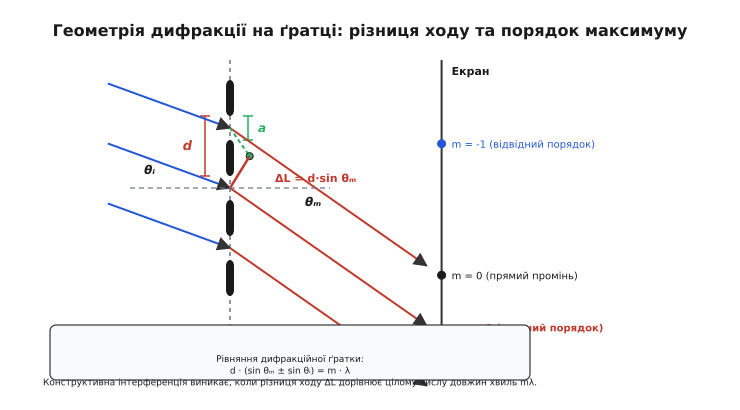
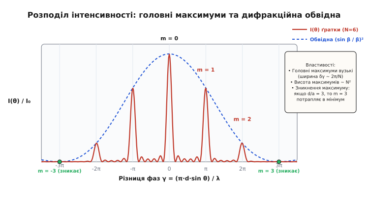
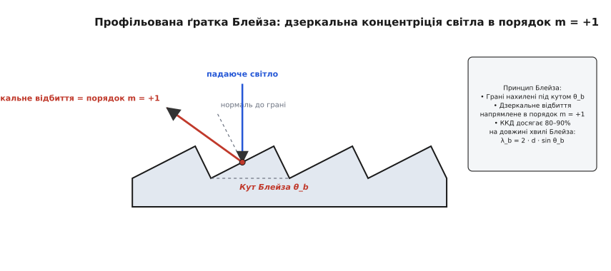
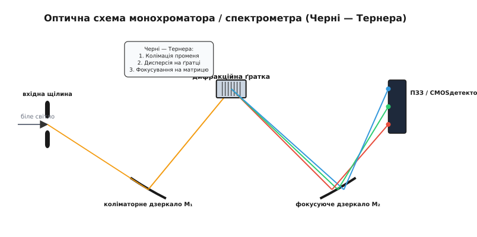

# Дифракційна ґратка

<preknowlist>
- [Дифракція світла](book:physics/optics/diffraction) — огинання перешкод хвилями та принцип Гюйгенса — Френеля.
- [Інтерференція хвиль](book:physics/oscillations-waves/wave-interference) — додавання когерентних коливань із виникненням максимумів і мінімумів інтенсивності.
</preknowlist>

Якщо зелений лазерний промінь із довжиною хвилі `532 нм` спрямувати на прозору скляну пластину, на яку нанесено 600 паралельних штрихів на один міліметр, на екрані за пластиною замість єдиного зеленого плями спалахує симетрична лінійка з кількох яскравих точок. Центральна пляма поширюється прямолінійно уздовж осі променя, але сусідні точки відхиляються на суворо визначені кути `18.6°` та `40.0°`. Якщо ж замінити монохроматичний лазер на біле світло ліхтарика, кожна бічна точка розгортається у яскраву суцільну веселку, де фіолетовий колір відхиляється найменше, а червоний — найбільше. Цей оптичний пристрій називають **дифракційною ґраткою** (*diffraction grating*). Вона перетворює інтерференцію багаторазово розщеплених світлових хвиль на потужний інструмент розділення світла за довжинами хвиль. Без дифракційних ґраток неможливо уявити сучасну спектроскопію, хімічний аналіз речовин, астрофізичне дослідження складу віддалених зірок, фемтосекундну лазерну техніку та оптичні системи зв'язку.

### 1. Принцип роботи та фізичний механізм

Дифракційна ґратка є періодичною структурою з великої кількості одинакових та паралельних елементів (щілин, канавок, борозен або фазових ступенів), розміри яких порівнянні з довжиною хвилі світла `λ`. Відстань між центрами двох сусідніх елементів називають **періодом ґратки** (*grating period*) або **кроком ґратки** `d`. Кількість штрихів на один міліметр `n` пов'язана з періодом співвідношенням:

```
d = 1 / n
```

Наприклад, для ґратки з `n = 600 lines/mm` період дорівнює `d = 1 / 600 мм ≈ 1.667 мкм` (або `1667 нм`). Для високороздільних УФ-спектрометрів застосовують ґратки з `n = 2400 lines/mm`, де крок становить всього `d ≈ 416.7 нм`, що вже менше за довжину хвилі зеленого світла.

Коли плоска світлова хвиля натрапляє на таку структуру, згідно з принципом Гюйгенса — Френеля кожна прозора щілина шириною `a` стає джерелом вторинних когерентних сферичних хвиль. Ці хвилі поширюються в усіх напрямках і накладаються одна на одну в просторі. Якщо хвилі від усіх щілин приходять у точку спостереження в однаковій фазі, вони підсилюють одна одну, утворюючи яскраві **головні максимуми** (*principal maxima*). Якщо ж хвилі приходять у протифазі, вони взаємно гасяться.


*Геометрія поширення променів крізь ґратку з періодом d. Різниця ходу ΔL між сусідніми щелинами визначає напрямки утворення дифракційних максимумів.*

Розглянемо геометрію падіння променя на ґратку під кутом `θᵢ` відносно нормалі. Промені, що потрапляють на дві сусідні щілини, долають різний шлях до межі ґратки: додатковий шлях становить `d · sin θᵢ`. Після дифракції хвилі поширюються під кутом `θₘ` до нормалі, виникає друга частина різниці ходу `d · sin θₘ`. Повна оптична різниця ходу `ΔL` між світловими променями від двох сусідніх щілин дорівнює:

```
ΔL = d · (sin θₘ + sin θᵢ)
```

Щоб хвилі додавалися конструктивно, оптична різниця ходу має дорівнювати цілому числу довжин хвиль `m · λ`. Це дає фундаментальне **рівняння дифракційної ґратки** (*grating equation*):

```
d · (sin θₘ + sin θᵢ) = m · λ     [Рівняння дифракційної ґратки]
```

Ціле число `m = 0, ±1, ±2, ...` називають **порядком дифракції** (*diffraction order*):
- При `m = 0` маємо **нульовий порядок** (`sin θ₀ = -sin θᵢ`). Світло поширюється без відхилення від прямолінійного напрямку (для прохідної ґратки) або від напрямку дзеркального відбиття (для відбивної ґратки). Для нульового порядку кут не залежить від довжини хвилі `λ`, тому нульовий порядок залишається білим і не створює спектральної дисперсії.
- При `m = ±1, ±2, ...` отримуємо **спектральні порядки**. Оскільки кут `θₘ` залежить від `λ`, світло з різними довжинами хвиль відхиляється на різні кути, розгортаючись у спектр.

При нормальному падінні світла (`θᵢ = 0°`) рівняння ґратки набуває найвідомішого спрощеного вигляду:

```
d · sin θₘ = m · λ
```

Із цієї формули безпосередньо видно: що більша довжина хвилі `λ` (червоне світло, `λ ≈ 700 нм`), то більший кут відхилення `θₘ`. Для коротших хвиль (фіолетове світло, `λ ≈ 400 нм`) кут відхилення менший. Це протилежно до поведінки скляної призми, де через дисперсію показника заломлення синій колір заломлюється сильніше за червоний.

Оскільки синус кута не може перевищувати одиницю (`|sin θₘ| ≤ 1`), максимальний доступний порядок дифракції `m_max` строго обмежений фізичним співвідношенням періоду до довжини хвилі:

```
m_max = ⌊ d / λ ⌋
```

Якщо період ґратки менший за довжину хвилі (`d < λ`), то при нормальному падінні дифракційні максимуми вищих порядків (`m ≥ 1`) просто не можуть сформуватися, оскільки кут `θₘ` стає уявним (`sin θₘ > 1`). У такому разі вся дифракційна картина вироджується в один нульовий порядок.

Детальний суворий математичний вивід цього рівняння та умови утворення інтерференційної картини наведено у вставці [Математичний апарат дифракційної ґратки: від Формули Гюйгенса до Роздільної здатності](book:physics/optics/diffraction-grating/math-grating-equation.md).

### 2. Розподіл інтенсивності: мультипроменева інтерференція та обвідна

Інтенсивність світла `I(θ)`, що поширюється від ґратки з `N` однаковими щілинами під кутом `θ`, не є рівномірною. Вона визначається математичним добутком двох незалежних факторів:

```
I(θ) = I₀ · (sin β / β)² · (sin(N · γ) / sin γ)²
```

де `I₀` — інтенсивність у центрі від однієї щілини, а фазові параметри `β` та `γ` дорівнюють:

```
β = (π · a · sin θ) / λ     [фазовий параметр однієї щілини шириною a]
```

```
γ = (π · d · sin θ) / λ     [фазовий зсув між сусідніми щілинами з періодом d]
```

Перший множник `(sin β / β)²` описує **дифракційну обвідну однощілинної дифракції** (*single-slit diffraction envelope*). Він визначає загальний розподіл енергії, сформований кінцевою шириною кожної окремої щілини `a`.

Другий множник `(sin(N · γ) / sin γ)²` описує **мультипроменеву інтерференцію** (*multi-beam interference factor*) між `N` когерентними вторинними джерелами.


*Розподіл інтенсивності світла для ґратки з N = 6 штрихами та співвідношенням d/a = 3. Головні максимуми вузькі й гострі, а порядок m = 3 зникає через збіг із мінімумом дифракційної обвідної.*

Розбір структури цього розподілу розкриває кілька важливих фізичних властивостей:

1. **Висота головних максимумів:** У точках `γ = m · π` границя інтерференційного множника дорівнює `N²`. Отже, інтенсивність світла в пиках пропорційна квадрату кількості штрихів (`I_max ∝ N²`). При збільшенні кількості освітлених штрихів світлова енергія перерозподіляється з проміжних областей у надзвичайно яскраві й вузькі піки.
2. **Ширина головних максимумів:** Перший мінімум біля головного максимуму виникає при зміщенні фази `γ` на `π / N`. Кутова півширина головного пика обернено пропорційна кількості штрихів:

```
δθ ≈ λ / (N · d · cos θₘ)
```

Що більше штрихів `N` охоплено світловим пучком, то вужчими й гострішими стають спектральні лінії на екрані.
3. **Побічні максимуми та мінімуми:** Між двома сусідніми головними максимумами розташовано `N - 1` інтенсивносних мінімумів (де `I = 0`) та `N - 2` слабких побічних максимумів. При великих `N` (наприклад, `N = 10 000`) побічні максимуми стають невидимими, а між головними піками спостерігається повна темрява.
4. **Явище зникнення максимумів (Missing Orders):** Якщо порядок дифракції `m` збігається з умовою мінімуму однощілинної обвідної `β = k · π`, відповідний головний максимум повністю зникає. Це відбувається при цілочисельному співвідношенні періоду ґратки до ширини щілини:

```
m_missing = k · (d / a)     [умова зникнення максимуму]
```

Наприклад, якщо крок ґратки втричі більший за ширину щілини (`d = 3 · a`), то порядки `m = ±3, ±6, ±9, ...` матимуть нульову інтенсивність, оскільки в цих напрямках одна щілина взагалі не випромінює світла.

### 3. Спектральні характеристики: дисперсія, роздільна здатність та вільна область

Щоб оцінити якість дифракційної ґратки як спектрального приладу, використовують три фундаментальні параметри: кутову дисперсію, хроматичну роздільну здатність та вільну спектральну область.

#### 3.1. Кутова та лінійна дисперсія

**Кутова дисперсія** (*angular dispersion*, `D_θ`) показує, наскільки змінюється кут дифракції `θₘ` при малій зміні довжини хвилі `dλ`:

```
D_θ = dθₘ / dλ
```

Диференціюючи рівняння ґратки `d · sin θₘ = m · λ` по `λ`, отримуємо:

```
D_θ = m / (d · cos θₘ)     [Кутова дисперсія ґратки]
```

Звідси випливають три висновки:
- Кутова дисперсія зростає прямо пропорційно порядку дифракції `m`. У другому порядку (`m = 2`) спектр розтягнутий удвічі сильніше, ніж у першому (`m = 1`).
- Дисперсія зростає при зменшенні періоду `d` (тобто зі збільшенням густини штрихів `n = 1/d`).
- На відміну від призми, кутова дисперсія ґратки у вікні малих кутів `θₘ ≈ 0` практично не залежить від довжини хвилі (`D_θ ≈ m / d = const`). Такий спектр називають **нормальним** або **лінійним спектром**.

Якщо за ґраткою встановлено фокусувальну лінзу з фокусною відстанню `F`, **лінійна дисперсія** (*linear dispersion*) на екрані дорівнює:

```
D_x = dx / dλ = F · D_θ = (m · F) / (d · cos θₘ)
```

Обернена лінійна дисперсія `(dλ / dx) = (d · cos θₘ) / (m · F)` показує, яка спектральна ширина у нанометрах припадає на один міліметр довжини матриці детектора.

#### 3.2. Хроматична роздільна здатність

**Роздільна здатність** (*resolving power*, `R`) описує мінімальну різницю довжин хвиль `Δλ`, при якій дві сусідні спектральні лінії з довжинами `λ` та `λ + Δλ` ще помітні як окремі піки:

```
R = λ / Δλ
```

За **критерієм Релея** (*Rayleigh criterion*), дві лінії вважаються розділеними, якщо центральний максимум лінії `λ + Δλ` накладається на перший інтенсивнісний мінімум лінії `λ`.

Зіставляючи фазові параметри для максимуму та мінімуму, отримуємо винятково просту й потужну формулу:

```
R = m · N     [Роздільна здатність ґратки]
```

Тобто роздільна здатність ґратки дорівнює добутку порядку дифракції `m` на загальну кількість освітлених штрихів `N` на світловому пучку.

> 💡 **Приклад розрахунку:** Нехай треба розділити жовтий дублет натрію `λ₁ = 589.0 нм` та `λ₂ = 589.6 нм`. Різниця довжин хвиль становить `Δλ = 0.6 нм`. Необхідна роздільна здатність:
>
> ```
> R = 589.0 / 0.6 ≈ 982
> ```
>
> У першому порядку дифракції (`m = 1`) для цього достатньо висвітити `N = 982` штрихи. На ґратці з `n = 600 lines/mm` для цього потрібен світловий пучок шириною всього `W = N / n = 982 / 600 ≈ 1.64 мм`.

Оскільки `N = W / d`, де `W` — повна світлова ширина ґратки, формулу роздільної здатності можна переписати через фізичні розміри приладу:

```
R = (m · W) / d = W · (sin θₘ + sin θᵢ) / λ
```

Гранична роздільна здатність ґратки визначається не кроком штрихів сам по собі, а **повною апертурною шириною ґратки `W`**.

#### 3.3. Вільна спектральна область (FSR)

**Вільна спектральна область** (*Free Spectral Range*, `Δλ_FSR`) — це максимальний діапазон довжин хвиль, у якому спектр даного порядку `m` не накладається на спектр сусіднього порядку `m + 1`.

З умови рівності кутів дифракції `m · (λ + Δλ_FSR) = (m + 1) · λ` отримуємо:

```
Δλ_FSR = λ / m     [Вільна спектральна область]
```

Для першого порядку (`m = 1`) вільна область дорівнює самій довжині хвилі (`Δλ_FSR = λ`), що дозволяє спостерігати весь видимий діапазон від `400 нм` до `700 нм` без перекриття. Проте для високих порядків (наприклад, `m = 50` у спектрометрах Ешелле) вільна область звужується до кількох нанометрів, що вимагає застосування додаткових призм для просторового розділення порядків.

Історію створення перших класичних ґраток Фраунгофером та революцію гравальних машин Роуланда описано у вставці [Історія дифракційної ґратки: від Дротяного сита до Гравованої машини Роуланда](book:physics/optics/diffraction-grating/hist-fraunhofer-rowland.md).

### 4. Типи дифракційних ґраток та оптичний ККД

Залежно від фізичного принципу роботи, геометрії та способу виготовлення дифракційні ґратки поділяють на кілька класів.

#### 4.1. Амплітудні та Фазові ґратки

- **Амплітудні ґратки** (*amplitude gratings*): складаються з чергування прозорих та повністю непрозорих смуг. Непрозорі смуги поглинають або блокують частину світлового потоку, тому теоретичний ККД амплітудної ґратки у першому порядку не перевищує `10.1%` для прямокутних штрихів.
- **Фазові ґратки** (*phase gratings*): мають постійну прозорість по всій поверхні, але періодично змінюють фазу світлової хвилі за рахунок рельєфу товщини (профільовані канавки) або модуляції показника заломлення середовища. Фазові ґратки не поглинають світло, і їхній ККД може досягати `80–95%`.

#### 4.2. Прохідні та Відбивні ґратки

- **Прохідні (трансмісійні) ґратки** (*transmission gratings*): світло проходить крізь прозору підкладку зі штрихами. Вони зручні для простих навчальних та компактних спектрометрів, але мають обмеження в УФ-діапазоні через поглинання в матеріалі підкладки.
- **Відбивні ґратки** (*reflection gratings*): штрихи наносяться на дзеркальне покриття (алюміній, золото, берилій). Світло дифрує при відбитті від поверхні. Вони є стандартом для наукових монохроматорів, оскільки працюють у будь-яких діапазонах — від рентгенівського до далекого інфрачервоного.

#### 4.3. Профільовані ґратки Блейза (Blazed Gratings)

Звичайна симетрична ґратка відправляє більшу частину світлової енергії в марний нульовий порядок (`m = 0`) та порівну ділить залишок між додатними й від'ємними порядками (`m = +1` та `m = -1`). Щоб концентрувати енергію в один обраний порядок, застосовують **ґратки Блейза** (*blazed gratings*).

Штрихи ґратки Блейза мають пилоподібний трикутний профіль з нахилом граней під суворо розрахованим **кутом Блейза** `θ_b`.


*Переріз штрихованої ґратки Блейза. Завдяки нахилу граней під кутом θ_b дзеркальне відбиття світла спрямовується строго в напрямок дифракційного максимуму m = +1.*

Геометрія вибирається так, щоб кут дзеркального відбиття світла від плоских граней канавок збігався з кутом дифракційного максимуму порядку `m = +1`. У цьому випадку вся енергія відбитої хвилі фокусується в один спектральний порядок.

Довжина хвилі, для якої ККД блейзування є максимальним (**довжина хвилі Блейза** `λ_b`), в автоколімаційній схемі Літтроу пов'язана з кутом `θ_b`:

```
λ_b = 2 · d · sin θ_b     [Довжина хвилі Блейза]
```

Завдяки блейзуванню оптичний ККД у першому порядку зростає до `80–90%`.

#### 4.4. Голографічні та Об'ємні фазово-голографічні (VPH) ґратки

- **Голографічні ґратки** (*holographic gratings*): створюються записами інтерференційної картини двох лазерних пучків у шар фоторезисту з подальшим травленням. Вони не мають механічних похибок кроку гвинта, завдяки чому рівень розсіяного світла (*stray light*) у них у 10–100 разів нижчий, ніж у нарізних механічних ґраток, і повністю відсутні «паразитні духи».
- **Об'ємні фазово-голографічні ґратки** (*Volume Phase Holographic, VPH gratings*): фазова решітка створюється модуляцією показника заломлення всередині об'єму прозорого дихроматичного желатину, затиснутого між двома скляними пластинами. Вони мають ККД до `98%`, стійкі до механічних пошкоджень та забруднень.

#### 4.5. Увігнуті ґратки Роуланда (Concave Gratings)

Якщо штрихи нарізати на сферично увігнутому дзеркалі з радіусом кривини `R`, така ґратка одночасно виконує дві функції: розкладає світло у спектр і фокусує його без використання додаткових лінз чи дзеркал. Якщо вхідна щілина, увігнута ґратка та екран розташовані на колі діаметром `R` (**коло Роуланда**), то дифракційні спектри всіх порядків автоматично фокусуються на цій самій окружності. Це незамінно у вакуумній спектроскопії ультрафіолетового та рентгенівського діапазонів, де будь-яка скляна лінза повністю поглинає випромінювання.

Детальні технічні специфікації, стандарти та коефіцієнти ККД комерційних ґраток наведено у довіднику [Специфікація та Паспортні параметри оптичних дифракційних ґраток](book:physics/optics/diffraction-grating/api-grating-specs.md).

### 5. Оптичні схеми та практичні застосування

#### 5.1. Монохроматори та Спектрометри

Головним застосуванням дифракційних ґраток є побудова оптичних аналітичних приладів. У найпоширенішій **схемі Черні — Тернера** (*Czerny-Turner configuration*) випромінювання від досліджуваного джерела проходить крізь вузьку вхідну щілину та потрапляє на сферичне коліматорне дзеркало `M1`.


*Оптична схема монохроматора Черні — Тернера. Вхідний світловий потік колімується дзеркалом М₁, диспергується ґраткою та фокусується дзеркалом М₂ на багатоелементний ПЗЗ-детектор.*

Паралельний пучок світла від дзеркала `M1` падає на плоску відбивну ґратку. Дифрагований пучок, розкладений на спектральні кольори, спрямовується на друге сферичне дзеркало `M2`, яке фокусує окремі довжини хвиль на лінійний ПЗЗ/CMOS-детектор або вихідну щілину. Повертаючи ґратку кроковим двигуном, можна послідовно виділяти вузькі монохроматичні смуги світла з точністю до долей пікометра.

Комп'ютерну модель розрахунку спектра натрієвого дублета та перевірку роздільної здатності наведено у вставці [Чисельне моделювання спектра дифракційної ґратки: розділення дублета натрію](book:physics/optics/diffraction-grating/proj-spectrum-simulator.md).

#### 5.2. Підсилення чирпованих імпульсів (CPA) у фемтосекундних лазерах

У надпотужних лазерних системах (наприклад, титан-сапфірових лазерах) коротий світловий імпульс тривалістю кілька фемтосекунд (`10⁻¹⁵ с`) має величезну пікову потужність. Безпосереднє підсилення такого імпульсу у кристалі призведе до оптичного пробою та руйнування лазера.

Для вирішення цієї проблеми Жерар Муру та Донна Стрікленд у 1985 році запропонували метод **підсилення чирпованих імпульсів** (*Chirped Pulse Amplification, CPA*), за який у 2018 році отримали Нобелівську премію з фізики:
1. Початковий коротий імпульс спрямовують на пару дифракційних ґраток (**стретчер** / *stretcher*). Через кутову дисперсію червоні хвилі проходять коротший оптичний шлях, ніж сині. В результаті імпульс розтягується в часі у `10 000` разів, а його пікова потужність безпечно падає.
2. Довгий імпульс безпечно підсилюється у лазерному підсилювачі.
3. Підсилений імпульс подається на другу пару ґраток (**компресор** / *compressor*), яка має протилежний знак дисперсії. Всі кольори знову стискаються в єдиний фемтосекундний імпульс петаватної потужності.

#### 5.3. Телекомунікації та DWDM-системи

У волоконно-оптичних лініях зв'язку використовують технологію **мультиплексування з плотним спектральним розділенням** (*Dense Wavelength Division Multiplexing, DWDM*). По одному оптичному волокну одночасно передаються сотні інформаційних каналів на близьких довжинах хвиль в інфрачервоному діапазоні `1550 нм` (із інтервалом між каналами `0.8 нм` або `0.4 нм`). На приймальному кінці лінії компактні фазові дифракційні ґратки (у вигляді планарних хвилеводних ґраток — *Arrayed Waveguide Gratings, AWG*) миттєво розділяють сумарний світловий потік на сотні окремих оптичних волокон до приймачів.

> 🔧 **Навіщо це.**
>
> 1. **Вибір ґратки для спектрометра:** Якщо ваша мета — аналіз спектрів у видимому діапазоні (`400–700 нм`) із середньою роздільністю, вибирайте блейзовану відбивну ґратку на `600 lines/mm` з `λ_b = 500 нм`. Це дасть високий ККД (>80%) без перекриття порядків. Якщо ж потрібна висока роздільна здатність для вимірювання тонкої структури ліній, обирайте `1800 lines/mm` або `2400 lines/mm` голографічного типу.
> 2. **Борьба з розсіяним світлом:** У спектрофлуориметрії, де сигнал флуоресценції у мільйони разів слабший за збуджувальний лазерний промінь, використання нарізних ґраток неприпустиме через духи Роуланда. Застосовуйте виключно голографічні ґратки з високим рівнем придушення розсіяного світла (`> 60 dB`).
> 3. **Юстування лазерного резонатора:** У лазерах з перенастроюваною довжиною хвилі ґратку встановлюють у схемі Літтроу замість одного з глухих дзеркал. Поворот ґратки на мікрорадіани змінює довжину хвилі `λ`, для якої виконується умова автоколімації, забезпечуючи переналаштування лазерної генерації у вузькому діапазоні.
