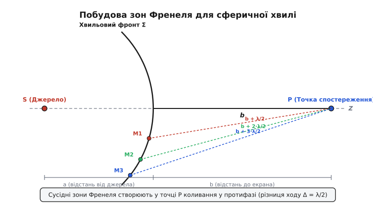
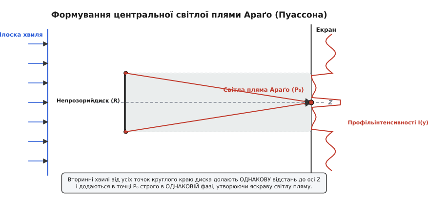
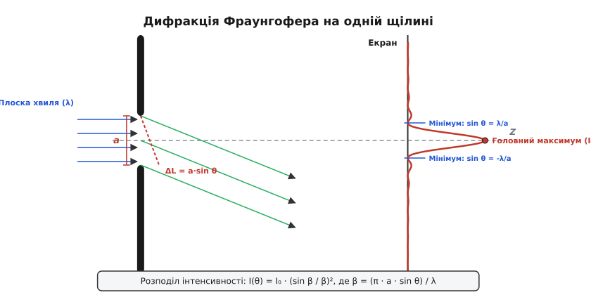
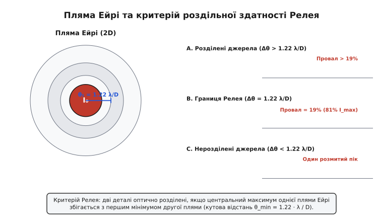

# Дифракція

<preknowlist>
- [Принцип Гюйгенса](book:physics/optics/huygens-principle) — кожна точка хвильового фронту як джерело вторинних сферичних хвиль.
- [Суперпозиція хвиль](book:physics/oscillations-waves/wave-superposition) — геометричне та алгебраїчне додавання когерентних коливань.
- [Довжина хвилі](book:physics/oscillations-waves/wavelength) — просторовий період електромагнітного збурення.
- [Інтерференція хвиль](book:physics/oscillations-waves/wave-interference) — перерозподіл інтенсивності при додаванні когерентних хвиль.
</preknowlist>

Якщо спрямувати вузький зелений лазерний промінь на лезо звичайної бритви або на тонку людську волосину товщиною `0.07 мм`, на білому екрані за перешкодою виникає дивовижне видовище: замість чітко окресленої прямолінійної тіні ви бачите розгалужену систему почергових світлих і темних смуг, що заходять глибоко в область, де геометрична оптика вимагає повної темряви. Якщо ж замість волосини поставити абсолютно непрозорий металевий диск діаметром `2 мм`, у самому центрі його круглої тіні спалахує мініатюрна яскравійша світла точка — пляма Араґо. Звукові хвилі з довжиною `1 м` легко заглядають за ріг будинку чи крізь відчинені двері, тоді як видиме світло з довжиною хвилі всього `0.5 мкм` на масштабах людського побуту здається прямолінійним променем. Це фундаментальне явище — відхилення світлових і будь-яких інших хвиль від прямолінійного напрямку поширення та їх огинання перешкод — називають **дифракцією** (від латинського *diffractus* — розламаний, розщеплений). Вона встановлює межу застосовності геометричної оптики і визначає граничну роздільну здатність усіх оптичних систем Всесвіту — від людського ока й мікроскопа до космічного телескопа та фотолітографічного сканера.

---

### 1. Принцип Гюйгенса — Френеля та хвильова природа огинання перешкод

У повсякденному житті світло здається нам сукупністю тонких прямолінійних променів. Геометрична оптика чудово описує роботу дзеркал, призм та товстих лінз, спираючись на уявлення про те, що світло поширюється найкоротшим шляхом. Проте прямолінійне поширення — це не первинний закон природи, а лише граничний випадок хвильового руху, коли довжина хвилі `λ` прямує до нуля (`λ → 0`) або коли розміри перешкод `a` незрівнянно більші за довжину хвилі (`a ≫ λ`).

Коли характерний розмір отвору, щілини чи непрозорого екрана `a` стає сумірним із довжиною хвилі світла (`a ~ λ`), хвильові властивості виходять на перший план. Хвиля перестає рухатися «всліп» прямолінійно і починає проникати у область геометричної тіні.

Перший крок до пояснення цього явища зробив Крістіан Гюйгенс у 1678 році: кожна точка, якої досягає хвильовий фронт, сама стає джерелом вторинних сферичних хвиль. Проте класичний принцип Гюйгенса не міг відповісти на три важливі запитання:
1. Чому світлова хвиля поширюється переважно вперед, а не повертається назад до джерела?
2. Як обчислити амплітуду та інтенсивність світла у проміжних точках за екраном?
3. Чому виникають почергові світлі та темні дифракційні смуги?

У 1818 році Огюстен Френель об'єднав принцип Гюйгенса з принципом інтерференції Томаса Юнга. Згідно з **принципом Гюйгенса — Френеля**:

> Усі вторинні сферичні хвилі, які випромінюються кожною точкою відкритого хвильового фронту, є взаємно когерентними, і амплітуда світлового поля в будь-якій точці простору є результатом їхньої когерентної суперпозиції (інтерференції).

Математично амплітуда поля `E(P)` у точці спостереження `P` подається у вигляді інтеграла по відкритій поверхні хвильового фронту `S`:

```
E(P) = C · ∬_S (E₀ / r) · exp(i · k · r) · K(θ) dS
```

де `k = 2π / λ` — хвильове число, `r` — відстань від елемента поверхні `dS` до точки `P`, `E₀` — амплітуда первинної хвилі, а `K(θ)` — похилий множник Кірхгофа, який дорівнює одиниці при поширенні прямо вперед (`θ = 0`) і плавно зменшується до нуля при відхиленні назад (`θ = π`).

Детальний опис драматичної історії протистояння корпускулярного вчення Ньютона та хвильової теорії Френеля наведено у вставці [Історія відкриття дифракції: від спостережень Гримальді до парі Пуассона та тріумфу Френеля](book:physics/optics/diffraction/hist-fresnel-arago.md).

---

### 2. Зони Френеля та дифракція у близькому полі (дифракція Френеля)

Пряме обчислення поверхневого інтеграла Гюйгенса — Френеля без комп'ютерів є надзвичайно складним завданням. Щоб розв'язати його аналітично, Френель запропонував елегантний геометричний метод розбиття хвильового фронту на **зони Френеля** (*Fresnel zones*).

Розглянемо точкове джерело світла `S`, яке випромінює сферичну хвилю, та точку спостереження `P` на осі `Z`. Відстань від джерела до вершини хвильового фронту дорівнює `a`, а від вершини до точки `P` — `b`.


*Побудова зон Френеля на сферичній хвильовій поверхні. Відстані від зовнішніх меж сусідніх зон до точки P відрізняються на півдовжини хвилі λ/2.*

Просторова конструкція зон Френеля будується так:
- Центральна точка хвильового фронту `M₀` знаходиться на найкоротшій відстані `b` від точки `P`.
- Перша зона Френеля `M₁` описується сферичним сегментом, межа якого віддалена від точки `P` на відстань `b + λ/2`.
- Друга зона `M₂` віддалена від точки `P` на відстань `b + 2 · (λ/2)` = `b + λ`.
- `k`-та зона `M_k` віддалена від точки `P` на відстань `b + k · (λ/2)`.

Площі всіх таких кільцевих зон Френеля виявляються практично однаковими і для параксіальних кутів дорівнюють:

```
ΔS_k ≈ (π · a · b · λ) / (a + b)     [Площа однієї зони Френеля]
```

Звідси радіус `k`-тої зони Френеля `r_k` визначається співвідношенням:

```
r_k = √[ (k · a · b · λ) / (a + b) ]
```

Для плоского хвильового фронту, що падає з нескінченності (`a → ∞`), формула спрощується до вигляду:

```
r_k = √(k · b · λ)     [Радіус k-ї зони для плоскої хвилі]
```

Наприклад, якщо зелений лазер (`λ = 532 нм`) освітлює плоский фронт, то на відстані `b = 1 м` радіус першої зони Френеля становить всього `r₁ = √(1 · 1 · 5.32e-7) ≈ 0.73 мм`.

#### Векторне додавання амплітуд та компенсація зон

Оскільки відстані від двох сусідніх зон до точки `P` відрізняються на `λ/2`, хвилі від двох сусідніх зон приходять у точку спостереження **у точній протифазі** (з фазовим зсувом `Δφ = π`).

Результуюча амплітуда `E_total` від усіх відкритих зон подається у вигляді знакопочережної суми:

```
E_total = E₁ - E₂ + E₃ - E₄ + E₅ - ...
```

Оскільки із зростанням номера зони `k` кут відхилення `θ` збільшується, похилий множник Кірхгофа плавно зменшує амплітуду випромінювання кожного наступного джерела (`E₁ > E₂ > E₃ > ...`). Оскільки кожна середня амплітуда `E_k` майже дорівнює півсумі сусідніх `E_k ≈ (E_{k-1} + E_{k+1}) / 2`, розгрупувавши члени ряду, отримуємо дивовижний висновок:

```
E_total = E₁ / 2 + (E₁ / 2 - E₂ + E₃ / 2) + (E₃ / 2 - E₄ + E₅ / 2) + ...
E_total ≈ E₁ / 2     [Амплітуда від вільного хвильового фронту]
```

Амплітуда світла у вільній необмеженій хвилі дорівнює **половині амплітуди від однієї першої зони Френеля**! Інтенсивність вільної хвилі `I_free = (E₁ / 2)² = E₁² / 4`.

Це відкриває шлях до трьох фундаментальних дифракційних ефектів у близькому полі (режим дифракції Френеля):

1. **Дифракція на круглому отворі:** Якщо круглий отвір відкриває строго першу зону Френеля (`k = 1`), амплітуда в точці `P` дорівнює `E₁`, а інтенсивність становить `I = E₁² = 4 · I_free` — у чотири рази яскравіше, ніж за відсутності екрана! Якщо ж розширити отвір так, щоб він відкривав дві зони (`k = 2`), амплітуди `E₁` та `E₂` згасять одна одну (`E = E₁ - E₂ ≈ 0`), і в центрі картини виникне **темна пляма**.
2. **Зонна пластинка Френеля:** Якщо виготовити прозорий диск і штучно зачорнити всі парні зони Френеля (або змінити їхню оптичну товщину на `λ/2`), сума амплітуд стане суто додатною: `E_total = E₁ + E₃ + E₅ + ...` Інтенсивність світла у фокусі зростає в десятки разів (`I ∝ N² · I_free`). Такий пристрій називають **зонною пластинкою Френеля** — вона працює як фокусуюча лінза, але спирається не на заломлення світла, а на хвильову дифракцію.
3. **Ппляма Араґо (Пуассона):** Якщо на шляху плоскої хвилі встановити непрозорий диск, що перекриває перші `N` зон Френеля, першою відкритою зоною стає зона `N+1`.


*Схема утворення світлої плями Араґо на осі геометричної тіні за диском. Усі дифраговані хвилі від круглого краю диска додаються у точці P₀ у фазі.*

Амплітуда світла на осі тіні за диском дорівнює `E_total ≈ E_{N+1} / 2`. Оскільки амплітуда першої відкритої зони близька до амплітуди первинної хвилі, на осі тіні **завжди існує світла пляма**, інтенсивність якої лише трохи поступається інтенсивності неперекритого світла!

Границею між близькою дифракцією Френеля та далекою дифракцією Фраунгофера є **число Френеля** `N_F`:

```
N_F = a² / (λ · z)     [Число Френеля]
```

Якщо `N_F ≳ 1`, світло перебуває в режимі **дифракції Френеля**: хвильові фронти є викривленими (сферичними), а дифракційна картина чутлива до найменшої зміни відстані `z`.

---

### 3. Дифракція Фраунгофера у далекому полі (паралельні промені)

Коли відстань від апертури до екрана `z` стає значно більшою за характерний розмір апертури `a` (`z ≫ a² / λ`), число Френеля прямує до нуля (`N_F ≪ 1`). Цей режим називають **дифракцією Фраунгофера** або дифракцією у паралельних променях (далеке поле). Практично режим Фраунгофера спостерігається на великих відстанях або у фокальній площині збиральної лінзи, яка зводить паралельні дифраговані пучки в одну точку.

Суворий математичний розрахунок показує, що комплексне поле дифракції Фраунгофера прямо пропорційне **двовимірному перетворенню Фур'є** від амплітудно-фазової маски апертури.

#### Дифракція Фраунгофера на одній щілині

Розглянемо нескінченно довгу щілину шириною `a`, освічену плоский світловою хвилею з амплітудою `E₀`.


*Дифракція Фраунгофера на прямокутній щілині шириною a та профіль розподілу інтенсивності з центральним максимумом і побічними піками.*

Розділимо ширину щілини на елементарні смужки шириною `dx'`. Різниця ходу між променями, що випромінюються з точок `x'` та з центра щілини під кутом `θ`, дорівнює `ΔL = x' · sin θ`. Фазовий зсув становить `δ = k · x' · sin θ`.

Сумуючи внески усіх вторинних джерел по всій ширині щілини від `-a/2` до `+a/2`, отримуємо амплітуду поля під кутом `θ`:

```
E(θ) = E₀ · ∫_{-a/2}^{+a/2} exp( i · k · x' · sin θ ) dx'
= E₀ · a · [ sin( (π · a · sin θ) / λ ) / ( (π · a · sin θ) / λ ) ]
```

Ввівши фазовий параметр `β`:

```
β = (π · a · sin θ) / λ     [Фазовий параметр щілини]
```

Отримуємо підсумковий розподіл інтенсивності **однощілинної дифракції**:

```
I(θ) = I₀ · ( sin β / β )²     [Розподіл інтенсивності на щілині]
```

Аналіз отриманого розподілу інтенсивності:

1. **Головний максимум (`θ = 0`):** При `β → 0` функція `sin β / β → 1`, тому інтенсивність максимальна і дорівнює `I(0) = I₀`. Центральна світла смуга містить понад `90%` всієї енергії світлового пучка.
2. **Умова дифракційних мінімумів (темні смуги):** Інтенсивність дорівнює нулю (`I(θ) = 0`), коли чисельник `sin β = 0`, за винятком `β = 0`. Це відповідає умовам:

```
β = m · π   ⇒   a · sin θ = m · λ     (де m = ±1, ±2, ±3, ...)
```

Фізичний зміст умови мінімуму дуже простий: якщо різниця ходу між крайніми променями щілини `a · sin θ` дорівнює цілому числу довжин хвиль `m · λ`, щілину можна умовно розбити на `2m` однакових смужок. Промені від кожної пари сусідніх смужок матимуть різницю ходу `λ/2` і повністю згасять один одного.
3. **Побічні максимуми:** Між темними мінімумами розташовані слабкі побічні світлі смуги. На відміну від нулів, вони виникають при `β ≈ (m + 1/2) · π`:
   - Перший побічний максимум (`m = 1`): `I₁ ≈ 0.0472 · I₀` (`4.72%` від центрального);
   - Другий побічний максимум (`m = 2`): `I₂ ≈ 0.0165 · I₀` (`1.65%` від центрального);
   - Третій побічний максимум (`m = 3`): `I₃ ≈ 0.0083 · I₀` (`0.83%` від центрального).
4. **Кутова ширина центрального максимуму:** Відстань між першими двох мінімумами (`m = ±1`) визначає кутовий розмах центральної світлої плями:

```
sin θ₁ = λ / a   ⇒   Δθ ≈ 2λ / a
```

Що вужча щілина `a`, то ширше розлітається світловий пучок після дифракції. Якщо ширина щілини дорівнює довжині хвилі (`a = λ`), перший мінімум виникає під кутом `θ = 90°` — світло дифрагує на увесь півпростір.

Детальні суворі виводи інтегралів Кірхгофа, перетворення Фур'є та інтегрування для 2D-щілин наведено у вставці [Математичний апарат дифракції: від інтеграла Гюйгенса — Френеля до хвильового рівняння](book:physics/optics/diffraction/math-fresnel-kirchhoff.md).

---

### 4. Критерій Релея та дифракційна межа роздільної здатності

Коли світло проходить крізь круглу збиральну лінзу або об'єктив телескопа діаметром `D`, круглий край оправи працює як кругова дифракційна апертура. Замість ідеальної математичної точки у фокальній площині утворюється кругла дифракційна картина — **пляма Ейрі** (*Airy disk*).

Розподіл інтенсивності у плямі Ейрі описується функцією Бесселя першого роду `J₁(x)`:

```
I(θ) = I₀ · [ 2 · J₁( (π·D·sin θ) / λ ) / ( (π·D·sin θ) / λ ) ]²
```

Перше темне кільце, яке оточує центральний диск Ейрі, відповідає першому нулю функції Бесселя при `q₁ ≈ 3.8317`. Звідси кутовий радіус плями Ейрі дорівнює:

```
sin θ₁ = 1.22 · (λ / D)     [Кутовий радіус плями Ейрі]
```

Якщо лінза має фокусну відстань `f`, лінійний радіус плями Ейрі у фокальній площині становить:

```
r_Airy = 1.22 · (λ · f) / D     [Лінійний радіус плями Ейрі]
```

#### Критерій роздільної здатності Релея

Наявність плями Ейрі встановлює фундаментальну межу оптичної деталізації. Якщо оптична система формує зображення двох близьких точкових джерел (наприклад, двох подвійних зірок у телескопі або двох сусідніх молекул у мікроскопі), кожне джерело утворює власну пляму Ейрі.


*Три випадки взаємного розташування двох плям Ейрі згідно з критерієм Релея: розділені джерела, граничний стан з 19% провалом і суцільний нероздільний пік.*

Згідно з **критерієм Релея** (*Rayleigh criterion*):

> Дві однакові точкові деталі вважаються оптично розділеними (розрізненними), якщо центральний максимум плями Ейрі від першого джерела збігається з першим мінімумом (темним кільцем) плями Ейрі від другого джерела.

Мінімальний кут розділення `θ_min` становить:

```
θ_min = 1.22 · (λ / D)     [Границя кутового розділення Релея]
```

При цьому кутовому зміщенні сумарний профіль інтенсивності у центрі між двома піками має провал глибиною приблизно `19%` (відносити провалу `I_dip / I_max ≈ 81%`), що дозволяє людському оку або фотосенсору впевнено зафіксувати наявність двох окремих об'єктів.

В оптичній мікроскопії роздільна здатність описується **границею Аббе**:

```
d_min = λ / (2 · NA)     [Межа роздільної здатності Аббе]
```

де `NA = n · sin α` — числова апертура (*numerical aperture*) об'єктива. Для найкращих світлових мікроскопів з масляною імерсією (`NA ≈ 1.4`) та синім світлом (`λ = 400 нм`) абсолютна межа роздільної здатності становить близько `d_min ≈ 140 нм`. Будь-які деталі, менші за цю межу, через дифракцію розмиваються у суцільну пляму.

---

### 5. Принцип Бабіне та дифракція на додаткових екранах

Розглянемо два оптичні екрани, які доповнюють один одного до суцільної площини:
- Екран `A` (наприклад, непрозорий лист із вирізаним круглим отвором радіуса `R`);
- Екран `B` (наприклад, непрозорий круглий диск радіуса `R`, розміщений на місці колишнього отвору, тоді як решта простору прозора).

Такі екрани називаються **додатковими екранами** (*complementary screens*).

Нехай `E₁(P)` — комплексне поле дифракції за першим екраном, а `E₂(P)` — поле за другим екраном. Згідно з **принципом Бабіне** (*Babinet's principle*):

```
E₁(P) + E₂(P) = E₀(P)     [Принцип Бабіне]
```

де `E₀(P)` — поле вільної хвилі за повної відсутності будь-яких екранів.

З принципу Бабіне випливає фундаментальний висновок для дифракції Фраунгофера:
У будь-якій точці спостереження поза центральним прямолінійним променем (`θ ≠ 0`) вільне поле дорівнює нулю (`E₀(P) = 0`). Отже:

```
E₁(P) = - E₂(P)   ⇒   I₁(P) = |E₁|² = |-E₂|² = I₂(P)
```

> Дифракційні картини Фраунгофера від двох додаткових екранів (поза прямолінійним променем) є абсолютно тотожними за розподілом інтенсивності!

Це правило має колосальне практичне значення:
- Дифракційна картина від тонкої людської волосини товщиною `d` тотожна дифракційній картині від вузької щілини шириною `a = d`. Вимірявши відстань між темними смугами на екрані за допомогою формули `sin θ = λ / d`, можна миттєво визначити товщину волосини з точністю до мікрона.
- Дифракційна картина від дрібних круглих крапель туману або пилку рослин у повітрі тотожна дифракційній картині від круглих отворів (утворення кольорових ореолів та вінців навколо Місяця і Сонця — ефект корони).

---

### 6. Практичні застосування та інженерні обмеження

Дифракція світла — це не лише фундаментальна фізична теорія, а й жорстке інженерне обмеження та водночас потужний інструмент у сучасних технологіях.

> 🔧 **Навіщо це.**
> Розуміння та розрахунок дифракційних явищ лежать у основі проектування напівпровідникових мікросхем, фотоніки, лазерних систем, оптичного запису даних та космічного спостереження.

#### 1. Екстремальна ультрафіолетова фотолітографія (EUV)
Сучасні процесори містять десятки мільярдів транзисторів із характерними розмірами елементів всього `2–3 нм`. Створити такі деталі за допомогою класичних лазерів з видимим або ближнім УФ-світлом (`λ = 193 нм`) неможливо через дифракційну межу Аббе. Щоб подолати дифракційний бар'єр, сучасне напівпровідникове виробництво (сканери ASML EUV) перейшло на екстремальне ультрафіолетове випромінювання з довжиною хвилі `λ = 13.5 нм`. Окрім короткої хвилі, використовуються дифракційні фазозсувні маски (*phase-shift masks*) та імерсійна оптика (`NA = 1.35`), де інтерференція дифрагованих пучків дозволяє формувати на кремнієвій пластині структури, менші за саму довжину хвилі.

#### 2. Оптичні диски та щільність запису даних
Еволюція оптичних носіїв інформації прямо ілюструє боротьбу з дифракційним лімітом:
- **CD (Compact Disc):** Інфрачервоний лазер `λ = 780 нм`, об'єктив `NA = 0.45` ⇒ радіус плями `r_Airy ≈ 1.0 мкм`, ємність `700 МБ`.
- **DVD:** Червоний лазер `λ = 650 нм`, `NA = 0.60` ⇒ пляма `r_Airy ≈ 0.65 мкм`, ємність `4.7 ГБ`.
- **Blu-ray Disc:** Фіолетовий лазер `λ = 405 нм`, `NA = 0.85` ⇒ пляма `r_Airy ≈ 0.29 мкм`, ємність `25–50 ГБ`.

#### 3. Діаграма спрямованості антен і телескопів
Для радіохвиль та мікрохвильового випромінювання параболічне дзеркало антени працює як кругова дифракційна апертура діаметром `D`. Кутова ширина головного променя радіоантени визначається тією ж формулою Ейрі `θ ≈ 1.22 · λ / D`. Щоб отримати високу роздільну здатність у радіоастрономії (наприклад, для отримання зображення тіні чорної діри проектом *Event Horizon Telescope*), астрономи об'єднують радиотелескопи по всій Землі у єдину інтерферометричну мережу з ефективним дифракційним діаметром апертури `D ≈ 12 000 км`.

#### 4. Дифракційні оптичні елементи (DOE)
У сучасній плоскій оптиці та гарнітурах доповненої реальності (AR/VR) товсті скляні лінзи замінюють тонкими **дифракційними оптичними елементами** (*Diffractive Optical Elements, DOE*). На поверхню підкладки наноситься мікрорельєф із фазовими ступенями товщиною в частки мікрона, який за допомогою дифракції формує необхідний хвильовий фронт, розщеплює промені або проектує сітку точок для інфрачервоних 3D-сканерів обличчя у смартфонах.

Програмний код для чисельного розрахунку хвильових полів Френеля та Фраунгофера наведено у вставці [Чисельне моделювання дифракції: розрахунок полів Френеля та Фраунгофера](book:physics/optics/diffraction/proj-diffraction-calc.md).

Повний опис програмного інтерфейсу та конфігураційних параметрів C/C++ бібліотеки розрахунку дифракції міститься у вставці [Інтерфейс та специфікація модуля моделювання хвильової дифракції](book:physics/optics/diffraction/api-diffraction-sim.md).
