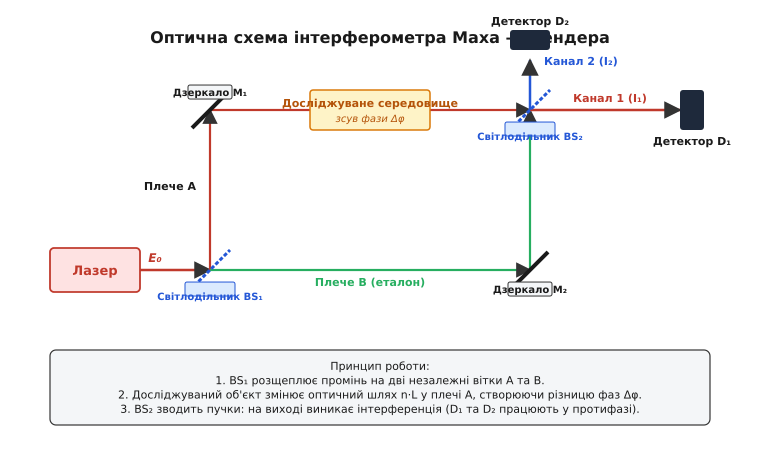
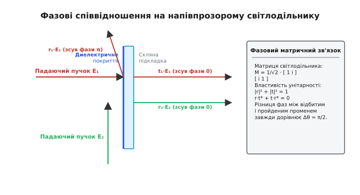
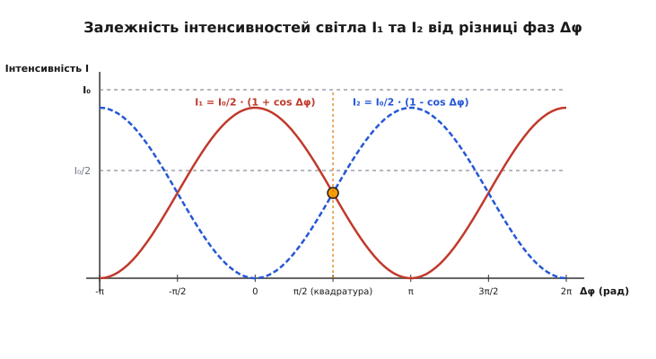
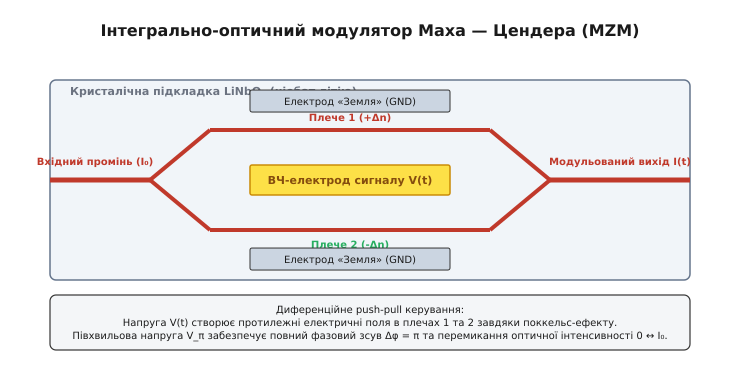

# Інтерферометр Маха — Цендера

<preknowlist>
- [Закон Снелла](book:physics/optics/snells-law) — заломлення світла на межі двох оптичних середовищ та відхилення променів.
- [Рівняння Френеля](book:physics/optics/fresnel-equations) — амплітуди відбитого й заломленого світла та зсув фази на π при відбитті від оптично густішого середовища.
- [Повне внутрішнє відбиття](book:physics/optics/total-internal-reflection) — проходження світла крізь призми та оптичні блоки.
</preknowlist>

Коли лазерний промінь падає на напівпрозоре дзеркало з коефіцієнтом розщеплення 50:50, електромагнітна хвиля розділяється на два просторово рознесені світлові пучки, що поширюються незалежними оптичними шляхами. Якщо один із цих пучків пропускають крізь герметичну кювету з газом, а другий спрямовують через вакуумне еталонне середовище, то найменше локальне розрідження чи нагрівання газу, яке змінює показник заломлення лише на `Δn ≈ 10⁻⁶`, створює відносну фазову затримку `Δφ = (2π / λ) · Δn · L`. При наступному зведенні двох пучків на другому напівпрозорому дзеркалі хвильова інтерференція перетворює цю мікроскопічну фазову різницю на макроскопічний перерозподіл оптичної потужності між двома фотодетекторами. Оптична система, що реалізує цей принцип однопрохідного розділення та зведення хвильових фронтів, називається **інтерферометром Маха — Цендера** (*Mach-Zehnder interferometer*). Вона лежить в основі сучасних аеродинамічних досліджень, високошвидкісних волоконно-оптичних модуляторів Інтернету та квантових вимірювань без взаємодії.

### 1. Фізична ідея та кінематика двопроменевого інтерферометра

Більшість класичних методів вимірювання в оптиці базуються на реєстрації інтенсивності світла, тобто усередненого за часом квадрата амплітуди електричного поля `I = ⟨E²⟩`. Проте світлова хвиля володіє ще однією фундаментальною характеристикою — фазою `φ = k·z - ω·t`. Оскільки частота видимого світла становить близько `10¹⁴ Гц`, безпосередньо фіксувати миттєву фазу хвилі за допомогою електронних фотодетекторів неможливо. Інтерферометрія вирішує цю проблему шляхом оптичного перетворення фазовой інформації в амплітудну: дві когерентні хвилі накладаються одна на одну, створюючи інтерференційну картину, інтенсивність якої прямо залежить від фазового зсуву `Δφ`.

За способом розділення світлового потоку інтерферометри поділяють на два великі класи:
1. **Інтерферометри з діленням хвильового фронту** (наприклад, щілини Юнга або дзеркала Френеля), де різні ділянки одного поперечного перерізу пучка спрямовуються під кутом одна до одної.
2. **Інтерферометри з діленням амплітуди** (інтерферометр Майкельсона, інтерферометр Жамена, інтерферометр Фабрі — Перо та інтерферометр Маха — Цендера), де світлодільний елемент розщеплює амплітуду кожної хвилі по всьому перерізу пучка на дві взаємно когерентні хвилі.

Кінематична схема інтерферометра Маха — Цендера складається з чотирьох основних оптичних елементів, розміщених у вершинах прямокутника або паралелограма: двох світлодільників (`BS₁` та `BS₂`) і двох високовідбивних суцільних дзеркал (`M₁` та `M₂`).


*Кінематична та оптична схема інтерферометра Маха — Цендера: розщеплення променя на дві просторово розділені вітки (плечі) та їх подальше зведення на другому світлодільнику.*

Хід оптичних променів у схемі розгортається наступним чином:
- Монохроматичний лазерний пучок з комплексною амплітудою поля `E₀` падає під кутом 45° на перший напівпрозорий світлодільник `BS₁`.
- На поверхні `BS₁` хвиля розщеплюється на два пучки одинакової інтенсивності: відбита хвиля спрямовується у верхній канал (Плече A), а пройдена хвиля продовжує рух у нижньому каналі (Плече B).
- У плечі A пучок відбивається від плоского дзеркала `M₁`, проходить крізь досліджувану область (наприклад, газовий потік або прозорий кристал товщиною `L`) та падає на другий світлодільник `BS₂`.
- У плечі B пучок проходить крізь еталонне середовище, відбивається від дзеркала `M₂` та підходить до другого світлодільника `BS₂` з іншого боку.
- На світлодільнику `BS₂` відбувається остаточне зведення та інтерференція двох пучків. На виході з `BS₂` формуються два незалежні світлові канали, що спрямовуються на фотодетектори `D₁` та `D₂`.

Головна геометрична особливість інтерферометра Маха — Цендера полягає у **однопрохідному поширенні світла** (*single-pass topology*). На відміну від інтерферометра Майкельсона, де промені відбиваються назад під кутом 180° і двічі проходять кожне плече, у схемі Маха — Цендера світло рухається виключно вперед замкненим контуром. Це принципово виключає паразитне повернення відбитого світла назад у лазерне джерело та забезпечує повне просторове рознесення двох оптичних віток.

### 2. Електродинаміка світлодільника та фазові зсуви Френеля

Щоб зрозуміти, чому інтерферометр Маха — Цендера має два виходи і як між ними розподіляється світлова енергія, необхідно детально розглянути граничні умови електродинаміки при відбитті та заломленні світла на світлодільнику.

Типовий оптичний світлодільник є скляною пластиною, на передню грань якої нанесено тонку багатошарову диелектричну або напівпрозору металеву плівку. Згідно з рівняннями Френеля, при відбитті електромагнітної хвилі від оптично густішого середовища (коли світло рухається з повітря `n₁ = 1` у диелектричну плівку `n₂ > 1`) фаза електричного поля змінюється на `π` (180°). Зсув фази `π` означає, що вектор напруженості електричного поля змінює свій напрямок на протилежний.

Натомість при відбитті світла зсередини підкладки від внутрішньої межі з повітрям (від оптично менш густого середовища), або при прямому проходженні крізь межу розділу, стрибка фази на `π` не виникає (фазовий зсув дорівнює `0`).


*Фазові співвідношення електромагнітної хвилі при проходженні й відбитті на межах напівпрозорого світлодільника.*

Розглянемо фазовий набіг хвиль, що потрапляють на вихідні детектори `D₁` та `D₂`, припустивши для простоти, що геометричні довжини обох плечей суворо однакові (`L_A = L_B`):

1. **Траєкторія до Детектора D₁ (канал прямого проходження):**
   - Пучок з плеча A відбивається від дзеркала `M₁` (зсув фази `π`) і проходить крізь світлодільник `BS₂` без відбиття (зсув фази `0`). Підсумкова фаза хвилі A на детекторі `D₁`: `φ_A1 = π + 0 = π`.
   - Пучок з плеча B проходить крізь світлодільник `BS₁` (зсув фази `0`), відбивається від дзеркала `M₂` (зсув фази `π`) і відбивається від зовнішньої поверхні `BS₂` (зсув фази `π`). Підсумкова фаза хвилі B на детекторі `D₁`: `φ_B1 = 0 + π + π = 2π ≡ 0`.
   - Різниця фаз між хвилями A та B на детекторі `D₁`: `Δφ_D1 = φ_A1 - φ_B1 = π - 0 = π`.
   - Оскільки хвилі приходять у протифазі (`Δφ = π`), на детекторі `D₁` спостерігається **деструктивна інтерференція** (повне згашення світла).

2. **Траєкторія до Детектора D₂ (канал бічного відбиття):**
   - Пучок з плеча A відбивається від `BS₁` (фаза `π`), відбивається від `M₁` (фаза `π`) і відбивається від внутрішньої поверхні `BS₂` (фаза `0`). Підсумкова фаза хвилі A на детекторі `D₂`: `φ_A2 = π + π + 0 = 2π ≡ 0`.
   - Пучок з плеча B проходить крізь `BS₁` (фаза `0`), відбивається від `M₂` (фаза `π`) і проходить крізь `BS₂` (фаза `0`). Підсумкова фаза хвилі B на детекторі `D₂`: `φ_B2 = 0 + π + 0 = π`.
   - Різниця фаз між хвилями A та B на детекторі `D₂`: `Δφ_D2 = π - π = 0`.
   - Оскільки хвилі приходять у синфазному стані (`Δφ = 0`), на детекторі `D₂` спостерігається **конструктивна інтерференція** (максимум інтенсивності).

Таким чином, закон збереження енергії у безвтратному інтерферометрі виконується з математичною суворістю: якщо ідеально настроєний порожній інтерферометр спрямовує 100% оптичної потужності `I₀` на детектор `D₂`, то на детекторі `D₁` інтенсивність дорівнює нулю. Будь-яка фазова збуреність у плечах перерозподіляє енергію між `D₁` та `D₂`, але їхня сумарна інтенсивність завжди залишається сталою: `I₁ + I₂ = I₀`.

Детальний математичний аналіз матриць переносу світлодільників та вивід інтерференційних формул наведено у вставці [Матричний формалізм та фазовий аналіз інтерферометра Маха — Цендера](book:physics/optics/mach-zehnder-interferometer/math-mach-zehnder-matrix.md). Історію виникнення цієї оптичної геометрії та її перші застосування описано у вставці [Історія створення та розвитку інтерферометра Маха — Цендера](book:physics/optics/mach-zehnder-interferometer/hist-mach-zehnder-history.md).

### 3. Оптична різниця ходу, квадратурна точка та чутливість

Нехай у плече A вміщено вимірювальну кювету довжиною `L_A` з показником заломлення `n_A`, а у плечі B світло поширюється у середовищі з довжиною `L_B` та показником `n_B`.

Оптична довжина шляху (*Optical Path Length*, OPL) у кожному плечі визначається інтегралом від показника заломлення уздовж геометрії променя:

```
L_opt,A = n_A · L_A
L_opt,B = n_B · L_B
```

Різниця оптичних шляхів `ΔL_opt = L_opt,A - L_opt,B` створює відносну фазову різницю між двома світловими хвилями у момент їх зустрічі на другому світлодільнику `BS₂`:

```
Δφ = (2π / λ₀) · ΔL_opt = (2π / λ₀) · (n_A · L_A - n_B · L_B)
```

де `λ₀` — довжина хвилі лазерного випромінювання у вакуумі.

Якщо на вхід подається монохроматична хвиля з інтенсивністю `I₀`, то внаслідок додавання комплексних амплітуд полів `E₁` та `E₂` інтенсивності на вихідних детекторах описуються класичними формулами двопроменевої інтерференції:

```
I₁ = (I₀ / 2) · (1 - cos Δφ)            [інтенсивність на першому детекторі]
```

```
I₂ = (I₀ / 2) · (1 + cos Δφ)            [інтенсивність на другому детекторі]
```


*Залежність інтенсивностей світла на детекторах D₁ та D₂ від фазової різниці Δφ з виділеною робочою точкою квадратури.*

Аналіз вихідних характеристик виявляє три важливі оптичні режими:

1. **Режим конструктивного/деструктивного екстремуму (`Δφ = 0, 2π, 4π...`):**
   На детекторі `D₂` спостерігається абсолютний максимум `I₂ = I₀`, а на `D₁` — абсолютний мінімум `I₁ = 0`. У цих точках похідна `dI / d(Δφ) = 0`, тобто інтерферометр має **мінімальну чутливість** до малих флуктуацій фази. Якщо оптична середовище змінює фазу на крихітну величину `δφ ≪ 1`, зміна інтенсивності пропорційна квадрату малого параметра `δI ≈ (I₀/4) · (δφ)²`, що вкрай важко зареєструвати на тлі шумів.

2. **Квадратурна робоча точка (`Δφ_0 = π/2` або 90°):**
   Коли початкова різниця фаз між плечима виставлена на `90°` (наприклад, за допомогою мікрометричного зсуву одного з дзеркал або компенсаційної скляної пластини), інтенсивності на обох детекторах стають рівними: `I₁ = I₂ = I₀ / 2`.
   
   У цій точці похідна інтерференційної функції досягає свого абсолютного максимуму:

   ```
   |dI / d(Δφ)|_max = I₀ / 2
   ```

   При невеликому фазовому зсуві `δφ ≪ 1` зміна інтенсивності стає суворо лінійною:

   ```
   ΔI₁ ≈ - (I₀ / 2) · δφ
   ΔI₂ ≈ + (I₀ / 2) · δφ
   ```

   Квадратурний режим є **основним робочим станом** для всіх оптичних датчиків та вимірювальних систем на базі інтерферометра Маха — Цендера.

3. **Контраст (видимість) інтерференційної картини:**
   Якість інтерференційного сигналу характеризується коефіцієнтом видимості Майкельсона (*fringe visibility*, `V`):

   ```
   V = (I_max - I_min) / (I_max + I_min)
   ```

   Для ідеального інтерферометра з рівним розщепленням амплітуд (50:50) та високою когерентністю джерела `I_min = 0`, тому контраст досягає граничного значення `V = 1` (100%). Якщо світлодільники мають несиметричне розщеплення (наприклад, 60:40) або пучки частково втрачають взаємну поляризацію, контраст падає `V < 1`, що зменшує динамічний діапазон вимірювального приладу.

### 4. Фазовий алгоритм дискретного зсуву (Phase-Shifting Interferometry, PSI)

Для точної реконструкції двовимірного поля фази `Δφ(x, y)` у томографії та аеродинаміці застосовують метод **фазового алгоритму дискретного зсуву** (*Phase-Shifting Interferometry*, PSI).

Якщо у вимірювальне плече послідовно вводять чотири фіксовані опорні фазові зсуви `α_k ∈ {0, π/2, π, 3π/2}` (за допомогою п'єзоактюатора дзеркала M₂), фотокамера реєструє чотири двовимірні картини інтенсивності:

```
I₁(x, y) = I_bg(x, y) + I_mod(x, y) · cos(Δφ(x, y) + 0)
I₂(x, y) = I_bg(x, y) + I_mod(x, y) · cos(Δφ(x, y) + π/2) = I_bg - I_mod · sin(Δφ)
I₃(x, y) = I_bg(x, y) + I_mod(x, y) · cos(Δφ(x, y) + π)   = I_bg - I_mod · cos(Δφ)
I₄(x, y) = I_bg(x, y) + I_mod(x, y) · cos(Δφ(x, y) + 3π/2) = I_bg + I_mod · sin(Δφ)
```

Математично комбінуючи різниці цих чотирьох зображень, фоновий шум `I_bg(x,y)` та контрастну амплітуду `I_mod(x,y)` повністю виключають із підсумкового рівняння:

```
(I₄(x, y) - I₂(x, y)) / (I₁(x, y) - I₃(x, y))
= (2 · I_mod · sin(Δφ)) / (2 · I_mod · cos(Δφ))   [підстановка закомбінованих різниць: скасування I_bg]
= tg(Δφ(x, y))                                    [скорочення 2·I_mod та тригонометричне співвідношення sin/cos]
```

Звідси шуканий фазовий розподіл обчислюється функцією двох аргументів `atan2`:

```
Δφ(x, y) = atan2( I₄(x, y) - I₂(x, y),  I₁(x, y) - I₃(x, y) )
```

Отримане значення фази лежить у діапазоні `[-π, +π]`. Для відновлення безперервного профілю густини застосовують алгоритми **фазового розгортання** (*phase unwrapping*), які усувають стрибки на `2π`, відновлюючи абсолютне 3D-поле показника заломлення.

### 5. Гетеродинне та гомодинне детектування вимірювань

У високоточних вимірювальних приладах для приглушення низькочастотних оптичних та електронних шумів застосовують **гетеродинне інтерферометричне детектування**.

У гетеродинній схемі в одне з плечей інтерферометра встановлюють акустооптичний modulator (AOM, комірку Брегга), який зсуває оптичну частоту хвилі на радіочастоту `f_AOM ≈ 40–80 МГц`. Внаслідок цього на вихідному фотодетекторі зводяться дві хвилі з різними частотами `ω₁` та `ω₂ = ω₁ + 2π·f_AOM`.

Вихідний фотострум містить високочастотне радіоколивання (сигнал биття):

```
I_beat(t) = I₀ · [ 1 + V · cos(2π · f_AOM · t + Δφ(t)) ]
```

Корисна фазова інформація `Δφ(t)` опиняється перенесеною на несучу радіочастоту `f_AOM`. Електронний блок обробки за допомогою квадратурного демодулятора (I/Q-демодулятора) помножує сигнал на опорні синусоїду та косинусоїду `sin(2π f_AOM t)` і `cos(2π f_AOM t)`. Це повністю ізолює вимірювач від низькочастотних коливань інтенсивності лазера та звукових шумів приміщення, забезпечуючи точність вимірювання зміщення до `10⁻¹² м` (пікометровий рівень).

### 6. Порівняння з інтерферометром Майкельсона

У класичній фізиці найближчим аналогом інтерферометра Маха — Цендера є інтерферометр Майкельсона. Обидва прилади використовують амплітудне розщеплення монохроматичного світла на два пучки, але їхні принципові відмінності визначають абсолютно різні сфери практичного застосування.

| Параметр порівняння | Інтерферометр Майкельсона | Інтерферометр Маха — Цендера |
| :--- | :--- | :--- |
| **Кількість оптичних елементів** | 3 (1 світлодільник, 2 дзеркала) | 4 (2 світлодільники, 2 дзеркала) |
| **Геометрія поширення світла** | Двопрохідна (назад і вперед) | Однопрохідна (прямолінійно замкнена) |
| **Повернення випромінювання** | Світло повертається у джерело | Промені виходять на нові детектори |
| **Кількість вихідних каналів** | 1 основний вихід (+1 назад у джерело) | 2 незалежні виходи (`D₁` та `D₂`) |
| **Просторове рознесення плечей** | Плечі перетинаються у світлодільнику | Плечі повністю ізольовані у просторі |
| **Основне призначення** | Вимірювання довжин, спектрометрія | Датчики газів, плазми, модулятори |

Ключові переваги інтерферометра Маха — Цендера над схемою Майкельсона:

- **Відсутність паразитного зворотного зв'язку:** У схемі Майкельсона відбитий промінь повертається безпосередньо в вихідне вікно лазера. Це викликає оптичну нестабільність лазерного резонатора, стрибки моди та шум інтенсивності, що вимагає встановлення дорогих вентилів Фарадея (оптичних ізоляторів). У схемі Маха — Цендера випромінювання рухається вперед і не потрапляє у лазер.
- **Просторове розділення об'ємів:** Завдяки прямокутній схемі відстань між плечима A та B можна зробити довільно великою (від сантиметрів до кількох метрів). Це дозволяє монтувати у вимірювальне плече габаритні аеродинамічні труби, високотемпературні полум'яні пальники або вакуумні камери із захисними вікнами, не зачіпаючи еталонне плече.
- **Двоканальне балансне детектування:** Наявність двох виходів `D₁` та `D₂`, що працюють у протифазі, дозволяє застосовувати дифференційне підключення фотодіодів. При відніманні електронних сигналів `S = I₁ - I₂` амплітудні шуми лазера (які є спільними для обох каналів) взаємно гасяться, а корисний фазовий сигнал подвоюється.

### 7. Інтегрально-оптичні та волоконні модулятори (MZM)

У сучасних технологіях передачі даних інтерферометр Маха — Цендера пройшов шлях від великогабаритних оптичних столів до мікроскопічних фотонних інтегральних схем (*Photonic Integrated Circuits*, PIC).

В оптоелектроніці інтерферометр Маха — Цендера використовується як **високошвидкісний оптичний модулятор амплітуди** (*Mach-Zehnder Modulator*, MZM). Замість об'ємних дзеркал і світлодільників на монокристалічній підкладці ніобату літію (`LiNbO₃`) або кремнію методом фотолітографії формують тонкоплівкові оптичні хвилеводи.


*Конструкція хвилеводного інтегрально-оптичного модулятора на ніобаті літію з електродами керування.*

Принцип роботи хвилеводного модулятора MZM:
1. Вхідний світловодний пучок монохроматичного лазера розділяється на два паралельні мікрохвилеводи за допомогою Y-подібного розгалужувача (*Y-junction splitter*).
2. Поруч із хвилеводами нанесені металеві керуючі електроди. При прикладанні високочастотної електричної напруги `V(t)` у кристалі виникає електричне поле `E_el`.
3. Завдяки **лінійному електрооптичному ефекту Поккельса** (*Pockels effect*) електричне поле змінює показник заломлення матеріалу хвилеводу:

   ```
   Δn = - (1 / 2) · n³ · r₆₃ · E_el
   ```

   де `r₆₃` — електрооптичний коефіцієнт кристала.

4. Для зменшення керуючої напруги застосовують **push-pull конфігурацію електродів**: електричне поле у плечі 1 спрямоване вгору (збільшує показник заломлення на `+Δn`), а у плечі 2 — вниз (зменшує показник заломлення на `-Δn`).
5. На виході два хвилеводи зводяться разом через другий Y-розгалужувач. Якщо напруга керування дорівнює нулю (`V = 0`), хвилі приходять синфазно, і світло без перешкод проходить у вихідне волокно (оптична «одиниця»). Якщо напруга дорівнює **півхвильовій напрузі** `V_π`, фазова різниця досягає `Δφ = π`, хвилі гасять одна одну при зведенні, і світло у вихідному волокні зникає (оптичний «нуль»).

Сучасні інтегральні модулятори Маха — Цендера здатні перемикати оптичні сигнали з частотою понад 100 ГГц, забезпечуючи швидкість передачі даних понад 800 Гбіт/с на один оптичний канал у волоконно-оптичних магістралях Інтернету та дата-центрах.

Практичний приклад чисельного моделювання та роботи з кодом симулятора модулятора Маха — Цендера мовами Python, C та C++ подано у вставці [Чисельна симуляція та обробка сигналів інтерферометра Маха — Цендера](book:physics/optics/mach-zehnder-interferometer/proj-mach-zehnder-sim.md).

### 8. Квантові ефекти: однофотонна інтерференція та вимірювання без взаємодії

Коли інтенсивність лазерного випромінювання на вході інтерферометра зменшують до такого рівня, що в оптичному тракті одночасно перебуває лише один-єдиний фотон, хвильова картина інтерференції не зникає. Якщо експеримент повторювати тисячі разів, реєструючи кожен фотон окремим фотопомножувачем, накопичена статистика точок на детекторі повністю відтворить класичний розподіл інтенсивності `I₁` та `I₂`.

Це явище ілюструє фундаментальне твердження Поля Дірака: **кожен фотон інтерферує лише сам із собою, і ніколи — з іншими фотонами**.

У квантовій механіці стан фотона описується суперпозицією двох шляхів:

```
|ψ⟩ = (1 / √2) · |Плече A⟩ + (i / √2) · |Плече B⟩
```

Фотон одночасно поширюється обома плечима інтерферометра. Якщо спробувати «вистежити», яким саме плечем пройшов фотон (поставивши у плече A незбурюючий квантовий детектор), суперпозиція негайно руйнується (*wave function collapse*), і інтерференційна картина на виході полностью зникає.

На базі однофотонного інтерферометра Маха — Цендера у 1993 році Авшалом Еліцур та Лев Вайдман розробили концепцію **вимірювання без взаємодії** (*interaction-free measurement*):
- Якщо в плече A помістити надчутливий об'єкт (квантову «бомбу»), який поглинає фотон і спрацьовує при найменшій взаємодії, то сам факт наявності об'єкта перекриває плече A.
- Якщо фотон поглинається — об'єкт спрацьовує (ймовірність 50%).
- Якщо фотон не поглинається, його хвильова функція редукується до плеча B. При проходженні другого світлодільника `BS₂` фотон з ймовірністю 50% потрапляє на детектор `D₁`, який у порожньому інтерферометрі завжди залишався «темним».
- Зареєструвавши фотон на детекторі `D₁`, експериментатор дізнається про наявність об'єкта у плечі A **без жодного фізичного контакту чи поглинання кванту енергії цим об'єктом**.

Експерименти з вимірювання без взаємодії були блискуче підтверджені групою Антона Цайлінґера і сьогодні використовуються у квантовій томографії та протоколах захищеного квантового розподілу ключів.

### 9. Практичні обмеження, стабілізація та промислові давачі

У реальних лабораторних та промислових умовах створення стабільного інтерферометра Маха — Цендера є складним інженерним завданням. Головним ворогом інтерферометрії є **фазова нестабільність**, викликана зовнішніми паразитними чинниками:

1. **Акустичні вібрації та термічне розширення:**
   Оскільки довжина хвилі видимого світла становить всього `λ ≈ 0.6 мкм`, механічне зміщення будь-якого з двох дзеркал всього на `0.3 мкм` (напівдовжину хвилі) зсуває фазу на `π`, повністю перевертаючи інтерференційну картину (`I₁ ↔ I₂`). Температурний дрейф оптичного столу або конвекційні потоки повітря створюють хаотичне плавання фази.
   
   *Методи захисту:* використання важких оптичних столів на пневматичних опорах, розміщення схеми у вакуумних або термоізольованих кожухах, а також застосування **систем активної фазової стабілізації** (*Active Phase Stabilization*). У таких системах одне з дзеркал монтують на п'єзоактюаторі (PZT), а електронне коло зворотного зв'язку постійно підтримує інтерферометр у квадратурній точці.

2. **Довжина когерентності джерела світла:**
   Для отримання чіткої інтерференційної картини різниця геометричних довжин плечей `ΔL = |L_A - L_B|` не повинна перевищувати **довжину когерентності** джерела `L_c`:

   ```
   L_c ≈ λ₀² / Δλ
   ```

   Для звичайного світлодіода або білого світла довжина когерентності становить лише кілька мікрометрів, що вимагає юстування довжин плечей з мікронною точністю. Використання одномодових лазерів із вузькою лінією випромінювання дозволяє збільшити довжину когерентності до кількох метрів або навіть кілометрів.

3. **Поляризаційна деградація та промислове застосування:**
   Якщо у двох плечах вектор електричного поля `E` повертається на різні кути, ортогональні поляризаційні компоненти не інтерферують, і контраст падає `V → 0`. У волоконних сенсорах використовують волокно зі збереженням поляризації (PMF).

На базі волоконного інтерферометра Маха — Цендера будують **волоконно-оптичні гідрофони** для підводного моніторингу океану (звукова хвиля стискає вимірювальне волокно, змінюючи фазу), **лазерні доплерівські віброметри** для безконтактного аналізу турбін і мостів, а також датчики витоку газу на магістральних газопроводах.

> 🔧 **Навіщо це.**
> Інтерферометр Маха — Цендера є базовим елементом сучасної оптоелектроніки та квантових технологій. У телекомунікаціях він слугує високошвидкісним модулятором світла (MZM), що кодує цифрові дані на частотах понад 100 ГГц для волоконно-оптичних магістралей. У вимірювальній техніці він використовується як ультрачутливий сенсор газу, температури, тиску та звукових хвиль. У квантовій оптиці на його основі реалізують квантовий розподіл ключів (QKD), квантові обчислення на фотонних чипах та вимірювання без взаємодії.
