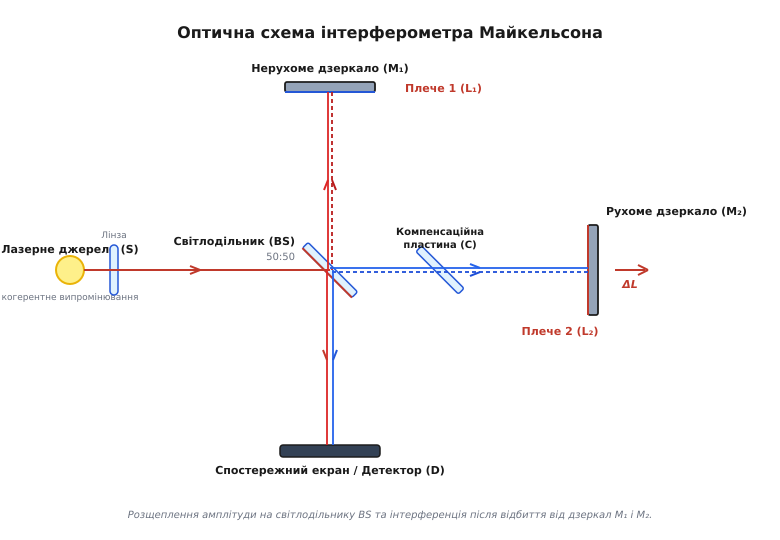
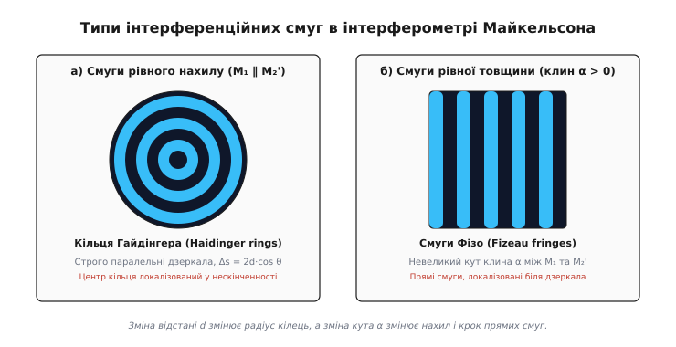
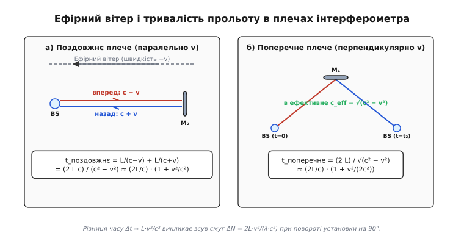
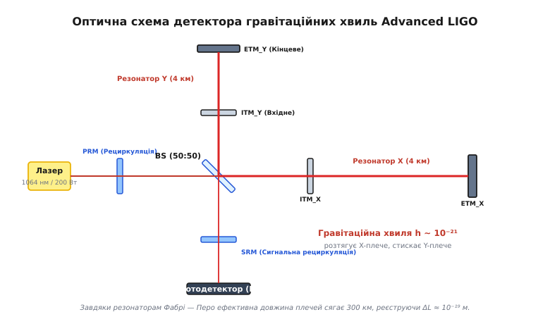

# Інтерферометр Майкельсона

<preknowlist>
- [Закон Снелла](topic:physics/snells-law) — геометричні закони відбиття й заломлення світла на межі середовищ.
- [Рівняння Френеля](topic:physics/fresnel-equations) — амплітудні коефіцієнти відбиття й передачі та втрата півхвилі (зсув фази на π) при відбитті від оптично густішого середовища.
- [Двощілинний експеримент](topic:physics/double-slit-experiment) — принципи інтерференції світла та умови конструктивного й деструктивного додавання когерентних хвиль.
- [Інтерферометр Маха — Цендера](topic:physics/mach-zehnder-interferometer) — двопроменева інтерферометрія з діленням амплітуди та однопрохідною топологією.
</preknowlist>

Коли монохроматичний лазерний пучок із довжиною хвилі `632.8 нм` падає на напівпрозору скляну пластину й розділяється на два взаємно перпендикулярні промені, які відбиваються від двох плоских дзеркал на відстані кількох десятків сантиметрів і знову зводяться разом, найменше механічне зміщення одного з дзеркал лише на `158.2 нм` (чверть довжини хвилі) повністю змінює картину на спостережному екрані: центральну яскраву пляму замінює абсолютна темрява. Принцип оптичного вимірювання, що лежить в основі цієї установки, називається **інтерферометром Майкельсона** (*Michelson interferometer*, від лат. *inter* — взаємно, *ferens* — той, що несе, та грец. *metron* — міра). Винайдений американським фізиком Альбертом Майкельсоном у 1881 році, цей прилад не лише спростував гіпотезу світлоносного ефіру й проклав шлях до спеціальної теорії відносності, а й перетворився на найчутливіший вимірювальний інструмент сучасної фізики — від високоточного визначення еталона метра до детектування гравітаційних хвиль від злиття чорних дир на відстанях у мільярди світлових років.

---

### 1. Будова та оптична геометрія двопроменевого розщеплення

На відміну від двощілинної схеми Юнга, де когерентні джерела утворюються шляхом ділення хвильового фронту у просторі, інтерферометр Майкельсона реалізує **ділення амплітуди** (*amplitude splitting*). Світлова хвиля розщеплюється по всьому своєму поперечному перерізу на два когерентні пучки, що поширюються взаємно перпендикулярними оптичними шляхами (плечима інтерферометра), відбиваються назад і знову зводяться на тому самому світлодільному елементі.

Кінематична та оптична схема приладу містить чотири базові елементи:
1. **Джерело світла (`S`)**: монохроматичний лазер або розсіяне джерело з коліматорною лінзою, що формує паралельний або слабко розбіжний світловий пучок.
2. **Світлодільник (`BS`)**: скляна пластина з напівпрозорим покриттям (коефіцієнт розщеплення 50:50), встановлена під кутом 45° до вхідного променя.
3. **Нерухоме дзеркало (`M₁`)**: плоске високвідбивне дзеркало, розміщене на кінці першого плеча довжиною `L₁`.
4. **Рухоме дзеркало (`M₂`)**: плоске дзеркало, розміщене на кінці другого плеча довжиною `L₂`, закріплене на прецизійному мікрометричному та п'єзоелектричному трансляційному супорті.
5. **Компенсаційна пластина (`C`)**: пластина з прозорого скла, що має абсолютно таку ж товщину й показник заломлення, як і підкладка світлодільника `BS`.


*Розщеплення амплітуди на світлодільнику BS та інтерференція після відбиття від дзеркал M₁ і M₂.*

Хід оптичних променів у двопрохідній топології розгортається наступним чином:
- Вхідний лазерний пучок підходить до світлодільника `BS`. На напівпрозорій грані хвиля розщеплюється: перша частина відбивається вгору вздовж Плеча 1 (до дзеркала `M₁`), а друга частина проходить крізь підкладку `BS` прямо вздовж Плеча 2 (до дзеркала `M₂`).
- Пучок 1 проходить відстань `L₁`, відбивається від дзеркала `M₁` строго назад (на 180°), знову доходить до `BS`, проходить крізь світлодільну пластину й спрямовується донизу на спостережний екран `D`.
- Пучок 2 проходить відстань `L₂`, відбивається від дзеркала `M₂`, повертається до `BS`, відбивається від внутрішньої поверхні світлодільного шару й також спрямовується донизу на екран `D`.
- На екрані `D` обидва пучки когерентно накладаються один на одного, утворюючи інтерференційну картину.

З точки зору хвильової поляризації, світлодільник має напівпрозоре багатошарове диелектричне або металеве покриття. При куті падіння 45° коефіцієнти відбиття для s-поляризованого світла (вектор `E` перпендикулярний до площини падіння) та p-поляризованого світла (вектор `E` у площині падіння) можуть відрізнятися. Для забезпечення точно 50:50 розщеплення в сучасних приладах використовують поляризаційно-незалежні світлодільні куби (*non-polarizing beam splitter cubes*, NPBS), у яких світлодільний шар затиснутий між двома скляними призмами. На зворотну грань плоского світлодільника обов'язково наносять просвітлювальне покриття (*anti-reflection coating*, AR-покриття), що запобігає появі паразитних відбитків, які утворюють вторинні паразитні смуги на екрані.

Оптична якість підкладок світлодільника та дзеркал вимагає надзвичайно високої обробки поверхонь. Будь-які мікроскопічні локальні нерівності скла, викривлення поверхні або оптична неоднорідність показника заломлення призводять до викривлення хвильового фронту. Тому у прецизійних інтерферометрах відхилення поверхні від ідеальної площини не повинно перевищувати `λ / 10` або `λ / 20` (близько 30 нанометрів по всій робочій апертурі).

Ключовою деталлю класичної схеми є **компенсаційна пластина** (*compensator plate*, `C`, від лат. *compensatio* — зрівноваження). Розглянемо шлях, який долає світло у склі підкладки:
- Пучок 1 проходить крізь скляну підкладку `BS` тричі: один раз при первинному проходженні до `M₁`, другий раз при поверненні від `M₁` та третій раз при остаточному проходженні до екрана.
- Пучок 2 відбивається від передньої напівпрозорої поверхні `BS` без проходження крізь підкладку, прямує до `M₂`, і лише при поверненні від `M₂` проходить крізь підкладку `BS` один раз.

Якби компенсаційна пластина була відсутня, Пучок 1 проходив би у склі шлях `3 · d_glass`, а Пучок 2 — лише `1 · d_glass`. Для монохроматичного лазера це розходження оптичної товщини можна компенсувати механічним зсувом дзеркала `M₂`. Однак скло володіє оптичною дисперсією — залежністю показника заломлення від довжини хвилі `n(λ)`. При використанні немонохроматичного (білого) світла різні спектральні компоненти отримували б різний фазовий зсув, що повністю зруйнувало б інтерференцію білого світла. 

Встановлення компенсаційної пластини `C` у Плечі 2 під кутом 45° зрівнює геометричний шлях обох променів у склі до значення `3 · d_glass`, забезпечуючи ідеальну симетрію дисперсійних фазових набігів для всього спектрального діапазону.

---

### 2. Електродинамічний розрахунок та фазовий набіг

Для математичного опису інтерференційного сигналу необхідно врахувати геометричну різницю ходу та граничні фазові зсуви при відбитті, які випливають із рівнянь Френеля.

Оскільки промені проходять кожне плече двічі (туди й назад), геометрична різниця ходу `Δs` дорівнює подвоєній різниці довжин плечей:

```
Δs = 2 · L₂ - 2 · L₁ = 2 · ΔL
```

Згідно з рівняннями Френеля, при відбитті світлової хвилі від оптично густішого середовища (від напівпрозорого шару світлодільника з боку повітря або від металевого дзеркала) фаза хвилі змінюється на `π` радіан (відбувається втрата півхвилі `λ / 2`). Натомість при відбитті від оптично менш густого середовища або при проходженні межі розділу фазовий стрибок відсутній (дорівнює `0`).

Детальний аналіз показує, що один із двох променів зазнає на один додатковий фазовий зсув `π` більше, ніж інший. Повна різниця фаз `Δφ` між двома хвилями на екрані дорівнює:

```
Δφ = (2π / λ) · Δs + π = (4π · ΔL / λ) + π
```

Нехай амплітуда електричного поля кожного з двох зведених променів дорівнює `E₀`. Сумарне електричне поле у точці спостереження описується суперпозицією двох гармонічних коливань:

```
E_res = E₀ · cos(ωt) + E₀ · cos(ωt + Δφ)
      = 2 · E₀ · cos(Δφ / 2) · cos(ωt + Δφ / 2)
```

Фотодетектори фіксують усереднену по часовому періоду інтенсивність випромінювання `I = ⟨E_res²⟩`:

```
I(ΔL) = 4 · I₁ · cos²(Δφ / 2)
      = 4 · I₁ · cos²( (2π · ΔL / λ) + π / 2 )      [підстановка Δφ = 4π·ΔL/λ + π]
      = 4 · I₁ · sin²( (2π · ΔL) / λ )              [тригонометричне зведення: cos(α + π/2) = -sin(α)]
```

де `I₁` — інтенсивність від одного окремого плеча при перекритті іншого.

```
I(ΔL) = 2 · I₁ · [ 1 - cos( (4π · ΔL) / λ ) ]
```

З отриманої залежності випливають фізичні умови для формування освітленості:
1. **Інтерференційні мінімуми (абсолютна темрява, I = 0)** виникають, коли різниця ходу дорівнює цілому числу довжин хвиль:

```
2 · ΔL = m · λ  ===>  ΔL = m · (λ / 2)     [m = 0, ±1, ±2, ...]
```

2. **Інтерференційні максимуми (максимальна яскравість, I = 4 I₁)** виникають, коли різниця ходу дорівнює непарному числу напівхвиль:

```
2 · ΔL = (m + 1/2) · λ  ===>  ΔL = (m + 1/2) · (λ / 2)     [m = 0, ±1, ±2, ...]
```

Коли рухоме дзеркало `M₂` переміщується на відстань `ΔL = λ / 2` (для червоного He-Ne лазера це лише `316.4 нм`), оптична різниця ходу змінюється на цілу довжину хвилі `λ`, і інтерференційна картина повертається до початкового стану, проходячи один повний період зміни яскравості.

Аналіз чутливості показує, що найбільша швидкість зміни інтенсивності при зміщенні дзеркала досягається на крутих схилах інтерференційної функції, де `dI / d(ΔL)` максимальна (тобто при `4π ΔL / λ = (2m + 1) π / 2`). У цій так званій **квадратурній точці** (*quadrature point*) мікроскопічний зсув дзеркала на `0.1 нм` викликає легко вимірювану зміну фотоструму детекторного блоку.

Для реєстрації не лише амплітуди, а й напрямку руху дзеркала (вперед чи назад) у сучасних метрологічних інтерферометрах застосовують **квадратурну детекцію** (*quadrature detection*). Випромінювання розділяють на два фотодетектори з фазовим зсувом `90°` між ними, утворюючи два канали: `I = I₀ · cos(4π ΔL / λ)` та `Q = I₀ · sin(4π ΔL / λ)`. Це дає змогу однозначно визначати фазу `φ = arctg(Q / I)` та усувати невизначеність напрямку зміщення, безперервно відстежуючи рух у так званому алгоритмі розгортання фази (*phase unwrapping*).

Гетеродинні інтерферометри розширюють цей принцип шляхом використання двохчастотного лазера (наприклад, зееманівського He-Ne лазера з ортогонально поляризованими частотами `ν₁` та `ν₂`, що відрізняються на `Δν ≈ 2–3 МГц`). Один компонент спрямовується у рухоме плече, а другий — у нерухоме. Зміщення дзеркала викликає доплерівський зсув частоти `Δν_D = 2 v / λ`, який реєструється як зміна частоти биттів між двома компонентами з субнанометровою точністю.

Строгий математичний вивід фазових матриць світлодільника та аналіз контрасту для спектральних ліній різної форми наведено у вставці [Математичний аналіз фазових зсувів та контрасту смуг](topic:physics/michelson-interferometer/math-michelson-interferometry.md).

---

### 3. Класифікація інтерференційних картин: смуги рівного нахилу та рівної товщини

Вид інтерференційної картини на спостережному екрані суттєво залежить від взаємного кутового орієнтування дзеркал `M₁` та `M₂`, а також від ступеня паралельності світлових променів у пучку.

Уявно замінимо дзеркало `M₂` його уявним зображенням `M₂'`, яке утворюється при відбитті від світлодільника `BS`. Тоді інтерферометр Майкельсона стає еквівалентним повітряному прошарку між двома плоскими поверхнями `M₁` та `M₂'`.


*Смуги рівного нахилу (кільця Гайдінгера) та смуги рівної товщини (смуги Фізо).*

Залежно від геометрії еквівалентного прошарку розрізняють два класи інтерференційних картин:

#### А. Смуги рівного нахилу (кільця Гайдінгера)
Якщо дзеркала `M₁` та `M₂'` розташовані **строго паралельно** одне одному (`M₁ ∥ M₂'`), еквівалентний шар має постійну товщину `d = |L₂ - L₁|`.

Якщо на прилад падає розбіжний або сфокусований світловий пучок, промені входять у шар під різними кутами `θ` до нормалі. Оптична різниця ходу для променя, що поширюється під кутом `θ`, дорівнює:

```
Δs(θ) = 2 · d · cos θ
```

Оскільки різниця ходу однакова для всіх променів, що нахилені під однаковим кутом `θ` до оптичної осі, точки однакової інтенсивності утворюють поверхні концентричних конусів. У фокальній площині збірної лінзи або на віддаленому екрані формуються **кільця Гайдінгера** (*Haidinger rings*) — система яскравих і темних концентричних кілець.

Властивості кілець Гайдінгера:
- У центрі картини (`θ = 0`) різниця ходу максимальна і дорівнює `Δs = 2d`.
- При збільшенні товщини прошарку `d` (рух дзеркала `M₂` від нульового положення) порядок інтерференції в центрі зростає, і з центральної точки послідовно «народжуються» нові кільця, які розширюються до периферії.
- При зменшенні `d` до нуля кільця стягуються до центру й зникають; при `d = 0` усе поле зору стає однорідно темним (через додатковий фазовий зсув `π`).
- Кільця Гайдінгера локалізовані у нескінченності, тому для їх чіткого спостереження на екрані використовують збірну лінзу.

#### Б. Смуги рівної товщини (смуги Фізо)
Якщо дзеркало `M₂` трохи нахилене відносно `M₁`, плоскопаралельний прошарок перетворюється на **повітряний клин** із малим кутом `α`.

Якщо на такий клин падає паралельний світловий пучок (`θ ≈ 0`), різниця ходу визначається лише місцевою товщиною клина `d(x)` у даній точці `x`:

```
Δs(x) = 2 · d(x) = 2 · (d₀ + α · x)
```

У результаті на екрані спостерігаються **смуги Фізо** (*Fizeau fringes*) — система рівновіддалених паралельних прямих смуг, орієнтованих паралельно лінії ребра клина. Відстань між сусідніми яскравими смугами (крок інтерференційної решітки `Δx`) дорівнює:

```
Δx = λ / (2 · α)
```

Вимірювання кроку смуг `Δx` дає змогу визначати малі кути нахилу `α` з точністю до часток кутової секунди. На відміну від кілець Гайдінгера, смуги Фізо локалізовані безпосередньо біля поверхні дзеркал `M₁` та `M₂'`. 

Окремим випадком смуг рівної товщини є **кільця Ньютона**, які спостерігаються, якщо одне з дзеркал замінити слабосферичною поверхнею з радіусом кривизни `R`. Тоді товщина прошарку описується формулою `d(r) = d₀ + r² / (2R)`, а радіуси кільцевих смуг зростають як `r_m ∝ √m`.Аналіз картини кілець Ньютона дозволяє визначати радіус кривизни лінз і якість сферичного полірування деталей.

---

### 4. Дослід Майкельсона — Морлі та криза ефірної теорії

У XIX столітті панувала гіпотеза, що світлові хвилі поширюються у нерухомому всепроникному середовищі — **світлоносному ефірі**. Оскільки Земля рухається по коловій орбіті навколо Сонця зі швидкістю `v ≈ 30 км/с`, у лабораторній системі відліку мав би спостерігатися відносний потік середовища — «ефірний вітер».

Альберт Майкельсон розробив свій інтерферометр саме для того, щоб виявити цей ефірний вітер шляхом вимірювання різниці швидкості світла вздовж і перпендикулярно до руху Землі.


*Концепція ефірного дрейфу у поздовжньому та поперечному плечах інтерферометра.*

Розглянемо час прольоту світла в обох плечах одинакової довжини `L`:
1. **У поздовжньому плечі** (паралельно до вектора швидкості Землі `v`): світло рухається проти ефірного вітру зі швидкістю `c - v`, а назад — за вітром зі швидкістю `c + v`. Повний час прольоту дорівнює:

```
t_поздовжнє = L / (c - v) + L / (c + v)
            = (2 · L · c) / (c² - v²)               [зведення до спільного знаменника]
            ≈ (2 · L / c) · (1 + v² / c²)           [розклад у ряд Тейлора для v ≪ c]
```

2. **У поперечному плечі** (перпендикулярно до `v`): світло має рухатися під кутом, щоб компенсувати зсув приладу. Ефективна швидкість світла за теоремою Піфагора дорівнює `c_eff = √(c² - v²)`. Повний час прольоту дорівнює:

```
t_поперечне = (2 · L) / √(c² - v²)
            = (2 · L / c) / √(1 - v² / c²)          [винесення c за корінь]
            ≈ (2 · L / c) · (1 + v² / (2 · c²))     [наближення Тейлора (1 - x)^(-1/2) ≈ 1 + x/2]
```

Різниця часу між двома плечима становить `Δt ≈ L · v² / c³`. При повороті всієї експериментальної установки на 90° поздовжнє та поперечне плечі міняються місцями, що подвоює часову затримку й має викликати зсув інтерференційних смуг на величину:

```
ΔN = (2 · L · v²) / (λ · c²)
```

У знаменитому досліді Майкельсона — Морлі 1887 року в Клівленді оптичний шлях збільшили до `L = 11 м` за допомогою багаторазових відбиттів, а масивну пісковикову плиту помістили у чашу з рідкою ртуттю для плавного повороту. Розрахунковий очікуваний зсув становив `ΔN_теор ≈ 0.4` смуги.

Проте експеримент дав **суворий нульовий результат**: жодного зсуву смуг (в межах похибки `0.005` смуги) виявити не вдалося! Швидкість світла виявилася абсолютно однаковою за всіма напрямками.

Цей «негативний» результат спричинив глибоку кризу класичної фізики. Лише у 1905 році Альберт Ейнштейн пояснив цей феномен у **Спеціальній теорії відносності (СТВ)**, відкинувши гіпотезу ефіру та проголосивши постійність швидкості світла `c` в усіх інерціальних системах відліку фундаментальним законом природи. 

Пізніші модифікації експерименту, зокрема **дослід Кеннеді — Торндайка** (1932) з принципово різними довжинами плечей `L₁ ≠ L₂`, підтвердили, що швидкість світла не залежить і від величини швидкості руху лабораторії, довівши релятивістське уповільнення часу. Сучасні перевірки лоренц-інваріантності з кріогенними оптичними резонаторами (наприклад, дослідження Ахіма Петерса та Стефана Шиллера) підтверджують постійність швидкості світла з точністю `Δc / c < 10⁻¹⁸`.

Детальний опис історичного контексту, суперечок і технічного влаштування установки 1887 року наведено у вставці [Історія досліду Майкельсона — Морлі та народження теорії відносності](topic:physics/michelson-interferometer/hist-michelson-morley.md).

---

### 5. Часова когерентність та фур'є-спектрометрія (FTIR)

Інтерферометр Майкельсона є основним інструментом для аналізу спектрального складу випромінювання та вимірювання часової когерентності.

Якщо джерело випромінює не ідеально монохроматичну хвилю, а спектральний інтервал шириною `Δλ` біля центральної довжини хвилі `λ₀`, кожна спектральна компонента створює власну інтерференційну картину. При збільшенні різниці плечей `ΔL` максимуми одних довжин хвиль накладаються на мінімуми інших, і контраст смуг згасає.

Якість інтерференційної картини характеризується **видністю смуг** (*fringe visibility*, `V`, контрастом за Майкельсоном):

```
V = (I_max - I_min) / (I_max + I_min)
```

Максимальна різниця ходу `Δs_max = 2 · ΔL_max`, при якій смуги ще залишаються помітними (`V > 0`), визначається **довжиною часової когерентності** (*coherence length*, `l_c`):

```
l_c ≈ λ₀² / Δλ = c · τ_c
```

де `τ_c` — час когерентності (тривалість гармонічного хвильового цуга).

На цьому явищі базується **інфрачервона фур'є-спектрометрія** (*Fourier Transform Infrared Spectroscopy*, FTIR). 

При плавному переміщенні рухомого дзеркала `M₂` зі швидкістю `v_m` фотодетектор реєструє залежність інтенсивності від оптичної затримки `δ = 2 · ΔL` — **інтерферограму** (*interferogram*, `I(δ)`). Згідно з теоремою Вінера — Хінчина, інтерферограма `I(δ)` пов'язана зі спектральною густиною випромінювання `S(ν)` прямим перетворенням Фур'є:

```
I(δ) = ∫₀^∞ S(ν) · [ 1 + cos(2π · ν · δ) ] dν
```

Шляхом зворотного математичного фур'є-перетворення зареєстрованої інтерферограми обчислюють точний спектр випромінювання `S(ν)`:

```
S(ν) = ∫_-∞^∞ [ I(δ) - I_∞ ] · exp(-i · 2π · ν · δ) dδ
```

Переваги фур'є-спектрометрів порівняно зі звичайними призменими чи дифракційними спектрометрами:
1. **Виграш Жакено (світлосила)**: відсутність вузьких вхідних і вихідних щілин дає змогу пропускати у сотні разів більший світловий потік.
2. **Виграш Фелгетта (мультиплексування)**: фотодетектор одночасно реєструє сигнал від усіх спектральних частот, що кардинально скорочує час накопичення спектра та підвищує відношення сигнал/шум у `√N_lines` разів.
3. **Виграш Конна (калібрування по довжині хвилі)**: використання опорного He-Ne лазера для точної фіксації положення дзеркала `δ` із нанометровою точністю забезпечує виняткову точність шкали хвильових чисел.

Для зменшення бокових пелюсток спектральних піків при скінченній довжині сканування `δ_max` застосовують математичні **аподизаційні функції** (Нортона — Біра, Гаппа — Гензеля), що згладжують краї інтерферограми. Спектральна роздільна здатність фур'є-спектрометра прямо визначається максимальною різницею ходу: `Δν = 1 / δ_max`.

---

### 6. Гравітаційно-хвильові детектори (LIGO / Virgo)

Найвеличнішим сучасним масштабуванням інтерферометра Майкельсона є лазерні детектори гравітаційних хвиль **LIGO** (*Laser Interferometer Gravitational-Wave Observatory*, США), **Virgo** (Італія) та **KAGRA** (Японія).

Згідно із Загальною теорією відносності Ейнштейна, гравітаційна хвиля, що проходить крізь Землю, періодично деформує метрику простору-часу: вона розтягує простір в одному напрямку й одночасно стискає його у перпендикулярному напрямку.


*Оптична схема детектора LIGO з резонаторами Фабрі — Перо та системою рециркуляції потужності.*

Конструктивні особливості інтерферометра Advanced LIGO:
- **Гігантські плечі**: довжина кожного з двох перпендикулярних плечей становить `L = 4 км`. Вакуумні труби діаметром 1.2 м відкачані до високого вакууму `10⁻⁹ мм рт. ст.`
- **Оптичні резонатори Фабрі — Перо**: у кожне плече вбудовано систему з двох дзеркал, між якими світло робить близько 280 проходів туди й назад. Це збільшує ефективну довжину оптичного шляху з 4 км до `L_eff ≈ 300 км`.
- **Дзеркала-підвіси**: масивні кварцові дзеркала масою 40 кг підвішені на багатоступеневих антисейсмічних нитках з плавленого кварцу, що ізолюють їх від вібрацій земної кори.
- **Рециркуляційні дзеркала**: дзеркало рециркуляції потужності (`PRM`) повертає відбите світло назад у систему, підвищуючи оптичну потужність всередині плечей до `750 кВт`. Сигнальне дзеркало рециркуляції (`SRM`) розширює частотну смугу детектора.
- **Стиснуте світло**: введення стиснутого вакуумного стану світла (*squeezed light*) дозволяє знизити дробовий фотонний шум нижче стандартної квантової межі.

Усунення оптичних шумів у лазерному інтерферометрі потребує подолання трьох фундаментальних фізичних бар'єрів:
1. **Сейсмічний шум**: вібрації Землі придушуються активними гідравлічними та п'єзоелектричними системами підвісу (HEPI), а також чотириступеневими маятниковими підвісами.
2. **Тепловий шум**: молекулярні флуктуації у дзеркалах та нитках підвісу придушуються використанням підкладок із надчистого плавленого кварцу з мінімальними механічними втратами (Q-фактор `> 10⁷`).
3. **Квантовий шум**: при низькій потужності лазера домінує дробовий фотонний шум (флуктуації кількості фотонів), а при високій потужності — шум радіаційного тиску (механічні поштовхи фотонів об дзеркала). Оптимальний баланс визначає Стандартну квантову межу (*Standard Quantum Limit*, SQL).

Коли гравітаційна хвиля амплітудою `h` проходить крізь detector, довжина одного плеча змінюється на `+ΔL`, а другого — на `-ΔL`. Відносна деформація становить `h = ΔL / L`.

У вересні 2015 року детектори LIGO вперше в історії людства зареєстрували гравітаційний сплеск **GW150914** від злиття двох чорних дир масами 36 і 29 мас Сонця. Амплітуда зареєстрованого сигналу становила `h ≈ 10⁻²¹`.

Це означає, що інтерферометр Майкельсона виміряв зміщення дзеркал на відстані 4 км з фантастичною точністю:

```
ΔL = h · L ≈ 10⁻²¹ · 4000 м ≈ 4 · 10⁻¹⁸ м
```

Ця величина у 1000 разів менша за діаметр протона! Така надзвичайна чутливість досягається завдяки зсуву фази у квадрантуру, застосуванню збудженого стиснутого світла для подолання квантового межі фотонного шуму та обробці високочастотних сигналів.

---

### 7. Комп'ютерне моделювання та розрахунок видності смуг

Чисельний аналіз інтерференційних картин дає змогу моделювати структуру смуг для довільних форм поверхні дзеркал, обчислювати геометричні аберації та будувати профілі інтенсивності.

Готові програми мовами Python та C++, які виконують обчислення двовимірної сітки інтенсивностей `I(x, y)` та виводять результат у консоль або зберегають у файл, наведено у вставці [Чисельне моделювання картини інтерферометра Майкельсона](topic:physics/michelson-interferometer/proj-michelson-sim.md).

---

### 8. Технічні параметри та юстування приладу

Повний перелік параметрів оптичних елементів, допусків на кутове юстування дзеркал, температурних коефіцієнтів та калібрувальних формул для вимірювання мікропереміщень і показників заломлення наведено у довідковій вставці [Технічна специфікація та параметри інтерферометричної установки](topic:physics/michelson-interferometer/api-interferometer-specs.md).

---

### 9. Практичні застосування в оптичній метрології

> 🔧 **Навіщо це.**
> Інтерферометр Майкельсона є стандартом для вимірювання фізичних величин з нанометровою точністю. Будь-який зовнішній фактор, що змінює довжину плеча `L` або показник заломлення середовища `n` (тиск, температура, механічна напруга, гравітаційна хвиля), викликає миттєвий зсув інтерференційних смуг. Вимірявши зсув на `N` смуг, зміну оптичного шляху визначають з високою точністю `Δ(n·L) = N · (λ / 2)`.

Основні сфери практичного застосування охоплюють:

1. **Еталонування довжини та метрологія**: у 1892 році Альберт Майкельсон за допомогою свого приладу вперше виміряв платиново-іридієвий еталон метра у Парижі в довжинах хвиль червоної лінії кадмію (`1 м = 1 553 163.5 λ_Cd`). Це дозволило прив'язати одиницю довжини до фундаментальної фізичної константи.
2. **Оптична когерентна томографія** (*Optical Coherence Tomography*, OCT): сучасний метод медичної діагностики в офтальмології та кардіології. Використовуючи суперлюмінесцентний світлодіод з малою довжиною когерентності (`l_c ≈ 10 мкм`), низкокогерентний інтерферометр Майкельсона сканує внутрішні шари сітківки ока чи судин із просторовою роздільною здатністю у кілька мікрометрів.
3. **Контроль якості оптичних поверхонь**: виявлення мікроскопічних дефектів, відхилень від площинності та шорсткості лінз і дзеркал з точністю до `λ / 20`.
4. **Газова та рідинна рефрактометрія**: вимірювання малих змін показника заломлення газів і рідин `Δn ≈ 10⁻⁷` при зміні тиску, складу або температури.
