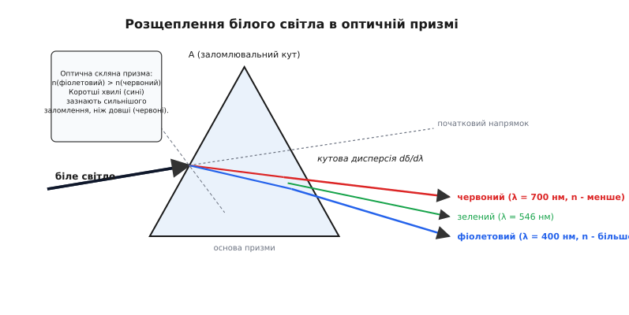
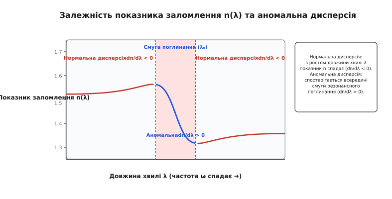
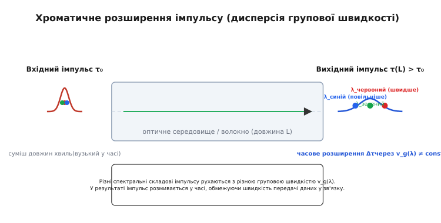

# Оптична дисперсія

<preknowlist>
- [Закон Снелла](book:physics/optics/snells-law) — зв'язок кутів падіння та заломлення світла на межі середовищ через показник заломлення `n`.
- [Повне внутрішнє відбиття](book:physics/optics/total-internal-reflection) — критерії заломлення та відбиття світла на межі оптично густішого середовища.
- [Принципи волоконної оптики](book:physics/optics/fiber-optics-principles) — поширення світлових сигналів у скляних та полімерних світловодах.
</preknowlist>

Коли тонка смужка сонячного світла проходить крізь грань полірованої скляної призми, вона залишає прозоре скло не у вигляді єдиного білого променя, а розгортається у якравий колірний вієр — від м'якого червоного на одному краї до глибокого фіолетового на іншому. Якщо цей самий промінь спрямувати у високошвидкісне волоконно-оптичне кабельне траси завдовжки 50 кілометрів, короткий лазерний імпульс тривалістю в кілька пікосекунд на виході розмиється й розшириться у часі, загрожуючи накладанням сусідніх бітів даних. В основі обох явищ лежить фундаментальна властивість матерії — **оптична дисперсія** (*optical dispersion*, від латинського *dispersio* — «розсіювання», «розпорошення»). Залежність фазової швидкості електромагнітної хвилі та показника заломлення середовища від частоти або довжини світлової хвилі визначає поведінку світла у призмах, об'єктивах телескопів, телекомунікаційних світловодах та потужних фемтосекундних лазерах.

### 1. Фізична природа дисперсії: фазова швидкість та атомарний відгук

У вакуумі всі електромагнітні хвилі — від довгохвильового радіовипромінювання до жорстких гамма-квантів — поширюються з однаковою фундаментальною швидкістю `c ≈ 299 792 458 м/с`. Проте при потраплянні в будь-яке прозоре матеріальне середовище (скло, воду, повітря, кристал) світлова хвиля починає взаємодіяти з електронними оболонками та атомарними ядрами речовини.

Показник заломлення середовища `n` описує, у скільки разів **фазова швидкість** світлової хвилі `v_p` у даному середовищі менша за її швидкість у вакуумі `c`:

```
v_p = c / n
```

Оскільки світло є змінним електромагнітним полем, вектор його електричного напруженості `E(t)` змушує негативно заряджені електрони атомів здійснювати вимушені коливання відносно позитивно заряджених ядер. Зсув зарядів створює макроскопічну змінну поляризацію середовища `P(t)`. Зв'язані електрони утворюють мікроскопічні осцилятори зі своїми власними резонансними частотами `ω₀`, які лежать переважно в ультрафіолетовій ділянці спектра для прозорих діелектриків (внаслідок енергії електронних переходів) та в інфрачервоній ділянці (внаслідок коливань важких іонів кристалічної ґратки).

Мікроскопічний відгук речовини складається з трьох основних механізмів поляризації:
1. **Електронна поляризація**: Деформація електронних хмар атомів під дією змінного поля. Є найшвидшим процесом (інерційність `10⁻¹⁵` с), який визначає заломлення та дисперсію у видимому та ультрафіолетовому діапазонах.
2. **Іонна (ґраткова) поляризація**: Зсув позитивних та негативних іонів кристалічної ґратки один відносно одного. Має більшу інерційність (`10⁻¹³` с) і проявляється в інфрачервоній області спектра.
3. **Орієнтаційна (дипольна) поляризація**: Поворот полярних молекул (наприклад, молекул води). Проявляється на низьких частотах (радіо- та мікрохвильовий діапазон) і у видимому оптичному діапазоні практично не дає внеску через високу частоту світлових коливань.

Коли частота падаючого світла `ω` віддалена від власної частоти електронів `ω₀`, відгук електронної оболонки залежить від того, наскільки швидко поле змінює свій напрямок. Чим вища частота світлової хвилі (тобто чим коротша довжина хвилі `λ`), тим ближче вона до УФ-резонансу атомів, і тим сильніше електрони «відгукуються» на змінне поле. Цей підсилений відгук збільшує діелектричну сприйнятливість середовища `χ_e(ω)`, підвищуючи макроскопічний показник заломлення `n(ω)`.

Отже, показник заломлення не є сталою константою речовини: він є функцією довжини хвилі у вакуумі `n(λ)` або колової частоти хвилі `n(ω)`.

### 2. Заломлення в призмі та нормальна дисперсія

Найпростішим і найвідомішим проявом дисперсії є розклад білого світла на спектр при проходженні крізь трикутну скляну призму. Біле світло не є монохроматичним: воно складається із суміші хвиль різної довжини — від червоного світла (`λ ≈ 700 нм`) до фіолетового (`λ ≈ 400 нм`).

Згідно із [законом Снелла](book:physics/optics/snells-law), кут заломлення світла `θ₂` на межі повітря-скло визначається співвідношенням:

```
sin θ₁ / sin θ₂ = n(λ)
```

де `θ₁` — кут падіння. Оскільки показник заломлення скла для фіолетового світла `n(фіолетовий) ≈ 1.53` більший, ніж для червоного `n(червоний) ≈ 1.51`, фіолетові промені заломлюються під меншим кутом до нормалі, тобто відхиляються від початкового напрямку руху сильніше за червоні.


*Проходження білого світла крізь трикутну скляну призму. Короткохвильові фіолетові промені зазнають сильнішого заломлення, ніж довгохвильові червоні, через вищий показник заломлення скла n(фиолетовий) > n(червоний).*

Після проходження двох граней призми із заломлювальним кутом `A` повний кут відхилення променя `δ` залежить від кута падіння `θ₁`. При симетричному проходженні променя крізь призму досягається **кут мінімального відхилення** `δ_min`:

```
n(λ) = sin [ (A + δ_min) / 2 ] / sin (A / 2)
```

Це співвідношення є основним експериментальним методом високоточного вимірювання показника заломлення матеріалів за допомогою гоніометрів та призмових спектрометрів.

Для малих заломлювальних кутів кут відхилення наближено дорівнює:

```
δ(λ) ≈ (n(λ) - 1) · A     [для малих кутів падіння]
```

Різниця кутів відхилення між крайніми спектральними променями `Δδ = δ(фіолетовий) - δ(червоний)` створює кутовий спектральний вієр. Величина `dδ / dλ = A · (dn / dλ)` називається **кутовою дисперсією призми**.

Область оптичного спектра, у якій показник заломлення спадає зі зростанням довжини хвилі, називають **нормальною дисперсією**:

```
dn / dλ < 0     [нормальна дисперсія]
```

Для всіх звичайних прозорих оптичних стекол, води, кварцу та алмазу у видимому діапазоні спостерігається саме нормальна дисперсія: коротші хвилі (сині) рухаються в речовині повільніше й заломлюються сильніше, ніж довші хвилі (червоні).

Історію відкриття цього явища, боротьбу між теоріями «забруднення» світла та вирішальний експеримент Ісаака Ньютона детально описано у вставці [Відкриття оптичної дисперсії: від трикутних призм Ньютона до хроматичних аберацій](book:physics/optics/optical-dispersion/hist-dispersion-discovery.md).

### 3. Кількісні характеристики: число Аббе та формули Зельмейєра й Коші

Для практичних розрахунків оптичних систем необхідно вміти кількісно характеризувати як середній рівень заломлення скла, так і його дисперсійну здатність.

#### Число Аббе (середня дисперсія)

Німецький фізик Ернст Аббе ввів безрозмірну величину, яку називають **числом Аббе** або коефіцієнтом дисперсії `V_d`. Вона характеризує відносну дисперсію матеріалу у видимому спектральному діапазоні відносно фраунгоферових ліній поглинання:

```
V_d = (n_d - 1) / (n_F - n_C)
```

де:
- `n_d` — показник заломлення скла на жовтій лінії натрію або гелію (`λ_d = 587.56 нм`).
- `n_F` — показник заломлення на блакитній лінії водню (`λ_F = 486.13 нм`).
- `n_C` — показник заломлення на червоній лінії водню (`λ_C = 656.27 нм`).

Знаменник `(n_F - n_C)` називають **середньою дисперсією**. Оскільки різниця `(n_F - n_C)` стоїть у знаменнику, **чим більше число Аббе `V_d`, тим слабша дисперсія матеріалу**:
- **Кронові стекла** (*crown glass*): володіють високим числом Аббе (`V_d > 50`) та низьким показником заломлення (`n_d ≈ 1.5`–`1.6`).
- **Флінтові стекла** (*flint glass*): містять важкі елементи (свинець, барій), мають мале число Аббе (`V_d < 50`) та високу дисперсію (`n_d ≈ 1.6`–`1.9`).

#### Формула Коші

Для прозорих діапазонів діелектриків Огюстен Коші запропонував емпіричне розкладення показника заломлення у степеневий ряд за парними ступенями `1 / λ`:

```
n(λ) = A + B / λ² + C / λ⁴
```

де `A`, `B`, `C` — коефіцієнти Коші, що підбираються експериментально для конкретного скла (причому `λ` виражається у мікронах). Перший член `A` визначає показник заломлення на нескінченно великій довжині хвилі, а член `B / λ²` задає основний нахил кривої нормальної дисперсії. Формула Коші добре працює для швидких оцінок у вузькому видимому діапазоні, але дає значні похибки в ультрафіолеті та інфрачервоній області.

#### Рівняння Зельмейєра

Найточнішим і загальноприйнятим у сучасній оптичній індустрії є **рівняння Зельмейєра**, яке виражає зв'язок між показником заломлення та резонансними частотами поглинання атомарних осциляторів:

```
n²(λ) = 1 + ∑ [ (A_i · λ²) / (λ² - B_i) ]     [i від 1 до 3]
```

Для опису оптичних стекол у діапазоні від 0.3 до 2.5 мікрометра зазвичай використовують тричленну формулу Зельмейєра:

```
n²(λ) = 1 + (A₁·λ²) / (λ² - B₁) + (A₂·λ²) / (λ² - B₂) + (A₃·λ²) / (λ² - B₃)
```

де:
- `A₁, A₂, A₃` — безрозмірні коефіцієнти Зельмейєра, пропорційні силі осциляторів.
- `B₁, B₂, B₃` — квадрати резонансних довжин хвиль поглинання (виражені у `мкм²`).

Перші два члени `(A₁, A₂)` зазвичай відповідають резонансам електронних переходів в ультрафіолеті (`λ_UV ≈ 0.05`–`0.1 мкм`), а третій член `A₃` описує резонанс іонних коливань кристалічної ґратки в далекому інфрачервоному діапазоні (`λ_IR ≈ 10`–`30 мкм`).

Строге математичне виведення формули Зельмейєра та рівнянь Коші з класичної фізичної моделі електронного осцилятора наведено у вставці [Математична модель лоренцівського осцилятора та класичне виведення дисперсії](book:physics/optics/optical-dispersion/math-lorentz-oscillator.md).

### 4. Аномальна дисперсія та резонансне поглинання

Якщо довжина хвилі падаючого світла наближається до однієї з власних резонансних частот речовини `ω₀` (або резонансної довжини хвилі `λ₀`), характер відгуку середовища кардинально змінюється. Вузький спектральний інтервал поблизу резонансу називають **смугою поглинання** (*absorption band*).

Всередині смуги поглинання вимушені коливання електронів відбуваються із великою амплітудою, а енергія світлової хвилі інтенсивно перетворюється на теплоту або перевипромінюється (резонансне поглинання). У цій зоні похідна показника заломлення змінює знак:

```
dn / dλ > 0     [аномальна дисперсія]
```

Таку поведінку називають **аномальною дисперсією**. При аномальній дисперсії з ростом довжини хвилі `λ` показник заломлення `n` не спадає, а стрімко зростає. 


*Залежність показника заломлення n(λ) від довжини хвилі. Поза смугами поглинання спостерігається нормальна дисперсія (dn/dλ < 0). Усередині смуги резонансного поглинання показник заломлення зазнає різкого вигину з аномальною дисперсією (dn/dλ > 0).*

Явище аномальної дисперсії супроводжується сильним затуханням світлової хвилі, тому середовище в цій зоні стає непрозорим. Для комплексного опису аномальної дисперсії вводять комплексний показник заломлення `ñ(ω) = n(ω) + i·κ(ω)`, де уявна частина `κ(ω)` відповідає за коефіцієнт поглинання світла.

### 5. Фазова й групова швидкості та дисперсія імпульсів

У реальних оптичних системах та волоконно-оптичних лініях зв'язку використовуються не нескінченні монохроматичні хвилі, а світлові спалахи або імпульси скінченної тривалості. Світловий імпульс складається із набору хвиль із різними частотами у спектральному інтервалі `[ω - Δω, ω + Δω]`.

У диспергуючому середовищі виникає принципова різниця між двома швидкостями:
1. **Фазова швидкість** (`v_p = c / n`) — швидкість поширення фази гармонічної монохроматичної хвилі (переміщення гребенів і западин).
2. **Групова швидкість** (`v_g`) — швидкість поширення обвідної імпульсу та перенесення світлової енергії.

Групова швидкість визначається похідною хвильового числа `k = ω·n(ω)/c` по частоті:

```
v_g = dω / dk = c / [ n(λ) - λ · (dn / dλ) ]
```

Величина `n_g = n(λ) - λ · (dn / dλ)` називається **груповим показником заломлення**. У зоні нормальної дисперсії (`dn / dλ < 0`) значення `n_g > n`, тому групова швидкість імпульсу завжди менша за фазову швидкість `v_g < v_p`.

#### Хроматична дисперсія у світловодах (GVD)

Оскільки різні колірні (спектральні) складові світлового імпульсу рухаються з різною груповою швидкістю `v_g(λ)`, під час поширення уздовж оптичного волокна імпульс зазнає часового розмивання. Це явище називають **дисперсією групової швидкості** (*Group Velocity Dispersion*, GVD) або **хроматичною дисперсією**.


*Розширення світлового імпульсу під час проходження крізь оптичне середовище. Через залежність групової швидкості v_g(λ) від довжини хвилі червона й синя спектральні складові виходять у різний час, збільшуючи тривалість імпульсу.*

У волоконній оптиці загальна хроматична дисперсія світловода складається з двох компонент:
1. **Матеріальна дисперсія** (`D_mat`) — зумовлена безпосередньо дисперсією скла середовища `d²n / dλ²`.
2. **Хвилеводна дисперсія** (`D_wg`) — виникає через геометрію волокна (розподіл потужності світла між серцевиною та оболонкою світловода), що залежить від нормованої частоти `V`.

Сумарна дисперсія дорівнює `D_total = D_mat + D_wg`. Змінюючи профіль показника заломлення серцевини волокна, інженери керують хвилеводною дисперсією `D_wg`, що дозволяє зміщувати точку нульової дисперсії з `1.31 мкм` у телекомунікаційне вікно найменшого згасання `1.55 мкм` (Dispersion-Shifted Fiber, DSF).

Параметр матеріальної хроматичної дисперсії `D` вимірюється у `пс / (нм · км)` і визначає часове розширення імпульсу `Δτ` (у пікосекундах) на трасі довжиною `L` (у кілометрах) при спектральній ширині джерела `Δλ` (у нанометрах):

```
Δτ = |D| · Δλ · L
```

де параметр дисперсії `D` пов'язаний із другою похідною показника заломлення:

```
D = -(λ / c) · (d²n / dλ²)
```

У кварцових світловодах (`SiO₂`) на довжині хвилі `λ = 1.31 мкм` матеріальна дисперсія звертається в нуль (`D = 0`). Цю точку називають **довжиною хвилі нульової дисперсії**. На коротших хвилях (`1.31 мкм`) спостерігається аномальна хроматична дисперсія імпульсів, що дозволяє формувати **оптичні солітони** — стабільні світлові імпульси, що поширюються без розширення завдяки збалансованості хроматичної дисперсії та нелінійного самофокусування (ефекту Керра).

### 6. Оптичні аберації та методи корекції

У проекційних та фотографічних оптичних системах дисперсія викликає появу хроматичних аберацій двох типів:

1. **Поздовжня (осьова) хроматична аберація** (*Longitudinal Chromatic Aberration*, LCA): Сині промені фокусуються ближче до лінзи, ніж червоні, створюючи розмиті колірні плями навколо точкових джерел світла на оптичній осі.
2. **Поперечна хроматична аберація (хроматизм збільшення)** (*Lateral Chromatic Aberration*, TCA): Зміна фокусної відстані лінзи `f(λ)` викликає різне масштабне збільшення зображення для різних кольорів, створюючи колірні кайми на периферії кадру.

Для усунення хроматичних аберацій застосовують три класи оптичних об'єктивів:
- **Ахромати** (*Achromats*): Дволінзові склеєні об'єктиви (крон + флінт), у яких фокусні відстані збігаються для двох довжин хвиль (найчастіше `F` та `C`).
- **Апохромати** (*Apochromats*): Трилінзові системи з використанням скла з аномальною частковою дисперсією або кристалів флюориту (`CaF₂`), які зводять у єдиний фокус три довжини хвилі (`r`, `e`, `g`) та усувають вторинний спектр.
- **Суперахромати** (*Superachromatic lenses*): Спеціальні оптичні конструкції, у яких хроматична аберація виправлена одночасно для чотирьох спектральних діапазонів (від 0.4 до 1.0 мкм).

> 🔧 **Навіщо це.**
> Розрахунок оптичної дисперсії є основою проектування фотографічних та мікроскопічних об'єктивів. Без компенсації дисперсії однолінзовий об'єктив створює зображення з кольоровими ореолами навколо контрастних меж. Для усунення цього ефекту оптичні інженери розраховують **ахроматичні дуплети** — склеєні пари лінз із кронового скла з високим числом Аббе (`V_d > 60`) та флінтового скла з низьким числом Аббе (`V_d < 30`). Заломлюючі сили лінз складаються, а їхня дисперсія віднімається, зводячи червоний і синій фокуси в одну точку.
> У волоконній оптиці керування хроматичною дисперсією визначає пропускну здатність магістрального інтернету. Для компенсації размивання імпульсів у лінії передачі чергують волокна зі звичайною дисперсією та волокна з протилежно закрученим профілем дисперсії (Dispersion-Compensating Fiber, DCF), що дозволяє передавати сотні терабіт даних на секунду за технологією спектрального ущільнення WDM.

### 7. Програмний розрахунок та довідкові дані

Практична реалізація розрахунків заломлення світла, чисельного диференціювання рівняння Зельмейєра, обчислення чисел Аббе та оцінки розширення імпульсів у склі мовами C, C++ та Python наведена у вставці [Обчислення оптичної дисперсії та розширення імпульсів у середовищі](book:physics/optics/optical-dispersion/proj-dispersion-calc.md).

Специфікація заголовочних файлів C/C++, JSON-схеми та підбріка коефіцієнтів Зельмейєра для основних марок оптичного скла (N-BK7, Fused Silica, N-SF11, CaF₂) містяться у довіднику [Структури даних і каталог коефіцієнтів дисперсії оптичного скла](book:physics/optics/optical-dispersion/api-glass-catalog.md).
