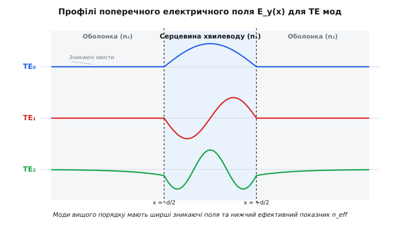
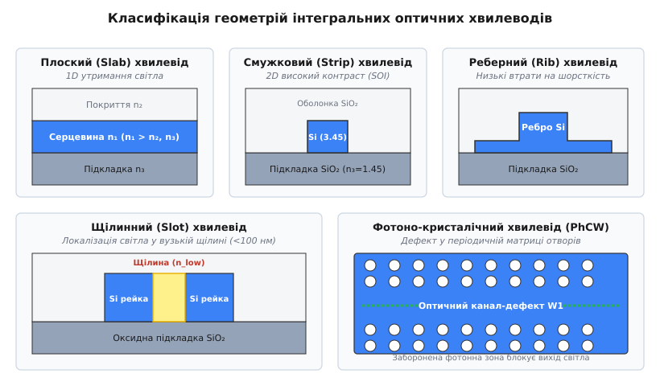
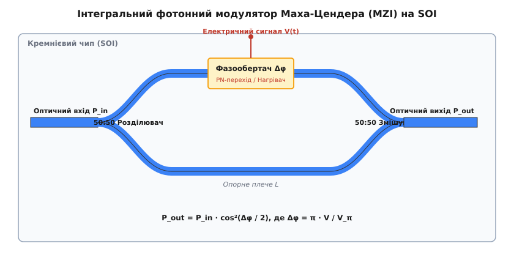

# Оптичні хвилеводи та інтегральна фотоніка

<preknowlist>
- [Закон Снелла](topic:physics/snells-law) — зв'язок кутів падіння та заломлення світла на межі двох оптичних середовищ.
- [Повне внутрішнє відбиття](topic:physics/total-internal-reflection) — утримання світлового випромінювання всередині оптично щільнішого середовища за пологого падіння.
- [Формули Френеля](topic:physics/fresnel-equations) — амплітуди відбитого та заломленого світла й фазові зсуви для різних поляризацій.
- [Зникаюча хвиля](topic:physics/evanescent-wave) — проникнення згасаючого електромагнітного поля за межу повного внутрішнього відбиття.
- [Поляризація світла](topic:physics/light-polarization) — поділ електромагнітних хвиль на поперечно-електричні (TE) та поперечно-магнітні (TM) моди.
- [Інтерферометр Маха-Цендера](topic:physics/mach-zehnder-interferometer) — розщеплення та інтерференційне змішування оптичних хвиль для амплітудної модуляції.
- [Ефект Поккельса](topic:physics/pockels-effect) — зміна показника заломлення кристала під дією зовнішнього електричного поля.
</preknowlist>

Спрямуйте відкритий лазерний промінь крізь повітряний простір — і через декілька сантиметрів дифракційна розбіжність неминуче розширить світлову пляму, а будь-яка пилинка чи теплова турбулентність створить оптичні спотворення та розсіювання потужності. Дискретна оптика з дзеркал та скляних лінз, зафіксованих у механічних оправах, швидко досягає фізичної межі: найменша вібрація підлоги або температурне розширення металу на частку мікрометра виводить оптичні резонатори з ладу. Щоб змусити світло поширюватися всередині твердотільного мікрочіпа з мікроскопічним радіусом вигину й обробляти терабітні потоки даних без інженерного юстування, оптичні канали інтегрують у планарні діелектричні хвилеводи. На цій концепції утримання електромагнітних хвиль у мікроскопічних діелектричних жилах тримається інтегральна фотоніка — техніка формування оптичних мікросхем на єдиному кристалі.

---

### 1. Фізика пастки: від об'ємного променя до планарного хвилеводу

Найпростішою конструкцією оптичного хвилеводу є **плоский (планарний) хвилевід** (*slab waveguide*). Він складається з центрального діелектричного шару (серцевини) товщиною `d` з показником заломлення `n₁`, нанесеного на підкладку з показником `n₃` та вкритого верхнім захисним шаром (оболонкою) з показником `n₂`. Основна фізична вимога існування хвилеводу — показник заломлення серцевини має перевищувати показники обох суміжних середовищ: `n₁ > n₂ ≥ n₃`.

Променева картина поширення світла базується на явищі **повного внутрішнього відбиття** (*Total Internal Reflection*, TIR). Якщо промінь падає на межу розділу серцевина–оболонка під кутом `θ` до нормалі, що перевищує критичний кут `θ_c = arcsin(n₂ / n₁)`, світло не виходить у зовнішній простір, а повністю повертається у серцевину. Зазнаючи послідовних звивистих відбиттів від верхньої та нижньої меж, промінь затискається всередині тонкої скляної або кремнієвої плівки й рухається уздовж хвилеводу.

Однак геометро-оптична модель зигзагоподібних променів є неповною. Оскільки товщина серцевини `d` сумірніша з довжиною хвилі світла `λ₀`, світло проявляє свої фундаментальні хвильові властивості. За кожного відбиття хвиля зазнає фазового зсуву `2φ_r`, який залежить від поляризації світла та кута падіння відповідно до формул Френеля.

Фізична причина цього фазового зсуву криється у виникненні **зникаючої хвилі** в оболонці. Світло не відбивається від математичної площини межі миттєво: воно формує поверхневе поле, яке проникає в оптично менш щільне середовище на глибину `δ_ev` і супроводжується боковим зсувом променя вздовж межі — ефектом Гуса-Хенхен (*Goos-Hänchen shift*).

Щоб хвиля могла стабільно поширюватися вздовж хвилеводу, вона повинна інтерферувати само узгоджено сама із собою. Це означає, що повний набіг фази хвилі при подвійному проходженні товщини хвилеводу туди й назад (від нижньої межі до верхньої та назад до нижньої) має бути строго кратним `2π`:

```
2 · k₀ · n₁ · d · cos θ − 2 · φ_r12 − 2 · φ_r13 = 2 · m · π
```

де `k₀ = 2π / λ₀` — вакуумне хвильове число, `m = 0, 1, 2, ...` — ціле число (порядок моди), а `2φ_r12` та `2φ_r13` — фазові зсуви при відбитті від верхньої та нижньої меж відповідно.

З цієї умови поперечного резонансу випливає фундаментальний висновок: **кути поширення світла у хвилеводі не є довільними**. Всередині хвилеводу можуть існувати лише дискретні світлові хвилі з конкретними кутами падіння `θ_m`. Кожному такому дозволеному куту `θ_m` відповідає власна просторова конфігурація полів, яка називається **хвильоводною модою** (*guided mode*). 

Якщо кут падіння променя не задовольняє умові резонансу, хвилі при багаторазових відбиттях погашають одна одну внаслідок деструктивної інтерференції, і світловий потік швидким випромінюванням згасає вже на перших мікронах траси.

Історію того, як людство пройшло шлях від експериментів із світловодними водяними струменями у XIX столітті до створення сучасних планарних фотонних схем, висвітлено у вставці [Історія інтегральної фотоніки та планарних хвилеводів](topic:physics/optical-waveguide/hist-photonic-integration.md).

---

### 2. Модовий склад та хвильові рівняння TE і TM хвиль

Для строгого описів хвильових явищ використовується скалярне рівняння Гельмгольца, отримане з векторних рівнянь Максвелла. Якщо вісь `z` спрямована уздовж напрямку поширення світла, а вісь `x` — перпендикулярно до планарних шарів, то електромагнітне поле хвилеводу розпадається на дві ортогональні поляризації:

1. **TE-моди (Transverse Electric / Поперечно-електричні)**:
   Вектор напруженості електричного поля орієнтований уздовж осі `y` (`E_y ≠ 0`), а магнітне поле має поперечну `H_x` та поздовжню `H_z` компоненти.
2. **TM-моди (Transverse Magnetic / Поперечно-магнітні)**:
   Вектор напруженості магнітного поля орієнтований уздовж осі `y` (`H_y ≠ 0`), а електричне поле має компоненти `E_x` та `E_z`.

Всередині серцевини (`|x| ≤ d/2`) амплітуда електричного поля `E_y(x)` описується стоячою гармонічною хвилею (косинусом для парних мод або синусом для непарних мод) із поперечним хвильовим числом `h = √(k₀² · n₁² − β²)`. В оболонках (`|x| > d/2`) полі не обривається раптово, а проникає на певну глибину у вигляді зникаючої хвилі, амплітуда якої спадає за експоненційним законом із коефіцієнтом згасання `q = √(β² − k₀² · n₂²)`.


*Профілі поперечного електричного поля E_y(x) для фундаментальної TE₀, непарної TE₁ та вищої TE₂ мод у симетричному планарному хвилеводі. У серцевині n₁ поле осцилює, а в оболонці n₂ спадає експоненційно у вигляді зникаючих хвостів.*

Глибина Penetration зникаючого поля `δ_ev` визначається як відстань, на якій амплітуда поля спадає у `e ≈ 2.718` рази:

```
δ_ev = 1 / q = 1 / √(β² − k₀² · n₂²) = λ₀ / (2π · √(n_eff² − n₂²))
```

Для вищих мод (наприклад, `TE₂` на малюнку) значення `n_eff` є нижчим і ближчим до показника оболонки `n₂`. Отже, що вищий порядок моди, то повільніше спадає її зникаючий хвіст, і то глибше поле проникає у навколишню оболонку.

Кожна мода поширюється уздовж осі `z` із власним фазовим множником `exp(−i · β · z)`, де `β` — поздовжня стала поширення. Відношення `n_eff = β / k₀` називається **ефективним показником заломлення моди**. Величина `n_eff` є ключовою характеристикою моди: вона лежить строго між показником оболонки та серцевини:

```
n₂ ≤ n_eff ≤ n₁
```

Для порівняння хвилеводів різного розміру та матеріалів використовують безрозмірну **нормовану частоту (V-число)**:

```
V = k₀ · d · √(n₁² − n₂²) = (2π / λ₀) · d · NA
```

де `NA = √(n₁² − n₂²)` — числова апертура хвилеводної структури.

Кількість мод, яку здатен утримувати симетричний планарний хвилевід, визначається величиною `V`-числа. Для того щоб хвилевід працював у **суворо одномодовому режимі** за поляризацією TE (тобто утримував лише фундаментальну моду `TE₀`), вимагається виконання умови:

```
V < π  ⇒  d < λ₀ / (2 · √(n₁² − n₂²))
```

Подробні виведення трансцендентних дисперсійних рівнянь та умов відсічки мод наведено у вставці [Математика планарних хвилеводів: дисперсійні рівняння TE та TM мод](topic:physics/optical-waveguide/math-planar-waveguide-modes.md).

> 🔧 **Навіщо це.** Одномодовий режим є фундаментальною вимогою для більшості фотонних мікросхем. У багатомодовому хвилеводі кожен світловий імпульс розпадається на кілька мод, які рухаються з різними фазовими швидкостями `c / n_eff`. Це викликає міжмодову дисперсію та спотворення сигналів. Зменшуючи товщину кремнієвої серцевини до `220 нм` на довжині хвилі `1550 нм`, інженери гарантують збереження цілісності високоефективних цифрових сигналів.

Практичний чисельний розрахунок ефективних показників заломлення `n_eff` та профілів полів мовами C та C++ подано у вставці [Чисельний розрахунок мод планарного хвилеводу](topic:physics/optical-waveguide/proj-waveguide-mode-solver.md).

---

### 3. Конфігурації 3D канальних хвилеводів

Планарний хвилевід обмежує поширення світла лише за однією координатою `x`. У реальних фотонних інтегральних схемах світловий промінь необхідно спрямовувати складними звивистими траєкторіями на площині кристала. Для цього використовують **трьохвимірні (канальні) хвилеводи**, які забезпечують двовимірне утримання світлового поля як за вертикальною координатою `x`, так і за горизонтальною координатою `y`.


*Конструктивні геометрії канальних хвилеводів: 1) Плоский (Slab) 1D хвилевід; 2) Смужковий (Strip) хвилевід високого контрасту; 3) Реберний (Rib) хвилевід з низькими втратами; 4) Щілинний (Slot) хвилевід з локалізацією поля у вузькому зазорі; 5) Фотоно-кристалічний хвилевід (PhCW) із лінійним дефектом W1.*

Розглянемо п'ять основних архітектурних конфігурацій інтегральних хвилеводів:

#### 1. Смужковий хвилевід (Strip / Wire Waveguide)
Смужковий хвилевід являє собою прямокутний брусок із високим показником заломлення (`n₁`), повністю оточений оксидною або повітряною оболонкою (`n₂`). 

У популярній технологічній платформі **кремній на ізоляторі** (*Silicon-on-Insulator*, SOI) кремнієва смужка має перетин всього `450 × 220 нм`. Завдяки велетенському контрасту показників заломлення (`Δn = n_Si − n_SiO2 ≈ 3.45 − 1.45 = 2.0`) світлове поле дуже сильно стискається всередині нанометрового каналу. Це дозволяє здійснювати вигини оптичних трас із радіусом всього `2–5 мкм` без випромінювальних втрат на поворотах, забезпечуючи високу щільність упакування компонентів на чипі.

#### 2. Реберний хвилевід (Rib / Ridge Waveguide)
У реберному хвилеводі центральне прямокутне ребро витравлюється не на всю глибину, а залишає тонкий бічний п'єдестал (слєб) товщиною `h_slab`. 

Завдяки такій геометрії електромагнітна хвиля локалізується під центральним ребром, але її зникаючі поля лишь слабко торкаються травлених вертикальних стінок. Це дозволяє суттєво зменшить втрати на розсіювання світла (до `0.2–0.5 дБ/см`), які виникають через нанометрові шорсткості стінок після реактивно-іонного травлення. Крім того, бічний кремнієвий п'єдестал зручно легувати домішками для підведення електричних контактів p-n переходів високошвидкісних модуляторів.

#### 3. Щілинний хвилевід (Slot Waveguide)
Щілинний хвилевід складається з двох паралельних високоефективних кремнієвих рейок, розділених надвузьким зазором (щілиною) шириною `w_slot < 100 нм`, заповненим матеріалом із низьким показником заломлення `n_slot` (повітрям, оксидом або полімером).

З граничних умов Максвелла випливає, що нормальна компонента вектора електричного зсуву `D_x` є неперервною на межі розділу: `n_core² · E_core = n_slot² · E_slot`. Через це на межі кремній–повітря виникає гігантський стрибок напруженості електричного поля: `E_slot = E_core · (n_core / n_slot)²`. У результаті до 70% оптичної енергії хвилі витісняється з високоефективного кремнію та локалізується у вузькому повітряному зазорі. Це явище активно застосовується у нанофотонних біосенсорах для виявлення одиночних молекул та в електрооптичних модуляторах із нелінійними полімерами.

#### 4. Фотоно-кристалічний хвилевід (Photonic Crystal Waveguide, PhCW)
Фотоно-кристалічний хвилевід формується у тонкій кремнієвій мембрані, у якій методом електронної літографії витравлено періодичну матрицю круглих отворів. Така двовимірна періодична структура створює **фотонну заборонену зону** (*Photonic Bandgap*) — діапазон частот, у якому світло категорично не може поширюватися всередині кристала у жодному напрямку.

Якщо вилучити один ряд отворів (утворити лінійний дефект W1), світло виявиться запертим усередині цього каналу: воно не може витікати вбік через фотонну заборонену зону. Головна перевага PhCW — можливість реалізації ефекту **повільного світла** (*slow light*). Групова швидкість світла `v_g = c / n_g` у такому хвилеводі може бути зменшена у 20–100 разів, що пропорційно підсилює оптичну взаємодію світла з речовиною.

Повний інженерний довідник геометрій, розмірів та матеріальних платформ наведено у вставці [Специфікація параметрів та геометрії хвилеводів](topic:physics/optical-waveguide/api-waveguide-design.md).

---

### 4. Сполучення світла: введення випромінювання у нанометрову серцевину

Однією з найскладніших практичних проблем інтегральної фотоніки є задача ефективного введення світла з зовнішнього оптичного волокна у нанофотонний хвилевід на чипі. 

Діаметр моди стандартного одномодового волокна SMF-28 становить `MFD ≈ 10.4 мкм`, тоді як розмір поперечного перетину кремнієвого смужкового хвилеводу становить всього `0.45 × 0.22 мкм`. Безпосереднє стикування призводить до велетенської невідповідності модових об'ємів і втрат понад `20 дБ` (99% потужності світла просто розсіюється на тоці чипа).

Для подолання цієї проблеми використовують три основні методи сполучення:

```
[Оптичне волокно] ──(MFD ~ 10 мкм)──> [Вузли сполучення] ──(Мода ~ 0.5 мкм)──> [Чип SOI]
                                           │
                     ┌─────────────────────┴─────────────────────┐
                     ▼                                           ▼
         [Торцевий інверсний тейпер]                [Поверхнева ґратка Брегга]
         • Широкосмуговий (>300 нм)                 • Тестування на пластині
         • Втрати: 0.5–1.5 дБ/стик                 • Втрати: 1.5–3.0 дБ/стик
```

1. **Торцевий інверсний тейпер (Spot-Size Converter, SSC)**:
   На краю кремнієвого чипа ширина хвилеводної серцевини плавно звужується від `450 нм` до наноконуса товщиною всього `80–100 нм`. Через надто тонку серцевину світлова хвиля перестає утримуватися кремнієм і витікає в об'ємну оксидну або полімерну оболонку, розширюючись до плями діаметром `3–5 мкм`, яка ідеально стикується з профільованим волокном. Торцеве сполучення забезпечує низькі втрати (`0.5–1.5 дБ/стик`) та надшироку спектральну смугу (понад `300 нм`).

2. **Поверхневий решітчастий ввідник (Grating Coupler)**:
   На поверхні кремнієвого хвилеводу витравлюється періодична дифракційна ґратка з періодом `Λ ≈ 600 нм`. Оптичне волокно підводиться зверху до поверхні чипа під кутом `8–10°` до вертикалі. Дифракційна ґратка забезпечує фазове узгодження та повертає вертикально падаючий пучок світла, спрямовуючи його у планарну моду хвилеводу. 
   Головна перевага решітчастих ввідників — можливість здійснювати автоматизоване тестування фотонних схем прямо на нерозрізаній 300-мм кремнієвій пластині (*wafer-scale testing*) під час фаб-виробництва.

3. **Призмовий ввідник**:
   Застосовується переважно у лабораторних дослідженнях планарних плівок. Призма з високим показником заломлення притискається до хвилеводу з субмікронним повітряним зазором. Світло, падаючи всередині призми під кутом повного внутрішнього відбиття, утворює зникаюче поле, яке тунелює крізь зазор у планарну серцевину за умови рівності поздовжніх сталих поширення.

---

### 5. Елементна база інтегральних фотонних схем (PIC)

Об'єднання планарних хвилеводів на одном кристалі дозволяє створювати складні оптичні мікросхеми обробки сигналів. 

#### 1. Спрямований розгалужувач (Directional Coupler)
Коли два планарні хвилеводи розташовуються паралельно один до одного на субмікронній відстані `g < 300 нм`, їхні зникаючі поля в оболонці перекриваються. Відбувається перекачування оптичної енергії з одного каналу в інший відповідно до **теорії зв'язаних мод**.

Повна передача потужності з першого хвилеводу в другий відбувається на так званій **довжині зв'язку** `L_c`:

```
L_c = π / (2 · κ)
```

де `κ` — коефіцієнт зв'язку між хвилеводами. Змінюючи довжину взаємодії `L`, інженери створюють точні оптичні розгалужувачі потужності 50:50 (3-дБ розгалужувачі) або оптичні перемикачі.

З точки зору супермодового аналізу, два зв'язаних хвилеводи утворюють дві симетричні та антисиметричні супермоди з різними фазовими швидкостями `β_even` та `β_odd`. Коефіцієнт зв'язку визначається через різницю їхніх сталих поширення: `κ = (β_even − β_odd) / 2`.

#### 2. Інтегральний модулятор Маха-Цендера (MZI)
Для кодування електричних сигналів у світловий потік використовується інтерферометр Маха-Цендера, сформований із кремнієвих хвилеводів.


*Схема інтегрального модулятора Маха-Цендера на кремнієвому чипі (SOI). Вхідний промінь ділиться навпіл 50:50 розділювачем. У верхньому плечі p-n перехід під дією напруги V(t) змінює фазу світла Δφ. На вихідному змішувачі хвилі інтерферують конструктивно або деструктивно.*

Вхідний оптичний потік ділиться порівну між двома плечима інтерферометра. В одному з плечей створюється активний фазообертач — ділянка хвилеводу з інтегрованим p-n переходом або мікронагрівачем. 

Під дією керуючої напруги `V(t)` змінюється концентрація вільних носіїв у кремнії (плазмово-оптичний ефект) або температура хвилеводу (термооптичний ефект), що змінює ефективний показник заломлення `n_eff` і створює керований фазовий зсув `Δφ`. При повторному зведенні мод на вихідному змішувачі хвилі інтерферують:
* Якщо `Δφ = 0`, хвилі додаються в фазі — на виході максимум потужності (стан «1»).
* Якщо `Δφ = π`, хвилі перебувають у протифазі — відбуваються деструктивна інтерференція й випромінювання енергії в підкладку (стан «0»).

Вихідна потужність описується рівнянням:
```
P_out = P_in · cos²(Δφ / 2)
```

Напруга `V_π`, необхідна для зсуву фази на `π` радіан, є головною характеристикою ефективності модулятора.

#### 3. Кільцеві мікрорезонатори (Micro-ring Resonators, MRR)
Кільцевий резонатор складається з замкненого кільцевого хвилеводу радіуса `R`, розташованого поруч із прямим шинним хвилеводом. 

Коли довжина кола кільця є строго кратною довжині хвилі світла у хвилеводі, виникає оптичний резонанс:

```
2 · π · R · n_eff = m · λ₀
```

На резонансних довжинах хвиль світло з прямого хвилевода через зникаюче поле повністю затягується у кільце й згасає в ньому за рахунок внутрішніх втрат. Кільцеві резонатори володіють надвисокою добротністю (`Q > 10⁵`) та ультрамалими габаритами (діаметр `10–20 мкм`), що робить їх ідеальними вузькосмуговими оптичними фільтрами, компактними модуляторами та датчиками температури.

Відстань між сусідніми резонансними піками називається **вільним спектральним інтервалом** (*Free Spectral Range*, FSR):

```
FSR = λ₀² / (2 · π · R · n_g)
```

де `n_g = n_eff − λ₀ · (dn_eff / dλ₀)` — груповий показник заломлення хвилеводу.

> 🔧 **Навіщо це.** Кільцеві резонатори дозволяють реалізувати мультиплексування за довжинами хвиль (WDM) прямо на чипі. Наприклад, в одному кремнієвому хвилеводі можна одночасно передавати 64 різні довжини хвиль. Каскад із 64 кільцевих резонаторів різного радіуса здатний вибірково відфільтрувати й спрямувати кожну довжину хвилі на свій власний фотодетектор, збільшуючи пропускну здатність оптичного чипа до петабіт на секунду.

#### 4. Масивовані хвилеводні ґратки (Arrayed Waveguide Gratings, AWG)
Пристрій AWG складається з вхідного й вихідного вільних просторів поширення (FPR) та масиву паралельних оптичних хвилеводів різної довжини, що з'єднують їх. Сусідні хвилеводи у масиві мають фіксовану різницю довжин `ΔL`. 

Внаслідок цієї різниці ходу виникає кутова дисперсія, аналогична класичній дифракційній ґратці, що дозволяє поділяти оптичний сигнал широкого спектра на десятки окремих вузькосмугових каналів (демультиплексування WDM) з кроком `0.8 нм` (100 ГГц).

---

### 6. Матеріальні платформи та практичні обмеження втрат

У сучасній мікроелектроніці та фотоніці використовують п'ять основних матеріальних систем для створення інтегральних хвилеводів:

| Платформа | Показник `n_core` | Втрати (дБ/см) | Мін. радіус `R` | Головне застосування |
| :--- | :--- | :--- | :--- | :--- |
| **Кремній на ізоляторі (SOI)** | `3.45` | `1.5 – 2.5` | `5 мкм` | Приймачі трансиверів центрів обробки даних (ЦОД), процесори |
| **Нітрид кремнію (Si₃N₄)** | `1.98` | `0.01 – 0.1` | `50 мкм` | Нелінійна фотоніка, квантові обчислення, лідари |
| **Фосфід індію (InP)** | `3.17 – 3.45` | `1.0 – 3.0` | `200 мкм` | Монолітні напівпровідникові лазери та оптичні підсилювачі (SOA) |
| **Тонкоплівковий ніобій літію (LNOI)** | `2.21` | `0.03 – 0.1` | `30 мкм` | Надшвидкісні модулятори (понад 100 ГГц) |
| **Кварц на кремнії (PLC)** | `1.46 – 1.48` | `< 0.01` | `10 мм` | Пасивні WDM-демультиплексори та розгалужувачі 1×N |

#### Основні фізичні механізми втрат у хвилеводах:
1. **Розсіювання на шорсткостях стінок** (*Sidewall Roughness Scattering*): Виникає через нанометрові нерівності фланців хвилеводу після літографії та травлення. Втрати пропорційні квадрату висоти шорсткості `σ²` та кубу контрасту `Δn³`.
2. **Поглинання вільними носіями** (*Free Carrier Absorption, FCA*): Виникає при легуванні напівпровідника або при фотогенерації носіїв за високих потужностей.
3. **Випромінювання на вигинах** (*Bend Radiation Loss*): Виникає, коли фазова швидкість зникаючого хвоста моди в оболонці на зовнішньому радіусі вигину має перевищити швидкість світла в матеріалі оболонки `c / n₂`. У результаті зовнішній хвіст хвилі відривається й випромінюється у підкладку.

Розвиток інтегральної фотоніки рухається в напрямку **ко-пакованої оптики** (*Co-Packaged Optics*, CPO), де оптичні фотонні мікросхеми монтуються на одну загальну кремнієву підкладку (interposer) поруч із потужними графічними процесорами (GPU) штучного інтелекту. Це дозволяє замінити мідні електричні лінії між процесорами на оптичні планарні хвилеводи, зменшуючи енергоспоживання обчислювальних центрів у десятки разів.
