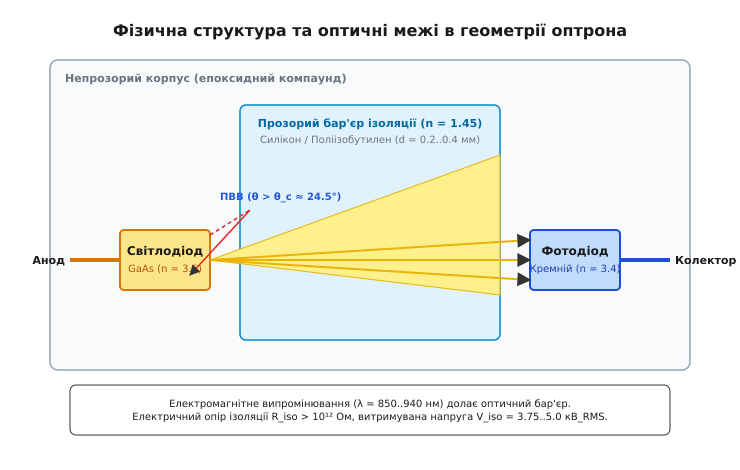
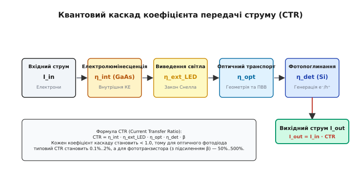
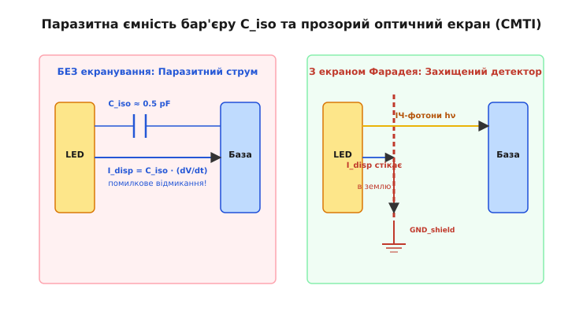

# Фізика оптрона

<preknowlist>
- [Закон Снелла](topic:physics/snells-law) — зв'язок кутів падіння та заломлення світла на межі середовищ.
- [Рівняння Френеля](topic:physics/fresnel-equations) — коефіцієнти відбиття та пропускання електромагнітної хвилі.
- [Повне внутрішнє відбиття](topic:physics/total-internal-reflection) — умова утримання світлового потоку в середовищі з вищим показником заломлення.
- [Квантова ефективність фотодетектора](topic:physics/quantum-efficiency) — ймовірність генерації носіїв заряду при поглинанні фотонів.
- [PN-перехід](topic:physics/pn-junction) — зонна структура, бар'єр просторового заряду та електролюмінесценція.
- [Пробій діелектрика](topic:physics/electricity/dielectric-breakdown) — гранична напруженість електричного поля та механізми витоку.
</preknowlist>

Коли у силовому трифазному інверторі керування тяговим двигуном електромобіля ситальний ключ на основі карбіду кремнію (SiC MOSFET) комутує струм 300 ампер при напрузі 800 вольт за 15 наносекунд, напруженість поля та швидкість зміни потенціалу досягають `dV/dt = 53 кВ/мкс`. Утворена імпульсна високовольтна завада шукає шлях повернення через паразитні ємності й заземлення. За наявності прямого електричного зв'язку між силовим каскадом та керуючим 3.3-вольтовим мікроконтролером цей імпульс миттєво пробиває підзатворний оксид логічних вентилів CMOS, виводячи з ладу систему автоматики. Оптрон вирішує цю фундаментальну суперечність, повністю розриваючи контур електричної провідності й замінюючи переносників заряду (електрони) на електромагнітні кванти (фотони), які долають оптично прозорий, але електрично непровідний діелектричний бар'єр.

Оптрон (або оптичний ізолятор) — це прилад, який забезпечує передачу сигналу між двома гальванічно розділеними електричними колами за допомогою послідовного перетворення «електричний струм → фотонний потік → електричний струм».

> 🔧 **Навіщо це.**
> Розуміння фізики оптрона необхідне для проективання високовольтних джерел живлення, перетворювачів відновлюваної енергії (сонячних та вітрових інверторів), систем управління двигунами електромобілів, медичного обладнання із захистом пацієнта (IEC 60601) та промислових шин даних (RS-485, CAN, Ethernet). Фізичний аналіз оптичного каналу дозволяє розраховувати стабільність передачі даних, термодеградацію, стійкість до високочастотних синфазних завад (CMTI) та термін служби ізоляції.

## Етимологія та фізична сутність оптичної розв'язки

Термін **оптрон** виник як скорочення від сполучення *оптоелектронний прилад*. Слово **оптика** походить від давньогрецького *optikos* (ὀπτικός) — «зоровий», «пов'язаний зі баченням», що сягає корінням *ops* (ὄψ) — «око».

Поняття **гальванічна ізоляція** вшановує італійського фізика та анатома Луїджі Гальвані (Luigi Galvani). У контексті електротехніки «гальванічний зв'язок» означає наявність прямого електричного контакту між провідниками, у якому вільні носії заряду (електрони або іони) можуть вільно мігрувати під дією різниці потенціалів. Відповідно, гальванічна ізоляція означає відсутність такого шляху провідності: постійний опір між вхідною та вихідною землями становить `R_ISO > 10¹² Ом`.

Слово **фотон** запропонував фізико-хімік Гілберт Льюїс у 1926 році від грецького *phōs* (φῶς) — «світло». У фізиці оптрона фотон виступає незарядженим квантом електромагнітного поля із енергією:

```
E_p = h · ν = h · c / λ
```

Оскільки фотон є нейтральною частинкою з нульовим електричним зарядом, на його траєкторію поширення всередині діелектрика не впливають постійні електричні поля та різниці потенціалів у тисячі вольт між вхідним і вихідним виводами. Це робить світловий промінь ідеальним переносником інформації крізь високовольтну ізоляційну стіну.

## Анатомія оптичного каналу та квантовий каскад перетворення

Будь-який оптрон являє собою замкнену оптико-електронну систему, що складається з трьох послідовних фізичних компонентів, розташованих у єдиному непрозорому корпусі:
1. **Випромінювач (LED)**: Напівпровідниковий кристал прямозонного матеріалу (арсенід галію `GaAs` або арсенід алюмінію-галію `AlGaAs`), який перетворює електричний струм накачки `I_F` на інфрачервоні фотони за допомогою ефекту інжекційної електролюмінесценції.
2. **Прозорий діелектричний бар'єр**: Шар оптичного матеріалу (силіконовий гель, епоксидна смола або поліімідна плівка), який має високу оптичну прозорість для інфрачервоного світла (`λ = 850–940 нм`), але фундаментально високу електричну міцність пробою (`E_breakdown = 15–30 кВ/мм`).
3. **Фотодетектор**: Кремнієвий кристал (p-n фотодіод, фототранзистор або фототиристор), у збедненій зоні якого поглинуті фотони генерують електронно-діркові пари завдяки внутрішньому фотоефекту.


*Рис. 1: Фізична геометрія оптрона: випромінювальний кристал GaAs, прозорий ізоляційний силіконовий бар'єр та кремнієвий фотодетектор у непрозорому компаунді.*

Формування вихідного струму детектора `I_out` із вхідного струму світлодіода `I_in` виражається через коефіцієнт передачі струму (Current Transfer Ratio, CTR):

```
CTR = (I_out / I_in) · 100%
```

З фізичної точки зору CTR не є єдиною константою матеріалу, а являє собою добуток п'яти послідовних коефіцієнтів квантової та оптичної ефективності кожного з етапів перетворення.


*Рис. 2: Послідовність п'яти квантових та оптичних коефіцієнтів корисної дії, що визначають підсумковий коефіцієнт передачі струму CTR.*

Розглянемо кожну ланку цього квантового каскаду:

```
CTR = η_int · η_ext_LED · η_opt · η_det · β
```

1. **Внутрішня квантова ефективність випромінювача (`η_int`)**: Відношення кількості згенерованих у кристалі фотонів до кількості інжектованих електронів. У якісних гетероструктурах `AlGaAs/GaAs` при кімнатній температурі `η_int` досягає `60–80%`.
2. **Зовнішній коефіцієнт виведення світла з кристала (`η_ext_LED`)**: Частка фотонів, які долають межу напівпровідник-діелектрик і виходять за межі кристала випромінювача, не зазнаючи повного внутрішнього відбиття. Через високий показник заломлення арсеніду галію (`n = 3.5`) плоский кристал без текстурування випускає назовні лише близько `3–4%` згенерованого світла.
3. **Геометрична ефективність оптичного транспорту (`η_opt`)**: Частка випромінених світлодіодом фотонів, яка долає товщу діелектричного бар'єра та потрапляє на світлочутливу площу фотодетектора. Залежить від відстані між кристалами `d`, коефіцієнта відбиття внутрішніх стінок білого корпуса та прозорості середовища (`η_opt ≈ 70–80%`).
4. **Квантова ефективність фотодетектора (`η_det`)**: Ймовірність того, що фотон, який впав на поверхню кремнієвого фотодіода, додолає антивідбивне покриття, поглинеться у збедненій зоні p-n переходу й створить розділену електронно-діркову пару (`η_det ≈ 70–85%`).
5. **Коефіцієнт підсилення за струмом (`β`)**: Електричне підсилення фотодетектора. Для первинного фотодіода `β = 1`. Для фототранзистора вигенерований первинний фотострум спрямовується у базовий перехід, де підсилюється у `β = 50–500` разів.

Про історичні передумови створення перших твердотільних оптронів, еволюцію матеріалів від неон-резистивних пар до прямозонних гетероструктур розповідається у матеріалі [📜 Історія виникнення фотоелектричної розв'язки та створення перших оптронів](topic:physics/optocoupler-physics/hist-optocoupler-discovery.md).

Строгий математичний виведення кута виходу з кристала та аналітичний розрахунок складових CTR наведено у [🧮 Виведення квантового коефіцієнта передачі струму (CTR)](topic:physics/optocoupler-physics/math-optocoupler-ctr-derivation.md).

## Фізика електролюмінесценції у прямозонних напівпровідниках

Генерація фотонів у світлодіоді оптрона базується на явищі інжекційної електролюмінесценції в прямозонному p-n переході. При подачі прямого зсуву `V_F > E_g / e` потенціальний бар'єр збедненої зони знижується, і електрони з n-області інжектуються у p-область, де стають неосновними носіями.

У прямозонних напівпровідниках, таких як `GaAs` чи `AlGaAs`, мінімум зони провідності та максимум валентної зони розташовані при однаковому квазіімпульсі електрона (`k = 0`). Завдяки цьому міжзонний перехід електрона з зони провідності у валентну зону з анігіляцією дірки відбувається як прямий двочастинковий процес `e⁻ + h⁺ → h·ν` із високою ймовірністю.

Швидкість випромінювальної рекомбінації `R_rad` пропорційна добутку концентрацій вільних електронів `n` та дірок `p`:

```
R_rad = B · n · p
```

де `B` — коефіцієнт міжзонної випромінювальної рекомбінації (для `GaAs` значення `B ≈ 7.2 · 10⁻¹⁰ см³/с`).

Окрім випромінювального каналу, у кристалі діють два конкурентні безипромінювальні механізми рекомбінації:
1. **Рекомбінація Шокли — Рида — Холла (SRH)**: Рекомбінація носіїв через глибокі дефекти та примесні рівні у забороненій зоні з передачею енергії коливанням кристалічної ґратки (фононам). Швидкість `R_SRH` залежить від чистоти матеріалу та щільності дислокацій.
2. **Оже-рекомбінація (Auger)**: Тричастинковий процес, у якому енергія рекомбінації електронно-діркової пари передається третьому вільному електрону чи дірці у вигляді кінетичної енергії. Швидкість `R_Auger = C_Auger · n³` зростає кубічно з концентрацією носіїв і проявляється при високих струмах накачки.

Внутрішня квантова ефективність випромінювача `η_int` визначається відношенням швидкості випромінювальної рекомбінації до суми усіх каналів:

```
η_int = R_rad / (R_rad + R_SRH + R_Auger)
```

При малих струмах накачки домінує безипромінювальна рекомбінація SRH на дефектах, що викликає падіння `η_int`. При дуже великих струмах домінує Оже-рекомбінація. Тому внутрішня квантова ефективність досягає максимуму у вузькому оптимальному діапазоні густини струму `J = 10–50 А/см²`.

Ширина забороненої зони арсеніду галію залежить від температури за законом Варшні:

```
E_g(T) = E_g(0) - (α_V · T²) / (T + β_V)
```

При нагріванні кристала ширина забороненої зони `E_g` звужується, що викликає зміщення спектра випромінювання у довгохвильову інфрачервону область з коефіцієнтом `dλ_peak / dT ≈ +0.25 нм/°C`.

Спектральний розподіл емісії прямозонного гетеропереходу описується виразом:

```
I(h·ν) ~ (h·ν - E_g)^(1/2) · exp(-(h·ν - E_g) / (k_B · T))
```

Максимум інтенсивності припадає на фотони з енергією `h·ν_peak = E_g + (1/2) · k_B · T`, а ширина спектра на піввисоті (FWHM) становить близько `1.8 · k_B · T ≈ 45 меВ` (що відповідає `Δλ ≈ 35 нм` на довжині хвилі 870 нм).

## Оптична геометрія: виведення світла, заломлення та ПВВ на межах

Найвужчим місцем з точки зору оптичних втрат є межа виходу світла з випромінювального кристала `GaAs` у прозорий ізоляційний бар'єр.

Показник заломлення арсеніду галію на довжині хвилі `λ = 870 нм` є фундаментально високим і становить `n_semi = 3.50`. Показник заломлення оптичного силіконового гелю або епоксиду дорівнює `n_barrier ≈ 1.45`.

При переході електромагнітної хвилі з оптично більш плотного середовища у менш плотне нахил променів підпорядковується закону заломлення Снелла:

```
n_semi · sin(θ_1) = n_barrier · sin(θ_2)
```

де `θ_1` — кут падіння променя на внутрішню грань кристала, `θ_2` — кут заломлення у силіконі.

Коли кут заломлення досягає `θ_2 = 90°`, промінь ковзає уздовж межі розділу. Відповідний кут падіння є **граничним критичним кутом повного внутрішнього відбиття (ПВВ)** `θ_c`:

```
sin(θ_c) = n_barrier / n_semi
```

Обчислимо критичний кут для межі `GaAs` — силікон:

```
sin(θ_c) = 1.45 / 3.50 = 0.4143
θ_c = arcsin(0.4143) ≈ 24.47°
```

Усі фотони, які падають на плоску поверхню кристала під кутами `θ > 24.47°`, не можуть вийти назовні: вони зазнають 100% внутрішнього відбиття назад у напівпровідник, де послідовно поглинаються підкладкою з перетворенням енергії у теплові фонони.

Геометрично промені, здатні вийти назовні, формують конус виходу з тілесним кутом `Ω_cone`. Частка виведених фотонів від загального випромінювання плоского кристала визначається формулою:

```
η_cone = (1/2) · (1 - cos(θ_c)) ≈ (1/4) · (n_barrier / n_semi)²
```

Підставивши значення показників заломлення:

```
η_cone ≈ (1/4) · (1.45 / 3.50)² = 0.25 · (0.4143)² ≈ 0.0429 (4.29%)
```

Крім того, фотони, що потрапляють всередину конуса виходу, зазнають френелівського відбиття через неузгодженість хвильових опорів середовищ. Коефіцієнт відбиття Френеля при нормальному падінні (`θ = 0`):

```
R_Fresnel = ((n_semi - n_barrier) / (n_semi + n_barrier))²
= ((3.50 - 1.45) / (3.50 + 1.45))² = (2.05 / 4.95)² ≈ 0.1715 (17.15%)
```

Таким чином, підсумкова зовнішня ефективність виведення плоскої грані `η_ext_LED` становить:

```
η_ext_LED = η_cone · (1 - R_Fresnel) = 0.0429 · (1 - 0.1715) ≈ 0.0355 (3.55%)
```

Щоб подолати це критичне оптичне обмеження і підняти CTR, інженери застосовують три фізичні прийоми:
1. **Імерсійне узгодження показників заломлення**: Простір між кристалами заповнюють не повітрям (`n = 1.0`), а спеціальним високозаломлюючим силіконом (`n = 1.55`). Це розширює критичний кут Снеліуса з `16.6°` (у повітрі) до `26.3°`, збільшуючи світловиведення у 2.5 рази.
2. **Формування напівсферичного купола (Doming)**: Кристал світлодіода заливають краплею прозорого силікону у формі напівсфери. Більшість променів з центру кристала падають на зовнішню сферичну поверхню силікону під кутами, близькими до нормалі (`θ ≈ 0`), що усуває ПВВ на межі силікон-епоксид.
3. **Мікротекстурування поверхні (Surface Texturing)**: Створення мікроскопічних пірамід на поверхні `GaAs` за допомогою хімічного травлення. Фотон, що відбився під кутом ПВВ при першому ударі, змінює кут падіння при повторних відбиттях від похилих граней пірамід і врешті-решт знаходить вихід із кристала.

## Фізика фотопоглинання та генерація фотоструму в кремнії

Фотодетектор оптрона виготовляється на основі кремнію (`Si`), який має ширину забороненої зони `E_g = 1.12 еВ` при 300 К.

Енергія фотонів з випромінювача `GaAs` (`λ = 870 нм`) становить:

```
E_p = h · c / λ = 1240 нм·еВ / 870 нм = 1.425 еВ
```

Оскільки `E_p = 1.425 еВ > E_g = 1.12 еВ`, кожен поглинутий фотон має достатньо енергії, щоб перевести електрон із валентної зони кремнію у зону провідності, створюючи вільну електронно-діркову пару.

Згасання світлового потоку в товщі кремнію відбувається за законом Бера — Ламберта — Бугера:

```
I(x) = I_0 · (1 - R_Si) · exp(-α_Si · x)
```

де `x` — глибина проникнення світла у кристал, `α_Si` — коефіцієнт поглинання кремнію (для `λ = 850–870 нм` значення `α_Si ≈ 600 см⁻¹`), `R_Si` — коефіцієнт відбиття від поверхні кремнію.

Характерне відстань проникнення фотонів `δ_pen`, на якому інтенсивність випромінювання спадає в `e ≈ 2.718` разів:

```
δ_pen = 1 / α_Si = 1 / (600 см⁻¹) ≈ 16.7 мкм
```

Це число задає геометричні вимоги до конструкції p-n фотодіода:
- Якщо збеднена зона просторового заряду `W_dep` становить лише `2–3 мкм`, більшість фотонів поглинеться в глибині нейтрального p- або n-субстрату. Згенеровані носії будуть рухатися до переходу за рахунок повільної дифузії, що призведе до рекомбінації носіїв та падіння швидкодії (часи відгуку мікросекунди).
- Для створення швидкісних оптронів (до 50 МГц) використовують **PIN-фотодіоди** із високоомним нелегованим i-шаром (*intrinsic*) товщиною `W_dep ≈ 20–30 мкм`. Під дією зворотної напруги у збедненій зоні створюється високе електричне поле `E ~ 10⁴ В/см`. Інжектовані фотоелектрони та дірки рухаються не шляхом дифузії, а зі швидкістю насиченого дрейфу `v_sat ≈ 10⁷ см/с`. Час прольоту збедненої зони становить:

```
t_fly = W_dep / v_sat = 30 · 10⁻⁴ см / 10⁷ см/с = 300 пікосекунд
```

Рівняння неперервності для згенерованих носіїв у збедненій зоні фотодіода враховує як дрейфовий, так і дифузійний транспорти:

```
∂n/∂t = D_n · (∂²n/∂x²) + μ_n · E · (∂n/∂x) + G_opt - R_rec
```

де `G_opt = α_Si · Ф_p · exp(-α_Si · x)` — швидкість оптичної генерації електронно-діркових пар фотонним потоком `Ф_p`, `D_n` — коефіцієнт дифузії електронів, `μ_n` — дрейфова рухливість. Завдяки створенню сильного електричного поля `E` у PIN-структурі дрейфовий член `μ_n · E · (∂n/∂x)` переважає дифузійний на два порядки, що гарантує миттєвий збір фотоструму без запізнення.

У фототранзисторних оптронах фотодіод інтегровано безпосередньо у колекторно-базовий перехід n-p-n транзистора. Первинний фотострум `I_ph` інжектується у базу, викликаючи протікання колекторного струму `I_C = β · I_ph`. Однак ємність колекторного переходу `C_CB` підсилюється ефектом Міллера:

```
C_Miller = C_CB · (1 + A_v)
```

де `A_v` — коефіцієнт підсилення напруги вихідного каскаду. Ефект Міллера створює велику паразитної постійну часу `τ_Miller = R_L · C_Miller`, яка обмежує максимальну частоту роботи фототранзисторного оптрона рівнем `100–300 кГц`.

## Електромагнітна ізоляція, паразитна ємність та стійкість CMTI

Найважливішим показником якості оптрона силового застосування є його стійкість до швидкозмінних синфазних завад (Common-Mode Transient Immunity, CMTI).

Між вхідною металевою рамкою світлодіода та вихідною рамкою фотодетектора, розділеними шар діелектрика товщиною `d = 0.2–0.4 мм`, існує паразитна електрична ємність ізоляції `C_ISO`:

```
C_ISO = ε_0 · ε_r · A / d
```

де `A` — ефективна площа перекриття рамок, `ε_r` — відносна діелектрична проникність силікону/полііміду (`ε_r ≈ 2.8–3.5`). Для стандартних корпусів DIP-6 та SO-8 значення ємності становить `C_ISO = 0.2–1.0 пФ`.


*Рис. 3: Фізичний механізм виникнення паразитного струму зміщення через ємність C_iso та його шунтування прозорим екраном Фарадея.*

Коли між вхідною та вихідною землями виникає скачок напруги з високою швидкістю наростання `dV/dt` (наприклад, при комутації силового інвертора), крізь паразитну ємність `C_ISO` протікає емкостійний **струм зміщення (Displacement Current)**, що описується фундаментальним рівнянням Максвелла:

```
I_disp = C_ISO · (dV/dt)
```

Проведем числову оцінку. При параметрах `C_ISO = 0.6 пФ` та швидкісному фронті SiC-транзистора `dV/dt = 50 кВ/мкс`:

```
I_disp = 0.6 · 10⁻¹² Ф · 50 · 10⁹ В/с = 0.030 А = 30 мА
```

У неекранованому оптроні цей імпульсний струм зміщення величиною 30 мА затікає безпосередньо у високоомний базовий перехід кремнієвого фототранзистора або підсилювача. Оскільки поріг відмикання детектора становить лише `1–2 мА`, струм зміщення викликає хибне відкриття оптрона навіть за відсутності світлового сигналу від LED! Це призводить до аварійного наскрізного пробою силових стійок перетворювачів (*shoot-through*).

Щоб вирішити цю проблему, на поверхню кристала фотодетектора напилюють **екран Фарадея (Faraday Shield)** — тонкий провідний шар (полікремній або оксид індію-олова `ITO`), з'єднаний із вихідною землею `GND_out`.
- Екран є оптично прозорим для інфрачервоних фотонів (`λ = 870 нм`), які вільно проходять крізь нього у p-n перехід.
- Для електричного поля екран являє собою суцільну еквіпотенціальну поверхню: струм зміщення `I_disp` перехоплюється екраном і стікає у вихідну землю, не потрапляючи у чутливу базову область фотодетектора.

Впровадження прозорих екранів Фарадея підняло показник стійкості оптронів CMTI з `0.5–1 кВ/мкс` (у звичайних пристроях) до понад `15–100 кВ/мкс` у сучасних екранованих оптронах.

Детальний приклад моделювання та програмного розрахунку струму зміщення наведено у [⚙️ Моделювання паразитного струму зміщення та вимірювання CMTI](topic:physics/optocoupler-physics/proj-optocoupler-cmti-sim.md).

Повний спектр електричних, діелектричних та часових параметрів оптронів зібрано у [📋 Довідник оптичних, електрооптичних та ізоляційних параметрів](topic:physics/optocoupler-physics/api-optocoupler-parameters.md).

## Фізичні механізми пробою діелектричного бар'єру

Надійність ізоляційного бар'єру оптрона визначається трьома основними фізичними ефектами пробою діелектрика при подачі високої напруги:
1. **Лавинний пробій у товщі діелектрика**: Виникає при досягненні граничної напруженості електричного поля `E_breakdown ≈ 20–30 кВ/мм`. Вільні електрони, розганяючись полем, іонізують молекули полімеру чи силікону, що викликає розмноження носіїв та формування випаленого провідного каналу.
2. **Поверхневий трекінг (Surface Tracking)**: Пробій уздовж зовнішньої поверхні пластикового корпусу між виводами вхідного світлодіода та вихідного детектора. Під дією вологості та пилу на поверхні утворюються мікроскопічні провідні вуглецеві містки (*carbon tracks*). Шлях витоку по поверхні (*Creepage distance*) вибирається не менше 7–8 мм для робочих напруг 400–800 В.
3. **Частковий розряд (Partial Discharge, PD)**: Виникає всередині мікроскопічних повітряних бульбашок або мікропорожнин, які утворилися у силіконовому гелі під час запікання компаунду. Оскільки діелектрична проникність повітря (`ε_r = 1.0`) менша за проникність силікону (`ε_r = 3.0`), напруженість поля всередині бульбашки у 3 рази вища. Це викликає локальні мікророзряди, які поступово руйнують стінки порожнини, формуючи струмкові канали пробою (*dendritic treeing*).

Стандарт VDE 0884 вимагає випробування кожного екземпляра оптрона на відсутність часткового розряду при випробувальному імпульсі `V_pd = 1.875 · V_IORM`, гарантуючи термін служби бар'єра понад 25 років без погіршення діелектричних властивостей.

## Температурні ефекти та фізика деградації оптичного каналу

Під час довготривалої експлуатації оптронів спостерігається незворотне зниження коефіцієнта CTR — процес, відомий як **температурна та струмова деградація LED**.

Фізичний механізм деградації описується утворення дислокацій та безипромінювальних центрів рекомбінації у кристалі `GaAs` під дією рекомбінаційного стресу. Коли крізь p-n перехід протікає висока густина струму (`J > 50 А/см²`), енергія, що виділяється при безипромінювальних переходах, стимулює розмноження та міграцію точкових дефектів кристалічної ґратки (модель рекомбінаційно-стимульованого руху дефектів, REDG).

Збільшення концентрації безипромінювальних центрів рекомбінації `N_nr(t)` зменшує внутрішню квантову ефективність `η_int`:

```
η_int(t) = τ_nr(t) / (τ_r + τ_nr(t))
```

де `τ_r` — radiative час життя носіїв, `τ_nr(t)` — non-radiative час життя, який зменшується зі зростанням кількості дефектів.

Швидкість деградації залежить від температури p-n переходу за законом Арреніуса:

```
k_deg = A · (J_F)^n · exp(-E_a / (k_B · T_j))
```

де `E_a ≈ 0.4–0.6 еВ` — енергія активації деградації `GaAs`, `J_F` — густина прямого струму, `T_j` — абсолютна температура p-n переходу світлодіода.

Щоб мінімізувати деградацію CTR протягом 10–20 років експлуатації, рекомендується:
1. Задавати робочий струм світлодіода `I_F` на рівні `30–50%` від максимально допустимого номіналу.
2. Обмежувати максимальну робочу температуру корпусу до `T_c < 85°C`.
3. Використовувати оптрони зі світлодіодами на основі `AlGaAs`, які мають значно нижчу швидкість утворення дефектів порівняно з гомоструктурними `GaAs`.

Крім деградації, існує зворотна температурна залежність:
- Збільшення температури зменшує світловий вихід `GaAs`-світлодіода (коефіцієнт близько `-0.5%/°C`) через підсилення фононного розсіяння та безипромінювальної рекомбінації.
- Водночас коефіцієнт підсилення фототранзистора `β(T)` зростає з температурою (коефіцієнт близько `+0.6%/°C`).
- У фототранзисторних оптронах ці два ефекти частково компенсують один одного, тоді як у швидкісних фотодіодних оптронах CTR паде з ростом температури, що вимагає врахування температурного запасу при розрахунку схеми.

## Сучасний стан та альтернативні технології ізоляції

Фізика оптичного каналу залишається стандартом де-факто для безпечної гальванічної ізоляції завдяки абсолютній стійкості світлового променя до надпотужних магнітних та електричних полів.

У сучасній електроніці поруч із класичними оптронами розвиваються альтернативні технології гальванічної розв'язки:
- **Прецизійні лінійні оптрони (HCNR201)**: Містять один світлодіод та два ідентичні кремнієві фотодіоди. Перший фотодіод включено в коло зворотного зв'язку операційного підсилювача передавача, що повністю компенсує нелінійність та термодеградацію LED, забезпечуючи передачу аналогових сигналів із точністю до `0.01%`.
- **Оптичні мосфети (Opto-MOSFET / Photovoltaic Relays)**: Використовують матрицю послідовно з'єднаних фотодіодов (*Photovoltaic Stack*), яка при освітленні генерує фото-ЕРС напругою `5–10 В`. Цього потенціалу достатньо для безпосереднього відмикання затворів двох зустрічно ввімкнених потужних MOSFET-транзисторів, створюючи ідеальне твердотільне реле змінного струму.
- **Ємнісні (Capacitive) та Магнітні (iCoupler) ізолятори**: Використовують відповідно кремнієвий діелектрик `SiO_2` або мікротрансформатори на полііміді. Вони забезпечують вищу швидкість (до 150 Мбіт/с) та нижче енергоспоживання, але оптична розв'язка (оптрони) зберігає незаперечну перевагу у високо-безпекових застосуваннях завдяки більшій товщині фізичного діелектричного бар'єру (DTI > 0.4 мм) та стійкості до сильних зовнішніх електромагнітних імпульсів.
