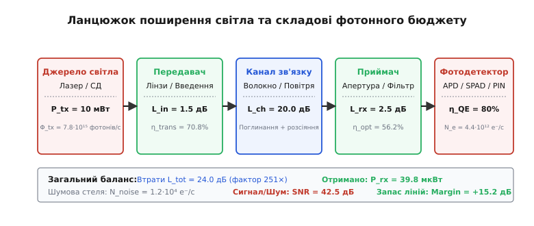
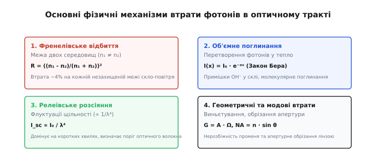
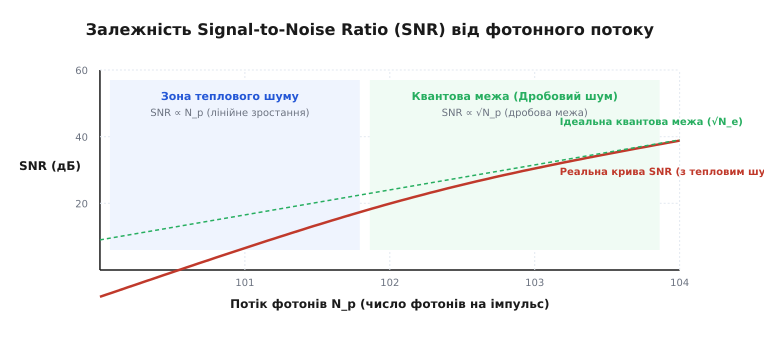

<preknowlist>
- [Закон заломлення Снеліуса](topic:physics/snells-law) — зв'язок кутів та показників заломлення на межі двох середовищ.
- [Рівняння Френеля](topic:physics/fresnel-equations) — коефіцієнти відбиття та пропускання електромагнітних хвиль.
- [Квантова ефективність](topic:physics/quantum-efficiency) — ймовірність генерації фотоелектронів при поглинанні квантів світла.
- [Статистика Пуассона](topic:math/poisson-statistics) — розподіл дискретних незалежних подій та квантовий дробовий шум.
- [Фізика p-n переходу](topic:physics/pn-junction) — область просторового заряду та напівпровідникова фотореєстрація.
</preknowlist>

Коли лазерний випромінювач космічного апарата спрямовує оптичний імпульс потужністю 100 мВт у бік приймальної станції на Землі на відстані 384 000 кілометрів, передавач випромінює гігантський потік у 7.8 · 10¹⁷ фотонів за одну секунду. Однак через геометричну розбіжність лазерного пучка світлова пляма на поверхні Землі розширюється до п'яти кілометрів у діаметрі. Приймальний телескоп із діаметром дзеркала один метр перехоплює лише одну двадцятимільйонну частку цієї плями, а проходження крізь турбулентну атмосферу, інтерференційні фільтри та френелівські межі лінз додатково зменшує інтенсивність випромінювання. На світлочутливу майданчик фотодетектора потрапляє лише близько двох сотень фотонів на бітовий інтервал. Якщо інженер схибить у розрахунках бодай на кілька децибел, корисний сигнал неминуче потоне у темнових та теплових шумах приймача, зруйнувавши канал зв'язку.

Фотонний бюджет оптичної системи — це строгий інженерний та фізичний баланс, який відстежує долю кожного електромагнітного кванта від моменту його генерації у випромінювачі до перетворення на фотоелектрон у детекторі.

> 🔧 **Навіщо це.**
> Розрахунок фотонного бюджету є фундаментом для проектування волоконно-оптичних ліній зв'язку (FTTH, 100G/400G Ethernet), атмосферних лазерних каналів (FSO), автомобільних та аерокосмічних лідарів (LiDAR), квантової криптографії (QKD), флуоресцентної біомедичної мікроскопії та оптичних датчиків фізичних величин. Без фотонного бюджету неможливо обрати потужність лазера, діаметр лінз чи тип фотодетектора, гарантуючи роботу системи без втрати даних.

## Етимологія та фізичний зміст поняття

Слово **фотон** походить від грецького *фōs* (φῶς) — «світло», із додаванням суфікса *-он*, що традиційно позначає елементарну частинку (подібно до електрона чи протона). Термін увів фізико-хімік Гілберт Льюїс у 1926 році для опису дискретного кванта променистої енергії.

Слово **бюджет** сягає корінням давньофранцузького *bougette* — «шкіряний кошик» або «гаманець». В англійській мові *budget* перетворилося на позначення балансу доходов та витрат. В оптиці «фотонний доход» — це кількість квантів, згенерованих випромінювачем, а «витрати» — це фізичні втрати на розсіяння, поглинання, френелівське відбиття та геометричне розширення пучка.

Термін **апертура** походить від латинського *apertura* — «отвір», «щілина», від дієслова *aperire* («відкривати»). В оптиці апертура визначає ефективну площу збору світлового потоку.

Слово **квант** походить від латинського *quantum* — «скільки». Воно підкреслює дискретний, порційний характер випромінювання та поглинання світла на атомному рівні.

## Анатомія фотонного тракту: від джерела до детектора

Будь-яка оптична система, незалежно від її призначення, являє собою послідовний ланцюг перетворень світлового потоку. На кожному етапі частина фотонів втрачається або перенаправляється вбік.


*Рис. 1: Послідовність перетворення світлового потоку та згасання фотонів від джерела випромінювання до первинного каскаду підсилювача.*

1. **Генерація та колімація**: Лазерний діод або світлодіод випромінює оптичну потужність `P_tx`. Енергія кожного фотона становить `E_p = h · c / λ`. Початковий фотонний потік емісії дорівнює `Ф_tx = P_tx / E_p`. Коліматорна лінза формує пучок із початковим радіусом `w_0` та кутом розбіжності `θ_div`.
2. **Оптичний каскад передавача**: Проходячи крізь коліматор, модулятор та захисні вікна, світло зазнає френелівського відбиття та середовищного поглинання з коефіцієнтом пропускання `T_tx`.
3. **Поширення у середовищі каналу**: Світловий промінь долає відстань `z`. У волокні або атмосфері випромінювання згасає за законом Бера — Ламберта — Бугера `T_medium = exp(-α · z)`. Одночасно пучок розходиться геометрично, формуючи на приймальному боці пляму радіусом `w(z) = w_0 + z · tan(θ_div)`.
4. **Збір випромінювання приймальною апертурою**: Приймальна лінза площею `A_rx = π · r_rx²` перехоплює лише частку плями `A_spot = π · w(z)²`. Геометрична ефективність збору становить `η_geom = min(1.0, A_rx / A_spot)`.
5. **Селекція та фокусування**: Прийняте світло долає інтерференційні bandpass-фільтри, що відсікають фонове сонячне випромінювання, та фокусується на світлочутливу майданчик детектора з коефіцієнтом пропускання `T_rx`.
6. **Квантова конверсія**: Приймана оптична потужність `P_rx = P_tx · T_tx · T_medium · η_geom · T_rx` створює потік фотонів `Ф_rx = P_rx / E_p`. У напівпровідниковій структурі фотодетектора з квантовою ефективністю `η_QE` кожен фотон з ймовірністю `η_QE` генерує електронно-діркову пару, створюючи фотострум `I_ph = e · η_QE · Ф_rx`.

Гауссів пучок фундаментальної моди `TEM_00` визначається радіусом перетяжки `w_0`. На відстані `z_R = π · w_0² / λ` (довжина Релея) площа променя подвоюється. При виході з коліматора кут розбіжності у дальній зоні прямує до дифракційного межі `θ_div = λ / (π · w_0)`. Збільшення початкового діаметра променя на виході передавача зменшує його кутову розбіжність, що дозволяє різко підняти геометричну ефективність `η_geom` на великих відстанях.

Про фізичні експерименти, які довели дискретну структуру світла та заклали основи технологій однофотонного підрахунку, детально розповідається в історичному екскурсі [📜 Історія відкриття дискретної природи світла та становлення фотонного підрахунку](topic:physics/photon-budget-optical/hist-photon-counting.md).

## Механізми оптичних втрат у каналі

Щоб точно розрахувати фотонний бюджет, необхідно проаналізувати всі фізичні джерела загасання світла.


*Рис. 2: Декомпозиція втрат: френелівське відбиття на межі скла, Релеївське розсіяння на флуктуаціях густини та геометрична розбіжність пучка.*

### 1. Френелівське відбиття (Fresnel Reflection)
На кожній межі поділу двох прозорих середовищ із показниками заломлення `n_1` та `n_2` виникає відбиття хвилі через неузгодженість хвильових опорів. Для довільного кута падіння `θ_i` амплітуди відбиття описуються формулами Френеля для s- та p-поляризацій. При нормальному падінні (`θ_i = 0`) частка відбитої енергії спрощується до виразу:

```
R = ((n_2 - n_1) / (n_2 + n_1))²
```

Для звичайного оптичного скла N-BK7 (`n = 1.517`) у повітрі (`n = 1.0`) відбиття становить `R ≈ 4.2%` на кожній межі. Незахищена лінза з двома поверхнями втрачає близько `8.2%` світлового потоку (внесені втрати `0.37 дБ`). Для напівпровідникових матеріалів (кремній `n = 3.48`, германій `n = 4.0`) відбиття досягає `30–36%` (втрата `3.2–3.9 дБ`!), що робить використання просвітлювальних антивідбивних покриттів (AR-coatings) критично обов'язковим.

### 2. Об'ємне поглинання та розсіяння в середовищі
Під час поширення світла у волокні або атмосфері інтенсивність хвилі спадає за експоненціальним законом Бера — Ламберта — Бугера:

```
I(z) = I_0 · exp(-α_total · z)
```

Повний коефіцієнт згасання `α_total = α_abs + α_Rayleigh + α_Mie` складається з трьох компонентів:
- **Молекулярне поглинання (`α_abs`)**: Поглинання фотонів електронними переходами атомів середовища чи коливальними модами молекул (наприклад, поглинання іонами `OH⁻` у склі на 1383 нм або молекулами `H_2O` та `CO_2` в атмосфері).
- **Релеївське розсіяння (`α_Rayleigh`)**: Розсіяння світла на флуктуаціях густини середовища, розмір яких значно менший за довжину хвилі (`d ≪ λ`). Інтенсивність розсіяння обернено пропорційна четвертому степеню довжини хвилі (`I_R ~ 1 / λ⁴`). Саме Релеївське розсіяння визначає фундаментальну межу прозорості кварцового волокна на рівні `0.18 дБ/км` на довжині хвилі 1550 нм.
- **Розсіяння Мі (`α_Mie`)**: Розсіяння на мікрочастках, розмір яких порівнянний із довжиною хвилі (`d ≈ λ`) — краплях туману, пилу, пилку. На відміну від Релеївського, розсіяння Мі слабко залежить від довжини хвилі і описується емпіричною залежністю `α_Mie ~ λ^(-γ)`, де експонента `γ` становить від 0.5 до 1.6 залежно від щільності серпанку. Розсіяння Мі створює нищівне згасання в атмосферних лініях FSO (до `80 дБ/км` у густому тумані).

### 3. Зварювальні стики та роз'єми (Splice & Connector Losses)
У волоконних лініях додаткові втрати виникають при зварюванні волокон або з'єднанні через оптичні роз'єми. При зварюванні двох волокон з радіусами мод `w_1` та `w_2` і радіальним зміщенням `d` втрати оцінюються як:

```
L_splice(дБ) = 4.343 · ( (w_1² - w_2²) / (w_1² + w_2²) )² + 4.343 · ( (2 · d) / (w_1 + w_2) )²
```

Високоточна автоматична дугова зварка забезпечує втрати `L_splice < 0.03 дБ`, тоді як механічні роз'єми FC/PC вимагають врахування додаткових втрат `0.25–0.50 дБ` на кожен з'єднувач.

### 4. Атмосферна турбулентність та мерехтіння (Scintillation)
У відкритому просторі флуктуації температури та тиску повітря створюють турбулентні вихори з різними показниками заломлення. Це викликає викривлення хвильового фронту, блукання пучка та швидкоплинні флуктуації інтенсивності — мерехтіння (*scintillation*).

Інтенсивність мерехтіння характеризується індексом сцинтиляції `σ_I²`. У розрахунку фотонного бюджету атмосферне мерехтіння моделюється як додатковий логарифмічно-нормальний фадинг. Щоб запобігти зриву зв'язку при глибоких замираннях сигналу, до розрахованого фотонного бюджету FSO-лінії додають атмосферний запас на сцинтиляцію (*scintillation margin*) величиною `6–12 дБ`.

### 5. Геометричне згасання (Beam Divergence)
Через дифракцію хвилі на вихідній апертурі радіус пучка з початковою перетяжкою `w_0` зростає з відстані `z` за гіперболічним законом. На великих відстанях (`z ≫ z_R`) пучок розходиться під кутом `θ_div ≈ λ / (π · w_0)`. Площа плями зростає пропорційно квадрату відстані `A_spot ~ z²`. Якщо площа приймальної апертури `A_rx` менша за площу плями `A_spot`, геометричний коефіцієнт втрат виражається як:

```
L_geom(дБ) = 10 · lg( A_spot / A_rx ) = 10 · lg( (w_0 + z · tan(θ_div))² / r_rx² )
```

У відкритих атмосферних та космічних лініях зв'язку геометричне розширення пучка дає найбільший внесок у сумарне згасання, перевищуючи `30–60 дБ`.

Детальний довідник усіх оптичних коефіцієнтів, характеристик оптичного скла, специфікацій інтерференційних фільтрів та параметрів прозорості волокон зібрано у [📋 Довідник оптичних коефіцієнтів, квантової ефективності та специфікацій](topic:physics/photon-budget-optical/api-optical-budget-specs.md).

## Порівняльний аналіз оптичного та радіочастотного (RF) лінк-бюджету

Хоча структура підрахунку втрат у логарифмічних децибелах виглядає подібною для радіочастотних каналів (РРЛ, Wi-Fi, 5G) та оптичних ліній (FSO, DWDM), між ними існують три фундаментальні фізичні відмінності:

- **Масштаб довжини хвилі та коефіцієнт підсилення апертури**: Радіохвилі макроскопічні (`λ = 1–10 см`), тоді як оптичні хвилі мікроскопічні (`λ = 0.8–1.5 мкм`). Це дозволяє створювати оптичні апертури помірного розміру (10 см) із колосальним коефіцієнтом підсилення `G_rx = (π · D / λ)² ≈ 10¹⁰` (або `+100 дБ`!), що у тисячі разів перевищує підсилення радіоантен.
- **Енергія кванта та квантовий шум**: У радіодіапазоні енергія кванта `E = h·ν` набагато менша за термічну енергію `k_B · T`. Тому радіоканали обмежені виключно тепловим шумом. В оптичному діапазоні `h·ν ≫ k_B · T`, завдяки чому тепловий шум середовища відсутній, і панівним виступає дискретний квантовий дробовий шум приходу фотонів.
- **Детектування амплітуди проти квадратичного прямого детектування**: Традиційне оптичне пряме детектування (Direct Detection) є квадратичним за електричним полем хвилі (`I ~ |E|²`). Оптичний роз'єм із втратою 3 дБ за світловою потужністю відповідає зменшенню фотоструму вдвічі, що після амплітудно-квадратичного перетворення в електричний сигнал дає спад електричного відношення сигнал/шум аж на 6 дБ!

## Температурний дерейтинг та кліматичний запас

Оптичні системи працюють у широких температурних діапазонах (від -40 °C до +85 °C у промислових стандартах). Зміна температури викликає три паралельні фізичні ефекти, які погіршують фотонний бюджет:

1. **Зростання порогового струму лазера**: Пороговий струм лазерного діода експоненціально зростає з температурою: `I_th(T) = I_th(20°C) · exp(T / T_0)`, де `T_0` — характеристична температура напівпровідника (`50–80 K` для InGaAsP). Без термоелектричного охолодження вихідна оптична потужність `P_tx` падає на `1.5–3.0 дБ` при нагріванні до +70 °C.
2. **Зростання темнового струму детектора**: Темновий струм `I_dark` фотодіода подвоюється на кожні 8–10 °C підвищення температури. Це піднімає рівень темнового шуму `σ_dark`, знижуючи чутливість приймача `P_sens` на `2.0–4.0 дБ`.
3. **Спектральний розсинхронізм**: Центральна довжина хвилі лазера зміщується зі швидкістю `dλ/dT ≈ +0.1 нм/°C`, тоді як пік пропускання вузькосмугового інтерференційного фільтра зміщується на `dλ_filter/dT ≈ +0.02 нм/°C`. При перепаді температур у 50 °C лазерна лінія може вийти за смугу пропускання фільтра, викликаючи додаткові втрати `L_temp ≈ 3–6 дБ`.

Для врахування цих ефектів до підсумкового розрахунку додають додатковий кліматичний запас (*thermal derating margin*) величиною `+2.0 ... +4.0 дБ`.

## Вплив дисперсії та спектрального мультиплексування (WDM)

У багатоклометрових телекомунікаційних мережах фотонний бюджет зазнає впливу не лише втрат інтенсивності, а й спектрально-часових спотворень.

### 1. Дисперсійні штрафи потужності (Dispersion Penalty)
Хроматична дисперсія волокна `D(λ)` (пс/(нм·км)) розмиває оптичні імпульси у часі. Розширення імпульсу створює міжсимвольну інтерференцію (ISI). Для збереження заданого рівня помилок (BER) приймачу потрібна додаткова оптична потужність, яка враховується як дисперсійний штраф `L_disp`:

```
L_disp(дБ) = -5 · lg( 1 - 2 · (D · B² · Δλ · z)² )
```

Поляризаційна модова дисперсія (PMD) викликає диференціальну групову затримку (DGD) `Δτ_PMD = D_PMD · √z` між ортогональними поляризаціями, що додає власну величину штрафу до фотонного бюджету.

### 2. Втрати спектральних мультиплексорів (WDM MUX/DEMUX)
У системах зі спектральним ущільненням (CWDM та DWDM) десятки оптичних каналів об'єднуються на одному волокні. Кожен мультиплексор та демультиплексор на основі тонкоплівкових фільтрів (TFF) чи масивів випромінювальних хвилеводів (AWG) додає власні внесені втрати `2.5–4.5 дБ` у фотонний бюджет кожного спектрального каналу.

## Декомпозиція шумів фотоприймача та відношення Сигнал/Шум (SNR)

Навіть якщо прийнятий фотонний потік успішно досяг фотодетектора й згенерував фотоелектрони, корисний електричний сигнал порівнюється з флуктуаційними шумами вимірювального тракту.


*Рис. 3: Графік залежності відношення сигнал/шум від прийнятого фотонного потоку та зміна панівного джерела шумів.*

Електричний струм детектора зазнає впливу трьох фундаментальних джерел шуму:

### 1. Квантовий дробовий шум сигналу (Signal Shot Noise)
Природа світла дискретна. Реєстрація фотонів детектором описується статистикою Пуассона: ймовірність приходу `k` фотонів за інтервал `Δt` дорівнює:

```
P(k) = ( (N_e)^k · exp(-N_e) ) / k!
```

де `N_e = η_QE · N_p` — середня кількість генерувальних фотоелектронів. Середньоквадратичне відхилення числа електронів дорівнює квадратному кореню з їх середнього значення `σ_shot = √(N_e) = √(η_QE · N_p)`. Дисперсія струму дробового шуму становить `i_shot² = 2 · e · I_ph · B`, де `B` — смуга частот приймача. Дробовий шум є неусувним фізичним порогом будь-якої оптичної системи.

### 2. Шум темнового струму (Dark Current Noise)
Навіть у повній темряві за відсутності освітлення через напівпровідник протікає темновий струм `I_dark`, зумовлений термічною генерацією носіїв у області просторового заряду. Темновий струм створює власний дробовий шум із дисперсією електронів `σ_dark = √((I_dark · Δt) / e)`.

### 3. Тепловий шум Джонсона — Найквіста (Thermal Noise)
Хаотичний термічний рух носіїв заряду в опорі навантаження фотоприймача `R_L` або первинному каскаді трансімпедансного підсилювача (TIA) створює флуктуації напруги. Середньоквадратичний струм теплового шуму становить:

```
i_thermal² = (4 · k_B · T · B) / R_L
```

де `T` — абсолютна температура в кельвінах, а `k_B` — стала Больцмана. У числах електронів за бітовий інтервал `Δt = 1 / (2·B)` тепловий шум виражається як `σ_thermal = (√(i_thermal²) · Δt) / e`.

### 4. Фактор надлишкового шуму в APD (Excess Noise Factor)
У лавинних фотодіодах (APD) первинні фотоелектрони підсилюються у `M` разів завдяки ударній іонізації. Оскільки процес ударної іонізації є випадковим, коефіцієнт підсилення флуктує навколо середнього значення `M`. Це вносить додатковий статистичний шум, який моделюється фактором надлишкового шуму Макінтайра `F(M)`:

```
F(M) = M · k + (1 - k) · (2 - 1 / M)
```

де `k = β / α` — відношення коефіцієнтів ударної іонізації дірок та електронів. Для кремнієвих APD `k ≈ 0.02–0.05` (низький надлишковий шум `F(M) ≈ 2–3`), тоді як для InGaAs APD `k ≈ 0.45–0.50` (вищий надлишковий шум `F(M) ≈ 4–5`). Дисперсія дробового шуму APD зростає до `σ_shot,APD² = M² · F(M) · N_e`.

### Підсумкове рівняння SNR та Квантова межа (Quantum Limit)

Сумарне відношення сигнал/шум (SNR) за амплітудою фотоструму обчислюється як відношення числа корисних фотоелектронів до квадратурної суми всіх незалежних джерел шумів:

```
SNR = N_e / √(σ_shot² + σ_dark² + σ_thermal²) = (η_QE · N_p) / √( η_QE · N_p + (I_dark · Δt)/e + σ_thermal² )
```

З аналізу цього рівняння випливають два граничні режими роботи оптичного приймача:

1. **Режим обмеження тепловим шумом (Thermal-Noise Limited)**: При слабких оптичних сигналах та високих швидкостях передачі (`B > 100 МГц`) тепловий шум підсилювача значно перевищує квантовий дробовий шум (`σ_thermal ≫ σ_shot`). У цьому разі `SNR ≈ (η_QE · N_p) / σ_thermal`, і відношення сигнал/шум зростає лінійно з ростом потужності сигналу.
2. **Квантовий режим (Shot-Noise Limited / Quantum Limit)**: Якщо темновий та тепловий шуми зведені до нуля (наприклад, при застосуванні кріогенного охолодження та фотопомножувачів чи підсилювачів APD/SNSPD), єдиним джерелом похибки лишається дробовий шум сигналу. Тоді рівняння спрощується до фундаментальної квантової межі:

```
SNR_quantum = N_e / √(N_e) = √(N_e) = √(η_QE · N_p)
```

Для забезпечення коефіцієнта бітових помилок `BER = 10⁻⁹` у цифрових лініях зв'язку необхідне лінійне відношення сигнал/шум `SNR = 6` (що відповідає `15.6 дБ` за потужністю). У суто квантовому режимі для цього достатньо зареєструвати лише `N_e = 6² = 36 фотоелектронів` на один біт інформації (що при `η_QE = 1.0` дає квантову межу Poisson в 10 фотонів/біт для амплітудної модуляції OOK).

Повний математичний виведення матричного формалізму каскаду, статистики Поассона, фактора надлишкового шуму APD `F(M)` та розрахунку коефіцієнта бітових помилок (BER) наведено у встановити [🧮 Математичний апарат розрахунку фотонного бюджету та відношення сигнал/шум](topic:physics/photon-budget-optical/math-photon-budget.md).

## Логарифмічний розрахунок дБ-бюджету та Link Margin

На практиці інженери рідко перемножують лінійні коефіцієнти пропускання дробових чисел. Усі обчислення переводять у логарифмічну шкалу децибелів (дБ), де каскадне множення замінюється простим додаванням та відніманням.

Оптична потужність виражається в децибел-міліватах (дБм):

```
P(дБм) = 10 · lg( P(мВт) / 1 мВт )
```

У логарифмічній формі рівняння фотонного бюджету оптичної лінії набуває вигляду:

```
P_rx(дБм) = P_tx(дБм) - L_tx(дБ) - L_geom(дБ) - L_medium(дБ) - L_disp(дБ) - L_rx(дБ)
```

де `L_tx` та `L_rx` — сумарні втрати оптичних елементів передавача та приймача, `L_geom` — геометричні втрати розбіжності променя, `L_disp` — дисперсійний штраф, а `L_medium` — атмосферне або волоконне згасання.

Важливішим показником надійності лінії є **Запас лінії (Link Margin)**. Він визначає різницю між фактично прийманою оптичною потужністю `P_rx` та мінімальною чутливістю приймача `P_sens`, необхідною для забезпечення заданого коефіцієнта помилок (BER):

```
Link_Margin(дБ) = P_rx(дБм) - P_sens(дБм)
```

Якщо `Link Margin > 0 дБ`, канал зв'язку працездатний. У реальному проектуванні інженери закладають обов'язковий технологічний запас `Link Margin ≥ +3.0 ... +6.0 дБ` для компенсації старіння лазерного діода, забруднення оптичних поверхонь, дрейфу температури та випадкових атмосферних флуктуацій.

## Покрокові приклади системного розрахунку

Розглянемо два реальні інженерні сценарії розрахунку фотонного бюджету.

### Сценарій 1: Атмосферна лазерна лінія зв'язку (FSO 5 км, λ = 1550 нм)

Необхідно розрахувати можливість організації зв'язку зі швидкістю 1 Гбіт/с (`Δt = 1 нс`) між двома будівлями на відстані `z = 5 км`.

1. **Передавач**: Лазер DFB потужністю `P_tx = 100 мВт` (+20 дБм) на довжині хвилі 1550 нм. Енергія фотона `E_p = 1.282 · 10⁻¹⁹ Дж`.
2. **Оптика передавача**: 2 лінзи з AR-покриттям (`L_tx = 0.1 дБ`).
3. **Геометричні втрати**: Коліматор створює пучок із початковим радіусом `w_0 = 25 мм` та розбіжністю `θ_div = 0.2 мрад`. На відстані 5 км радіус світлової плями досягає `w(5км) = 0.025 + 5000 · 0.0002 = 1.025 м` (площа плями `A_spot = 3.30 м²`). Приймальний телескоп із діаметром дзеркала `D_rx = 200 мм` має площу `A_rx = 0.0314 м²`.
   ```
   L_geom = 10 · lg( 3.30 / 0.0314 ) = 20.2 дБ
   ```
4. **Втрати в атмосфері (ясна погода)**: При коефіцієнті згасання `α = 1.5 дБ/км` втрати на 5 км становлять `L_medium = 7.5 дБ`.
5. **Оптика приймача**: Захисне вікно, bandpass-фільтр та збиральна лінза (`L_rx = 1.2 дБ`).
6. **Приймана потужність**:
   ```
   P_rx = +20 дБм - 0.1 дБ - 20.2 дБ - 7.5 дБ - 1.2 дБ = -9.0 дБм (126 мкВт)
   ```
   Фотонний потік на фотодіоді: `Ф_rx = 126 мкВт / E_p = 9.83 · 10¹⁴ фотонів/с`. За бітовий інтервал 1 нс приймається `N_p = 983 000 фотонів`.
7. **Шумовий аналіз та запас**: Для InGaAs APD з чутливістю `P_sens = -28.0 дБм` (при BER = 10⁻⁹) фактичний запас лінії становить:
   ```
   Link_Margin = -9.0 дБм - (-28.0 дБм) = +19.0 дБ
   ```
   Запас у 19.0 дБ забезпечує стійку роботу каналу навіть при виникненні помірного туману (з додатковим загасанням до 3.8 дБ/км).

### Сценарій 2: Автомобільний імпульсний лідар (LiDAR, λ = 905 нм)

Лідар випромінює наносекундні імпульси для виявлення пішохода з коефіцієнтом відбиття `ρ = 10%` на відстані `R = 150 м`.

1. **Імпульс передавача**: Пікова потужність `P_peak = 50 Вт` (+47 дБм), тривалість імпульсу `τ = 5 нс`. Енергія імпульсу `E_pulse = 250 нДж` (містить `1.14 · 10¹² фотонів`).
2. **Дифузне відбиття від цілі**: Ціль моделюється як Ламбертівська поверхня. Відбитий потік перевипромінюється в півсферу (`2π` стерадіан).
3. **Геометрична площа збору**: Приймальна апертура площею `A_rx = 20 см²` (`0.002 м²`) на відстані 150 м перехоплює частку відбитого світла:
   ```
   η_target = (ρ / π) · (A_rx / R²) = (0.1 / 3.14159) · (0.002 / 22500) = 2.83 · 10⁻⁹ (-85.5 дБ)
   ```
4. **Приймана енергія імпульсу**: З урахуванням пропускання оптики `T_opt = 0.70` (-1.5 дБ):
   ```
   E_rx = E_pulse · η_target · T_opt = 250 нДж · 2.83 · 10⁻⁹ · 0.70 = 0.495 фДж
   ```
5. **Число прийнятих фотонів**: Енергія одного фотона на 905 нм становить `E_p = 2.195 · 10⁻¹⁹ Дж`. Кількість прийнятих фотонів за імпульс:
   ```
   N_p = 0.495 фДж / 2.195 · 10⁻¹⁹ Дж = 2255 фотонів
   ```
6. **Сигнал на SPAD-детекторі**: При квантовій ефективності SPAD `η_QE = 60%` реєструється `N_e = 1353 фотоелектронів`. Квантовий дробовий шум становить `σ_shot = √1353 ≈ 36.8`. Відношення сигнал/шум дорівнює `SNR = 1353 / 36.8 = 36.8` (або `31.3 дБ` за потужністю), що гарантує 100% ймовірність виявлення цілі з низькою ймовірністю хибного спрацювання.

## Практична методика вимірювання та діагностики фотонного бюджету

У лабораторних та польових умовах теоретично розрахований фотонний бюджет перевіряється серією інструментальних тестувань:

1. **Рефлектометрія волокна (OTDR Trace)**: Оптичний часовий рефлектометр посылає потужні світлові імпульси у волокно й реєструє зворотне релеївське розсіння. Графік рефлектограми показує локальне згасання (дБ/км), розрізняючи втрати на зварювальних стиках (типово `< 0.05 дБ`) та паразитні відбиття FC/PC роз'ємів.
2. **Вимірювання вихідної потужності та чутливості**: Оптичний ваттметр із вимірювальною головкою на основі каліброваного Ge чи InGaAs діода вимірює фактичну вихідну потужність `P_tx` та згасання каскаду.
3. **Оцінка очної діаграми (Eye Diagram & BERT)**: За допомогою швидкісного осцилографа оцінюється «очна діаграма» електричного сигналу після TIA підсилювача. Вимірюється коефіцієнт екстинкції (`ER = P_1 / P_0`), Q-фактор (`Q ≈ SNR`) та часовий джитер. Потім аналізатор бітових помилок (BERT) будує залежність `BER` від вхідної потужності, верифікуючи точний `Link Margin`.

## Крайові випадки та нелінійні обмеження при високих потужностях

Спроба підняти фотонний бюджет простим збільшенням потужності випромінювача `P_tx` наражається на суворі фізичні обмеження нелінійної оптики та оптичної міцності матеріалів.

### 1. Спонтанне вимушене розсіяння Мандельштама — Бріллюена (SBS)
У одномодових волокнах при перевищенні порогової потужності (зазвичай `P_th ≈ 5–10 мВт` для вузькосмугового DFB лазера) інтенсивна світлова хвиля генерує акустичні фонони в кварцовому склі. Виникає періодична ґратка показника заломлення, яка починає працювати як дзеркало, відбиваючи більшу частину фотонів назад до передавача. Потужність на виході волокна насичується, і подальше збільшення `P_tx` лише погіршує фотонний бюджет.

### 2. Вимушене комбінаційне розсіяння (SRS) та чотирихвильове змішування (FWM)
У багатоканальних спектральних системах DWDM висока потужність оптичних каналів викликає нелінійне перекачування фотонів з короткохвильових каналів у довгохвильові (SRS) та виникнення паразитних комбінаційних частот (FWM), що створює міжканальні наводки та руйнує оптичний баланс.

### 3. Поріг оптичного руйнування (Optical Damage Threshold)
При фокусуванні оптичної потужності понад `10⁶ Вт/см²` на торці волокна чи поверхні напівпровідникового лазера виникає оптичний пробій та катастрофічне руйнування фасетки лазера (Catastrophic Optical Damage, COD).

## Методи розширення фотонного бюджету у сучасних системах

Коли класичний розрахунок показує від'ємний запас лінії (`Link Margin < 0 дБ`), інженери застосовують передові методи фізичного та цифрового підсилення сигналу:

### 1. Попереднє оптичне підсилення (Optical Pre-amplification)
Встановлення підсилювача EDFA (Erbium-Doped Fiber Amplifier) або SOA безпосередньо перед фотоприймачем піднімає оптичну потужність слабкого сигналу на `20–30 дБ` до того, як він зіткнеться з тепловим шумом TIA. Це дозволяє перевести приймач із режиму обмеження тепловим шумом у режим обмеження шумом спонтанного випромінювання (ASE-shot noise limit), наблизивши чутливість до квантової межі.

### 2. Когерентне детектування (Coherence Detection)
У когерентних оптичних системах прийманий слабкий промінь змішується на оптичному дільнику з потужнішим випромінюванням гетеродинного лазера (Local Oscillator, `P_LO ≈ 10 мВт`). На фотодіоді виникає бічне перетворення струму з амплітудою `I_het = 2 · R · √(P_rx · P_LO)`. Потужний гетеродин виводить дробовий шум сигналу високо над тепловим шумом підсилювача, піднімаючи чутливість приймача до теоретичного максимуму (`SNR_het = η_QE · N_p`).

### 3. Застосування кодувань із корекцією помилок (Forward Error Correction, FEC)
Цифрова обробка сигналу (DSP) із застосуванням кодів з виправленням помилок (Reed-Solomon, LDPC) дає змогу послабити вимоги до вхідного `SNR`. Замість `BER = 10⁻⁹` (що вимагає `SNR = 15.6 дБ`), лінія з FEC може стабільно працювати при вихідному `BER = 10⁻³` (що вимагає `SNR` лише `9.8 дБ`). Це дає так званий «виграш від кодування» (*coding gain*) у `+5.8 дБ` до фотонного бюджету без збільшення потужності лазера чи діаметра лінз!

## Програмний інструментарій для автоматизації обчислень

Для автоматизації багатокрокових розрахунків фотонного бюджету розробляють спеціалізовані програмні модулі. Програма приймає вектор параметрів системи, розраховує каскадне згасання, виконує шумовий аналіз та формує звіт про запас лінії.

Повний вихідний код реалізації обчислювального ядра фотонного бюджету мовами C, C++ та Python з ідіоматичними шаблонами C++23, захистом від витоків пам'яті та таблицями верифікації наведено у практичній вставці [⚙️ Алгоритм і програмний розрахунок фотонного бюджету та SNR оптичного каналу](topic:physics/photon-budget-optical/proj-photon-budget-calc.md).

## Інженерний синтез та порівняльний аналіз застосувань

Вимоги до фотонного бюджету кардинально різняться залежно від галузі застосування оптичної системи:

| Галузь застосування | Довжина хвилі λ | Потужність джерела P_tx | Панівний механізм втрат | Тип фотодетектора | Типовий Link Margin |
|---|---|---|---|---|---|
| **Магістральне волокно (100G DWDM)** | 1550 нм (C-band) | +3 ... +10 дБм | Згасання в скловолокні (0.2 дБ/км) | PIN / APD з EDFA | +4.0 ... +6.0 дБ |
| **Атмосферний зв'язок (FSO 2 км)** | 1550 нм | +17 ... +27 дБм (50-500 мВт) | Геометрична розбіжність + туман | APD / InGaAs | +10.0 ... +20.0 дБ |
| **Автомобільний лідар (LiDAR 200 м)** | 905 нм / 1550 нм | +30 дБм (імпульс 50 Вт) | Низький коефіцієнт відбиття цілі (10%) | SPAD / SiPM масив | +3.0 ... +5.0 дБ |
| **Квантова криптографія (QKD)** | 1550 нм | -80 дБм (одиночні фотони) | Втрати у волокні + поглинання | SNSPD (кріогенний) | +1.5 ... +3.0 дБ |
| **Флуоресцентна мікроскопія** | 488 нм / 532 нм | +10 ... +20 дБм | Квантовий вихід флуорофора (η_fl < 0.1) | sCMOS / PMT | +2.0 ... +4.0 дБ |

Як видно з порівняльної таблиці, проектування фотонного бюджету вимагає глибокого розуміння фізичних процесів взаємодії світла з речовиною. У волоконних мережах головною задачею є компенсація згасання середовища; у лідарах та FSO — подолання геометричного розширення пучка; у квантовій оптиці — захист одиночних фотонів від темнових відліків детектора.

Суворе дотримання методології розрахунку фотонного бюджету дозволяє інженеру будувати оптичні системи, які надійно працюють на межі фізичних можливостей світлової хвилі.
