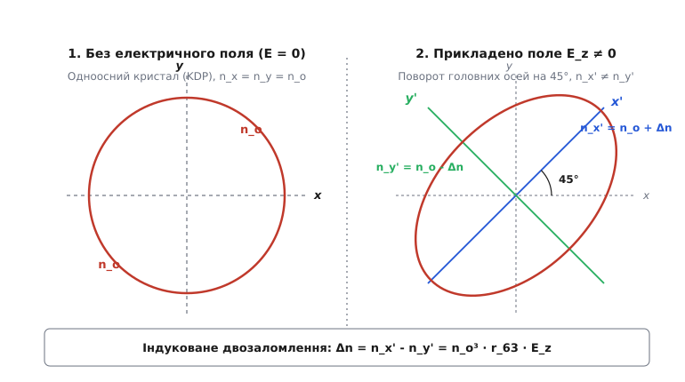
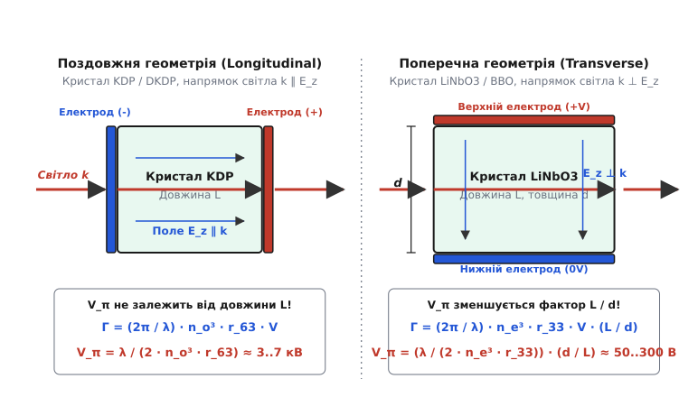
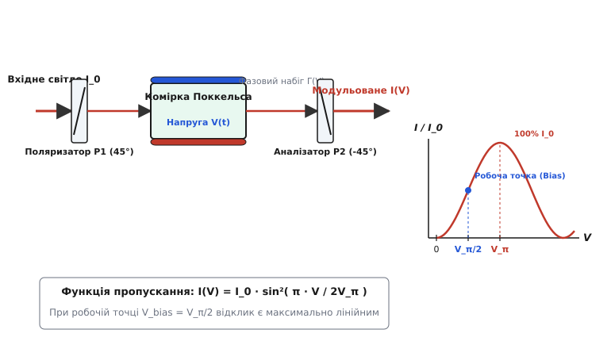
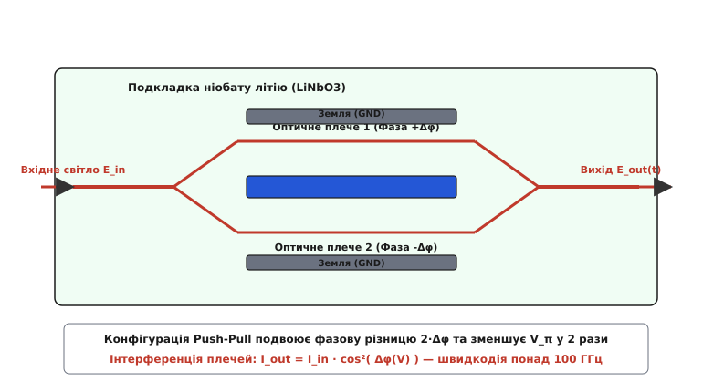

# Електрооптичний ефект Поккельса

<preknowlist>
- [Матричне числення поляризації: Джонс і Мюллер](topic:physics/polarization-matrix-calculus) — опис стану поляризації вектором Джонса та його трансформація оптичними елементами.
- [Рівняння Френеля](topic:physics/fresnel-equations) — розкладання світла на s- та p-компоненти та проходження меж середовищ.
- [Інтерферометр Маха — Цендера](topic:physics/mach-zehnder-interferometer) — фазова інтерференція двох оптичних плечей для перетворення фазової модуляції в амплітудну.
- [П'єзоелектричний ефект](topic:physics/piezoelectric-effect) — зв'язок між механічною деформацією та електричним полем у нецентросиметричних кристалах.
</preknowlist>

Коли в сучасних волоконно-оптичних магістралях зв'язку потрібно передати потік даних зі швидкістю 400 Гбіт/с або в лазерному хірургічному скальпелі сформувати одиночний імпульс тривалістю 5 наносекунд із піковою потужністю в десятки мегават, механічні затвори чи рідкокристалічні комірки виявляються непридатними: їхня швидкодія обмежена мілісекундним або мікросекундним діапазоном через інерцію матеріальних частинок. Вирішенням цієї фундаментальної задачі стало використання **електрооптичного ефекту Поккельса** (від лат. *electrum* — бурштин, грец. *оптика* та прізвища німецького фізика Фрідріха Поккельса) — прямої зміни покажчика заломлення прозорого кристала під дією зовнішнього електричного поля з часом відклику менше пікосекунди (`10⁻¹² с`).

Ефект Поккельса є основою надшвидкодіючої фотоніки: від квантових затворів лазерного резонатора до інтегральних оптичних хвилеводів, які перетворюють електричні коди комп'ютерів на світлові імпульси волоконно-оптичного інтернету.

---

### 1. Фізичний механізм та симетрійні обмеження

Під дією зовнішнього електричного поля `E` в електронній оболонці та кристалічній ґратці твердого тіла виникає поляризаційне зміщення зарядів. У підручниках з оптичного матеріалознавства цю взаємодію описують через зв'язок між напруженістю електричного поля світлової хвилі та полем зовнішнього потенціалу. Якщо кристалічна структура не володіє центром інверсії, це зміщення деформує еліпсоїд покажчиків заломлення середовища лінійно по прикладеному полю:

```
Δn = -1 / 2 · n³ · r · E                   [лінійний ефект Поккельса]
```

де `n` — незбурений покажчик заломлення кристала, `r` — електрооптичний коефіцієнт Поккельса (вимірюється в пікометрах на вольт, `пм/В`), а `E` — напруженість зовнішнього електричного поля.

Принциповою особливістю ефекту Поккельса є його **суворо лінійний характер**: зміна покажчика заломлення `Δn` пропорційна першому ступеню напруженості електричного поля `E`, а знак зміни покажчика заломлення змінюється на протилежний при зміні напрямку поля (`E → -E`).

```
E_field ↑  ⇒  n_x' ↑ (затримка світлової хвилі збільшується)
E_field ↓  ⇒  n_x' ↓ (прискорення фази хвилі)
```

Ця лінійність створює унікальну інженерну перевагу: фазовий набіг світла точно відтворює форму керуючого електричного сигналу. Якщо до кристала прикласти синусоїдальну напругу, покажчик заломлення змінюватиметься за тим самим гармонійним законом без виникнення паразитної подвоєної частоти.

#### 1.1. Фундаментальне обмеження симетрії: чому ефект відсутній у склі

Закони симетрії, сформульовані П'єром Кюрі, накладають суворе обмеження на існування лінійного електрооптичного ефекту. У середовищах із центром інверсійної симетрії (таких як аморфне скло, рідини, гази або кристали кубічної симетрії класів `m3m`, `432` тощо) операція інверсії координат `x → -x, y → -y, z → -z` залишає структуру середовища незмінною, але змінює напрямок електричного поля на протилежний (`E → -E`).

Якби у центросиметричному середовищі існував лінійний відклик `Δn = r · E`, то при інверсії поля ми б мали отримали:

```
Δn(-E) = r · (-E) = -r · E
```

Але оскільки середовище після інверсії геометрії повністю тотожне вихідному, його покажчик заломлення має змінитися абсолютно так само: `Δn(-E) = Δn(E)`.

```
r · E = -r · E  ⇒  2 · r · E = 0  ⇒  r ≡ 0  [для всіх центросиметричних тіл]
```

Звідси випливає фундаментальне правило: **ефект Поккельса існує виключно у нецентросиметричних кристалах**. З 32 точкових кристалографічних груп ефект Поккельса спостерігається у **20 класах**, які позбавлені центра симетрії (ті самі класи, що проявляють [П'єзоелектричний ефект](topic:physics/piezoelectric-effect), за винятком точкової групи `432`).

У середовищах із центром симетрії (скло, воду, бензол) лінійний член дорівнює нулю, і спостерігається лише значно слабший квадратичний ефект Керра (`Δn ∝ E²`), який вимагає в сотні разів вищих електричних напруг для досягнення того ж фазового набігу.

Детальний аналіз хронології дослідження симетрій нецентросиметричних середовищ та випробувань перших кристалічних затворів наведено у вставці [Історія відкриття ефекту Поккельса](topic:physics/pockels-effect/hist-pockels.md).

---

### 2. Оптична індикатриса та електрооптичний тензор

Для опису поширення світла у діелектрично анізотропному кристалі використовують геометричний образ — **оптичну індикатрису** (еліпсоїд покажчиків заломлення). У головній системі координат кристала `(x, y, z)` рівняння еліпсоїда має вигляд:

```
x² / n_x² + y² / n_y² + z² / n_z² = 1      [канонічне рівняння індикатриси]
```

де `n_x, n_y, n_z` — головні покажчики заломлення кристала для світла, поляризованого уздовж відповідних осей.

При прикладанні зовнішнього електричного поля `E = (E_x, E_y, E_z)` поверхня еліпсоїда деформується: змінюються довжини його півосей та відбуваються просторові повороти осей симетрії. Загальне рівняння деформованого еліпсоїда описується через коефіцієнти оптичної непроникності `η_ij = Δη_ij + (1 / n²)_ij`:

```
η_1·x² + η_2·y² + η_3·z² + 2·η_4·y·z + 2·η_5·x·z + 2·η_6·x·y = 1
```

Прирости коефіцієнтів `Δη_m` зв'язані з компонентами електричного поля `E_k` через електрооптичний тензор Поккельса `r_mk` у нотації Фогта (матриця розміром `6 × 3`):

```
┌ Δη_1 ┐   ┌ r_11  r_12  r_13 ┐
│ Δη_2 │   │ r_21  r_22  r_23 │
│ Δη_3 │ = │ r_31  r_32  r_33 │ · ┌ E_x ┐
│ Δη_4 │   │ r_41  r_42  r_43 │   │ E_y │
│ Δη_5 │   │ r_51  r_52  r_53 │   └ E_z ┘
└ Δη_6 ┘   └ r_61  r_62  r_63 ┘
```

Кожна точкова група симетрії кристала обнуляє більшість коефіцієнтів цієї матриці. Наприклад, у кристалах тригональної групи `3m` (до якої належить ніобат літію `LiNbO₃`) ненульовими є лише шість коефіцієнтів: `r_13 = r_23`, `r_33`, `r_22 = -r_12 = -r_61`, та `r_51 = r_42`. Знання матриці Поккельса дозволяє точно розрахувати відклик кристала при довільній орієнтації електричного поля та оптичного променя.

#### 2.1. Деформація індикатриси у кристалах групи KDP (клас 4̄2m)

Розглянемо найпростіший та найбільш поширений класичний приклад — кристал дигідрофосфату калію (`KH₂PO₄` або KDP), що належить до тетрагональної точкової групи `4̄2m`. У незбуреному стані кристал є одноосним: `n_x = n_y = n_o` (звичайний покажчик заломлення), `n_z = n_e` (надзвичайний покажчик заломлення).

Завдяки симетрії `4̄2m` матриця Поккельса має лише три ненульові компоненти: `r_41 = r_52` та `r_63`. Усі інші коефіцієнти строго дорівнюють нулю.

При прикладанні електричного поля строго вздовж оптичної осі `z` (`E_x = 0, E_y = 0, E_z ≠ 0`) єдиним ненульовим коефіцієнтом деформації є `Δη_6 = r_63 · E_z`.

Рівняння оптичної індикатриси набуває вигляду:

```
x² / n_o² + y² / n_o² + z² / n_e² + 2 · r_63 · E_z · x · y = 1
```

Наявність перехресного доданку `2 · r_63 · E_z · x · y` означає, що переріз еліпсоїда площиною `xy` перетворився з кола на еліпс, осі якого повернуті під кутом **45°** відносно початкових кристалографічних осей `x` та `y`.


*Деформація та поворот головних осей оптичної індикатриси одноосного кристала KDP під дією поздовжнього електричного поля E_z.*

Ввівши нові головні осі `x'` та `y'`, повернуті на 45°, отримуємо нові значення покажчиків заломлення для хвильових компонентів:

```
n_x' = n_o + 1 / 2 · n_o³ · r_63 · E_z
n_y' = n_o - 1 / 2 · n_o³ · r_63 · E_z
```

Анізотропне розщеплення покажчиків заломлення (індуковане двозаломлення `Δn`) дорівнює:

```
Δn = n_x' - n_y' = n_o³ · r_63 · E_z
```

Повний математичний вивід перетворення координат, діагоналізації матриці та формалізму тензора Поккельса наведено у вставці [Математична теорія оптичної індикатриси](topic:physics/pockels-effect/math-indicatrix-tensor.md).

---

### 3. Геометрії комірки Поккельса: поздовжня та поперечна

Залежно від взаємної орієнтації напрямку поширення світлового променя (вектора хвильового вектора `k`) та напрямку зовнішнього електричного поля `E`, комірки Поккельса поділяють на два фундаментальні типи: **поздовжні** та **поперечні**.


*Конструктивна відмінність поздовжньої (E ∥ k) та поперечної (E ⊥ k) геометрій комірки Поккельса та їхній вплив на напівхвильову напругу V_π.*

#### 3.1. Поздовжня геометрія (Longitudinal: E ∥ k)

У поздовжній комірці Поккельса електричне поле прикладається паралельно напрямку поширення світлового променя (`E ∥ k`). Цей режим традиційно реалізують на кристалах типу KDP та DKDP.

Оскільки промінь проходить крізь електроди, їх виконують у вигляді прозорих провідних шарів оксиду індію-олова (ITO) або металевих кілець на полірованих вхідній та вихідній гранях кристала.

Якщо кристал має довжину `L`, а до електродів прикладено напругу `V`, середня напруженість поля всередині кристала становить `E_z = V / L`. Сумарний фазовий набіг (запізнення `Γ`) між ортогональними компонентами `x'` та `y'` дорівнює:

```
Γ = (2π / λ) · Δn · L = (2π / λ) · (n_o³ · r_63 · (V / L)) · L
  = (2π / λ) · n_o³ · r_63 · V
```

Зверніть увагу: **довжина кристала L у чисельнику та знаменнику повністю скорочується**.

Знаходимо напівхвильову напругу `V_π` (напругу, при якій фазовий набіг досягає `Γ = π`):

```
V_π = λ / (2 · n_o³ · r_63)              [поздовжня напівхвильова напруга]
```

##### Головні особливості поздовжньої геометрії:
1. **Незалежність V_π від довжини L**: Збільшення довжини кристала не зменшує керуючу напругу, оскільки одночасно зі збільшенням шляху світла зменшується напруженість поля `E = V / L`.
2. **Велика апертура**: Поздовжні комірки дозволяють виготовляти кристали великого діаметра (до 100 мм і більше), що важливо для високоенергетичних лазерних пучків.
3. **Високі керуючі напруги**: Для кристалів KDP/DKDP поздовжня напівхвильова напруга становить від **3.5 кВ до 8 кВ**, що вимагає потужних високовольтних електронних ключів.

#### 3.2. Поперечна геометрія (Transverse: E ⊥ k)

У поперечній комірці Поккельса електричне поле прикладається перпендикулярно до напрямку поширення світла (`E ⊥ k`). Наприклад, у кристалах ніобату літію (`LiNbO₃`) або бета-борату барію (`BBO`) світло поширюється вздовж осі `x`, а поле `E_z` прикладається до бічних граней уздовж осі `z`.

Суцільні металеві електроди напилюють на бічні поверхні кристала, розташовані на відстані `d` одна від одної. Прикладена напруга `V` створює поле `E_z = V / d`.

Фазовий набіг на довжині кристала `L` становить:

```
Γ = (2π / λ) · n_e³ · r_33 · E_z · L = (2π / λ) · n_e³ · r_33 · V · (L / d)
```

Знаходимо поперечну напівхвильову напругу `V_π`:

```
V_π = (λ / (2 · n_e³ · r_33)) · (d / L)    [поперечна напівхвильова напруга]
```

##### Головні переваги поперечної геометрії:
1. **Геометричний множник (d / L)**: Керуюча напруга пропорційна відношенню товщини кристала `d` до його довжини `L`. Збільшуючи довжину кристала та зменшуючи відстань між електродами (`L ≫ d`), напругу `V_π` можна знизити в десятки й сотні разів!
2. **Низька керуюча напруга**: Для тонких тонкоплівкових кристалів та хвилеводів напівхвильова напруга падає з кіловольт до **3–15 Вольт**, що дозволяє керувати світлом безпосередньо від високошвидкісних напівпровідникових мікросхем.
3. **Обмеження апертури**: Для досягнення низького `V_π` кристал має бути дуже тонким (`d ~ 1–3 мм` для дискретних елементів та `d ~ 5–10 мкм` для хвилеводів), що обмежує максимальну потужність світлового пучка.

---

### 4. Модуляція світла: фазова, амплітудна та Q-switching

Комірка Поккельса сама по собі є **фазовим модулятором**: вона змінює фазову швидкість світлової хвилі. Щоб перетворити фазову модуляцію на амплітудну (модуляцію інтенсивності), комірку Поккельса комбінують із поляризаційними фільтрами або інтерферометричними структурами.


*Схема амплітудного модулятора світла на основі комірки Поккельса між схрещеними поляризаторами та його синусоїдальна характеристика пропускання I(V).*

#### 4.1. Амплітудний модулятор на схрещених поляризаторах

Оптична система складається з трьох послідовних елементів:
1. **Вхідний поляризатор P1**, орієнтований під кутом **45°** до індукованих осей `x'` та `y'` комірки Поккельса. Він розщеплює вхідне світло інтенсивністю `I_0` на дві ортогональні компоненти рівної амплітуди.
2. **Комірка Поккельса**, яка під дією керуючої напруги `V(t)` створює між компонентами кероване фазове запізнення `Γ(V) = π · V / V_π`.
3. **Вихідний поляризатор (аналізатор P2)**, орієнтований під кутом **-45°** (ортогонально до `P1`). Він зводить ортогональні компоненти в одну площину, викликаючи їхню інтерференцію.

Загальне оптичне пропускання такої системи описується синусоїдальним законом:

```
I_out(V) = I_0 · sin²( Γ(V) / 2 ) = I_0 · sin²( π · V / (2 · V_π) )
```

##### Режими роботи модулятора:
- **Нульова напруга (`V = 0`)**: Фазовий набіг `Γ = 0`. Світло залишається поляризованим під кутом 45° і повністю гаситься аналізатором `P2` (`I_out = 0`). Модулятор закритий.
- **Напівхвильова напруга (`V = V_π`)**: Фазовий набіг `Γ = π`. Комірка Поккельса повертає площину поляризації світла на 90° (з +45° на -45°). Світло повністю проходить крізь аналізатор `P2` (`I_out = I_0`). Модулятор повністю відкритий.
- **Квадратурна робоча точка (`V_bias = V_π / 2`)**: Для передачі аналогових високочастотних сигналів (наприклад, радіосигналів по волокну) до комірки додають постійну напругу зсуву `V_bias = V_π / 2` (або стаціонарну фазову платівку `λ/4`). У цій точці синусоїдальна характеристика `sin²(x)` має максимальну крутизну та найвищу лінійність, що мінімізує нелінійні спотворення (THD).

#### 4.2. Модуляція добротності лазерного резонатора (Q-switching)

У високоенергетичних імпульсних лазерах комірка Поккельса працює як надшвидкий внутрішній оптичний затвор резонатора.

```
[Дзеркало R=100%] ── [Комірка Поккельса] ── [Платівка λ/4] ── [Активне середовище] ── [Вихідне дзеркало]
```

1. **Накопичення енергії (Затвор закритий)**: На комірку Поккельса прикладається напруга `V = V_π / 2`. У поєднанні з платівкою `λ/4` двократний прохід світла туди й назад крізь затвор повертає площину поляризації на 90°. Втрати в резонаторі стають 100%, генерація заборонена. Лазерна лампа або діоди накачки накопичують у кристалі величезну інверсію заселеності.
2. **Випромінювання гігантського імпульсу (Затвор відкритий)**: Висока напруга на комірці Поккельса скидається до нуля за час **менше 2–5 наносекунд**. Втрати резонатора миттєво падають до нуля, накопичена у кристалі енергія вивільняється у вигляді короткого гігаватного лазерного імпульсу.

#### 4.3. Інтегральний хвилеводний модулятор Маха — Цендера (MZM)

У сучасних волоконно-оптичних мережах зв'язку 100G/400G/800G дискретні об'ємні кристали замінені на **інтегральні оптичні модулятори Маха — Цендера** на монокристалічній підкладці ніобату літію (`LiNbO₃`).


*Топологія інтегрального хвилеводного модулятора Маха — Цендера (MZM) на підкладці LiNbO3 із диференціальними ВЧ-електродами (Push-Pull).*

Світловодний пучок розділяється оптичним Y-розгалужувачем на два паралельні поверхневі хвилеводи. Поруч із хвилеводами сформовано копланарні високочастотні електроди. У конфігурації **Push-Pull** електричне поле діє на плечі у протилежних напрямках: в одному плечі покажчик заломлення збільшується (`+Δn`), в іншому — зменшується (`-Δn`).

При об'єднанні двох променів у вихідному Y-з'єднувачі фазова різниця перетворюється на конструктивну або деструктивну інтерференцію:

```
I_out = I_in · cos²( Δφ(V) )
```

Завдяки конфігурації Push-Pull та вузькому зазору між електродами (`d ≈ 10 мкм`) керуюча напруга падає до **3–5 В**, а смуга частот модуляції перевищує **100 ГГц**.

Крім того, конфігурація Push-Pull забезпечує відсутність паразитної фазової модуляції (Zero Chirp), що є критичним для запобігання уширенню оптичних імпульсів через хроматичну дисперсію у довгомагістральних одномодових волокнах.

Детальний чисельний аналіз передавальних характеристик та програмне моделювання модулятора наведено у вставці [Чисельне моделювання комірки Поккельса](topic:physics/pockels-effect/proj-pockels-modulator.md).

---

### 5. Фізичні обмеження, нелінійності та інженерні рішення

Практичне застосування комірок Поккельса вимагає врахування низки паразитних фізичних ефектів, що обмежують точність та надійність оптичних систем.

#### 5.1. П'єзоелектричні резонанси (Unclamped vs Clamped r_ij)

Усі нецентросиметричні кристали, що проявляють ефект Поккельса, є п'єзоелектриками. При прикладанні електричного поля кристал не лише змінює покажчик заломлення, але й деформується механічно (обратний п'єзоелектричний ефект).

Цей механічний деформаційний процес має дві чіткі частотні області:
1. **Низькі частоти (Unclamped / вільний кристал, r_ij^X)**: При частотах від постійного струму до сотень кілогерц кристал встигає механічно розширитися або стиснутися. Сумарний електрооптичний відклик складається з власного електронного ефекту та додаткового фотопружного ефекту від п'єзодеформації: `r_ij^X = r_ij^x + p_im · d_mj`.
2. **Високі частоти (Clamped / затиснутий кристал, r_ij^x)**: При частотах модуляції понад 1–10 МГц механічна інерція кристала не дозволяє йому деформуватися у такт з полем. П'єзоелектричний внесок зникає, і діє лише чистий електронний коефіцієнт `r_ij^x`.

Різниця між `r_ij^X` (вільним) та `r_ij^x` (затиснутим) коефіцієнтами для кристалів KDP досягає **15–20%**. На частотах п'єзоелектричних резонансів кристала (зазвичай 100 кГц – 2 МГц) виникають сильні акустичні хвилі, які спотворюють світловий пучок та можуть викликати механічне руйнування кристала. Для високих частот модуляції застосовують кристали BBO, які мають мінімальні п'єзоелектричні коефіцієнти.

#### 5.2. Температурний дрейф природного двозаломлення

Більшість кристалів (наприклад, `LiNbO₃` чи `KTP`) мають сильне власне природне двозаломлення `Δn_0 = |n_o - n_e|`, яке суттєво залежить від температури (`dn/dT ~ 10⁻⁵ 1/K`).

Навіть незначна зміна температури навколишнього середовища на `1 °C` створює температурний фазовий набіг:

```
ΔΓ_temp = (2π / λ) · (d(Δn_0) / dT) · L · ΔT
```

На довжині кристала `L = 20 мм` це викликає дрейф фази на декілька `π` радіан, що повністю зсуває робочу точку модулятора та спотворює сигнал.

##### Метод термокомпенсації (Dual-crystal design):
Для усунення температурного дрейфу використовують послідовну паралельну пару з двох однакових кристалів однакової довжини `L`, повернутих один відносно одного на **90°**.

```
[Світло] ── [Кристал 1 (L, оси x, y)] ── [Кристал 2 (L, оси y, x)] ── [Вихід]
```

Природне двозаломлення першого кристала повністю компенсується двозаломленням другого кристала, оскільки звичайний і надзвичайний промені міняються ролями (`Δn_total = Δn_1 - Δn_2 = 0`). При цьому керуючі електричні поля прикладаються до кристалів у протифазі, що подвоює корисний електрооптичний фазовий набіг.

#### 5.3. Фоторефракційне руйнування та поріг оптичного палання

При високих інтенсивностях світла у кристалах виникає ефект фоторефракції: фотони збуджують носії заряду, які мігрують у неосвітлені ділянки кристала і створюють внутрішні електричні поля просторового заряду, що викривляють хвильовий фронт лазерного пучка (ефект оптичного «помутніння»).

Для запобігання фоторефракції кристали `LiNbO₃` легують магнієм (`MgO:LiNbO₃`) та підтримують робочу температуру кристала на рівні `80–120 °C` у спеціальних термостатах для прискорення термополяризаційної релаксації.

#### 5.4. Узгодження фазових швидкостей у високочастотних модуляторах

У гігігерцевих модуляторах хвилеводного типу (понад 10 ГГц) виникає додаткова проблема: швидкість поширення оптичної хвилі у хвилеводі `v_opt = c / n_opt` має збігатися зі швидкістю поширення мікрохвильової електричної хвилі вздовж електродів `v_rf = c / √ε_eff`.

Якщо швидкість електричного сигналу відрізняється від швидкості світла, світловий фронт під час руху вздовж хвилеводу розсинхронізується з фазою електричної хвилі (Phase Mismatch), що обмежує максимальну частоту модуляції. У сучасних модуляторах LiNbO₃ форму електродів та товщину підкладки оптимізують для забезпечення строгого рівності фазових швидкостей `v_opt = v_rf`, що дозволяє досягати смуги модуляції понад `110 ГГц`.

Повні параметри системних контролерів, регістрові карти та коди API розібрано у вставці [Специфікація інтерфейсу EOM](topic:physics/pockels-effect/api-eom-driver.md).

---

> 🔧 **Навіщо це.**
>
> Електрооптичний ефект Поккельса є фундаментальним містком між електронікою та фотонікою. Без комірок Поккельса неможливо уявити:
> 1. **Високошвидкісний інтернет**: Модулятори Маха — Цендера на ніобаті літію перетворюють електричні гігабітні потоки даних від маршрутизаторів у світлові імпульси для волоконно-оптичних ліній 400G/800G.
> 2. **Промислову лазерну обробку**: Q-switch затвори на кристалах DKDP та BBO формують потужні наносекундні та пікосекундні імпульси для прецизійного різання металів, мікрофрезерування та прецизійного маркування напівпровідникових пластин.
> 3. **Медичну лазерну хірургію**: Лазерні офтальмологічні скальпелі та літотриптери (для безконтактного подрібнення каменів) використовують електрооптичні перемикачі для строгого дозування енергії імпульсу з точністю до наносекунд.
> 4. **Лазерний термоядерний синтез**: На надпотужних лазерних установках (таких як National Ignition Facility, NIF) комірки Поккельса апертурою понад 400 мм використовуються для захисту підсилювальних каскадів від зворотного відбитого випромінювання.
