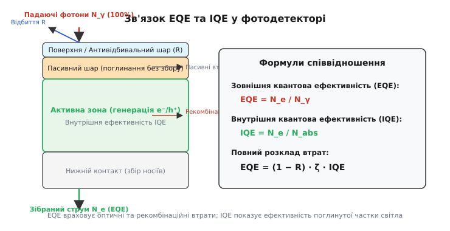
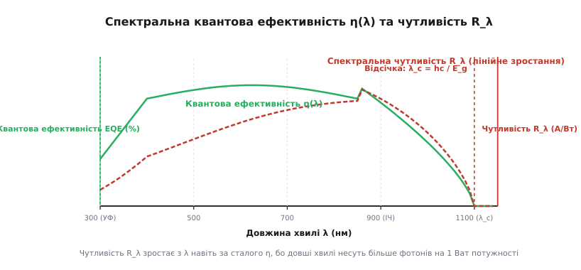
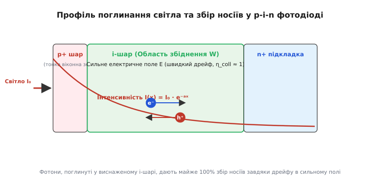
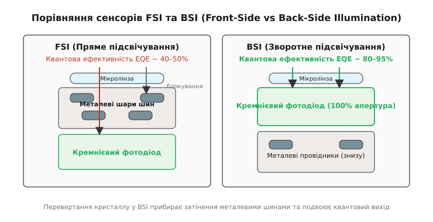

# Квантова ефективність фотодетектора

<preknowlist>
- [p-n перехід](book:physics/condensed-matter-physics/pn-junction) — область збіднення та розділення носіїв внутрішнім електричним полем.
- [Напівпровідники](book:physics/condensed-matter-physics/semiconductor) — ширина забороненої зони, генерація та рекомбінація пар електрон-дірка.
- [Повне внутрішнє відбиття](book:physics/optics/total-internal-reflection) — відбиття та заломлення світла на межі середовищ.
</preknowlist>

Коли на матрицю цифрової камери падає потік із мільйона фотонів світла від віддаленої зірки, зчитувальна електроніка сенсора реєструє не мільйон електронів, а лише близько вісімсот тисяч. Решта двісті тисяч квантів безслідно зникають: частина відбивається від скляної поверхні, частина поглинається у пасивних захисних шарах без утворення струму, а частина згенерованих електронів рекомбінує з дірками ще до того, як дістається електродів. Частка вхідних фотонів, яку приймач зумів перетворити на зібрані носії електричного заряду, визначає підсумкову граничну чутливість будь-якого оптичного приладу. Цю фундаментальну міру досконалості називають **квантовою ефективністю** (*quantum efficiency*, QE або `η`).

### Зовнішня та внутрішня квантова ефективність

Процес реєстрації світла фотодетектором складається із трьох послідовних етапів: проникнення світла у кристал, поглинання фотона з утворенням рухливої пари електрон-дірка та транспортування носіїв до зовнішнього кола. На кожному з цих етапів виникають неминучі фізичні втрати. Щоб розділити оптичні якості поверхні та внутрішню ефективність напівпровідникового матеріалу, в оптиці та напівпровідниковій фізиці строго розрізняють два поняття квантового виходу.

**Зовнішня квантова ефективність** (*External Quantum Efficiency*, EQE, `η_ext`) визначається як відношення кількості зібраних у зовнішньому колі електронів `N_e` до **загальної кількості фотонів** `N_γ`, що впали на вхідну поверхню детектора:

```
EQE = N_e / N_γ
```

EQE — це повна інженерна характеристика пристрою. Вона враховує геть усе: оптичне відбиття від вхідного вікна, паразитна затіненість металевими шинами, поглинання у нечутливих поверхневих шарах та рекомбінацію носіїв у товщі кристала.

**Внутрішня квантова ефективність** (*Internal Quantum Efficiency*, IQE, `η_int`) визначається як відношення кількості зібраних електронів `N_e` лише до тієї кількості фотонів `N_abs`, які **дійсні були поглинуті** в активній (чутливій) зоні детектора:

```
IQE = N_e / N_abs
```

Внутрішня ефективність показує, наскільки якісно напівпровідниковий кристал та його внутрішнє електричне поле розділяють згенеровані носії й доправляють їх до контактів. Якщо напівпровідник не має поверхневих дефектів, а електричне поле у виснаженій зоні достатньо сильне, IQE може досягати майже 100% (або 1.0).


*Зовнішня квантова ефективність (EQE) враховує оптичні втрати на відбиття (R) та поглинання в пасивних шарах, тоді як внутрішня (IQE) описує перетворення фотонів безпосередньо в активній зоні.*

Зв'язок між зовнішньою та внутрішньою ефективністю описується множенням трьох факторів:

```
EQE = (1 − R) · ζ · IQE
```

де:
- `R` — коефіцієнт оптичного відбиття від вхідної поверхні детектора,
- `ζ` — частка фотонів, поглинута саме в активній робочій області (а не у dead-шарах чи підкладці),
- `IQE` — внутрішній квантовий вихід активної зони.

> 🔧 **Навіщо це.** Квантова ефективність є головним параметром при розрахунку відношення сигнал/шум оптичних систем. У космічній астрономії, медичній томографії та оптоволоконній лінії зв'язку збільшення EQE сенсора з 40% до 80% еквівалентне подвоєнню потужності передавача або діаметра телескопа. Якщо квантова ефективність мала, слабкий оптичний сигнал просто потоне у тепловому й дробовому шумах детектора.

### Спектральна чутливість та зв'язок із квантовим виходом

У лабораторних вимірюваннях і документації на фотодіоди часто вказують не відсотки квантової ефективності, а **спектральну чутливість** `R_λ` (*responsivity*), яка вимірюється в амперах вихідного фотоструму на один ват падаючої оптичної потужності (А/Вт).

Розглянемо монохроматичний пучок світла з довжиною хвилі `λ` та оптичною потужністю `P_in`. Енергія кожного фотона дорівнює `E_γ = h·c / λ`. Оскільки потужність — це енергія за секунду, потік вхідних фотонів за секунду становить `N_γ = P_in / E_γ = (P_in · λ) / (h · c)`.

Згенерований фотострум `I_ph` дорівнює добутку кількості зібраних за секунду електронів `N_e = EQE · N_γ` на елементарний заряд `e`:

```
I_ph = e · EQE · N_γ
     = (e · EQE · P_in · λ) / (h · c)
```

Розділивши фотострум `I_ph` на оптичну потужність `P_in`, отримуємо зв'язок між спектральною чутливістю `R_λ` та квантовою ефективністю `EQE` (позначеною далі як `η`):

```
R_λ = I_ph / P_in
    = (e · η · λ) / (h · c)
    ≈ (η · λ_мкм) / 1.240    [у А/Вт]
```

Ця формула розкриває дивовижний парадокс, який недосвідченому дослідникові здається помилкою. Якщо квантова ефективність `η` фотодіода є абсолютно сталою (наприклад, `η = 80%` на всіх довжинах хвиль), то спектральна чутливість `R_λ` у А/Вт **зростає лінійно** із ростом довжини хвилі `λ`.


*За сталої квантової ефективності η спектральна чутливість R_λ зростає лінійно з довжиною хвилі, оскільки на один ват оптичної потужності припадає більше фотонів меншої енергії. На довжині хвилі відсічки λ_c чутливість стрімко падає до нуля.*

Причина полягає у корпускулярній природі світла. Потужність у 1 Ват вимірює сумарну енергію за секунду. Червоний фотон (800 нм) несе вдвічі менше енергії, ніж ультрафіолетовий фотон (400 нм). Отже, 1 Ват червоного світла містить **у два рази більше фотонів**, ніж 1 Ват ультрафіолету. Якщо детектор однаково ефективно перетворює кожен фотон на один електрон (`η = const`), то червоне світло згенерує у два рази більший фотострум.

З детальною математикою перетворення одиниць потужності у потік фотонів можна ознайомитися у вставці [математичний вивід спектральної чутливості та зв'язку з енергією фотона](book:physics/optics/quantum-efficiency/math-responsivity-derivation.md).

### Фізичні механізми втрат квантової ефективності

Чому реальні фотодетектори не досягають 100% квантової ефективності на всіх довжинах хвиль? Втрати фотонів і носіїв зумовлені трьома основними фізичними механізмами.

#### 1. Оптичне відбиття та ефекти межі
Кремній та більшість напівпровідників мають високий показник заломлення (`n ≈ 3.5–4.0` у видимому діапазоні). За формулами Френеля коефіцієнт відбиття від перпендикулярного падаючого променя на межі «повітря — кремній» становить:

```
R = ((n − 1) / (n + 1))²
  = ((3.8 − 1) / (3.8 + 1))²
  ≈ 0.34    (34%)
```

Без спеціального оброблення поверхні третина вхідних фотонів просто відбивається назад у повітря, обмежуючи стелю EQE значенням 66%. Для боротьби з відбиттям на поверхню нанесено антивідбивальне покриття (*Anti-Reflection Coating*, ARC) із диелектрика (Si₃N₄, TiO₂ або SiO₂) товщиною `d = λ / (4 n_arc)`. Проте просвітлення працює ідеально лише у вузькій смузі довжин хвиль; на краях спектра відбиття знову зростає.

У сучасних високоточних дететорах застосовують багатошарові градієнтні покриття або субхвильове текстурування поверхні (структури «око молі» / *moth-eye nanostructures*), які зменшують коефіцієнт відбиття `R` до менше ніж 0.5% у широкому спектральному діапазоні.

#### 2. Зонна структура матеріалу та прямі й непрямі переходи
Матеріал напівпровідника визначає, як саме фотон поглинається у кристалічній ґратці. У напівпровідниках із **прямою забороненою зоною** (наприклад, арсенід галію GaAs або InGaAs) мінімум зони провідності та максимум валентної зони розташовані при однаковому імпульсі електрона `k = 0`. Поглинання фотона відбуваються миттєво без участі фононів (коливань ґратки). Коефіцієнт поглинання `α` у прямозонних матеріалах є дуже високим (`α > 10⁴ см⁻¹`), тому шару товщиною всього 1–2 мкм достатньо для поглинання 99% світла.

У напівпровідниках із **непрямою забороненою зоною** (кремній Si, германій Ge) електрону для переходу в зону провідності потрібен додатковий імпульс, який дає фонон. Імовірність такого тричастинкового процесу (фотон + електрон + фонон) значно нижча. Через це коефіцієнт поглинання кремнію в ближньому інфрачервоному діапазоні є відносно малим (`α ≈ 10²–10³ см⁻¹`). Щоб поглинути інфрачервоний фотон з довжиною хвилі 1000 нм, кремнієвий фотодіод повинен мати товщину активного шар `W` від 50 до 100 мкм.

#### 3. Поглинання світла та довжина хвилі відсічки
Щоб створити пару електрон-дірка у напівпровіднику, енергія фотона `E_γ = hc / λ` повинна перевищувати ширину забороненої зони `E_g`. Це задає фундаментальну **довжину хвилі відсічки** `λ_c`:

```
λ_c = (h · c) / E_g ≈ 1.240 / E_g(еВ)    [у мкм]
```

Для кремнію (`E_g = 1.12 еВ` при 300 K) відсічка настає на `λ_c ≈ 1100 нм`. Світло з більшою довжиною хвилі (наприклад, 1310 нм або 1550 нм, яке використовується в оптичному зв'язку) не здатне збудити електрон через заборонену зону. Для таких фотонів кремній є абсолютно прозорим матеріалом, а його квантова ефективність дорівнює нулю. Для роботи в ІЧ-діапазоні застосовують матеріали з вужчою забороненою зоною, зокрема германій (`E_g = 0.66 еВ`, `λ_c ≈ 1800 нм`) або потрійне з'єднання InGaAs (`E_g = 0.75 еВ`, `λ_c ≈ 1650 нм`).

Температура кристала також впливає на довжину хвилі відсічки. При нагріванні ширина забороненої зони напівпровідника зменшується (законом Варшні), що зсуває межу відсічки `λ_c` у довгохвильовий бік. При охолодженні (наприклад, рідким азотом до 77 K) `E_g` зростає, і межа відсічки зміщується у короткохвильовий бік.

Поблизу межі відсічки коефіцієнт поглинання `α(λ)` паде до низьких значень. Глибина поглинання `x_α = 1 / α` зростає від 0.1 мкм для синього світла до 100 мкм для інфрачервоного. Якщо активна зона детектора є тоншою за глибину поглинання, фотони проходять крізь кристал наскрізь без поглинання.


*Світло експоненційно згасає в глибину напівпровідника. Носії, утворені в зоні збіднення (i-шарі), миттєво розділяються сильним полем і дрейфують до контактів із майже 100% ефективністю; носії з нейтральних областей мають дифундувати, ризикуючи рекомбінувати.*

#### 4. Поверхнева та об'ємна рекомбінація носіїв
Короткохвильове випромінювання (ультрафіолет та синє світло, 300–450 нм) має величезний коефіцієнт поглинання (`α > 10⁵ см⁻¹`). Поглинання відбувається у вузькому поверхневому шарі товщиною у кілька десятків нанометрів.

Поверхня кристала завжди насичена обірваними зв'язками кристалічної ґратки та дефектами, які слугують центрами швидкої рекомбінації Шокли — Рида — Холла (SRH). Якщо згенерована пара електрон-дірка виникла біля самої поверхні поза областю сильного електричного поля, вона рекомбінує за пікосекунди, не встигнувши дістатися виснаженого i-шару. Це викликає різкий спад квантової ефективності в ультрафіолетовій області спектра.

Для зменшення поверхневої рекомбінації застосовують пасивацію поверхні диелектриками (пасивуючі шари SiO₂ або Al₂O₃) та створюють вбудовані тягнучі електричні поля за рахунок градієнта легування.

### Вплив EQE на шуми та питому виявну здатність (D*)

Квантова ефективність є фундаментальним чинником, що визначає граничні шумові характеристики оптичного приймача. Дробовий шум оптичного сигналу (*photon shot noise*) підпорядковується статистиці Пуассона. Для потоку з `N_γ` фотонів середньоквадратична флуктуація кількості фотонів дорівнює `ΔN_γ = √N_γ`.

Відношення сигнал/шум (SNR — *Signal-to-Noise Ratio*) оптичного випромінювання до реєстрації дорівнює:

```
SNR_photons = N_γ / √N_γ = √N_γ
```

Після перетворення у детекторі з квантовою ефективністю `EQE` кількість зібраних електронів дорівнює `N_e = EQE · N_γ`, а дробовий шум струму становить `ΔN_e = √N_e = √(EQE · N_γ)`. Відношення сигнал/шум зареєстрованого електронного сигналу зменшується:

```
SNR_electrons = (EQE · N_γ) / √(EQE · N_γ)
              = √(EQE · N_γ)                     [спрощення дробу: A / √A = √A]
              = √(EQE) · √N_γ                    [розклад кореня добутку]
              = √(EQE) · SNR_photons             [підстановка визначення SNR_photons = √N_γ]
```

З цієї рівності випливає ключовий висновок: **відношення сигнал/шум на виході детектора пропорційне квадратному кореню з квантової ефективності**. Зменшення EQE з 100% до 25% погіршує сигнал/шум у 2 рази, що вимагає чотириразового збільшення часу накопичення експозиції для досягнення тієї самої точності вимірювання.

Для порівняння різних типів фотодетекторів використовують параметр **питомої виявної здатності** `D*` (*Specific Detectivity*, вимірюється в см·Гц¹/²/Вт або Джонсах):

```
D* = (√(A · Δf)) / NEP
```

де `A` — площа детектора, `Δf` — смуга частот вимірювання, а `NEP` — еквівалентна потужність шуму (*Noise Equivalent Power*). Виразивши `NEP` через чутливість `R_λ` та темновий струм `I_d`, отримуємо прямо пропорційну залежність `D*` від квантової ефективності `EQE`:

```
D* = (e · EQE · λ) / (h · c · √(2 · e · I_d + 4 · k · T / R_L))
```

Отже, високе значення квантової ефективності прямо збільшує питому виявну здатність приладу, дозволяючи бачити надслабкі оптичні сигнали на тлі темнового струму та теплових шумів.

### Залежність EQE від архітектури детектора

За півстоліття розвитку фотоніки інженери створили кілька фундаментальних типів фотодетекторів, кожен з яких пропонує свій спосіб досягнення максимального квантового виходу.

| Тип фотодетектора | Робочий діапазон | Пікова EQE | Основні чинники обмеження EQE |
| :--- | :--- | :--- | :--- |
| **Вакуумний ФЕУ (PMT)** | 200–850 нм | 20–40% | Потенціальний бар'єр виходу у вакуум, відбиття фотокатода |
| **Кремнієвий PIN-фотодіод** | 400–1000 нм | 80–90% | Оптичне відбиття поверхні, поверхнева рекомбінація в УФ |
| **InGaAs PIN-фотодіод** | 900–1700 нм | 85–95% | Якість антивідбивального покриття, темнові струми |
| **FSI CMOS-сенсор** | 400–700 нм | 35–50% | Затінення металевими шинами провідників (малий fill factor) |
| **BSI CMOS-сенсор** | 400–900 нм | 80–95% | Втрати на рекомбінацію на утоньшеній зворотній поверхні |

#### Матриці зображення: FSI проти BSI
Особливо яскраво еволюція квантового виходу простежується в матрицях цифрових камер. У класичних матрицях із переднім підсвічуванням (FSI — *Front-Side Illuminated*) світло мусило проходить крізь багаторівневий «лабіринт» металевих провідників. Шини затіняли значну частку площі фотодіода, знижуючи апертурний коефіцієнт (fill factor).


*У сенсорах із зворотним підсвічуванням (BSI) світло потрапляє безпосередньо на кремнієвий фотодіод, оминаючи металеві провідники. Це ліквідує затінення й підвищує квантову ефективність із 40–50% до 80–95%.*

У технології зворотного підсвічування (BSI — *Back-Side Illuminated*) кремнієву підкладку хімічно сточують до товщини у кілька мікрометрів і повертають кристал зворотною стороною до світла. Фотони потрапляють безпосередньо в область збіднення фотодіода, а металеві шини опиняються знизу. Для ізоляції сусідніх пікселів у BSI-матрицях створюють глибокі кремнієві канавки (*Deep Trench Isolation*, DTI), які запобігають оптичному та електричному перехресному наведенню (optical cross-talk), підтримуючи чіткість зображення.

#### Наукові сенсори sCMOS та EMCCD
У науковій астрономії та біофізичній флуоресцентній мікроскопії застосовують наукові матриці sCMOS (*scientific CMOS*) та EMCCD (*Electron-Multiplying CCD*). Завдяки поєднанню технології BSI з глибоким термоелектричним охолодженням кристала (до −80 °C) та оптимізованими колірними мікролінзами, EQE наукових sCMOS сенсорів досягає 95% у піку (на довжині хвилі 550 нм).

#### Лавинні фотодіоди (APD) та однофотонні матриці (SPAD)
У звичайних p-i-n фотодіодах кожен поглинутий фотон дає не більше одного електрона (`IQE ≤ 1`). У лавинних фотодіодах (*Avalanche Photodiode*, APD) на p-n перехід подають високу зворотну напругу, близьку до пробою. Згенерований фотоном електрон прискорюється в сильному електричному полі до кінетичної енергії, достатньої для ударної іонізації атомів ґратки.

В результаті виникає внутрішнє лавинне помноження з коефіцієнтом підсилення `M = 100–1000`. Хоча первинна квантова ефективність первинного утворення носіїв `EQE_1` лишається меншою за 100%, підсумковий струмовий вихід зростає у `M` разів, що дозволяє реєструвати надслабкі імпульси світла. Однофотонні лавинні діоди (SPAD), які працюють у режимі Гейгера, реєструють поодинокі кванти світла з ефективністю виявлення фотонів (PDE — *Photon Detection Efficiency*) понад 70–80%.

#### Сонячні елементи та квантова ефективність
Сонячна батарея є великим за площею фотодіодом, оптимізованим для перетворення широкого сонячного спектра (AM1.5) у постійний струм. Для сонячних елементів інтегральна квантова ефективність задає максимально можливий струм короткого замикання `J_sc`:

```
J_sc = e · ∫ EQE(λ) · Φ_AM1.5(λ) dλ
```

де `Φ_AM1.5(λ)` — спектральна густина потоку фотонів сонячного випромінювання на поверхні Землі. Для досягнення максимуму ККД сонячного елемента розробники прагнуть утримувати `EQE(λ) > 90%` у всьому діапазоні від 350 нм до 1100 нм.

Докладніше про історичний шлях від перших вакуумних фотокатодів до сучасних BSI CMOS-матриць та SPAD читайте у вставці [історія розвитку фотодетекторів від фотокатодів до BSI-матриць](book:physics/optics/quantum-efficiency/hist-photocathode-to-cmos.md).

Для числового розрахунку спектрів квантової ефективності та чутливості з конкретними параметрами напівпровідника дивіться вставку [моделювання спектра квантової ефективності](book:physics/optics/quantum-efficiency/proj-qe-simulator.md).

---

Квантова ефективність є фундаментальним вимірником досконалості оптичного детектора, який зв'язує квантову природу світла із макроскопічним електричним струмом. Вона ділиться на зовнішню (EQE), що враховує відбиття від поверхні та пасивне поглинання, та внутрішню (IQE), яка описує ефективність збору носіїв у самому кристалі. Спектральна чутливість `R_λ` (в А/Вт) пропорційна добутку `EQE · λ`, оскільки довгохвильові фотони мають меншу енергію, даючи більше квантів на одиницю потужності. Потрійний контроль над оптичним відбиттям, товщиною виснаженого шару та поверхневою рекомбінацією дозволив сучасним BSI-матрицям та p-i-n фотодіодам перетворювати до 95% падаючих фотонів на корисний сигнал.
