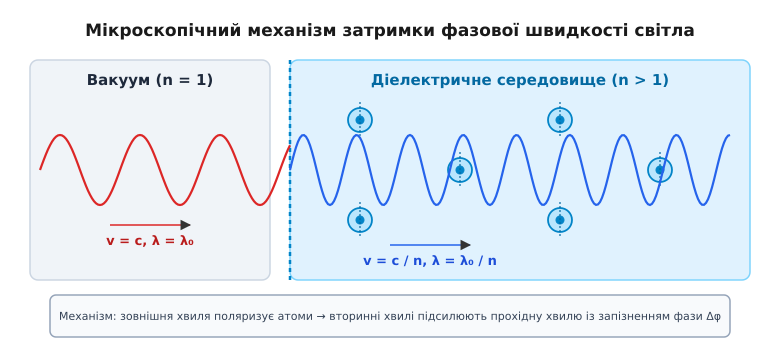
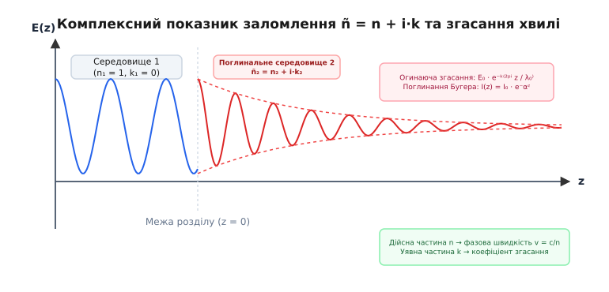
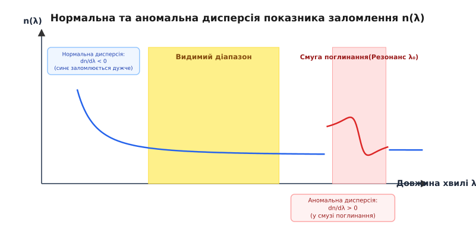
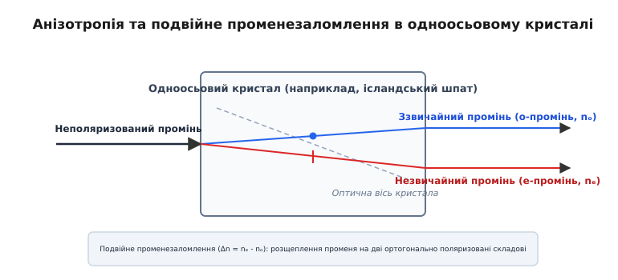

# Показник заломлення

<preknowlist>
- [Закон Снелла](book:physics/optics/snells-law) — зв'язок між кутами падіння й заломлення та оптичною щільністю середовищ.
- [Електромагнітна хвиля](book:physics/electromagnetism/em-wave) — поширення коливань електричного й магнітного полів у просторі.
- [Діелектрична проникність](book:physics/electromagnetism/dielectric-constant) — відгук макроскопічного середовища на зовнішнє електричне поле.
- [Поляризація діелектриків](book:physics/electromagnetism/electric-polarization) — зміщення зв'язаних зарядів атома під дією зовнішнього поля.
</preknowlist>

У сучасних високошвидкісних волоконно-оптичних лініях зв'язку стандартний оптичний імпульс із довжиною хвилі `1550` нм долає `10` кілометрів світловодної жили з кварцового скла приблизно за `49` мікросекунд — на `16` мікросекунд довше, ніж світло подолало б таку ж відстань у вакуумі. Якщо інженер при розрахунку хроматичної дисперсії чи виготовленні інтегральних фотонних хвилеводів припуститься помилки у визначенні фазової затримки хвилі хоча б на `0.001`, фазова неузгодженість повністю зруйнує міжсимвольну синхронізацію у каналі передачі даних зі швидкістю `100` Гбіт/с. Описувана уповільненням фазової швидкості фундаментальна характеристика оптичного середовища — показник заломлення (від латинського *refractio* — розлом, відхилення) — визначає не лише кутовий зсув світлового променя при заломленні, а й поглинання, розсіювання, дисперсію та нелінійні взаємодії світла з речовиною.


*Мікроскопічний механізм уповільнення світлової хвилі: зовнішнє електромагнітне поле поляризує зв'язані електрони атомів, а суперпозиція падаючої хвилі та вторинних хвиль формує результуючу хвилю зі зменшеною фазовою швидкістю v = c / n.*

## Мікроскопічна природа затримки та фазова швидкість

У вакуумі електромагнітні хвилі поширюються з фундаментальною фізичною константою — швидкістю світла `c ≈ 299 792 458` м/с. Коли світло потрапляє в матеріальне прозоре середовище (газ, рідину чи тверде тіло), його фазова швидкість `v` зменшується. Абсолютним показником заломлення `n` називають безрозмірне відношення швидкості світла у вакуумі `c` до фазової швидкості хвилі `v` у цьому середовищі:

```
n = c / v
```

Оскільки швидкість світла у будь-якій речовині в класичних умовах менша за швидкість у вакуумі (`v < c`), абсолютний показник заломлення завжди перевищує одиницю (`n > 1`). Для вакууму за означенням `n = 1`, для повітря за нормальних умов `n ≈ 1.00029`, для води — `1.333`, для оптичного крон-скла — `1.52`, для важкого флінтгласу — `1.65`, а для алмазу сягає `2.42`.

Поширене спрощене уявлення, ніби фотони «зіштовхуються» з атомами й тому «гальмують» у речовині, є фізично некоректним. Електромагнітна хвиля між атомами завжди поширюється зі строго константною швидкістю `c`. Сповільнення макроскопічної хвилі виникає внаслідок когерентної суперпозиції (накладання) первинної електромагнітної хвилі та вторинних хвиль, випромінюваних діелектричним середовищем.

Змінне електричне поле падаючої світлової хвилі `E(t)` діє на зв'язані електрони атомних оболонок, змушуючи їх здійснювати вимушені гармонічні коливання. Кожен такий коливальний електрон перетворюється на елементарний мікроскопічний випромінювач — перевипромінює вторинну сферичну електромагнітну хвилю тієї самої частоти, але зі зсувом фази `Δφ` відносно збуджувального поля. Відповідно до принципу Гюйгенса-Френеля, падаюча хвиля та мільярди вторинних хвиль інтерферують між собою. Результуюча сумна хвиля має той самий профіль, проте її фронт зміщується в часі назад відносно первинної хвилі у вакуумі. Око та вимірювальні прилади фіксують цей стійкий фазовий зсув як меншу фазову швидкість `v = c / n`.

У щільних середовищах на кожен електрон діє не лише макроскопічне поле `E`, а й локальне електричне поле сусідніх поляризованих атомів, яке в ізотропному наближенні описується полем Лоренца `E_local = E + P / (3 · ε₀)`. Урахування цього поля приводить до фундаментального співвідношення Лоренца-Лоренца (Clausius-Mossotti relation):

```
(n² - 1) / (n² + 2) = N · α / (3 · ε₀)
```

де `N` — концентрація атомів в одиниці об'єму, а `α` — мікроскопічна атомна поляризовність. Це співвідношення показує безпосередній зв'язок між оптичним показником заломлення речовини та її макроскопічною густиною `ρ`: питома рефракція `R = (n² - 1) / ((n² + 2) · ρ)` залишається строго постійною величиною при зміні агрегатного стану, температури чи тиску речовини. При стисненні газу або охолодженні рідини зростання густини приводить до монотонного збільшення показника заломлення `n`.

При переході світла з вакууму в середовище частота коливань `ν` (кількість циклів вектора поля за секунду) залишається строго незмінною (`ν = const`), оскільки вона задається джерелом випромінювання на межі розділу. Оскільки швидкість поширення дорівнює добутку довжини хвилі на частоту (`v = λ · ν`), зменшення швидкості призводить до пропорційного стиснення довжини хвилі в середовищі:

```
λ = v / ν = (c / n) / ν = λ₀ / n
```

де `λ₀` — довжина хвилі у вакуумі. Стиснення довжини хвилі у `n` разів змінює хвильовий вектор `k = 2π / λ = n · k₀`, що безпосередньо спричиняє заломлення світлового променя на похилій межі розділу середовищ відповідно до закону Снелла.

Докладний аналіз історіографії розвитку уявлень про оптичне заломлення від античності до електродинаміки наведено у вставці: [📜 Історія відкриття та концептуалізації показника заломлення](book:physics/optics/refractive-index/hist-refractive-index-discovery.md).

## Зв'язок із електродинамікою Максвелла та оптичною щільністю

Класична електродинаміка Максвелла пов'язує фазову швидкість поширення електромагнітної хвилі `v` із макроскопічними електромагнітними параметрами середовища — відносною діелектричною проникністю `εᵣ` та відносною магнітною проникністю `μᵣ`:

```
v = 1 / √(ε₀ · εᵣ · μ₀ · μᵣ)
```

Ураховуючи, що швидкість світла у вакуумі дорівнює `c = 1 / √(ε₀ · μ₀)`, отримуємо видатне співвідношення Максвелла для показника заломлення:

```
n = √(εᵣ · μᵣ)
```

Для більшості прозорих діелектриків у оптичному діапазоні частот відносна магнітна проникність практично дорівнює одиниці (`μᵣ ≈ 1`), оскільки атомні магнітні моменти не встигають орієнтуватися за швидкими коливаннями світлового поля (`~10¹⁴` Гц). У результаті співвідношення Максвелла спрощується до вигляду:

```
n = √εᵣ
```

Тут криється важлива тонкість, яка наприкінці XIX століття викликала тривалі дискусії. Статична діелектрична проникність води, виміряна на постійному струмі або низьких частотах, становить `εᵣ(0) ≈ 80`, що давало б `n = √80 ≈ 8.94`. Проте виміряний показник заломлення води у видимому світлі дорівнює `1.333` (`εᵣ ≈ 1.78`). Причина цієї відмінності полягає в тому, що на низьких частотах у поляризацію роблять внесок важкі дипольні молекули води, орієнтуючись уздовж поля (орієнтаційна поляризація). На оптичних частотах молекули води через свою інерційність не здатні обертатися зі швидкістю світлових коливань, тому у поляризацію `εᵣ(ω)` роблять внесок виключно легкі електронні оболонки атомів (електронна поляризація).

### Фазова та групова швидкості

Показник заломлення `n = c / v` описує фазову швидкість монохроматичної хвилі з нескінченним хвильовим цугом. Проте реальний оптичний сигнал (імпульс лазера, світловий пакет) складається із спектрального набору хвиль різних частот. Поширення обвідної (огинаючої) амплітуди цього імпульсу описується груповою швидкістю `v_g`:

```
v_g = dω / dk
```

По аналогії з фазовим показником заломлення вводять **груповий показник заломлення `n_g`**:

```
n_g = c / v_g = n(λ) - λ · (dn / dλ)
```

У середовищах із нормальною дисперсією (`dn / dλ < 0`, де показник заломлення зменшується зі зростанням довжини хвилі) груповий показник заломлення завжди більший за фазовий (`n_g > n`), отже світловий імпульс поширюється повільніше, ніж окремі фазові гребені всередині нього. Наприклад, для скла N-BK7 на довжині хвилі `589` нм фазовий показник становить `n = 1.5168`, тоді як груповий показник дорівнює `n_g = 1.5343`.

## Комплексний показник заломлення та поглинання світла

У реальних речовинах електромагнітна хвиля не лише затримується за фазою, а й втрачає енергію на нагрівання або збудження атомів (поглинання). Для одночасного опису заломлення та згасання хвилі у фізиці використовують **комплексний показник заломлення `ñ`** (від грецького *поглинання* та *фаза*):

```
ñ = n + i · k
```

де:
- `n` — дійсна частина комплексного показника заломлення, що відповідає за фазову швидкість `v = c / n` та класичне заломлення променів;
- `k` — уявна частина, звана **показником згасання (або коефіцієнтом екстинкції)**, що визначає згасання амплітуди світлової хвилі під час поширення в середовищі.


*Фізичний зміст комплексного показника заломлення ñ = n + i·k: дійсна частина n визначає стиснення довжини хвилі та фазовий зсув, уявна частина k характеризує експоненціальне згасання амплітуди хвилі E(z).*

Щоб зрозуміти фізичний зміст `k`, підставимо комплексний хвильовий вектор `k̃ = (2π / λ₀) · ñ` у рівняння плоскої монохроматичної хвилі, що поширюється вздовж осі `z`:

```
E(z, t) = E₀ · e^(i · (k̃ · z - ω · t))
        = E₀ · e^(i · ((2π / λ₀) · (n + i · k) · z - ω · t))      [підстановка k̃ = (2π / λ₀) · (n + i · k)]
        = E₀ · e^(-(2π · k / λ₀) · z) · e^(i · ((2π · n / λ₀) · z - ω · t))      [розділення дійсної та уявної частин експоненти]
```

З отриманого виразу чітко видно розділення двох ефектів:
1. Множник `e^(i · ((2π · n / λ₀) · z - ω · t))` описує гармонічні коливання з фазовою швидкістю `v = c / n`.
2. Дійсний експоненціальний множник `e^(-(2π · k / λ₀) · z)` описує згасання амплітуди електричного поля `E(z)` у міру заглиблення в середовище.

Оскільки інтенсивність світлового потоку пропорційна квадрату амплітуди напруженості електричного поля (`I ∝ |E|²`), спад інтенсивності підпорядковується закону Бугера-Ламберта-Бера:

```
I(z) = I₀ · e^(-α · z)
```

де **показник поглинання `α`** пов'язаний із показником згасання `k` співвідношенням:

```
α = 4π · k / λ₀
```

У прозорих середовищах (скло, вода у видимому діапазоні) `k` надзвичайно малий (`k ~ 10⁻⁸ ... 10⁻⁹`), тому згасанням на відстанях порядку довжини хвилі можна знехтувати. У металах через наявність вільних електронів уявна частина величезна (`k ~ 3 ... 5` для алюмінію та срібла), що призводить до повного згасання хвилі на глибині всього в кілька десятків нанометрів (скіновий шар `δ = 1 / α = λ₀ / (4π · k)`) та високого коефіцієнта відбиття.

Фізику металевого відбиття розглядають через плазмову частоту вільних електронів `ω_p = √(N_e · e² / (m · ε₀))`. Для частот нижчих за плазмову (`ω < ω_p`, що відповідає видимому діапазону для більшості металів) дійсний показник заломлення стає чисто уявним або меншим за одиницю (`n < 1`), а світлова хвиля майже повністю відбивається від поверхні без проникнення углиб.

## Дисперсія світла: залежність від довжини хвилі

Залежність показника заломлення речовини від довжини хвилі (або частоти) падаючого світла `n(λ)` називається **дисперсією світла** (від латинського *dispersio* — розсіяння, розвіювання). Саме дисперсія спричиняє розкладання білого світла в спектральну веселку при проходженні крізь скляну призму.


*Спектральні області дисперсії: у ділянках прозорості спостерігається нормальна дисперсія (dn/dλ < 0), а у вузьких смугах резонансного поглинання середовища — аномальна дисперсія (dn/dλ > 0).*

Розрізняють два типи дисперсії:

1. **Нормальна дисперсія (`dn / dλ < 0`)** — Показник заломлення монотонно зменшується зі зростанням довжини хвилі `λ`. У цій області коротке фіолетове та синє світло (`λ ≈ 400` нм) заломлюється сильніше (має більший показник `n`), ніж довше червоне світло (`λ ≈ 700` нм). Нормальна дисперсія спостерігається у всіх прозорих матеріалах у ділянках спектра, віддалених від смуг поглинання.
2. **Аномальна дисперсія (`dn / dλ > 0`)** — Показник заломлення зростає зі збільшенням довжини хвилі. Аномальна дисперсія виникає виключно всередині вузьких смуг резонансного поглинання речовини.

### Емпіричні та теоретичні формули дисперсії

Для практичного розрахунку залежності `n(λ)` оптичних стекол використовують два основних математичних наближення:

**Формула Коші (Cauchy)** — Емпіричне розкладання для оптично прозорих середовищ у видимому діапазоні:

```
n(λ) = A + B / λ² + C / λ⁴
```

де `A`, `B`, `C` — коефіцієнти Коші, що визначаються експериментально для конкретної марки скла.

**Рівняння Селмейєра (Sellmeier)** — Обґрунтоване мікроскопічною моделлю електронних осциляторів співвідношення, що зберігає точність у широкому спектральному інтервалі від УФ до ІЧ:

```
n²(λ) = 1 + (B₁ · λ²) / (λ² - C₁) + (B₂ · λ²) / (λ² - C₂) + (B₃ · λ²) / (λ² - C₃)
```

де `B₁, B₂, B₃` — безрозмірні коефіцієнти (сили осциляторів), а `C₁, C₂, C₃` — квадрати резонансних довжин хвиль поглинання середовища (у мкм²).

Математичне виведення рівняння Селмейєра з рівнянь вимушених коливань електрона Лоренца висвітлено у вставці: [🧮 Модель осцилятора Лоренца та виведення рівняння Селмейєра](book:physics/optics/refractive-index/math-dispersion-lorentz-oscillator.md).

Практичний алгоритм обчислення залежності `n(λ)`, групового показника `n_g` та параметра хроматичної дисперсії `D` мовами C та C++ наведено у вставці: [⚙️ Практичний розрахунок дисперсії та групового показника заломлення](book:physics/optics/refractive-index/proj-dispersion-calculator.md).

### Коефіцієнт Аббе та хроматична аберація

Для характеристики дисперсійних властивостей оптичного скла в канонічному видимому діапазоні використовують **число Аббе (число дисперсії) `V_d`**:

```
V_d = (n_d - 1) / (n_F - n_C)
```

де `n_d`, `n_F`, `n_C` — показники заломлення скла на трьох стандартних спектральних лініях:
- `n_d` — гелієва жовта лінія (`λ_d = 587.56` нм);
- `n_F` — воднева синя лінія (`λ_F = 486.13` нм);
- `n_C` — воднева червона лінія (`λ_C = 656.27` нм).

Скло з високим числом Аббе (`V_d > 50`, наприклад, крон-скло) має низьку дисперсію. Скло з малим числом Аббе (`V_d < 50`, наприклад, флінтглас) володіє сильною дисперсією. Поєднуючи в лінзовому дуплеті (ахроматі) одну збиральну лінзу з крону та одну розсіювальну з флінту, оптичні інженери повністю усувають хроматичну аберацію для двох вибраних довжин хвиль.

## Анізотропія, подвійне променезаломлення та нелінійні ефекти

У ізотропних середовищах (гази, рідини, аморфне скло, кристали кубічної симетрії) показник заломлення однаковій за всіма напрямками поширення та поляризації світла. Проте у кристалах зі зниженою симетрією (апатит, кварц, ісландський шпат `CaCO₃`) виникає оптична **анізотропія** (від грецького *anisos* — нерівний та *tropos* — напрямок).


*Розщеплення світлового променя при вході в анізотропний кристал ісландського шпату на звичайний (o) та незвичайний (e) промені з різними показниками заломлення nₒ та nₑ.*

Управління світловими потоками в анізотропних кристалах базується на оптичній індикатрисі — тривимірному еліпсоїді показників заломлення. Для одноосьового кристала еліпсоїд має вісь симетрії (головна оптична вісь), і світлова хвиля розщеплюється на два ортогонально поляризовані промені:

1. **Звичайний промінь (ordinary ray, o-промінь)** — Напрямок вектора напруженості електричного поля перпендикулярний до головної оптичної осі кристала. Його фазова швидкість однакова в усіх напрямках і описується сталим показником заломлення `n_o`.
2. **Незвичайний промінь (extraordinary ray, e-промінь)** — Вектор електричного поля лежить у площині, що містить оптичну вісь. Його показник заломлення `n_e(θ)` залежить від кута `θ` між нормаллю хвилі та оптичною віссю кристала.

Величина `Δn = n_e - n_o` називається показником подвійного променезаломлення. Для ісландського шпату `Δn = -0.172` (сильний негативний кристал), для кварцу `Δn = +0.009` (позитивний кристал).

### Термооптичний ефект та температура середовища

Показник заломлення залежить від температури середовища `T`, що описується термооптичним коефіцієнтом `dn / dT`.

У більшості оптичних стекол зростання температури призводить до зміщення УФ-смуг поглинання у довгохвильову область, що підвищує поляризовність та спричиняє додатній коефіцієнт `dn / dT ≈ +3·10⁻⁶ ... +8·10⁻⁶` K⁻¹. У рідинах (вода, спирт, бензол) головним чинником є теплове розширення об'єму (зменшення густини `ρ`), що призводить до сильного від'ємного коефіцієнта `dn / dT ≈ -1·10⁻⁴ ... -5·10⁻⁴` K⁻¹.

У потужних лазерних системах нерівномірне нагрівання скляної лінзи лазерним пучком створює радіальний градієнт показника заломлення — ефект **термолінзування (thermal lensing)**, який спотворює хвильовий фронт і обмежує граничну потужність лазера.

### Нелінійні та керовані ефекти

Під дією зовнішніх полів або надпотужного лазерного випромінювання показник заломлення середовища може динамічно змінюватися:

- **Електрооптичний ефект Поккельса (Pockels effect)** — Зміна показника заломлення кристала, прямо пропорційна прикладеному зовнішньому постійному електричному полю `E_ext`: `Δn ∝ E_ext`. Використовується в надшвидких затворах та оптичних modulators для оптичного зв'язку.
- **Оптичний ефект Керра (Kerr effect)** — Зміна показника заломлення під дією інтенсивності світла:
  ```
  n(I) = n₀ + n₂ · I
  ```
  де `n₀` — лінійний показник заломлення, `n₂` — нелінійний оптичний коефіцієнт, `I` — інтенсивність світлового поля. У потужних лазерних пучках через ефект Керра виникає **самофокусування світла**, коли центральна найінтенсивніша частина пучка створює в склі оптичний аналог збиральної лінзи.
- **Фотопружність (Piezo-optic effect)** — Зміна показника заломлення середовища під дією механічного напруження чи деформації `Δn = C · σ`, що застосовується в акустооптичних дефлекторах для керування лазерним променем за допомогою ультразвукових хвиль.
- **Оптичні метаматеріали з негативним показником (`n < 0`)** — Штучно створені композитні структури, у яких діелектрична та магнітна проникності одночасно від'ємні (`ε_r < 0`, `μ_r < 0`). У таких середовищах вектор фазової швидкості спрямований протилежно вектору Пойнтінга (перенесення енергії), а заломлений промінь відхиляється по той самий бік від нормалі, що й падаючий.

Специфікацію, конструкцію та оптичний інтерфейс сучасних промислових рефрактометрів, призначених для точного вимірювання показника заломлення рідких речовин, деталізовано у вставці: [📋 Інтерфейс та оптична специфікація цифрового рефрактометра](book:physics/optics/refractive-index/api-refractometer-specs.md).

## Методи вимірювання показника заломлення

Для вимірювання показників заломлення твердих тіл, рідин та газів у фізиці та техніці використовують декілька фундаментальних оптичних методів:

1. **Метод гоніометрії (призмовий метод)** — Вимірювання кута найменшого відхилення `δ_min` променя, що проходить крізь трикутну призму з досліджуваного скла з відомим заломлювальним кутом `A`. Показник заломлення обчислюють за формулою `n = sin((A + δ_min) / 2) / sin(A / 2)`. Цей метод є первинним метрологічним еталоном із точністю до `1·10⁻⁶`.
2. **Рефрактометрія граничного кута (прилад Аббе та Пульфриха)** — Вимірювання граничного кута повного внутрішнього відбиття `θ_c` на межі сапфірової вимірювальної призми з відомим показником заломлення `n_prism`. Дозволяє швидко визначати `n` рідких проб об'ємом всього в кілька крапель.
3. **Еліпсометрія** — Вимірювання зміни стану поляризації (амплітудного співвідношення `tan Ψ` та різниці фаз `Δ`) плоскополяризованого світла при відбитті від поверхні. Еліпсометрія є основним методом для визначення товщини та комплексного показника заломлення `n + i·k` нанорозмірних напівпровідникових плівок у мікроелектроніці.
4. **Оптична когерентна томографія (OCT) та інтерферометрія** — Вимірювання оптичної довжини шляху `L = n · d` за допомогою інтерферометра Майкельсона або Маха-Цендера, що дає можливість безконтактно картувати показник заломлення живих біологічних тканин з мікронним просторовим розділенням.

## Практичний приклад розрахунку

**Розрахуємо фазову швидкість, довжину хвилі, фазову затримку та груповий показник заломлення у пластині зі скла N-BK7 для жовтої лінії натрію.**

Параметри задачі:
- Двоо опукла пластина зі скла Schott N-BK7 товщиною `d = 20.0` мм (`0.02` м).
- Довжина хвилі у вакуумі `λ₀ = 589.3` нм (`0.5893` мкм).
- Показник заломлення скла N-BK7 на цій довжині хвилі `n = 1.51680`.
- Перша похідна показника заломлення по довжині хвилі `dn / dλ = -0.02968` мкм⁻¹.
- Швидкість світла у вакуумі `c = 299 792 458` м/с.

```
1. Фазова швидкість світла у склі:
   v = c / n
     = 299 792 458 / 1.51680
     = 197 647 981.3 м/с                         [v ≈ 1.9765 · 10⁸ м/с]

2. Довжина хвилі світла всередині скла:
   λ = λ₀ / n
     = 589.3 / 1.51680
     = 388.515 нм                                [стиснення хвилі]

3. Час проходження пластини товщиною d = 20 мм:
   t_glass = d / v
           = 0.02 / 197 647 981.3
           = 1.01190 · 10⁻¹⁰ с (101.190 пс)

   Час подолання тієї ж відстані у вакуумі:
   t_vac = d / c
         = 0.02 / 299 792 458
         = 6.67128 · 10⁻¹¹ с (66.713 пс)

   Фазова часова затримка:
   Δt = t_glass - t_vac
      = 101.190 - 66.713
      = 34.477 пс

4. Обчислення групового показника заломлення n_g:
   n_g = n - λ₀ · (dn / dλ)
       = 1.51680 - (0.5893 мкм) · (-0.02968 мкм⁻¹)
       = 1.51680 + 0.01749
       = 1.53429                                 [n_g > n через нормальну дисперсію]

   Групова швидкість світлового імпульсу:
   v_g = c / n_g
       = 299 792 458 / 1.53429
       = 195 394 943 м/с
```

Висновок: Проходження крон-скла товщиною `20` мм затримує світловий фронт на `34.477` пікосекунди відносно вакууму, а світловий імпульс поширюється зі швидкістю `v_g`, яка на `1.14%` менша за фазову швидкість `v`.

> 🔧 **Навіщо це.**
> Показник заломлення — не просто абстрактна числова характеристика з таблиці фізичних величин, а ключовий розрахунковий інженерний параметр у фотонній індустрії. Волокнисті світловоди (Optical Fibers) утримують лазерне світло всередині центральної жили діаметром `9` мкм завдяки ефекту повного внутрішнього відбиття, підбираючи показники заломлення жили (`n_core ≈ 1.448`) та оболонки (`n_cladding ≈ 1.444`) з точністю до чотирьох знаків після коми. Нанесення тонкоплівкових просвітлювальних покриттів (Anti-Reflective Coatings) на лінзи об'єктивів базується на виборі матеріалу з показником заломлення `n_film = √(n_glass)`, що забезпечує деструктивну інтерференцію відбитого світла та підвищує світлопропускання оптичних систем до `99.9%`. У біосенсорах та медицині цифровий рефрактометричний аналіз дозволяє за лічені секунди визначати концентрацію білків у сироватці крові або масову частку цукру в пробах без хімічних реагентів.
