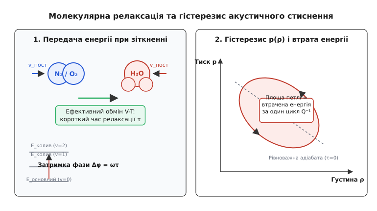
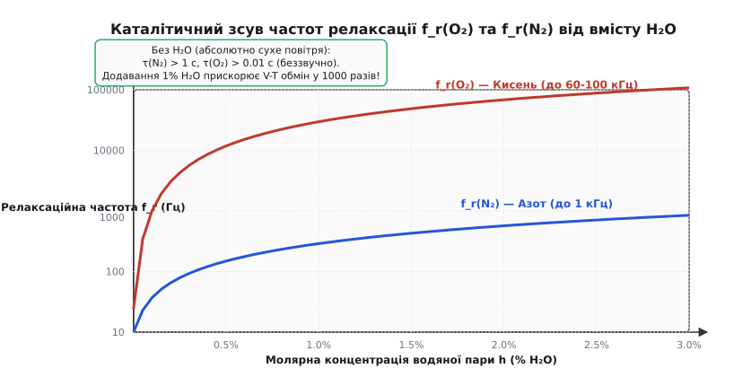
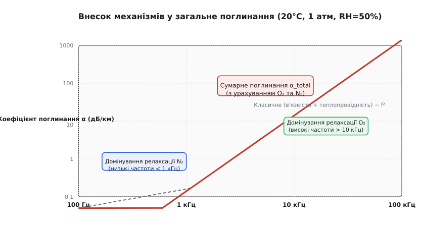
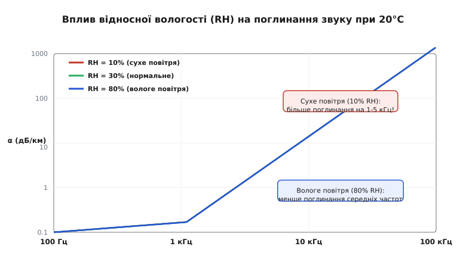

# Поглинання звуку в повітрі

<preknowlist>
- [Хвильове рівняння](book:physics/wave-equation) — рівняння поширення збурень у середовищі.
- [В'язкість](book:physics/viscosity) — внутрішнє тертя між шарами рідини або газу.
- [Рівняння Нав'є — Стокса](book:physics/navier-stokes) — закони руху в'язкого суцільного середовища.
- [Ступені вільності](book:physics/degrees-of-freedom) — класичний та квантовий розподіл енергії молекул.
- [Загасаючі коливання](book:physics/damped-oscillator) — дисипація енергії та коефіцієнт згасання.
</preknowlist>

Акустичний сигнал високої частоти 10 кГц, випромінений у відкрите повітря за температури 20 °C та відносної вологості 50%, втрачає понад 90% своєї звукової енергії вже на перших 100 метрах шляху (згасання становить близько 25 дБ/км), тоді як низькочастотне гудіння з частотою 100 Гц на тій самій відстані втрачає менше 1% енергії і чути на кілометри. Цей колосальний дисбаланс між високими та низькими частотами виникає через те, що реальне повітря є дисипативною системою, у якій впорядкована кінетична енергія звукової хвилі незворотно перетворюється на тепло. Процес поглинання звуку в атмосфері визначається не лише класичним термям газу, а й квантовою взаємодією між коливальними рухами двоатомних молекул кисню та азоту й молекулами водяної пари.

## Дисипація акустичної енергії та закон згасання

Коли акустична хвиля поширюється у газі, вона викликає періодичні локальні коливання тиску `p'`, густини `ρ'` та масової швидкості частинок `v`. В ідеальному стисливому газі без тертя та теплообміну ці коливання відбувалися б строго адіабатично: стиснення збільшувало б внутрішню енергію газу, а наступне розширення повністю повертало б її у механічну хвилю без найменших втрат.

У реальному середовищі з'являються незворотні термодинамічні процеси, які розсіюють акустичну енергію. Зменшення амплітуди звукового тиску `p(x)` вздовж осі поширення `x` описується експоненційним законом Ламберта — Бера:

```
p(x) = p₀ · exp(-α · x)      [експоненційний закон згасання тиску]
```

де `p₀` — амплітуда звукового тиску у вихідній точці (`x = 0`), `α` — повний коефіцієнт поглинання звуку, вимірюваний у Неперах на метр (Np/м).

Оскільки інтенсивність звукової хвилі `I` пропорційна квадрату звукового тиску (`I ∝ p²`), згасання інтенсивності відбувається вдвічі швидше:

```
I(x) = I₀ · exp(-2·α · x)      [згасання інтенсивності хвилі]
```

В інженерній практиці та акустичних вимірюваннях амплітуду згасання зручніше виражати у логарифмічних одиницях — децибелах на кілометр (дБ/км) або децибелах на метр (дБ/м). Зв'язок між логарифмічним коефіцієнтом `a` у дБ/км та безрозмірним коефіцієнтом `α` у Np/м задається строгою фундаментальною константою:

```
a = (20 / ln 10) · 1000 · α ≈ 8685.89 · α      [перерахунок Np/м у дБ/км]
```

Втрата акустичної енергії на шляху поширення складається з двох фундаментальних фізичних механізмів:
1. **Класичне поглинання (Stokes-Kirchhoff)** — зумовлене внутрішньою зсувною в'язкістю та теплопровідністю газу.
2. **Молекулярна релаксація** — зумовлена інерцією внутрішніх коливальних та обертальних ступенів вільності молекул `O₂` та `N₂`.

```
α_total = α_classical + α_relaxation      [сумарний коефіцієнт поглинання]
```

## Класичне поглинання: в'язкість та теплопровідність

Класична теорія поглинання звуку спирається на рівняння гідродинаміки в'язкого газу Нав'є — Стокса та рівняння теплопровідності Фурьє.

### 1. Зсувна в'язкість (механізм Стокса)

Під час проходження поздовжньої звукової хвилі сусідні елементи газу рухаються з різними швидкостями уздовж напрямку поширення. Виникає градієнт швидкості `∂v_x / ∂x`, що спричиняє виникнення зсувних та нормальних в'язких напружень. Внутрішнє тертя між шарами газу чинить опір деформації стиснення та зсуву, перетворюючи частину кінетичної енергії впорядкованого руху частинок на хаотичний тепловий рух.

Джордж Габріель Стокс у 1845 році довів, що коефіцієнт згасання за рахунок зсувної в'язкості `μ` пропорційний квадрату частоти:

```
α_visc = (2 · π² · f² / (ρ₀ · c³)) · ((4/3) · μ)      [поглинання за рахунок в'язкості]
```

де `f` — частота акустичної хвилі, `ρ₀` — густина повітря, `c` — швидкість звуку, `μ` — динамічна в'язкість газу.

### 2. Теплопровідність (механізм Кірхгофа)

Другий класичний дисипативний процес пов'язаний з теплообміном між зонами стиснення та розрідження. У півхвилі стиснення газ адіабатично нагрівається, а у півхвилі розрідження — охолоджується. Відстань між осередками нагріву та охолодження дорівнює половині довжини хвилі `λ / 2`.

Через цю різницю температур виникає локальний потік тепла від гарячих зон стиснення до холодних зон розрідження. Оскільки потік тепла відбуваються за скінченної різниці температур, цей процес є термодинамічно незворотним і супроводжується генеруванням ентропії.

Густав Кірхгоф у 1868 році вивів математичний вираз для поглинання за рахунок теплопровідності `κ`:

```
α_therm = (2 · π² · f² / (ρ₀ · c³)) · ((γ - 1) · κ / C_p)   [поглинання за рахунок теплопровідності]
```

де `γ = C_p / C_v` — показник адіабати (для двоатомного газу `γ = 1.40`), `κ` — коефіцієнт теплопровідності, `C_p` — питома теплоємність при постійному тиску.

Об'єднання двох класичних внесків дає формулу Стокса — Кірхгофа для сумарного класичного поглинання:

```
α_classical = (2 · π² · f² / (ρ₀ · c³)) · [ (4/3) · μ + (γ - 1) · (κ / C_p) ]   [формула Стокса — Кірхгофа]
```

Детальне аналітичне виведення цієї формули з лінеаризованих рівнянь Нав'є — Стокса наведено у вставці [Обчислення класичного згасання](book:physics/oscillations-waves/acoustic-absorption/math-attenuation-derivation.md).

Ключова особливість класичного поглинання полягає у його **строго квадратичній залежності від частоти** (`α_classical ∝ f²`). Для сухого повітря при 20 °C чисельне значення класичного коефіцієнта становить:

```
α_classical / f² ≈ 1.61 × 10⁻¹¹  Np / (м·Гц²)      [квадратичний коефіцієнт Стокса-Кірхгофа]
```

Це означає, що на низьких частотах (наприклад, `f = 1 кГц`) класичні втрати становлять всього `0.00014 дБ/км`. Однак реальні вимірювання у повітрі демонструють значення у десятки тисяч разів більші. Історію цього фізичного драматичного розходження та відкриття його справжньої причини висвітлено у вставці [Історія аномального поглинання](book:physics/oscillations-waves/acoustic-absorption/hist-stokes-kirchhoff.md).

## Молекулярна релаксація: фізико-хімічний механізм

Повітря складається приблизно з 78% азоту (`N₂`), 21% кисню (`O₂`), 0.93% аргону (`Ar`) та змінної кількості водяної пари (`H₂O`). Молекули `N₂` та `O₂` є двоатомними жорсткими осциляторами. Їхня внутрішня енергія розподіляється між кількома типами рухів (ступенів вільності):

1. **Поступальний рух (3 ступені вільності)** — визначає кінетичну температуру та тиск газу.
2. **Обертальний рух (2 ступені вільності)** — збуджується дуже легко, час встановлення рівноваги становить близько `10⁻⁹ с` (кілька зіткнень молекул).
3. **Коливальний рух (2 ступені вільності)** — поздовжнє коливання атомів уздовж хімічного зв'язку. Через великий квантовий інтервал між енергетичними рівнями обмін енергією між поступальним та коливальним рухами відбувається вкрай повільно.

З точки зору квантової статистики, коливальні рівні двоатомної молекули описуються квантовим гармонічним осцилятором з енергетичними інтервалами `ΔE = ℏ·ω_v`. Згідно з розподілом Больцмана, частка молекул, які перебувають на збуджених коливальних рівнях за кімнатної температури `T = 293 К`, становить лише близько 0.05% для азоту та 0.003% для кисню. Однак саме ці невеликі коливальні кванти виявляються критичними для поглинання звуку.

### Фазове запізнення та термодинамічний гістерезис

Коли акустична хвиля стискає газ, поступальна кінетична енергія молекул зростає миттєво — підвищується кінетична температура. Для того, щоб частина цієї енергії перейшла у коливальний рух молекул (процес `V-T` — Vibrational-to-Translational energy transfer), потрібні мільйони парних зіткнень.

Передача енергії у внутрішні моди вимагає скінченного часу — **часу релаксації `τ`**. Характеристична частота релаксації дорівнює:

```
f_r = 1 / (2 · π · τ)      [зв'язок частоти релаксації та часу релаксації]
```


*Мікроскопічний механізм релаксаційного поглинання: затримка фази між поступальною та коливальною енергією створює петлю гістерезису на діаграмі тиск–густина.*

Взаємодія акустичної хвилі з релаксуючим медиумом залежить від співвідношення між частотою звуку `f` та частотою релаксації `f_r`:

- **Низькі частоти (`f << f_r`, тобто `2·π·f·τ << 1`):** Зміна тиску відбувається настільки повільно, що коливальна енергія молекул перебуває у постійній термодинамічній рівновазі з поступальною. Газ розширюється за тією ж кривою, що й стискався. Втрат енергії немає.
- **Високі частоти (`f >> f_r`, тобто `2·π·f·τ >> 1`):** Коливання тиску відбуваються настільки швидко, що молекули взагалі не встигають сприйняти енергію за період. Молекули поводяться як жорсткі кульки з замороженими коливаннями. Втрат енергії на релаксацію немає.
- **Релаксаційний резонанс (`f ≈ f_r`, тобто `2·π·f·τ ≈ 1`):** Енергія перекачується у коливання під час стиснення, але повертається у поступальний рух із фазовою затримкою `Δφ`, коли хвиля вже перебуває у фазі розширення і тиск упав.

На діаграмі «тиск — густина» (`p - ρ`) ця фазова затримка перетворює прямолінійну адіабату на закриту **петлю гістерезису**. Площа всередині петлі гістерезису дорівнює кількості акустичної механічної енергії, яка за один цикл коливань незворотно перетворюється на тепло:

```
ΔE_loss = ∮ p dV = Q⁻¹ · E_acoustic      [втрата енергії за один цикл коливань]
```

## Каталітична роль водяної пари (H₂O)

У чистому абсолютно сухому кисні чи азоті час коливальної релаксації `τ` є гігантським: для чистих зіткнень `N₂–N₂` потрібні мільярди зіткнень, тому `τ(N₂)` становить понад 1 секунду, що відповідає частоті релаксації `f_r < 1 Гц`. У сухому повітрі молекулярне поглинання на звукових частотах майже відсутнє.

Все змінюється при появі у повітрі **водяної пари (`H₂O`)**.

Молекула водяної пари має кутову форму з великим постійним дипольним моментом і квантовими коливальними модами, близькими за енергією до коливань `O₂` та `N₂`. Зіткнення двоатомної молекули кисню чи азоту з молекулою `H₂O` є набагато ефективнішим: диполь-дипольні та квадрупольні взаємодії прискорюють обмін коливальними квантами у **тисячі разів**!

Водяна пара виступає як потужний **фізичний каталізатор**. Додавання навіть 0.5% молярної частки водяної пари скорочує час релаксації кисню з мікросекунд до частот `f_r(O₂)` порядку 20–60 кГц, а азоту — до `f_r(N₂)` порядку 100–1000 Гц.


*Залежність частот релаксації f_r(O₂) та f_r(N₂) від молярної концентрації водяної пари h: додавання вологи зміщує релаксаційні піки у чутливу область частотного спектра.*

Стандарт ISO 9613-1 задає аналітичні рівняння для обчислення релаксаційних частот залежно від молярної концентрації вологості `h` (%):

```
f_r,O2 = p_r · [ 24 + 4.04×10⁴ · h · (0.02 + h) / (0.391 + h) ]   [частота релаксації кисню]
```

```
f_r,N2 = p_r · (T / T₀)⁻¹/² · [ 9 + 280 · h · exp( -4.170 · ((T / T₀)⁻¹/³ - 1) ) ]  [частота релаксації азоту]
```

де `p_r = p_a / 101.325` — відносний атмосферний тиск, `T₀ = 293.15 К` (20 °C).

Молярна концентрація водяної пари `h` обчислюється через відносну вологість `RH` (%) та тиск насиченої пари `p_sat(T)`:

```
h = RH · (p_sat / p_a)      [молярний відсоток водяної пари у повітрі]
```

## Відносна вологість та температура: спектральний аналіз

Сумарне поглинання звуку в повітрі дорівнює сумі трьох складових: класичної, релаксації кисню та релаксації азоту:

```
α(f) = f² · [ α_class_coef + α_O2_coef · (f_r,O2 / (f_r,O2² + f²)) + α_N2_coef · (f_r,N2 / (f_r,N2² + f²)) ]
```

Кожен із двох релаксаційних членів має куполоподібну форму залежності від частоти, досягаючи максимального внеску на довжину хвилі при `f = f_r`.


*Спектральний розклад коефіцієнта поглинання звуку при 20 °C та 50% RH: азот домінує на низьких частотах, кисень — на високих, а класичне тертя — на ультразвуці.*

Аналіз внеску окремих механізмів демонструє чіткий розподіл за частотними діапазонами:

1. **Низькі частоти (`f < 1 кГц`):** Домінує релаксація азоту `N₂`. Поглинання становить від 0.3 до 5 дБ/км. Завдяки цьому низькочастотний грім від грози або бас сабвуфера поширюється на багато кілометрів.
2. **Середні та високі частоти (`2 кГц < f < 20 кГц`):** Домінує релаксація кисню `O₂`. Поглинання стрімко зростає від 10 до 100 дБ/км. Саме цей механізм «зрізає» високі частоти мови та музики при віддаленні від джерела.
3. **Ультразвуковий діапазон (`f > 50 кГц`):** Починає домінувати класичне квадратичне тертя Стокса — Кірхгофа. На частоті 100 кГц поглинання сягає понад 3000 дБ/км (3 дБ/м), що обмежує дальність дії повітряних ультразвукових локаторів кількома метрами.


*Вплив відносної вологості повітря (RH) на коефіцієнт поглинання звуку при 20 °C. Сухе повітря (10% RH) є набагато більш «глухим» для середніх частот, ніж вологе.*

Дуже парадоксальним є вплив вологості на поглинання звуку у мовному діапазоні (1–4 кГц). У сухому повітрі (`RH = 10%`) частота релаксації кисню зміщується вниз і потрапляє в інтервал 1–3 кГц. У результаті **сухе повітря поглинає середні частоти набагато сильніше, ніж вологе**! При підвищенні вологості до 80% релаксаційний пік кисню зміщується вгору за частотою (у область 50–80 кГц), і поглинання на частотах 1–2 кГц відчутно знижується.

## Температурні режими та вплив морозного повітря

Температура повітря чинить двоякий вплив на поглинання звуку: вона змінює кінетичну швидкість молекулярних зіткнень та визначає максимальний тиск насиченої водяної пари `p_sat(T)`.

При підвищенні температури від 0 °C до 30 °C тиск насиченої пари вологи зростає майже у 7 разів (від 0.61 кПа до 4.24 кПа). Це означає, що за однаковою відносною вологістю `RH = 50%` тепле повітря містить у 7 разів більше молекул водяної пари, ніж холодне. У результаті в теплому повітрі релаксаційні частоти `f_r,O2` та `f_r,N2` зміщуються у бік вищих частот.

У морозному повітрі (при температурах нижче `-10 °C`) абсолютна вологість стає нехтувально малою (вміст водяної пари падає нижче 0.05%). У цих умовах каталітичний вплив водяної пари зникає, і частота релаксації азоту падає нижче 50 Гц, а кисню — нижче 1 кГц. Морозне повітря стає надзвичайно прозорим для високочастотних звуків (4–8 кГц), завдяки чому взимку на морозі крики людей або свист поїзда чути на незвичайно великих відстанях.

## Дисперсія швидкості звуку та деформація імпульсів

Прямим наслідком молекулярної релаксації є не лише поглинання енергії, а й **дисперсія швидкості звуку** — залежність фазової швидкості хвилі від частоти `c(f)`.

На низьких частотах (`f << f_r`) газ встигає повністю обмінятися енергією з коливальними моди, тому показник адіабати дорівнює класичному значенню для двоатомного газу з п'ятьма ступенями вільності `γ = 7/5 = 1.400`, а швидкість звуку дорівнює `c₀ = √(1.400·R·T)`.

На високих частотах (`f >> f_r`) коливальні ступені вільності «заморожені», тому ефективний показник адіабати зростає до `γ_∞ ≈ 1.405`, а швидкість звуку збільшується до високочастотного значення `c_∞`:

```
c_∞ = c₀ · [ 1 + (γ - 1) · C_vib / (2 · C_p) ]      [високочастотна швидкість звуку]
```

Хоча відносна зміна швидкості `(c_∞ - c₀) / c₀` становить лише частки відсотка (близько 0.1–0.3%), при поширенні коротких акустичних імпульсів (наприклад, звуку пострілу, вибуху чи імпульсу ультразвукового дальноміра) високі частотні компоненти імпульсу рухаються трохи швидше за низькочастотні. Це призводить до фазової дисперсії, розмивання фронту імпульсу та поступової зміни його часової форми на великих відстанях.

## Атмосферні градієнти, рефракція та акустична тінь

У реальній атмосфері поглинання звуку відбувається одночасно з явищем **акустичної рефракції** (заломлення звукових променів). Вдень при сонячному нагріванні поверхні землі температура повітря знижується з висотою (градієнт `dT/dz < 0`). Оскільки швидкість звуку пропорційна квадратному кореню з температури `c ∝ √T`, швидкість звуку біля землі більша, ніж на висоті. У результаті звукові промені відхиляються угору, створюючи на поверхні землі «зону акустичної тіні», у якій рівень звуку різко падає незалежно від молекулярного поглинання.

Уночі під час температурної інверсії поверхня землі охолоджується швидше за повітря, і виникає позитивний градієнт температури `dT/dz > 0`. Звукові промені починають відхилятися донизу, відбиваючись від поверхні землі і формуючи акустичний хвилевід. У поєднанні з низьким низькочастотним поглинанням це дозволяє чути віддалені джерела звуку (поїзди, автомагістралі, музичні концерти) за десятки кілометрів від джерела.

## Нелінійне поглинання звукових хвиль високої інтенсивності

При великих амплітудах звукового тиску (понад 140–160 дБ SPL, що характерно для звуку запусків ракет, вибухів або потужних ультразвукових випромінювачів) лінійна теорія акустичного поглинання перестає діяти.

У нелінійній акустиці швидкість поширення точок гребеня хвилі `c_crest = c₀ + (1 + B/2A)·v` перевищує швидкість впадин `c_trough = c₀ - (1 + B/2A)·v`, де `B/A` — параметр нелінійності середовища (для повітря `B/A ≈ 0.4`). У результаті початково синусоїдальна хвиля під час поширення деформується, її передній фронт стає все крутішим, утворюючи пилоподібну ударну хвилю з майже миттєвим стрибком тиску.

Спектральний аналіз пилоподібної хвилі показує, що частина енергії основної частоти `f` інтенсивно перекачується у вищі гармоніки (`2f, 3f, 4f...`). Оскільки класичне поглинання Стокса — Кірхгофа зростає як квадрат частоти `∝ f²`, ці вищі гармоніки поглинаються у повітрі набагато швидше. Цей ефект називається **нелінійним поглинанням звуку**: хвилі високої амплітуди втрачають енергію набагато швидше, ніж передбачає лінійна теорія ISO 9613-1.

## Загасання акустичних хвиль вибухів та артилерійських пострілів

Під час потужних вибухів та артилерійських пострілів початковий акустичний імпульс має вигляд конуса ударної хвилі (N-хвилі) з широким спектром, що охоплює частоти від часток герца до десятків кілогерц.

Під час поширення в атмосфері на перших сотнях метрів високі частоти спектра ударної хвилі швидко згасають через нелінійну деформацію та молекулярне поглинання кисню. На відстанях понад 3–5 км від місця вибуху у спектрі хвилі залишаються виключно низькочастотні компоненти (50–200 Гц), для яких поглинання азотом є мінімальним. У результаті різкий короткий тріск пострілу поблизу на великій відстані перетворюється на розтягнутий у часі глибокий низькочастотний гуркіт.

## Вплив аерозолів, туману та опадів на згасання звуку

У реальній атмосфері окрім газових молекул часто присутні зважені рідкі краплі або тверді частинки — туман, мряка, дощ, сніг чи пилові аерозолі. Вплив крапель туману на згасання звуку описується двома додатковими дисипативними механізмами:

1. **В'язкісна інерційна дисипація (механізм Стокса для крапель):** Рідка крапля вологи має значно більшу масу, ніж довколишній газ. Під час проходження акустичної хвилі легкі молекули газу здійснюють осциляції, тоді як важкі краплі через інерцію залишаються практично нерухомими. На межі «газ — крапля» виникають значні зсувні напруження тертя, що перетворюють енергію хвилі на тепло.
2. **Випаровування та конденсація (фазовий теплообмін):** Під час акустичного стиснення температура газу навколо краплі зростає, що спричиняє часткове випаровування рідини. Під час розрідження пара знову конденсується. Цей незворотний фазовий перехід супроводжується поглинанням та виділенням прихованої теплоти пароутворення, додатково згашуючи звукову хвилю.

Для густого туману з радіусом крапель 5–10 мкм додаткове поглинання на низьких частотах (100–500 Гц) може досягати 10–30 дБ/км, що є відчутним для судноплавних туманних сирен у портах.

## Залежність поглинання від висоти та тиску

Барометричний тиск повітря `p_a` падає з висотою згідно з барометричною формулою. На висоті 3000 метрів над рівнем моря тиск становить близько 70 кПа, а на висоті 10 000 метрів (висота польоту цивільних авіалайнерів) — всього 26 кПа.

Зміна тиску суттєво впливає на молекулярне поглинання через два протилежні факти:

- Зі зменшенням тиску концентрація молекул падає, тому середня частота міжмолекулярних зіткнень зменшується. Це призводить до пропорційного **зменшення частот релаксації** `f_r,O2` та `f_r,N2`.
- Зменшення густини газу `ρ₀` збільшує класичне поглинання Стокса — Кірхгофа, оскільки `α_classical ∝ 1 / ρ₀`.

У результаті у розрідженому повітрі верхньої тропосфери та стратосфери поглинання ультразвуку та високих частот стає колосальним, що унеможливлює поширення високочастотних акустичних сигналів на значні відстані.

### Акустична астрофізика: поглинання звуку в атмосферах інших планет

Механізми релаксаційного поглинання звуку не обмежені Землею. На Марсі атмосфера на 95% складається з вуглекислого газу (`CO₂`) при низькому тиску близько 0.6–0.8 кПа. Молекула `CO₂` має дуже низьку першу коливальну моду, яка ефективно збуджується акустичними коливаннями.

У результаті атмосфера Марса поглинає звук у сотні разів сильніше за земну: високочастотні звуки вище 1 кГц згасають вже на перших десятках метрів шляху. Це було експериментально підтверджено мікрофонами марсохода NASA Perseverance у 2021 році. На Венері, де атмосфера складається з надщільного вуглекислого газу при тиску 92 атмосфери та температурі 460 °C, швидкість релаксації навпаки є надвисокою, і релаксаційні піки зміщуються далеко в ультразвуковий діапазон.

## Інфразвук та наддалеке поширення

У діапазоні інфразвуку (частоти `f < 20 Гц`) поглинання звуку в повітрі стає астрономічно малим. Для інфразвукової хвилі з частотою 1 Гц коефіцієнт поглинання становить менше `0.00001 дБ/км`.

На таких низьких частотах ні класична в'язкість, ні молекулярна релаксація азоту не здатні вичерпати енергію хвилі навіть при поширенні на тисячі кілометрів. Інфразвукові хвилі, згенеровані вибухами вулканів (наприклад, вибухом вулкана Тонга у 2022 році), падінням великих метеоритів або ядерними випробуваннями, здатні обігнути всю Земну кулю кілька разів поспіль, фіксуючись глобальною мережею інфразвукових моніторингових станцій CTBTO.

## Експериментальні методи вимірювання поглинання

Для лабораторного вимірювання коефіцієнта поглинання звуку в газах використовують три фундаментальні методи:

1. **Метод ревербераційної камери (Reverberation Chamber Method):**
   У великій герметичній судині з дзеркально відбиваючими стінами вимірюється спад затухання звукового поля `T₆₀` після вимкнення джерела. Вимірявши спад для сухого та вологого газу, віднімають втрати на стінках і вираховують об'ємний коефіцієнт поглинання `α`. Саме цим методом Кнудсен зробив свої історичні відкриття.
2. **Метод імпедансної труби та інтерферометрії:**
   Плоска хвиля формується в вузькій трубі, на кінці якої розташовано рухомий мікрофон або рефлектор. За зміною глибини стоячих хвиль або зміщенням фази між двома мікрофонами визначають комплексне хвильове число `k = ω/c - i·α`.
3. **Метод імпульсного ультразвукового зондування:**
   У вільній об'ємній камері випромінюється короткий ультразвуковий імпульс (наприклад, 40 кГц або 100 кГц). Приймальний мікрофон переміщується на відомі відстані `x₁` та `x₂`, і за відношенням амплітуд `A(x₂) / A(x₁) = exp(-α·(x₂ - x₁))` обчислюється коефіцієнт згасання.

## Акустика великих приміщень та концертних залів

У архітектурній акустиці під час проектування великих концертних залів, оперних театрів та кафедральних соборів об'ємом понад `5000 м³` поглинання звуку у повітрі стає співмірним із поглинанням на стінах та кріслах.

Класична формула часу реверберації Себіна (Sabine formula) без урахування повітря має вигляд `T₆₀ = 0.161 · V / A`. Для великих об'ємів її модифікують додаванням члена об'ємного поглинання повітря:

```
T₆₀ = (0.161 · V) / ( A + 4 · m · V )      [формула Себіна з урахуванням поглинання в повітрі]
```

де `V` — об'єм залу у м³, `A` — загальна еквівалентна площа поглинання поверхонь, `m = α / 8.686` — коефіцієнт згасання енергії хвилі у повітрі (м⁻¹).

Якщо влітку при виключеній системі кондиціонування вологість у великому залі об'ємом `20 000 м³` впаде з 60% до 20%, час реверберації `T₆₀` на частоті 4 кГц скоротиться з 2.2 секунд до 1.1 секунди. Симфонічний оркестр втратить прозорість струнних інструментів та польотність високих частот.

> 🔧 **Навіщо це.**
> Розрахунок атмосферного поглинання за ISO 9613-1 є критично важливим у наступних інженерних галузях:
> - **Проектування шумів аеропортів та автомагістралей:** При моделюванні санітарних зон навколо аеродромів обчислюють згасання шуму турбореактивних двигунів. Ігнорування вологості може призвести до помилки у виборі товщини шумозахисних екранів на 10–15 дБ.
> - **Налаштування Concert PA систем під відкритим небом:** Звукоінженери великих фестивалів вимірюють вологість і температуру повітря перед концертом та вводять компенсаційні еквалайзери (High-Shelf EQ) на далекі масиви акустичних систем (Delay Towers), щоб відновити втрачені високі частоти.
> - **Повітряна ультразвукова дальнометрія:** Датчики паркування та робототехнічні датчики відстані на 40 кГц повинні динамічно коригувати амплітудний поріг виявлення відлуння залежно від погодних умов.

Розробникам програмного забезпечення наведено готову програмну реалізацію алгоритму ISO 9613-1 у вставці [Проектна реалізація ISO 9613-1](book:physics/oscillations-waves/acoustic-absorption/proj-iso9613-calc.md), а специфікацію API та параметрів описує вставка [Специфікація API ISO 9613-1](book:physics/oscillations-waves/acoustic-absorption/api-iso9613.md).

## Зведені показники поглинання за різних погодних умов

Нижче наведено розраховані значення сумарного коефіцієнта поглинання `a` (у дБ/км) для стандартного атмосферного тиску `101.325 кПа`:

| Частота `f` | 10 °C, 30% RH | 10 °C, 70% RH | 20 °C, 20% RH | 20 °C, 50% RH | 20 °C, 80% RH | 30 °C, 50% RH |
|---|---|---|---|---|---|---|
| **125 Гц** | 0.42 дБ/км | 0.36 дБ/км | 0.40 дБ/км | 0.38 дБ/км | 0.37 дБ/км | 0.36 дБ/км |
| **250 Гц** | 1.15 дБ/км | 0.89 дБ/км | 1.10 дБ/км | 0.96 дБ/км | 0.91 дБ/км | 0.88 дБ/км |
| **500 Гц** | 2.85 дБ/км | 1.54 дБ/км | 2.80 дБ/км | 1.48 дБ/км | 1.35 дБ/км | 1.42 дБ/км |
| **1000 Гц**| 7.20 дБ/км | 3.65 дБ/км | 8.90 дБ/км | 4.68 дБ/км | 3.85 дБ/км | 4.15 дБ/км |
| **2000 Гц**| 18.5 дБ/км | 9.80 дБ/км | 26.4 дБ/км | 11.5 дБ/км | 8.95 дБ/км | 10.2 дБ/км |
| **4000 Гц**| 48.2 дБ/км | 21.9 дБ/км | 72.1 дБ/км | 25.3 дБ/км | 19.8 дБ/км | 24.1 дБ/км |
| **8000 Гц**| 135.0 дБ/км| 75.8 дБ/км | 185.0 дБ/км| 93.4 дБ/км | 72.5 дБ/км | 82.6 дБ/км |
| **40 кГц**  | 1320 дБ/км | 1080 дБ/км | 1650 дБ/км | 1245 дБ/км| 1020 дБ/км| 1150 дБ/км|

Аналіз таблиці підтверджує ключову закономірність: зі зростанням відносної вологості від 20% до 80% при 20 °C поглинання звуку на частотах 1–4 кГц знижується майже **у 3 рази**!

Поглинання звуку в повітрі є яскравим прикладом того, як мікроскопічна квантова кінетика молекулярних зіткнень визначає макроскопічну акустику навколишнього середовища.
