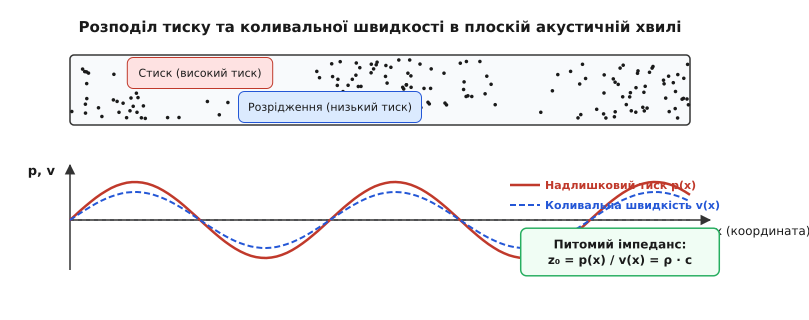
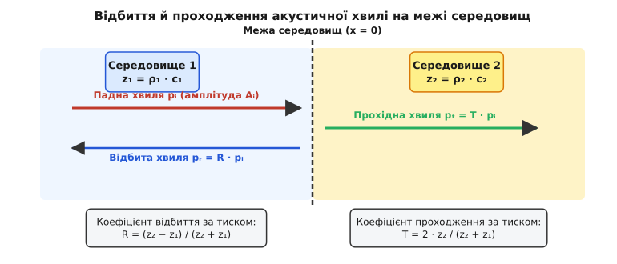
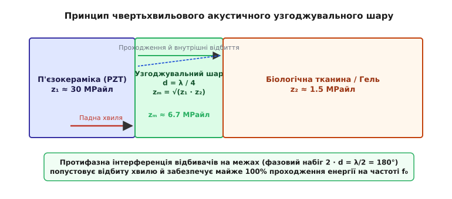
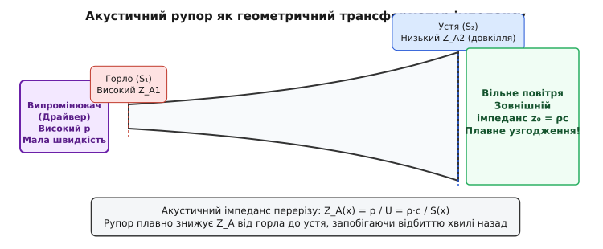
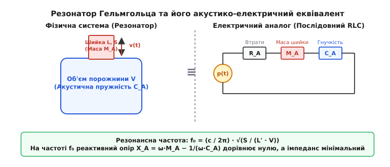

# Акустичний імпеданс: опір середовища звуковій хвилі

<preknowlist>
- [Швидкість звуку](book:physics/speed-of-sound) — швидкість поширення механічного акустичного збурення в середовищі.
- [Густина](book:physics/density) — маса одиниці об'єму матеріалу, що визначає інертний опір прискоренню.
- [Тиск](book:physics/pressure) — перпендикулярна сила, що діє на одиницю площі поверхні середовища.
- [Закон Гука](book:physics/hookes-law) — пропорційний зв'язок між деформацією тіла й виникаючою силою пружності.
</preknowlist>

Спробуйте вигукнути щось уголос, перебуваючи над поверхнею басейну: людина, яка пірнула під воду, майже нічого не почує. Понад `99.8%` звукової енергії, випроміненої у повітря, відіб'ється від гладі води назад у небо, так і не здолавши тонку межу розділу. Натомість лікар-сонографіст, прикладаючи ультразвуковий датчик до тіла пацієнта, обов'язково наносить на шкіру прозорий акустичний гель — без цього прошарку на екрані приладу буде лише темрява, бо повітря між датчиком і шкірою заблокує проходження ультразвуку. Чому ж прозора вода поводиться як непроникне акустичне дзеркало для повітряної хвилі, а тонкий шар гелю здатний «відчинити двері» для звукової енергії?

Відповідь на це питання кроїться у засадничій властивості будь-якого матеріалу — його **акустичному імпедансі** (*acoustic impedance*). Подібно до того, як електричний опір визначає, яку напругу слід прикласти до провідника для отримання потрібного струму, акустичний імпеданс визначає, який надлишковий тиск необхідно створити в середовищі, щоб змусити його частинки коливатися з певною швидкістю. Саме розбіжність акустичних імпедансів на межі двох тіл змушує хвилю відбиватися, а їхнє узгодження — дозволяє звуку безшкодно прямувати далі.

### 1. Чому середовище «пручається» звуку: фізичне відчуття акустичного опору

Уявімо механічну аналогію: ви штовхаєте рукою легку надувну кульку, а потім із тією ж силою намагаєтеся штовхнути важку чавунну кулю, занурену в густий мазут. У першому випадку кулька легко відлітає, створюючи велику швидкість при мізерному силовому зусиллі. У другому — ви прикладаєте величезне зусилля, але чавунна куля ледь зсувається з місця. Середовище чинить різний опір прискоренню й зсуву маси.

Звукова хвиля в газі або рідині — це послідовність зон стиску (де тиск підвищений) та розрідження (де тиск знижений), які біжать у просторі зі швидкістю звуку. У кожній точці, де проходить хвиля, виникають дві нерозривно пов'язані величини:
1. **Надлишковий акустичний тиск `p`** (вимірюється в Паскалях, Па) — додаткова сила на одиницю площі, що стискає або розтягує малий об'єм середовища коло середнього рівноважного значення `p₀`.
2. **Коливальна швидкість частинок `v`** (вимірюється в метрах за секунду, м/с) — швидкість, із якою мікроскопічний об'єм речовини дрижить туди-сюди коло свого положення рівноваги під дією градієнта тиску.

Важливо не плутати **коливальну швидкість частинок `v`** із **швидкістю поширення самої хвилі `c`**. Швидкість хвилі `c` — це швидкість, із якою у просторі біжить фаза стиску (наприклад, 343 м/с у повітрі або 1500 м/с у воді). Коливальна ж швидкість `v` — це швидкість локального зміщення молекул під дією звуку, яка навіть для дуже гучного звуку зазвичай становить лише частки міліметра або сантиметра за секунду.

Якщо позначити зміщення мікроскопічного елемента середовища через `ξ(x, t)`, то коливальна швидкість є першою похідною зміщення за часом: `v = ∂ξ / ∂t`. Акустична деформація (стиск або розтяг) визначається просторовою похідною зміщення: `S = ∂ξ / ∂x`. За законом Гука надлишковий тиск пропорційний деформації `p = −K · (∂ξ / ∂x)`, де `K` — модуль об'ємної пружності.

Відношення надлишкового акустичного тиску `p` до коливальної швидкості частинок `v` у плоскій біжучій хвилі називається **питомим акустичним імпедансом** (*specific acoustic impedance*) і позначається літерою `z₀`:

```
z₀ = p / v
```


*Зони стиску (високий тиск) і розрідження (низький тиск) поширюються зі швидкістю c. У плоскій біжучій хвилі коливальна швидкість частинок v синфазна з надлишковим тиском p, а їхнє відношення p/v дорівнює питомому акустичному імпедансу z₀ = ρc.*

Фізичний зміст питомого імпедансу `z₀` простий: це **міра «жорсткості» та інертності середовища щодо акустичного деформування**. Якщо середовище має великий імпеданс `z₀`, то навіть для створення мізерної коливальної швидкості `v` потрібно прикласти величезний акустичний тиск `p`. Навпаки, середовище з малим імпедансом легко «піддається» коливанням: малий тиск викликає велику швидкість частинок.

В акустичній інженерії виділяють три різновиди імпедансу, які важливо чітко розрізняти:
* **Питомий акустичний імпеданс `z₀ = p / v`** (Па·с/м, або Райл) — локальна характеристика самого матеріалу середовища, незалежна від розмірів труби чи випромінювача.
* **Акустичний імпеданс поверхні/перерізу `ZA = p / U`** (Па·с/м³) — відношення тиску до об'ємної швидкості потоку `U = v · S` через переріз площею `S`. Використовується для розрахунку труб, акустичних фільтрів та резонаторів.
* **Механічний імпеданс `ZM = F / v`** (Н·с/м, або кг/с) — відношення повної механічної сили `F = p · S` до лінійної швидкості поршня або мембрани `v`. Використовується для розрахунку електромеханічних перетворювачів.

Зв'язок між цими трьома величинами задається простими співвідношеннями через площу поперечного перерізу `S`:

```
ZA = z₀ / S
ZM = z₀ · S
ZM = ZA · S²
```

Перевіримо розмірність питомого імпедансу в системі СІ:

```
[z₀] = [p] / [v] = Па / (м/с) = (Н / м²) / (м/с) = (кг · м / с² / м²) / (м/с) = кг / (м² · с)
```

В акустиці одиниця вимірювання `1 Па·с/м = 1 кг/(м²·с)` отримала власну назву **Райл** (*Rayl*), на честь видатного британського фізика Лорда Релея, засновника математичної теорії звуку.

### 2. Звідки береться імпеданс: масове й пружне коріння середовища

Чому ж різні матеріали володіють кардинально різним акустичним імпедансом? Щоб це зрозуміти, виведемо співвідношення для `z₀` безпосередньо з перших принципів механіки суцільних середовищ.

Поширення звуку в будь-якій речовині спирається на дві фундаментальні властивості:
1. **Інерційність (маса):** описується **густиною середовища `ρ`** (кг/м³). Чим важча речовина, тим більшу силу потрібно прикласти для її прискорення (другий закон Ньютона).
2. **Пружність (стисливість):** описується **модулем об'ємної пружності `K`** (Па) для рідин і газів або модулем поздовжньої деформації `M = K + (4/3)·G` для твердих тіл (де `G` — модуль зсуву). Модуль `K` визначає, який тиск потрібен для відносного зменшення об'єму речовини: `Δp = −K · (ΔV / V)`.

Розглянемо елементарний шар середовища товщиною `dx`. Застосувавши до нього другий закон Ньютона, дістаємо зв'язок між просторовим градієнтом тиску й прискоренням частинок:

```
−∂p / ∂x = ρ · (∂v / ∂t)          [динамічне рівняння руху]
```

З іншого боку, зміна тиску в об'ємі викликається неоднорідністю швидкості частинок (деформацією стиску):

```
−∂p / ∂t = K · (∂v / ∂x)          [рівняння стану та нерозривності]
```

Для плоскої гармонічної хвилі, яка біжить у напрямку плюс `x`, тиск і швидкість міняються за законом `exp(j·(ωt − k·x))`, де `k = ω / c` — хвильове число, а `c` — швидкість поширення хвилі. Підставляючи ці гармонічні функції у диференціальні рівняння, отримуємо:

```
k · p = ρ · ω · v   ⇒   p / v = (ρ · ω) / k = ρ · (ω / k) = ρ · c
```

Отже, питомий акустичний імпеданс біжучої плоскої хвилі дорівнює **добутку густини середовища на швидкість звуку в ньому**:

```
z₀ = ρ · c
```

Оскільки швидкість звуку в середовищі сама визначається його пружністю та густиною за формулою `c = √(K / ρ)`, підставимо цей вираз у формулу імпедансу:

```
z₀ = ρ · √(K / ρ) = √(ρ · K)
```

Ця формула відкриває найглибшу фізичну суть: **питомий акустичний імпеданс є середнім геометричним між інертністю середовища (густиною ρ) та його жорсткістю (модулем пружності K)**.

Варто підкреслити фундаментальну відмінність між рідинами й твердими тілами. В ідеальних рідинах та газах модуль зсуву дорівнює нулю (`G = 0`), тому в них можуть поширюватися лише поздовжні хвилі стиску з імпедансом `z₀ = √(ρ·K)`. Поперечні (зсувні) хвилі в рідинах швидко загасають на відстані кількох молекулярних шарів через в'язкість. Натомість у твердих тілах (сталь, алюміній, кістка) існують як поздовжні хвилі з імпедансом `z_L = ρ · c_L`, так і поперечні зсувні хвилі з імпедансом `z_S = ρ · c_S`. Оскільки швидкість поздовжніх хвиль завжди більша за швидкість поперечних (`c_L > c_S`), поздовжній імпеданс твердого тіла завжди перевищує його зсувний імпеданс.

Розглянемо три характерні матеріали:

* **Повітря (газ):** густина мізерна (`ρ ≈ 1.204 кг/м³` при 20 °C), модуль адіабатичної пружності `K = γ·p₀ ≈ 1.42·10⁵ Па`, швидкість звуку `c ≈ 343 м/с`.
  ```
  z₀(повітря) = 1.204 · 343 ≈ 413 Райл
  ```
* **Вода (рідина):** густина в 830 разів більша за повітря (`ρ ≈ 998 кг/м³`), модуль пружності у 15 000 разів більший (`K ≈ 2.25·10⁹ Па`), швидкість звуку `c ≈ 1482 м/с`.
  ```
  z₀(вода) = 998 · 1482 ≈ 1.48·10⁶ Райл = 1.48 МРайл
  ```
* **Сталь (тверде тіло):** величезна густина (`ρ ≈ 7850 кг/м³`), колосальна жорсткість (`M ≈ 2.74·10¹¹ Па`), швидкість поздовжнього звуку `c_L ≈ 5920 м/с`.
  ```
  z₀(сталь) = 7850 · 5920 ≈ 46.5·10⁶ Райл = 46.5 МРайл
  ```

Зі зміною температури імпеданс повітря помітно пливе. Для ідеального газу `ρ` обернено пропорційна температурі `T` (у Кельвінах), а `c` пропорційна `√T`. Тому питомий імпеданс газу зменшується з нагріванням як `1 / √T`:

```
z₀(T) = z₀(0 °C) · √(273.15 / T)
```

При нагріванні повітря від `0 °C` до `40 °C` імпеданс падає з `428 Райл` до `400 Райл`. Крім температури, на питомий імпеданс повітря впливає вологість. Оскільки молярна маса водяної пари (`18 г/моль`) менша за молярну масу сухого повітря (`28.97 г/моль`), вологе повітря за тієї ж температури й тиску є менш густим, ніж сухе. Підвищення відносної вологості від 0% до 100% при 30 °C зменшує густину повітря приблизно на 1%, а швидкість звуку ледь зростає (на 0.3%), що призводить до загального зменшення акустичного імпедансу на 0.7%. У точних акустичних вимірюваннях на концертах та в аеродинамічних трубах вологість враховують разом із барометричним тиском. Цей температурно-вологісний дрейф також враховують у сонарах підводних човнів, де солоність та термоклін створюють градієнт імпедансу у товщі океану.

### 3. Межа двох середовищ: відбиття й проходження акустичної енергії

Що відбувається, коли акустична хвиля, поширюючись у середовищі з імпедансом `z₁`, долітає до плоского кордону із середовищем, чий імпеданс дорівнює `z₂`?


*Хвиля з амплітудою тиску pᵢ падає на межу x = 0. Частина хвилі відбивається з амплітудою pᵣ = R·pᵢ, а частина проходить у друге середовище з амплітудою pₜ = T·pᵢ. Співвідношення амплітуд повністю визначається імпедансами z₁ та z₂.*

На межі двох середовищ `x = 0` мають одночасно виконуватися дві крайові умови:
1. **Безперервність акустичного тиску:** сумарний тиск зліва має дорівнювати тиску справа (`p_i + p_r = p_t`). Якщо б тиски відрізнялися, на нескінченно тонку межу діяла б незкомпенсована сила, що викликало б нескінченно велике прискорення.
2. **Безперервність коливальної швидкості:** нормальна швидкість зміщення частинок зліва має дорівнювати швидкості справа (`v_i + v_r = v_t`). Це гарантує, що середовище не розривається й не утворюються порожнини.

З урахуванням напрямку руху хвиль (падна й прохідна рухаються праворуч, а відбита — ліворуч, тому `v_r = −p_r / z₁`), розв'язок системи цих двох крайових рівнянь дає строгі формули для **коефіцієнта відбиття за тиском `R`** та **коефіцієнта проходження за тиском `T`**:

```
R = p_r / p_i = (z₂ − z₁) / (z₂ + z₁)
T = p_t / p_i = (2 · z₂) / (z₂ + z₁)
```

Зверніть увагу: коефіцієнти зв'язані простим співвідношенням `1 + R = T`.

Однак нас частіше цікавить не тиск, а **потік акустичної енергії (інтенсивність хвилі `I`)**, пропорційний квадрату тиску, поділеному на імпеданс: `I = p² / (2·z₀)`. Енергетичний коефіцієнт відбиття `R_I` (частка відбитої енергії) та енергетичний коефіцієнт проходження `T_I` (частка енергії, що пройшла далі) дорівнюють:

```
R_I = R² = [ (z₂ − z₁) / (z₂ + z₁) ]²
T_I = 1 − R_I = (4 · z₁ · z₂) / (z₂ + z₁)²
```

Розглянемо два граничні випадки:

#### А. Ідеально жорстка стінка (`z₂ → ∞`)
Якщо друге середовище нескінченно важке або нестисливе (наприклад, товста бетонна стіна для повітряної хвилі), `z₂ >> z₁`.
```
R = (∞ − z₁) / (∞ + z₁) = +1
R_I = 1² = 1  (100% відбиття енергії)
```
Хвиля повністю відбивається **в тієї ж фазі**. На самій межі відбита хвиля додається до падної, і надлишковий тиск подвоюється (`p = 2·p_i`), тоді як коливальна швидкість частинок дорівнює нулю (`v = 0` — стіна не дає частинкам рухатися).

#### Б. Абсолютно м'яка межа / вільний кінець (`z₂ → 0`)
Якщо хвиля виходить із щільного середовища у зріджене (наприклад, звукова хвиля у воді виходить на відкриту поверхню повітря, або хвиля у трубі виходить на відкритий кінець), `z₂ << z₁`.
```
R = (0 − z₁) / (0 + z₁) = −1
R_I = (−1)² = 1  (100% відбиття енергії)
```
Хвиля знову повністю відбивається, але **в протифазі (зі зміною знака на 180°)**: хвиля стиску відбивається як хвиля розрідження. На межі надлишковий тиск падає до нуля (`p = 0`), а коливальна швидкість частинок подвоюється (`v = 2·v_i`).

#### Наклонне падіння хвилі та критичний кут

Якщо акустична хвиля падає під кутом `θ₁` до нормалі межі розділу, кут заломлення `θ₂` визначається акустичним аналогом закону Снелліуса:

```
sin(θ₁) / c₁ = sin(θ₂) / c₂
```

Коефіцієнт відбиття при наклонному падінні залежить від кута і бере до уваги проекції швидкостей на нормаль до межі:

```
R(θ₁) = (z₂ · cos θ₁ − z₁ · cos θ₂) / (z₂ · cos θ₁ + z₁ · cos θ₂)
```

Якщо хвиля переходить із середовища з меншою швидкістю звуку в середовище з більшою швидкістю (`c₂ > c₁`, наприклад із води у сталь), існує **критичний кут падіння `θ_crit = arcsin(c₁ / c₂)`**. При падінні під кутом, більшим за критичний, заломлена хвиля не утворюється взагалі — виникає ефект **повного внутрішнього акустичного відбиття**. Це явище широко використовується в ультразвуковій дефектоскопії рейкових колій та авіаційних сполучень для збудження зсувних та поверхневих хвиль Лемба.

#### Приклад (чому звук не йде з повітря у воду)
Підставимо імпеданси повітря (`z₁ = 413 Райл`) та води (`z₂ = 1.48·10⁶ Райл`) у формулу енергетичного проходження:

```
T_I = (4 · 413 · 1.48·10⁶) / (1.48·10⁶ + 413)²
    = (2.445·10⁹) / (2.19·10¹²) ≈ 0.0011  =  0.11%
```

Лише **0.11%** (одна тисячна частина!) акустичної енергії здатна проникнути з повітря у воду, а **99.89%** відбивається назад. Повітря «занадто легке й м'яке», щоб розгойдати важку й жорстку воду.

Та сама фізика працює у медичному ультразвуці. Імпеданс п'єзокерамічного випромінювача становить близько `30 МРайл`, а м'яких тканин людини — близько `1.6 МРайл`. Без узгодження відбивається понад `80%` ультразвукової енергії. А якщо між датчиком і шкірою потрапить хоча б мікроскопічна бульбашка повітря (`z = 413 Райл`), вона спрацює як ідеальний зріз з `R_I = 99.9%`, повністю засліпивши апарат.

Водночас невеликі розбіжності імпедансу між біологічними тканинами (наприклад, між жиром `1.33 МРайл` та м'язами `1.70 МРайл`) створюють слабке відбиття з `R_I ≈ 1.5%`. Тканини пропускають `98.5%` звуку далі вглиб тіла, але слабке відбите ехо повертається до датчика, утворюючи деталізовану картинку внутрішніх органів на моніторі.

> 📜 **Історична вставка:** [Від телеграфу до ультразвуку: історія акустичного імпедансу](book:physics/oscillations-waves/acoustic-impedance/hist-acoustic-impedance.md) — як Лорд Релей, Олівер Гевісайд, Артур Вебстер та піонери медицини перенесли поняття електричного опору на акустику та створили базу для медичного ультразвуку.

### 4. Узгодження імпедансів: як примусити хвилю йти далі

Коли катастрофічна розбіжність імпедансів заважає передачі енергії, інженери застосовують **акустичне узгодження** (*impedance matching*). Для цього існують два основні технологічні прийоми: хвильовий (через проміжні шари) та геометричний (через плавну зміну перерізу).

#### Спосіб 1: Чвертьхвильовий узгоджувальний шар

Уявімо, що між першим середовищем `z₁` та другим `z₂` ми вставляємо проміжний шар матеріалу з імпедансом `z_m` та товщиною `d`.


*Чвертьхвильовий шар d = λ/4 з імпедансом zₘ = √(z₁·z₂) перетворює імпеданс навантаження z₂ на значення z₁, забезпечуючи повну деструктивну інтерференцію відбивачів і 100% проходження енергії на резонансній частоті.*

Коли акустична хвиля входить у проміжний шар, вона зазнає багаторазових відбиттів від його передньої та задньої меж. Якщо товщина шару дорівнює точно чверті довжини хвилі в цьому матеріалі (`d = λ / 4`), хвиля, що відбилася від задньої межі, проходить шар туди й назад, долаючи шлях `2·d = λ / 2` (що відповідає зсуву фази на 180°).

Якщо імпеданс шару обрано як **середнє геометричне імпедансів двох межових середовищ**:

```
z_m = √(z₁ · z₂)
```

то амплітуди двох відбитих хвиль (від першої та від другої меж) виявляються абсолютно однаковими, але протилежними за фазою. Вони повністю гасять одна одну в результаті деструктивної інтерференції, і відбита хвиля повністю зникає! Уся акустична енергія безперешкодно проходить крізь шар у друге середовище.

У сучасних медичних ультразвукових датчиках різниця імпедансів між п'єзокерамікою PZT (`30 МРайл`) та шкірою (`1.6 МРайл`) настільки велика, що одного шару недостатньо для забезпечення широкої смуги частот. Застосовують **двошарові або тришарові узгоджувальні структури**:
- Перший шар (прилеглий до кераміки): `z_m1 ≈ 10–12 МРайл` (композит епоксидної смоли з вольфрамовим порошком).
- Другий шар (прилеглий до шкіри): `z_m2 ≈ 3–4 МРайл` (чистий пористий полімер).

Такий градієнтний перехід розширює робочу смугу частот датчика, дозволяючи випромінювати короткі ультразвукові імпульси високої роздільної здатності.

#### Спосіб 2: Геометричний трансформатор (Акустичний рупор)

Другий спосіб узгодження застосовують тоді, коли потрібно з'єднати джерело з малим перерізом випромінювання (наприклад, маленький мембранний компресійний драйвер у колонці) з відкритим повітрям.

Акустичний імпеданс труби перерізом `S` дорівнює `Z_A = (ρ · c) / S`. Мала площа `S` означає величезний акустичний імпеданс (високий тиск, мала об'ємна швидкість). Вільне повітря в кімнаті має величезну площу фронту хвилі, тобто низький імпеданс. Якщо приєднати маленький динамік прямо до відкритого повітря, через розбіжність імпедансів дифузор буде лише марно розганяти повітря довкола себе, майже не випромінюючи звук у далеке поле.


*Рупор плавно збільшує площу перерізу S(x) від вузького горла до широкого устя, забезпечуючи поступову трансформацію високого акустичного імпедансу драйвера у низький імпеданс вільного повітря без утворення відбитої хвилі.*

**Акустичний рупор** (*acoustic horn*) розв'язує цю проблему шляхом плавної зміни площі перерізу `S(x)` за експоненційним законам `S(x) = S₀ · exp(m · x)`. У вузькому «горлі» рупора імпеданс високий і узгоджений із динаміком; у міру просування уздовж рупора площа `S(x)` зростає, імпеданс плавно падає, і на широкому «усті» він ідеально дорівнює імпедансу вільного повітря. Рупор працює як акустичний трансформатор, що перетворює високий тиск і мале зміщення в горлі на малий тиск і великий об'ємний потік повітря на усті.

Для експоненційного рупора існує фундаментальна **частота зрізу `f_crit = (m · c) / (4·π)`**. Звукові хвилі з частотою нижче критичної не можуть поширюватися крізь рупор і повністю відбиваються від горла назад. Це пояснює, чому низькочастотні басові рупори мають величезні габарити: для зрізу на частоті 40 Гц устя рупора повинно мати діаметр понад 2.5 метри.

> 🧮 **Математична вставка:** [Виведення коефіцієнтів відбиття й проходження на акустичній межі](book:physics/oscillations-waves/acoustic-impedance/math-reflection-transmission.md) — детальне математичне виведення крайових умов, фазових зсувів, коефіцієнта стоячої хвилі (КСХ) та вхідного імпедансу чвертьхвильового трансформатора.

### 5. Комплексний імпеданс і реактивність: коли тиск і швидкість розходяться за фазою

Досі ми розглядали плоскі біжучі хвилі, де тиск `p` і коливальна швидкість `v` здійснюють синфазні коливання, а їхнє відношення є чистим дійсним числом `z₀ = ρ·c`. Однак у реальних акустичних системах — стоячих хвилях у трубах, поблизу малого пульсуючого випромінювача або в акустичних резонаторах — тиск і швидкість часто зсунуті за фазою.

У цьому випадку акустичний імпеданс описують **комплексним числом**:

```
Z_A = R_A + j · X_A
```

де `R_A` — **акустичний активний опір** (описує безповоротне випромінювання енергії або її дисипацію через в'язке тертя), а `X_A` — **акустичний реактивний опір** (описує зворотний обмін кінетичною та потенціальною енергією без її втрати).

Реактивний опір буває двох типів:
1. **Інерційний / масовий опір (`X_M = ω · M_A`):** зумовлений інерцією маси повітря, що рухається у вузьких каналах чи шийках. У масовому елементі коливальна швидкість **відстає від тиску на 90°**.
2. **Пружний / ємнісний опір (`X_C = −1 / (ω · C_A)`):** зумовлений стисливістю повітря у закритих об'ємах і камерах. У пружному елементі тиск **випереджає швидкість на 90°**.

Класичним прикладом комплексного акустичного кола є **резонатор Гельмгольца** (*Helmholtz resonator*) — скляна або металева судина з вузькою шийкою (простий приклад — порожня скляна пляшка, у шийку якої дмухають).


*Повітря у вузькій шийці поводиться як акустична маса M_A, а стиснуте повітря у великому об'ємі — як акустична гнучкість C_A. На власній частоті f₀ реактивні опори компенсують один одного (X_A = 0), створюючи акустичний резонанс.*

Маса повітря в шийці `M_A = (ρ · L') / S` опирається зміні швидкості (поводиться як індуктивність `L`). Об'єм повітря в камері `C_A = V / (ρ · c²)` накопичує енергію стиску (поводиться як ємність `C`). Разом вони утворюють **послідовне акустичне RLC-коло**.

На власній резонансній частоті:

```
f₀ = (c / (2 · π)) · √(S / (L' · V))
```

інерційний опір маси шийки повністю компенсується пружним опором камери (`X_MA + X_CA = 0`). Реактивний імпеданс зникає, а повний акустичний імпеданс резонатора падає до мінімального активного опору `R_A`. Резонатор починає інтенсивно всмоктувати й випромінювати акустичну енергію на цій конкретній частоті.

Аналогічний розрахунок випромінювального імпедансу кругового поршня радіуса `a` у нескінченній жорсткій перегородці (класична задача Лорда Релея) показує, що акустичний опір середини, який бачить поршень, кардинально змінюється залежно від співвідношення між розміром поршня та довжиною хвилі:

1. **Низькі частоти (`k·a << 1`, хвиля значно більша за поршень):**
```
R_rad ≈ 0.5 · ρ · c · k² · a² = (ρ · c · k² · S) / (2 · π)    [активний опір випромінювання]
X_rad ≈ (8 / 3) · ρ · c · k · a³                             [реактивний опір маси]
```
На низьких частотах активний опір випромінювання `R_rad` дуже малий і зростає пропорційно квадрату частоти `ω²`. Натомість реактивний опір приєднаної маси повітря `X_rad` переважає. Це означає, що малий дифузор гучномовця на низьких частотах марно розганяє приєднану масу повітря туди-сюди, майже не випромінюючи акустичної енергії у далеке поле. Встановлення фазоінвертора або рупора дозволяє скомпенсувати реактивну масу й підняти активний опір випромінювання `R_rad`.

2. **Високі частоти (`k·a >> 1`, поршень значно більший за довжину хвилі):**
```
R_rad → ρ · c · S
X_rad → 0
```
На високих частотах реактивний опір падає до нуля, а активний випромінювальний опір прямує до питомого імпедансу середовища `ρ·c·S`. Поршень випромінює ідеальну плоску хвилю, а середовище поводиться як чистий активний опір.

#### Акустичні метаматеріали та регулювання імпедансу

У XXI столітті теорія акустичного імпедансу отримала новий поштовх із появою **акустичних метаматеріалів** (*acoustic metamaterials*). Це штучно створені періодичні структури із субхвильовими осередками, фізичні властивості яких визначаються не стільки хімічним складом, скільки їхньою внутрішньою геометрією.

За допомогою метаматеріалів інженерам вдалося реалізувати унікальні режими:
* **Акустичні матеріали з від'ємним імпедансом:** структури з локальними резонаторами, в яких на певних частотах ефективна густина `ρ_eff < 0` або модуль пружності `K_eff < 0`. У таких середовищах звукова хвиля не може поширюватися й повністю згасає на відстані, меншій за довжину хвилі.
* **Акустичне маскування (Acoustic Cloaking):** створення градієнтних метаматеріальних оболонок із просторово впорядкованим імпедансом `z₀(r, θ)`. Така оболонка плавно заломлює акустичну хвилю довкола об'єкта (наприклад, підводного човна) і повертає її у початковий напрямок без жодного відбиття чи утворення акустичної тіні, роблячи об'єкт абсолютно непомітним для гідролокаторів.
* **Мікроперфоровані панелі (MPP):** тонки листові панелі з отворами діаметром менше 1 мм, імпеданс яких налаштовується так, щоб оптимально поглинати шум у вузькому або широкому діапазоні частот без використання волокнистих екологічно небезпечних матеріалів.

Ці механізми лежать в основі сучасних фазоінверторів акустичних колонок, аерокосмічних глушників шумів турбореактивних двигунів, звукоізоляційних конструкцій та підводних сонарних систем.

Розуміння комплексного імпедансу доправляє інженеру інструменти для точного проектування акустичних фільтрів, глушників та ультразвукових сканерів найвищої чутливості.

> ⚙️ **Алгоритмічна вставка:** [Моделювання акустичної хвилі на межі імпедансів і чвертьхвильового узгодження](book:physics/oscillations-waves/acoustic-impedance/proj-impedance-matching.md) — чисельне FDTD-моделювання 1D акустичної хвильової картини мовами C та C++ з розрахунком коефіцієнтів відбиття й ефекту узгодження.

> 📋 **Довідкова вставка:** [Акустичні властивості матеріалів та формули імпедансу](book:physics/oscillations-waves/acoustic-impedance/api-acoustic-materials.md) — таблиця питомих імпедансів для 25+ матеріалів, швидкості звуку, густини, коефіцієнтів відбиття та зведених акустико-електричних формул.

> 🔧 **Навіщо це.** Знання акустичного імпедансу є фундаментальним у багатьох інженерних галузях:
> - **Медична діагностика:** проектування ультразвукових датчиків із чвертьхвильовими узгоджувальними шарами та вибір складу контактних гелів.
> - **Неруйнівний контроль (NDT):** дефектоскопія аерокосмічних деталей зі сталі й титану для виявлення внутрішніх тріщин за відбитим акустичним імпульсом.
> - **Аудіоінженерія та акустика приміщень:** розрахунок рупорних гучномовців, фазоінверторів колонок, акустичних екранів та студійного звукопоглинання.
> - **Гідроакустика та SONAR:** розробка підводних випромінювачів та обтікачів із матеріалів, чий імпеданс збігається з імпедансом морської води.
