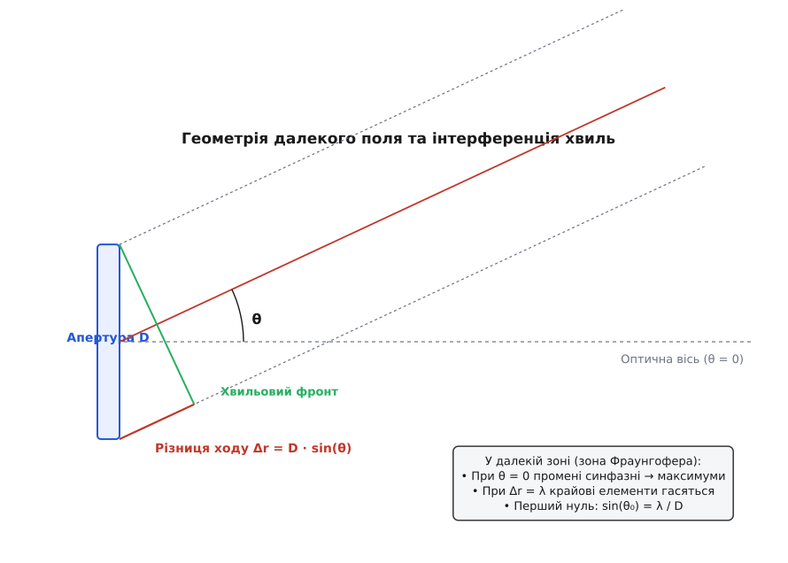
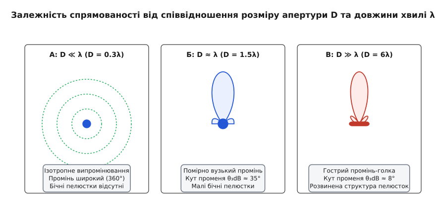
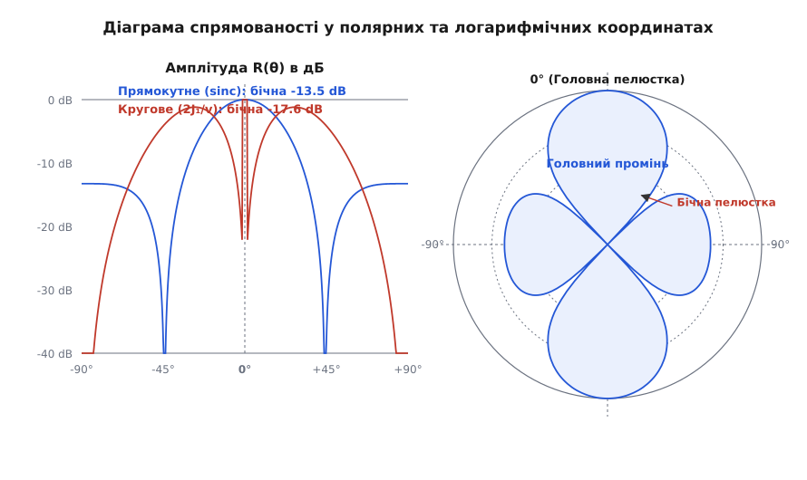
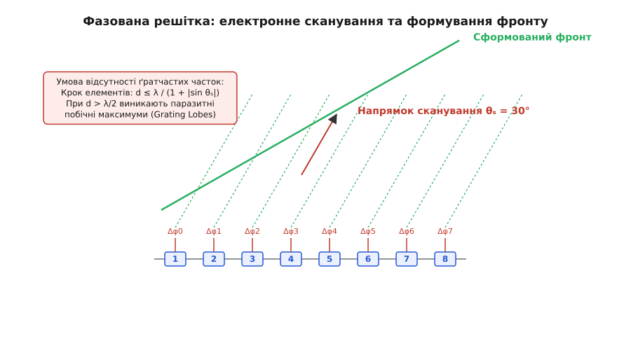

<preknowlist>
- [хвильове рівняння та гармонічні коливання](book:physics/oscillations-waves/wave-equation)
- [принцип Гюйгенса-Френеля та інтерференція хвиль](book:physics/oscillations-waves/wave-interference)
- [суперпозиція та фаза хвиль](book:physics/oscillations-waves/wave-superposition)
- [гармонічний осцилятор](book:physics/oscillations-waves/harmonic-oscillator)
</preknowlist>

# 📡 Діаграма спрямованості перетворювача: фізика інтерференції, апертурні границі та електронне керування променем

> 🔧 **Навіщо це.** Без спрямованого випромінювання енергія хвилі безповоротно розсіюється у повному півпросторі `360°`, роблячи неможливою локацію об'єктів на великих відстанях. Діаграма спрямованості перетворює випромінювач із точкового джерела на прожектор: вона концентрує енергію у вузький промінь, збільшує дальність дії ехолокатора чи радара в сотні разів і дає змогу вимірювати кутові координати цілі. Розуміння фізики апертури необхідне для проектування сонарів, медичних УЗД-апаратів, промислових дефектоскопів та антенних решіток.

---

### 1. Фізичний механізм формування спрямованості та фазова інтерференція

Будь-який реальний випромінювач кінцевих розмірів — чи це п'єзоелектричний диск гідроакустичного ехолота, прямокутна пластина медичного УЗД-датчика, чи рупорна антена радіолокатора — не є точковим джерелом. Згідно з принципом Гюйгенса-Френеля, його коливальна поверхня (апертура) ділиться на безліч нескінченно малих елементарних майданчиків, кожен з яких випромінює сферичну хвилю.

Коли хвилі від усіх точок апертури поширюються у простір, вони накладаються одна на одну (інтерферують). У напрямку нормалі до поверхні (на акустичній осі `θ = 0°`) шляхи проходження хвиль від усіх елементарних випромінювачів до віддаленої точки однакові. Хвилі приходять у тотожній фазі (синфазно), їхні амплітуди додаються арифметично, утворюючи максимум акустичного тиску — **головний промінь** (головну пелюстку).

Проте при відхиленні точки спостереження від нормалі на кут `θ` виникає різниця ходу променів від різних ділянок апертури.


*Мал. 1. Геометрія формування поля у далекій зоні. Різниця ходу між хвилями від крайніх точок апертури шириною D дорівнює Δr = D sin(θ), що створює кутову залежність фази та інтерференційну картину.*

Для двох крайніх точок апертури шириною `D` різниця шляхів до віддаленого спостерігача дорівнює `Δr = D sin(θ)`. Відповідний фазовий зсув `Δφ` становить:

```
Δφ = k · Δr = (2π / λ) · D · sin(θ)
```

Коли кут `θ` зростає до значення, при якому різниця ходу між хвилями від протилежних країв апертури досягає рівно однієї довжини хвилі `Δr = λ` (тобто `D sin(θ) = λ`), для кожної точки лівої половини апертури знайдеться точка у правій половині, хвиля від якої відстає рівно на півхвилі `λ / 2` (на `180°`). Відбувається повне взаємне гасіння хвиль — виникає **перший нуль діаграми спрямованості**.

#### 1.1. Інтеграл Релея та двовимірне перетворення Фур'є
З математичної точки зору, розподіл акустичного тиску в просторі описується інтегралом Релея першого роду. Для плоского випромінювача площею `S`, вмонтованого у жорсткий нескінченний екран (baffle), акустичний тиск у далекій зоні визначається виразом:

```
p(r, θ, φ) = (i ρ₀ c k / (2π r)) · e^(i k r) · ∬_S v₀(x', y') · e^(−i k sin(θ) (x' cos(φ) + y' sin(φ))) dx' dy'
```

де `ρ₀` — густина середовища, `c` — швидкість звуку, `v₀(x', y')` — розподіл амплітуди коливальної швидкості по поверхні випромінювача.

З цієї фундаментальної формули видно, що кутовий розподіл акустичного тиску у далекій зоні з точністю до амплітудно-фазового співмножника є двовимірним **перетворенням Фур'є** від просторового розподілу амплітуди коливальної швидкості `v₀(x', y')` на поверхні апертури. Якщо поверхня коливається синфазно з постійною амплітудою, прямокутний профіль швидкості перетворюється у кутовому просторі у функцію `sinc(u) = sin(u)/u`, де `u = (π W / λ) sin(θ)`.

Присутність жорсткого екрана гарантує, що поле випромінюється лише у передній півпростір `z > 0`, а гранична умова дорівнює подвоєній амплітуді тиску вільного джерела завдяки принципу дзеркальних зображень.

#### 1.2. Вектор Умова-Пойнтінга та потік акустичної потужності
У далекій зоні акустичне поле набуває властивостей чисто локально пласкої хвилі: масова швидкість частинок `v` направлена строго радіально й пов'язана з тиском виразом `v = p / (ρ₀ c)`. Миттєвий вектор Умова-Пойнтінга `S_vec = p · v_vec` описує густину потоку енергії.

Усереднена за часом інтенсивність випромінювання `I(θ, φ)` у напрямку `(θ, φ)` пропорційна квадрату модуля характеристики спрямованості:

```
I(θ, φ) = |p(r, θ, φ)|² / (2 ρ₀ c) = I_max · R²(θ, φ)
```

Інтеграл інтенсивності `I(θ, φ)` по всій сферичній поверхні радіуса `r` дає повну акустичну потужність `P_{ac}`, яку перетворювач віддає у середовище.

#### 1.3. П'єзоелектричне перетворення енергії
У сучасних перетворювачах коливальна швидкість `v₀` збуджується п'єзоелектричними пластинами (PZT, PVDF чи PMN-PT). Зворотний п'єзоелектричний ефект перетворює змінну електрична напругу `U(t) = U₀ cos(ω t)` у механічні деформації пластини. 

Амплітуда коливальної швидкості `v₀ = ω · d₃₃ · U₀` прямо пропорційна п'єзомодулю `d₃₃` та частоті `ω`, що пов'язує електричні параметри генератора з випроміненим тиском у далекій зоні.

#### 1.4. Модальний аналіз реальних п'єзопластин
У реальних пристроях п'єзоелектричний диск коливається не як ідеальний поршень `v₀(r) = const`, а утворює власні згинальні моди Хладні (Chladni flexural modes). При збудженні високих згинальних мод на поверхні пластини з'являються вузлові кола, у яких швидкість змінює знак. 

Це призводить до спотворення класичної характеристики поршня `2 J₁(v)/v`, розщеплення головного максимуму та підйому бічного випромінювання на `5 - 10 dB`. Для пригнічення паразитних мод пластину розрізають на мікростовпчики та заливають епоксидною смолою, утворюючи composite п'єзоматеріал (1-3 Piezocomposite).

Історичний шлях від перших теоретичних праць Лорда Релея до винайдення Полем Ланжевеном п'єзокварцового ультразвукового сонара детально висвітлено в [історичній вставці](book:hist-sonar-langevin.md).

---

### 2. Вплив геометричного розміру апертури: відношення D / λ

Форма та ширина діаграми спрямованості принципово визначаються відношенням фізичного розміру апертури `D` до довжини випромінюваної хвилі `λ = c / f`.


*Мал. 2. Трансформація кутового розподілу випромінювання при зміні відношення D/λ: від ненапрямленого випромінювання (D ≪ λ) до гостронаправленого променя з бічними пелюстками (D ≫ λ).*

Залежно від співвідношення `D / λ` виділяють три характерні фізичні режими:

#### 2.1. Субволново випромінювач (D ≪ λ)
Якщо розмір випромінювача набагато менший за довжину хвилі (`D < 0.2 λ`), різниця ходу `Δr = D sin(θ)` на будь-яких кутах є мізерно малою порівняно з `λ`. Фазовий зсув між хвилями з усіх точок поверхні практично дорівнює нулю. 

Випромінювач поводиться як ненапрямлене (ізотропне) точкове джерело нулевого порядку: енергія рівномірно розсіюється по всьому півпростору `180°`. Наприклад, для звукової хвилі з частотою `f = 1 kHz` у повітрі довжина хвилі дорівнює `λ = 343 mm`. Невеличкий динамік діаметром `D = 20 mm` має `D / λ = 0.058 ≪ 1`, тому він випромінює звук однаково у всіх напрямках.

#### 2.2. Порівнянний випромінювач (D ≈ λ)
Коли розмір апертури порядку довжини хвилі (`D ≈ (1 ... 3) λ`), різниця ходу стає достатньою для формування широкого головного променя, проте перші нулі розташовані на великих кутах `θ₀ = arcsin(λ / D)`. Випромінювання має помірну спрямованість без чітко виражених високих бічних пелюсток. Наприклад, при `D = 2 λ` ширина головної пелюстки за рівнем −3 dB становить приблизно `30°`.

#### 2.3. Хвильово-великий випромінювач (D ≫ λ)
Якщо розмір апертури значно перевищує довжину хвилі (`D > 5 λ`), максимальна різниця ходу на краях апертури в багато разів перевищує `λ`. Це призводить до стискання головного максимуму у вузький промінь з кутовою шириною порядку кількох градусів, а також до появи багаторазових чергувань максимумів та мінімумів на великих кутах — **бічних пелюсток** (side lobes).

Розглянемо практичний приклад: ультразвуковий поршень ехолота діаметром `D = 150 mm` працює у воді (`c = 1500 m/s`) на частоті `f = 200 kHz`. Довжина хвилі дорівнює `λ = 1500 / 200000 = 7.5 mm`. Відношення `D / λ = 150 / 7.5 = 20`. 

Ширина головного променя за рівнем −3 dB становить:

```
θ_{-3dB} ≈ 1.029 · (λ / D) = 1.029 / 20 = 0.0514 rad ≈ 2.95°
```

Акустична енергія стискається у дуже вузький конус із кутом розкриття менше `3°`, що дозволяє промальовувати рельєф дна з високою просторовою деталізацією.

Строгі математичні виведення інтеграла Релея для різних геометрій апертур наведено у [математичній вставці](book:math-piston-beam-pattern.md).

---

### 3. Порівняльний аналіз геометрій: Прямокутна апертура проти Кругового поршня

Форма поверхні випромінювача визначає математичний тип функції спрямованості та рівень бічного випромінювання.


*Мал. 3. Полярна діаграма спрямованості у логарифмічному масштабі: порівняння прямокутної апертури (sinc-функція, SLL = -13.3 dB) та кругового поршня (функція Бесселя J1(v)/v, SLL = -17.6 dB).*

#### 3.1. Прямокутна апертура шириною W
Для синфазного прямокутного випромінювача шириною `W` у головному перерізі характеристика спрямованості описується нормованою функцією кардинального синуса (кардинальним синусом):

```
R_rect(θ) = | sin(u) / u |      де  u = (π W / λ) · sin(θ)
```

- **Кут першого нуля:** `sin(θ₀) = λ / W`.
- **Ширина головної пелюстки за рівнем −3 dB:** `θ_{-3dB} ≈ 0.886 · (λ / W)` радіан (`50.8° · λ / W`).
- **Рівень першої бічної пелюстки (SLL):** `SLL = −13.26 dB` (амплітуда бічного піку становить `21.7%` від головного максимуму).

Перша бічна пелюстка прямокутника є відносно високою, оскільки амплітуда випромінювання зрізається на краях апертури скачком від `v₀` до 0.

#### 3.2. Суцільний круговий поршень діаметром D
Для кругової плоскої пластини радіуса `a = D/2` інтегрування по полярній сітці згортається через функцію Бесселя першого роду першого порядку `J₁(v)`:

```
R_circ(θ) = | 2 J₁(v) / v |      де  v = (π D / λ) · sin(θ)
```

Ця функція в акустиці отримала назву **сомбреро-функції** або функції поршня.

- **Кут першого нуля (Критерій Релея / Диск Ейрі):**
  ```
  v₁ = 3.8317   ⇒   sin(θ₀) = 3.8317 / π · (λ / D) ≈ 1.22 · (λ / D)
  ```
- **Ширина головної пелюстки за рівнем −3 dB:** `θ_{-3dB} ≈ 1.029 · (λ / D)` радіан (`59.0° · λ / D`).
- **Рівень першої бічної пелюстки (SLL):** `SLL = −17.57 dB` (амплітуда бічного піку становить лише `13.2%` від максимуму на осі).

Порівняння показує важливий інженерний висновок: круговий поршень має на `4.3 dB` нижчий рівень бічного шуму, ніж прямокутний випромінювач тої ж площі, завдяки природному плавному спаданню площі кругового сегмента біля країв диска.

#### 3.3. Кільцевий поршень (Annular Aperture)
Якщо поршень має вирізану центральну частину (внутрішній радіус `a₁`, зовнішній радіус `a₂`), характеристика спрямованості є різницею двох Бесселівських функцій. Для нескінченно тонкого кільця радіуса `a` функція спрямованості перетворюється у функцію Бесселя нулевого порядку `R(θ) = |J₀(k a sin(θ))|`. 

Тонке кільце має значно вужчий головний промінь, ніж суцільний диск того ж діаметра (перший нуль настає при `v = 2.405`), проте рівень його першої бічної пелюстки зростає до катастрофічних `−7.9 dB`.

#### 3.4. Гауссовий випромінювач
Якщо амплітуда коливальної швидкості на поверхні спадає від центра за законом Гаусса `v₀(r') = v₀ e^(−r'² / b²)`, її перетворення Фур'є також є Гауссовою функцією:

```
R_gauss(θ) = e^(−(π b / λ)² · sin²(θ))
```

Для Гауссової апертури **бічні пелюстки повністю відсутні** (`SLL = −∞ dB`). Це фундаментальна фізична властивість перетворення Фур'є: Гауссів колокол є єдиною функцією, яка не створює осциляцій у спектральній (кутовій) області.

Повний звід паспортних параметрів та інженерних формул зведений у [довіднику](book:api-transducer-beam-spec.md).

---

### 4. Поле випромінювача у просторі: Ближня зона Френеля та Далека зона Фраунгофера

Акустичне поле перед випромінювачем суттєво змінює свій характер у міру віддалення від його поверхні вздовж осі `z`. Його прийнято ділити на дві принципово різні зони.

```
       БЛИЖНЯ ЗОНА (ФРЕНЕЛЬ)             ДАЛЕКА ЗОНА (ФРАУНГОФЕР)
 ┌───────────────────────────────┐ ┌───────────────────────────────────┐
 │ Фазові осциляції на осі       │ │ Сформований промінь R(θ)          │
 │ Промінь не розходиться (циліндр)│ │ Сферична хвиля, спадання 1/r      │
 └───────────────────────────────┘ └───────────────────────────────────┘
 0 ───────────────────────────── R_F = D²/(4λ) ───────────────────────> z
```

#### 4.1. Ближня зона (Зона Френеля / Near Field)
Розташована на відстанях `z < N_F = D² / (4 λ)`. У цій області промені від різних ділянок апертури приходять до точок осі з різними квадратичними фазовими зсувами. 

У результаті вздовж акустичної осі спостерігаються глибокі інтерференційні осциляції тиску (серія максимумів і повних нулів). Положення цих інтерференційних екстремумів на осі визначається геометричним розкладом:

```
z_m = (D² − 4 m² λ²) / (16 m λ)   (де m = 1, 2, 3, ...)
```

Останній максимум акустичного тиску на осі спостерігається строго на межі ближньої зони:

```
N_F = D² / (4 λ)
```

У межах ближньої зони поперечний переріз променя зберігає розмір апертури `D` у вигляді нее розбіжного циліндра. Ближня зона є робочим простором для медичних УЗД-датчиків з електронним фокусуванням, оскільки в ній енергію можна геометрією фаз стиснути у вузьку пляму.

#### 4.2. Межа Фраунгофера (Умова далекої зони)
Границею між ближньою та далекою зонами вважається відстань:

```
R_far = D² / λ
```

На цій відстані максимальна фазова похибка від квадратного члена розкладу відстані не перевищує `π / 8` (або `22.5°`), що дозволяє вважати хвильові фронти від усіх точок апертури паралельними плоскими променями.

#### 4.3. Далека зона (Зона Фраунгофера / Far Field)
На відстанях `r ≫ D² / λ` акустична хвиля стає чисто сферичною, її тиск спадає пропорційно `1 / r`, а кутовий розподіл тиску не залежить від відстані й описується стабільною діаграмою спрямованості `R(θ, φ)`.

#### 4.4. Геометричне фокусування сферичним угнутим поршнем
Якщо випромінююча пластина вигнута за сферою радіуса `F` (фокусна відстань), хвильовий фронт стає збіжним. У фокальній площині (`z = F`) амплітудний розподіл тиску повторює диск Ейрі, а діаметр плями фокусування за рівнем −3 dB становить:

```
d_focus = 1.029 · λ · F / D
```

Це дозволяє створювати високу локальну концентрацію акустичної енергії у хірургічному УЗД (HIFU) для абляції пухлин та в дефектоскопії для виявлення точкових пор у металі.

#### 4.5. Динамічне фокусування при прийомі (Dynamic Receiving Focus, DRF)
У цифрових УЗД-сканерах при зчитуванні ехо-сигналу фокусна відстань `F(t) = c t / 2` плавно збільшується у часі синхронно з просуванням акустичного імпульсу в глибину тканин. Процесор перераховує часові затримки `τ_n(t)` у реальному часі, гарантуючи ідеальну фокусування по всій глибині сканування.

---

### 5. Дискретні фазовані решітки та електронне сканування променя

Замість механічного повороту важкого випромінювача у сучасних сонарах, медичних УЗД-сканерах та АФАР-радарах застосовують **дискретні фазовані апертурні решітки** (Phased Arrays).

Решітка складається з `N` окремих керованих елементів, розташованих з кроком `d`.


*Мал. 4. Принцип електронного керування променем (Beam Steering): впровадження лінійного фазового зсуву Δφ між сусідніми елементами масиву повертає хвильовий фронт на кут θ_s.*

#### 5.1. Принцип електронного відхилення (Beam Steering)
Щоб розвернути головний акустичний промінь на кут `θ_s` відносно нормалі, необхідно сформувати плоский хвильовий фронт, нахилений під кутом `θ_s`. Для цього на кожен `n`-й елемент масиву подається електричний сигнал з додатковим лінійним фазовим зсувом `φ_n`:

```
φ_n = −n · Δφ      де  Δφ = k · d · sin(θ_s) = (2π / λ) · d · sin(θ_s)
```

У часовій області це відповідає введенню затримки у спрацюванні каналів `τ_n = (n · d · sin(θ_s)) / c`.

#### 5.2. Теорема про множення діаграм та Множник решітки (Array Factor)
Результуюча характеристика спрямованості фазованого масиву дорівнює добутку власної діаграми одного елемента `R_elem(θ)` на множник решітки `AF(θ)`:

```
R_total(θ) = R_elem(θ) · AF(θ)
```

Нормований множник решітки `AF(θ)` для `N` однакових елементів описується формулою:

```
AF(θ) = | sin(N ψ / 2) / (N · sin(ψ / 2)) |
```

де фазова змінна `ψ = k d (sin(θ) − sin(θ_s))`.

#### 5.3. Явище просторового аліасингу: Ґратчасті частки (Grating Lobes)
Якщо знаменник виразу `sin(ψ / 2)` перетворюється на нуль, тобто `ψ / 2 = m π` (`m = ±1, ±2, ...`), решітковий множник знову досягає максимуму `AF(θ) = 1`. 

У просторі виникають побічні головні максимуми рівної амплітуди — **ґратчасті частки** (Grating Lobes). Вони випромінюють енергію у небажаних напрямках `θ_m`:

```
sin(θ_m) = sin(θ_s) + m · (λ / d)
```

Щоб ґратчасті частки не потрапляли у фізичний кутовий простір `|sin(θ)| ≤ 1`, крок решітки `d` мусить задовольняти суворому обмеженню (просторовий аналог теореми Котельникова-Найквіста):

```
d ≤ λ / (1 + |sin(θ_s_max)|)
```

Для повного кутового сканування у півпросторі `θ_s ∈ [−90°, +90°]` крок елементів решітки не повинен перевищувати половини довжини хвилі: `d ≤ λ / 2`.

#### 5.4. Двовимірні фазовані решітки (2D Phased Arrays)
Для електронного сканування у двох площинах (по азимуту й куту місця) використовується 2D прямокутний масив із `N_x × N_y` елементів. Сумарна характеристика спрямованості дорівнює добутку двох одномірних множників: `AF_2D(θ, φ) = AF_x(θ, φ) · AF_y(θ, φ)`. Це дозволяє формувати довільні "гольчасті" промені та проводити 3D сканування серця чи плоду у медичній діагностиці.

#### 5.5. Широкосмугова інтерференція у гідроакустичних сонарах
При випромінюванні короткими широкосмуговими імпульсами (з відносною смугою `Δf / f₀ ≈ 50%`) нулі характеристики спрямованості на різних частотах не збігаються по кутах. У результаті усереднення спектральних компонент глибокі інтерференційні мінімуми розмиваються, що запобігає втраті ехо-сигналу від точкових цілей.

#### 5.6. Цифрове діаграмоутворення та адаптивні алгоритми
При прийомі сигналів фазування виконується цифровими процесорами DSP/FPGA. Алгоритм Delay-and-Sum забезпечує когерентне підсумовування сигналів цілі. Застосування адаптивних алгоритмів (наприклад, методу Кейпона MVDR) дозволяє адаптивно формувати "нулі" у напрямках виявлених активних джерел завад, пригнічуючи їх на `30 - 50 dB`.

#### 5.7. Синтезована апертурна візуалізація (STA)
Технологія Synthetic Transmit Aperture (STA) у медичному УЗД полягає у послідовному випромінюванні коротких імпульсів одиночними елементами масиву з подальшим об'єднанням усіх приймальних сигналів у пам'яті комп'ютера. Це дає ідеальну точність фокусування як на передачу, так і на прийом у кожній точці зображення.

Чисельну реалізацію симулятора фазованої решітки мовами C та C++ з аналізом ґратчастих часток наведено у [практичній вставці](book:proj-beam-pattern-sim.md).

---

### 6. Аподизація апертури: Компроміс між шириною променя та бічними пелюстками

Для усунення високих бічних пелюсток застосовують плавну зміну амплітуди випромінювання від центра апертури до її країв — **аподизацію** (Apodization / Windowing).

```
      НЕОХОПЛЕНА (UNIFORM)              АПОДИЗОВАНА (HAMMING)
   ┌───────────────────────┐         ┌───────────────────────┐
   │                       │         │      ┌─────────┐      │
   │                       │         │    ┌─┘         └─┐    │
   └───────────────────────┘         └────┘             └────┘
  SLL = -13.3 dB (Високий)          SLL = -42.7 dB (Дуже низький)
  Вузький промінь                   Розширений промінь (x1.37)
```

Застосування вагового вікна (наприклад, вікна Хеммінґа `w(x) = 0.54 + 0.46 cos(2π x / W)`) ліквідує скачок амплітуди на краях пластини.

- **Перевага:** Рівень першої бічної пелюстки падає з `-13.3 dB` до `-42.7 dB` (амплітуда бічного шуму зменшується у 30 разів!).
- **Ціна (Trade-off):** Втрата ефективної площі апертури призводить до розширення головного променя за рівнем `-3 dB` у `1.37` раза та незначного зниження коефіцієнта спрямованості `DI`.

В УЗД-сканерах застосовують динамічну аподизацію: під час прийому ехо-сигналу вагові коефіцієнти змінюються у часі в міру приходу хвиль із більшої глибини, що забезпечує постійну просторову роздільну здатність по всій глибині сканування.

---

### 7. Енергетика спрямованого випромінювання та індекс спрямованості (DI)

Спрямоване випромінювання дає величезний енергетичний виграш у дальності дії акустичних та радіолокаційних систем.

#### 7.1. Коефіцієнт спрямованості (Directivity Factor, Q)
Коефіцієнт `Q` показує, у скільки разів інтенсивність акустичного тиску на осі `I(0)` перевищує середню інтенсивність `I_avg`, усереднену по сферичній поверхні радіуса `r`:

```
Q = I(0) / I_avg = 4π / ∬_{4π} R²(θ, φ) sin(θ) dθ dφ
```

#### 7.2. Індекс спрямованості (Directivity Index, DI)
Виражений у децибелах, `DI` виражається формулою:

```
DI = 10 · log₁₀(Q)
```

Для кругового поршня діаметром `D` при `D ≫ λ` індекс спрямованості досягає значення `DI ≈ 20 log₁₀(π D / λ)`. 

Наприклад, при `D = 20 λ` отримуємо `DI = 20 log₁₀(62.83) ≈ 36.0 dB`. Це означає, що на осі променя інтенсивність звуку у 4000 разів вища, ніж у еквівалентного ненапрямленого джерела тієї ж потужності! Завдяки цьому дальність виявлення цілі за основним рівнянням гідролокації зростає у `(Q)^(1/4) ≈ 7.9` раза.

#### 7.3. Вплив акустичних властивостей середовища на проходження променя
При поширенні акустичного променя у реальному морі або атмосфері необхідно враховувати фізичні ефекти середовища:
- **Затухання акустичних хвиль:** Акустичне поглинання зростає пропорційно квадрату частоти `α ∝ f²`. Тому для далекого зв'язку (десятків кілометрів) застосовують низькочастотні сонари (`12 kHz`), а для високоточного медичного УЗД з високою роздільною здатністю — високочастотні датчики (`5 - 15 MHz`) з дальністю дії кілька сантиметрів.
- **Рефракція акустичних променів:** Градієнт швидкості звуку по глибині (через зміну температури й тиску) вигинає акустичні промені у бік меншої швидкості, створюючи зони акустичної тіні та підводні звукові канали (SOFAR channel).

#### 7.4. Нелінійні ефекти та Гармонійне тканинне зображення (THI)
При великих інтенсивностях акустичного тиску проявляється нелінійність стискання середовища (параметр `B/A`). Хвиля деформується, перетворюючись із синусоїди на пилоподібну хвилю, створюючи вищі гармоніки (`2f₀`, `3f₀`). 

Оскільки амплітуда другої гармоніки `2f₀` пропорційна квадрату тиску основного сигналу `p²`, її діаграма спрямованості є значно вужчою, а бічні пелюстки практично відсутні. Приймач медичного сканера, налаштований на частоту `2f₀` (Tissue Harmonic Imaging, THI), формує зображення з надзвичайно високою чіткістю без ревербераційного шуму.

---

### 8. Практичні застосування та галузева специфіка

Принцип спрямованого випромінювання є фундаментом для багатьох технологічних галузей:

#### 8.1. Гідроакустика та сонари
- **Суднові ехолоти:** Використовують вузькі вертикальні промені (`θ_{-3dB} ≈ 3° ... 6°`) для точного вимірювання рельєфу дна під кілем без збуджень від бокових скель.
- **Гідролокатори бокового огляду (ГБО):** Застосовують апертури з віяловою діаграмою — дуже вузькою у горизонтальній площині (`0.5°`) і широкою у вертикальній (`40°`), що дає змогу сканувати морське дно з високою роздільною здатністю.
- **Багатопроменеві ехолоти (MBES):** Застосовують дві перехресні решітки (схема Міллса / Mills Cross), створюючи вузький сітковий промінь для швидкої 3D батиметрії океану.

#### 8.2. Медична ультразвукова діагностика (УЗД)
Сучасні УЗД-датчики містять від 128 до 1024 п'єзоелементів. Завдяки електронному фазуванню сканер на кожному кадрі фокусує акустичний промінь на різній глибині тканини й відхиляє його за сектором, створюючи двовимірне (2D) або тривимірне (3D/4D) анатомічне зображення внутрішніх органів у реальному часі.

#### 8.3. Промислова неруйнівна дефектоскопія
В ультразвуковому контролі рейкових рейок, трубопроводів та авіаційних деталей використовуються нахилені фазовані датчики. Вузький промінь ультразвукових поперечних хвиль сканує товщу металу, виявляючи внутрішні мікротріщини розміром від `0.1 mm`.

#### 8.4. Автомобільні ультразвукові парктроніки
Автомобільний датчик паркування на частоті `40 kHz` має асиметричну прямокутну пластину. Це створює широку діаграму спрямованості у горизонтальній площині (`60°`), щоб бачити стовпчики по боках, і вузьку у вертикальній площині (`15°`), щоб не ловити хибні відбиття від відносно шорсткого асфальту.

#### 8.5. Сонари з синтезованою апертурою (SAS / SAR)
Для досягнення надвисокої роздільної здатності на великих відстанях використовують рухомий перетворювач невеликого розміру. Послідовні імпульси, випромінені в різних точках траєкторії руху носія (підводного апарата або літака), когерентно об'єднуються цифровим процесором, формуючи синтезовану апертуру довжиною у сотні метрів.

#### 8.6. Параметричний звуковий прожектор (Sound Shower)
У нелінійній акустиці застосовують випромінювач двох ультразвукових хвиль високої інтенсивності (`f₁ = 100 kHz` та `f₂ = 101 kHz`). За рахунок нелінійності повітря створюється звукова хвиля різницевої частоти `f_{diff} = 1 kHz`. Оскільки випромінювання сформовано у вузькому ультразвуковому промені, чутний звук поширюється у повітрі у вигляді "вузького прожектора" `2°`, який чути лише в зоні променя.

#### 8.7. Лазерно-ультразвукова генерація
У безконтактному контролі матеріалів використовують імпульсні лазери. Короткий світловий спалах поглинається поверхнею деталі, викликаючи миттєве термопружне розширення матеріалу. Це створює вузькоспрямований імпульс ультразвуку всередині металу чи композиту без механічного контакту з деталлю. Сканування лазерного променя по поверхні дозволяє швидко зчитувати акустичне поле у складних авіаційних конструкціях.

#### 8.8. Біоакустична ехолокація дельфінів та кажанів
Природа мільйони років розробляла високоефективні акустичні апертури. Дельфіни мають на лобовій частині черепа жирову подушку — **мелон** (Melon), яка слугує акустичною лінзою з градієнтом швидкості звуку та густини. Внутрішнє ядро мелона містить ліпіди з нижчою швидкістю звуку, що створює природний коефіцієнт заломлення для акустичних хвиль. 

Мелон акустично узгоджує внутрішні повітряні мішки з морською водою та фокусує високочастотні ультразвукові клацання на частотах `100 - 130 kHz` у вузький промінь шириною близько `10°`, дозволяючи дельфіну виявляти дрібну рибу на відстані сотень метрів навіть у каламутній воді. 

Кажани коригують форму ротової воронки або складних носових виростів (носових листків) для оптимізації діаграми спрямованості ультразвукових сигналів (`30 - 80 kHz`) під час охоплення та полювання на дрібних комах у темряві, що запобігає виникненню небажаних луна-завад від листя дерев. Такий біоакустичний підхід слугує натхненням для проективання сучасних біоміметичних сонарних систем, високоточних адаптивних робототехнічних сенсорів та автономних підводних і повітряних навігаційних комплексів нового покоління для роботи у складних зашумлених умовах.

---

### Що варто винести

- **Фізична природа спрямованості:** Діаграма спрямованості є результатом просторової фазової інтерференції хвиль від усіх точок апертури. Головний максимум формується у напрямку синфазного додавання хвиль (`θ = 0°`).
- **Вирішальне відношення D/λ:** Спрямований промінь виникає лише тоді, коли розмір випромінювача перевищує довжину хвилі (`D > λ`). Чим більше відношення `D / λ`, тим вужчим є головний промінь (`θ_{-3dB} ∝ λ / D`).
- **Форма апертури:** Суцільний круговий поршень має нижчий рівень бічних пелюсток (`SLL = −17.6 dB`), ніж прямокутна апертура (`SLL = −13.3 dB`).
- **Електронне сканування:** Введення лінійного фазового зсуву `Δφ = k d sin(θ_s)` між елементами фазованої решітки повертає акустичний промінь без механічного руху антени.
- **Критерій Котельникова для антен:** Щоб запобігти виникненню побічних головних максимумів (ґратчастих часток / Grating Lobes), крок елементів фазованої решітки не повинен перевищувати половини довжини хвилі (`d ≤ λ / 2`).
