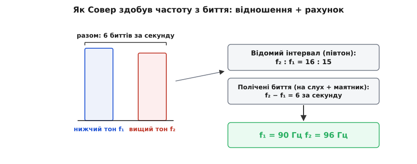

# 📜 Як Совер полічив частоту звуку, рахуючи биття

До кінця XVII століття освічена людина вже знала: висота тону — це швидкість тремтіння. Що частіше коливається струна чи стовп повітря, то вищий звук; Галілей писав про це, Мерсенн писав про це. Але знати природу — ще не знати числа. Спитайте когось із них: **скільки саме** коливань за секунду робить струна, коли скрипаль виводить своє «ля»? І відповіді немає. Тремтіння занадто швидке, щоб його побачити, і занадто дрібне, щоб полічити. Це наче почути, що тепло — то метушня атомів, і не мати термометра: природу знаєш, а числа — ні.

Число здобув чоловік, який ледве чув. І здобув не хитрим приладом, а рахунком: полічив удари биття від двох органних труб — і проста арифметика видала частоту.

---

## Що вже знали до нього

Тут годиться чесно назвати попередників, бо Совер стояв на плечах кількох поколінь.

Найдавніша ниточка тягнеться від Піфагора (Pythagoras): приємні співзвуччя відповідають простим відношенням довжини струни — октава це 2:1, квінта 3:2. Та для піфагорійців «число» означало **довжину**, а не швидкість; про коливання за секунду ніхто не думав.

Поворот стався в Італії. Вінченцо Галілей (Vincenzo Galilei), музикант і батько славетного Галілео, ставив досліди зі струнами й показав, що прості відношення живуть не лише в довжинах. А його син, Галілео Галілей (Galileo Galilei), у «Бесідах» (1638) прямо пов'язав висоту з частотою тремтіння й дав розгадку співзвуччя, яку сьогодні звуть **теорією збігів**: інтервал милує вухо тоді, коли поштовхи двох тонів часто збігаються. В октаві кожен другий поштовх вищого тону падає рівно на поштовх нижчого — струнко; у різкому інтервалі поштовхи майже ніколи не сходяться — і вухо чує шерхкість. Ось зерно всієї нашої історії: **співзвуччя — це про збіги поштовхів**.

А першим, хто справді **виміряв** частоту, був французький монах-мінім Марен Мерсенн (Marin Mersenne). У «Загальній гармонії» (*Harmonie universelle*, 1636) він застосував простий трюк. Узяв дуже довгу струну — з добрих п'ять метрів завдовжки, футів сімнадцять, — яка коливається так повільно, що окремі гойдання видно оком і їх можна полічити. А тоді, знаючи, що частота подвоюється з кожним укороченням струни навпіл, подерся вгору по октавах від видимого повільного розгойду до чутного тону. Вийшло близько 84 коливань за секунду для певної ноти. Це була перша в історії абсолютна оцінка частоти звуку — і Мерсеннові належить повна шана. Та метод хисткий: довга важка мотузка провисає й вихляє не як чистий камертон, а кожна перескочена октава подвоює будь-яку похибку. Числу бракувало твердості.

Отут і лишалася діра: прямий, надійний спосіб приколоти абсолютне число до **звичайного** чутного тону, без героїчного стрибка через десяток октав.

## Людина, що дала звукові число

Жозеф Совер (Joseph Sauveur) народився 1653 року в містечку Ла-Флеш, помер 1716-го в Парижі. Доля начебто відвела його якнайдалі від музики: він мовчав до семи років, усе життя мова давалася йому важко, а чув він погано. І все ж думав тільки про звук. Освіту здобув у єзуїтському колежі Ла-Флеша, став професором математики, а 1696 року — членом Паризької академії наук.

Іронію влучно змалював Бернар де Фонтенель (Bernard de Fontenelle), незмінний секретар Академії, у похвальному слові над Совером: чоловік без голосу й без слуху, що не міг думати ні про що, крім музики, мусив позичати чужий голос і чуже вухо — а натомість дарував музикантам відкриття.

І саме тут ключ до його методу. Той, хто не може звіритися на власне вухо в тонкощах висоти, не будуватиме науку на витонченому слуху знавця. Він побудує її так, щоб **чути означало рахувати** — щоб відповідь виходила з арифметики, а не з чуття. Тому Совер працював на **низьких** тонах, де все відбувається поволі: там подія рідка, її встигаєш злічити, і навіть кепське вухо чує, як гучність то набрякає, то спадає, хоч і не назве самої ноти.

## Хитрість: биття як відніматель частот

Складіть два близькі тони — і почуєте повільне «ва-ва-ва»: гучність б'ється рівно стільки разів за секунду, скільки становить різниця частот. Це саме по собі корисно, але замало: биття дає лише **різницю**. Шість ударів за секунду — це і 90 та 96, і 200 та 206, і будь-яка інша пара з різницею шість. Саму частоту звідси не витягнеш.

Геніальність Совера в тому, що він **додав до полічених ударів відоме відношення**. Візьмімо дві органні труби, налаштовані на відомий музичний інтервал — рівно на півтон. Півтон — це відношення частот 16:15, і воно відоме заздалегідь, бо задане самою музикою (довша труба звучить нижче, коротша вище). Тепер у руках два факти нараз:

```
f₂ : f₁ = 16 : 15       (відомий інтервал — півтон)
f₂ − f₁ = 6 за секунду  (полічені биття)
```

Два рівняння, дві невідомі — і система замикається сама на себе.


*Уся хитрість Совера на одній картинці. Дві труби звучать разом і дають 6 биттів за секунду — це різниця частот. Відношення частот (16:15) відоме наперед із музичного інтервалу. Двох цих фактів досить, щоб знайти обидві частоти нарізно: 90 і 96 герц. Жодного частотоміра — тільки відомий інтервал і рахунок ударів.*

**Приклад (як число виходить із двох фактів).** Труби звучать на півтон одна від одної й разом дають 6 биттів за секунду.

```
f₂ / f₁ = 16 / 15        →  f₂ = f₁ · 16/15
f₂ − f₁ = 6
f₁ · 16/15 − f₁ = 6
f₁ · (1/15)     = 6
f₁ = 90 Гц    →    f₂ = 96 Гц
```

Перевірмо: 96/90 = 16/15 (це справді півтон), а 96 − 90 = 6 (стільки ми й налічили). Обидва факти сходяться — отже, нижча труба дає рівно 90, вища 96 коливань за секунду. Уперше в історії до звичайного чутного тону приколото абсолютне число, і для цього не знадобилося нічого, крім відомого інтервалу та вміння лічити повільні удари.

> 🔧 **Навіщо це.** Один вимір дає лише **різницю** двох частот; одне відношення дає лише їхню **пропорцію**. Ані те, ані те окремо не назве абсолютного числа. Але покладіть їх разом — полічену різницю й відоме відношення — і кожна частота визначається однозначно. Совер здобув свої 90 і 96 герц без жодного приладу: інтервал підказала музика, різницю відлічило вухо. Ця зв'язка «відома пропорція + полічена різниця → абсолютне число» — і є те, чим биття перетворюється з цікавинки на **вимірювальний інструмент**.

Чому саме труби й саме низькі ноти? Труба тримає рівний тон, доки в неї дмуть, — на відміну від струни, що швидко згасає. Низька нота дає повільні удари: шість за секунду легко відлічити проти маятника чи годинника. А набрякання й спад гучності відчутні навіть кепському вуху, якому не до тонких висот. Метод немов скроєний під людину, що лічить, а не дослухається.

Заради чесності: різні джерела називають ужитий Совером півтон трохи по-різному — то діатонічний 16:15, то хроматичний 25:24. Дрібка не в цьому: хоч який точно інтервал, метод і результат порядку 90–100 герц тримаються. Важить сам хід — відома пропорція плюс полічена різниця дають абсолютне число, коли з приладів у тебе тільки годинник та інтервал.

## Нерухомий звук

Здобувши перше число, Совер захотів більшого — спільної точки відліку. Він запропонував **нерухомий звук** (фр. *son fixe*): один узгоджений тон у 100 коливань за секунду, до якого можна прив'язати будь-яку висоту й назвати її абсолютним числом. Тоді «ля» перестало б залежати від того, як настроєний орган у сусідньому місті, — а органи різнилися від міста до міста, і музика не мала твердого паколу. Разом з органним майстром на прізвище Деланд (Deslandes) Совер зміряв, що відкрита труба завдовжки п'ять паризьких футів звучить десь між 100 і 102 коливаннями за секунду, — і на 100 герцах закріпив свій еталон.

Це прямий пращур сьогоднішнього камертонного стандарту (нинішнє «ля» — 440 герц). Не варто вести від Совера пряму лінію до наших днів — стандарт складався ще довго й не раз мінявся. Але сама думка — **один умовлений абсолютний еталон висоти замість тисячі місцевих** — уперше прозвучала виразно саме в нього.

## Він дав науці й самі слова

Совер не лише виміряв звук — він дав молодій царині її словник. Саме він близько 1700 року запропонував назву **акустика** (фр. *acoustique*, від грецького ἀκουστός — «чутний») і оголосив окрему науку про звук узагалі, вищу за музику з її «приємним звуком». Слово, яким ми досі звемо цілу галузь фізики, — його карбування; мемуар із цією назвою надруковано в «Мемуарах» Академії за 1701 рік.

З-під його пера вийшли й інші звичні нам слова. Повільні пульсації гучності він назвав **биттям** (фр. *battements*). Призвуки, що бринять над основним тоном, коли струна коливається водночас на кратних частотах, він назвав **гармоніками**. А нерухомі точки й пучності на самій струні — **вузлами** (*nœuds*) і **пучностями** (*ventres*). Той, хто дав явищу ім'я, часто й розумів його найглибше.

## Що він насправді зробив

Згадаймо зерно з початку: теорія збігів казала, що співзвуччя — це про те, як **часто збігаються поштовхи** двох тонів. Биття — це той самий збіг, лише сповільнений до видимого: два майже однакові тони сходяться й розходяться так поволі, що збіг можна відлічити пальцем. Совер узяв естетичну ідею — чому акорд милує слух — і обернув її на **лінійку**: полічи повільні збіги, і дістанеш число. Людина, яка мусила позичати чуже вухо, дала слухові першу мірку.

А сам хід — обернути різницю, надто малу чи надто швидку, щоб зміряти її прямо, на повільне биття, яке лічиться, — виявився невмирущим. Совер налічив шість набряків гучності від двох труб; тим самим ходом сьогодні кожен супергетеродинний приймач зсуває високу частоту вниз, а радар і лідар видобувають дальність із частоти биття відбитого сигналу. Трюк не зістарився за три століття — а почався з чоловіка, що рахував удари, бо не міг звіритися на слух.
