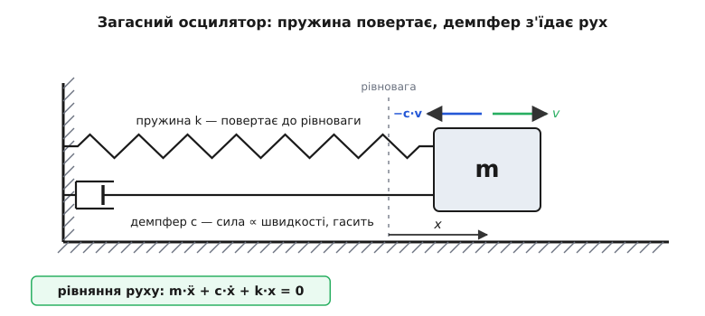
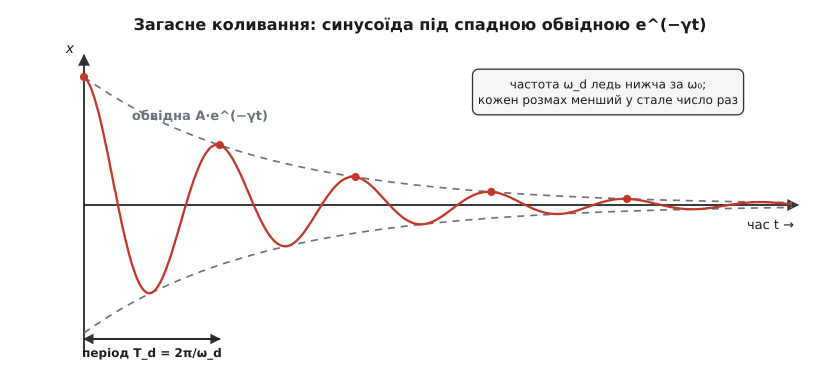
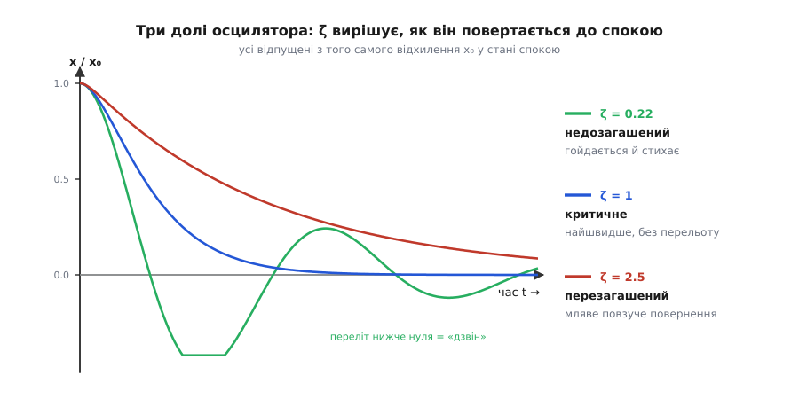

# Загасний осцилятор: чому будь-яке гойдання рано чи пізно стихає

<preknowlist>
- [Гармонічний осцилятор](book:physics/harmonic-oscillator) — маса на пружині й власна частота ω₀ = √(k/m); ідеальні незгасні коливання, до яких ми додамо тертя.
- [Синусоїда](book:physics/sine-wave) — форма періодичного руху; що означають амплітуда й частота коливання.
- [Експоненційне ОДУ](book:math/exponential-ode) — чому величина, чия швидкість спаду щомиті пропорційна їй самій, згасає за законом e⁻ᵞᵗ.
- [В'язкість](book:physics/viscosity) — в'язке тертя, де сила опору пропорційна швидкості руху.
</preknowlist>

Вдарте по камертоні — він задзвенить чистою нотою, але за кілька секунд звук стихне. Смикніть гітарну струну — вона гойднеться й замовкне. Штовхніть гойдалку й відійдіть — розмах щоразу меншає, аж поки вона не завмре. Переїдьте колесом через вибоїну — кузов підстрибне раз-другий і заспокоїться. Щоразу щось коливалося — і щоразу коливання само собою згасло.

А тепер уявіть осцилятор без жодного тертя: бездоганну масу на бездоганній пружині у вакуумі. Відхилите її — і вона гойдатиметься вічно, з незмінним розмахом, ніколи не спиняючись. Таких у природі немає. Кожне реальне гойдання поступово віддає свою енергію — на тертя, на нагрів, на опір повітря, на звук — і тому неминуче стихає. Осцилятор (лат. *oscillare* — гойдатися), що втрачає енергію й через це затухає, називають **загасним**, а саме затухання — **загасанням**, або **демпфуванням** (від англ. *to damp* — гасити, глушити).

Варто відповісти на кілька питань. За яким законом стихає коливання — рівномірно, ривками чи якось інакше? Від чого залежить, згасне воно за пів секунди чи дзвенітиме хвилину? І чому та сама фізика керує і дзвоном камертона, і плавністю ходу автомобіля, і тим, як стрілка приладу зупиняється на поділці, не перескакуючи її туди-сюди.

### Ідеальне гойдання, якого не буває

Почнімо з того, що коливається без утрат. [Гармонічний осцилятор](book:physics/harmonic-oscillator) — маса m на пружині жорсткістю k — має одну-єдину силу, що керує ним: **повертальну**. Відхилиться маса праворуч — пружина тягне ліворуч; піде ліворуч — штовхає праворуч. Сила завжди націлена назад до рівноваги й пропорційна відхиленню (закон Гука, F = −k·x). Через це маса гойдається чистою синусоїдою на власній частоті ω₀ = √(k/m), і — оскільки жодна сила не забирає в неї енергії — гойдається вічно, з тим самим розмахом.

Але за таким осцилятором водиться борг, якого він у реальному світі не сплачує: **тертя**. Повітря чіпляється за рухому масу, метал пружини трохи нагрівається на кожному згині, у шарнірах щось треться. Усі ці дрібнички роблять одне — забирають у коливання енергію й нікуди її не повертають. І щойно з'являються втрати, картина міняється в одному, дуже характерному напрямку: **частота лишається майже тією самою, а розмах меншає з кожним циклом**. Камертон дзвенить своєю нотою — не нижчою, не вищою, — але щораз тихіше. Ось цей повільний спад амплітуди при майже незмінному ритмі й треба пояснити.

### Сила, що з'їдає рух

Щоб описати втрати, до повертальної сили додамо другу — **силу загасання**. У неї цілком інша природа, і це головне, що варто відчути. Повертальна сила залежить від того, **де** маса (від відхилення x): байдуже, стоїть маса чи мчить, — відтягнута на однакову відстань, пружина тягне однаково. Сила загасання натомість залежить від того, **як швидко** маса рухається (від швидкості v): нерухому масу тертя не гальмує взагалі, а що прудкіше вона йде, то дужче її стримує.

Найпоширеніший і найпростіший вид загасання — **в'язке**: сила опору просто пропорційна швидкості й напрямлена проти неї.

```
F_загас = −c · v
```

Множник c називають **коефіцієнтом загасання** (демпфування), а знак «мінус» каже, що сила завжди дивиться назустріч рухові, гальмуючи його. Саме так поводиться [в'язке](book:physics/viscosity) тертя — опір рідини чи повітря на помірних швидкостях: поршень, що йде крізь мастило, човен, що ковзає водою, крило, що розтинає повітря. (Буває й інакше тертя — сухе, ковзання металу по металу дає силу майже сталої величини незалежно від швидкості, — але в'язка модель −c·v описує левову частку реальних осциляторів і, головне, піддається простому розрахунку.)

Тепер зберімо на масу обидві сили — повертальну й загасну — і прирівняймо до m·a за другим законом Ньютона (прискорення a — це друга похідна координати, ẍ; швидкість v — перша, ẋ):

```
m·ẍ = −k·x − c·ẋ
```

Перенесімо все вліво — і дістанемо рівняння, що є серцем усієї теми, **рівняння вільного загасного осцилятора**:

```
m·ẍ + c·ẋ + k·x = 0
```

Три доданки — три дійові особи: інерція маси (m·ẍ), загасання (c·ẋ) і повертальна пружність (k·x). Прибрати середній доданок — і повернеться вічне незгасне гойдання; саме він робить осцилятор загасним.


*Модель: маса m, пружина k, що повертає її до рівноваги, і демпфер c, що чинить силу −c·v проти будь-якого руху. Коли маса йде праворуч зі швидкістю v, демпфер тягне ліворуч, з'їдаючи енергію. Рух керується рівнянням m·ẍ + c·ẋ + k·x = 0.*

> 🔧 **Навіщо це.** Демпфер із малюнка — не абстракція, а справжня деталь. Автомобільний **амортизатор** — це буквально циліндр з поршнем, що продавлює мастило крізь вузькі отвори; сила, з якою мастило опирається, пропорційна швидкості поршня — те саме −c·v. Пружина підвіски (k) прагне гойдати кузов після кожної вибоїни, а амортизатор (c) це гойдання гасить. Без нього машина після кожної ями стрибала б, наче на батуті; з правильно підібраним c кузов осідає плавно й певно. Той самий доданок c·ẋ ховається в дверному доводчику, у гасителі вібрацій приладу, у голці програвача — усюди, де щось має заспокоїтися, а не дзвеніти.

### Розв'язок — синусоїда під спадною ковдрою

Яка ж функція часу задовольняє це рівняння? Пошукаймо відповідь не формально, а на здоровий глузд. Нам потрібне щось, що гойдається (бо є повертальна сила) і водночас меншає (бо є втрати). Найпростіший кандидат — **синусоїда, чию амплітуду хтось поступово прикручує**. І справді, для не надто сильного загасання розв'язком виявляється саме така крива:

```
x(t) = A · e⁻ᵞᵗ · cos(ω_d · t + φ)
```

Придивімося до неї. Множник cos(ω_d·t + φ) — це звичне гойдання, як у незгасного осцилятора. А множник **e⁻ᵞᵗ** — це «ковдра», спадна обвідна, що щомиті трохи стискає розмах. Чому саме експонента? Бо втрати влаштовані самоподібно: що більший розмах (і швидкість), то більша сила загасання й то швидше спадає амплітуда, — а величина, чия швидкість спаду пропорційна їй самій, згасає рівно за [експонентою](book:math/exponential-ode) e⁻ᵞᵗ. Показник γ = c/(2m) називають **темпом загасання**: що більший c (сильніший демпфер) або менша маса, то стрімкіше стискається ковдра.


*Вільний «дзвін» загасного осцилятора. Синусоїда гойдається майже своїм звичним ритмом, але кожен розмах менший за попередній — і меншає в одне й те саме число разів щоцикла (обвідна e⁻ᵞᵗ, пунктир). Частота ω_d ледь нижча за власну ω₀ незгасного осцилятора.*

Тут ховаються дві тонкощі, кожна варта уваги. Перша: розмах спадає не на однакову величину щоцикла, а в однакове **число разів** — за один період амплітуда множиться на стале e⁻ᵞᵀ (менше за одиницю). Тому вершини синусоїди сідають, наче сходинки геометричної прогресії: скажімо, кожна вдвічі нижча за попередню. Друга тонкість — у частоті. Загасне гойдання йде трохи **повільніше** за незгасне: його частота

```
ω_d = ω₀ · √(1 − ζ²)
```

завжди трохи менша за власну ω₀. Причина проста: частину «повертального пориву» кожного циклу маса витрачає не на розгін до рівноваги, а на боротьбу з опором, тож повний цикл дається їй трохи довше. При слабкому загасанні ця різниця мізерна (для струни чи камертона її не почути), але вона є завжди. А що таке ζ у цій формулі — власне, головне число всієї теми, — з'ясуємо просто зараз.

### Три долі осцилятора

Уся поведінка загасного осцилятора — чи він гойдається, чи повзе, чи повертається ривком — залежить від одного безрозмірного числа, у якому зважено силу загасання проти інерції й пружності. Його називають **коефіцієнтом (мірою) загасання** ζ:

```
ζ = c / (2·√(m·k))
```

Чому саме таке поєднання — стане ясно з того, що воно робить. Число ζ порівнює, наскільки сильні втрати (c) проти «жвавості» осцилятора (√(m·k)). І залежно від того, чи ζ менше, дорівнює чи більше за одиницю, осцилятор дістає одну з трьох цілком різних доль.

**ζ < 1 — недозагашений** (*underdamped*). Загасання слабке проти пружності; осцилятор устигає гойднутися багато разів, перш ніж стихне. Це той самий спадний дзвін із попереднього малюнка. Так поводяться камертон, струна, дзвін, гойдалка й — навмисне — автомобільна підвіска.

**ζ = 1 — критичне загасання** (*critically damped*). Особлива межа. Осцилятор уже не встигає зробити жодного повного гойдання: відпущений, він повертається до рівноваги **якнайшвидше, і при цьому жодного разу її не перестрибнувши**. Критичне (гр. *kritikós* — вирішальний) — бо це рівно та межа, за якою коливання зникає.

**ζ > 1 — перезагашений** (*overdamped*). Загасання таке сильне, що осцилятор ледве повзе назад до рівноваги, довго й мляво, наче крізь мед. Гойдання нема й близько — але, всупереч інтуїції, повертається він **повільніше** за критичний.


*Три осцилятори, відпущені з того самого відхилення. Недозагашений (ζ = 0.22) гойдається, перестрибуючи рівновагу, і поволі стихає. Критичний (ζ = 1) повертається найшвидше — і жодного разу не переходить за нуль. Перезагашений (ζ = 2.5) теж не гойдається, але повзе до спокою мляво й довго.*

Ось найнесподіваніше в цій картині: **найшвидше осцилятор заспокоюється не при найбільшому загасанні, а рівно при критичному**. Здавалося б, чим дужче гальмуєш, тим швидше все спиниться, — але ні. Додаси загасання понад критичне — і рух не пришвидшиться, а загрузне: перезагашений осцилятор повертається повільніше, бо сам демпфер стає такий тугий, що не дає масі рухатися. Критичне ζ = 1 — золота середина між «гойдається зайве» і «повзе задовго».

> 🔧 **Навіщо це.** Ця золота середина — щоденний клопіт інженера. Стрілка аналогового вимірювача має стати на поділку **швидко й без стрибків** туди-сюди, інакше її не прочитати, — тому чутливі гальванометри роблять близькими до критичного загасання (їх так і звуть — «аперіодичними», *dead-beat*). Дверний доводчик підбирають трохи перезагашеним, щоб двері зачинялися певно й не грюкали. Автомобільну підвіску, навпаки, роблять помітно недозагашеною (ζ ≈ 0.2–0.3): критичне загасання зробило б хід жорстким і незручним, тож інженери свідомо лишають кузову право раз-другий м'яко гойднутися заради комфорту. У теорії керування те саме число визначає, як швидко система «осідає» на заданому значенні й чи не перестрибне його — від автопілота до термостата.

### Скільки дзвонить: добротність

Для недозагашеного осцилятора природно спитати: **скільки циклів він продзвенить, перш ніж стихне**? Дешевий дзвіночок дзенькне раз і глухне; кришталевий келих співає довго; кварцовий кристал у годиннику коливається мільйони разів. Цю «дзвінкість» вимірює одне число — **добротність** (*quality factor*, Q):

```
Q = 1 / (2ζ) = ω₀ / (2γ)
```

Що менше загасання ζ, то вище Q й то довше триває дзвін. Груба, але влучна прикидка: осцилятор устигає зробити приблизно Q/π повних гойдань, поки його розмах не впаде до третини. Дешевий дзвіночок має Q близько кількох одиниць, добрий камертон — кількасот, кварц — десятки тисяч; тому кварц і задає такт годиннику так рівно. Добротність — та сама величина, що [керує гостротою резонансу](book:physics/q-factor), тож той самий Q ще не раз зустрінеться там, де осцилятор розгойдують ззовні. Цікаво, що і звичка міряти втрати осцилятора числом, і сама буква Q прийшли не з механіки, а з радіотехніки початку XX століття — [історію народження поняття загасання, критичного демпфування й «добротності»](book:physics/damped-oscillator/hist-damping.md) варто знати окремо.

Корисно поглянути на згасання й з боку **енергії**. Енергія коливання пропорційна квадрату амплітуди, а раз амплітуда спадає за e⁻ᵞᵗ, то енергія — за e⁻²ᵞᵗ, тобто вдвічі стрімкіше. Це не дивина: втрачена на тертя енергія й є та, що зникає з коливання, і зникає вона тим швидше, чим більший розмах. А оскільки кожна вершина дзвону менша за попередню в стале число разів, це «число разів» можна просто **виміряти** з запису коливання — і з нього видобути і ζ, і Q, навіть не знаючи наперед ані маси, ані жорсткості. Як це роблять на практиці — за відліками акселерометра чи мікрофона — показано в [алгоритмічній вставці про вимірювання загасання з дзвону](book:physics/damped-oscillator/proj-ringdown.md). А повне виведення розв'язку — звідки строго беруться всі три режими, формула ω_d і зв'язок Q з ζ — у [математичній вставці](book:physics/damped-oscillator/math-damped-solution.md).

**Приклад (кузов авто на підвісці).** Чверть кузова масою m = 300 кг стоїть на пружині k = 30000 Н/м з амортизатором c = 1800 Н·с/м. Як він поводиться після вибоїни?

```
власна частота:   ω₀ = √(k/m) = √(30000/300) = √100 = 10 рад/с
                  f₀ = ω₀/(2π) = 10/6.283      ≈ 1.59 Гц   ← темп «підстрибування»

міра загасання:   ζ = c/(2·√(m·k)) = 1800/(2·√(300·30000))
                    = 1800/(2·3000) = 1800/6000 = 0.30      ← ζ<1 → недозагашений

частота дзвону:   ω_d = ω₀·√(1−ζ²) = 10·√(1−0.09) = 10·0.954 ≈ 9.54 рад/с
темп загасання:   γ  = ζ·ω₀ = 0.30·10 = 3.0 с⁻¹
за час:           τ  = 1/γ = 0.33 с  розмах спадає в e ≈ 2.72 раза
```

Отже, після ями кузов гойдається з частотою близько 1.6 Гц, але за третину секунди розмах падає до 37 %, — тож за яку секунду, ледь встигнувши хитнутися разів зо два, машина заспокоюється: м'яко, але певно. Якби інженери взяли c для критичного загасання (ζ = 1, тобто c = 2·√(m·k) = 6000 Н·с/м), кузов повертався б без жодного перельоту, зате хід відчувався б жорстким; якби c зробили замалим — авто гойдалося б і «плавало» на дорозі. Уся майстерність підвіски — у виборі цього одного числа.

### Те саме рівняння всюди

Наостанок варто побачити, що загасний осцилятор — це не про пружини. Візьміть електричний [коливальний контур](book:physics/lc-circuit): заряд перетікає з конденсатора в котушку й назад, електрична енергія гойдається туди-сюди — точнісінько як маса на пружині. Додайте в контур **опір** R — і заряд почне так само дзвеніти зі спадним розмахом і глухнути: опір грає роль коефіцієнта загасання c, розсіюючи енергію на тепло, а індуктивність і ємність — роль маси й пружини. Рівняння виходить буква в букву те саме, m·ẍ + c·ẋ + k·x = 0 з іншими іменами, — тому все, сказане про пружину, задарма справджується і для електричного контуру.

І ще один місток, найважливіший. Досі осцилятор був **вільний** — його штовхнули раз і полишили згасати. А що, коли натомість гойдати його безперестанку зовнішньою періодичною силою? Тоді до рівняння додається двигун праворуч, і народжується [резонанс](book:physics/mechanical-resonance): якщо частота двигуна збігається з власною ω₀, амплітуда злітає вгору. І ось де змикається коло — **висоту того резонансного піка задає рівно те загасання, з яким ми тут розбиралися**: слабке загасання (високе Q) дає гострий високий пік, сильне (низьке Q) — пологий горб. Загасний осцилятор — це кістяк, на якому тримаються і резонанс, і смугові фільтри, і сейсмограф, і мікромеханічний гіроскоп: усюди спершу є маса, пружність і втрати, а вже потім — те, чим їх штовхають.

---

Отже, **загасний осцилятор** — це коливальна система, яка втрачає енергію й тому згасає. До повертальної сили −k·x додається сила загасання −c·v (пропорційна швидкості), і рух підкоряється рівнянню m·ẍ + c·ẋ + k·x = 0. При слабкому загасанні розв'язок — **синусоїда під спадною обвідною**, x(t) = A·e⁻ᵞᵗ·cos(ω_d·t + φ): розмах меншає в стале число разів щоцикла, а частота ω_d = ω₀·√(1−ζ²) ледь нижча за власну. Долю осцилятора вирішує **міра загасання** ζ = c/(2√(mk)): при ζ < 1 він гойдається й стихає (недозагашений), при ζ = 1 повертається найшвидше без перельоту (критичне), при ζ > 1 повзе мляво (перезагашений). Дзвінкість недозагашеного вимірює **добротність** Q = 1/(2ζ) — скільки циклів він продзвенить; енергія при цьому спадає за e⁻²ᵞᵗ. Те саме рівняння керує електричним RLC-контуром, а варто додати зовнішній двигун — виростає резонанс, чию висоту задає це ж таки загасання.

---
